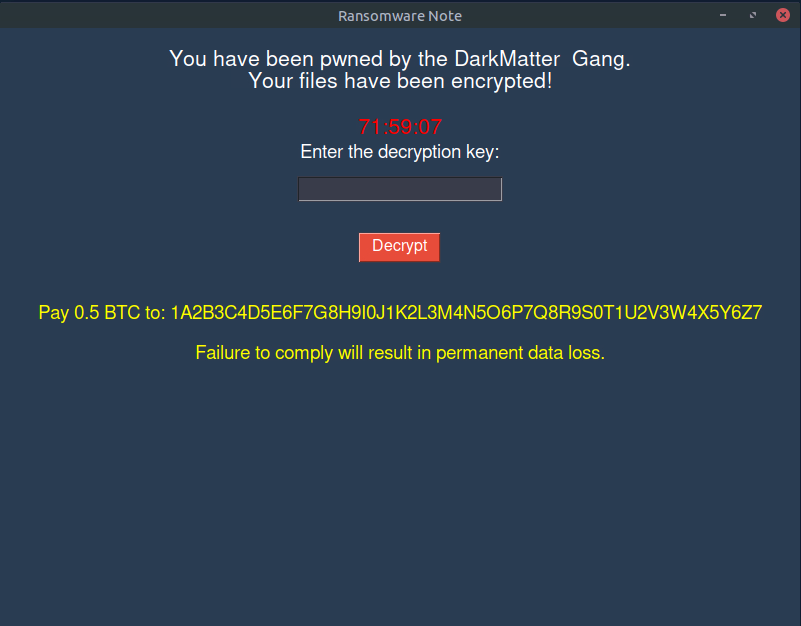
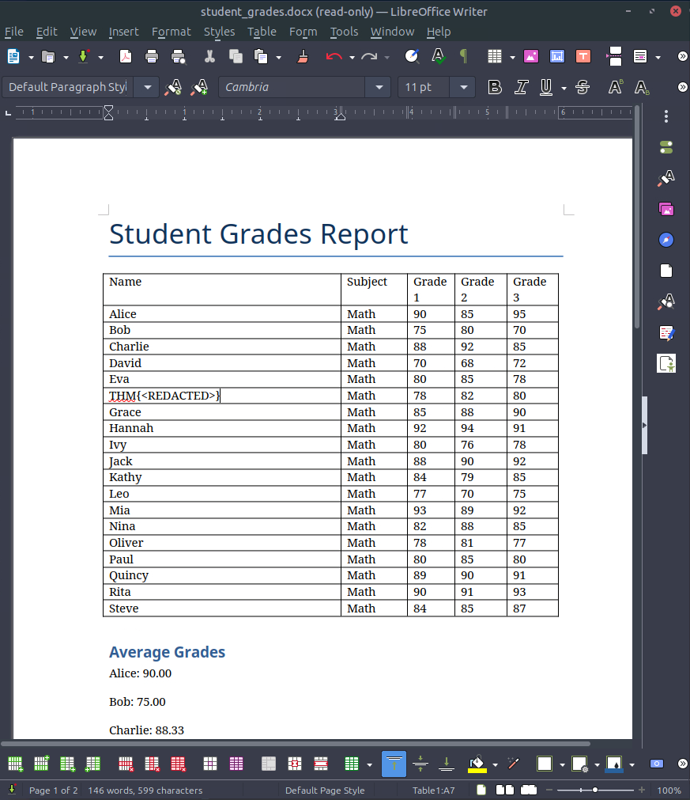

# DarkMatter

- [Room information](#room-information)
- [Solution](#solution)
- [References](#references)

## Room information

```text
Type: Challenge
Difficulty: Easy
Tags: Linux
Meta Tags: Walkthrough, Walk-through, Write-up, Writeup
Subscription type: Premium
Description:
Practice how to exploit a weak RSA implementation to recover the private key and decrypt 
a ransomware-encrypted files.
```

Room link: [https://tryhackme.com/room/hfb1darkmatter](https://tryhackme.com/room/hfb1darkmatter)

## Solution

### Task 1: DarkMatter

#### Set up your virtual environment

To successfully complete this room, you'll need to set up your virtual environment. This involves starting both your AttackBox (if you're not using your VPN) and Lab Machines, ensuring you're equipped with the necessary tools and access to tackle the challenges ahead.

#### Dark Matter

The Hackfinitiy high school has been hit by DarkInjector's ransomware, and some of its critical files have been encrypted. We need you and Void to use your crypto skills to find the RSA private key and restore the files. After some research and reverse engineering, you discover they have forgotten to remove some debugging from their code. The ransomware saves this data to the tmp directory.

Click the start lab machine button below, the VM will open in your browser:

Can you find the RSA private key?

**Note**:

You can close the window prompting for a password after the VM has booted; this will not affect the challenge.
If you close the ransomware note before solving the challenge, you might need to reboot the VM.



---------------------------------------------------------------------------------------

#### What is the flag?

Let's start by checking out the contents of the `/tmp` directory for the debugging information.

```bash
ubuntu@tryhackme:~$ cd /tmp
ubuntu@tryhackme:/tmp$ ls -la
total 100
drwxrwxrwt 18 root   root   12288 Aug 26 17:54 .
drwxr-xr-x 22 root   root    4096 Aug 26 17:51 ..
drwxrwxrwt  2 root   root    4096 Aug 26 17:51 .ICE-unix
-r--r--r--  1 root   root      11 Aug 26 17:51 .X0-lock
-r--r--r--  1 ubuntu ubuntu    11 Aug 26 17:51 .X1-lock
drwxrwxrwt  2 root   root    4096 Aug 26 17:51 .X11-unix
drwxrwxrwt  2 root   root    4096 Aug 26 17:50 .XIM-unix
drwxrwxrwt  2 root   root    4096 Aug 26 17:50 .font-unix
-rw-r--r--  1 ubuntu ubuntu   235 Aug 26 17:52 dock-replace.log
-rw-r--r--  1 root   root      16 Aug 26 17:51 encrypted_aes_key.bin
srwxr-xr-x  1 ubuntu ubuntu     0 Aug 26 17:54 pluma.ubuntu.3571730147
-rw-r--r--  1 root   root      50 Aug 26 17:51 public_key.txt
drwx------  3 root   root    4096 Aug 26 17:51 snap-private-tmp
drwx------  3 root   root    4096 Aug 26 17:51 systemd-private-10e2d55136da465ab69aea45d3bf2583-ModemManager.service-FHxtZm
drwx------  3 root   root    4096 Aug 26 17:51 systemd-private-10e2d55136da465ab69aea45d3bf2583-colord.service-XeFlFK
drwx------  3 root   root    4096 Aug 26 17:53 systemd-private-10e2d55136da465ab69aea45d3bf2583-fwupd.service-aqkiO6
drwx------  3 root   root    4096 Aug 26 17:51 systemd-private-10e2d55136da465ab69aea45d3bf2583-polkit.service-O41SGs
drwx------  3 root   root    4096 Aug 26 17:51 systemd-private-10e2d55136da465ab69aea45d3bf2583-power-profiles-daemon.service-GJST5n
drwx------  3 root   root    4096 Aug 26 17:51 systemd-private-10e2d55136da465ab69aea45d3bf2583-switcheroo-control.service-rMi6En
drwx------  3 root   root    4096 Aug 26 17:51 systemd-private-10e2d55136da465ab69aea45d3bf2583-systemd-logind.service-RozSbW
drwx------  3 root   root    4096 Aug 26 17:50 systemd-private-10e2d55136da465ab69aea45d3bf2583-systemd-resolved.service-eLe8kP
drwx------  3 root   root    4096 Aug 26 17:50 systemd-private-10e2d55136da465ab69aea45d3bf2583-systemd-timesyncd.service-MabOyj
drwx------  3 root   root    4096 Aug 26 17:51 systemd-private-10e2d55136da465ab69aea45d3bf2583-upower.service-aSmmnr
drwx------  2 ubuntu ubuntu  4096 Aug 26 17:51 tigervnc.ug0i1b
ubuntu@tryhackme:/tmp$ cat public_key.txt 
n=340282366920938460843936948965011886881
e=65537
ubuntu@tryhackme:/tmp$ 
```

We will solve this using a small Python script, using FactorDB for the factorization of `n`.

```python
#!/usr/bin/env python

from factordb.factordb import FactorDB

# From /tmp/public_key.txt
n=340282366920938460843936948965011886881
e=65537

# Factor n into p and q
f = FactorDB(n)
f.connect()
p, q = f.get_factor_list()
print(f"p = {p} and q = {q}")

# Calculate Euler totient
phi=(p-1)*(q-1)
print(f"Phi = {phi}")

# Calculate private key exponent
d = pow(e, -1, phi)
print(f"d = {d}")
```

Then we execute the script to get all we need.

```bash
┌──(kali㉿kali)-[/mnt/…/TryHackMe/Challenges/Easy/DarkMatter]
└─$ source ~/Python_venvs/FactorDB/bin/activate

┌──(FactorDB)─(kali㉿kali)-[/mnt/…/TryHackMe/Challenges/Easy/DarkMatter]
└─$ ./solve.py
p = 18446744073709551533 and q = 18446744073709551557
Phi = 340282366920938460807043460817592783792
d = 196442361873243903843228745541797845217
```

The wanted decryption key is `d`.

We input it and the files are decrypted for us.

To get the flag we open the decrypted `student_grades.docx` file (with columns changed for readablity and the flag redacted below).



Answer: `THM{<REDACTED>}`

---------------------------------------------------------------------------------------

For additional information, please see the references below.

## References

- [FactorDB - Homepage](https://factordb.com/)
- [factordb-python - GitHub](https://github.com/ryosan-470/factordb-python)
- [factordb-pycli - PyPI](https://pypi.org/project/factordb-pycli/)
- [Python (programming language) - Wikipedia](https://en.wikipedia.org/wiki/Python_(programming_language))
- [Ransomware - Wikipedia](https://en.wikipedia.org/wiki/Ransomware)
- [RSA (cryptosystem) - Wikipedia](https://en.wikipedia.org/wiki/RSA_(cryptosystem))
- [The RSA Cryptosystem - Concepts](https://cryptobook.nakov.com/asymmetric-key-ciphers/the-rsa-cryptosystem-concepts)
