# Intro to x86-64

- [Room information](#room-information)
- [Solution](#solution)
- [References](#references)

## Room information

```text
Type: Challenge
Difficulty: Easy
Tags: -
Meta Tags: Walkthrough, Walk-through, Write-up, Writeup
Subscription type: Free
Description:
This room teaches the basics of x86-64 assembly language
```

Room link: [https://tryhackme.com/room/introtox8664](https://tryhackme.com/room/introtox8664)

## Solution

### Task 1: Description and Objectives

This room will look at the basic primitives of Intel's x86-64 assembly language, and will use these primitives to understand the construction of basic programs using loops, functions and procedures. The tasks attached to this room will use the [r2 reverse engineering framework](https://github.com/radare/radare2), which will come installed in the machine attached to this room. The username of the machine attached to the next task is **tryhackme** and the password is **reismyfavl33t**. To access the machine, SSH into it on port 22.

- Username: `tryhackme`
- Password: `reismyfavl33t`

```bash
┌──(kali㉿kali)-[/mnt/…/TryHackMe/Challenges/Easy/Intro_to_x86-64]
└─$ export TARGET_IP=10.82.161.159

┌──(kali㉿kali)-[/mnt/…/TryHackMe/Challenges/Easy/Intro_to_x86-64]
└─$ ssh tryhackme@$TARGET_IP    
The authenticity of host '10.82.161.159 (10.82.161.159)' can't be established.
ED25519 key fingerprint is SHA256:4Tjt5b7ZH5Z0XKIYf7Rg9Q2ES/6J3IqtKs5ZfY5NfB8.
This key is not known by any other names.
Are you sure you want to continue connecting (yes/no/[fingerprint])? yes
Warning: Permanently added '10.82.161.159' (ED25519) to the list of known hosts.
tryhackme@10.82.161.159's password: 
Welcome to Ubuntu 18.04.2 LTS (GNU/Linux 4.15.0-1035-aws x86_64)

 * Documentation:  https://help.ubuntu.com
 * Management:     https://landscape.canonical.com
 * Support:        https://ubuntu.com/advantage

  System information as of Wed Sep  2 10:36:39 UTC 2026

  System load:  0.02              Processes:           98
  Usage of /:   32.2% of 7.69GB   Users logged in:     0
  Memory usage: 16%               IP address for ens5: 10.82.161.159
  Swap usage:   0%

 * Ubuntu's Kubernetes 1.14 distributions can bypass Docker and use containerd
   directly, see https://bit.ly/ubuntu-containerd or try it now with

     snap install microk8s --classic

  Get cloud support with Ubuntu Advantage Cloud Guest:
    http://www.ubuntu.com/business/services/cloud

77 packages can be updated.
0 updates are security updates.


Last login: Sat May 11 22:34:17 2019 from 92.233.131.51
tryhackme@ip-10-82-161-159:~$ 
```

Here are a few things to note before beginning the room:

- This room will use the AT&T syntax. In general, people either use the AT&T syntax or the Intel Syntax (differences are highlighted [here](http://web.mit.edu/rhel-doc/3/rhel-as-en-3/i386-syntax.html)).
- This room aims to be a gentle introduction to radare2. While they are not shown here, radare has a lot of powerful features and tools which can be found [here](https://github.com/radare/radare2/blob/master/doc/intro.md), [here](https://gist.github.com/williballenthin/6857590dab3e2a6559d7) and [here](https://web.archive.org/web/20180312191821/http://www.radare.org/get/THC2018.pdf)
- As soon as your start r2, remember to enter `e asm.syntax=att` to ensure that you are using the AT&T syntax.
- The addresses shown on the images in the tasks below may be different from the addresses you view when you disassemble the files.

---------------------------------------------------------------------------

### Task 2: Introduction

Computers execute machine code, which is encoded as bytes, to carry out tasks on a computer. Since different computers have different processors, the machine code executed on these computers is specific to the processor. In this case, we’ll be looking at the Intel x86-64 instruction set architecture which is most commonly found today. Machine code is usually represented by a more readable form of the code called assembly code. This machine is code is usually produced by a compiler, which takes the source code of a file, and after going through some intermediate stages, produces machine code that can be executed by a computer. Without going into too much detail, Intel first started out by building 16-bit instruction set, followed by 32 bit, after which they finally created 64 bit. All these instruction sets have been created for backward compatibility, so code compiled for 32 bit architecture will run on 64 bit machines. As mentioned earlier, before an executable file is produced, the source code is first compiled into assembly(.s files), after which the assembler converts it into an object program(.o files), and operations with a linker finally make it an executable.

The best way to actually start explaining assembly is by diving in. We’ll be using radare2 to do this - **radare2** is a framework for reverse engineering and analysing binaries. It can be used to disassemble binaries(translate machine code to assembly, which is actually readable) and debug said binaries (by allowing a user to step through the execution and view the state of the program).

The first step is to execute the program intro by running

`./intro`

Which then just shows the following output

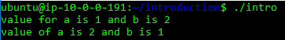

From the execution, it can be seen that the program is creating two variables and switching their values. Time to see what it’s actually doing under the hood!

Go to the introduction folder on the virtual machine and run the command:

`r2 -d intro`

This will open the binary in debugging mode. Once the binary is open, one of the first things to do is ask `r2` to analyze the program, and this can be done by typing in:

`aa`

Which is the most common analysis command. It analyses all symbols and entry points in the executable.

Then run

`e asm.syntax=att`

to set the disassembly syntax to AT&T.

The analysis in this case involves extracting function names, flow control information and much more! `r2` instructions are usually based on a single character, so it is easy to get more information about the commands. For general help, run:

`?`

For more specific information, for example, about analysis, run

`a?`

Once the analysis is complete, you would want to know where to start analysing from - most programs have an entry point defined as main. To find a list of the functions run:

`afl`

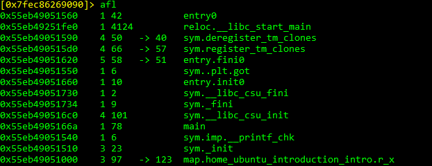

As seen here, there actually is a function at main. Let’s examine the assembly code at main by running the command

`pdf @main`

Where `pdf` means print disassembly function. Doing so will give us the following view

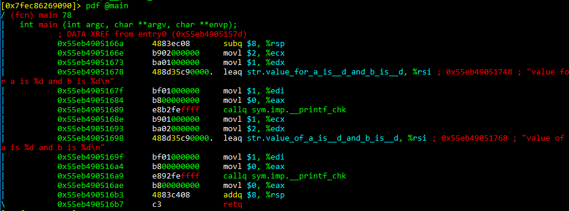

As we can see from above, the values on the complete left column are memory addresses of the instructions, and these are usually stored in a structure called the stack(which we will talk about later). The middle column contains the instructions encoded in bytes(what is usually the machine code), and the last column actually contains the human readable instructions.

The core of assembly language involves using registers to do the following:

- Transfer data between memory and register, and vice versa
- Perform arithmetic operations on registers and data
- Transfer control to other parts of the program

Since the architecture is x86-64, the registers are 64 bit and Intel has a list of 16 registers:

|64 bit|32 bit|
|----|----|
|%rax|%eax|
|%rbx|%ebx|
|%rcx|%ecx|
|%rdx|%edx|
|%rsi|%esi|
|%rdi|%edi|
|%rsp|%esp|
|%rbp|%ebp|
|%r8|%r8d|
|%r9|%r9d|
|%r10|%r10d|
|%r11|%r11d|
|%r12|%r12d|
|%r13|%r13d|
|%r14|%r14d|
|%r15|%r15d|

Even though the registers are 64 bit, meaning they can hold up to 64 bits of data, other parts of the registers can also be referenced. In this case, registers can also be referenced as 32 bit values as shown. What isn’t shown is that registers can be referenced as 16 bit and 8 bit(higher 4 bit and lower 4 bit).

The first 6 registers are known as general purpose registers. The `%rsp` is the stack pointer and it points to the top of the stack which contains the most recent memory address. The stack is a data structure that manages memory for programs. `%rbp` is a frame pointer and points to the frame of the function currently being executed - every function is executed in a new frame. To move data using registers, the following instruction is used:

`movq source, destination`

This involves:

- Transferring constants (which are prefixed using the $ operator) e.g. `movq $3 rax` would move the constant 3 to the register
- Transferring values from a register e.g. `movq %rax %rbx` which involves moving value from rax to rbx
- Transferring values from memory which is shown by putting registers inside brackets e.g. `movq %rax (%rbx)` which means move value stored in `%rax` to memory location represented by `%rbx`.

The last letter of the mov instruction represents the size of the data:

|Intel Data Type|Suffix|Size (bytes)|
|----|----|----|
|Byte|b|1|
|Word|w|2|
|Double Word|l|4|
|Quad Word|q|8|
|Single Precision|s|4|
|Double Precision|l|8|

When dealing with memory manipulation using registers, there are other cases to be considered:

- (Rb, Ri) = MemoryLocation[Rb + Ri]
- D(Rb, Ri) = MemoryLocation[Rb + Ri + D]
- (Rb, Ri, S) = MemoryLocation(Rb + S * Ri]
- D(Rb, Ri, S) = MemoryLocation[Rb + S * Ri + D]

Some other important instructions are:

- `leaq source, destination`: this instruction sets destination to the address denoted by the expression in source
- `addq source, destination`: destination = destination + source
- `subq source, destination`: destination = destination - source
- `imulq source, destination`: destination = destination * source
- `salq source, destination`: destination = destination << source where << is the left bit shifting operator
- `sarq source, destination`: destination = destination >> source where >> is the right bit shifting operator
- `xorq source, destination`: destination = destination XOR source
- `andq source, destination`: destination = destination & source
- `orq source, destination`: destination = destination | source

Before understanding how programs work, it is important to understand registers, memory manipulation and some basic instructions. The next sections will have more hands on use of radare2.

---------------------------------------------------------------------------

#### Read and experiment with the above

```bash
tryhackme@ip-10-82-161-159:~$ cd introduction/
tryhackme@ip-10-82-161-159:~/introduction$ ls
intro  intro.c
tryhackme@ip-10-82-161-159:~/introduction$ ./intro 
value for a is 1 and b is 2
value of a is 2 and b is 1
tryhackme@ip-10-82-161-159:~/introduction$ r2 -d intro
Process with PID 1478 started...
= attach 1478 1478
bin.baddr 0x55d130c2d000
Using 0x55d130c2d000
asm.bits 64
 -- Change the registers of the child process in this way: 'dr eax=0x333'
[0x7f63aeeaa090]> aa
[x] Analyze all flags starting with sym. and entry0 (aa)
[0x7f63aeeaa090]> e asm.syntax=att
[0x7f63aeeaa090]> afl
0x55d130c2d560    1 42           entry0
0x55d130e2dfe0    1 4124         reloc.__libc_start_main
0x55d130c2d590    4 50   -> 40   sym.deregister_tm_clones
0x55d130c2d5d0    4 66   -> 57   sym.register_tm_clones
0x55d130c2d620    5 58   -> 51   entry.fini0
0x55d130c2d550    1 6            sym..plt.got
0x55d130c2d660    1 10           entry.init0
0x55d130c2d730    1 2            sym.__libc_csu_fini
0x55d130c2d734    1 9            sym._fini
0x55d130c2d6c0    4 101          sym.__libc_csu_init
0x55d130c2d66a    1 78           main
0x55d130c2d540    1 6            sym.imp.__printf_chk
0x55d130c2d510    3 23           sym._init
0x55d130c2d000    3 97   -> 123  map.home_tryhackme_introduction_intro.r_x
[0x7f63aeeaa090]> pdf @main
/ (fcn) main 78
|   int main (int argc, char **argv, char **envp);
|           ; DATA XREF from entry0 (0x55d130c2d57d)
|           0x55d130c2d66a      4883ec08       subq $8, %rsp
|           0x55d130c2d66e      b902000000     movl $2, %ecx
|           0x55d130c2d673      ba01000000     movl $1, %edx
|           0x55d130c2d678      488d35c90000.  leaq str.value_for_a_is__d_and_b_is__d, %rsi ; 0x55d130c2d748 ; "value for a is %d and b is %d\n"
|           0x55d130c2d67f      bf01000000     movl $1, %edi
|           0x55d130c2d684      b800000000     movl $0, %eax
|           0x55d130c2d689      e8b2feffff     callq sym.imp.__printf_chk
|           0x55d130c2d68e      b901000000     movl $1, %ecx
|           0x55d130c2d693      ba02000000     movl $2, %edx
|           0x55d130c2d698      488d35c90000.  leaq str.value_of_a_is__d_and_b_is__d, %rsi ; 0x55d130c2d768 ; "value of a is %d and b is %d\n"
|           0x55d130c2d69f      bf01000000     movl $1, %edi
|           0x55d130c2d6a4      b800000000     movl $0, %eax
|           0x55d130c2d6a9      e892feffff     callq sym.imp.__printf_chk
|           0x55d130c2d6ae      b800000000     movl $0, %eax
|           0x55d130c2d6b3      4883c408       addq $8, %rsp
\           0x55d130c2d6b7      c3             retq
[0x7f63aeeaa090]> 
```

---------------------------------------------------------------------------

### Task 3: If Statements

The general format of an if statement is

```c
if(condition){
  do-stuff-here
}else if(condition) //this is an optional condition {
  do-stuff-here
}else {
  do-stuff-here
}
```

If statements use 3 important instructions in assembly:

- `cmpq source2, source1`: it is like computing a-b without setting destination
- `testq source2, source1`: it is like computing a&b without setting destination

Jump instructions are used to transfer control to different instructions, and there are different types of jumps:

|Jump Type|Description|
|----|----|
|jmp|Unconditional|
|je|Equal/Zero|
|jne|Not Equal/Not Zero|
|js|Negative|
|jns|Nonnegative|
|jg|Greater|
|jge|Greater or Equal|
|jl|Less|
|jle|Less or Equal|
|ja|Above (unsigned)|
|jb|Below (unsigned)|

The last 2 values of the table refer to unsigned integers. Unsigned integers cannot be negative while signed integers represent both positive and negative values. SInce the computer needs to differentiate between them, it uses different methods to interpret these values. For signed integers, it uses something called the two’s complement representation and for unsigned integers it uses normal binary calculations.

---------------------------------------------------------------------------

#### Which register holds the address to the next instruction that is to be executed?

```bash
tryhackme@ip-10-82-161-159:~$ cd if-statement/
tryhackme@ip-10-82-161-159:~/if-statement$ ls
if1  if1.c  if2
tryhackme@ip-10-82-161-159:~/if-statement$ r2 -d if1
Process with PID 1487 started...
= attach 1487 1487
bin.baddr 0x55f06df8e000
Using 0x55f06df8e000
asm.bits 64
 -- rax2 -s 20e296b20ae296b220e296b20a
[0x7fc9ab7fc090]> aa
[x] Analyze all flags starting with sym. and entry0 (aa)
[0x7fc9ab7fc090]> e asm.syntax=intel
[0x7fc9ab7fc090]> afl
0x55f06df8e4f0    1 42           entry0
0x55f06e18efe0    1 4124         reloc.__libc_start_main
0x55f06df8e520    4 50   -> 40   sym.deregister_tm_clones
0x55f06df8e560    4 66   -> 57   sym.register_tm_clones
0x55f06df8e5b0    5 58   -> 51   entry.fini0
0x55f06df8e4e0    1 6            sym.imp.__cxa_finalize
0x55f06df8e5f0    1 10           entry.init0
0x55f06df8e6a0    1 2            sym.__libc_csu_fini
0x55f06df8e6a4    1 9            sym._fini
0x55f06df8e630    4 101          sym.__libc_csu_init
0x55f06df8e5fa    4 43           main
0x55f06df8e4b8    3 23           sym._init
[0x7fc9ab7fc090]> pdf @main
/ (fcn) main 43
|   int main (int argc, char **argv, char **envp);
|           ; var int32_t var_8h @ rbp-0x8
|           ; var int32_t var_4h @ rbp-0x4
|           ; DATA XREF from entry0 (0x55f06df8e50d)
|           0x55f06df8e5fa      55             push rbp
|           0x55f06df8e5fb      4889e5         mov rbp, rsp
|           0x55f06df8e5fe      c745f8030000.  mov dword [var_8h], 3
|           0x55f06df8e605      c745fc040000.  mov dword [var_4h], 4
|           0x55f06df8e60c      8b45f8         mov eax, dword [var_8h]
|           0x55f06df8e60f      3b45fc         cmp eax, dword [var_4h]
|       ,=< 0x55f06df8e612      7d06           jge 0x55f06df8e61a
|       |   0x55f06df8e614      8345f805       add dword [var_8h], 5
|      ,==< 0x55f06df8e618      eb04           jmp 0x55f06df8e61e
|      |`-> 0x55f06df8e61a      8345fc03       add dword [var_4h], 3
|      |    ; CODE XREF from main (0x55f06df8e618)
|      `--> 0x55f06df8e61e      b800000000     mov eax, 0
|           0x55f06df8e623      5d             pop rbp
\           0x55f06df8e624      c3             ret
[0x7fc9ab7fc090]> 
```

I prefer Intel syntax!

---------------------------------------------------------------------------

### Task 4: If Statements Continued

Go to the if-statement folder and Start `r2` with `r2 -d if1`

And run the following commands:

```text
aaa
afl
pdf @main
```

This analyses the program, lists the functions and disassembles the main function.

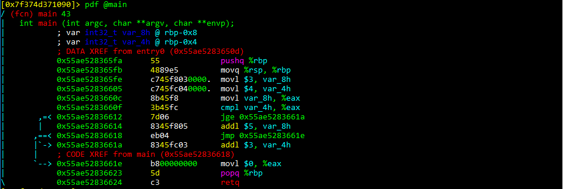

We’ll then start by setting a break point on the `jge` and the `jmp` instruction by using the command:

- `db 0x55ae52836612` (which is the hex address of the jge instruction)
- `db 0x55ae52836618` (which is the hex address of the jmp instruction)

We’ve added breakpoints to stop the execution of the program at those points so we can see the state of the program. Doing so will show the following:

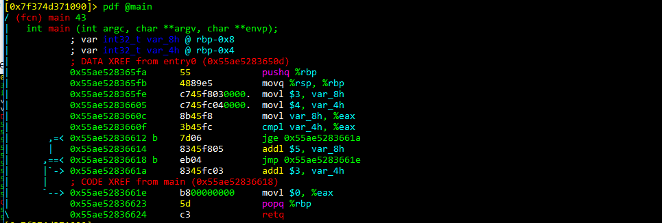

We now run `dc` to start execution of the program and the program will start execution and stop at the break point. Let’s examine what has happened before hitting the breakpoint:

- The first 2 lines are about pushing the frame pointer onto the stack and saving it(this is about how functions are called, and will be examined later)
- The next 3 lines are about assigning values 3 and 4 to the local arguments/variables var_8h and var_4h. It then stores the value in var_8h in the %eax register.
- The `cmpl` instruction compares the value of eax with that of the var_8h argument

To view the value of the registers, type in: `dr`

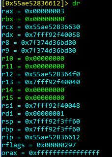

We can see that the value of rax, which is the 64 bit version of eax contains 3. We saw that the `jge` instruction is jumping based on whether value of `eax` is greater than var_4h. To see what’s in var_4h, we can see that at top of the main function, it tells us the position of var_4h. Run the command: `px @rbp-0x4`

And that shows the value of 4.

We know that eax contains 3, and 3 is not greater than 4, so the jump will not execute. Instead it will move to the next instruction. To check this, run the `ds` command which seeks/moves onto the next instruction.

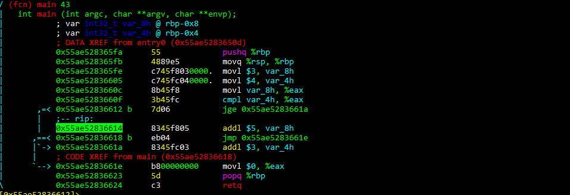

The `rip` (which is the current instruction pointer) shows that it moves onto the next instruction - which shows we are correct. The current instruction then adds 5 to var_8h which is a local argument. To see that this actually happens, first check the value of var_8h, run `ds` and check the value again. This will show it increments by 5.

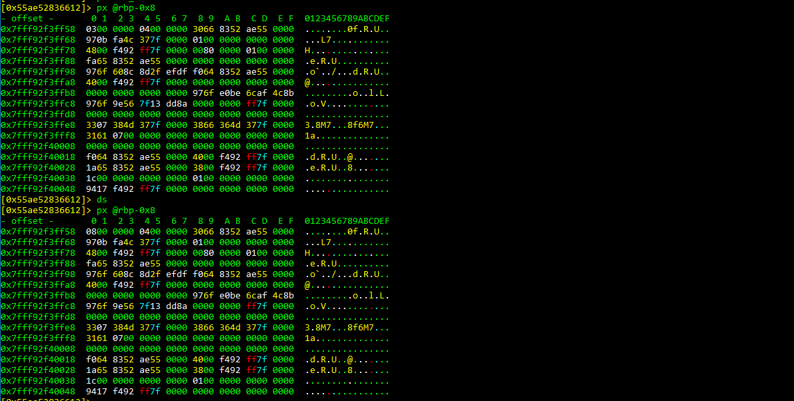

Note that because we are checking the exact address, we only need to check to 0 offset. The value stored in memory is stored as hex.

The next instruction is an unconditional jump and it just jumps to clearing the `eax` register. The `popq` instruction involves popping a value of the stack and reading it, and the return instruction sets this popped value to the current instruction pointer. In this case, it shows the execution of the program has been completed. To understand better about how an if statement work, you can check the corresponding C file in the same folder.

The following questions involve analysing the `if2` binary.

---------------------------------------------------------------------------

#### What is the value of var_8h before the popq and ret instructions?

Start the analysis and set breakpoint:

```bash
tryhackme@ip-10-82-161-159:~/if-statement$ r2 -d if2
Process with PID 1500 started...
= attach 1500 1500
bin.baddr 0x562fd6ee4000
Using 0x562fd6ee4000
asm.bits 64
 -- Invert the block bytes using the 'I' key in visual mode
[0x7f943d676090]> aaa
[x] Analyze all flags starting with sym. and entry0 (aa)
[Warning: Invalid range. Use different search.in=? or anal.in=dbg.maps.x
Warning: Invalid range. Use different search.in=? or anal.in=dbg.maps.x
[x] Analyze function calls (aac)
[x] Analyze len bytes of instructions for references (aar)
[x] Check for objc references
[x] Check for vtables
[TOFIX: aaft can't run in debugger mode.ions (aaft)
[x] Type matching analysis for all functions (aaft)
[x] Use -AA or aaaa to perform additional experimental analysis.
[0x7f943d676090]> afl
0x562fd6ee44f0    1 42           entry0
0x562fd70e4fe0    1 4124         reloc.__libc_start_main
0x562fd6ee4520    4 50   -> 40   sym.deregister_tm_clones
0x562fd6ee4560    4 66   -> 57   sym.register_tm_clones
0x562fd6ee45b0    5 58   -> 51   entry.fini0
0x562fd6ee44e0    1 6            sym.imp.__cxa_finalize
0x562fd6ee45f0    1 10           entry.init0
0x562fd6ee46b0    1 2            sym.__libc_csu_fini
0x562fd6ee46b4    1 9            sym._fini
0x562fd6ee4640    4 101          sym.__libc_csu_init
0x562fd6ee45fa    5 68           main
0x562fd6ee44b8    3 23           sym._init
[0x7f943d676090]> pdf @main
/ (fcn) main 68
|   int main (int argc, char **argv, char **envp);
|           ; var int32_t var_ch @ rbp-0xc
|           ; var int32_t var_8h @ rbp-0x8
|           ; var int32_t var_4h @ rbp-0x4
|           ; DATA XREF from entry0 (0x562fd6ee450d)
|           0x562fd6ee45fa      55             pushq %rbp
|           0x562fd6ee45fb      4889e5         movq %rsp, %rbp
|           0x562fd6ee45fe      c745f4000000.  movl $0, var_ch
|           0x562fd6ee4605      c745f8630000.  movl $0x63, var_8h      ; 'c' ; 99
|           0x562fd6ee460c      c745fce80300.  movl $0x3e8, var_4h     ; 1000
|           0x562fd6ee4613      8b45f4         movl var_ch, %eax
|           0x562fd6ee4616      3b45f8         cmpl var_8h, %eax
|       ,=< 0x562fd6ee4619      7d0e           jge 0x562fd6ee4629
|       |   0x562fd6ee461b      8b45f8         movl var_8h, %eax
|       |   0x562fd6ee461e      3b45fc         cmpl var_4h, %eax
|      ,==< 0x562fd6ee4621      7d0d           jge 0x562fd6ee4630
|      ||   0x562fd6ee4623      8365f864       andl $0x64, var_8h
|     ,===< 0x562fd6ee4627      eb07           jmp 0x562fd6ee4630
|     ||`-> 0x562fd6ee4629      8145f4b00400.  addl $0x4b0, var_ch
|     ||    ; CODE XREF from main (0x562fd6ee4627)
|     ``--> 0x562fd6ee4630      816dfce70300.  subl $0x3e7, var_4h
|           0x562fd6ee4637      b800000000     movl $0, %eax
|           0x562fd6ee463c      5d             popq %rbp
\           0x562fd6ee463d      c3             retq
[0x7f943d676090]> db 0x562fd6ee4637
[0x7f943d676090]> 
```

Start the program and examine vaiable

```bash
[0x7f943d676090]> dc
hit breakpoint at: 562fd6ee4637
[0x562fd6ee4637]> px 4 @rbp-0x8
- offset -       0 1  2 3  4 5  6 7  8 9  A B  C D  E F  0123456789ABCDEF
0x7ffd4a696968  6000 0000                                `...
[0x562fd6ee4637]> pxd 4 @rbp-0x8
- offset -        0  1   2  3   4  5   6  7   8  9   A  B   C  D   E  F  0123456789ABCDEF
0x7ffd4a696968             96                                            `...
[0x562fd6ee4637]> 
```

0x00000060 = decimal 96.

Answer: `96`

#### what is the value of var_ch before the popq and ret instructions?

```bash
[0x562fd6ee4637]> px 4 @rbp-0xc
- offset -       0 1  2 3  4 5  6 7  8 9  A B  C D  E F  0123456789ABCDEF
0x7ffd4a696964  0000 0000                                ....
[0x562fd6ee4637]> pxd 4 @rbp-0xc
- offset -        0  1   2  3   4  5   6  7   8  9   A  B   C  D   E  F  0123456789ABCDEF
0x7ffd4a696964              0                                            ....
[0x562fd6ee4637]> 
```

Answer: `0`

#### What is the value of var_4h before the popq and ret instructions?

```bash
[0x562fd6ee4637]> px 4 @rbp-0x4
- offset -       0 1  2 3  4 5  6 7  8 9  A B  C D  E F  0123456789ABCDEF
0x7ffd4a69696c  0100 0000                                ....                                                                                                        
[0x562fd6ee4637]> pxd 4 @rbp-0x4
- offset -        0  1   2  3   4  5   6  7   8  9   A  B   C  D   E  F  0123456789ABCDEF
0x7ffd4a69696c              1                                            ....                                                                                        
[0x562fd6ee4637]> 
```

Answer: `1`

#### What operator is used to change the value of var_8h, input the symbol as your answer (symbols include +, -, *, /, &, |)

The `and1` corresponds to AND (`&`).

`0x562fd6ee4623      8365f864       andl $0x64, var_8h`

Answer: `&`

---------------------------------------------------------------------------

### Task 5: Loops

Usually two types of loops are used: for loops and while loops. The general format of a while loops is:

```c
while(condition){
  Do-stuff-here
  Change value used in condition
}
```

The general format of a for loop is

```c
for(initialise value: condition; change value used in condition){
  do-stuff-here
}
```

Let’s start looking up loops by entering the loops folder, running `r2` with the loops 1 file. After this, analyse everything, list the functions and disassemble the main function.

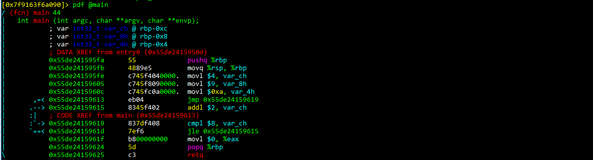

Let start of by setting a break point at the `jmp` instruction using the command: `db address-of-instruction`

Doing this allows us to skip the first few lines of instructions, which as we saw using if statements, it just passing in values to local arguments (note that the constant showed by *$0xa* represents that value of 10 in hex). Once execution reaches the breakpoint at the jmp instruction, run `ds` to move to the next instruction. Since this is an unconditional jump, it will move to the `cmpl` instruction.

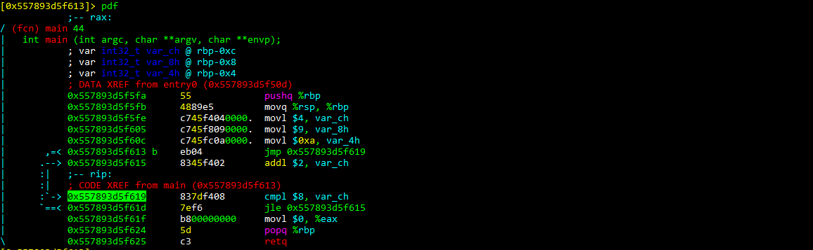

Here the `cmpl` instruction is trying to compare what’s in the local argument var_ch with the value 8. To see what’s in var_ch, check the start of the disassembled function and check the memory. In this case, it is `rbp-0xc`

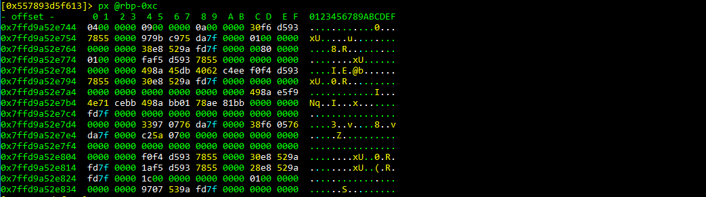

And shows that it contains 4. The next instruction is a `jle` which is going to check is the value is var-ch is less than or equal to 8. Since 4 is less than 8, it will jump to the `addl` instruction.

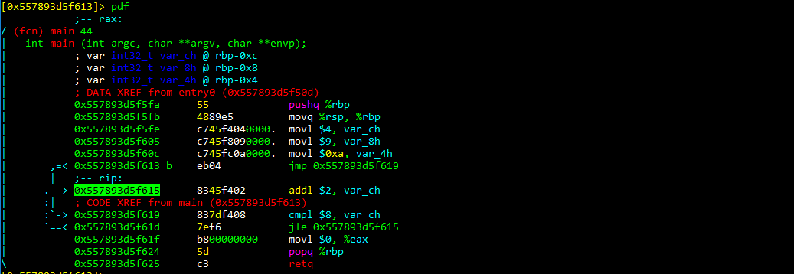

The `addl` instruction will add 2 to the value of var-ch and continue to go to the `cmpl` instruction. Since 2 was added to var_ch, var_ch will now contain 6 which is still less than 8, and it will jump back to the `addl` instruction. This can be seeing by continuing execution using the `ds` statement. We know this is a loop because the `addl` instruction is being executed more than once, and this is in combination with comparing the value of var_ch to 8. So we can infer the structure of the loop to be

```c
while(var_ch < 8){
 var_ch = var_ch + 2
}
```

A quicker way to examine the loop would be to add a break point to `cmpl` instruction and running `dc`. Since this is a loop, the program will always break at the `cmpl` instruction (because this instruction checks the condition before executing what is inside the loop). You can check the `loop1.c` file to see the structure of the loop!

Use the `loop2` binary to answer the following questions.

---------------------------------------------------------------------------

#### What is the value of var_8h on the second iteration of the loop?

Start the analysis and set breakpoints:

```bash
tryhackme@ip-10-82-161-159:~$ cd loops
tryhackme@ip-10-82-161-159:~/loops$ ls
loop1  loop1.c  loop2
tryhackme@ip-10-82-161-159:~/loops$ r2 -d loop2
Process with PID 1590 started...
= attach 1590 1590
bin.baddr 0x55d6c763e000
Using 0x55d6c763e000
asm.bits 64
 -- Buy a mac
[0x7f3db8599090]> aaa
[x] Analyze all flags starting with sym. and entry0 (aa)
[Warning: Invalid range. Use different search.in=? or anal.in=dbg.maps.x
Warning: Invalid range. Use different search.in=? or anal.in=dbg.maps.x
[x] Analyze function calls (aac)
[x] Analyze len bytes of instructions for references (aar)
[x] Check for objc references
[x] Check for vtables
[TOFIX: aaft can't run in debugger mode.ions (aaft)
[x] Type matching analysis for all functions (aaft)
[x] Use -AA or aaaa to perform additional experimental analysis.
[0x7f3db8599090]> afl
0x55d6c763e4f0    1 42           entry0
0x55d6c783efe0    1 4124         reloc.__libc_start_main
0x55d6c763e520    4 50   -> 40   sym.deregister_tm_clones
0x55d6c763e560    4 66   -> 57   sym.register_tm_clones
0x55d6c763e5b0    5 58   -> 51   entry.fini0
0x55d6c763e4e0    1 6            sym.imp.__cxa_finalize
0x55d6c763e5f0    1 10           entry.init0
0x55d6c763e6b0    1 2            sym.__libc_csu_fini
0x55d6c763e6b4    1 9            sym._fini
0x55d6c763e640    4 101          sym.__libc_csu_init
0x55d6c763e5fa    4 66           main
0x55d6c763e4b8    3 23           sym._init
[0x7f3db8599090]> pdf @main
/ (fcn) main 66
|   int main (int argc, char **argv, char **envp);
|           ; var int32_t var_ch @ rbp-0xc
|           ; var int32_t var_8h @ rbp-0x8
|           ; var int32_t var_4h @ rbp-0x4
|           ; DATA XREF from entry0 (0x55d6c763e50d)
|           0x55d6c763e5fa      55             pushq %rbp
|           0x55d6c763e5fb      4889e5         movq %rsp, %rbp
|           0x55d6c763e5fe      c745f4140000.  movl $0x14, var_ch      ; 20
|           0x55d6c763e605      c745f8160000.  movl $0x16, var_8h      ; 22
|           0x55d6c763e60c      c745fc000000.  movl $0, var_4h
|           0x55d6c763e613      c745fc040000.  movl $4, var_4h
|       ,=< 0x55d6c763e61a      eb13           jmp 0x55d6c763e62f
|      .--> 0x55d6c763e61c      8365f402       andl $2, var_ch
|      :|   0x55d6c763e620      d17df8         sarl $1, var_8h
|      :|   0x55d6c763e623      8b55fc         movl var_4h, %edx
|      :|   0x55d6c763e626      89d0           movl %edx, %eax
|      :|   0x55d6c763e628      01c0           addl %eax, %eax
|      :|   0x55d6c763e62a      01d0           addl %edx, %eax
|      :|   0x55d6c763e62c      8945fc         movl %eax, var_4h
|      :|   ; CODE XREF from main (0x55d6c763e61a)
|      :`-> 0x55d6c763e62f      837dfc63       cmpl $0x63, var_4h      ; 'c'
|      `==< 0x55d6c763e633      7ee7           jle 0x55d6c763e61c
|           0x55d6c763e635      b800000000     movl $0, %eax
|           0x55d6c763e63a      5d             popq %rbp
\           0x55d6c763e63b      c3             retq
[0x7f3db8599090]> db 0x55d6c763e62f
[0x7f3db8599090]> db 0x55d6c763e63a
[0x55d6c763e63a]> 
```

Continue three times and check the value:

```bash
[0x55d6c763e63a]> dc
hit breakpoint at: 55d6c763e62f
[0x55d6c763e62f]> dc
hit breakpoint at: 55d6c763e62f
[0x55d6c763e62f]> dc
hit breakpoint at: 55d6c763e62f
[0x55d6c763e62f]> px 4 @rbp-0x8
- offset -       0 1  2 3  4 5  6 7  8 9  A B  C D  E F  0123456789ABCDEF
0x7ffcc5a2a7f8  0500 0000                                ....
[0x55d6c763e62f]> pxd 4 @rbp-0x8
- offset -        0  1   2  3   4  5   6  7   8  9   A  B   C  D   E  F  0123456789ABCDEF
0x7ffcc5a2a7f8              5                                            ....
[0x55d6c763e62f]> 
```

Answer: `5`

#### What is the value of var_ch on the second iteration of the loop?

```bash
[0x55d6c763e62f]> px 4 @rbp-0xc
- offset -       0 1  2 3  4 5  6 7  8 9  A B  C D  E F  0123456789ABCDEF
0x7ffcc5a2a7f4  0000 0000                                ....
[0x55d6c763e62f]> pxd 4 @rbp-0xc
- offset -        0  1   2  3   4  5   6  7   8  9   A  B   C  D   E  F  0123456789ABCDEF
0x7ffcc5a2a7f4              0                                            ....
[0x55d6c763e62f]> 
```

Answer: `0`

#### What is the value of var_8h at the end of the program?

Delete the first breakpoint, continue and check the value:

```bash
[0x55d6c763e62f]> db -0x55d6c763e62f
[0x55d6c763e62f]> dc
hit breakpoint at: 55d6c763e63a
[0x55d6c763e62f]> px 4 @rbp-0x8
- offset -       0 1  2 3  4 5  6 7  8 9  A B  C D  E F  0123456789ABCDEF
0x7ffcc5a2a7f8  0200 0000                                ....
[0x55d6c763e62f]> pxd 4 @rbp-0x8
- offset -        0  1   2  3   4  5   6  7   8  9   A  B   C  D   E  F  0123456789ABCDEF
0x7ffcc5a2a7f8              2                                            ....
[0x55d6c763e62f]> 
```

Answer: `2`

#### What is the value of var_ch at the end of the program?

```bash
[0x55d6c763e62f]> px 4 @rbp-0xc
- offset -       0 1  2 3  4 5  6 7  8 9  A B  C D  E F  0123456789ABCDEF
0x7ffcc5a2a7f4  0000 0000                                ....
[0x55d6c763e62f]> pxd 4 @rbp-0xc
- offset -        0  1   2  3   4  5   6  7   8  9   A  B   C  D   E  F  0123456789ABCDEF
0x7ffcc5a2a7f4              0                                            ....
[0x55d6c763e62f]> 
```

Answer: `0`

---------------------------------------------------------------------------

### Task 6: crackme1

Go to the crackme folder and analyse the `crackme1` binary. This binary checks if the user has a correct password, and this can be done by running the binary and entering the password.

---------------------------------------------------------------------------

#### What is the password?

Start debugging and list contents of main for analysis:

```bash
tryhackme@ip-10-82-161-159:~/crackme$ r2 -d crackme1 
Process with PID 1644 started...
= attach 1644 1644
bin.baddr 0x55b12a081000
Using 0x55b12a081000
asm.bits 64
 -- Polish reversers blame git
[0x7f9c9b56b090]> aaa
[x] Analyze all flags starting with sym. and entry0 (aa)
[Warning: Invalid range. Use different search.in=? or anal.in=dbg.maps.x
Warning: Invalid range. Use different search.in=? or anal.in=dbg.maps.x
[x] Analyze function calls (aac)
[x] Analyze len bytes of instructions for references (aar)
[x] Check for objc references
[x] Check for vtables
[TOFIX: aaft can't run in debugger mode.ions (aaft)
[x] Type matching analysis for all functions (aaft)
[x] Use -AA or aaaa to perform additional experimental analysis.
[0x7f9c9b56b090]> afl
0x55b12a0816f0    1 42           entry0
0x55b12a281fe0    1 4124         reloc.__libc_start_main
0x55b12a081720    4 50   -> 40   sym.deregister_tm_clones
0x55b12a081760    4 66   -> 57   sym.register_tm_clones
0x55b12a0817b0    5 58   -> 51   entry.fini0
0x55b12a0816e0    1 6            sym..plt.got
0x55b12a0817f0    1 10           entry.init0
0x55b12a081990    1 2            sym.__libc_csu_fini
0x55b12a081994    1 9            sym._fini
0x55b12a081920    4 101          sym.__libc_csu_init
0x55b12a0817fa   10 280          main
0x55b12a081650    3 23           sym._init
0x55b12a081680    1 6            sym.imp.puts
0x55b12a081690    1 6            sym.imp.strlen
0x55b12a0816a0    1 6            sym.imp.__stack_chk_fail
0x55b12a081000    2 25           map.home_tryhackme_crackme_crackme1.r_x
0x55b12a0816b0    1 6            sym.imp.strcmp
0x55b12a0816c0    1 6            sym.imp.strtok
0x55b12a0816d0    1 6            sym.imp.__isoc99_scanf
[0x7f9c9b56b090]> pdf @main
/ (fcn) main 280
|   int main (int argc, char **argv, char **envp);
|           ; var int32_t var_54h @ rbp-0x54
|           ; var int32_t var_50h @ rbp-0x50
|           ; var int32_t var_4ch @ rbp-0x4c
|           ; var int32_t var_48h @ rbp-0x48
|           ; var int32_t var_40h @ rbp-0x40
|           ; var int32_t var_38h @ rbp-0x38
|           ; var int32_t var_30h @ rbp-0x30
|           ; var int32_t var_28h @ rbp-0x28
|           ; var int32_t var_12h @ rbp-0x12
|           ; var int32_t var_8h @ rbp-0x8
|           ; arg int32_t arg_40h @ rbp+0x40
|           ; DATA XREF from entry0 (0x55b12a08170d)
|           0x55b12a0817fa      55             pushq %rbp
|           0x55b12a0817fb      4889e5         movq %rsp, %rbp
|           0x55b12a0817fe      4883ec60       subq $0x60, %rsp        ; '`'
|           0x55b12a081802      64488b042528.  movq %fs:0x28, %rax     ; [0x28:8]=-1 ; '(' ; 40
|           0x55b12a08180b      488945f8       movq %rax, var_8h
|           0x55b12a08180f      31c0           xorl %eax, %eax
|           0x55b12a081811      488d3d900100.  leaq str.enter_your_password, %rdi ; 0x55b12a0819a8 ; "enter your password"
|           0x55b12a081818      e863feffff     callq sym.imp.puts      ; int puts(const char *s)
|           0x55b12a08181d      488d45ee       leaq var_12h, %rax
|           0x55b12a081821      4889c6         movq %rax, %rsi
|           0x55b12a081824      488d3d910100.  leaq 0x55b12a0819bc, %rdi ; "%s"
|           0x55b12a08182b      b800000000     movl $0, %eax
|           0x55b12a081830      e89bfeffff     callq sym.imp.__isoc99_scanf ; int scanf(const char *format)
|           0x55b12a081835      c745ac000000.  movl $0, var_54h
|           0x55b12a08183c      488d057c0100.  leaq 0x55b12a0819bf, %rax ; "127"
|           0x55b12a081843      488945c0       movq %rax, var_40h
|           0x55b12a081847      488d05750100.  leaq str.01., %rax      ; 0x55b12a0819c3 ; u"01.\u7257\u6e6f\u2067\u6150\u7373\u6f77\u6472\u5900\u756f\u7627\u2065\u6f67\u2074\u6874\u2065\u6f63\u7272\u6365\u2074\u6170\u7373\u6f77\u6472\u0100\u031b\u3c3b"                                                                              
|           0x55b12a08184e      488945c8       movq %rax, var_38h
|           0x55b12a081852      488d056a0100.  leaq str.01., %rax      ; 0x55b12a0819c3 ; u"01.\u7257\u6e6f\u2067\u6150\u7373\u6f77\u6472\u5900\u756f\u7627\u2065\u6f67\u2074\u6874\u2065\u6f63\u7272\u6365\u2074\u6170\u7373\u6f77\u6472\u0100\u031b\u3c3b"                                                                              
|           0x55b12a081859      488945d0       movq %rax, var_30h
|           0x55b12a08185d      488d05610100.  leaq 0x55b12a0819c5, %rax ; u"1.\u7257\u6e6f\u2067\u6150\u7373\u6f77\u6472\u5900\u756f\u7627\u2065\u6f67\u2074\u6874\u2065\u6f63\u7272\u6365\u2074\u6170\u7373\u6f77\u6472\u0100\u031b\u3c3b"                                                                                              
|           0x55b12a081864      488945d8       movq %rax, var_28h
|           0x55b12a081868      488d45ee       leaq var_12h, %rax
|           0x55b12a08186c      4889c7         movq %rax, %rdi
|           0x55b12a08186f      e81cfeffff     callq sym.imp.strlen    ; size_t strlen(const char *s)
|           0x55b12a081874      8945b0         movl %eax, var_50h
|           0x55b12a081877      488d45ee       leaq var_12h, %rax
|           0x55b12a08187b      488d35450100.  leaq 0x55b12a0819c7, %rsi ; "."
|           0x55b12a081882      4889c7         movq %rax, %rdi
|           0x55b12a081885      e836feffff     callq sym.imp.strtok    ; char *strtok(char *s1, const char *s2)
|           0x55b12a08188a      488945b8       movq %rax, var_48h
|       ,=< 0x55b12a08188e      eb4e           jmp 0x55b12a0818de
|      .--> 0x55b12a081890      8b45ac         movl var_54h, %eax
|      :|   0x55b12a081893      4898           cltq
|      :|   0x55b12a081895      488b54c5c0     movq -0x40(%rbp, %rax, 8), %rdx
|      :|   0x55b12a08189a      488b45b8       movq var_48h, %rax
|      :|   0x55b12a08189e      4889d6         movq %rdx, %rsi
|      :|   0x55b12a0818a1      4889c7         movq %rax, %rdi
|      :|   0x55b12a0818a4      e807feffff     callq sym.imp.strcmp    ; int strcmp(const char *s1, const char *s2)
|      :|   0x55b12a0818a9      8945b4         movl %eax, var_4ch
|      :|   0x55b12a0818ac      8345ac01       addl $1, var_54h
|      :|   0x55b12a0818b0      837db400       cmpl $0, var_4ch
|     ,===< 0x55b12a0818b4      7413           je 0x55b12a0818c9
|     |:|   0x55b12a0818b6      488d3d0c0100.  leaq 0x55b12a0819c9, %rdi ; "Wrong Password"
|     |:|   0x55b12a0818bd      e8befdffff     callq sym.imp.puts      ; int puts(const char *s)
|     |:|   0x55b12a0818c2      b8ffffffff     movl $0xffffffff, %eax  ; -1
|    ,====< 0x55b12a0818c7      eb33           jmp 0x55b12a0818fc
|    |`---> 0x55b12a0818c9      488d35f70000.  leaq 0x55b12a0819c7, %rsi ; "."
|    | :|   0x55b12a0818d0      bf00000000     movl $0, %edi
|    | :|   0x55b12a0818d5      e8e6fdffff     callq sym.imp.strtok    ; char *strtok(char *s1, const char *s2)
|    | :|   0x55b12a0818da      488945b8       movq %rax, var_48h
|    | :|   ; CODE XREF from main (0x55b12a08188e)
|    | :`-> 0x55b12a0818de      48837db800     cmpq $0, var_48h
|    | :,=< 0x55b12a0818e3      7406           je 0x55b12a0818eb
|    | :|   0x55b12a0818e5      837dac03       cmpl $3, var_54h
|    | `==< 0x55b12a0818e9      7ea5           jle 0x55b12a081890
|    |  `-> 0x55b12a0818eb      488d3de60000.  leaq str.You_ve_got_the_correct_password, %rdi ; 0x55b12a0819d8 ; "You've got the correct password"
|    |      0x55b12a0818f2      e889fdffff     callq sym.imp.puts      ; int puts(const char *s)
|    |      0x55b12a0818f7      b800000000     movl $0, %eax
|    |      ; CODE XREF from main (0x55b12a0818c7)
|    `----> 0x55b12a0818fc      488b4df8       movq var_8h, %rcx
|           0x55b12a081900      6448330c2528.  xorq %fs:0x28, %rcx
|       ,=< 0x55b12a081909      7405           je 0x55b12a081910
|       |   0x55b12a08190b      e890fdffff     callq sym.imp.__stack_chk_fail ; void __stack_chk_fail(void)
|       `-> 0x55b12a081910      c9             leave
\           0x55b12a081911      c3             retq
[0x7f9c9b56b090]> 
```

It is rather hard to see in `r2` and the listing above, but from 0x55b12a08183c to 0x55b12a081864 the string `127.0.0.1` is built.

This can partly be seen if we examine RAX at 0x55b12a081868:

```bash
[0x7f9c9b56b090]> db 0x55b12a081868
[0x55b12a081868]> px 16 @rax-10
- offset -       0 1  2 3  4 5  6 7  8 9  A B  C D  E F  0123456789ABCDEF
0x55b12a0819bb  0025 7300 3132 3700 3000 3100 2e00 5772  .%s.127.0.1...Wr
[0x55b12a081868]> 
```

This is much easier seen in IDA Pro:

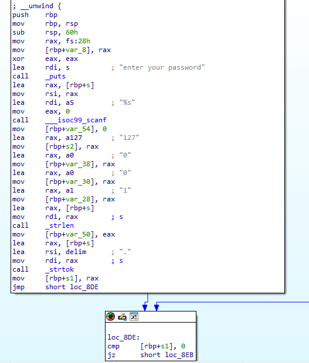

Let's verify to be sure:

```bash
tryhackme@ip-10-82-161-159:~/crackme$ ./crackme1
enter your password
127.0.0.1
You've got the correct password
tryhackme@ip-10-82-161-159:~/crackme$ 
```

Answer: `127.0.0.1`

---------------------------------------------------------------------------

### Task 7: crackme2

Analyse the crackme2 binary and try find the correct password, as with the previous question.

---------------------------------------------------------------------------

#### What is the correct password?

Start debugging and list contents of main for analysis:

```bash
tryhackme@ip-10-82-161-159:~/crackme$ r2 -d crackme2
Process with PID 1655 started...
= attach 1655 1655
bin.baddr 0x5565b7065000
Using 0x5565b7065000
asm.bits 64
 -- It's not you, it's me.
[0x7fd10c5df090]> aaa
[x] Analyze all flags starting with sym. and entry0 (aa)
[Warning: Invalid range. Use different search.in=? or anal.in=dbg.maps.x
Warning: Invalid range. Use different search.in=? or anal.in=dbg.maps.x
[x] Analyze function calls (aac)
[x] Analyze len bytes of instructions for references (aar)
[x] Check for objc references
[x] Check for vtables
[TOFIX: aaft can't run in debugger mode.ions (aaft)
[x] Type matching analysis for all functions (aaft)
[x] Use -AA or aaaa to perform additional experimental analysis.
[0x7fd10c5df090]> afl
0x5565b70656f0    1 42           entry0
0x5565b7265fe0    1 4124         reloc.__libc_start_main
0x5565b7065720    4 50   -> 40   sym.deregister_tm_clones
0x5565b7065760    4 66   -> 57   sym.register_tm_clones
0x5565b70657b0    5 58   -> 51   entry.fini0
0x5565b70656e0    1 6            sym..plt.got
0x5565b70657f0    1 10           entry.init0
0x5565b7065990    1 2            sym.__libc_csu_fini
0x5565b7065994    1 9            sym._fini
0x5565b7065920    4 101          sym.__libc_csu_init
0x5565b70657fa   12 283          main
0x5565b7065650    3 23           sym._init
0x5565b7065680    1 6            sym.imp.puts
0x5565b7065690    1 6            sym.imp.fread
0x5565b70656a0    1 6            sym.imp.strlen
0x5565b70656b0    1 6            sym.imp.__stack_chk_fail
0x5565b7065000    2 25           map.home_tryhackme_crackme_crackme2.r_x
0x5565b70656c0    1 6            sym.imp.fopen
0x5565b70656d0    1 6            sym.imp.__isoc99_scanf
[0x7fd10c5df090]> pdf @main
/ (fcn) main 283
|   int main (int argc, char **argv, char **envp);
|           ; var int32_t var_44h @ rbp-0x44
|           ; var int32_t var_40h @ rbp-0x40
|           ; var int32_t var_3ch @ rbp-0x3c
|           ; var int32_t var_38h @ rbp-0x38
|           ; var int32_t var_2eh @ rbp-0x2e
|           ; var int32_t var_23h @ rbp-0x23
|           ; var int32_t var_18h @ rbp-0x18
|           ; DATA XREF from entry0 (0x5565b706570d)
|           0x5565b70657fa      55             pushq %rbp
|           0x5565b70657fb      4889e5         movq %rsp, %rbp
|           0x5565b70657fe      53             pushq %rbx
|           0x5565b70657ff      4883ec48       subq $0x48, %rsp        ; 'H'
|           0x5565b7065803      64488b042528.  movq %fs:0x28, %rax     ; [0x28:8]=-1 ; '(' ; 40
|           0x5565b706580c      488945e8       movq %rax, var_18h
|           0x5565b7065810      31c0           xorl %eax, %eax
|           0x5565b7065812      488d358f0100.  leaq 0x5565b70659a8, %rsi ; "r"
|           0x5565b7065819      488d3d900100.  leaq str.home_tryhackme_install_files_secret.txt, %rdi ; 0x5565b70659b0 ; "/home/tryhackme/install-files/secret.txt"
|           0x5565b7065820      e89bfeffff     callq sym.imp.fopen     ; file*fopen(const char *filename, const char *mode)
|           0x5565b7065825      488945c8       movq %rax, var_38h
|           0x5565b7065829      488b55c8       movq var_38h, %rdx
|           0x5565b706582d      488d45d2       leaq var_2eh, %rax
|           0x5565b7065831      4889d1         movq %rdx, %rcx
|           0x5565b7065834      ba0b000000     movl $0xb, %edx         ; 11
|           0x5565b7065839      be01000000     movl $1, %esi
|           0x5565b706583e      4889c7         movq %rax, %rdi
|           0x5565b7065841      e84afeffff     callq sym.imp.fread     ; size_t fread(void *ptr, size_t size, size_t nmemb, FILE *stream)
|           0x5565b7065846      8945c4         movl %eax, var_3ch
|           0x5565b7065849      837dc400       cmpl $0, var_3ch
|       ,=< 0x5565b706584d      7916           jns 0x5565b7065865
|       |   0x5565b706584f      488d3d830100.  leaq str.Error_Reading_File, %rdi ; 0x5565b70659d9 ; "Error Reading File"
|       |   0x5565b7065856      e825feffff     callq sym.imp.puts      ; int puts(const char *s)
|       |   0x5565b706585b      b8ffffffff     movl $0xffffffff, %eax  ; -1
|      ,==< 0x5565b7065860      e995000000     jmp 0x5565b70658fa
|      |`-> 0x5565b7065865      488d3d800100.  leaq str.Please_enter_password, %rdi ; 0x5565b70659ec ; "Please enter password"
|      |    0x5565b706586c      e80ffeffff     callq sym.imp.puts      ; int puts(const char *s)
|      |    0x5565b7065871      488d45dd       leaq var_23h, %rax
|      |    0x5565b7065875      4889c6         movq %rax, %rsi
|      |    0x5565b7065878      488d3d830100.  leaq str.11s, %rdi      ; 0x5565b7065a02 ; "%11s"
|      |    0x5565b706587f      b800000000     movl $0, %eax
|      |    0x5565b7065884      e847feffff     callq sym.imp.__isoc99_scanf ; int scanf(const char *format)
|      |    0x5565b7065889      c745bc090000.  movl $9, var_44h
|      |    0x5565b7065890      c745c0000000.  movl $0, var_40h
|      |,=< 0x5565b7065897      eb33           jmp 0x5565b70658cc
|     .---> 0x5565b7065899      8b45bc         movl var_44h, %eax
|     :||   0x5565b706589c      4898           cltq
|     :||   0x5565b706589e      0fb65405d2     movzbl -0x2e(%rbp, %rax), %edx
|     :||   0x5565b70658a3      8b45c0         movl var_40h, %eax
|     :||   0x5565b70658a6      4898           cltq
|     :||   0x5565b70658a8      0fb64405dd     movzbl -0x23(%rbp, %rax), %eax
|     :||   0x5565b70658ad      38c2           cmpb %al, %dl
|    ,====< 0x5565b70658af      7413           je 0x5565b70658c4
|    |:||   0x5565b70658b1      488d3d4f0100.  leaq str.Wrong_Password, %rdi ; 0x5565b7065a07 ; "Wrong Password"
|    |:||   0x5565b70658b8      e8c3fdffff     callq sym.imp.puts      ; int puts(const char *s)
|    |:||   0x5565b70658bd      b8ffffffff     movl $0xffffffff, %eax  ; -1
|   ,=====< 0x5565b70658c2      eb36           jmp 0x5565b70658fa
|   |`----> 0x5565b70658c4      836dbc01       subl $1, var_44h
|   | :||   0x5565b70658c8      8345c001       addl $1, var_40h
|   | :||   ; CODE XREF from main (0x5565b7065897)
|   | :|`-> 0x5565b70658cc      837dbc00       cmpl $0, var_44h
|   | :|,=< 0x5565b70658d0      7e17           jle 0x5565b70658e9
|   | :||   0x5565b70658d2      8b45c0         movl var_40h, %eax
|   | :||   0x5565b70658d5      4863d8         movslq %eax, %rbx
|   | :||   0x5565b70658d8      488d45dd       leaq var_23h, %rax
|   | :||   0x5565b70658dc      4889c7         movq %rax, %rdi
|   | :||   0x5565b70658df      e8bcfdffff     callq sym.imp.strlen    ; size_t strlen(const char *s)
|   | :||   0x5565b70658e4      4839c3         cmpq %rax, %rbx
|   | `===< 0x5565b70658e7      72b0           jb 0x5565b7065899
|   |  |`-> 0x5565b70658e9      488d3d260100.  leaq str.Correct_Password, %rdi ; 0x5565b7065a16 ; "Correct Password"
|   |  |    0x5565b70658f0      e88bfdffff     callq sym.imp.puts      ; int puts(const char *s)
|   |  |    0x5565b70658f5      b800000000     movl $0, %eax
|   |  |    ; CODE XREFS from main (0x5565b7065860, 0x5565b70658c2)
|   `--`--> 0x5565b70658fa      488b4de8       movq var_18h, %rcx
|           0x5565b70658fe      6448330c2528.  xorq %fs:0x28, %rcx
|       ,=< 0x5565b7065907      7405           je 0x5565b706590e
|       |   0x5565b7065909      e8a2fdffff     callq sym.imp.__stack_chk_fail ; void __stack_chk_fail(void)
|       `-> 0x5565b706590e      4883c448       addq $0x48, %rsp        ; 'H'
|           0x5565b7065912      5b             popq %rbx
|           0x5565b7065913      5d             popq %rbp
\           0x5565b7065914      c3             retq
[0x7fd10c5df090]> 
```

At 0x5565b7065819 we can see that the file `/home/tryhackme/install-files/secret.txt` is read.

However, the contents of the file is compared in reverse.

```bash
tryhackme@ip-10-82-161-159:~/crackme$ cat /home/tryhackme/install-files/secret.txt
vs3curepwd
tryhackme@ip-10-82-161-159:~/crackme$ cat /home/tryhackme/install-files/secret.txt | rev
dwperuc3sv
tryhackme@ip-10-82-161-159:~/crackme$ ./crackme2
Please enter password
dwperuc3sv
Correct Password
tryhackme@ip-10-82-161-159:~/crackme$ 
```

Answer: `dwperuc3sv`

---------------------------------------------------------------------------

For additional information, please see the references below.

## References

- [Intro to Radare2](https://github.com/radare/radare2/blob/master/doc/intro.md)
- [Learning Radare In Practice](https://web.archive.org/web/20180312191821/http://www.radare.org/get/THC2018.pdf)
- [Radare2 - Book](https://book.rada.re/)
- [Radare2 - GitHub](https://github.com/radareorg/radare2)
- [Radare2 - Homepage](https://www.radare.org/n/radare2.html)
- [yet another radare2 cheatsheet](https://gist.github.com/williballenthin/6857590dab3e2a6559d7)
- [x86 assembly language - Wikipedia](https://en.wikipedia.org/wiki/X86_assembly_language)
- [x86 instruction listings - Wikipedia](https://en.wikipedia.org/wiki/X86_instruction_listings)
