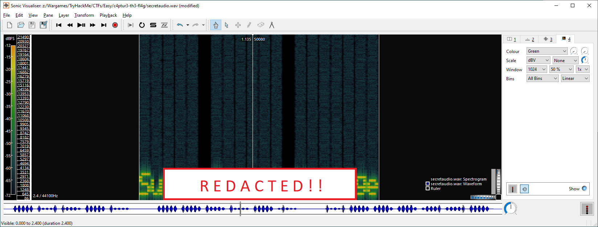

# c4ptur3-th3-fl4g

- [Room information](#room-information)
- [Solution](#solution)
- [References](#references)

## Room information

```text
Type: Challenge
Difficulty: Easy
OS: N/A
Subscription type: Free
Description: A beginner level CTF challenge
```

Room link: [https://tryhackme.com/r/room/c4ptur3th3fl4g](https://tryhackme.com/r/room/c4ptur3th3fl4g)

## Solution

### Task 1: Translation & Shifting

#### c4n y0u c4p7u23 7h3 f149?

This is [leetspeak](https://en.wikipedia.org/wiki/Leet) and you can either solve it manually, with an online service such as [dcode.fr](https://www.dcode.fr/leet-speak-1337) or with a simple python script

```python
#!/usr/bin/python
# -*- coding: latin-1 -*-

encoded_flag = 'c4n y0u c4p7u23 7h3 f149?'

print(encoded_flag.translate(str.maketrans('1234790','lreatgo')))
```

Run the script to get the flag

```bash
┌──(kali㉿kali)-[/mnt/…/TryHackMe/CTFs/Easy/c4ptur3-th3-fl4g]
└─$ python solve_1-1.py
c<REDACTED>?
```

#### 01101100 01100101 01110100 etc

This is [binary numbers](https://en.wikipedia.org/wiki/Binary_number) and you convert them to [ASCII]((https://en.wikipedia.org/wiki/ASCII)) manually (which is tedious), with an online service such as [branah.com](https://www.branah.com/ascii-converter) or [RapidTables](https://www.rapidtables.com/convert/number/ascii-hex-bin-dec-converter.html), or with a simple python script

```python
#!/usr/bin/python
# -*- coding: latin-1 -*-

encoded_flag = '01101100 01100101 01110100 01110011 00100000 01110100 01110010 01111001 00100000 01110011 01101111 01101101 01100101 00100000 01100010 01101001 01101110 01100001 01110010 01111001 00100000 01101111 01110101 01110100 00100001'

flag = ""
for i in encoded_flag.split(' '):
        flag += chr(int(i, 2))

print(flag)
```

Run the script to get the flag

```bash
┌──(kali㉿kali)-[/mnt/…/TryHackMe/CTFs/Easy/c4ptur3-th3-fl4g]
└─$ python solve_1-2.py
l<REDACTED>!
```

#### MJQXGZJTGIQGS4ZAON2XAZLSEBRW63LNN5XCA2LOEBBVIRRHOM======

This is [base32](https://en.wikipedia.org/wiki/Base32) and you can convert it to ASCII with [CyberChef](https://gchq.github.io/CyberChef/#recipe=From_Base32('A-Z2-7%3D',false)), `base32` in bash, or with the base64 module in Python.

Convert using bash

```bash
┌──(kali㉿kali)-[/mnt/…/TryHackMe/CTFs/Easy/c4ptur3-th3-fl4g]
└─$ echo 'MJQXGZJTGIQGS4ZAON2XAZLSEBRW63LNN5XCA2LOEBBVIRRHOM======' | base32 -d
b<REDACTED>s
```

Convert with a simple python script

```python
#!/usr/bin/python
# -*- coding: latin-1 -*-

import base64

encoded_flag = b'MJQXGZJTGIQGS4ZAON2XAZLSEBRW63LNN5XCA2LOEBBVIRRHOM======'

print(base64.b32decode(encoded_flag).decode())
```

Then run the script to get the flag

```bash
┌──(kali㉿kali)-[/mnt/…/TryHackMe/CTFs/Easy/c4ptur3-th3-fl4g]
└─$ python solve_1-3.py                                                        
b<REDACTED>s
```

#### RWFjaCBCYXNlNjQgZGlnaXQgcmVwcmVzZW50cyBleGFjdGx5IDYgYml0cyBvZiBkYXRhLg==

This is [base64](https://en.wikipedia.org/wiki/Base64) and you can convert it to ASCII with [CyberChef](https://gchq.github.io/CyberChef/#recipe=From_Base64('A-Za-z0-9%2B/%3D',true,false)), `base64` in bash, or with the base64 module in Python.

Convert using bash

```bash
┌──(kali㉿kali)-[/mnt/…/TryHackMe/CTFs/Easy/c4ptur3-th3-fl4g]
└─$ echo 'RWFjaCBCYXNlNjQgZGlnaXQgcmVwcmVzZW50cyBleGFjdGx5IDYgYml0cyBvZiBkYXRhLg==' | base64 -d
E<REDACTED>. 
```

Convert with a simple python script

```python
#!/usr/bin/python
# -*- coding: latin-1 -*-

import base64

encoded_flag = b'RWFjaCBCYXNlNjQgZGlnaXQgcmVwcmVzZW50cyBleGFjdGx5IDYgYml0cyBvZiBkYXRhLg=='

print(base64.b64decode(encoded_flag).decode())
```

Then run the script to get the flag

```bash
┌──(kali㉿kali)-[/mnt/…/TryHackMe/CTFs/Easy/c4ptur3-th3-fl4g]
└─$ python solve_1-4.py                                                                        
E<REDACTED>.
```

#### 68 65 78 61 64 65 63 69 6d 61 6c 20 6f 72 20 62 61 73 65 31 36 3f

This is [hexadecimal numbers](https://en.wikipedia.org/wiki/Hexadecimal) and they can be converted to ASCII with online services such as [CyberChef](https://gchq.github.io/CyberChef/#recipe=From_Hex('Space')) or [RapidTables](https://www.rapidtables.com/convert/number/ascii-hex-bin-dec-converter.html), `xxd` in bash, or with a Python script.

Convert in bash with `xxd`

```bash
┌──(kali㉿kali)-[/mnt/…/TryHackMe/CTFs/Easy/c4ptur3-th3-fl4g]
└─$ echo '68 65 78 61 64 65 63 69 6d 61 6c 20 6f 72 20 62 61 73 65 31 36 3f' | xxd -r -p       
h<REDACTED>?  
```

Convert with a simple python script

```python
#!/usr/bin/python
# -*- coding: latin-1 -*-

encoded_flag = '68 65 78 61 64 65 63 69 6d 61 6c 20 6f 72 20 62 61 73 65 31 36 3f'

flag = ""
for i in encoded_flag.split(' '):
    flag += chr(int(i, 16))

print(flag)
```

Then run the script to get the flag

```bash
┌──(kali㉿kali)-[/mnt/…/TryHackMe/CTFs/Easy/c4ptur3-th3-fl4g]
└─$ python solve_1-5.py                                                                 
h<REDACTED>?
```

#### Ebgngr zr 13 cynprf!

This is [ROT13](https://en.wikipedia.org/wiki/ROT13) and it can be solved with online services such as [CyberChef](https://gchq.github.io/CyberChef/#recipe=ROT13(true,true,false,13)) or [dcode.fr](https://www.dcode.fr/rot-13-cipher), the `tr` command in bash, or with the codecs module in Python.

Convert in bash with `tr`

```bash
┌──(kali㉿kali)-[/mnt/…/TryHackMe/CTFs/Easy/c4ptur3-th3-fl4g]
└─$ echo 'Ebgngr zr 13 cynprf!' | tr 'A-Za-z' 'N-ZA-Mn-za-m'                            
R<REDACTED>!
```

Convert with a simple python script

```python
#!/usr/bin/python
# -*- coding: latin-1 -*-

import codecs

encoded_flag = 'Ebgngr zr 13 cynprf!'

print(codecs.encode(encoded_flag, 'rot_13'))
```

Then run the script to get the flag

```bash
┌──(kali㉿kali)-[/mnt/…/TryHackMe/CTFs/Easy/c4ptur3-th3-fl4g]
└─$ python solve_1-6.py                                     
R<REDACTED>!
```

#### @F DA:? >6 C:89E C@F?5 323J C:89E C@F?5 Wcf E:>6DX

This is ROT47 and you can solve it with the `tr` command in bash, or with an online service such as [CyberChef](https://gchq.github.io/CyberChef/#recipe=ROT47(47)) or [dcode.fr](https://www.dcode.fr/rot-47-cipher)

Convert in bash with `tr`

```bash
┌──(kali㉿kali)-[/mnt/…/TryHackMe/CTFs/Easy/c4ptur3-th3-fl4g]
└─$ echo '*@F DA:? >6 C:89E C@F?5 323J C:89E C@F?5 Wcf E:>6DX' | tr '\!-~' 'P-~\!-O' 
Y<REDACTED>)
```

#### - . .-.. . -.-. --- -- -- ..- -. .. -.-. .- - .. --- -. etc

This is [morse code](https://en.wikipedia.org/wiki/Morse_code) and it can be converted with online services such as [CyberChef](https://gchq.github.io/CyberChef/#recipe=From_Morse_Code('Space','Line%20feed')) or [Lexilogos](https://www.lexilogos.com/keyboard/morse.htm).

#### 85 110 112 97 99 107 32 116 104 105 115 32 66 67 68

This is ASCII text converted to decimal numbers. It can be converted with an online service such as [CyberChef](https://gchq.github.io/CyberChef/#recipe=From_Decimal('Space',false)) or [RapidTables](https://www.rapidtables.com/convert/number/ascii-hex-bin-dec-converter.html), or with a simple Python script.

Convert with a simple python script

```python
#!/usr/bin/python
# -*- coding: latin-1 -*-

encoded_flag = '85 110 112 97 99 107 32 116 104 105 115 32 66 67 68'

flag = ""
for i in encoded_flag.split(' '):
        flag += chr(int(i))

print(flag)
```

Then run the script to get the flag

```bash
┌──(kali㉿kali)-[/mnt/…/TryHackMe/CTFs/Easy/c4ptur3-th3-fl4g]
└─$ python solve_1-9.py                                                              
U<REDACTED>D
```

#### LS0tLS0gLi0tLS0gLi0tLS0gLS0tLS0gLS0tLS0gLi0tLS0gLi0tLS0gLS0tLS0KLS0tLS0gLi0tLS0gLi0tLS0gLS0tLS0gLS0tLS0gLi0tLS0gLS0tLS0gLi0 etc

This is a combination of some of the earlier encoding schemes namely:

- Base64 (note the `=` at the end of the encoded data)
- Morse Code
- Binary to ASCII
- ROT47
- Decimal to ASCII

Use [CyberChef](https://gchq.github.io/CyberChef/#recipe=From_Base64('A-Za-z0-9%2B/%3D',true,false)From_Morse_Code('Space','Line%20feed')From_Binary('Space',8)ROT47(47)From_Decimal('Space',false)) to solve it.

### Task 2: Spectrograms

This task can be solved with [Sonic Visualiser](https://www.sonicvisualiser.org/).

1. Open the audio file with File -> Open...
2. Select Layer and Add Spectrogram
3. Zoom in/out with the Up/Down arrow keys, or the mouse wheel
4. Move the spectrogram with the Left/Right arrow keys if needed



### Task 3: Steganography

We can solve this task with `steghide`

```bash
┌──(kali㉿kali)-[/mnt/…/TryHackMe/CTFs/Easy/c4ptur3-th3-fl4g]
└─$ steghide extract -sf stegosteg.jpg 
Enter passphrase: 
the file "steganopayload2248.txt" does already exist. overwrite ? (y/n) y
wrote extracted data to "steganopayload2248.txt".
```

Cat the extracted file

```bash
┌──(kali㉿kali)-[/mnt/…/TryHackMe/CTFs/Easy/c4ptur3-th3-fl4g]
└─$ cat steganopayload2248.txt                  
S<REDACTED>g  
```

### Task 4: Security through obscurity

First, we recursively (`-M`) extract embedded files (`-e`) with `binwalk`

```bash
┌──(kali㉿kali)-[/mnt/…/TryHackMe/CTFs/Easy/c4ptur3-th3-fl4g]
└─$ binwalk -Me meme.jpg 

Scan Time:     2024-09-16 19:12:14
Target File:   /mnt/hgfs/Wargames/TryHackMe/CTFs/Easy/c4ptur3-th3-fl4g/meme.jpg
MD5 Checksum:  7840a0e85a1d863b9c184567752a54e5
Signatures:    411

DECIMAL       HEXADECIMAL     DESCRIPTION
--------------------------------------------------------------------------------
0             0x0             JPEG image data, JFIF standard 1.01
30            0x1E            TIFF image data, big-endian, offset of first image directory: 8
74407         0x122A7         RAR archive data, version 5.x
74478         0x122EE         PNG image, 147 x 37, 8-bit/color RGBA, non-interlaced
74629         0x12385         Zlib compressed data, default compression


Scan Time:     2024-09-16 19:12:14
Target File:   /mnt/hgfs/Wargames/TryHackMe/CTFs/Easy/c4ptur3-th3-fl4g/_meme.jpg.extracted/hackerchat.png
MD5 Checksum:  de4502de0ae70d4a95d0e304f1b24736
Signatures:    411

DECIMAL       HEXADECIMAL     DESCRIPTION
--------------------------------------------------------------------------------
0             0x0             PNG image, 147 x 37, 8-bit/color RGBA, non-interlaced
151           0x97            Zlib compressed data, default compression


Scan Time:     2024-09-16 19:12:14
Target File:   /mnt/hgfs/Wargames/TryHackMe/CTFs/Easy/c4ptur3-th3-fl4g/_meme.jpg.extracted/12385
MD5 Checksum:  f1190ee95afa155bc75f132176cbc779
Signatures:    411

DECIMAL       HEXADECIMAL     DESCRIPTION
--------------------------------------------------------------------------------


Scan Time:     2024-09-16 19:12:14
Target File:   /mnt/hgfs/Wargames/TryHackMe/CTFs/Easy/c4ptur3-th3-fl4g/_meme.jpg.extracted/_hackerchat.png.extracted/97
MD5 Checksum:  f1190ee95afa155bc75f132176cbc779
Signatures:    411

DECIMAL       HEXADECIMAL     DESCRIPTION
--------------------------------------------------------------------------------
```

We check the result in the `_meme.jpg.extracted` directory

```bash
┌──(kali㉿kali)-[/mnt/…/TryHackMe/CTFs/Easy/c4ptur3-th3-fl4g]
└─$ cd _meme.jpg.extracted    

┌──(kali㉿kali)-[/mnt/…/CTFs/Easy/c4ptur3-th3-fl4g/_meme.jpg.extracted]
└─$ ls -la                    
total 43
drwxrwxrwx 1 root root     0 Sep 16 19:12 .
drwxrwxrwx 1 root root  4096 Sep 16 19:12 ..
-rwxrwxrwx 1 root root  5716 Sep 16 19:12 122A7.rar
-rwxrwxrwx 1 root root 21793 Sep 16 19:12 12385
-rwxrwxrwx 1 root root  5494 Sep 16 19:12 12385.zlib
-rwxrwxrwx 1 root root  5562 May 28  2019 hackerchat.png
drwxrwxrwx 1 root root     0 Sep 16 19:12 _hackerchat.png.extracted
```

The embedded file is `hackerchat.png`.

Let's check the metadata of the file with `exiftool`

```bash
┌──(kali㉿kali)-[/mnt/…/CTFs/Easy/c4ptur3-th3-fl4g/_meme.jpg.extracted]
└─$ exiftool hackerchat.png                                                          
ExifTool Version Number         : 12.52
File Name                       : hackerchat.png
Directory                       : .
File Size                       : 5.6 kB
File Modification Date/Time     : 2019:05:28 04:30:36+02:00
File Access Date/Time           : 2024:09:16 19:18:34+02:00
File Inode Change Date/Time     : 2019:05:28 04:30:36+02:00
File Permissions                : -rwxrwxrwx
File Type                       : PNG
File Type Extension             : png
MIME Type                       : image/png
Image Width                     : 147
Image Height                    : 37
Bit Depth                       : 8
Color Type                      : RGB with Alpha
Compression                     : Deflate/Inflate
Filter                          : Adaptive
Interlace                       : Noninterlaced
Significant Bits                : 8 8 8 8
Software                        : gnome-screenshot
Creation Time                   : Wed 15 May 2019 09:09:10 PM CDT
Warning                         : [minor] Trailer data after PNG IEND chunk
Image Size                      : 147x37
Megapixels                      : 0.005
```

We can see that there are data appended after the PNG-file.

Finally, we check the end of the file with `xxd` and `tail`

```bash
┌──(kali㉿kali)-[/mnt/…/CTFs/Easy/c4ptur3-th3-fl4g/_meme.jpg.extracted]
└─$ xxd hackerchat.png| tail -10
00001520: 87ae 23b0 eb5d d997 bf34 2ae6 836f f2bf  ..#..]...4*..o..
00001530: 6699 d8cc 7d58 e072 832b 2a1d c1c0 49c3  f...}X.r.+*...I.
00001540: f349 4108 695a 9c2e b9b0 c381 b117 f84c  .IA.iZ.........L
00001550: 4108 29f1 239b cb91 90d4 2c7f 65ff 9426  A.).#.....,.e..&
00001560: e917 e17f 1564 9ac6 8716 8964 faf0 9ab9  .....d.....d....
00001570: 69fc d561 9a4c d398 3224 4573 d3ff 446e  i..a.L..2$Es..Dn
00001580: 1a1f 04d3 9a69 1a53 8669 324d 63ca f07f  .....i.S.i2Mc...
00001590: c579 f5ca 6a87 0071 0000 0000 4945 4e44  .y..j..q....IEND
000015a0: ae42 6082 2241 4848 5f59 4f55 5f46 4f55  .B`."A<--REDACTE
000015b0: 4e44 5f4d 4521 2220 0d0a                 D!-->!" ..
```

And there we have the hidden (here redacted) text.

For additional information, please see the references below.

## References

- [ASCII - Wikipedia](https://en.wikipedia.org/wiki/ASCII)
- [base32 - Linux manual page](https://man7.org/linux/man-pages/man1/base32.1.html)
- [Base32 - Wikipedia](https://en.wikipedia.org/wiki/Base32)
- [base64 - Linux manual page](https://man7.org/linux/man-pages/man1/base64.1.html)
- [Base64 - Wikipedia](https://en.wikipedia.org/wiki/Base64)
- [base64 module - Python](https://docs.python.org/3/library/base64.html)
- [Binary number - Wikipedia](https://en.wikipedia.org/wiki/Binary_number)
- [CyberChef - Homepage](https://gchq.github.io/CyberChef/)
- [ExifTool - Wikipedia](https://en.wikipedia.org/wiki/ExifTool)
- [Hexadecimal - Wikipedia](https://en.wikipedia.org/wiki/Hexadecimal)
- [Leet - Wikipedia](https://en.wikipedia.org/wiki/Leet)
- [Metadata - Wikipedia](https://en.wikipedia.org/wiki/Metadata)
- [Morse code - Wikipedia](https://en.wikipedia.org/wiki/Morse_code)
- [ROT13 - Wikipedia](https://en.wikipedia.org/wiki/ROT13)
- [Sonic Visualiser - Homepage](https://www.sonicvisualiser.org/)
- [steghide - Homepage](https://steghide.sourceforge.net/)
- [steghide - Kali Tools](https://www.kali.org/tools/steghide/)
- [tail - Linux manual page](https://man7.org/linux/man-pages/man1/tail.1.html)
- [tr - Linux manual page](https://man7.org/linux/man-pages/man1/tr.1.html)
- [xxd - Linux manual page](https://linux.die.net/man/1/xxd)
