# Biohazard

- [Room information](#room-information)
- [Solution](#solution)
- [References](#references)

## Room information

```text
Type: Challenge
Difficulty: Medium
Tags: Linux, Web
Meta Tags: Walkthrough, Walk-through, Write-up, Writeup
Subscription type: Free
Description:
A CTF room based on the old-time survival horror game, Resident Evil. Can you survive until the end?
```

Room link: [https://tryhackme.com/room/biohazard](https://tryhackme.com/room/biohazard)

## Solution

### Task 1: Introduction

#### Set up your virtual environment

To successfully complete this room, you'll need to set up your virtual environment. This involves starting both your AttackBox (if you're not using your VPN) and Lab Machines, ensuring you're equipped with the necessary tools and access to tackle the challenges ahead.

Welcome to Biohazard room, a puzzle-style CTF. Collecting the item, solving the puzzle and escaping the nightmare is your top priority. Can you survive until the end?

If you have any question, do not hesitate to DM me on the discord channel.

---------------------------------------------------------------------------------------

#### How many open ports?

We start by scanning the machine on all ports with `nmap` including service info and default scripts.

```bash
┌──(kali㉿kali)-[/mnt/…/TryHackMe/Challenges/Medium/Biohazard]
└─$ export TARGET_IP=10.112.160.113

┌──(kali㉿kali)-[/mnt/…/TryHackMe/Challenges/Medium/Biohazard]
└─$ sudo nmap -sC -sV -p- $TARGET_IP
[sudo] password for kali: 
Starting Nmap 7.98 ( https://nmap.org ) at 2026-08-24 12:45 +0200
Nmap scan report for 10.112.160.113
Host is up (0.027s latency).
Not shown: 65532 closed tcp ports (reset)
PORT   STATE SERVICE VERSION
21/tcp open  ftp     vsftpd 3.0.3
22/tcp open  ssh     OpenSSH 7.6p1 Ubuntu 4ubuntu0.3 (Ubuntu Linux; protocol 2.0)
| ssh-hostkey: 
|   2048 c9:03:aa:aa:ea:a9:f1:f4:09:79:c0:47:41:16:f1:9b (RSA)
|   256 2e:1d:83:11:65:03:b4:78:e9:6d:94:d1:3b:db:f4:d6 (ECDSA)
|_  256 91:3d:e4:4f:ab:aa:e2:9e:44:af:d3:57:86:70:bc:39 (ED25519)
80/tcp open  http    Apache httpd 2.4.29 ((Ubuntu))
|_http-server-header: Apache/2.4.29 (Ubuntu)
|_http-title: Beginning of the end
Service Info: OSs: Unix, Linux; CPE: cpe:/o:linux:linux_kernel

Service detection performed. Please report any incorrect results at https://nmap.org/submit/ .
Nmap done: 1 IP address (1 host up) scanned in 27.11 seconds
```

We have three TCP-services running and available:

- vsftpd 3.0.3 running on port 21
- OpenSSH 7.6p1 running on port 22
- Apache httpd 2.4.29 running on port 80

Answer: `3`

#### What is the team name in operation

Next, we check out the homepage on `http://10.112.160.113/` and find:

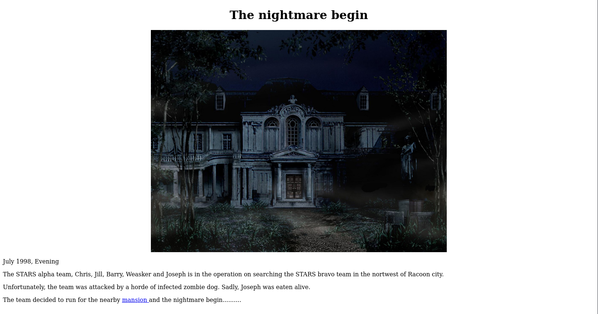

```text
July 1998, Evening

The STARS alpha team, Chris, Jill, Barry, Weasker and Joseph is in the operation on searching the STARS bravo team in the nortwest of Racoon city.

Unfortunately, the team was attacked by a horde of infected zombie dog. Sadly, Joseph was eaten alive.

The team decided to run for the nearby mansion and the nightmare begin..........
```

Answer: `STARS alpha team`

---------------------------------------------------------------------------------------

### Task 2: The Mansion

Collect all necessary items and advanced to the next level. The format of the Item flag:

`Item_name{32 character}`

Some of the doors are locked. Use the item flag to unlock the door.

**Tips**: It is better to record down all the information inside a notepad

---------------------------------------------------------------------------------------

Clicking on the `mansion`-link we come to the `Mail hall`.

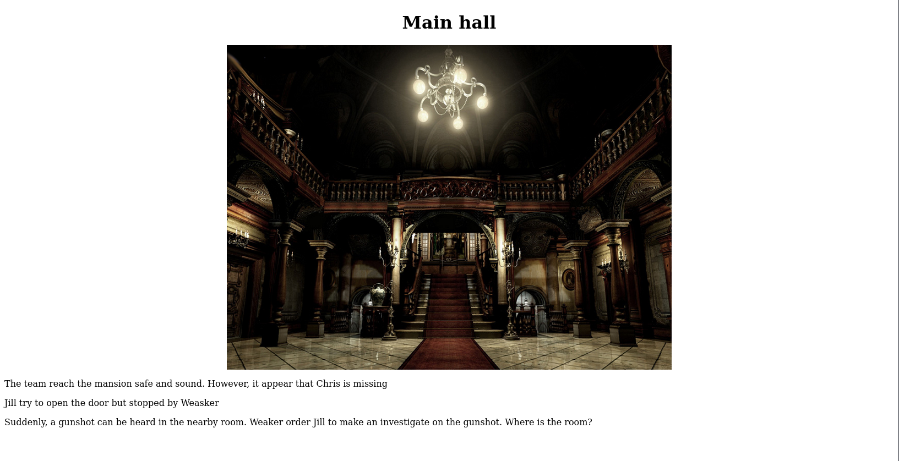

In the HTML-source of the page we find this comment.

```html
<---snip--->
        <p>Suddenly, a gunshot can be heard in the nearby room. Weaker order Jill to make an investigate on the gunshot. Where is the room?</p>
    <!-- It is in the /diningRoom/ -->
        </body>

</html>
```

Continuing to `http://10.112.160.113/diningRoom/` we see:

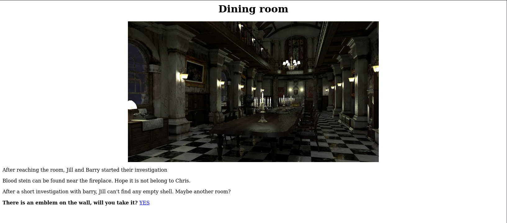

#### What is the emblem flag

With the `YES`-link we get the emblem flag.

Answer: `emblem{<REDACTED>}`

Checking the HTML-source of the `Dining Room` we find this comment.

```html
<---snip--->
        <p>After a short investigation with barry, Jill can't find any empty shell. Maybe another room?</p>
        <!-- SG93IGFib3V0IHRoZSAvdGVhUm9vbS8= -->
        </body>

            <p><b>There is an emblem on the wall, will you take it?   </b><a href="emblem.php">YES</a></p> 
</html>
```

This looks like Base64-encoding.

```bash
┌──(kali㉿kali)-[/mnt/…/TryHackMe/Challenges/Medium/Biohazard]
└─$ echo 'SG93IGFib3V0IHRoZSAvdGVhUm9vbS8=' | base64 -d        
How about the /teaRoom/
```

We head to the `Tea Room` at `http://10.112.160.113/teaRoom/`:

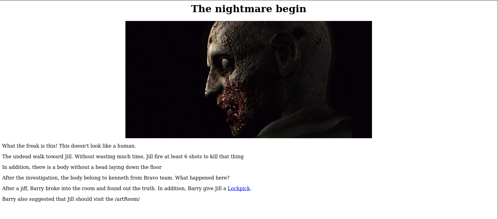

#### What is the lock pick flag

With the `Lockpick`-link we get the lock pick flag.

Answer: `lock_pick{<REDACTED>}`

Then we continue to the `Art room` (`http://10.112.160.113/artRoom/`):

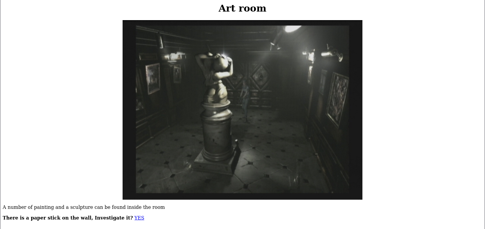

With the `YES`-link, we get the following "map" of the mansion:

```text
Look like a map

Location:
/diningRoom/
/teaRoom/
/artRoom/
/barRoom/
/diningRoom2F/
/tigerStatusRoom/
/galleryRoom/
/studyRoom/
/armorRoom/
/attic/
```

Let's go to the `Bar Room` next (`http://10.112.160.113/barRoom/`).

However, we are stopped at the entrance

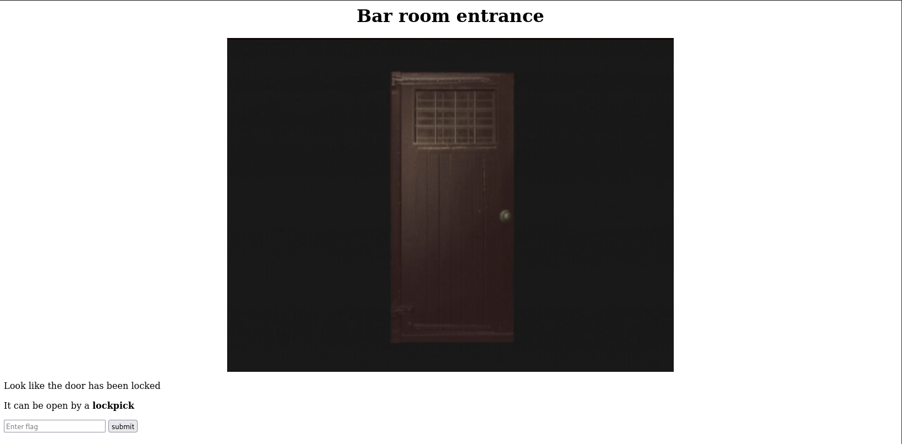

And need to use our lock pick to get to it.

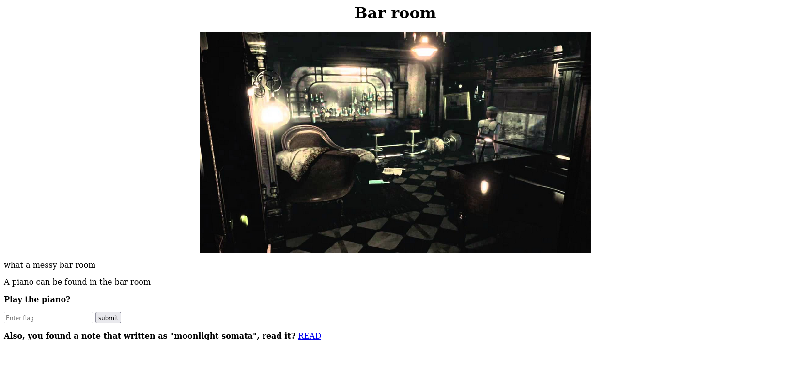

#### What is the music sheet flag

With the `READ`-link we get the following music note:

```text
Look like a music note
NV2XG2LDL5ZWQZLFOR5TGNRSMQ3TEZDFMFTDMNLGGVRGIYZWGNSGCZLDMU3GCMLGGY3TMZL5
```

This is Base32-encoding.

```bash
┌──(kali㉿kali)-[/mnt/…/TryHackMe/Challenges/Medium/Biohazard]
└─$ echo 'NV2XG2LDL5ZWQZLFOR5TGNRSMQ3TEZDFMFTDMNLGGVRGIYZWGNSGCZLDMU3GCMLGGY3TMZL5' | base32 -d
music_sheet{<REDACTED>}
```

Answer: `music_sheet{<REDACTED>}`

#### What is the gold emblem flag

Hint: You thought there is only one slot?

If we enter the music sheet flag here, we get to a `Secret Bar Room` with a gold emblem.

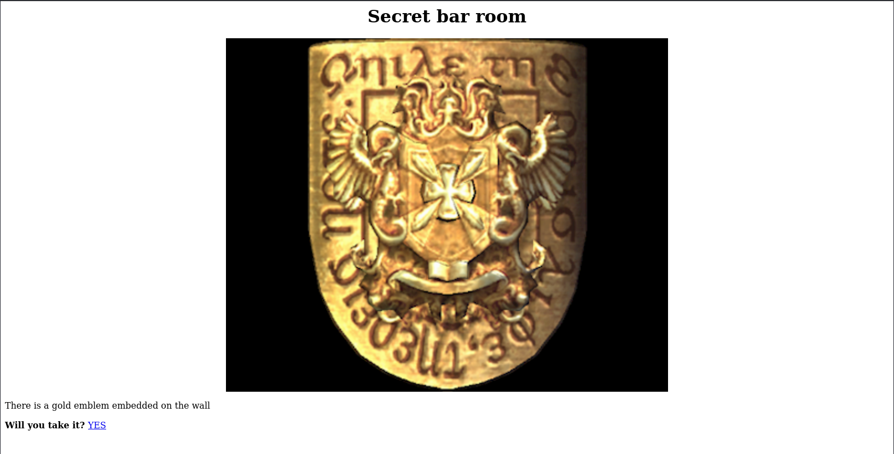

Answer: `gold_emblem{<REDACTED>}`

#### What is the blue gem flag

Hint: Check the source

Next, we follow the map and continue to the `Dining Room 2F` (`http://10.112.160.113/diningRoom2F/`).

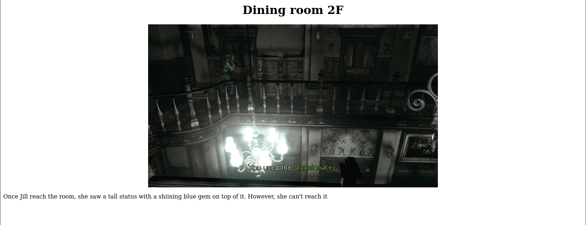

Checking for HTML-comments we find this one:

`<!-- Lbh trg gur oyhr trz ol chfuvat gur fgnghf gb gur ybjre sybbe. Gur trz vf ba gur qvavatEbbz svefg sybbe. Ivfvg fnccuver.ugzy -->`

This looks like ROT13-encoding:

```bash
┌──(kali㉿kali)-[/mnt/…/TryHackMe/Challenges/Medium/Biohazard]
└─$ echo 'Lbh trg gur oyhr trz ol chfuvat gur fgnghf gb gur ybjre sybbe. Gur trz vf ba gur qvavatEbbz svefg sybbe. Ivfvg fnccuver.ugzy' | rot13
You get the blue gem by pushing the status to the lower floor. The gem is on the diningRoom first floor. Visit sapphire.html

┌──(kali㉿kali)-[/mnt/…/TryHackMe/Challenges/Medium/Biohazard]
└─$ curl http://$TARGET_IP/sapphire.html                    
<!DOCTYPE HTML PUBLIC "-//IETF//DTD HTML 2.0//EN">
<html><head>
<title>404 Not Found</title>
</head><body>
<h1>Not Found</h1>
<p>The requested URL was not found on this server.</p>
<hr>
<address>Apache/2.4.29 (Ubuntu) Server at 10.112.160.113 Port 80</address>
</body></html>

┌──(kali㉿kali)-[/mnt/…/TryHackMe/Challenges/Medium/Biohazard]
└─$ curl http://$TARGET_IP/diningRoom/sapphire.html
blue_jewel{<REDACTED>}
```

Answer: `blue_jewel{<REDACTED>}`

Onwards to the next room on the map, the `Tiger status room` at `http://10.112.160.113/tigerStatusRoom/`.

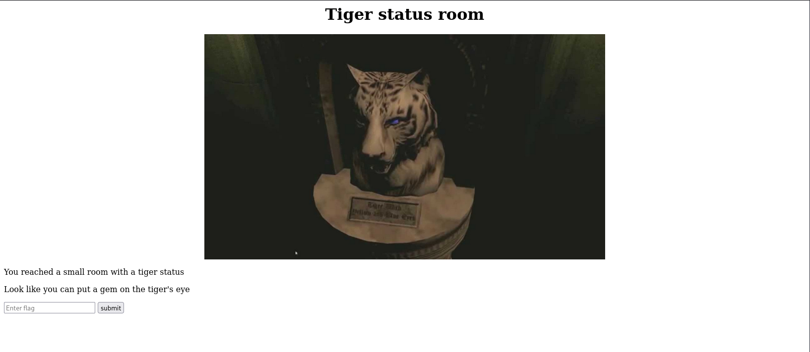

Here we use the blue gem found earlier and get the first crest:

```text
crest 1:
S0pXRkVVS0pKQkxIVVdTWUpFM0VTUlk9
Hint 1: Crest 1 has been encoded twice
Hint 2: Crest 1 contanis 14 letters
Note: You need to collect all 4 crests, combine and decode to reavel another path
The combination should be crest 1 + crest 2 + crest 3 + crest 4. Also, the combination is a type of encoded base and you need to decode it
```

This can be decoded by a combination of Base64 and Base32.

```bash
┌──(kali㉿kali)-[/mnt/…/TryHackMe/Challenges/Medium/Biohazard]
└─$ echo 'S0pXRkVVS0pKQkxIVVdTWUpFM0VTUlk9' | base64 -d | base32 -d
RlRQIHVzZXI6IG
```

The search continues to the next room on the map, the `Gallery Room` at `http://10.112.160.113/galleryRoom/`:

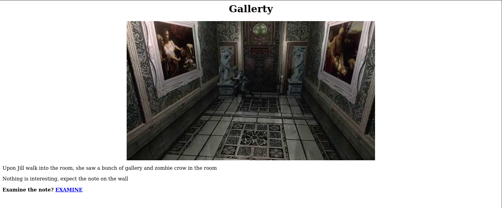

With the `EXAMINE`-link, we find crest #2:

```text
crest 2:
GVFWK5KHK5WTGTCILE4DKY3DNN4GQQRTM5AVCTKE
Hint 1: Crest 2 has been encoded twice
Hint 2: Crest 2 contanis 18 letters
Note: You need to collect all 4 crests, combine and decode to reavel another path
The combination should be crest 1 + crest 2 + crest 3 + crest 4. Also, the combination is a type of encoded base and you need to decode it
```

This can be decoded by a combination of Base32 and Base58:

```bash
┌──(kali㉿kali)-[/mnt/…/TryHackMe/Challenges/Medium/Biohazard]
└─$ echo 'GVFWK5KHK5WTGTCILE4DKY3DNN4GQQRTM5AVCTKE' | base32 -d | base58 -d
h1bnRlciwgRlRQIHBh
```

Next stop is the `Study Room` at `http://10.112.160.113/studyRoom/` but we need a helmet symbol.

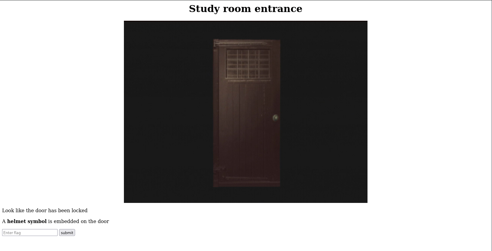

Let's continue to the `Armor Room` at `http://10.112.160.113/armorRoom/` instead.

But here we need a shield symbol.

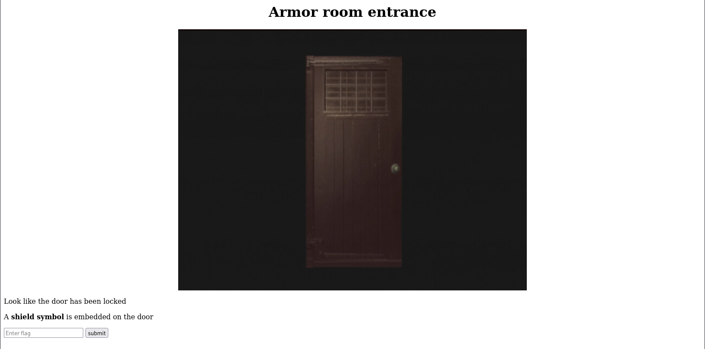

So we head for the `Attic` at `http://10.112.160.113/attic/`.

But here too we need a shield symbol.

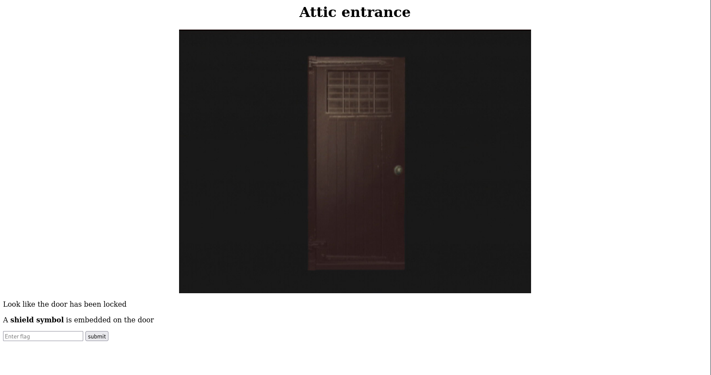

What have we missed?

#### What is the shield key flag

Hint: Blaise de Vigenère

Back at the `Dining Room` (`http://10.112.160.113/diningRoom/`) we could input an emblem.

With the gold emblem flag we get the following:

```text
klfvg ks r wimgnd biz mpuiui ulg fiemok tqod. Xii jvmc tbkg ks tempgf tyi_hvgct_jljinf_kvc
```

This isn't ROT13 but a Vigenère cipher and we can solve it with [this Guballa online solver](https://www.guballa.de/vigenere-solver).

The result is:

```text
there is a shield key inside the dining room. The html page is called the_great_shield_key
```

We can get it with curl.

```bash
┌──(kali㉿kali)-[/mnt/…/TryHackMe/Challenges/Medium/Biohazard]
└─$ curl http://$TARGET_IP/diningRoom/the_great_shield_key                                        
<!DOCTYPE HTML PUBLIC "-//IETF//DTD HTML 2.0//EN">
<html><head>
<title>404 Not Found</title>
</head><body>
<h1>Not Found</h1>
<p>The requested URL was not found on this server.</p>
<hr>
<address>Apache/2.4.29 (Ubuntu) Server at 10.112.160.113 Port 80</address>
</body></html>

┌──(kali㉿kali)-[/mnt/…/TryHackMe/Challenges/Medium/Biohazard]
└─$ curl http://$TARGET_IP/diningRoom/the_great_shield_key.html
<p>shield_key{<REDACTED>}</p>
```

Answer: `shield_key{<REDACTED>}`

Now we can go back to the `Armor Room` and use the shield key.

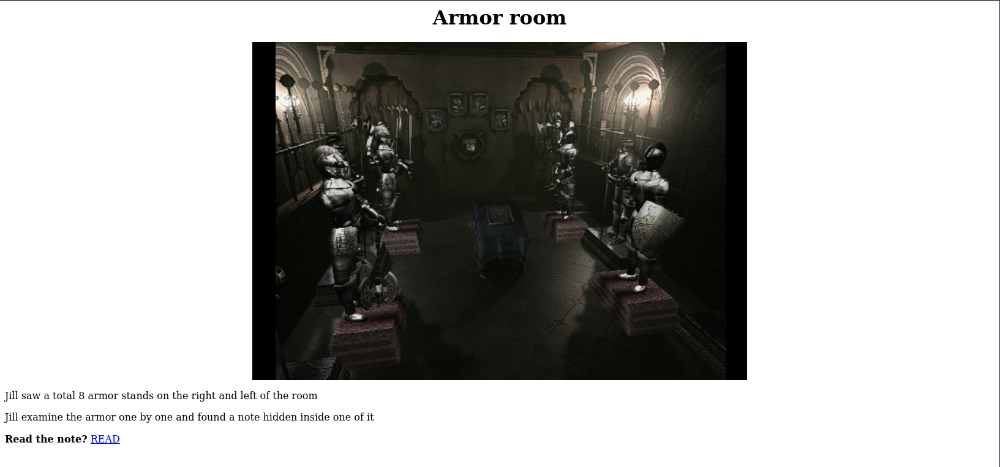

Here we find crest #3:

```text
crest 3:
MDAxMTAxMTAgMDAxMTAwMTEgMDAxMDAwMDAgMDAxMTAwMTEgMDAxMTAwMTEgMDAxMDAwMDAgMDAxMTAxMDAgMDExMDAxMDAgMDAxMDAwMDAgMDAxMTAwMTEgMDAxMTAxMTAgMDAxMDAwMDAgMDAxMTAxMDAgMDAxMTEwMDEgMDAxMDAwMDAgMDAxMTAxMDAgMDAxMTEwMDAgMDAxMDAwMDAgMDAxMTAxMTAgMDExMDAwMTEgMDAxMDAwMDAgMDAxMTAxMTEgMDAxMTAxMTAgMDAxMDAwMDAgMDAxMTAxMTAgMDAxMTAxMDAgMDAxMDAwMDAgMDAxMTAxMDEgMDAxMTAxMTAgMDAxMDAwMDAgMDAxMTAwMTEgMDAxMTEwMDEgMDAxMDAwMDAgMDAxMTAxMTAgMDExMDAwMDEgMDAxMDAwMDAgMDAxMTAxMDEgMDAxMTEwMDEgMDAxMDAwMDAgMDAxMTAxMDEgMDAxMTAxMTEgMDAxMDAwMDAgMDAxMTAwMTEgMDAxMTAxMDEgMDAxMDAwMDAgMDAxMTAwMTEgMDAxMTAwMDAgMDAxMDAwMDAgMDAxMTAxMDEgMDAxMTEwMDAgMDAxMDAwMDAgMDAxMTAwMTEgMDAxMTAwMTAgMDAxMDAwMDAgMDAxMTAxMTAgMDAxMTEwMDA=
Hint 1: Crest 3 has been encoded three times
Hint 2: Crest 3 contanis 19 letters
Note: You need to collect all 4 crests, combine and decode to reavel another path
The combination should be crest 1 + crest 2 + crest 3 + crest 4. Also, the combination is a type of encoded base and you need to decode it
```

We can decode it with [CyberChef](https://gchq.github.io/CyberChef/):

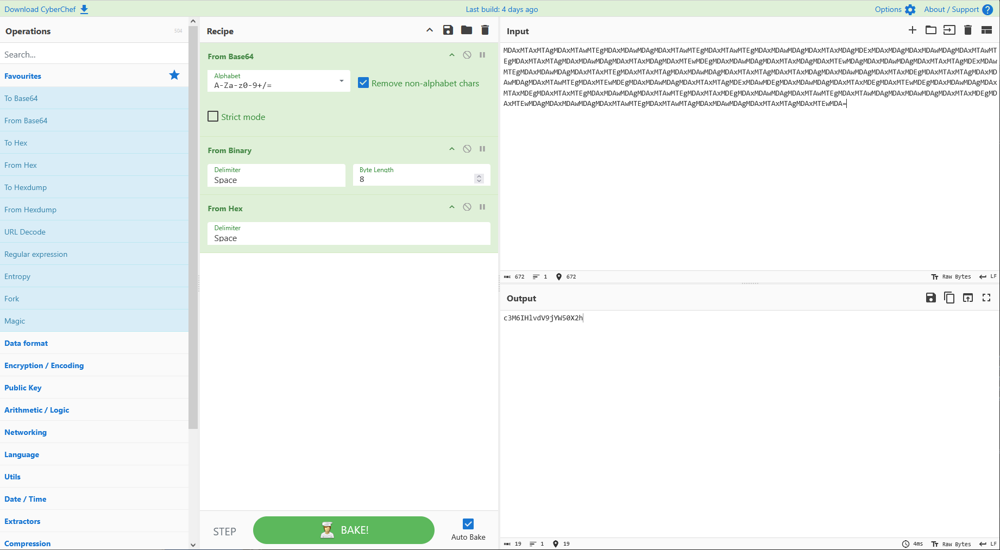

The decoded crest is: `c3M6IHlvdV9jYW50X2h`.

Next, we go to the `Attic` and with the shield key we can pass.

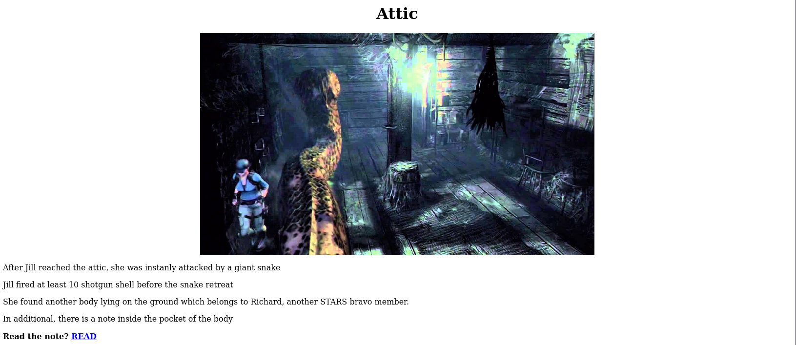

Here we find the fourth and final crest:

```text
crest 4:
gSUERauVpvKzRpyPpuYz66JDmRTbJubaoArM6CAQsnVwte6zF9J4GGYyun3k5qM9ma4s
Hint 1: Crest 2 has been encoded twice
Hint 2: Crest 2 contanis 17 characters
Note: You need to collect all 4 crests, combine and decode to reavel another path
The combination should be crest 1 + crest 2 + crest 3 + crest 4. Also, the combination is a type of encoded base and you need to decode it
```

We decode it with:

```bash
┌──(kali㉿kali)-[/mnt/…/TryHackMe/Challenges/Medium/Biohazard]
└─$ echo 'gSUERauVpvKzRpyPpuYz66JDmRTbJubaoArM6CAQsnVwte6zF9J4GGYyun3k5qM9ma4s' | base58 -d | xxd -r -p
pZGVfZm9yZXZlcg==
```

#### What is the FTP username

Hint: You need all 4 crests

With all four crests we can finally do a full decode:

```bash
┌──(kali㉿kali)-[/mnt/…/TryHackMe/Challenges/Medium/Biohazard]
└─$ echo 'RlRQIHVzZXI6IGh1bnRlciwgRlRQIHBhc3M6IHlvdV9jYW50X2hpZGVfZm9yZXZlcg==' | base64 -d            
FTP user: hunter, FTP pass: you_cant_hide_forever
```

Answer: `hunter`

#### What is the FTP password

Hint: You need all 4 crests

See the output above.

Answer: `you_cant_hide_forever`

---------------------------------------------------------------------------------------

### Task 3: The guard house

After gaining access to the FTP server, you need to solve another puzzle.

Now we can login at the FTP-server with our credentials and download all the files.

```bash
┌──(kali㉿kali)-[/mnt/…/TryHackMe/Challenges/Medium/Biohazard]
└─$ ftp hunter@$TARGET_IP
Connected to 10.112.160.113.
220 (vsFTPd 3.0.3)
331 Please specify the password.
Password: 
230 Login successful.
Remote system type is UNIX.
Using binary mode to transfer files.
ftp> ls -la
229 Entering Extended Passive Mode (|||62253|)
150 Here comes the directory listing.
drwxrwxrwx    2 1002     1002         4096 Sep 20  2019 .
drwxrwxrwx    2 1002     1002         4096 Sep 20  2019 ..
-rw-r--r--    1 0        0            7994 Sep 19  2019 001-key.jpg
-rw-r--r--    1 0        0            2210 Sep 19  2019 002-key.jpg
-rw-r--r--    1 0        0            2146 Sep 19  2019 003-key.jpg
-rw-r--r--    1 0        0             121 Sep 19  2019 helmet_key.txt.gpg
-rw-r--r--    1 0        0             170 Sep 20  2019 important.txt
226 Directory send OK.
ftp> bin
200 Switching to Binary mode.
ftp> mget *
mget 001-key.jpg [anpqy?]? a
Prompting off for duration of mget.
229 Entering Extended Passive Mode (|||43957|)
150 Opening BINARY mode data connection for 001-key.jpg (7994 bytes).
100% |*************************************************************************************************************************************************|  7994        8.63 MiB/s    00:00 ETA
226 Transfer complete.
7994 bytes received in 00:00 (323.40 KiB/s)
229 Entering Extended Passive Mode (|||27695|)
150 Opening BINARY mode data connection for 002-key.jpg (2210 bytes).
100% |*************************************************************************************************************************************************|  2210        1.59 MiB/s    00:00 ETA
226 Transfer complete.
2210 bytes received in 00:00 (87.20 KiB/s)
229 Entering Extended Passive Mode (|||23780|)
150 Opening BINARY mode data connection for 003-key.jpg (2146 bytes).
100% |*************************************************************************************************************************************************|  2146        3.03 MiB/s    00:00 ETA
226 Transfer complete.
2146 bytes received in 00:00 (88.11 KiB/s)
229 Entering Extended Passive Mode (|||32587|)
150 Opening BINARY mode data connection for helmet_key.txt.gpg (121 bytes).
100% |*************************************************************************************************************************************************|   121       26.47 KiB/s    00:00 ETA
226 Transfer complete.
121 bytes received in 00:00 (8.62 KiB/s)
229 Entering Extended Passive Mode (|||49091|)
150 Opening BINARY mode data connection for important.txt (170 bytes).
100% |*************************************************************************************************************************************************|   170      217.86 KiB/s    00:00 ETA
226 Transfer complete.
170 bytes received in 00:00 (6.81 KiB/s)
ftp> exit
221 Goodbye.
```

#### Where is the hidden directory mentioned by Barry

Let's start by checking the text file.

```bash
┌──(kali㉿kali)-[/mnt/…/TryHackMe/Challenges/Medium/Biohazard]
└─$ cat important.txt                                          
Jill,

I think the helmet key is inside the text file, but I have no clue on decrypting stuff. Also, I come across a /hidden_closet/ door but it was locked.

From,
Barry
```

At `http://10.112.160.113/hidden_closet/` we also need the helmet symbol.

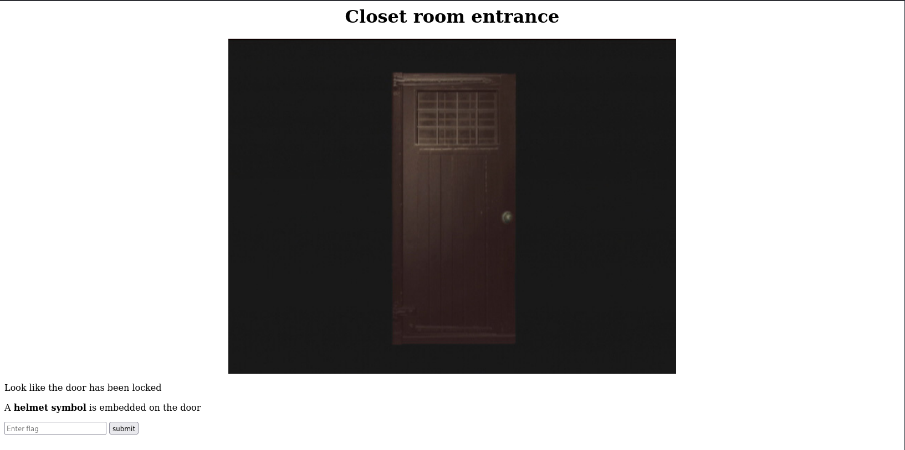

Answer: `/hidden_closet/`

Checking the JPEG-files for metadata, we find an encoded comment in one of them (`002-key.jpg`).

```bash
┌──(kali㉿kali)-[/mnt/…/TryHackMe/Challenges/Medium/Biohazard]
└─$ exiftool *.jpg                                                                         
======== 001-key.jpg
ExifTool Version Number         : 13.50
File Name                       : 001-key.jpg
Directory                       : .
File Size                       : 8.0 kB
File Modification Date/Time     : 2019:09:19 08:01:21+02:00
File Access Date/Time           : 2026:08:24 14:32:27+02:00
File Inode Change Date/Time     : 2019:09:19 08:01:21+02:00
File Permissions                : -rwxrwxrwx
File Type                       : JPEG
File Type Extension             : jpg
MIME Type                       : image/jpeg
JFIF Version                    : 1.01
Resolution Unit                 : None
X Resolution                    : 1
Y Resolution                    : 1
Image Width                     : 400
Image Height                    : 320
Encoding Process                : Baseline DCT, Huffman coding
Bits Per Sample                 : 8
Color Components                : 3
Y Cb Cr Sub Sampling            : YCbCr4:2:0 (2 2)
Image Size                      : 400x320
Megapixels                      : 0.128
======== 002-key.jpg
ExifTool Version Number         : 13.50
File Name                       : 002-key.jpg
Directory                       : .
File Size                       : 2.2 kB
File Modification Date/Time     : 2019:09:19 08:08:31+02:00
File Access Date/Time           : 2026:08:24 14:32:45+02:00
File Inode Change Date/Time     : 2019:09:19 08:08:31+02:00
File Permissions                : -rwxrwxrwx
File Type                       : JPEG
File Type Extension             : jpg
MIME Type                       : image/jpeg
JFIF Version                    : 1.01
Resolution Unit                 : None
X Resolution                    : 1
Y Resolution                    : 1
Comment                         : 5fYmVfZGVzdHJveV9
Image Width                     : 100
Image Height                    : 80
Encoding Process                : Progressive DCT, Huffman coding
Bits Per Sample                 : 8
Color Components                : 3
Y Cb Cr Sub Sampling            : YCbCr4:2:0 (2 2)
Image Size                      : 100x80
Megapixels                      : 0.008
======== 003-key.jpg
ExifTool Version Number         : 13.50
File Name                       : 003-key.jpg
Directory                       : .
File Size                       : 2.1 kB
File Modification Date/Time     : 2019:09:19 08:19:17+02:00
File Access Date/Time           : 2026:08:24 14:32:45+02:00
File Inode Change Date/Time     : 2019:09:19 08:19:17+02:00
File Permissions                : -rwxrwxrwx
File Type                       : JPEG
File Type Extension             : jpg
MIME Type                       : image/jpeg
JFIF Version                    : 1.01
Resolution Unit                 : None
X Resolution                    : 1
Y Resolution                    : 1
Comment                         : Compressed by jpeg-recompress
Image Width                     : 100
Image Height                    : 80
Encoding Process                : Progressive DCT, Huffman coding
Bits Per Sample                 : 8
Color Components                : 3
Y Cb Cr Sub Sampling            : YCbCr4:2:0 (2 2)
Image Size                      : 100x80
Megapixels                      : 0.008
    3 image files read
```

The comment doesn't decode to anything useful and could be a password!?

Let's try that.

```bash
┌──(kali㉿kali)-[/mnt/…/TryHackMe/Challenges/Medium/Biohazard]
└─$ steghide extract -sf 001-key.jpg -p 5fYmVfZGVzdHJveV9
steghide: could not extract any data with that passphrase!

┌──(kali㉿kali)-[/mnt/…/TryHackMe/Challenges/Medium/Biohazard]
└─$ steghide extract -sf 002-key.jpg -p 5fYmVfZGVzdHJveV9
steghide: could not extract any data with that passphrase!

┌──(kali㉿kali)-[/mnt/…/TryHackMe/Challenges/Medium/Biohazard]
└─$ steghide extract -sf 003-key.jpg -p 5fYmVfZGVzdHJveV9
steghide: could not extract any data with that passphrase!
```

But no. But let's also check without any password.

```bash
┌──(kali㉿kali)-[/mnt/…/TryHackMe/Challenges/Medium/Biohazard]
└─$ steghide extract -sf 001-key.jpg -p ''               
wrote extracted data to "key-001.txt".

┌──(kali㉿kali)-[/mnt/…/TryHackMe/Challenges/Medium/Biohazard]
└─$ cat key-001.txt  
cGxhbnQ0Ml9jYW
```

And we have another password candidate.

```bash
┌──(kali㉿kali)-[/mnt/…/TryHackMe/Challenges/Medium/Biohazard]
└─$ steghide extract -sf 001-key.jpg -p cGxhbnQ0Ml9jYW
steghide: could not extract any data with that passphrase!

┌──(kali㉿kali)-[/mnt/…/TryHackMe/Challenges/Medium/Biohazard]
└─$ steghide extract -sf 002-key.jpg -p cGxhbnQ0Ml9jYW
steghide: could not extract any data with that passphrase!

┌──(kali㉿kali)-[/mnt/…/TryHackMe/Challenges/Medium/Biohazard]
└─$ steghide extract -sf 003-key.jpg -p cGxhbnQ0Ml9jYW
steghide: could not extract any data with that passphrase!
```

Nope, no luck!

Then we try Binwalk3, which doesn't like my VMware-mounted filesystem.

```bash
┌──(kali㉿kali)-[/mnt/…/TryHackMe/Challenges/Medium/Biohazard]
└─$ cp *.jpg ~/Downloads               

┌──(kali㉿kali)-[/mnt/…/TryHackMe/Challenges/Medium/Biohazard]
└─$ cd ~/Downloads      

┌──(kali㉿kali)-[~/Downloads]
└─$ binwalk3 -e 001-key.jpg

                                                                         /home/kali/Downloads/extractions/001-key.jpg
----------------------------------------------------------------------------------------------------------------------------------------------------------------------------------------------
DECIMAL                            HEXADECIMAL                        DESCRIPTION
----------------------------------------------------------------------------------------------------------------------------------------------------------------------------------------------
0                                  0x0                                JPEG image, total size: 7994 bytes
----------------------------------------------------------------------------------------------------------------------------------------------------------------------------------------------
[#] Extraction of jpeg data at offset 0x0 declined
----------------------------------------------------------------------------------------------------------------------------------------------------------------------------------------------

Analyzed 1 file for 85 file signatures (187 magic patterns) in 24.0 milliseconds

┌──(kali㉿kali)-[~/Downloads]
└─$ binwalk3 -e 002-key.jpg

                                                                         /home/kali/Downloads/extractions/002-key.jpg
----------------------------------------------------------------------------------------------------------------------------------------------------------------------------------------------
DECIMAL                            HEXADECIMAL                        DESCRIPTION
----------------------------------------------------------------------------------------------------------------------------------------------------------------------------------------------
0                                  0x0                                JPEG image, total size: 2210 bytes
----------------------------------------------------------------------------------------------------------------------------------------------------------------------------------------------
[#] Extraction of jpeg data at offset 0x0 declined
----------------------------------------------------------------------------------------------------------------------------------------------------------------------------------------------

Analyzed 1 file for 85 file signatures (187 magic patterns) in 3.0 milliseconds

┌──(kali㉿kali)-[~/Downloads]
└─$ binwalk3 -e 003-key.jpg

                                                                         /home/kali/Downloads/extractions/003-key.jpg
----------------------------------------------------------------------------------------------------------------------------------------------------------------------------------------------
DECIMAL                            HEXADECIMAL                        DESCRIPTION
----------------------------------------------------------------------------------------------------------------------------------------------------------------------------------------------
0                                  0x0                                JPEG image, total size: 1930 bytes
1930                               0x78A                              ZIP archive, file count: 1, total size: 216 bytes
----------------------------------------------------------------------------------------------------------------------------------------------------------------------------------------------
[#] Extraction of jpeg data at offset 0x0 declined
[+] Extraction of zip data at offset 0x78A completed successfully
----------------------------------------------------------------------------------------------------------------------------------------------------------------------------------------------

Analyzed 1 file for 85 file signatures (187 magic patterns) in 147.0 milliseconds
```

Let's check the result.

```bash
┌──(kali㉿kali)-[~/Downloads]
└─$ cd extractions 

┌──(kali㉿kali)-[~/Downloads/extractions]
└─$ ls -la                  
total 12
drwxrwxr-x 3 kali kali 4096 Aug 24 14:48 .
drwxr-xr-x 5 kali kali 4096 Aug 24 14:48 ..
lrwxrwxrwx 1 kali kali   32 Aug 24 14:48 001-key.jpg -> /home/kali/Downloads/001-key.jpg
lrwxrwxrwx 1 kali kali   32 Aug 24 14:48 002-key.jpg -> /home/kali/Downloads/002-key.jpg
lrwxrwxrwx 1 kali kali   32 Aug 24 14:48 003-key.jpg -> /home/kali/Downloads/003-key.jpg
drwxrwxr-x 3 kali kali 4096 Aug 24 14:48 003-key.jpg.extracted

┌──(kali㉿kali)-[~/Downloads/extractions]
└─$ cd 003-key.jpg.extracted                     

┌──(kali㉿kali)-[~/Downloads/extractions/003-key.jpg.extracted]
└─$ ls -la
total 12
drwxrwxr-x 3 kali kali 4096 Aug 24 14:48 .
drwxrwxr-x 3 kali kali 4096 Aug 24 14:48 ..
drwxrwxr-x 2 kali kali 4096 Aug 24 14:48 78A

┌──(kali㉿kali)-[~/Downloads/extractions/003-key.jpg.extracted]
└─$ cd 78A                  

┌──(kali㉿kali)-[~/Downloads/extractions/003-key.jpg.extracted/78A]
└─$ ls -la
total 12
drwxrwxr-x 2 kali kali 4096 Aug 24 14:48 .
drwxrwxr-x 3 kali kali 4096 Aug 24 14:48 ..
-rw-r--r-- 1 kali kali   14 Sep 19  2019 key-003.txt

┌──(kali㉿kali)-[~/Downloads/extractions/003-key.jpg.extracted/78A]
└─$ cat key-003.txt 
3aXRoX3Zqb2x0

┌──(kali㉿kali)-[~/Downloads/extractions/003-key.jpg.extracted/78A]
└─$ cp key-003.txt /mnt/hgfs/Wargames/TryHackMe/Challenges/Medium/Biohazard 
```

#### Password for the encrypted file

Hint: Three picture, three hints: hide, comment and walk away

Hhm, we have three keys that looks encoded. What if we combine them like the crests?

```bash
┌──(kali㉿kali)-[/mnt/…/TryHackMe/Challenges/Medium/Biohazard]
└─$ exiftool -T -Comment 002-key.jpg > key-002.txt

┌──(kali㉿kali)-[/mnt/…/TryHackMe/Challenges/Medium/Biohazard]
└─$ cat key-*.txt | tr -d '\n'
cGxhbnQ0Ml9jYW5fYmVfZGVzdHJveV93aXRoX3Zqb2x0  

┌──(kali㉿kali)-[/mnt/…/TryHackMe/Challenges/Medium/Biohazard]
└─$ cat key-*.txt | tr -d '\n' | base64 -d
plant42_can_be_destroy_with_vjolt
```

A likely GPG-password!

Answer: `plant42_can_be_destroy_with_vjolt`

#### What is the helmet key flag

Hint: key 1 + key 2 + key 3 is not enough. You need to do something

Now we can get the helmet key.

```bash
┌──(kali㉿kali)-[/mnt/…/TryHackMe/Challenges/Medium/Biohazard]
└─$ gpg --decrypt helmet_key.txt.gpg
gpg: AES256.CFB encrypted data
gpg: encrypted with 1 passphrase
helmet_key{<REDACTED>}
```

Answer: `helmet_key{<REDACTED>}`

---------------------------------------------------------------------------------------

### Task 4: The Revisit

Done with the puzzle? There are places you have explored before but yet to access.

#### What is the SSH login username

Hint: You missed a room

We have two rooms where we can use the helmet key: `The Study` and `The Closet`.

In the `Study Room` we find a book (a `doom.tar.gz` file).

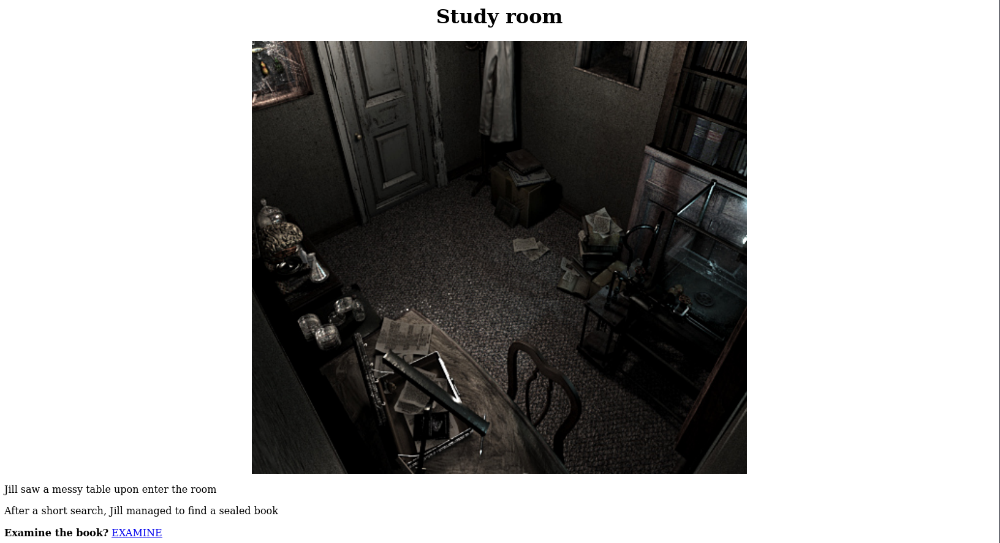

We check the file and find an SSH user.

```bash
┌──(kali㉿kali)-[/mnt/…/TryHackMe/Challenges/Medium/Biohazard]
└─$ gunzip --stdout doom.tar.gz | tar -xv 
eagle_medal.txt

┌──(kali㉿kali)-[/mnt/…/TryHackMe/Challenges/Medium/Biohazard]
└─$ cat eagle_medal.txt                   
SSH user: umbrella_guest
```

Answer: `umbrella_guest`

And in the `Closet Room` we find a note and a wolf medal.

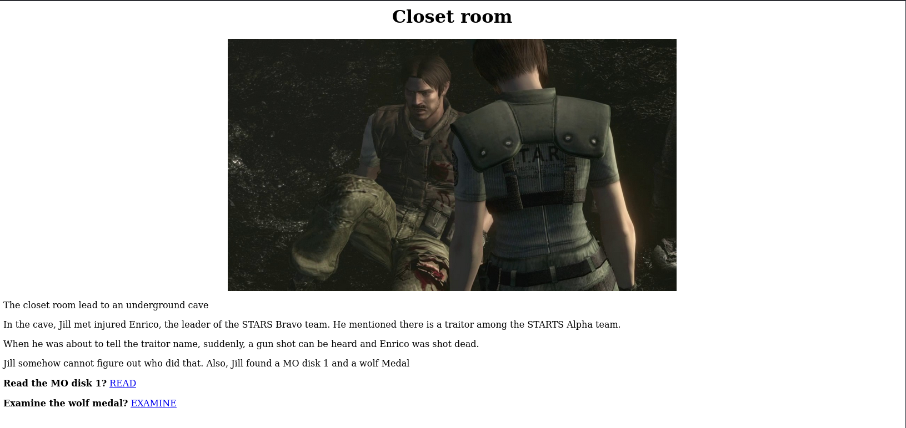

The note contains:

```text
wpbwbxr wpkzg pltwnhro, txrks_xfqsxrd_bvv_fy_rvmexa_ajk
```

This is another Vigenère cipher and it decodes to

```text
weasker login password, stars_members_are_my_guinea_pig
```

#### What is the SSH login password

The wolf medal reads: `SSH password: T_virus_rules`.

Answer: `T_virus_rules`

#### Who the STARS bravo team leader

We find the answer in the text of the `Closet Room`.

```bash
The closet room lead to an underground cave

In the cave, Jill met injured Enrico, the leader of the STARS Bravo team. He mentioned there is a traitor among the STARTS Alpha team.

When he was about to tell the traitor name, suddenly, a gun shot can be heard and Enrico was shot dead.

Jill somehow cannot figure out who did that. Also, Jill found a MO disk 1 and a wolf Medal
```

Answer: `Enrico`

---------------------------------------------------------------------------------------

### Task 5: Underground laboratory

Time for the final showdown. Can you escape the nightmare?

Next, we login with SSH.

```bash
┌──(kali㉿kali)-[/mnt/…/TryHackMe/Challenges/Medium/Biohazard]
└─$ ssh umbrella_guest@$TARGET_IP
The authenticity of host '10.112.160.113 (10.112.160.113)' can't be established.
ED25519 key fingerprint is SHA256:dOQYq6o72K3z+Nn6HtAR4ZFXoEZklDafT3VuF728yWc.
This key is not known by any other names.
Are you sure you want to continue connecting (yes/no/[fingerprint])? yes
Warning: Permanently added '10.112.160.113' (ED25519) to the list of known hosts.
umbrella_guest@10.112.160.113's password: 
Welcome to Ubuntu 18.04 LTS (GNU/Linux 4.15.0-20-generic x86_64)

 * Documentation:  https://help.ubuntu.com
 * Management:     https://landscape.canonical.com
 * Support:        https://ubuntu.com/advantage


 * Canonical Livepatch is available for installation.
   - Reduce system reboots and improve kernel security. Activate at:
     https://ubuntu.com/livepatch

320 packages can be updated.
58 updates are security updates.

Failed to connect to https://changelogs.ubuntu.com/meta-release-lts. Check your Internet connection or proxy settings

Last login: Fri Sep 20 03:25:46 2019 from 127.0.0.1
umbrella_guest@umbrella_corp:~$ 
```

#### Where you found Chris

In our home directory, we find a hidden `.jailcell` directory.

```bash
umbrella_guest@umbrella_corp:~$ ls -la
total 64
drwxr-xr-x  8 umbrella_guest umbrella 4096 Sep 20  2019 .
drwxr-xr-x  5 root           root     4096 Sep 20  2019 ..
-rw-r--r--  1 umbrella_guest umbrella  220 Sep 19  2019 .bash_logout
-rw-r--r--  1 umbrella_guest umbrella 3771 Sep 19  2019 .bashrc
drwxrwxr-x  6 umbrella_guest umbrella 4096 Sep 20  2019 .cache
drwxr-xr-x 11 umbrella_guest umbrella 4096 Sep 19  2019 .config
-rw-r--r--  1 umbrella_guest umbrella   26 Sep 19  2019 .dmrc
drwx------  3 umbrella_guest umbrella 4096 Sep 19  2019 .gnupg
-rw-------  1 umbrella_guest umbrella  346 Sep 19  2019 .ICEauthority
drwxr-xr-x  2 umbrella_guest umbrella 4096 Sep 20  2019 .jailcell
drwxr-xr-x  3 umbrella_guest umbrella 4096 Sep 19  2019 .local
-rw-r--r--  1 umbrella_guest umbrella  807 Sep 19  2019 .profile
drwx------  2 umbrella_guest umbrella 4096 Sep 20  2019 .ssh
-rw-------  1 umbrella_guest umbrella  109 Sep 19  2019 .Xauthority
-rw-------  1 umbrella_guest umbrella 7546 Sep 19  2019 .xsession-errors
umbrella_guest@umbrella_corp:~$ cd .jailcell/
umbrella_guest@umbrella_corp:~/.jailcell$ ls -la
total 12
drwxr-xr-x 2 umbrella_guest umbrella 4096 Sep 20  2019 .
drwxr-xr-x 8 umbrella_guest umbrella 4096 Sep 20  2019 ..
-rw-r--r-- 1 umbrella_guest umbrella  501 Sep 20  2019 chris.txt
umbrella_guest@umbrella_corp:~/.jailcell$ cat chris.txt 
Jill: Chris, is that you?
Chris: Jill, you finally come. I was locked in the Jail cell for a while. It seem that weasker is behind all this.
Jil, What? Weasker? He is the traitor?
Chris: Yes, Jill. Unfortunately, he play us like a damn fiddle.
Jill: Let's get out of here first, I have contact brad for helicopter support.
Chris: Thanks Jill, here, take this MO Disk 2 with you. It look like the key to decipher something.
Jill: Alright, I will deal with him later.
Chris: see ya.

MO disk 2: albert 
umbrella_guest@umbrella_corp:~/.jailcell$ 
```

Answer: `jailcell`

#### Who is the traitor

See the text above.

Answer: `Weasker`

#### The login password for the traitor

Hint: How you decipher the shield_key?

We found this earlier in the decoded note from the `Closet Room`.

```text
weasker login password, stars_members_are_my_guinea_pig
```

Answer: `stars_members_are_my_guinea_pig`

#### The name of the ultimate form

We check the files of the other users as well.

```bash
umbrella_guest@umbrella_corp:~$ ls -lR /home
/home:
total 12
drwxr-xr-x 4 hunter         hunter   4096 Sep 19  2019 hunter
drwxr-xr-x 8 umbrella_guest umbrella 4096 Sep 20  2019 umbrella_guest
drwxr-xr-x 9 weasker        weasker  4096 Sep 20  2019 weasker

/home/hunter:
total 4
drwxrwxrwx 2 hunter hunter 4096 Sep 20  2019 FTP

/home/hunter/FTP:
total 24
-rw-r--r-- 1 root root 7994 Sep 19  2019 001-key.jpg
-rw-r--r-- 1 root root 2210 Sep 19  2019 002-key.jpg
-rw-r--r-- 1 root root 2146 Sep 19  2019 003-key.jpg
-rw-r--r-- 1 root root  121 Sep 19  2019 helmet_key.txt.gpg
-rw-r--r-- 1 root root  170 Sep 20  2019 important.txt

/home/umbrella_guest:
total 0

/home/weasker:
total 8
drwxr-xr-x 2 weasker weasker 4096 Sep 19  2019 Desktop
-rw-r--r-- 1 root    root     534 Sep 20  2019 weasker_note.txt

/home/weasker/Desktop:
total 0
umbrella_guest@umbrella_corp:~$ 
```

Next, we check the `weasker_note.txt`.

```bash
umbrella_guest@umbrella_corp:~$ cat ../weasker/weasker_note.txt 
Weaker: Finally, you are here, Jill.
Jill: Weasker! stop it, You are destroying the  mankind.
Weasker: Destroying the mankind? How about creating a 'new' mankind. A world, only the strong can survive.
Jill: This is insane.
Weasker: Let me show you the ultimate lifeform, the Tyrant.

(Tyrant jump out and kill Weasker instantly)
(Jill able to stun the tyrant will a few powerful magnum round)

Alarm: Warning! warning! Self-detruct sequence has been activated. All personal, please evacuate immediately. (Repeat)
Jill: Poor bastard
```

Answer: `Tyrant`

Let's swith to the `weasker` user with the password `stars_members_are_my_guinea_pig`.

```bash
umbrella_guest@umbrella_corp:~$ su weasker
Password: 
weasker@umbrella_corp:/home/umbrella_guest$ id
uid=1000(weasker) gid=1000(weasker) groups=1000(weasker),4(adm),24(cdrom),27(sudo),30(dip),46(plugdev),118(lpadmin),126(sambashare)
weasker@umbrella_corp:/home/umbrella_guest$ 
``´

Great, now we can start checking for ways to escalate our privileges.

First we check what we can do with `sudo`.

```bash
weasker@umbrella_corp:/home/umbrella_guest$ sudo -l
[sudo] password for weasker: 
Matching Defaults entries for weasker on umbrella_corp:
    env_reset, mail_badpass, secure_path=/usr/local/sbin\:/usr/local/bin\:/usr/sbin\:/usr/bin\:/sbin\:/bin\:/snap/bin

User weasker may run the following commands on umbrella_corp:
    (ALL : ALL) ALL
weasker@umbrella_corp:/home/umbrella_guest$ 
```

Ah, we can run **ALL* commands. So let's become root.

```bash
weasker@umbrella_corp:/home/umbrella_guest$ sudo su
root@umbrella_corp:/home/umbrella_guest# id
uid=0(root) gid=0(root) groups=0(root)
root@umbrella_corp:/home/umbrella_guest# 
```

#### The root flag

And now we can get the root flag.

```bash
root@umbrella_corp:/home/umbrella_guest# cd /root
root@umbrella_corp:~# ls -la
total 36
drwx------  4 root root 4096 Sep 20  2019 .
drwxr-xr-x 24 root root 4096 Sep 18  2019 ..
-rw-------  1 root root   76 Sep 20  2019 .bash_history
-rw-r--r--  1 root root 3106 Apr  9  2018 .bashrc
drwx------  2 root root 4096 Apr 26  2018 .cache
drwxr-xr-x  3 root root 4096 Sep 19  2019 .local
-rw-r--r--  1 root root  148 Aug 17  2015 .profile
-rw-r--r--  1 root root  493 Sep 20  2019 root.txt
-rw-r--r--  1 root root  207 Sep 19  2019 .wget-hsts
root@umbrella_corp:~# cat root.txt
In the state of emergency, Jill, Barry and Chris are reaching the helipad and awaiting for the helicopter support.

Suddenly, the Tyrant jump out from nowhere. After a tough fight, brad, throw a rocket launcher on the helipad. Without thinking twice, Jill pick up the launcher and fire at the Tyrant.

The Tyrant shredded into pieces and the Mansion was blowed. The survivor able to escape with the helicopter and prepare for their next fight.

The End

flag: 3<REDACTED>f
root@umbrella_corp:~# 
```

Answer: `3<REDACTED>f`

---------------------------------------------------------------------------------------

For additional information, please see the references below.

## References

- [Apache HTTP Server - Wikipedia](https://en.wikipedia.org/wiki/Apache_HTTP_Server)
- [base32 - Linux manual page](https://man7.org/linux/man-pages/man1/base32.1.html)
- [Base32 - Wikipedia](https://en.wikipedia.org/wiki/Base32)
- [base64 - Linux manual page](https://man7.org/linux/man-pages/man1/base64.1.html)
- [Base64 - Wikipedia](https://en.wikipedia.org/wiki/Base64)
- [Binwalk3 - GitHub](https://github.com/ReFirmLabs/binwalk)
- [Binwalk3 - Kali Tools](https://www.kali.org/tools/binwalk3/)
- [cat - Linux manual page](https://man7.org/linux/man-pages/man1/cat.1.html)
- [curl - Homepage](https://curl.se/)
- [curl - Linux manual page](https://man7.org/linux/man-pages/man1/curl.1.html)
- [cURL - Wikipedia](https://en.wikipedia.org/wiki/CURL)
- [echo - Linux manual page](https://man7.org/linux/man-pages/man1/echo.1.html)
- [ExifTool - Homepage](https://exiftool.org/)
- [exiftool - Linux manual page](https://linux.die.net/man/1/exiftool)
- [ExifTool - Wikipedia](https://en.wikipedia.org/wiki/ExifTool)
- [export - Linux manual page](https://www.man7.org/linux/man-pages/man1/export.1p.html)
- [File Transfer Protocol - Wikipedia](https://en.wikipedia.org/wiki/File_Transfer_Protocol)
- [ftp - Linux manual page](https://linux.die.net/man/1/ftp)
- [gpg - Linux manual page](https://linux.die.net/man/1/gpg)
- [gunzip - Linux manual page](https://linux.die.net/man/1/gunzip)
- [head - Linux manual page](https://man7.org/linux/man-pages/man1/head.1.html)
- [id - Linux manual page](https://man7.org/linux/man-pages/man1/id.1.html)
- [ls - Linux manual page](https://man7.org/linux/man-pages/man1/ls.1.html)
- [Metadata - Wikipedia](https://en.wikipedia.org/wiki/Metadata)
- [nmap - Homepage](https://nmap.org/)
- [nmap - Linux manual page](https://linux.die.net/man/1/nmap)
- [nmap - Manual page](https://nmap.org/book/man.html)
- [OpenSSH - Wikipedia](https://en.wikipedia.org/wiki/OpenSSH)
- [ROT13 - Wikipedia](https://en.wikipedia.org/wiki/ROT13)
- [Secure Shell - Wikipedia](https://en.wikipedia.org/wiki/Secure_Shell)
- [ssh - Linux manual page](https://man7.org/linux/man-pages/man1/ssh.1.html)
- [steghide - Homepage](https://steghide.sourceforge.net/)
- [steghide - Kali Tools](https://www.kali.org/tools/steghide/)
- [su - Linux manual page](https://man7.org/linux/man-pages/man1/su.1.html)
- [sudo - Linux manual page](https://man7.org/linux/man-pages/man8/sudo.8.html)
- [sudo - Wikipedia](https://en.wikipedia.org/wiki/Sudo)
- [tar - Linux manual page](https://man7.org/linux/man-pages/man1/tar.1.html)
- [tr - Linux manual page](https://man7.org/linux/man-pages/man1/tr.1.html)
- [Vigenère cipher - Wikipedia](https://en.wikipedia.org/wiki/Vigen%C3%A8re_cipher)
- [Vigenère Solver - Guballa.de](https://www.guballa.de/vigenere-solver)
- [vsftpd - Wikipedia](https://en.wikipedia.org/wiki/Vsftpd)
- [xxd - Linux manual page](https://linux.die.net/man/1/xxd)
