# Disk Analysis & Autopsy

- [Room information](#room-information)
- [Solution](#solution)
- [References](#references)

## Room information

```text
Type: Challenge
Difficulty: Medium
Tags: Active Directory, Windows
Meta Tags: Walkthrough, Walk-through, Write-up, Writeup
Subscription type: Free
Description:
Ready for a challenge? Use Autopsy to investigate artifacts from a disk image.
```

Room link: [https://tryhackme.com/room/autopsy2ze0](https://tryhackme.com/room/autopsy2ze0)

## Solution

### Task 1: Windows 10 Disk Image

#### Set up your virtual environment

To successfully complete this room, you'll need to set up your virtual environment. This involves starting both your AttackBox (if you're not using your VPN) and Lab Machines, ensuring you're equipped with the necessary tools and access to tackle the challenges ahead.

In the attached VM, there is an Autopsy case file and its corresponding disk image. After loading the .aut file, make sure to re-point Autopsy to the disk image file.

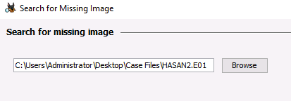

Ingest Modules were already ran for your convenience.

Your task is to perform a manual analysis of the artifacts discovered by Autopsy to answer the questions below.

This room should help to reinforce what you learned in the Autopsy room. Have fun investigating!

#### RDP Machine Details

- IP: `10.114.174.96`
- Username: `administrator`
- Password: `letmein123!`

```bash
┌──(kali㉿kali)-[/mnt/…/TryHackMe/Challenges/Medium/Disk_Analysis_and_Autopsy]
└─$ xfreerdp /v:10.114.174.96 /cert:ignore /u:'administrator' /p:'letmein123!' -dynamic-resolution +clipboard /drive:.,share
[10:21:06:992] [9282:9283] [INFO][com.freerdp.gdi] - Local framebuffer format  PIXEL_FORMAT_BGRX32
[10:21:06:992] [9282:9283] [INFO][com.freerdp.gdi] - Remote framebuffer format PIXEL_FORMAT_BGRA32
[10:21:06:104] [9282:9283] [INFO][com.freerdp.channels.rdpsnd.client] - [static] Loaded fake backend for rdpsnd
[10:21:06:104] [9282:9317] [INFO][com.freerdp.channels.rdpdr.client] - Loading device service drive [share] (static)
[10:21:06:104] [9282:9283] [INFO][com.freerdp.channels.drdynvc.client] - Loading Dynamic Virtual Channel rdpgfx
[10:21:06:104] [9282:9283] [INFO][com.freerdp.channels.drdynvc.client] - Loading Dynamic Virtual Channel disp
[10:21:07:425] [9282:9317] [INFO][com.freerdp.channels.rdpdr.client] - registered device #1: share (type=8 id=1)
<---snip--->
```

---------------------------------------------------------------------------------------

Start Autopsy and Open this case: `C:\Users\Administrator\Desktop\Case Files\Tryhackme.aut`.

In the search dialog for the missing image select this image:


#### What is the MD5 hash of the E01 image?

Select `Data Sources` in the menu to the left. Select `HASAN2.E01` and then the `File Metadata` tab in the lower pane.

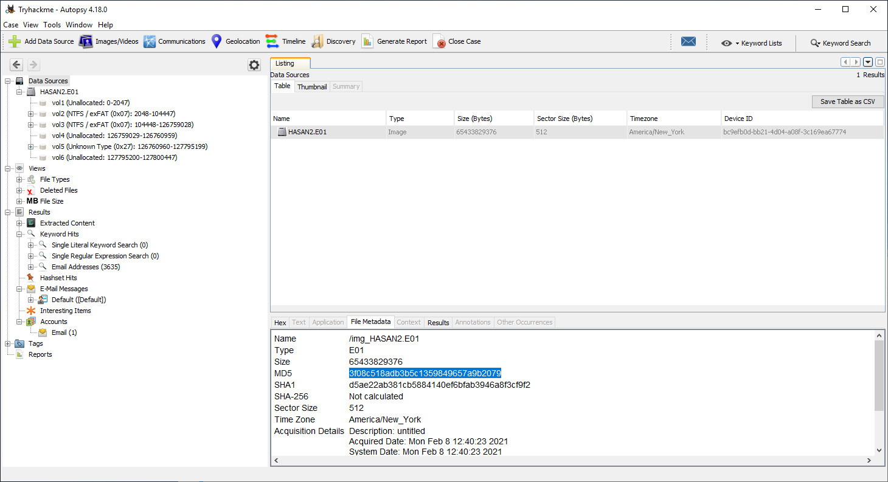

Answer: `3f08c518adb3b5c1359849657a9b2079`

#### What is the computer account name?

In the menu to the left, select `Operating System Information` under `Extracted Content`.

Then select `SYSTEM` and make sure the `Results` tab is selected.

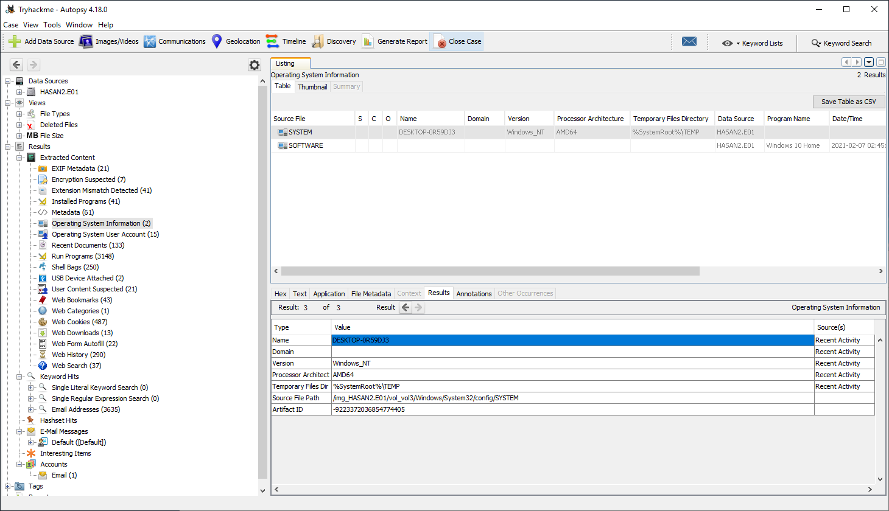

Answer: `DESKTOP-0R59DJ3`

#### List all the user accounts. (alphabetical order)

In the menu to the left, select `Operating System User Account` under `Extracted Content`.

Then click on the `Username` column header to sort the accounts.

By "all" user accounts THM only mean non-standard accounts (selected in the image below).

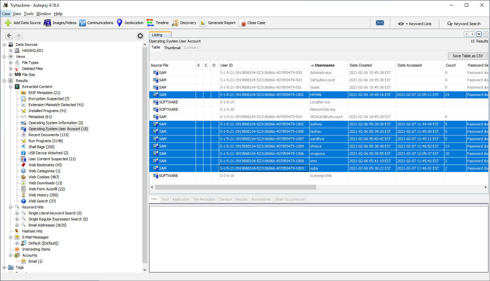

Answer: `H4S4N,joshwa,keshav,sandhya,shreya,sivapriya,srini,suba`

#### Who was the last user to log into the computer?

Click on the `Date Accessed` column header to sort the accounts.

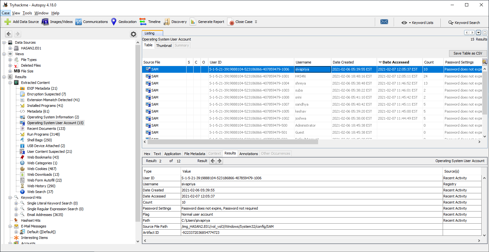

Answer: `sivapriya`

#### What was the IP address of the computer?

My first thought was to check this in the SYSTEM registry Hive under:

`HKEY_LOCAL_MACHINE\SYSTEM\CurrentControlSet\Services\Tcpip\Parameters\Interfaces\{GUID}`

but I was unable to find an IP-address there.

After some Googling and thanks to [this writeup](https://www.exploit-db.com/docs/48254) called "Solving Computer Forensic Case Using Autopsy" I was pointed to the file `C:\Program Files (x86)\Look@LAN\irunin.ini`.

Apparently, Look@LAN is an old network scanning tool.

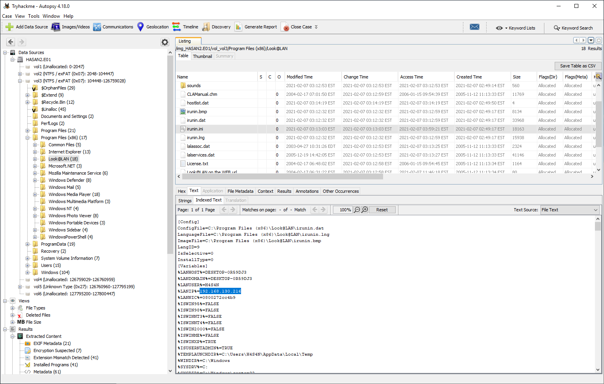

Answer: `192.168.130.216`

#### What was the MAC address of the computer? (XX-XX-XX-XX-XX-XX)

Hint: An installed program can get you this information.

This can be found in the same `irunin.ini` file.


Answer: `08-00-27-2c-c4-b9`

#### What is the name of the network card on this computer?

We can find this information in the SOFTWARE registry hive.

In the menu to the left, select `Operating System Information` under `Extracted Content`.

Then select `SOFTWARE` and make sure the `Application` tab is selected.

Finally, browse to `Microsoft\Windows NT\CurrentVersion\NetworkCards\2` and check the `Description`.

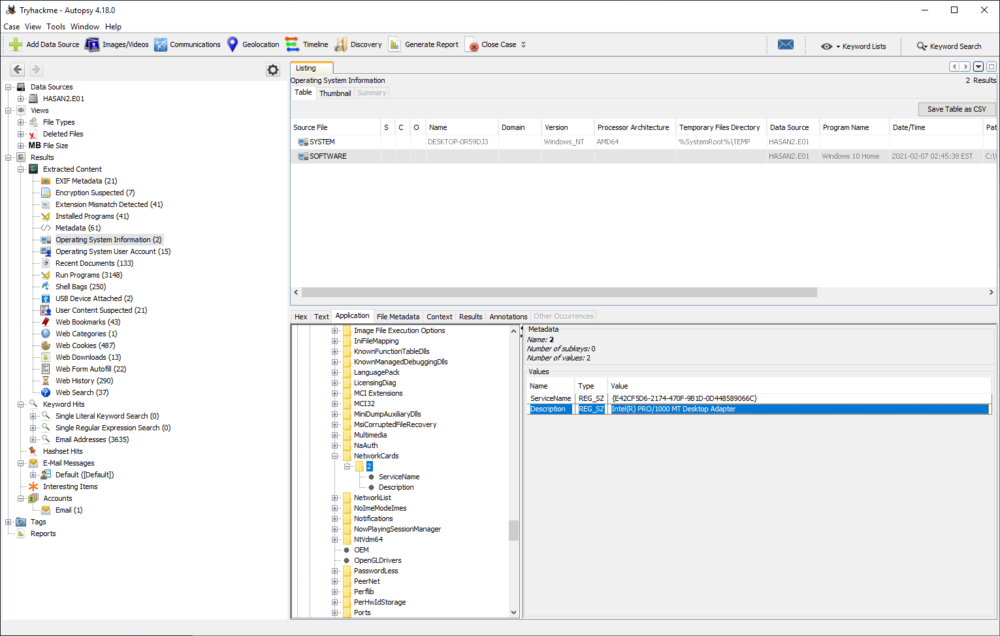

Answer: `Intel(R) PRO/1000 MT Desktop Adapter`

#### What is the name of the network monitoring tool?

We already know this, but all installed and registred programs can be found under `Installed Programs`.

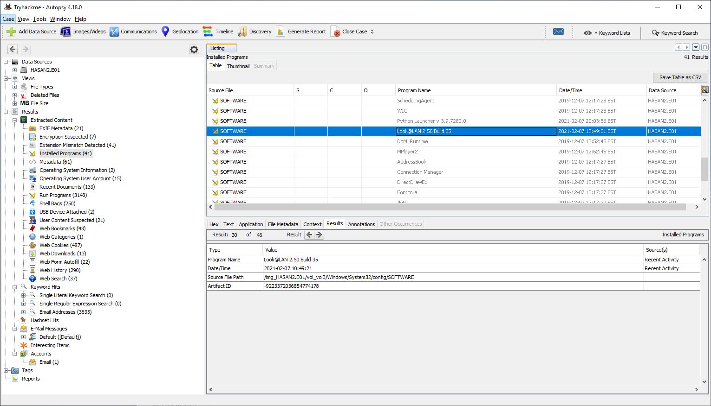

Answer: `Look@LAN`

#### A user bookmarked a Google Maps location. What are the coordinates of the location?

We find this under `Web Bookmarks`.

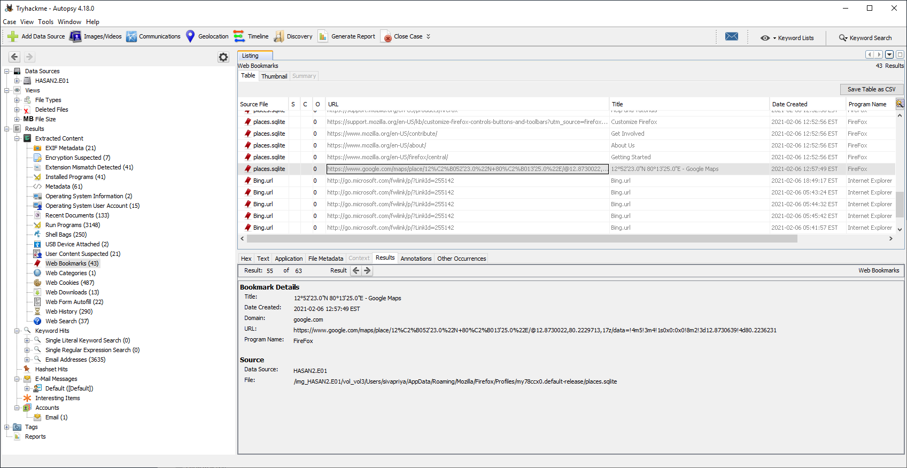

Answer: `12°52'23.0"N 80°13'25.0"E`

#### A user has his full name printed on his desktop wallpaper. What is the user's full name?

User configuration such as the desktop wallpaper is stored in the user's `NTUSER.DAT` registry hive.

Specifically, in `Control Panel\Desktop\WallPaper`.

Then we need to check the images, usually located in the user's `Downloads` folder, until we find a match.

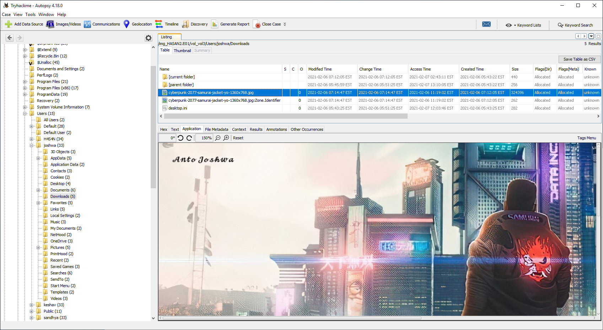

Answer: `Anto Joshwa`

#### A user had a file on her desktop. It had a flag but she changed the flag using PowerShell. What was the first flag?

This sounds like we need to check the PowerShell history file, located at:

`%userprofile%\AppData\Roaming\Microsoft\Windows\PowerShell\PSReadline\ConsoleHost_history.txt`

for each user until we find the flag.

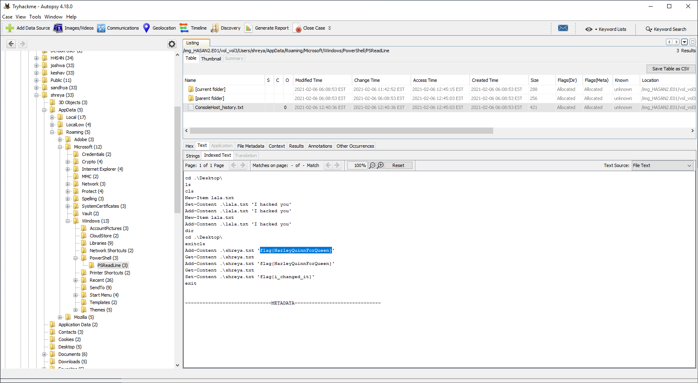

Contents are added chronologically at the end of the file so the first flag is the "upper" one.

Answer: `flag{HarleyQuinnForQueen}`

#### The same user found an exploit to escalate privileges on the computer. What was the message to the device owner?

In the samre PowerShell history file we also saw a `I hacked you` message written to the `lala.txt` file in the `Desktop` folder.

Let's check this folder for its contents.

In the folder we find `exploit.ps1` with the answer.

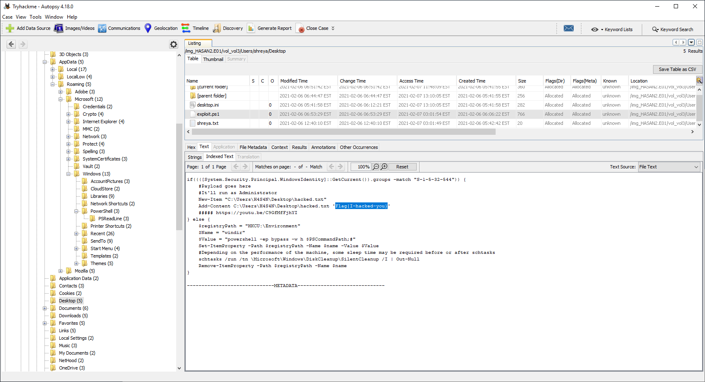

Answer: `Flag{I-hacked-you}`

#### 2 hack tools focused on passwords were found in the system. What are the names of these tools? (alphabetical order)

Hint: Don't include the .exe value for the tool names.

Provided that Windows Defender found the tools we ought to be able to find the answer in its log files.

The scan history files can be found at `C:\Program Data\Microsoft\Windows Defender\Scans\History\Service\DetectionHistory`.

Going through the subfolders we find the following detections (samples only, not a complete list):

|Subfolder|Log File|Detection|Detected File|
|----|----|----|----|
|00|7AF5157B-6B40-4253-8202-73C72BB82C40|HackTool:Win32/Mimikatz.D|C:\Users\H4S4N\Desktop\mimikatz_trunk\x64\mimikatz.exe|
|01|05302174-D5E0-4B21-95C7-3F26B602E1A4|HackTool:Win64/Mikatz!dha|C:\Users\H4S4N\Desktop\mimikatz_trunk\Win32\mimidrv.sys|
|01|2C200A8C-8872-42B5-86AF-69DD2565878E|Trojan:Win32/Pynamer.B!ac|Trojan:Win32/Pynamer.B!ac|
|02|8363AFD9-AF2E-453A-8B2D-766E1C57A8BA|HackTool:Win32/LaZagne|C:\Users\H4S4N\Downloads\lazagne.exe|

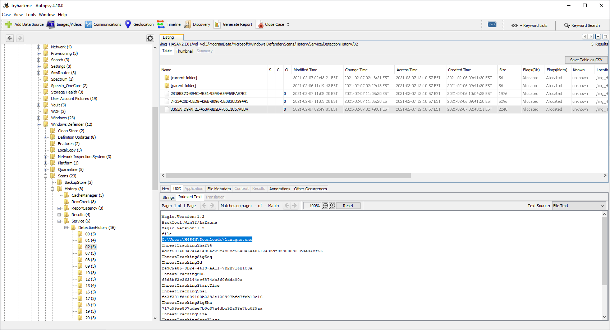

Execution artifacts of both tools can also be found under `Run Programs`.

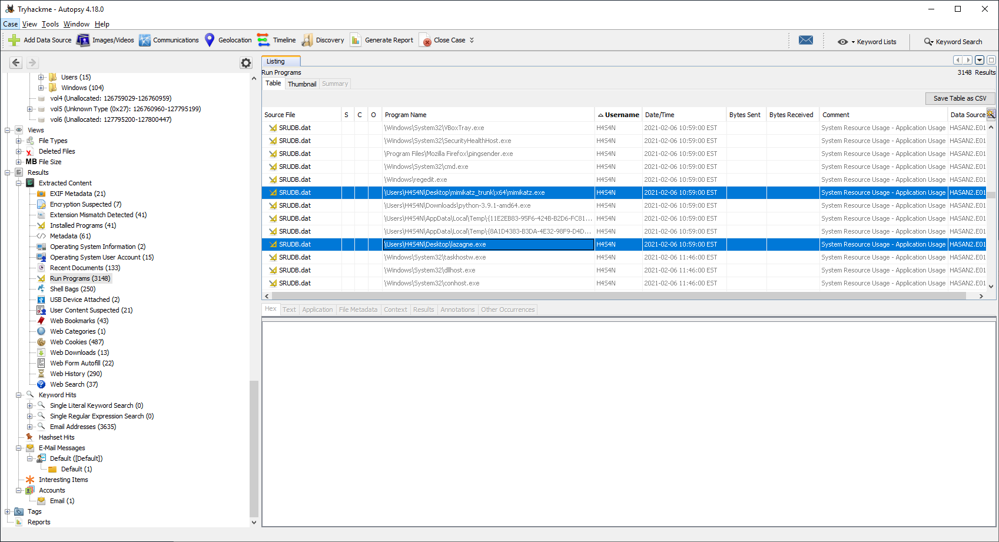

Answer: `LaZagne,Mimikatz`

#### There is a YARA file on the computer. Inspect the file. What is the name of the author?

Yara-files usually have a `.yar`-extension and we can search these files in the `Tools`-menu and `File Search by Attributes`.

Select the `Name` checkbox and enter `.yar` (with **no** wildcard!).

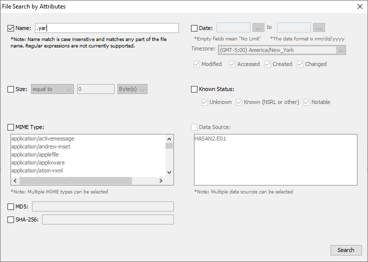

We get three hits: one file and two shortcuts.

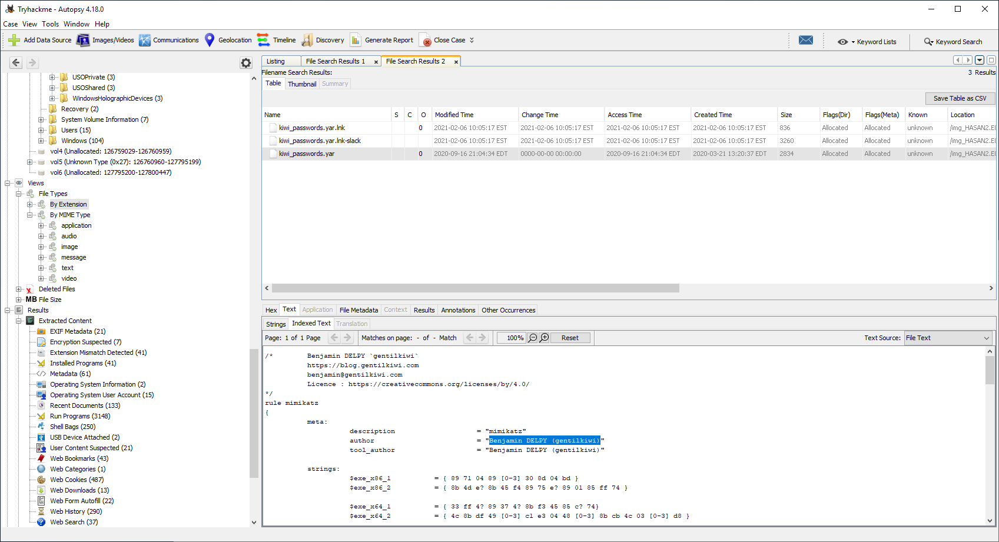

Answer: `Benjamin DELPY (gentilkiwi)`

#### One of the users wanted to exploit a domain controller with an MS-NRPC based exploit. What is the filename of the archive that you found? (include the spaces in your answer)

We find the answer under `Recent Documents` where we find a [Zerologon](https://en.wikipedia.org/wiki/Zerologon) related file.

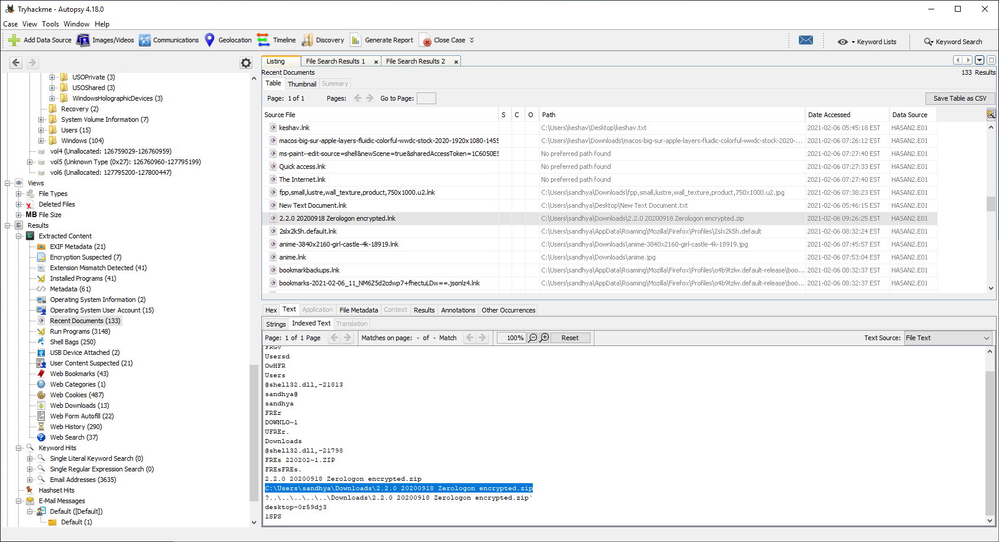

The shortcut points to a Zip-file.

Answer: `2.2.0 20200918 Zerologon encrypted.zip`

---------------------------------------------------------------------------------------

For additional information, please see the references below.

## References

- [Autopsy - Homepage](https://www.autopsy.com/)
- [Computer forensics - Wikipedia](https://en.wikipedia.org/wiki/Computer_forensics)
- [Disk image - Wikipedia](https://en.wikipedia.org/wiki/Disk_image)
- [LaZagne - GitHub](https://github.com/AlessandroZ/LaZagne)
- [Metadata - Wikipedia](https://en.wikipedia.org/wiki/Metadata)
- [Microsoft Defender Antivirus - Wikipedia](https://en.wikipedia.org/wiki/Microsoft_Defender_Antivirus)
- [Mimikatz - GitHub](https://github.com/gentilkiwi/mimikatz)
- [PowerShell - Wikipedia](https://en.wikipedia.org/wiki/PowerShell)
- [Remote Desktop Protocol - Wikipedia](https://en.wikipedia.org/wiki/Remote_Desktop_Protocol)
- [Shortcut (computing) - Wikipedia](https://en.wikipedia.org/wiki/Shortcut_(computing))
- [Solving Computer Forensic Case Using Autopsy](https://www.exploit-db.com/docs/48254)
- [Windows Registry - Wikipedia](https://en.wikipedia.org/wiki/Windows_Registry)
- [xfreerdp - Linux manual page](https://linux.die.net/man/1/xfreerdp)
- [Yara - GitHub](https://github.com/virustotal/yara)
- [Yara - Homepage](https://virustotal.github.io/yara/)
- [Zerologon - Wikipedia](https://en.wikipedia.org/wiki/Zerologon)
