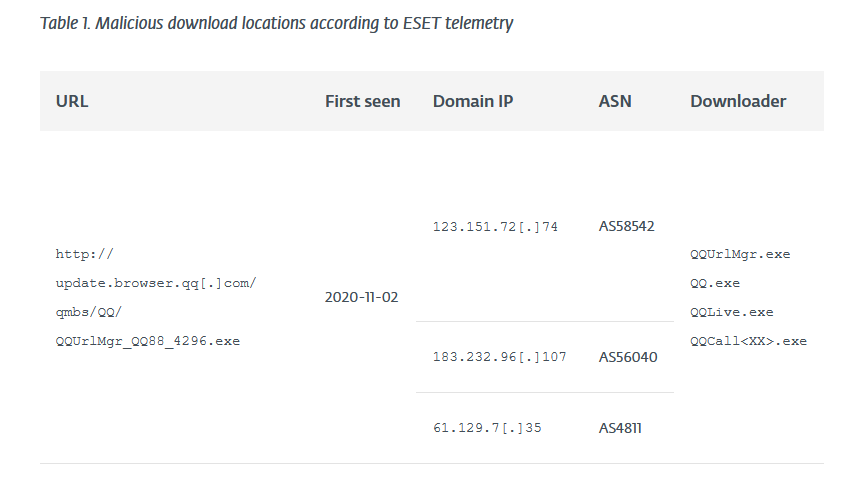

# Friday Overtime

- [Room information](#room-information)
- [Solution](#solution)
- [References](#references)

## Room information

```text
Type: Challenge
Difficulty: Medium
OS: N/A
Subscription type: Premium
Description: Step into the shoes of a Cyber Threat Intelligence Analyst and put your investigation 
skills to the test.
```

Room link: [https://tryhackme.com/room/fridayovertime](https://tryhackme.com/room/fridayovertime)

## Solution

### Disclaimer

Please note: The artefacts used in this scenario were retrieved from a real-world cyber-attack. Hence, it is advised that interaction with the artefacts be done only inside the attached VM, as it is an isolated environment.

#### Hello Busy Weekend

It's a Friday evening at PandaProbe Intelligence when a notification appears on your CTI platform. While most are already looking forward to the weekend, you realise you must pull overtime because SwiftSpend Finance has opened a new ticket, raising concerns about potential malware threats. The finance company, known for its meticulous security measures, stumbled upon something suspicious and wanted immediate expert analysis.

As the only remaining CTI Analyst on shift at PandaProbe Intelligence, you quickly took charge of the situation, realising the gravity of a potential breach at a financial institution. The ticket contained multiple file attachments, presumed to be malware samples.

With a deep breath, a focused mind, and the longing desire to go home, you began the process of:

1. Downloading the malware samples provided in the ticket, ensuring they were contained in a secure environment.
2. Running the samples through preliminary automated malware analysis tools to get a quick overview.
3. Deep diving into a manual analysis, understanding the malware's behaviour, and identifying its communication patterns.
4. Correlating findings with global threat intelligence databases to identify known signatures or behaviours.
5. Compiling a comprehensive report with mitigation and recovery steps, ensuring SwiftSpend Finance could swiftly address potential threats.

### Connecting to the machine

Start the virtual machine in split-screen view by clicking the green **Start Machine** button on the upper right section of this task. If the VM is not visible, use the blue **Show Split View** button at the top-right of the page. Additionally, you can open the DocIntel platform using the credentials below.

- Username: ericatracy
- Password: Intel321!
- IP: 10.10.201.141

**Note**: While the web browser (i.e., Chromium) will immediately start after boot up, it may show a tab that has a "502 Bad Gateway" error message displayed. This is because the DocIntel platform takes about 5 more minutes to finish starting up **after** the VM has completely booted up. After 5 minutes, you can **refresh** the page in order to view the login page. We appreciate your patience. The ticket details can be found by logging in to the DocIntel platform. **OSINT, a web browser, and a text editor outside the VM will also help**.

### Answer the questions below

#### Who shared the malware samples?

Login to the DocIntel platfrom with `ericatracy:Intel321!`.

Check the `Urgent: Malicious Malware Artefacts Detected` message:

```text
Urgent: Malicious Malware Artefacts Detected
by SwiftSpend Finance - Registered 2023-12-07T23:10:51.5503900

Dear PandaProbe Intel team,

I hope this message finds you well. My name is Oliver Bennett from the Cybersecurity Division at SwiftSpend Finance. During our recent security sweep, we have identified a set of malicious files which, based on our preliminary analysis, seem to be associated with .

Details

Date Detected: Friday, December 8, 2023
Infected Systems: Over 9000 systems
Nature of Malware: Unknown / Suspected RAT

We believe the intent of this malware is to gain a foothold to ultimately exfiltrate sensitive financial data and possibly deploy ransomware.

Immediate Actions Taken

- Isolated the infected systems from the network.
- Initiated a comprehensive scan across all systems.
- Collected and stored malware samples securely for further analysis.
- We are currently collaborating with external cybersecurity agencies and our security solutions providers to get a deeper understanding of this malware. However, we wanted to raise this with you immediately given the potential risk associated with APTs.

We strongly need your team's assistance with conducting a thorough review of the malware sample. The password to the attached archive is: Panda321!

Moving forward, we are going to conduct a User Awareness Training to inform all staff members to be extra cautious, especially when dealing with email attachments and links.

Attached are the indicators of compromise (IoCs) for your perusal. I am also available for a call or meeting to discuss our findings in detail and strategise our response.

Your prompt attention to this matter is highly appreciated. Let's work together to ensure the safety and integrity of our systems and data.

Warm regards,

Oliver Bennett
Cybersecurity Division
SwiftSpend Finance
Phone: +123 456 7890
Email: oliver.bennett@swiftspend.finance
```

The message is sent from Oliver Bennett at SwiftSpend Finance.

Answer: Oliver Bennett

#### What is the SHA1 hash of the file "pRsm.dll" inside samples.zip?

Click on the message and then on the `samples.zip` attachment to download it.

Open a terminal and unzip the file. The password can be found in the message (`Panda321!`)

```bash
[ericatracy@ip-10-10-201-141 ~]$ ls
Desktop  Downloads
[ericatracy@ip-10-10-201-141 ~]$ cd Downloads/
[ericatracy@ip-10-10-201-141 Downloads]$ ls
samples.zip
[ericatracy@ip-10-10-201-141 Downloads]$ unzip samples.zip 
Archive:  samples.zip
[samples.zip] cbmrpa.dll password: 
  inflating: cbmrpa.dll              
  inflating: maillfpassword.dll      
  inflating: pRsm.dll                
  inflating: qmsdp.dll               
  inflating: wcdbcrk.dll             
[ericatracy@ip-10-10-201-141 Downloads]$ 
```

Calculate the SHA-1 hash of the `pRsm.dll` file

```bash
[ericatracy@ip-10-10-201-141 Downloads]$ sha1sum pRsm.dll 
9d1ecbbe8637fed0d89fca1af35ea821277ad2e8  pRsm.dll
[ericatracy@ip-10-10-201-141 Downloads]$ 
```

Answer: 9d1ecbbe8637fed0d89fca1af35ea821277ad2e8

#### Which malware framework utilizes these DLLs as add-on modules?

Hint: Search for an article or report related to the artefacts.

Google for the dll file names and check articles such as: [https://www.welivesecurity.com/2023/04/26/evasive-panda-apt-group-malware-updates-popular-chinese-software/](https://www.welivesecurity.com/2023/04/26/evasive-panda-apt-group-malware-updates-popular-chinese-software/)

```text
<---snip--->
The group implements its own custom malware framework with a modular architecture that allows its backdoor, known as MgBot, to receive modules to spy on its victims and enhance its capabilities.

Campaign overview

In January 2022, we discovered that while performing updates, a legitimate Chinese application had received an installer for the Evasive Panda MgBot backdoor. During our investigation, we discovered that the malicious activity went back to 2020.
<---snip--->
```

Answer: MgBot

#### Which MITRE ATT&CK Technique is linked to using pRsm.dll in this malware framework?

From the article above

```text
pRsm.dll      Captures input and output audio streams.
```

The corresponding ATT&CK technique ought to be [T1123 (Audio Capture)](https://attack.mitre.org/techniques/T1123/)

Answer: T1123

#### What is the CyberChef defanged URL of the malicious download location first seen on 2020-11-02?

In the middle of the article above we find the IOCs



Then we use the [Defang URL recipe at CyberChef](https://gchq.github.io/CyberChef/#recipe=Defang_URL(true,true,true,'Valid%20domains%20and%20full%20URLs')) to fully defang the URL.

Answer: hxxp[://]update[.]browser[.]qq[.]com/qmbs/QQ/QQUrlMgr_QQ88_4296.exe

#### What is the CyberChef defanged IP address of the C&C server first detected on 2020-09-14 using these modules?

The C&C server can be found further down in the same article just before the Mitre ATT&CK mappings.

Answer: 122[.]10[.]90[.]12

#### What is the SHA1 hash of the spyagent family spyware hosted on the same IP targeting Android devices on November 16, 2022?

Hint: Tools like VirusTotal or app.any.run can help with this.

1. Search for the IP on VirusTotal (`https://www.virustotal.com/gui/ip-address/122.10.90.12`).
2. Check the Communicating Files on the Relations tab
3. Click the hash-like filename for the Android file
4. Check the SHA-1 hash on the Details tab for the APK-file (`https://www.virustotal.com/gui/file/bbef5975a0483220cfec379c44a487ed4146e0af9205f00dbc0eb53de8a63533/details`)

Answer:  1c1fe906e822012f6235fcc53f601d006d15d7be

For additional information, please see the references below.

## References

- [ATT&CK - Mitre](https://attack.mitre.org/)
- [Evasive Panda APT group delivers malware via updates for popular Chinese software](https://www.welivesecurity.com/2023/04/26/evasive-panda-apt-group-malware-updates-popular-chinese-software/)
