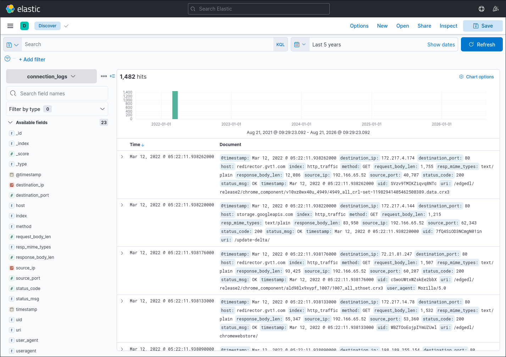
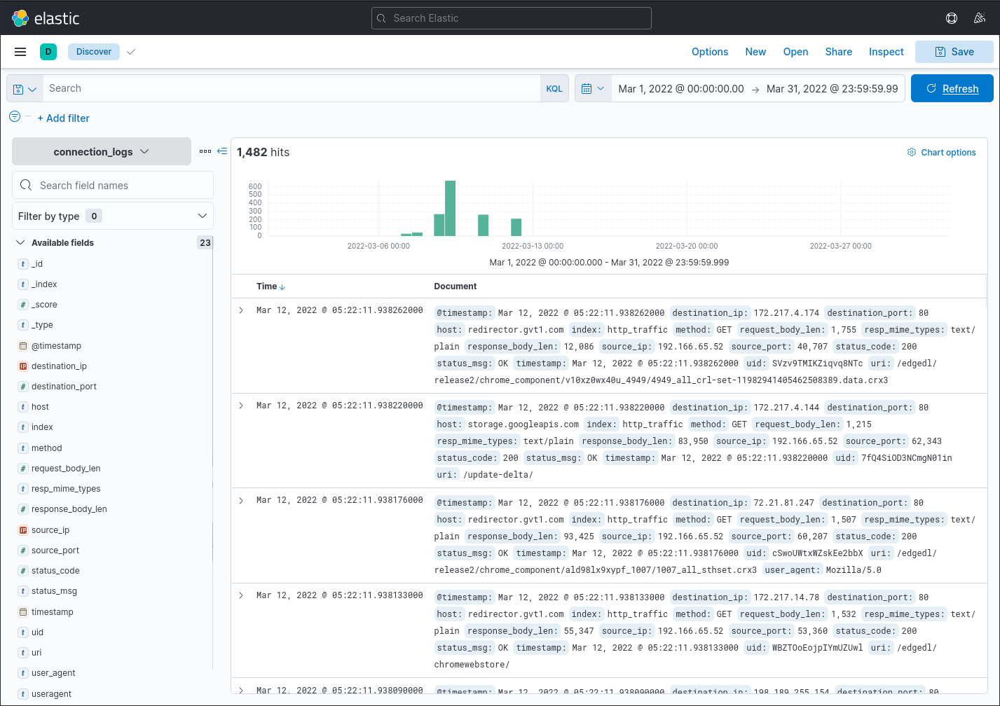
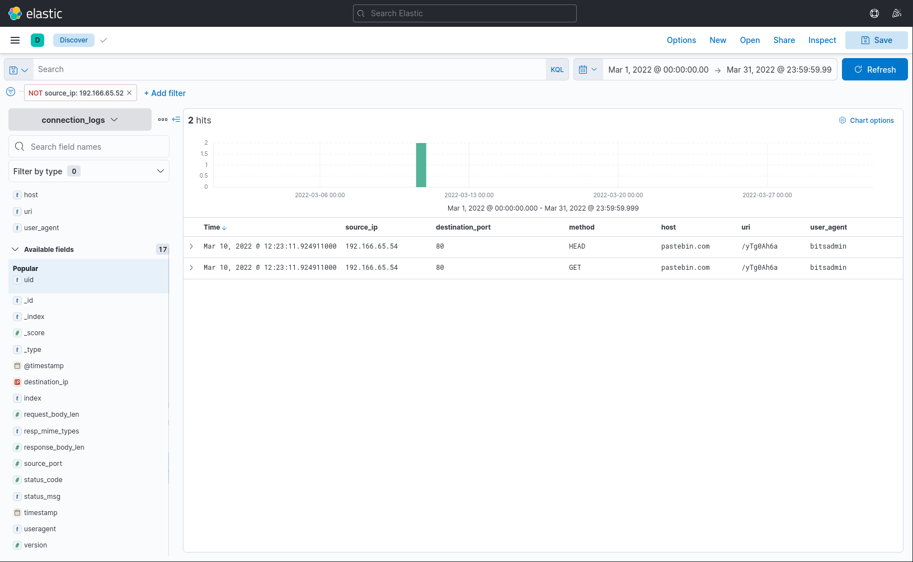
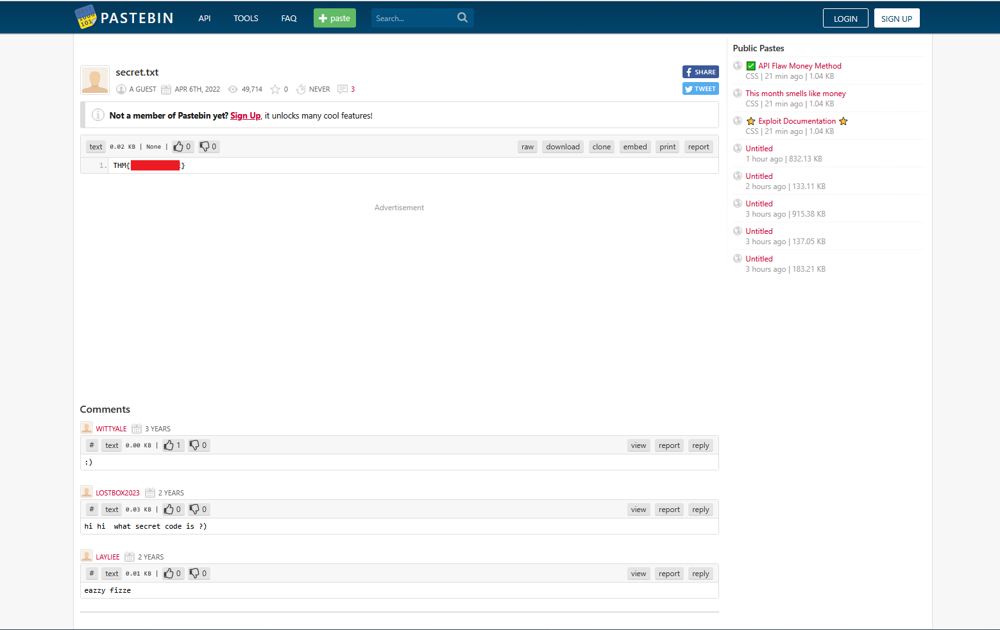

# ItsyBitsy

- [Room information](#room-information)
- [Solution](#solution)
- [References](#references)

## Room information

```text
Type: Challenge
Difficulty: Medium
Tags: Windows
Meta Tags: Walkthrough, Walk-through, Write-up, Writeup
Subscription type: Premium
Description:
Put your ELK knowledge together and investigate an incident.
```

Room link: [https://tryhackme.com/room/itsybitsy](https://tryhackme.com/room/itsybitsy)

## Solution

### Task 1: Introduction

#### Set up your virtual environment

To successfully complete this room, you'll need to set up your virtual environment. This involves starting both your AttackBox (if you're not using your VPN) and Lab Machines, ensuring you're equipped with the necessary tools and access to tackle the challenges ahead.

In this challenge room, we will take a simple challenge to investigate an alert by IDS regarding a potential C2 communication.

#### Room Machine

Before moving forward, deploy the machine. When you deploy the machine, it will be assigned an IP Machine IP: `10.114.184.52.` The machine will take up to 3-5 minutes to start. Use the following credentials to log in and access the logs in the Discover tab.

- **Username**: `Admin`
- **Password**: `elastic123`

---------------------------------------------------------------------------------------

### Task 2: Scenario - Investigate a potential C2 communication alert

During normal SOC monitoring, Analyst John observed an alert on an IDS solution indicating a potential C2 communication from a user **Browne** from the HR department. A suspicious file was accessed containing a malicious pattern `THM:{ ________ }`. A week-long HTTP connection logs have been pulled to investigate. Due to limited resources, only the connection logs could be pulled out and are ingested into the `connection_logs` index in Kibana.

Our task in this room will be to examine the network connection logs of this user, find the link and the content of the file, and answer the questions.

Browse to `http://10.114.184.52/`, select `Discover` in the menu to the left and make sure the time filter is set to `Last 5 years`.



---------------------------------------------------------------------------------------

#### How many events were returned for the month of March 2022?

Update the time filter to March 2022 and check the number of hits.



Answer: `1482`

#### What is the IP associated with the suspected user in the logs?

Add columns to the events. The majority of the events are from `192.166.65.52`.

After filtering this IP, only 2 events from one IP (`192.166.65.54`) remains.



Answer: `192.166.65.54`

#### The user’s machine used a legit windows binary to download a file from the C2 server. What is the name of the binary?

See image above.

Answer: `bitsadmin`

#### The infected machine connected with a famous filesharing site in this period, which also acts as a C2 server used by the malware authors to communicate. What is the name of the filesharing site?

See image above.

Answer: `pastebin.com`

#### What is the full URL of the C2 to which the infected host is connected?

See image above.

Answer: `pastebin.com/yTg0Ah6a`

#### A file was accessed on the filesharing site. What is the name of the file accessed?

Browse to `https://pastebin.com/yTg0Ah6a` and check the web page.



Answer: `secret.txt`

#### The file contains a secret code with the format THM{_____}

See image above.

Answer:  `THM{<REDACTED>}`

---------------------------------------------------------------------------------------

For additional information, please see the references below.

## References

- [bitsadmin - Microsoft Learn](https://learn.microsoft.com/en-us/windows-server/administration/windows-commands/bitsadmin)
- [Command and Control (TA0011) - Mitre ATT&CK](https://attack.mitre.org/tactics/TA0011/)
- [Elasticsearch - Wikipedia](https://en.wikipedia.org/wiki/Elasticsearch)
- [Kibana - Wikipedia](https://en.wikipedia.org/wiki/Kibana)
- [Log analysis - Wikipedia](https://en.wikipedia.org/wiki/Log_analysis)
- [Logging (computing) - Wikipedia](https://en.wikipedia.org/wiki/Logging_(computing))
