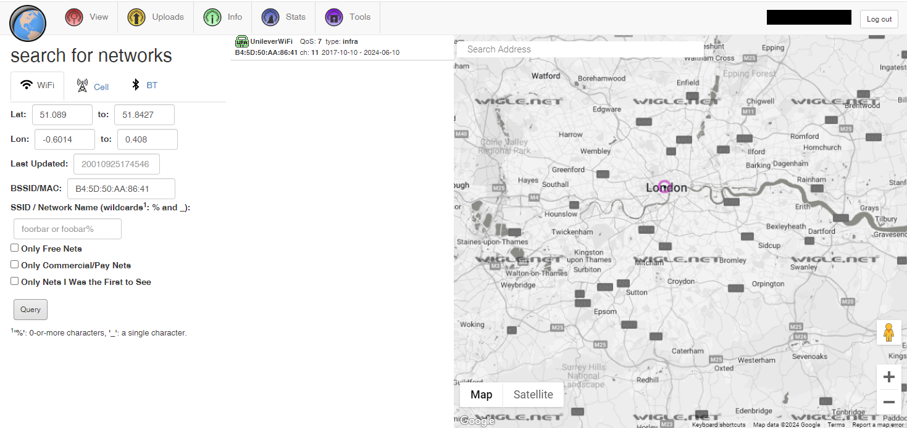

# OhSINT

- [Room information](#room-information)
- [Solution](#solution)
- [References](#references)

## Room information
```
Difficulty: Easy
OS: N/A
Subscription type: Free
Description: Are you able to use open source intelligence to solve this challenge?
```
Room link: [https://tryhackme.com/r/room/ohsint](https://tryhackme.com/r/room/ohsint)

## Solution

### What is this user's avatar of?

We begin by checking for metadata with `exiftool`
```bash
┌──(kali㉿kali)-[/mnt/…/TryHackMe/CTFs/Easy/OhSINT]
└─$ exiftool WindowsXP.jpg   
ExifTool Version Number         : 12.52
File Name                       : WindowsXP.jpg
Directory                       : .
File Size                       : 234 kB
File Modification Date/Time     : 2020:09:13 08:40:48+02:00
File Access Date/Time           : 2024:09:16 13:56:23+02:00
File Inode Change Date/Time     : 2020:09:13 08:40:48+02:00
File Permissions                : -rwxrwxrwx
File Type                       : JPEG
File Type Extension             : jpg
MIME Type                       : image/jpeg
XMP Toolkit                     : Image::ExifTool 11.27
GPS Latitude                    : 54 deg 17' 41.27" N
GPS Longitude                   : 2 deg 15' 1.33" W
Copyright                       : OWoodflint
Image Width                     : 1920
Image Height                    : 1080
Encoding Process                : Baseline DCT, Huffman coding
Bits Per Sample                 : 8
Color Components                : 3
Y Cb Cr Sub Sampling            : YCbCr4:2:0 (2 2)
Image Size                      : 1920x1080
Megapixels                      : 2.1
GPS Latitude Ref                : North
GPS Longitude Ref               : West
GPS Position                    : 54 deg 17' 41.27" N, 2 deg 15' 1.33" W
```
From the `Copyright` line the user seem to be `OWoodflint`.

Googling for this username turns up the following possible social media presence:
- Blog: https://oliverwoodflint.wordpress.com/
- Github: https://github.com/OWoodfl1nt
- X (Twitter): https://x.com/OWoodflint

The X/Twitter-account has a profile photo of a cat.

### What city is this person in?

The first tweet contains a BSSID that we could locate
```
From my house I can get free wifi ;D

Bssid: B4:5D:50:AA:86:41 - Go nuts!
```
with [Wigle.net](https://www.wigle.net/).

Login and select `Basic Search` in the View menu. Then search for the BSSID `B4:5D:50:AA:86:41`.



You may need to zoom out, recenter and zoom in to see more clearly since the map doesn't seem to center around the found area.

### What is the SSID of the WAP he connected to?

You find the answer in the middle entry of the `Wigle.net` results.

### What is his personal email address?

The email address can be found on the [people_finder repo on Github](https://github.com/OWoodfl1nt/people_finder).

### What site did you find his email address on?

See above.

### Where has he gone on holiday?

The answer can be found on [this blog post](https://oliverwoodflint.wordpress.com/2019/03/03/the-journey-begins/).

### What is this persons password?

The answer is in white text on the blog post above.

One easy way to see it is to select all text with `CTRL + A`.


For additional information, please see the references below.

## References

- [exiftool - Linux manual page](https://linux.die.net/man/1/exiftool)
- [ExifTool - Wikipedia](https://en.wikipedia.org/wiki/ExifTool)
- [Metadata - Wikipedia](https://en.wikipedia.org/wiki/Metadata)
- [Wigle.net - Homepage](https://www.wigle.net/)
