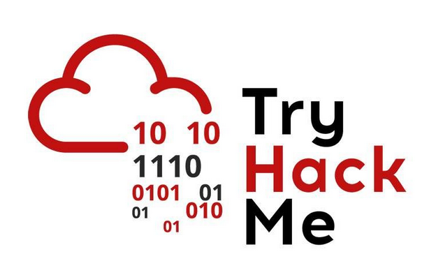

# Writeups for TryHackMe challenges

Welcome to my writeups for [TryHackMe](https://tryhackme.com/) challenges. These writeups are mainly a documentation for myself but I hope others will benefit from them as well.  

In total you will find more than XX challenge solutions here.

## Challenges

- [Easy Challenges](Easy/README.md)

## No spoilers

The solutions contain step-by-step walkthroughs but doesn't display the flags in plain text.  
Instead, the flags are displayd as `e<REDACTED>g` with only the first and last characters visible for verification purposes.

## Support my work

If you appreciate this repository and learn from it, please consider [giving it a star](https://docs.github.com/en/get-started/exploring-projects-on-github/saving-repositories-with-stars#starring-a-repository) to support me and spread the word.

## Language disclaimer

I'm not a native English speaker so please forgive any spelling mistakes or grammatical errors.
 
 ## Acknowledgements

 Some of the solutions were inspired by writeups and walkthroughs from these guys:
 - [Almond Force](https://www.youtube.com/@AlmondForce)
