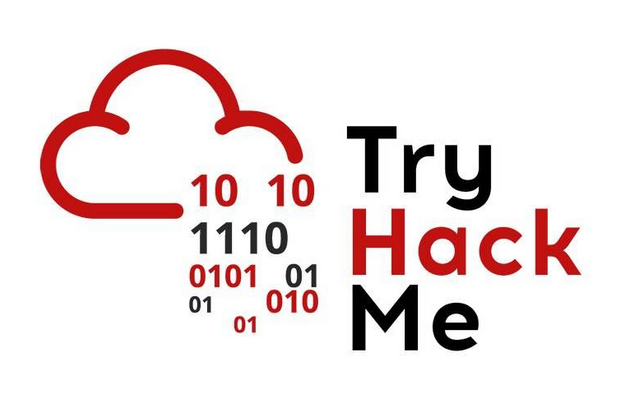

# Writeups for TryHackMe

Welcome to [my](https://tryhackme.com/p/Cajac) writeups for [TryHackMe](https://tryhackme.com/) [challenges](https://tryhackme.com/challenges), [networks](https://tryhackme.com/hacktivities?tab=network) and [walkthroughs](https://tryhackme.com/hacktivities?tab=rooms).

In addition, many [modules](https://tryhackme.com/hacktivities?tab=modules) and a few [learning paths](https://tryhackme.com/hacktivities?tab=paths) are included.

These writeups are mainly a documentation for myself but I hope others will benefit from them as well.  

In total you will find more than **250 room solutions** here.

This repository is part of my evolving efforts to [build](https://www.buildingasecondbrain.com/) my [second](https://fortelabs.com/blog/basboverview/) [brain](https://fortelabs.com/blog/the-7-benefits-of-building-a-second-brain/).

## Challenges (CTF)

- [Medium Challenges](Challenges/Medium/README.md)
  - [Active Directory](Challenges/Medium/README.md#active-directory)
  - [Digital Forensics and Incident Response](Challenges/Medium/README.md#digital-forensics-and-incident-response)
  - [Exploitation](Challenges/Medium/README.md#exploitation)
  - [Full Pwn](Challenges/Medium/README.md#full-pwn)
  - [Miscellaneous](Challenges/Medium/README.md#miscellaneous)

- [Easy Challenges](Challenges/Easy/README.md)
  - [Cryptography](Challenges/Easy/README.md#cryptography)
  - [Digital Forensics and Incident Response](Challenges/Easy/README.md#digital-forensics-and-incident-response)
  - [Full Pwn](Challenges/Easy/README.md#full-pwn)
  - [Jeopardy Style CTFs](Challenges/Easy/README.md#jeopardy-style-ctfs)
  - [Miscellaneous](Challenges/Easy/README.md#miscellaneous)

- [Info Challenges](Challenges/Info/README.md)
  - [Exploitation](Challenges/Info/README.md#exploitation)

## Learning Paths

- [Medium Learning Paths](Learning_Paths/Medium/README.md)
  - [Jr Penetration Tester](Learning_Paths/Medium/Jr_Penetration_Tester.md)

- [Easy Learning Paths](Learning_Paths/Easy/README.md)
  - [Cyber Security 101](Learning_Paths/Easy/Cyber_Security_101.md)
  - [Pre Security](Learning_Paths/Easy/Pre_Security.md)
  - [SOC Level 1 (Legacy)](Learning_Paths/Easy/SOC_Level_1_Legacy.md)
  - [Web Fundamentals](Learning_Paths/Easy/Web_Fundamentals.md)

## Modules

- [Medium Modules](Modules/Medium/README.md)
  - [Digital Forensics and Incident Response](Modules/Medium/README.md#digital-forensics-and-incident-response)
  - [Exploitation](Modules/Medium/README.md#exploitation)
  - [Networking](Modules/Medium/README.md#networking)

- [Easy Modules](Modules/Easy/README.md)
  - [Active Directory](Modules/Easy/README.md#active-directory)
  - [Cryptography](Modules/Easy/README.md#cryptography)
  - [Defensive Security](Modules/Easy/README.md#defensive-security)
  - [Exploitation](Modules/Easy/README.md#exploitation)
  - [Fundamentals](Modules/Easy/README.md#fundamentals)
  - [Networking](Modules/Easy/README.md#networking)
  - [Offensive Security](Modules/Easy/README.md#offensive-security)
  - [Penetration Testing](Modules/Easy/README.md#penetration-testing)
  - [Scripting and Programming](Modules/Easy/README.md#scripting-and-programming)
  - [Web](Modules/Easy/README.md#web)

- [Info Modules](Modules/Info/README.md)
  - [Fundamentals](Modules/Info/README.md#fundamentals)
  - [Windows](Modules/Info/README.md#windows)

## Networks

- [Medium Networks](Networks/Medium/README.md)
  - [Active Directory](Networks/Medium/README.md#active-directory)

- [Easy Networks](Networks/Easy/README.md)
  - [Active Directory](Networks/Easy/README.md#active-directory)
  - [Lateral Movement](Networks/Easy/README.md#lateral-movement)

## Walkthroughs

- [Medium Walkthroughs](Walkthroughs/Medium/README.md)
  - [Cyber Threat Intelligence](Walkthroughs/Medium/README.md#cyber-threat-intelligence)
  - [Defensive Security](Walkthroughs/Medium/README.md#defensive-security)
  - [Exploitation](Walkthroughs/Medium/README.md#exploitation)
  - [Networking](Walkthroughs/Medium/README.md#networking)
  - [Scripting and Programming](Walkthroughs/Medium/README.md#scripting-and-programming)
  - [Web](Walkthroughs/Medium/README.md#web)
  - [Windows](Walkthroughs/Medium/README.md#windows)

- [Easy Walkthroughs](Walkthroughs/Easy/README.md)
  - [Active Directory](Walkthroughs/Easy/README.md#active-directory)
  - [Containerization and Virtualization](Walkthroughs/Easy/README.md#containerization-and-virtualization)
  - [Cryptography](Walkthroughs/Easy/README.md#cryptography)
  - [Cyber Threat Intelligence](Walkthroughs/Easy/README.md#cyber-threat-intelligence)
  - [Defensive Security](Walkthroughs/Easy/README.md#defensive-security)
  - [Digital Forensics and Incident Response](Walkthroughs/Easy/README.md#digital-forensics-and-incident-response)
  - [Enumeration](Walkthroughs/Easy/README.md#enumeration)
  - [Exploitation](Walkthroughs/Easy/README.md#exploitation)
  - [Fundamentals](Walkthroughs/Easy/README.md#fundamentals)
  - [Malware Analysis](Walkthroughs/Easy/README.md#malware-analysis)
  - [Networking](Walkthroughs/Easy/README.md#networking)
  - [Offensive Security](Walkthroughs/Easy/README.md#offensive-security)
  - [Scripting and Programming](Walkthroughs/Easy/README.md#scripting-and-programming)
  - [Web](Walkthroughs/Easy/README.md#web)
  - [Windows](Walkthroughs/Easy/README.md#windows)

- [Info Walkthroughs](Walkthroughs/Info/README.md)
  - [Exploitation](Walkthroughs/Info/README.md#exploitation)
  - [Linux](Walkthroughs/Info/README.md#linux)
  - [Miscellaneous](Walkthroughs/Info/README.md#miscellaneous)
  - [Networking](Walkthroughs/Info/README.md#networking)
  - [Web](Walkthroughs/Info/README.md#web)
  - [Windows](Walkthroughs/Info/README.md#windows)

## When to use

These solutions can be used in two different scenarios:

**Scenario #1**:  
When you are stuck, have already tried different solutions on your own, and don't know how to continue.  
Don't look at them to soon though. It's always good to develop your ["Try harder"-mindset](https://www.offsec.com/blog/what-it-means-to-try-harder/)!

**Scenario #2**:  
When you have already solved the challenge on your own but want to see if you can learn different methods, tools or approaches.
Are there different and perhaps smarter ways to solve this challenge?

## No flag spoilers

The solutions contain step-by-step guides but doesn't display the flags for the challenges in plain text.  
Instead, the flags are displayd as `THM{<REDACTED>}` or something similar.

Answers for walktroughs are usually provided unless they are flag-like.

## Support my work

If you appreciate this repository and learn from it, please consider [giving it a star](https://docs.github.com/en/get-started/exploring-projects-on-github/saving-repositories-with-stars#starring-a-repository) to support me and spread the word.

## Language disclaimer

I'm not a native English speaker so please forgive any spelling mistakes or grammatical errors.

## Acknowledgements

Some of the solutions were inspired by writeups and walkthroughs from these guys:

- [Djalil Ayed](https://www.youtube.com/@djalilayed)
- [igor_sec](https://medium.com/@huglertomgaw)
- [jcm3](https://medium.com/@jcm3)
- [Motasem Hamdan](https://www.youtube.com/@MotasemHamdan)
- RosanaFSS ([Medium](https://medium.com/@RosanaFS) and [GitHub](https://github.com/RosanaFSS/TryHackMe_Cybersecurity_Journey))
- [Z3pH7](https://medium.com/@Z3pH7)
