# Advanced ELK Queries

- [Room information](#room-information)
- [Solution](#solution)
- [References](#references)

## Room information

```text
Type: Walkthrough
Difficulty: Easy
Tags: -
Subscription type: Premium
Description: 
Search large datasets efficiently with advanced queries in Kibana.
```

Room link: [https://tryhackme.com/room/advancedelkqueries](https://tryhackme.com/room/advancedelkqueries)

## Solution

### Task 1: Introduction

In a Security Operations Center (SOC), analysts are constantly overloaded with data from various sources, such as network traffic logs, intrusion detection systems, vulnerability scanners, and endpoint security software. Effectively sifting through this massive amount of information can overwhelm any analyst. Mastering advanced queries can significantly streamline this process, enabling analysts to extract critical insights and make well-informed decisions.

In this room, we will delve into advanced queries for Kibana, an integral component of the Elastic Stack (ELK) that provides visualization and analytics capabilities for data stored in Elasticsearch.

#### Learning objectives

- Learn about different advanced queries
- Learning about different query syntaxes (Kibana Query Language and Lucene)

#### Room Prerequisites

- This room assumes that you know the basics of navigating the Kibana dashboard and are familiar with the Kibana Query Language, as we will be heading straight to talking about advanced queries. If you aren't, then [this room](https://tryhackme.com/room/investigatingwithelk101) will be a good primer on this topic.
- Regular expressions, specifically in Kibana, will be discussed in Task 7. The basic syntax and how regex works will not be addressed, so familiarity and experience using [regular expressions](https://tryhackme.com/room/catregex) on any engine or programming language will significantly help.

#### Setting up and connecting to Kibana

Start the virtual machine by clicking on the green "**Start Machine**" button on the upper right section of this task. Let the VM load for around 5 minutes, as it will run in the background. To access the Kibana dashboard, you can do it in two ways:

1. Connect via OpenVPN ([More info here](https://tryhackme.com/access)) and then type the machine's IP `https://10-64-187-199.reverse-proxy.cell-prod-us-east-1a.vm.tryhackme.com/` on your browser's address bar.

2. Log in to AttackBox VM, open the web browser inside AttackBox, and then type the machine's IP `http://10.64.187.199` on the address bar.

You'll be presented with the Kibana log in screen. Login with:

- Username: `elastic`
- Password: `elastic`

When done correctly, you should see the page below:

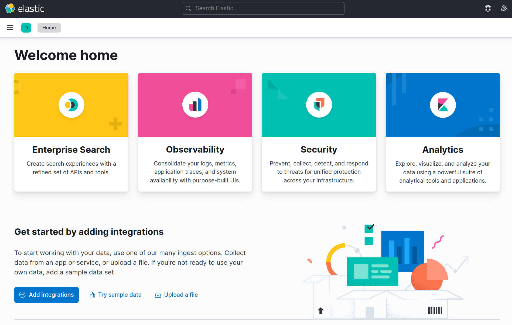

### Task 2: A Primer on Advanced Queries

Before you learn about different advanced queries, there are several things that you need to know first.

#### Different Syntaxes

Kibana supports two types of syntax languages for querying in Kibana: **KQL** (Kibana Query Language) and **Lucene** Query Syntax.

- **Kibana Query Language (KQL)** is a user-friendly query language developed by Elastic specifically for Kibana. It provides autocomplete suggestions and supports filtering using various operators and functions.

**Note**: There is another query language abbreviated as KQL, the *Kusto Query Language*, for use in Microsoft. This is not the same as the Kibana Query Language. So keep this in mind in case you are searching online.

- The **Lucene** Query Syntax is another query language powered by an open-source search engine library used as a backend for search engines, including Elasticsearch. It is more powerful than KQL but is harder to learn for beginners.

The choice of which syntax to use ultimately depends on the situation and the type of data to search for. This is why, in this room, we'll be switching from one to the other, which will be communicated throughout.

#### Special Characters

Before we introduce the queries, it may be important for you to review the following important rules. Knowing this will save you a lot of time figuring out why your query is not working as you want it to.

Certain characters are reserved in ELK queries and must be escaped before usage. Reserved characters in ELK include `+`, `-`, `=`, `&&`, `||`, `&`, `|` and `!`. For instance, using the `+` character in a query will result in an error; to **escape** this character, precede it with a backslash (e.g. `\+)`.

For example, say you're searching for documents that contain the term "User+1" in the "username" field. Simply typing `username:User+1` in the query bar will result in an error because the plus symbol is reserved. To escape it, type `username:User\+1`, and the query will return the desired result.

#### Wildcards

Wildcards are another concept that can be used to filter data in ELK. Wildcards match specific characters within a field value. For example, using the `*` wildcard will match any number of characters, while using the `?` wildcard will match a single character.

Now for a wildcard scenario. Say you're searching for all documents that contain the word "monitor" in the "product_name" field, but the spelling may vary (e.g. "monitors", "monitoring"). To capture all variants, you can use the `*` wildcard - `product_name:monit*` - and the query will return all documents with the word "monitor" in the field, regardless of its suffix. Similarly, if you're searching for all documents where the "name" field starts with "J" and ends with "n", you can use the `?` wildcard - `name:J?n` - The query will match any document where the field value begins with a "J" and ends with an "n" but will only be three characters long.

Understanding the abovementioned will inform you to continue with the advanced queries in the following tasks. But before that, here are some questions for you as a review:

---------------------------------------------------------------------------------------

#### How do you escape the text "password:Me&Try=Hack!" (Not including the double quotes)

Answer: `password:Me\&Try\=Hack!`

#### Using wildcards, what will your query be if you want to search for all documents that contain the words "hacking" and "hack" in the "activity" field?

Answer: `activity:hack*`

### Task 3: Nested Queries

Sometimes, values in a data set are nested like in a JSON format. Nested queries allow us to search within these objects without needing an external JSON parser.

Take a look at the dataset below:

|record_id|incident_type|affected_systems|comments|
|----|----|----|----|
|1|DDoS|[{"system": "web-server"}, {"system": "database"}]|[{"author": "Alice", "text": "Mitigated DDoS attack"}, {"author": "Bob", "text": "Checked logs, found suspicious IPs"}]|
|2|Malware|[{"system": "web-server"}, {"system": "file-server"}]|[{"author": "Charlie", "text": "Removed malware"}, {"author": "Eve", "text": "Updated antivirus software"}]|
|3|Data breach|[{"system": "database"}]|[{"author": "Alice", "text": "Patched vulnerability"}, {"author": "Eve", "text": "Reset all user passwords"}]|
|4|Phishing|[{"system": "email-server"}]|[{"author": "Bob", "text": "Blocked phishing email"}, {"author": "Charlie", "text": "Sent warning to all users"}]|
|5|Insider threat|[{"system": "file-server"}, {"system": "database"}]|[{"author": "Eve", "text": "Investigating employee activity"}, {"author": "Alice", "text": "Implementing stricter access controls"}]|

In the above dataset, the "comments" field is an array of objects, where each object has an "author" and a "text" field.

Let's start by just returning all entries with value in the `comments.author` field. We could use the `*` wildcard as we've learned in the previous task:

`comments.author:*`

This would return all entries from 1 to 5. If we then want to search for comments that only contain "Alice", then we can use this query:

`comments.author:"Alice"`

This will return records 1, 3, and 5, as these entries have Alice as the author.

If we also want to look for comments with the word "attack" in it, that is written by Alice. Then we can combine two queries with the `AND` operator like so:

`comments.author:"Alice" AND comments.text:attack`

#### Trying it out in Kibana

You can try the above queries within Kibana. Here are the steps:

In the Kibana dashboard, open the side panel on the left and click "**Discover**".

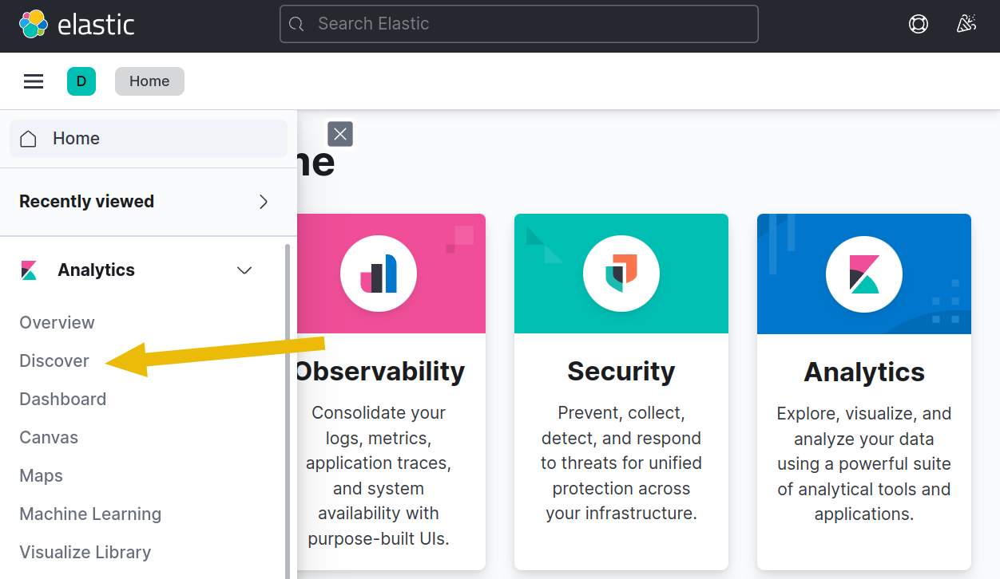

Look for the index pattern dropdown and select the `nested-queries` index pattern. This would be the data that contains the example dataset for this task.

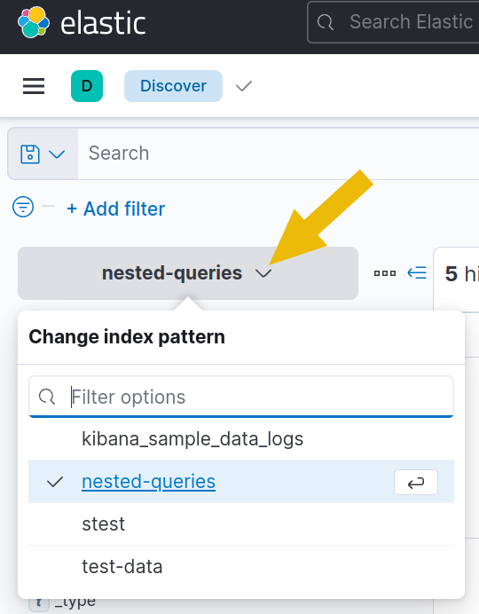

Locate the search bar at the top of the page and enter your query here.

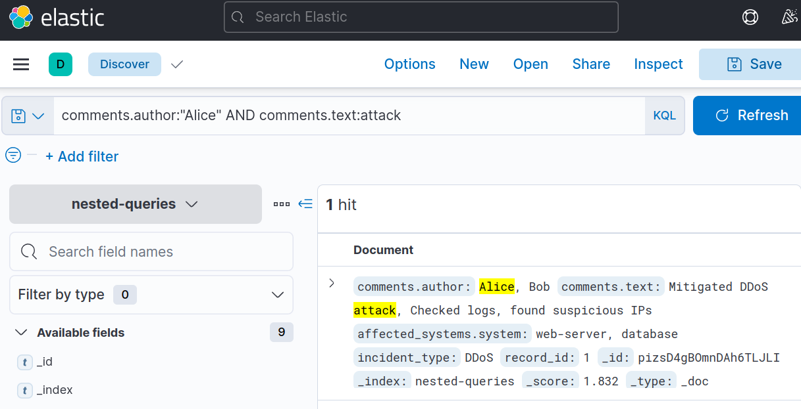

You'll notice that "Alice" and "attack" are highlighted in yellow to show you the matched words.

#### Trying it out with a more extensive data set

You can practice all the queries in this room on a more extensive dataset containing 1000 entries. Use this to practice and answer the questions at the end of every task.

Switch to the `incidents` index dataset and then change the date from Jan 1, 2022, to "Now". To do so, click the "Show dates" button at the right of the search bar.

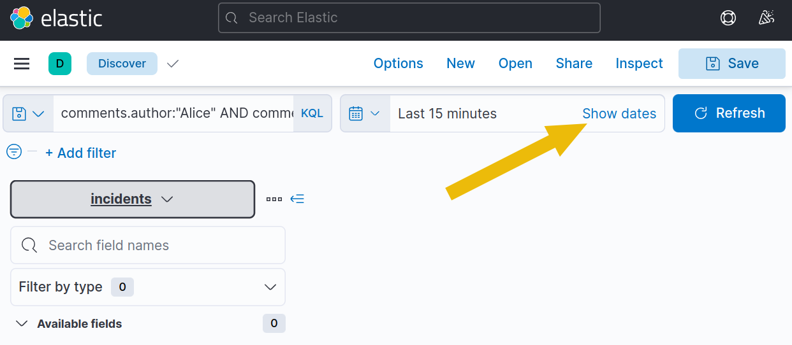

Click on "15 minutes ago" to change the starting date.

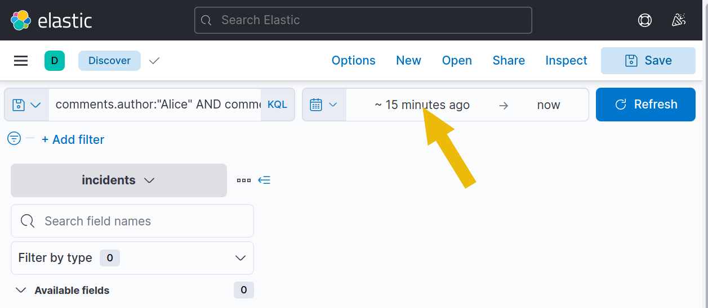

And then, set it to Jan 1, 2022, by clicking on the "Absolute" tab, picking the date "Jan 1, 2022 @ 00:00:00.000", and clicking "Update".

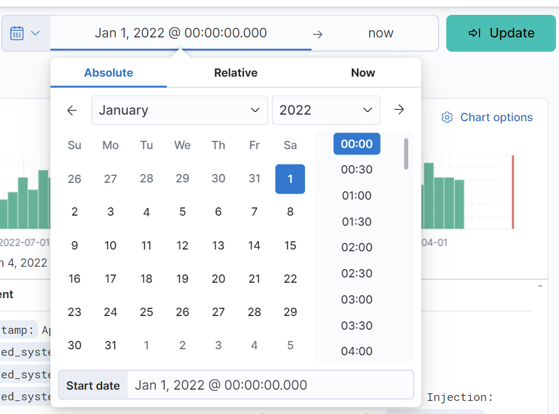

You can now search all the data from Jan 1, 2022 up to Now, containing all 1000 entries.

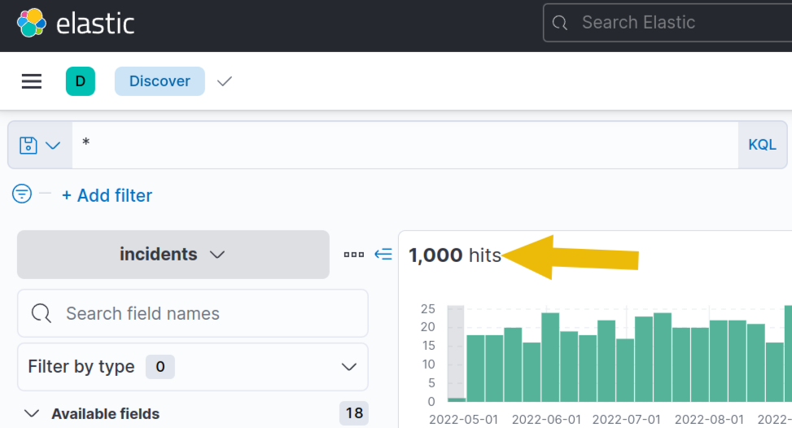

Now answer the questions below:

---------------------------------------------------------------------------------------

#### How many incidents exist where the affected file is "marketing_strategy_2023_07_23.pptx"?

KQL query: `affected_systems.affected_files.file_name: "marketing_strategy_2023_07_23.pptx"`

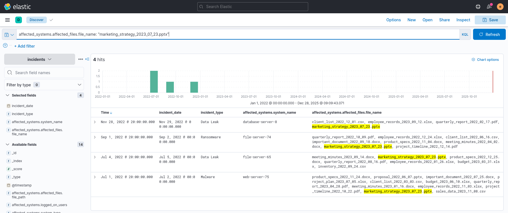

Answer: `4`

#### How many incidents exist where the affected files in file servers are titled "marketing_strategy"?

KQL query: `affected_systems.system_name: "file-server-*" AND affected_systems.affected_files.file_name:  marketing_strategy*`

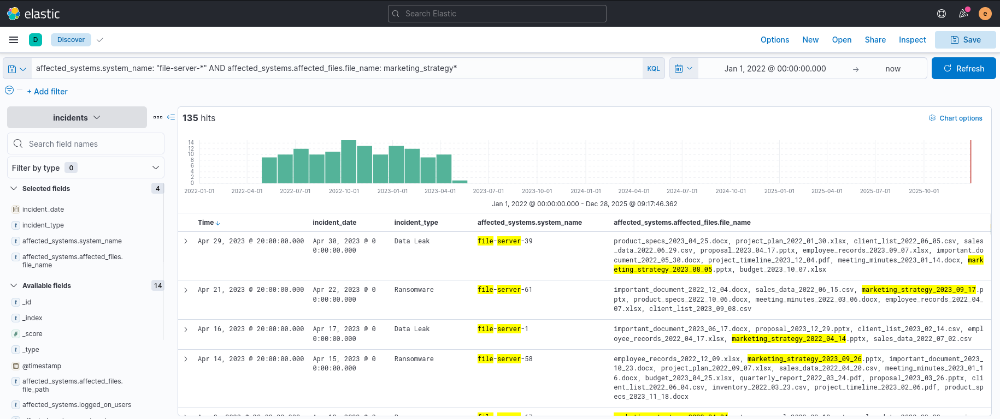

Answer: `135`

#### There is a true positive alert on a webserver where the admin and it users were logged on. What is the name of the webserver?

KQL query: `affected_systems.system_type: "Web Server" AND affected_systems.logged_on_users: (it AND admin)`

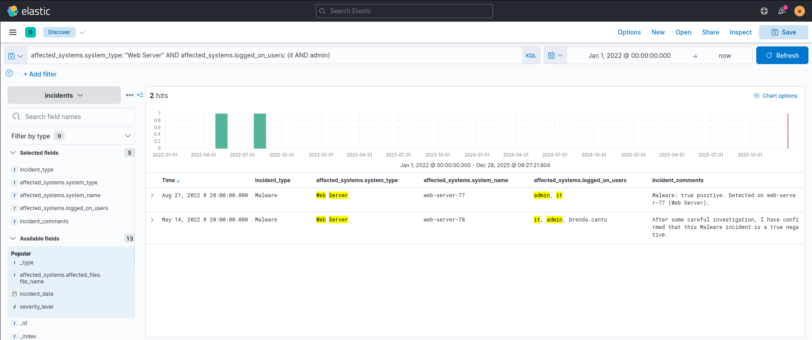

Answer: `web-server-77`

### Task 4: Ranges

Range queries allow us to search for documents with field values within a specified range.

Consider the following example dataset:

|alert_id|alert_type|response_time_seconds|
|----|----|----|
|1|Malware Detection|120|
|2|Unusual Login Attempt|240|
|3|Suspicious Traffic|600|
|4|Unauthorized File Access|300|
|5|Phishing Email|180|

To search for all documents where the "response_time_seconds" field is greater than or equal to 100, then the query for you to use is:

`response_time_seconds >= 100`

Here's one for less than 300:

`response_time_seconds < 300`

And, of course, these can be combined with an AND operator.

`response_time_seconds >= 100 AND response_time_seconds < 300`

The query will return the documents with alert_id 1, 2, and 5.

Ranges are beneficial for dates, which you'll get to try in Kibana in a later section. There are different ways to search by ranges, and one way is by specifying the date by following specific formats.

`@timestamp<"yyyy-MM-ddTHH:mm:ssZ"`

The time is optional, so you can also do the following:

`@timestamp>yyyy-MM-dd`

#### Trying it out in Kibana

Like in the previous task, you can try the above queries by changing the index, this time to ranges.

Use the query `response_time_seconds >= 100 AND response_time_seconds < 300` and you should see the following results:

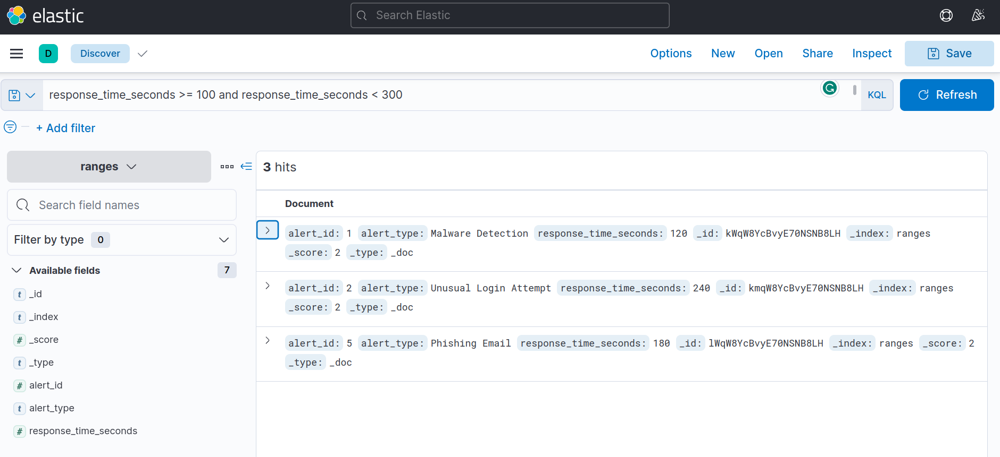

#### Trying it out with a more extensive data set

Now that you've seen how it works, let's switch back to the incidents dataset and use the lessons you've learned in this task to answer the questions below:

---------------------------------------------------------------------------------------

#### How many "Data Leak" incidents have a severity level of 9 and up?

KQL query: `incident_type: "Data Leak" AND severity_level >= 9`

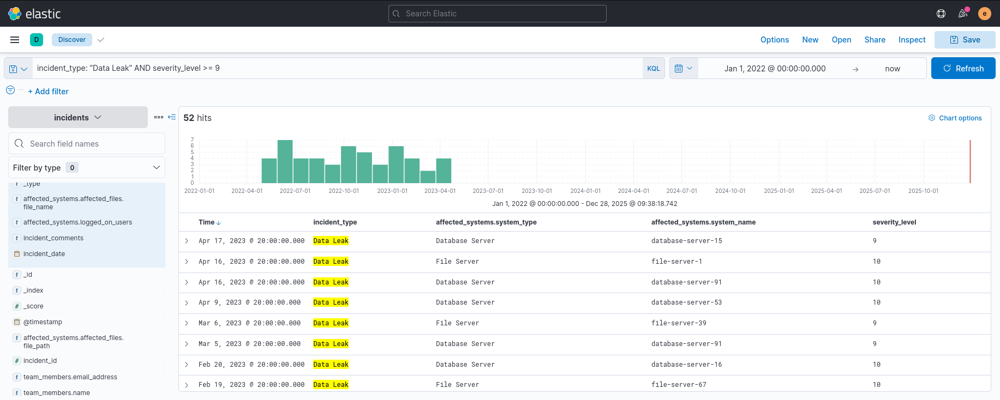

Answer: `52`

#### How many incidents before December 1st, 2022 has AJohnston investigated where the affected system is either an Email or Web server?

KQL query: `affected_systems.system_type: ("Email Server" OR "Web Server") AND team_members.name: AJohnston AND @timestamp < 2022-12-01`

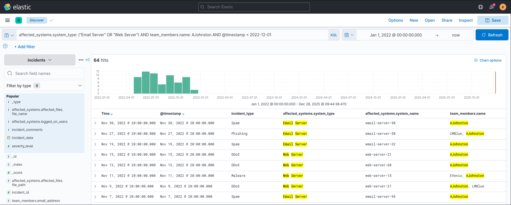

I consider the correct answer to be `64` incidents, but THM for some reason doesn't include the incident on Nov 30th!?

Answer: `63`

#### From the incident IDs 1 to 500, what is the email address of the SOC Analyst that left a comment on an incident that the data leak on file-server-65 is a false positive?

Lucene query: `incident_id: [1 TO 500] AND affected_systems.system_name: "file-server-65" AND incident_type: "Data Leak"`

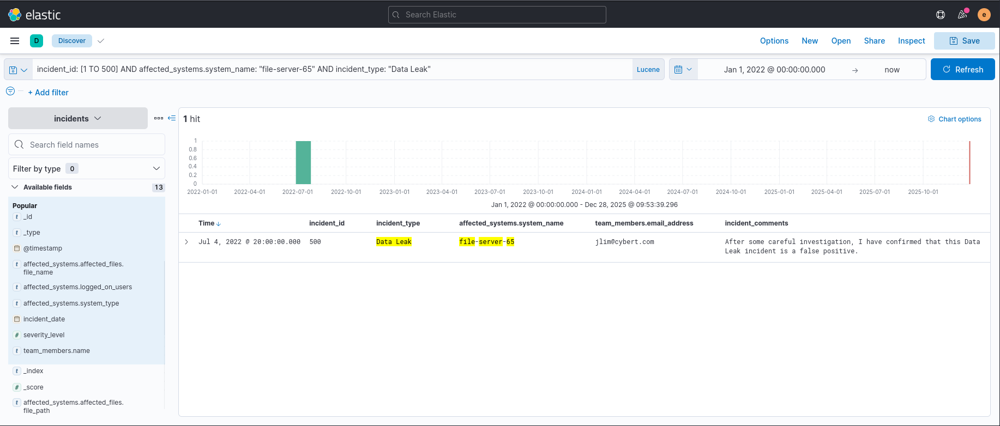

Answer: `jlim@cybert.com`

### Task 5: Fuzzy Searches

Fuzzy searching is beneficial when searching for documents with inconsistencies or typos in the data. It accounts for these variations and retrieves relevant documents by allowing a specified number of character differences (known as the fuzziness value) between the search term and the actual field value.

For example, if you want to search for "server", you can use a fuzzy search to return documents containing "serber", "server01", and "server001". See below:

|host_name|status|
|----|----|
|server01|online|
|serber01|online|
|sirbir01|offline|
|sorvor01|online|
|workstation01|offline|
|workstation001|offline|

To search for all documents where the "host_name" field is similar, but not necessarily identical to "serber", you can use the following query:

`host_name:server01~1`

As you can see, the "~" character indicates that we are doing a fuzzy search. The format of the query is as follows:

`field_name:search_term~fuzziness_value`

Using the query above will return the following documents:

```json
{
  "host_name": "server01",
  "status": "online"
},
{
  "host_name": "serber01",
  "status": "online"
}
```

The fuzziness value lets us control how many characters differ from the search term. A fuzziness of 1 returns the documents above. A fuzziness of 2 returns only the following:

host_name:server01~2

```json
{ 
  "host_name": "server01", 
  "status": "online" 
}, 
{ 
  "host_name": "serber01", 
  "status": "online" 
}, 
{ 
  "host_name": "sorvor01", 
  "status": "online" 
}, 
```

One important thing to note, however, is that fuzzy searching does not work on nested data and only matches on one-word strings. Despite the limitations, it is still useful, especially for finding typos.

#### Trying it out in Kibana

Return to Kibana and change the index to `fuzzy-searches`. This time, however, we will be switching our syntax system to use **Lucene** instead of KQL, as boosting only works in Lucene.

To do this, click on the "KQL" button to the right of the search bar, and then on the pop-up window, set the "Kibana Query Language" option from "On" to "Off". This means that all queries going forward will now use "Lucene".

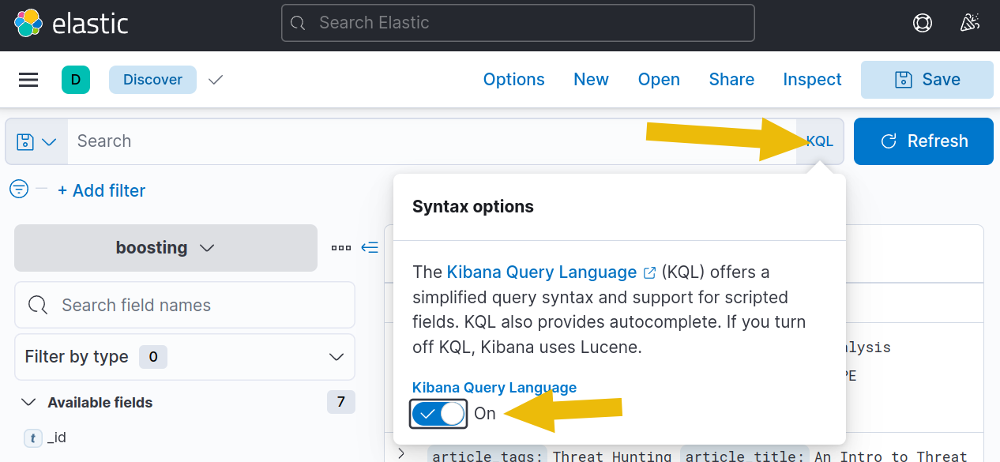

With this correctly set up, use `host_name:server01~1` as a query, and then you should get the following results:

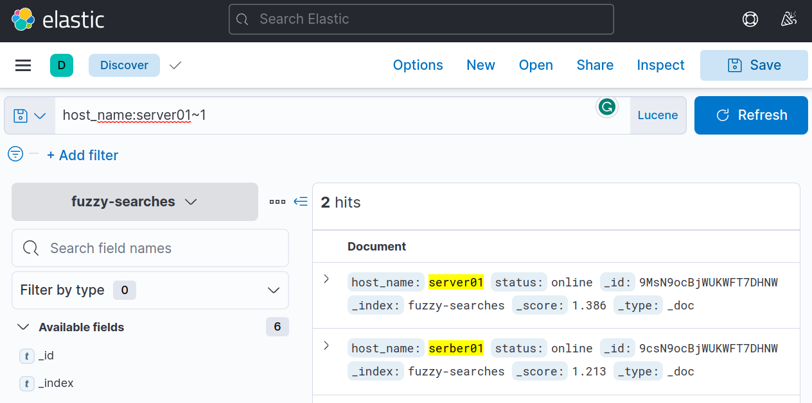

Fuzzy searching also works even if the number of characters of the word is not the same. For example, a search query of `host_name:workstation01~1` would result in the following:

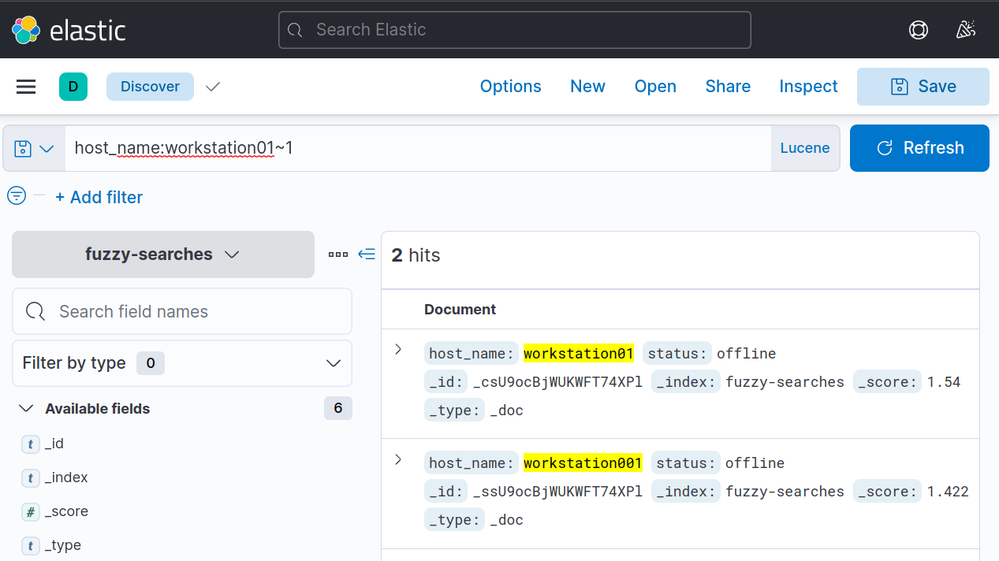

#### Trying it out with a more extensive data set

Let's experiment some more by switching to the `incidents` index dataset and by answering the questions below:

**Note**: For this task, make sure that you are using **Lucene** query syntax.

---------------------------------------------------------------------------------------

#### Including the misspellings, how many incidents has JLim handled where he misspelt the word “true”?

Lucene query: `team_members.name: JLim AND incident_comments: true~1`

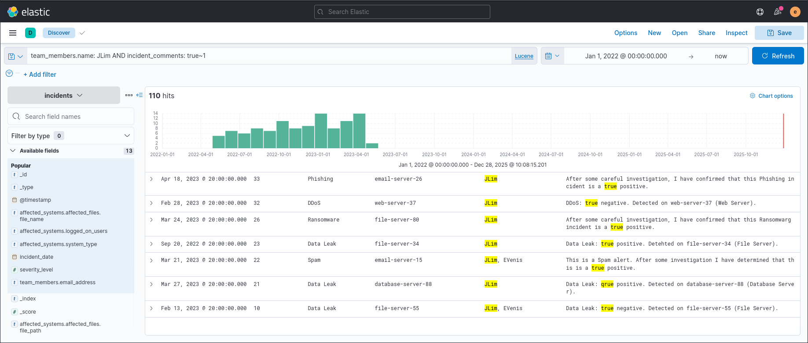

Answer: `110`

#### How many incidents has JLim handled where he misspelt the word “negative”?

Hint: First count of how many times "negative" was spelt correctly, then compare it to the results of a fuzzy search.

Lucene query: `team_members.name: JLim AND incident_comments: negative~1 AND NOT incident_comments: negative`

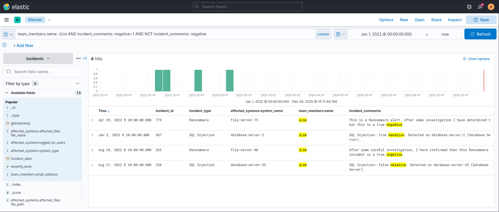

Answer: `4`

### Task 6: Proximity Searches

Proximity searches allow you to search for documents where the field values contain two or more terms within a specified distance. In **KQL**, you can use the match_phrase query with the slop parameter to perform a proximity search. The slop parameter sets the maximum distance that the terms can be from each other. For example, a slop value of 2 means that the words can be up to 2 positions away.

The format when doing a proximity search is like so:

`field_name:"search term"~slop_value`

As you can see, the `~` character is used, followed by a slop_value. Note that `~` is used for both **proximity** searches and **fuzzy** searching; the difference is that in proximity searches, the slop value is applied to a phrase **enclosed in quotation marks** (").

Let's continue. Consider the following example dataset:

|log_id|log_message|
|----|----|
|1|Server error: failed login attempt.|
|2|Login server - failed on startup with error.|
|3|Login to server failed successfully.|
|4|Server: Detected error in connection.|

To search for all documents where the terms "server" and "error" appear within a distance of 1 word or less from each other in the "log_message" field, you can use the following query:

`log_message:"server error"~1`

This query will return the following documents:

```json
{ 
    "log_id": 1, 
    "log_message": "Server error: failed login attempt." 
}, 
{ 
    "log_id": 4, 
    "log_message": "Server: Detected error in connection." 
}
```

You can see in the results above that "server" and "error" have one word or less **in between** them.

If we change our query to:

`log_message:"failed login"~0`

Then we'll end up with just:

```json
{
  "log_id": 1,
  "log_message": "Server error: failed login attempt."
}
```

#### Trying it out in Kibana

We're still going to be using **Lucene** for this task. Change the index pattern to `proximity-searches` and use the following query:

`log_message:"server error"~4`

This should give us the results below. Notice, in the 3rd result, there are four words between "server" and "error".

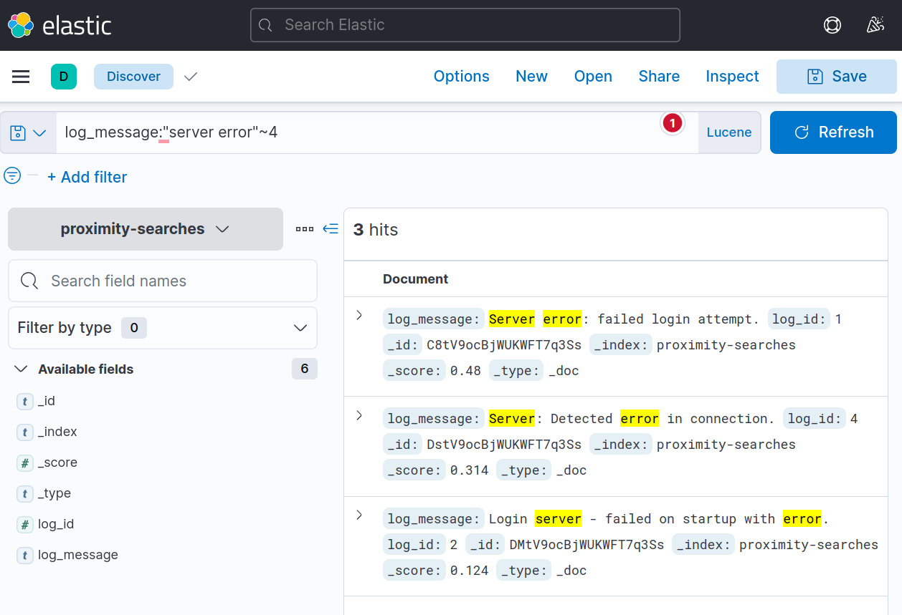

You can also use operators such as AND and OR in more complex queries for multiple proximity searches. For example, if you want to search for documents containing either "failed login" or "server error" within a distance of 2 words, you could use the following query:

`log_message:"server error"~1 OR "login server"~1`

Which will return the following documents:

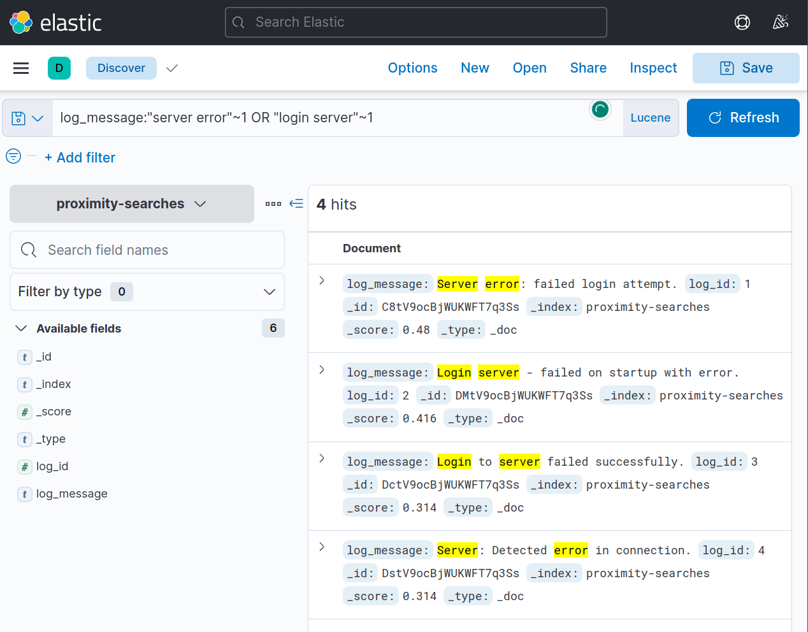

#### Trying it out with a more extensive data set

Now for an even more significant challenge, switch to the `incidents` index dataset and answer the questions below:

Note: For this task, make sure that you are using Lucene query syntax.

---------------------------------------------------------------------------------------

#### How many incidents are there when you want to look for the words "data leak" and "true negative" in the comments that are at least 3 words in between them?

Lucene query: `incident_comments: ("data leak" AND "true negative") AND NOT incident_comments: "Data Leak: true negative."`

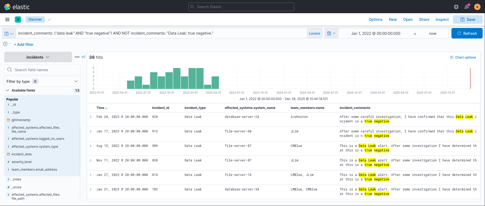

I consider the correct answer to be `39` incidents, but THM for some reason also includes incidents with comments with **NO** words in between the phrases "data leak" and "true negative". Incidents with comments such as this one:

```text
Data Leak: true negative. Detected on database-server-71 (Database Server).
```

There is also an additional discrepancy that I'm unclear about.

Answer: `33`

#### How many incidents has AJohnston investigated that have the words "detected" and "negative" in the comments that are two words apart?

Lucene query: `team_members.name: AJohnston AND incident_comments: "detected negative"~2`

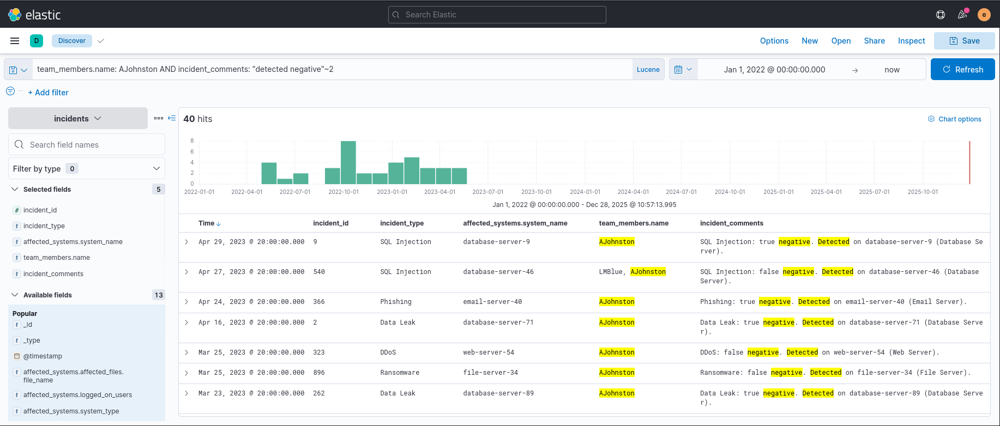

A better phrasing of the question is "...that are **at most** two words apart?"

Answer: `40`

### Task 7: Regular Expressions

Regular expressions (or regex, regexp) allow you to use a pattern to match field values. You'll encounter this powerful concept frequently when working with data. We can use regexp in Kibana to search for complex patterns that cannot easily be found using simple query strings or wildcards.

Before you continue, I encourage you to check out the [Regexp room](https://tryhackme.com/room/catregex). That room will cover the basics of regular expressions and give you most of what you need to grasp better what is covered in this task.

#### Trying it out in Kibana

You'll notice that we're heading straight to Kibana this time. This is because regular expressions can get confusing if you don't know what you are doing. Thankfully, Kibana highlights matches in the documents we'll use to verify our expressions.

Like before, please change the index pattern to `regular-expressions`.

|ID|Date|Event Type|Description|Source IP|Destination IP|URL|
|----|----|----|----|----|----|----|
|1|2023-04-10|DDoS Attack|Distributed denial of service attack on a company's website|192.168.1.10|203.0.113.1|`http://www.example1.com`|
|2|2023-04-12|Phishing|Phishing email attempting to steal user credentials|192.168.1.11|203.0.113.2|`http://www.example2.com/login`|
|3|2023-04-15|Malware Infection|Malware infection on a user's computer|192.168.1.12|203.0.113.3|`http://www.example3.com/download`|
|4|2023-04-16|XSS Attack|Cross-site scripting attack on a web application|192.168.1.13|203.0.113.4|`http://www.example4.com/comment`|
|5|2023-04-20|SQL Injection|SQL injection attack on a company's database|192.168.1.14|203.0.113.5|`http://www.example5.com/query`|

To use regex in a query, you must wrap your regular expression in forward slashes (`/`). Let's start with a relatively simple example and use ".*" to match all characters of any length.

`Event_Type:/.*/`

This will return all the entries, as shown below:

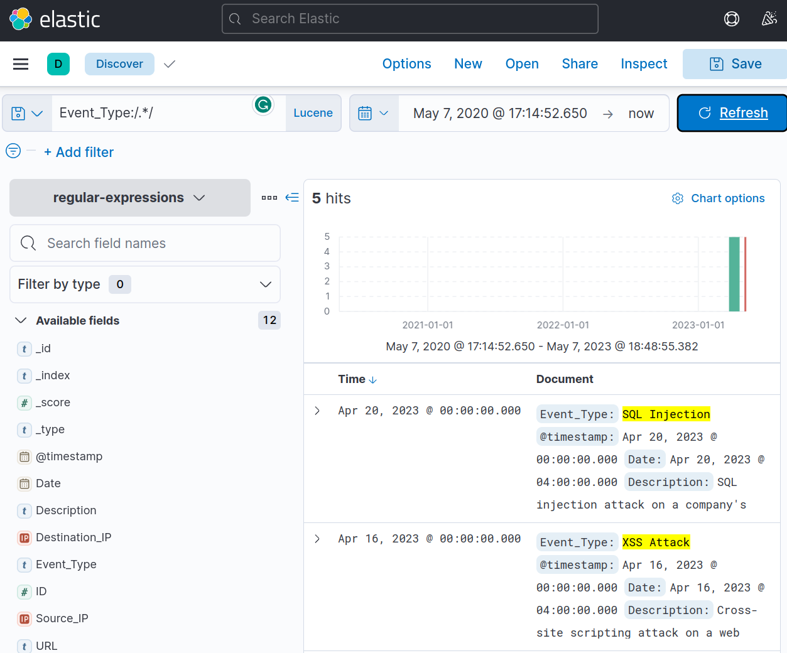

Notice that all entries of "Event_Type" that matched are highlighted in Yellow.

If we want only to return entries that start with the letters "S" or "M", then we could use the following :

`Event_Type:/(S|M).*/`

This will return only the entries that start with S and M, as shown below:

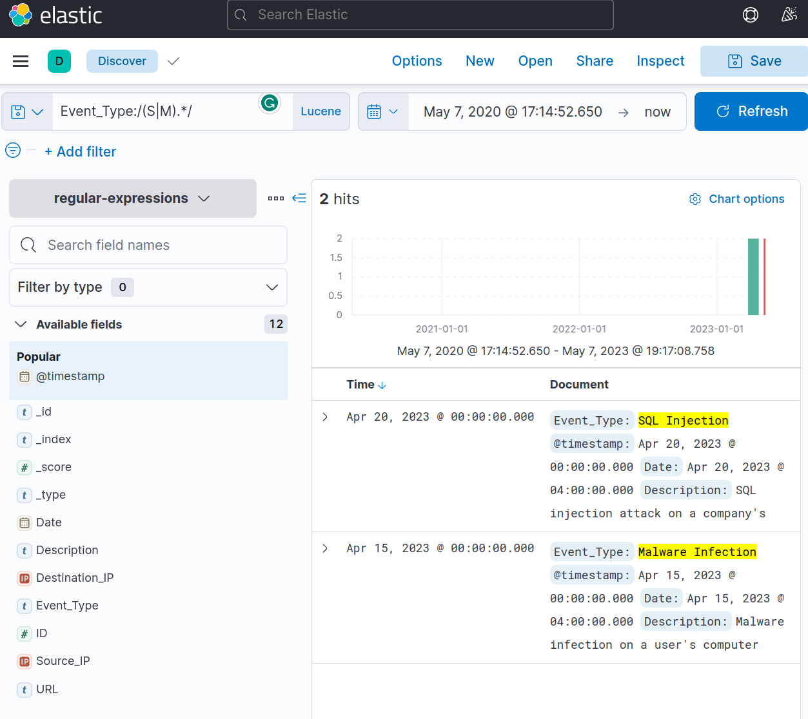

One important thing to note about Kibana's regex engine is that its behaviour changes depending on the data type.

So far, we've used regex on the "Event_Type" field. And the data type for this field is set internally to "**keyword**". Regular expressions behave as you'd expect when searching for data with this type.

The behaviour changes if the data type is set to "**text**". For example, the field "Description" has "text" as its data type.

Try the following query:

`Description:/.*/`

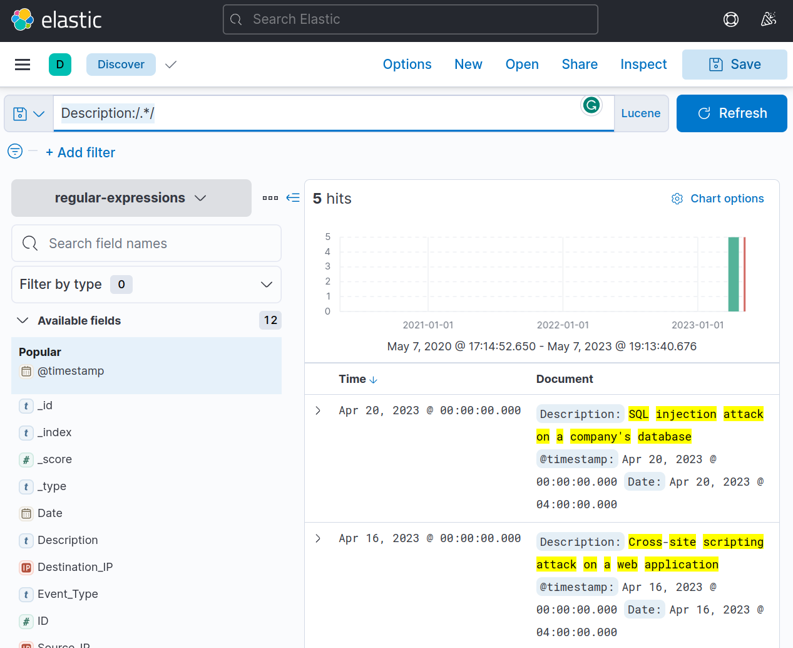

So far, so good. All the entries are returned because we match all characters of any length.

Now this is where things change. Try the following query and check the results:

`Description:/(s|m).*/`

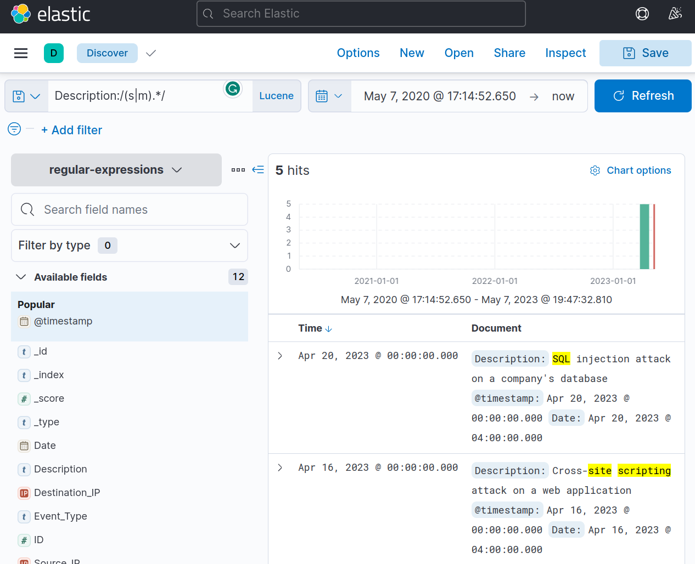

Notice that instead of the whole description being highlighted in yellow, only single words starting with the letters "s" or "m" are highlighted. This is because when a text field is analyzed, the string is **tokenized**, and the regular expression is matched against each word. This is why the words "SQL", "steal", "service", and even "site" from "Cross-site scripting" is highlighted.

This approach allows for flexibility which can be further utilized by combining it with more expressions, as shown below:

`Description:/(s|m).*/ AND /user.*/`

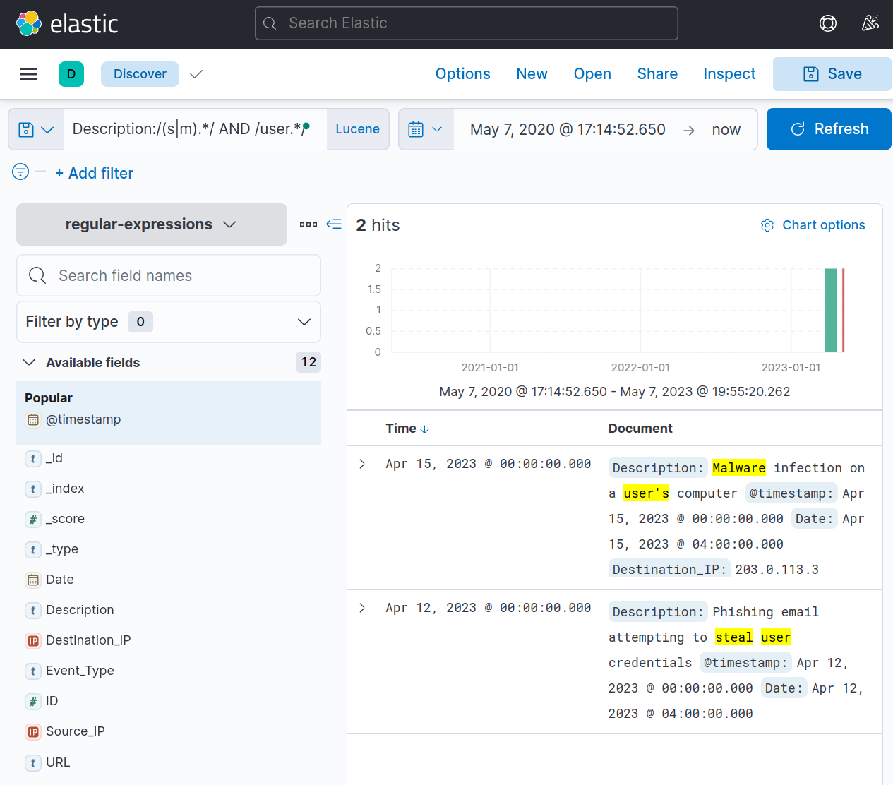

#### Trying it out with a more extensive data set

Almost there! Switch to the `incidents` index dataset and answer the questions below:

**Note**: For this task, make sure that you are using **Lucene** query syntax.

---------------------------------------------------------------------------------------

#### How many incidents are there where a "client_list" file was affected by ransomware?

Lucene query: `incident_type: "Ransomware" AND affected_systems.affected_files.file_name: client_list*`

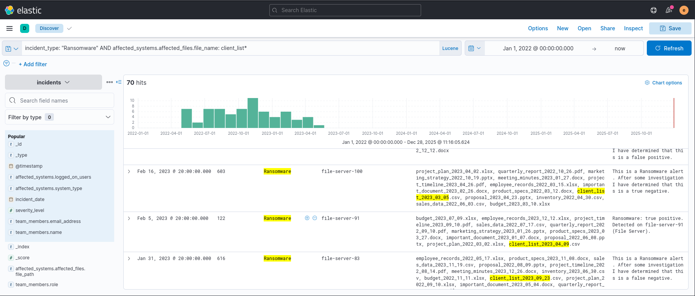

Answer: `70`

#### What is the name of the affected system at the earliest incident date that EVenis investigated with a filename containing the word "project"?

Lucene query: `team_members.name: "EVenis" AND affected_systems.affected_files.file_name: *project*`

Click on the `Time` column header to sort on it descending.

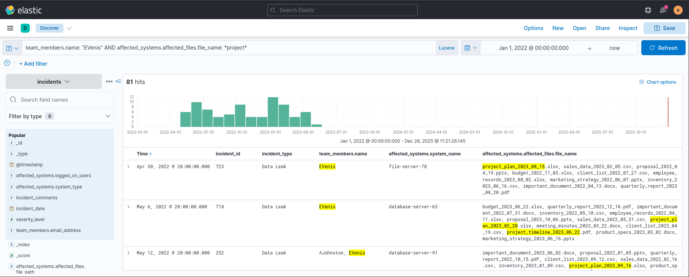

Answer: `file-server-78`

### Task 8: Conclusion

Throughout this room, we have explored various advanced querying techniques in Kibana, which are instrumental in helping analysts effectively filter, manipulate, and extract valuable insights from large datasets in the cyber security domain. These techniques empower analysts to go beyond basic queries and delve deeper into the data, uncovering hidden patterns and correlations that can inform decision-making and enhance problem-solving capabilities.

#### What to check out next?

Give yourself more practice by checking out these other rooms related to Kibana and ELK.

- [ItsyBitsy](https://tryhackme.com/room/itsybitsy) - A Kibana challenge room
- [Slingshot](https://tryhackme.com/room/slingshot) - A challenge room combining all lessons from the ELK module

For additional information, please see the references below.

## References

- [Kibana - Wikipedia](https://en.wikipedia.org/wiki/Kibana)
- [Kibana Query Language - Elastic](https://www.elastic.co/docs/reference/query-languages/kql)
- [Lucene - Query Parser Syntax - Apache](https://lucene.apache.org/core/2_9_4/queryparsersyntax.html)
- [Lucene query syntax - Elastic](https://www.elastic.co/docs/explore-analyze/query-filter/languages/lucene-query-syntax)
- [Query string query - Elastic](https://www.elastic.co/docs/reference/query-languages/query-dsl/query-dsl-query-string-query#query-string-syntax)
