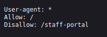
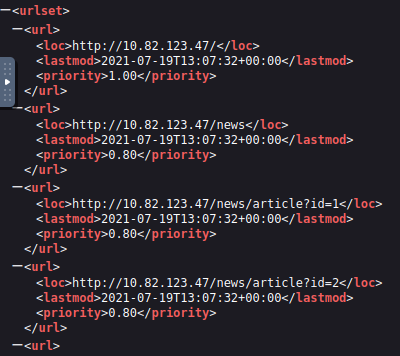
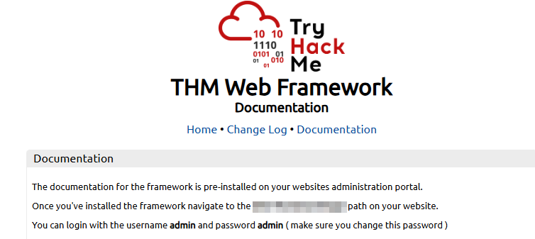

# Content Discovery

- [Room information](#room-information)
- [Solution](#solution)
- [References](#references)

## Room information

```text
Type: Walkthrough
Difficulty: Easy
Tags: Linux
Meta Tags: Walkthrough, Walk-through, Write-up, Writeup
Subscription type: Free
Description:
Discover hidden web content using manual techniques, OSINT, and Gobuster enumeration.
```

Room link: [https://tryhackme.com/room/contentdiscoveryx](https://tryhackme.com/room/contentdiscoveryx)

## Solution

### Task 1: Introduction

In web application security, content refers to anything hosted on a web server, such as pages, files, directories, admin portals, configuration files, and backup archives. **Content discovery** is the process of finding content that wasn't meant to be publicly accessible or isn't linked anywhere obvious.

This content could be staff portals, older versions of the site, exposed backup files, or administration panels. Finding it is a core part of any web application penetration test.

There are three main approaches to content discovery: manual, automated, and OSINT (Open-Source Intelligence). This room covers all three.

#### Learning Objectives

By the end of this room, you'll be able to:

- Manually discover hidden content using robots.txt, sitemap.xml, favicons, HTTP headers, and framework analysis
- Use OSINT tools, including Google dorking, Wappalyzer, the Wayback Machine, GitHub, and S3 bucket enumeration
- Use Gobuster to brute-force directories, subdomains, and virtual hosts
- Apply a structured content discovery methodology in a penetration test

#### Prerequisites

You should have an understanding of the following rooms before starting:

- [HTTP in Detail](https://tryhackme.com/room/httpindetail)
- [How Websites Work](https://tryhackme.com/room/howwebsiteswork)

#### Machine Access

To successfully complete this room, you'll need to set up your virtual environment. This involves starting both your AttackBox (if you're not using your VPN) and Lab Machines, ensuring you're equipped with the necessary tools and access to tackle the challenges ahead.

---------------------------------------------------------------------------------------

### Task 2: Manual Discovery - Common Files

Several files that web servers expose by convention can reveal far more than intended. Checking these manually should be the first step in any content discovery engagement.

#### robots.txt

The robots.txt file tells search engine crawlers which pages they may index. Site owners often list sensitive directories here to prevent them from appearing in search results, making it a ready-made list of interesting locations for a penetration tester.

View the robots.txt file on the Acme IT Support website by opening Firefox on the AttackBox and navigating to `http://10.112.164.237/robots.txt` (*this URL will update 2 minutes after you start the machine*).



This robots.txt file tells web crawlers (like search engines) how to interact with the site. It allows all bots to access most of the site (`Allow: /`) but asks them not to visit `/staff-portal`. Keep in mind, this is only a guideline for bots, not a security control, so restricted paths may still be accessible if visited directly.

#### sitemap.xml

Unlike robots.txt (which restricts crawlers), sitemap.xml tells search engines which pages the owner wants listed. These files sometimes include staging pages, old content, or URLs that are hard to reach via the normal site. Check it at `http://10.112.164.237/sitemap.xml`.



As shown in the image, this sitemap lists specific endpoints available on the target application, including standard pages like `/news`, `/contact`, and multiple article IDs (`/news/article?id=1,2,3`). More importantly, it reveals sensitive or interesting paths such as `/customers/login` and `/s3cr3t-area`, which may not be easily discoverable through normal browsing. The presence of parameters like `id=` also hints at potential input points worth testing. This makes the sitemap a valuable source during reconnaissance for mapping the attack surface.

---------------------------------------------------------------------------------------

#### What is the directory in the robots.txt that isn't allowed to be viewed by web crawlers?

Check the robots.txt file with curl.

```bash
┌──(kali㉿kali)-[/mnt/…/TryHackMe/Walkthroughs/Easy/Content_Discovery]
└─$ curl http://10.112.164.237/robots.txt
User-agent: *
Allow: /
Disallow: /staff-portal
```

Answer: `/staff-portal`

#### What is the path of the secret area found in sitemap.xml?

Check the sitemap.xml file with curl.

```bash
┌──(kali㉿kali)-[/mnt/…/TryHackMe/Walkthroughs/Easy/Content_Discovery]
└─$ curl http://10.112.164.237/sitemap.xml
<?xml version="1.0" encoding="UTF-8"?>
<urlset xmlns:xsi="http://www.w3.org/2001/XMLSchema-instance">
    <url>
        <loc>http://10.112.164.237/</loc>
        <lastmod>2021-07-19T13:07:32+00:00</lastmod>
        <priority>1.00</priority>
    </url>
    <url>
        <loc>http://10.112.164.237/news</loc>
        <lastmod>2021-07-19T13:07:32+00:00</lastmod>
        <priority>0.80</priority>
    </url>
    <url>
        <loc>http://10.112.164.237/news/article?id=1</loc>
        <lastmod>2021-07-19T13:07:32+00:00</lastmod>
        <priority>0.80</priority>
    </url>
    <url>
        <loc>http://10.112.164.237/news/article?id=2</loc>
        <lastmod>2021-07-19T13:07:32+00:00</lastmod>
        <priority>0.80</priority>
    </url>
    <url>
        <loc>http://10.112.164.237/news/article?id=3</loc>
        <lastmod>2021-07-19T13:07:32+00:00</lastmod>
        <priority>0.80</priority>
    </url>
    <url>
        <loc>http://10.112.164.237/contact</loc>
        <lastmod>2021-07-19T13:07:32+00:00</lastmod>
        <priority>0.80</priority>
    </url>
    <url>
        <loc>http://10.112.164.237/customers/login</loc>
        <lastmod>2021-07-19T13:07:32+00:00</lastmod>
        <priority>0.80</priority>
    </url>
    <url>
        <loc>http://10.112.164.237/s3cr3t-area</loc>
        <lastmod>2021-07-19T13:07:32+00:00</lastmod>
        <priority>0.80</priority>
    </url>
</urlset>
```

Answer: `/s3cr3t-area`

---------------------------------------------------------------------------------------

### Task 3: Manual Discovery - Headers & Framework Stack

#### HTTP Headers

When a web server responds to a request, it includes HTTP headers that can reveal useful technical details. Headers like `Server` and `X-Powered-By` often expose the web server software and the language or framework the application runs on.

Run the following command against the Acme IT Support web server. The `-v` flag enables verbose output, which includes the response headers:

```bash
root@tryhackme:~# curl http://10.112.164.237 -v
*   Trying 10.112.164.237:80...
* TCP_NODELAY set
* Connected to 10.112.164.237 (10.112.164.237) port 80 (#0)
> GET / HTTP/1.1
> Host: 10.112.164.237
> User-Agent: curl/7.68.0
> Accept: */*
> 
* Mark bundle as not supporting multiuse
< HTTP/1.1 200 OK
< Server: nginx/1.18.0 (Ubuntu)
< Date: Mon, 04 May 2026 10:39:13 GMT
< Content-Type: text/html; charset=UTF-8
< Transfer-Encoding: chunked
< Connection: keep-alive
< X-FLAG: [REDACTED]
< X-FLAG: [REDACTED]
< X-Powered-By: THM-Framework
< 
<!--
This page is temporary while we work on the new homepage @ /new-home-beta
-->
<!DOCTYPE html>
<html lang="en">
<head>
    <title>Acme IT Support - Home</title>
    <meta charset="utf-8">
    <meta http-equiv="X-UA-Compatible" content="IE=edge">
    <meta name="viewport" content="width=device-width, initial-scale=1">
        <link rel="stylesheet" href="https://pro.fontawesome.com/releases/v5.12.0/css/all.css" integrity="sha384-ekOryaXPbeCpWQNxMwSWVvQ0+1VrStoPJq54shlYhR8HzQgig1v5fas6YgOqLoKz" crossorigin="anonymous">
        <link rel="stylesheet" href="/assets/bootstrap.min.css">
    <link rel="stylesheet" href="/assets/style.css">
</head>
<body>
    <nav class="navbar navbar-inverse navbar-fixed-top">
        <div class="container">
            <div class="navbar-header">
                <button type="button" class="navbar-toggle collapsed" data-toggle="collapse" data-target="#navbar" aria-expanded="false" aria-controls="navbar">
                    <span class="sr-only">Toggle navigation</span>
                    <span class="icon-bar"></span>
                    <span class="icon-bar"></span>
                    <span class="icon-bar"></span>
                </button>
                <a class="navbar-brand" href="#">Acme IT Support</a>
            </div>
            <div id="navbar" class="collapse navbar-collapse">
                <ul class="nav navbar-nav">
                    <li class="active"><a href="/">Home</a></li>
                    <li><a href="/news">News</a></li>
                    <li><a href="/contact">Contact</a></li>
                    <li><a href="/customers">Customers</a></li>
                </ul>
            </div><!--/.nav-collapse -->
        </div>
    </nav><div class="container" style="padding-top:60px">
    <h1 class="text-center">Acme IT Support</h1>
    <div class="row">
        <div class="col-md-8 col-md-offset-2 text-center">
            
            <p class="welcome-msg">Our dedicated staff are ready <a href="/secret-page">to</a> assist you with your IT problems.</p>
        </div>
    </div>
</div>
<script src="/assets/jquery.min.js"></script>
<script src="/assets/bootstrap.min.js"></script>
<script src="/assets/site.js"></script>
</body>
</html>
<!--
Page Generated in 0.04765 Seconds using the THM Framework v1.2 ( https://static-labs.tryhackme.cloud/sites/thm-web-framework )
* Connection #0 to host 10.82.123.47 left intact
```

Look through the response headers carefully; there may be a custom header containing a flag.

#### Framework Stack

Once you've identified the framework (from the favicon, headers, or by inspecting the page source for comments and copyright notices), visit the framework's own website to learn more. Documentation pages often describe default directory structures, admin panel paths, and default credentials.



View the Acme IT Support page source at `http://10.112.164.237`, there's a comment at the bottom of every page with a link to the framework's website. Follow that link and check the documentation to find the administration portal path. Access that path on the Acme IT Support site and log in with the default `admin` / `admin` credentials to retrieve the flag.

---------------------------------------------------------------------------------------

#### What is the flag value from the X-FLAG header?

We can check this with the `-I` or `--head` parameters.

```bash
┌──(kali㉿kali)-[/mnt/…/TryHackMe/Walkthroughs/Easy/Content_Discovery]
└─$ curl -I http://10.112.164.237         
HTTP/1.1 404 Not Found
Server: nginx/1.18.0 (Ubuntu)
Date: Sun, 23 Aug 2026 09:42:42 GMT
Content-Type: text/html; charset=UTF-8
Connection: keep-alive
X-FLAG: THM{<REDACTER>}
X-FLAG: THM{<REDACTED>}
X-Powered-By: THM-Framework
```

Answer: `THM{<REDACTED>}`

#### What is the flag from the framework's administration portal?

From the HTML-source of `http://10.112.164.237/` we find the framework website.

```html
<!--
Page Generated in 0.04962 Seconds using the THM Framework v1.2 ( https://static-labs.tryhackme.cloud/sites/thm-web-framework )
-->
```

On `https://static-labs.tryhackme.cloud/sites/thm-web-framework/documentation.html` we find the default credentials:

- Username: `admin`
- Password: `admin`

And the link to the administration port (`/thm-framework-login`).

Login with the default credentials on `http://10.112.164.237/thm-framework-login` to get the flag.

Answer: `THM{<REDACTED>}`

---------------------------------------------------------------------------------------

### Task 4: OSINT - Search Engines & Web Tools

There are also external resources available that can help in discovering information about your target website; these resources are often referred to as OSINT (Open-Source Intelligence), as they're freely available tools that collect information:

#### Google Hacking / Dorking

Google's advanced search operators let you filter results in ways that can surface sensitive content indexed from your target. By combining operators, you can find exposed admin panels, leaked documents, and login pages that the site owner never intended to be public.

|Filter|Example|Description|
|----|----|----|
|`site`|`site:tryhackme.com`|Returns results only from the specified domain|
|`inurl`|`inurl:admin`|Returns results with the specified word in the URL|
|`filetype`|`filetype:pdf`|Returns results of a specific file type|
|`intitle`|`intitle:admin`|Returns results with the specified word in the page title|
|`intext`|`intext:password`|Returns results containing the specified word in the body|
|`cache`|`cache:tryhackme.com`|Shows Google's cached version of the page|

For example, site:tryhackme.com filetype:pdf would return all PDFs indexed from tryhackme.com. You can combine multiple filters in a single query. More information is available at [Wikipedia: Google Hacking](https://en.wikipedia.org/wiki/Google_hacking)

#### Wappalyzer

[Wappalyzer](https://www.wappalyzer.com/) is a browser extension and online tool that identifies the technologies a website uses, frameworks, CMS platforms, CDNs, analytics tools, payment processors, and more. It can often detect version numbers, which helps when searching for known vulnerabilities. Install it from your browser's extension store and visit any site to see the tech stack immediately.

---------------------------------------------------------------------------------------

#### What Google dork operator limits results to a specific site?

Answer: `site:`

#### What online tool and browser extension identifies what technologies a website is running?

Answer: `Wappalyzer`

---------------------------------------------------------------------------------------

### Task 5: OSINT - Repositories & Archives

#### Wayback Machine

The [Wayback Machine](https://web.archive.org/) is an archive of the Internet dating back to the late 1990s. Search for a domain, and you'll see every snapshot captured over time. This is useful for finding pages that have been removed from the live site but may still be accessible: old login forms, forgotten API endpoints, or content that was published briefly before being taken down.

#### GitHub

[Git](https://git-scm.com/) is a **version control system** that tracks changes to files over time. GitHub is the most widely used cloud-hosted platform for Git repositories. Developers sometimes accidentally commit sensitive data: API keys, credentials, configuration files, and `.env` files, before realising the repository is public.

Search GitHub for the company name or domain you're targeting. Once you find a relevant repository, look through the commit history, not just the current files. Sensitive data is often removed in a later commit, but remains in the history.

#### S3 Buckets

[Amazon S3](https://aws.amazon.com/pm/serv-s3/) (Simple Storage Service) is a cloud storage platform that many organisations use to host files and static website content. The URL format for an S3 bucket is `https://{name}.s3.amazonaws.com`. Bucket owners set permissions, but misconfigurations are common: a publicly accessible bucket can expose files that were never meant to be seen.

Common naming patterns include `{company}-assets`, `{company}-backup`, `{company}-www`, and `{company}-dev`. Try these patterns against your target's company name. You can also find bucket URLs in the website's page source or in GitHub repositories.

---------------------------------------------------------------------------------------

#### What is the website address for the Wayback Machine?

Answer: `https://web.archive.org/`

#### What URL format do Amazon S3 buckets end in? (Answer starts with a .)

Answer: `.s3.amazonaws.com`

---------------------------------------------------------------------------------------

### Task 6: Automated Discovery - Gobuster Fundamentals

Manual and OSINT techniques can only take you so far. Automated discovery uses tools to rapidly send hundreds or thousands of requests to a web server to check whether directories, files, or other resources exist. This process relies on **wordlists**, text files containing commonly used directory names, file names, and paths.

#### Gobuster

[Gobuster](https://github.com/OJ/gobuster) is an open-source enumeration tool written in Go. It supports multiple modes: directory/file enumeration (`dir`), DNS subdomain enumeration (`dns`), and virtual host enumeration (`vhost`). It's pre-installed on the AttackBox and included by default in Kali Linux.

Run `gobuster --help` to see the available commands and global flags:

|Flag|Description|
|----|----|
|`-t` / `--threads`|Number of concurrent threads (default: 10). Increase for faster scans.|
|`-w` / `--wordlist`|Path to the wordlist file. Required for all modes.|
|`-o` / `--output`|Write results to a file instead of stdout.|
|`--delay`|Wait time between requests: useful against rate-limited servers.|

**Wordlists**

A good wordlist is critical. [SecLists](https://github.com/danielmiessler/SecLists) is the most widely used collection and is pre-installed on the AttackBox at `/usr/share/wordlists/SecLists/`. For directory enumeration, `Discovery/Web-Content/common.txt` and `Discovery/Web-Content/directory-list-2.3-medium.txt` cover most scenarios.

**dir Mode**

The `dir` mode brute-forces directories and files on a web server. The basic syntax is:

```bash
gobuster dir -u "http://10.112.164.237" -w /path/to/wordlist
```

The `-u` flag specifies the target URL that Gobuster will run its discovery against. The `-w` flag specifies the wordlist file; a list of directory and file names Gobuster will try against the target one by one. Both `-u` and `-w` are required for Gobuster to run; omitting either will result in an error.

Some additional useful flags for `dir` mode:

|Flag|Description|
|----|----|
|`-x` / `--extensions`|File extensions to search for (e.g., `-x .php,.txt,.js`)|
|`-r` / `--followredirect`|Follow HTTP redirects|
|`-k` / `--no-tls-validation`|Skip TLS certificate verification (useful in lab environments)|
|`-s` / `--status-codes`|Only show specific status codes (e.g., `-s 200,301`)|

Run the following command against the Acme IT Support web server and review the results:

```bash
root@ip-10-82-112-63:~# gobuster dir -u http://10.112.164.237 -w /usr/share/wordlists/SecLists/Discovery/Web-Content/common.txt
===============================================================
Gobuster v3.6
by OJ Reeves (@TheColonial) & Christian Mehlmauer (@firefart)
===============================================================
[+] Url:                     http://10.112.164.237
[+] Method:                  GET
[+] Threads:                 10
[+] Wordlist:                /usr/share/wordlists/SecLists/Discovery/Web-Content/common.txt
[+] Negative Status codes:   404
[+] User Agent:              gobuster/3.6
[+] Timeout:                 10s
===============================================================
Starting gobuster in directory enumeration mode
===============================================================
/assets               (Status: 301) [Size: 178] [--> http://10.82.123.47/assets/]
/contact              (Status: 200) [Size: 3108]
/customers            (Status: 302) [Size: 0] [--> /customers/login]
/development.log      (Status: 200) [Size: 27]
/monthly              (Status: 200) [Size: 28]
/news                 (Status: 200) [Size: 2538]
/private              (Status: 301) [Size: 178] [--> http://10.82.123.47/private/]
/robots.txt           (Status: 200) [Size: 46]
/sitemap.xml          (Status: 200) [Size: 1383]
Progress: 4655 / 4656 (99.98%)
===============================================================
Finished
===============================================================
```

As shown in the above output, the Gobuster scan has discovered several accessible directories and files on the target web application. It reveals common pages like `/contact` and `/news`, along with interesting endpoints such as `/customers` (which redirects to a login page) and `/development.log`, which may contain sensitive information. Additionally, directories such as `/private` and `/assets` were found, along with files such as robots.txt and sitemap.xml, which can further aid reconnaissance. This output helps map the application structure and identify potential entry points for further testing.

---------------------------------------------------------------------------------------

#### What is the name of the directory beginning with /mo that was discovered?

Scan the web site with Gobuster.

```bash
┌──(kali㉿kali)-[/mnt/…/TryHackMe/Walkthroughs/Easy/Content_Discovery]
└─$ export TARGET_IP=10.112.164.237

┌──(kali㉿kali)-[/mnt/…/TryHackMe/Walkthroughs/Easy/Content_Discovery]
└─$ gobuster dir -w /usr/share/wordlists/seclists/Discovery/Web-Content/common.txt -u http://$TARGET_IP
===============================================================
Gobuster v3.6
by OJ Reeves (@TheColonial) & Christian Mehlmauer (@firefart)
===============================================================
[+] Url:                     http://10.112.164.237
[+] Method:                  GET
[+] Threads:                 10
[+] Wordlist:                /usr/share/wordlists/seclists/Discovery/Web-Content/common.txt
[+] Negative Status codes:   404
[+] User Agent:              gobuster/3.6
[+] Timeout:                 10s
===============================================================
Starting gobuster in directory enumeration mode
===============================================================
/assets               (Status: 301) [Size: 178] [--> http://10.112.164.237/assets/]
/contact              (Status: 200) [Size: 3108]
/customers            (Status: 302) [Size: 0] [--> /customers/login]
/development.log      (Status: 200) [Size: 27]
/monthly              (Status: 200) [Size: 28]
/news                 (Status: 200) [Size: 2538]
/private              (Status: 301) [Size: 178] [--> http://10.112.164.237/private/]
/robots.txt           (Status: 200) [Size: 46]
/sitemap.xml          (Status: 200) [Size: 1399]
Progress: 4746 / 4747 (99.98%)
===============================================================
Finished
===============================================================
```

Answer: `/monthly`

#### What is the name of the log file that was discovered?

See output above.

Answer: `/development.log`

---------------------------------------------------------------------------------------

### Task 7: Automated Discovery - Subdomains & Virtual Hosts

The next mode we’ll focus on is the `dns` and `vhost` mode. The `dns` mode allows Gobuster to brute-force subdomains. During a penetration test,  checking the subdomains of your target’s top domain is essential. Just because something is patched in the regular domain, it doesn't mean it is also patched in the subdomain. An opportunity to exploit a vulnerability in one of these subdomains may exist.

For example, if TryHackMe owns `tryhackme.thm` and `mobile.tryhackme.thm`, there may be a vulnerability in `mobile.tryhackme.thm` that is not present in `tryhackme.thm`. That is why it is important to search for subdomains as well!

#### Subdomains vs Virtual Hosts

It's important to understand the difference between these two concepts before using Gobuster to enumerate them:

- A **subdomain** is resolved through DNS. For example, `blog.example.thm` is a DNS record that points to an IP address.
- A **virtual host (vhost)** is resolved by the web server. Multiple sites can run on the same IP address, with the server using the `Host:` HTTP header to decide which site to serve.

As mentioned, Gobuster has separate modes for each: `dns` for subdomains and `vhost` for virtual hosts.

#### Preparing the Environment

We are going to work in a local network with a DNS server on the web server. To ensure we can resolve the domains used throughout this room, you need to change the `/etc/resolv-dnsmasq` file:

- Open up a terminal on the AttackBox and enter the command: `sudo nano /etc/resolv-dnsmasq`.
- Insert `nameserver 10.112.164.237` as the first line.
- Save the file by pressing `CTRL` + `O`, followed by pressing `ENTER`, and then exit the editor by pressing `CTRL` + `X`.
- Enter the command `/etc/init.d/dnsmasq restart` to restart the Dnsmasq service.

The file should look something like this:

```bash
root@tryhackme:~# cat /etc/resolv-dnsmasq 
nameserver 10.112.164.237
nameserver 169.254.169.253
```

#### Updating the Host File

To ensure the domain used in this room resolves correctly, we need to manually map it to the target IP using the `/etc/hosts` file:

- Open a terminal on the AttackBox and run: `sudo nano /etc/hosts`.
- Add the following line at the end of the file: `10.112.164.237 example.thm`.
- Save the file by pressing `CTRL` + `O`, then `ENTER`, and exit using `CTRL` + `X`.
- You can verify the change by running: `ping example.thm`.

The file should look something like this:

```bash
root@ip-10-82-108-230:~# cat /etc/hosts
127.0.0.1   localhost
127.0.0.1   vnc.tryhackme.tech
127.0.1.1   tryhackme.lan   tryhackme

# The following lines are desirable for IPv6 capable hosts
::1     localhost ip6-localhost ip6-loopback
ff02::1 ip6-allnodes
ff02::2 ip6-allrouters
10.112.164.237 example.thm
```

#### dns Mode

The `dns` mode performs DNS lookups using wordlist entries as subdomain candidates. The required flags are `-d` (domain) and `-w` (wordlist). The `--wildcard` option in Gobuster is used to force enumeration even when wildcard DNS is detected, allowing results to be returned despite potential false positives.

In the AttackBox, enter the following command:

```bash
root@tryhackme:~# gobuster dns -d example.thm -w /usr/share/wordlists/SecLists/Discovery/DNS/subdomains-top1million-5000.txt --wildcard
===============================================================
Gobuster v3.6
by OJ Reeves (@TheColonial) & Christian Mehlmauer (@firefart)
===============================================================
[+] Domain:            example.thm
[+] Threads:           10
[+] Wildcard forced:   true
[+] Timeout:           1s
[+] Wordlist:          /usr/share/wordlists/SecLists/Discovery/DNS/subdomains-top1million-5000.txt
===============================================================
Starting gobuster in DNS enumeration mode
===============================================================
Found: shop.example.thm

Found: www.shop.example.thm

Found: webdisk.shop.example.thm

Found: autodiscover.shop.example.thm

Found: autoconfig.shop.example.thm

Found: academy.example.thm

Found: primary.example.thm

Progress: 4997 / 4998 (99.98%)
===============================================================
Finished
===============================================================
```

Some useful flags for `dns` mode are:

|Flag|Description|
|----|----|
|`-d` / `--domain`|The target domain to enumerate|
|`-i` / `--show-ips`|Show the IP addresses that subdomains resolve to|
|`-r` / `--resolver`|Use a custom DNS server for lookups|

#### vhost Mode

The `vhost` mode doesn't use DNS. Instead, it sends HTTP requests to the target IP, cycling through wordlist entries as the `Host:` header value. This finds virtual hosts that aren't registered in public DNS.

Run the `vhost` scan with the following commands. The `--append-domain` flag tells Gobuster to combine each wordlist entry with the domain, and `--exclude-length` filters out false positives that share a common response size:

```bash
root@tryhackme:~# gobuster vhost -u "http://10.112.164.237" --domain example.thm -w /usr/share/wordlists/SecLists/Discovery/DNS/subdomains-top1million-5000.txt --append-domain --exclude-length 250-320 
===============================================================
Gobuster v3.6
by OJ Reeves (@TheColonial) & Christian Mehlmauer (@firefart)
===============================================================
[+] Url:              http://10.82.123.47
[+] Method:           GET
[+] Threads:          10
[+] Wordlist:         /usr/share/wordlists/SecLists/Discovery/DNS/subdomains-top1million-5000.txt
[+] User Agent:       gobuster/3.6
[+] Timeout:          10s
[+] Append Domain:    true
[+] Exclude Length:   259,271,291,293,306,252,264,304,308,263,301,298,307,309,254,261,267,283,295,318,265,292,320,270,289,313,314,319,268,272,286,312,258,277,287,294,317,251,285,315,302,257,260,262,275,284,266,279,281,297,305,311,250,273,278,282,290,256,276,269,296,310,316,274,300,303,253,255,280,288,299
===============================================================
Starting gobuster in VHOST enumeration mode
===============================================================
Progress: 4997 / 4998 (99.98%)
===============================================================
Finished
===============================================================
```

Review the results and identify the virtual hosts responding with a `200 OK` status. Access each one in your browser to explore what's hosted there.

As shown in the above output, a virtual host enumeration was performed using Gobuster to identify hidden subdomains associated with the target. The scan used a large wordlist and filtered out common response lengths to reduce noise, focusing only on meaningful results. However, no valid virtual hosts were discovered during the scan, indicating that there are likely no additional subdomains configured for this application. This suggests that further testing should focus on the main domain and the identified directories.

---------------------------------------------------------------------------------------

#### Apart from `dns` and `-w`, which shorthand flag is required for dns mode?

Answer: `-d`

#### How many virtual hosts on acmeitsupport.thm respond with status code 200?

```bash
root@ip-10-112-92-213:~# gobuster vhost -u "http://10.112.164.237" --domain acmeitsupport.thm -w /usr/share/wordlists/SecLists/Discovery/DNS/subdomains-top1million-5000.txt --append-domain --exclude-length 250-320
===============================================================
Gobuster v3.6
by OJ Reeves (@TheColonial) & Christian Mehlmauer (@firefart)
===============================================================
[+] Url:              http://10.112.164.237
[+] Method:           GET
[+] Threads:          10
[+] Wordlist:         /usr/share/wordlists/SecLists/Discovery/DNS/subdomains-top1million-5000.txt
[+] User Agent:       gobuster/3.6
[+] Timeout:          10s
[+] Append Domain:    true
[+] Exclude Length:   265,285,293,308,317,254,276,277,278,280,259,290,292,251,264,283,300,314,299,303,304,307,310,252,255,272,275,309,253,256,287,294,311,289,297,318,267,279,282,284,305,295,302,260,261,263,273,274,291,313,250,258,262,270,271,288,268,296,316,286,315,319,320,306,312,257,266,269,281,298,301
===============================================================
Starting gobuster in VHOST enumeration mode
===============================================================
Found: admin.acmeitsupport.thm Status: 200 [Size: 66]
Found: shop.acmeitsupport.thm Status: 200 [Size: 58]
Found: blog.acmeitsupport.thm Status: 200 [Size: 58]
Progress: 4997 / 4998 (99.98%)
===============================================================
Finished
===============================================================
root@ip-10-112-92-213:~# 
```

Answer: `3`

---------------------------------------------------------------------------------------

### Task 8: Conclusion

Content discovery is one of the most important phases of web application reconnaissance. The techniques in this room work together: manual checks surface quick wins, OSINT finds information the target has already shared publicly, and automated tools cover the breadth that neither approach can do alone.

Here's a quick recap of what was covered:

|Method|Techniques|
|----|----|
|Manual|robots.txt, sitemap.xml, favicon fingerprinting, HTTP headers, framework stack|
|OSINT|Google dorking, Wappalyzer, Wayback Machine, GitHub, S3 buckets|
|Automated|Gobuster dir, dns, and vhost modes|

---------------------------------------------------------------------------------------

For additional information, please see the references below.

## References

- [Amazon S3 - Wikipedia](https://en.wikipedia.org/wiki/Amazon_S3)
- [curl - Homepage](https://curl.se/)
- [curl - Linux manual page](https://man7.org/linux/man-pages/man1/curl.1.html)
- [cURL - Wikipedia](https://en.wikipedia.org/wiki/CURL)
- [Domain Name System - Wikipedia](https://en.wikipedia.org/wiki/Domain_Name_System)
- [export - Linux manual page](https://www.man7.org/linux/man-pages/man1/export.1p.html)
- [Git - Wikipedia](https://en.wikipedia.org/wiki/Git)
- [Gobuster - GitHub](https://github.com/OJ/gobuster/)
- [Gobuster - Kali Tools](https://www.kali.org/tools/gobuster/)
- [Google hacking - Wikipedia](https://en.wikipedia.org/wiki/Google_hacking)
- [HTTP - Wikipedia](https://en.wikipedia.org/wiki/HTTP)
- [HTTP headers - MDN](https://developer.mozilla.org/en-US/docs/Web/HTTP/Reference/Headers)
- [Open-source intelligence - Wikipedia](https://en.wikipedia.org/wiki/Open-source_intelligence)
- [robots.txt - Wikipedia](https://en.wikipedia.org/wiki/Robots.txt)
- [Sitemaps - Wikipedia](https://en.wikipedia.org/wiki/Sitemaps)
- [Version control - Wikipedia](https://en.wikipedia.org/wiki/Version_control)
- [Virtual hosting - Wikipedia](https://en.wikipedia.org/wiki/Virtual_hosting)
- [Wappalyzer - Homepage](https://www.wappalyzer.com/)
- [Wappalyzer - Firefox Plugin](https://addons.mozilla.org/en-US/firefox/addon/wappalyzer/)
- [Wayback Machine - Homepage](https://web.archive.org/)
- [Web framework - Wikipedia](https://en.wikipedia.org/wiki/Web_framework)
