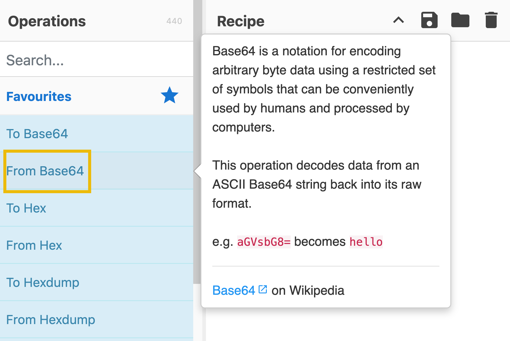
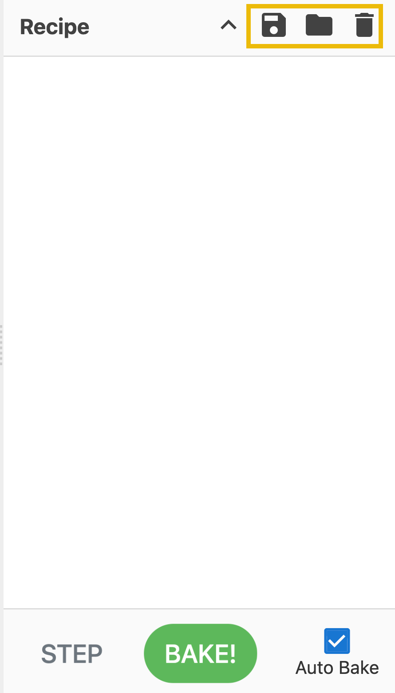
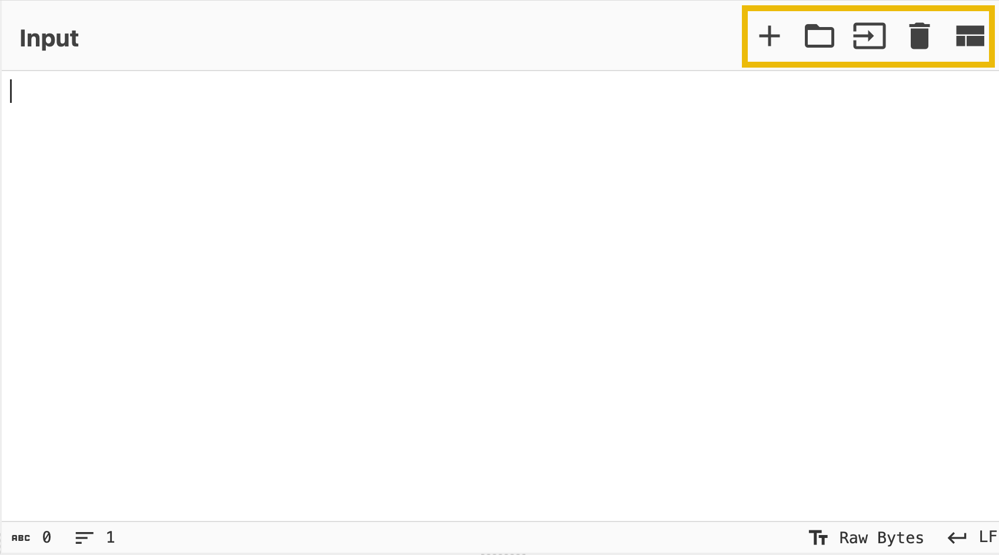
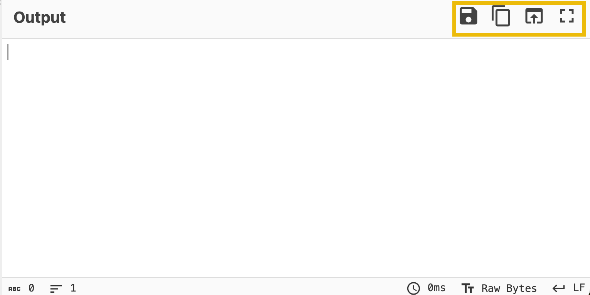

# CyberChef: The Basics

- [Room information](#room-information)
- [Solution](#solution)
- [References](#references)

## Room information

```text
Type: Walkthrough
Difficulty: Easy
OS: N/A
Subscription type: Free
Description: This room is an introduction to CyberChef, the Swiss Army knife for cyber security professionals.
```

Room link: [https://tryhackme.com/room/cyberchefbasics](https://tryhackme.com/room/cyberchefbasics)

## Solution

### Task 1 - Introduction

CyberChef is a simple, intuitive web-based application designed to help with various “cyber” operation tasks within your web browser. Think of it as a **Swiss Army knife** for data - like having a toolbox of different tools designed to do a specific task. These tasks range from simple encodings like **XOR** or **Base64** to complex operations like **AES encryption** or **RSA decryption**. CyberChef operates on **recipes**, a series of operations executed in order.

#### Learning Objectives

- Learn what CyberChef is
- Learn how to navigate the interface
- Understand common operations
- Learn how to create recipes and process the data

#### Room Prerequisites

Familiarity with the following rooms is recommended but is not mandatory before starting this room.

- Hashing Basics
- Cryptography Basics

### Task 2 - Accessing the Tool

There are different ways to access and run CyberChef. Let's check the two most convenient methods!

#### Online Access

All you need is a web browser and an internet connection. Then, you can click [this link](https://gchq.github.io/CyberChef) to open CyberChef directly within your web browser.

#### Offline or Local Copy

You can run this offline or locally on your machine by downloading the latest release file from [this link](https://github.com/gchq/CyberChef/releases). This will work on both Windows and Linux platforms. As best practice, you should download the most stable version.

### Task 3 - Navigating the Interface

CyberChef consists of four areas. Each consists of different components or features.

These are the following areas:

1. Operations
2. Recipe
3. Input
4. Output


Let's discuss each of these areas below.

#### The Operations Area

This is a practical and comprehensive repository of all the diverse operations that CyberChef is equipped to perform. These operations are meticulously categorized, offering users convenient access to various capabilities. Users can utilize the search feature to locate specific operations quickly, enhancing their efficiency and productivity.

Below are some operations you might use throughout your cyber security journey.

| Operations | Description | Examples |
|----|----|----|
|From Morse Code|Translates Morse Code into (upper case) alphanumeric characters.|`- .... .-. . .- - ...` becomes `THREATS` when used with default parameters|
|URL Encode|Encodes problematic characters into percent-encoding, a format supported by URIs/URLs.|`https://tryhackme.com/r/room/cyberchefbasics` becomes `https%3A%2F%2Ftryhackme%2Ecom%2Fr%2Froom%2Fcyberchefbasics` when used with the parameter “Encode all special chars”|
|To Base64|This operation encodes raw data into an ASCII Base64 string.|`This is fun!` becomes `VGhpcyBpcyBmdW4h`|
|To Hex|Converts the input string to hexadecimal bytes separated by the specified delimiter.|`This Hex conversion is awesome!` becomes `54 68 69 73 20 48 65 78 20 63 6f 6e 76 65 72 73 69 6f 6e 20 69 73 20 61 77 65 73 6f 6d 65 21`|
|To Decimal|Converts the input data to an ordinal integer array.|`This Decimal conversion is awesome!` becomes `84 104 105 115 32 68 101 99 105 109 97 108 32 99 111 110 118 101 114 115 105 111 110 32 105 115 32 97 119 101 115 111 109 101 33`|
|ROT13|A simple Caesar substitution cipher which rotates alphabet characters by the specified amount (default 13).|`Digital Forensics and Incident Response` becomes `Qvtvgny Sberafvpf naq Vapvqrag Erfcbafr`|

Alternatively, you can directly check how the operations work by hovering on the specific operation. This should give you a sample or a description and a link to Wikipedia.



#### The Recipe Area

This is considered as the heart of the tool. In this area, you can seamlessly select, arrange, and fine-tune operations to suit your needs. This is where you take control, defining each operation's arguments and options precisely and purposefully. The recipe area is a designated space to select and arrange specific operations and then define their respective arguments and options to customize their behaviour further. In the recipe area, you can drag the operations you want to use and specify arguments and options.

Features include the following:

- **Save recipe**: This feature allows the user to save selected operations.
- **Load recipe**: Allows the user to load previously saved recipes.
- **Clear Recipe**: This feature will enable users to clear the chosen recipe during usage.

These can be found in the highlighted icons below:



The bottom part of the image above is the `BAKE!` button. This processes the data with the given recipe.

Additionally, you can tick the `Auto Bake` checkbox. This feature allows users to automatically cook using the selected recipe without manually clicking `BAKE!` every time.

#### Input Area

The input area provides a user-friendly space where you can easily input text or files by pasting, typing, or dragging them to perform operations.



Additionally, it has the following features:

- **Add a new input tab**: This is where an additional tab is created for the user to use different values from the previous tab.
- **Open folder as input**: This feature allows users to upload a whole folder as input value.
- **Open file as input**: This feature allows the user to upload a file as its input value.
- **Clear input and output**: This feature allows the user to clear any input values inserted and the corresponding output value.
- **Reset pane layout**: This feature brings the tool's interface to its default window sizes.

#### Output Area

The output area is a visual space that showcases the data processing results. It neatly presents the outcomes of any manipulations or transformations you have applied to the input data, allowing for a clear and intuitive display of the processed information.



Features include:

- **Save output to file**: This feature allows the users to save the result into a .dat file.
- **Copy raw output to the clipboard**: This feature allows users to copy raw output directly to their clipboard, allowing them to quickly copy the results for use in other applications or documents.
- **Replace input with output**: This feature allows users to quickly overwrite the input data based on the operations' results.
- **Maximise output pane**: This feature maximises the output pane to maximum size.

#### In which area can you find "From Base64"?

Answer: Operations

#### Which area is considered the heart of the tool?

Answer: Recipe

### Task 4 - Before Anything Else

Hold your horses!

Before even going to the actual thing, let's have a quick overview of the thought process when using CyberChef! This process consists of four different steps:


Let's discuss each step further.

Setting a clear objective is essential. This step involves defining specific and achievable goals. It helps answer the question, "**What do I want to accomplish?**". Objectives are vital in providing direction, purpose, and focus to your goals. One example would be, "During a security investigation, I found a gibberish string; I want to know what hidden message it contains if it has one."

Next, put your data into the input area. In this step, you use your data. This is where you paste or upload the gibberish string that you found.

The third step is to select the **Operations** you want to use. This can be tricky if you are not familiar yet with what you are dealing with. Following our example, we are still determining what to use to understand this gibberish string. During our research, we found relevant information that this gibberish string might be using anything related to encryption. Therefore, we decided to use any operations under the **Encryption/Encoding** category, including but not limited to `ROT13`, `Base64`, `Base85`, or `ROT47`. Note that we can use a lot of operations under this category.

Lastly, check the output to see if it is the intended result. This begs the question, "**Have we achieved our objective?**". In our example, it would mean, were we able to decode the gibberish string we found? If yes, then that's it! If not, we may need to repeat the steps that we have taken.

#### At which step would you determine, "What do I want to accomplish?

Answer: 1

### Task 5 - Practice, Practice, Practice

We want you to be as prepared as possible. Therefore, we will explore some of this task's most commonly used operation categories. Recognizing which category to utilize can enhance your ability to use the tool more efficiently and effectively.

#### Extractors

The specific operations mentioned in the table below fall under the `Extractors` category.

| Specific | Description |
|----|----|
|Extract IP addresses|Extracts all IPv4 and IPv6 addresses.|
|Extract URLs|Extracts Uniform Resource Locators (URLs) from the input. The protocol (HTTP, FTP, etc.) is required, otherwise there will be far too many false positives.|
|Extract email addresses|Extracts all email addresses from the input.|

The `Extract IP addresses` will extract any valid IPv4/6 address from any given input. We recommend checking our existing room for a quick recap of networking: Networking Concepts

The `Extract email addresses` extracts any strings and characters with this format, anything@domain[.]com. Examples of domains include hotmail.com, google.com, tryhackme.com, and yahoo.com

`Extract URLs` extracts Uniform Resource Locator, commonly known as URL. , a URL is the address used to access resources on the internet. You can check the Web Applications Basics room if you would like to dig deeper into URLs and web applications.

#### Date and Time

The specific operations in the table below fall under the Date / Time category.

| Specific | Description |
|----|----|
|From UNIX Timestamp|Converts a UNIX timestamp to a datetime string.|
|To UNIX Timestamp|Parses a datetime string in UTC and returns the corresponding UNIX timestamp.|

A UNIX timestamp is a 32-bit value representing the number of seconds since January 1, 1970 UTC (the UNIX epoch). To convert "**Fri Sep 6 20:30:22 +04 2024**" into a UNIX Timestamp, use the operations `To UNIX Timestamp`, where the result would be `1725654622`. If you wish to convert it back to a more readable format, you can use `From UNIX Timestamp`.

#### Data Format

The specific operations in the table below fall under the Data format category.

| Operations | Description | Examples |
|----|----|----|
|From Base64|This operation decodes data from an ASCII Base64 string back into its raw format.|`V2VsY29tZSB0byB0cnloYWNrbWUh` becomes `Welcome to tryhackme!`|
|URL Decode|Converts URI/URL percent-encoded characters back to their raw values.|`https%3A%2F%2Fgchq%2Egithub%2Eio%2FCyberChef%2F` becomes `https://gchq.github.io/CyberChef/`|
|From Base85|notation for encoding arbitrary byte data. It is usually more efficient than Base64. This operation decodes data from an ASCII string (with an alphabet of your choosing, presets included).|`BOu!rD]j7BEbo7` becomes `hello world`|
|From Base58|is a notation for encoding arbitrary byte data. It differs from Base64 by removing efficiently misread characters (i.e. l, I, 0, and O) to improve human readability.|`AXLU7qR` becomes `Thm58`|
|To Base62|is a notation for encoding arbitrary byte data using a restricted set of symbols that humans can conveniently use and process by computers. The high number base results in shorter strings than with the decimal or hexadecimal system|`Thm62` becomes `6NiRkOY`|

Operations such as `Base(64, 85, 58, 62)` are known as **base encodings**. Base encoding takes binary data (strings of 0s and 1s) and transforms it into a text-based representation using a specific set of ASCII (American Standard Code for Information Interchange) characters.

#### Practical Exercise

Click on the **Download Task Files** button at the top of this task to download the file that we will use to answer the questions below.

Once downloaded, you can open the file, copy and paste the content into the input field, or use the `Open file as input` feature to upload the file.

Note: Use the specific operations under the Extractors category for the first two questions. It's best to try to answer the questions first without using the hints.

#### What is the hidden email address?

Hint: Use the operation "Extract email addresses".

Answer: `hidden@hotmail.com`

#### What is the hidden IP address that ends in .232?

Hint: Use the operation "Extract IP addresses".

Answer: 102.20.11.232

#### Which domain address starts with the letter "T"?

Hint: Use the operation "Extract domains".

Answer: TryHackMe.com

#### What is the binary value of the decimal number 78?

Hint: Combine the operations "From Decimal" and "To Binary".

Answer: 01001110

#### What is the URL encoded value of https://tryhackme.com/r/careers?

Hint: Use the "URL Encode" operation with the "Encode all special chars" checkbox enabled.

Answer: https%3A%2F%2Ftryhackme%2Ecom%2Fr%2Fcareers

### Task 6 -  Your First Official Cook

This task allows us to apply what we've learned from the previous tasks. We'll utilize CyberChef's areas and its features to answer the questions being asked.

Now, this is the time that you truly shine! You are going for your first cook ever!

Ready? Let's get our hands dirty, then!

Note: It's best to try to answer the questions first without using the hints.

#### Using the file you downloaded in Task 5, which IP starts and ends with "10"?

Hint: Use the operation "Extract IP addresses" and check the "IPv4" checkbox.

Answer: 10.10.2.10

#### What is the base64 encoded value of the string "Nice Room!"?

Hint: Use the operation "To Base64".

Answer: TmljZSBSb29tIQ==

#### What is the URL decoded value for https%3A%2F%2Ftryhackme%2Ecom%2Fr%2Froom%2Fcyberchefbasics?

Hint: Use the operation "URL Decode".

Answer: `https://tryhackme.com/r/room/cyberchefbasics`

#### What is the datetime string for the Unix timestamp 1725151258?

Hint: Use the operation "From UNIX Timestamp" with default parameters.

Answer: Sun 1 September 2024 00:40:58 UTC

#### What is the Base85 decoded string of the value <+oue+DGm>Ap%u7?

Hint: Use the operation "From Base85" with default parameters.

Answer: This is fun!

### Task 7 -  Conclusion

In this room, we discussed how CyberChef is a powerful tool for handling various data transformations and decoding tasks. Whether you need to work with Base64, Binary, or URLs, this digital wizard's kitchen provides a visual interface that makes data manipulation intuitive and straightforward. With a diverse recipe library, you can confidently tackle tasks ranging from extracting email addresses, IP addresses, and domains. We were able to navigate its interface and have a high-level discussion of the different areas, features, and parameters. However, note that for particularly large-scale processing, it's vital to benefit from support from other tools.

For additional information, please see the references below.

## References

- [CyberChef - GitHub](https://github.com/gchq/CyberChef)
- [CyberChef - Homepage](https://gchq.github.io/CyberChef/)
