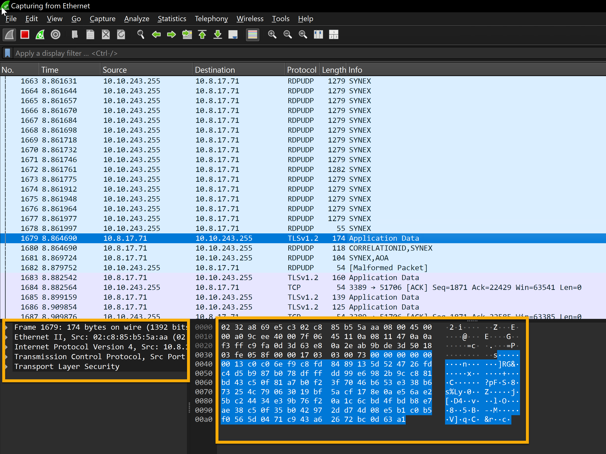
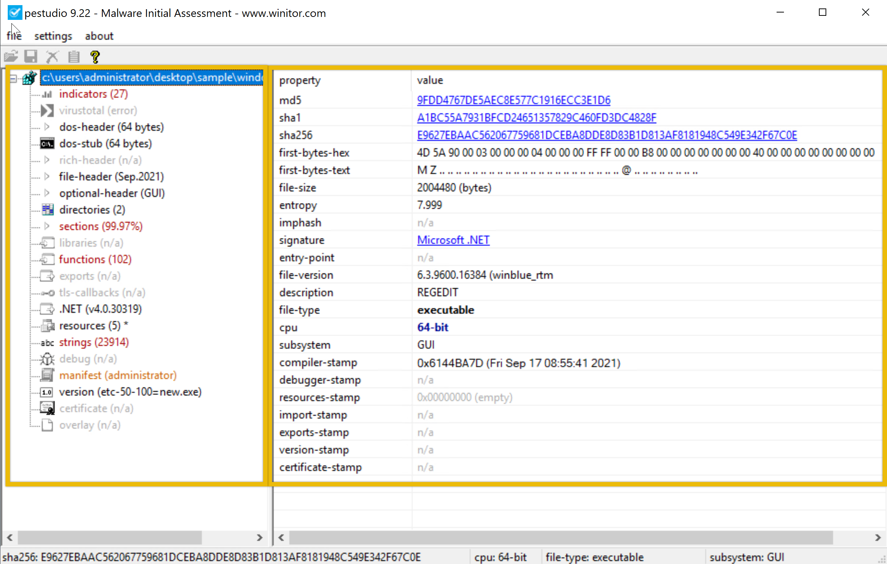
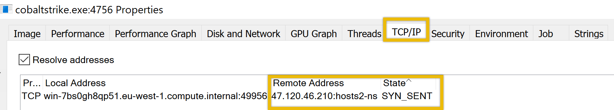

# FlareVM: Arsenal of Tools

- [Room information](#room-information)
- [Solution](#solution)
- [References](#references)

## Room information

```text
Type: Walkthrough
Difficulty: Easy
OS: N/A
Subscription type: Premium
Description: Learn the arsenal of investigative tools in FlareVM.
```

Room link: [https://tryhackme.com/room/flarevmarsenaloftools](https://tryhackme.com/room/flarevmarsenaloftools)

## Solution

### Task 1 - Introduction

**FlareVM**, or "**Forensics, Logic Analysis, and Reverse Engineering**", stands out as a comprehensive and carefully curated collection of specialized tools uniquely designed to meet the specific needs of reverse engineers, malware analysts, incident responders, forensic investigators, and penetration testers. This toolkit, expertly crafted by the FLARE Team at FireEye, is a powerful aid in unravelling digital mysteries, gaining insight into malware behaviour, and delving into the complex details within executables.

#### Learning Objectives

- Explore tools inside the FlareVM.
- Learn how to use tools to analyze potentially malicious processes effectively.
- Be familiar with the tools used for static analysis of malicious documents and binaries.

#### Room Prerequisites

This room expects that you are familiar with various technical terms related to Windows and processes. If you are unfamiliar with these terms, please consider joining the Pre Security path.

#### VM Access

Getting your hands on this tool can be pretty daunting at first, as building it starting from scratch takes a lot of time, and the installation will take several hours! Thankfully, we have already included this machine in this room.

Click on the **Start Machine** button. This should initialize an instance on FlareVM.

We will use the tool inside the machine attached to this task. The machine will start in a split-screen view. If you opt to access the machine via Remote Desktop (RDP), you may also use the following credentials below.

- Username: Administrator
- Password: letmein123!
- IP Address: 10.10.70.226

Almost all the files we will use in this room are located in the `C:\Users\Administrator\Desktop\Sample` folder.

Disclaimer: The FlareVM machine attached to this room contains malicious sample files as part of the practical exercises and has no internet access. These files should not be downloaded, executed (outside the FlareVM machine), or distributed under any circumstances. Doing so could potentially harm your system or network. Always handle such files only in isolated, controlled, and secure environments.

### Task 2 - Arsenal of Tools

In this task, we'll introduce you to tools inside the FlareVM. It has many specialized forensics, incident response, and malware investigation tools.

Below are the tools grouped by their category.

#### Reverse Engineering & Debugging

Reverse engineering is like solving a puzzle backward: you take a finished product apart to understand how it works. Debugging is identifying errors, understanding why they happen, and correcting the code to prevent them.

- **Ghidra** - NSA-developed open-source reverse engineering suite.
- **x64dbg** - Open-source debugger for binaries in x64 and x32 formats.
- **OllyDbg** - Debugger for reverse engineering at the assembly level.
- **Radare2** - A sophisticated open-source platform for reverse engineering.
- **Binary Ninja** - A tool for disassembling and decompiling binaries.
- **PEiD** - Packer, cryptor, and compiler detection tool.

#### Disassemblers & Decompilers

Disassemblers and Decompilers are crucial tools in malware analysis. They help analysts understand malicious software’s behaviour, logic, and control flow by breaking it into a more understandable format. The tools mentioned below are commonly used in this category.

- **CFF Explorer** - A PE editor designed to analyze and edit Portable Executable (PE) files.
- **Hopper Disassembler** - A Debugger, disassembler, and decompiler.
- **RetDec** - Open-source decompiler for machine code.

#### Static & Dynamic Analysis

Static and dynamic analysis are two crucial methods in cyber security for examining malware. Static analysis involves inspecting the code without executing it, while dynamic analysis involves observing its behaviour as it runs. The tools mentioned below are commonly used in this category.

- **Process Hacker** - Sophisticated memory editor and process watcher.
- **PEview** - A portable executable (PE) file viewer for analysis.
- **Dependency Walker** - A tool for displaying an executable’s DLL dependencies.
- **DIE (Detect It Easy)** - A packer, compiler, and cryptor detection tool.

#### Forensics & Incident Response

Digital Forensics involves the collection, analysis, and preservation of digital evidence from various sources like computers, networks, and storage devices. At the same time, Incident Response focuses on the detection, containment, eradication, and recovery from cyberattacks. The tools mentioned below are commonly used in this category.

- **Volatility** - RAM dump analysis framework for memory forensics.
- **Rekall** - Framework for memory forensics in incident response.
- **FTK Imager** - Disc image acquisition and analysis tools for forensic use.

#### Network Analysis

Network Analysis includes different methods and techniques for studying and analysing networks to uncover patterns, optimize performance, and understand the underlying structure and behaviour of the network.

- **Wireshark** - Network protocol analyzer for traffic recording and examination.
- **Nmap** - A vulnerability detection and network mapping tool.
- **Netcat** - Read and write data across network connections with this helpful tool.

#### File Analysis

File Analysis is a technique used to examine files for potential security threats and ensure proper file permissions.

- **FileInsight** - A program for looking through and editing binary files.
- **Hex Fiend** - Hex editor that is light and quick.
- **HxD** - Binary file viewing and editing with a hex editor.

#### Scripting & Automation

Scripting and Automation involve using scripts such as PowerShell and Python to automate repetitive tasks and processes, making them more efficient and less prone to human error.

- **Python** - Mainly automation-focused on Python modules and tools.
- **PowerShell Empire** - Framework for PowerShell post-exploitation.

#### Sysinternals Suite

The Sysinternals Suite is a collection of advanced system utilities designed to help IT professionals and developers manage, troubleshoot, and diagnose Windows systems.

- **Autoruns** - Shows what executables are configured to run during system boot-up.
- **Process Explorer** - Provides information about running processes.
- **Process Monitor** - Monitors and logs real-time process/thread activity.

Have you checked all the categories? There are a lot, right? Worry not, as we won't tackle all those tools right now—it could take months to finish! We want to present you with the concept of having a single box filled with tools for different purposes, giving you an idea of what could work best for the specific task.

In the next task, we will discuss the standard tools used for investigation

#### Which tool is an Open-source debugger for binaries in x64 and x32 formats?

Answer: x64dbg

#### What tool is designed to analyze and edit Portable Executable (PE) files?

Answer: CFF Explorer

#### WWhich tool is considered a sophisticated memory editor and process watcher?

Answer: Process Hacker

#### Which tool is used for Disc image acquisition and analysis for forensic use?

Answer: FTK Imager

#### What tool can be used to view and edit a binary file?

Answer: HxD

### Task 3 - Commonly Used Tools for Investigation: Overview

Let's examine the tools we will focus on in this room. These tools are the basic ones used for initial investigations. See the list below.

| Tool | Investigative Value |
|----|----|
|Procmon|A helpful tool for tracking system activity, especially regarding malware research, troubleshooting, and forensic investigations.|
|Process Explorer|Allows you to see the Process of the Parent-child relationship, DLLs loaded, and its path.|
|HxD|Malicious files can be examined or altered via hex editing.|
|Wireshark|Observing and investigating network traffic to look for unusual activity.|
|CFF Explorer|Can generate file hashes for integrity verification, authenticate the source of system files, and validate their validity.|
|PEStudio|Static analysis or studying executable file properties without running the files.|
|FLOSS|Extracts and de-obfuscates all strings from malware programs using advanced static analysis techniques.|

You can follow along and open the tools and files on the FlareVM while we discuss the overview of some of these tools.

#### Process Monitor (Procmon)

A powerful Windows tool designed to help you record issues with your system's apps. It lets you **see, record, and keep track of system and Windows file activity in real-time**. Process Monitor is helpful for **tracking system activity, especially regarding malware research, troubleshooting, and forensic investigations**. It keeps real-time tabs on the file system, registry, and thread/process activity.

Here's how to utilize it effectively for investigation.


According to this log entry, the Local Security Authority Subsystem Service (LSASS) - related process lsass.exe has successfully read a file. LSASS handles authentication and frequently communicates with crucial system files such as lsasrv.dll (Local Security Authority Server Service).

Although this is a standard system process, LSASS may be the target of credential dumping attacks if you are examining logs for indications of malicious activity. Mimikatz and other tools frequently try to access LSASS memory. In these situations, you should watch for any additional suspicious activity related to LSASS, such as odd access patterns or processes reading or writing to lsass.exe.

Don’t worry—the sample above does not show any malware signs!

#### Process Explorer (Procexp)

Process Explorer offers in-depth insights into the active processes running on your computer. It allows you to delve into the inner workings of your system, providing a comprehensive list of currently running processes and their linked user accounts. If you've ever been curious about which program is accessing a specific file or folder, Process Explorer can provide us with that information.

#### HxD

HxD is a quick and flexible hex editor for editing files, memory, and drives of any capacity. It can be applied to forensic investigation, data recovery, debugging, and exact manipulation of binary data. Important features include viewing file and memory contents, editing, searching, and comparing hex data. Let's look at how the tool works.


This HxD hex editor snapshot shows the binary file **possible_medusa.txt**. The hex data on the left indicates the file's contents in hexadecimal, and the ASCII interpretation appears on the right. Interestingly, the file starts with **4D 5A (Little Endian)**, indicating it is executable.

The **Data Inspector** on the right allows you to examine individual bytes by displaying their values in many data types (e.g., integer, float), facilitating a more straightforward data evaluation.

By permitting in-depth examination of a file's unprocessed hexadecimal data, HxD facilitates inquiry by identifying file kinds, structures, and possible corruption. Its Data Inspector feature helps by offering insights into particular byte values.

#### CFF Explorer

With the help of CFF Explorer's comprehensive file information, investigators can generate file hashes for integrity verification, authenticate the source of system files, and validate their validity (e.g., by looking for unusual alterations). This is important to know when analyzing malware since dangerous code may be hidden in altered system files.


The **cryptominer.bin** file's details are displayed in the sample. On September 23, 2024, a 64-bit Portable Executable file was generated. The file's information can be verified by its hashes (SHA-1 and MD5). During investigations, this tool aids in confirming file information lookup and locating possible problems.

#### Wireshark

Regarding network traffic analysis, Wireshark is a powerful tool that investigators may use to hunt down dubious connections, examine protocols, and spot possible assaults or data exfiltration. In this case, TLSv1.2 suggests a secure, encrypted connection that can mask harmful activity or safeguard legitimate traffic.



This Shows captured packets with details about the protocol, source, destination, and other information. Most packets show that TLSv1.2 and TCP are being used for encrypted transmission. The raw packet data is shown in ASCII and hexadecimal forms, with a significant chunk encrypted using TLSv1.2.

You can check our Wireshark module [here](https://tryhackme.com/module/wireshark) if you would like to dig deeper into this tool.

#### PEStudio

Static analysis, or studying executable file properties without running the files, is done with PEstudio. This feature is beneficial in several situations. PEstudio offers a variety of information about a file without putting users in danger of execution, which aids in identifying executables that seem suspect or harmful.

So, how does it work? Let's look at the image below.


This example shows the examination of an executable file, **PSexec.exe** (not in the VM; this is a pure example only), using PEstudio 9.22, a static malware analysis tool. The file has a dual purpose—legitimate for system administrators but potentially exploited by hackers for remote access.

The file's **entropy value of 6.596** indicates a remote chance of packing or encryption, which is typical of dangerous software. **Version 2.34** of this 32-bit console-based application allows it to run programs remotely, a feature frequently used to migrate laterally during attacks. The file is assembled using **Visual C++ 8**.

The dual-use nature of PsExec, typically legitimate but suspicious in compromised environments, combined with low to medium indicators and moderately high entropy, makes its presence on a system concerning, especially if remote code execution is not expected. Its use in post-exploitation phases warrants further investigation to determine if it’s being misused maliciously.

#### FLOSS

Using advanced static analysis techniques, the FLARE Obfuscated String Solver (FLOSS, formerly FireEye Labs Obfuscated String Solver) automatically extracts and de-obfuscates all strings from malware programs. Like strings.exe, it can enhance the basic static analysis of unknown binaries. FLOSS also includes more Python scripts in the script's directory, which can be used to load the script's output into other programs like IDA Pro or Binary Ninja.

```bash
PS C:\Users\Administrator\Desktop\Sample > floss .\cobaltstrike.exe
INFO: floss: extracting static strings
finding decoding function features: 100%|█████████████████████████████████████████████| 74/74 [00:00<00:00, 2370.15 functions/s, skipped 0 library functions]
INFO: floss.stackstrings: extracting stackstrings from 50 functions
extracting stackstrings: 100%|██████████████████████████████████████████████████████████████████████████████████████| 50/50 [00:00<00:00, 128.00 functions/s]
INFO: floss.tightstrings: extracting tightstrings from 4 functions...
extracting tightstrings from function 0x402e80: 100%|██████████████████████████████████████████████████████████████████| 4/4 [00:00<00:00, 31.99 functions/s]
INFO: floss.string_decoder: decoding strings
emulating function 0x402e80 (call 1/1): 100%|████████████████████████████████████████████████████████████████████████| 21/21 [00:09<00:00,  2.21 functions/s]
INFO: floss: finished execution after 265.61 seconds
INFO: floss: rendering results 
FLARE FLOSS RESULTS (version v3.1.0-0-gdb9af41)

+------------------------+------------------------------------------------------------------------------------+
| file path              | cobaltstrike.exe                                                                   |
| identified language    | unknown                                                                            |
| extracted strings      |                                                                                    |
|  static strings        | 189 (2050 characters)                                                              |
|   language strings     |   0 (   0 characters)                                                              |
|  stack strings         | 0                                                                                  |
|  tight strings         | 0                                                                                  |
|  decoded strings       | 0                                                                                  |
+------------------------+------------------------------------------------------------------------------------+


 ────────────────────────────
  FLOSS STATIC STRINGS (189)
 ────────────────────────────

+-----------------------------------+
| FLOSS STATIC STRINGS: ASCII (188) |
+-----------------------------------+

!This program cannot be run in DOS mode.
.text
P`.data
.rdata
P@.pdata
0@.xdata
0@.bss
<----snip--->
vfprintf
KERNEL32.dll
msvcrt.dll


+------------------------------------+
| FLOSS STATIC STRINGS: UTF-16LE (1) |
+------------------------------------+

msvcrt.dll


 ─────────────────────────
  FLOSS STACK STRINGS (0)
 ─────────────────────────


 ─────────────────────────
  FLOSS TIGHT STRINGS (0)
 ─────────────────────────


 ───────────────────────────
  FLOSS DECODED STRINGS (0)
 ───────────────────────────
```

In the example above, FLOSS extracted **189 static strings** from the binary, which may contain hardcoded information such as **file paths**, **URLs** (likely for command-and-control servers), **IP addresses**, **API calls**, **error messages**, **registry**, **encryption keys**, and **configuration data**. However, no decoded strings were identified, suggesting that FLOSS did not detect or decode dynamically generated or obfuscated strings during this analysis. Malware frequently uses obfuscated strings to conceal its malicious behavior.

#### Which tool was formerly known as FLARE Obfuscated String Solver?

Answer: FLOSS

#### Which tool offers in-depth insights into the active processes running on your computer?

Answer: Process Explorer

#### By using the Process Explorer (procexp) tool, under what process can we find smss.exe?

Answer: System

#### Which powerful Windows tool is designed to help you record issues with your system's apps?

Answer: Procmon

#### Which tool can be used for Static analysis or studying executable file properties without running the files?

Answer: PEStudio

#### Using the tool PEStudio to open the file cryptominer.bin in the Desktop\Sample folder, what is the sha256 value of the file?

Answer: E9627EBAAC562067759681DCEBA8DDE8D83B1D813AF8181948C549E342F67C0E

#### Using the tool PEStudio to open the file cryptominer.bin in the Desktop\Sample folder, how many functions does it have?

Answer: 102

#### What tool can generate file hashes for integrity verification, authenticate the source of system files, and validate their validity?

Answer: CFF Explorer

#### Using the tool CFF Explorer to open the file possible_medusa.txt in the Desktop\Sample folder, what is the MD5 of the file?

Answer: 646698572AFBBF24F50EC5681FEB2DB7

#### Use the CFF Explorer tool to open the file possible_medusa.txt in the Desktop\Sample folder. Then, go to the DOS Header Section. What is the e_magic value of the file?

Answer: 5A4D

### Task 4 - Analyzing Malicious Files

In this task, we'll get our hands dirty. Let's dive right in!

Using the tools from our Flare virtual machine, we will analyze different executables, run them, and see what it does on a specific machine!

A suspicious **windows.exe** file was downloaded by a user on 09/24/2024 at 3:43 AM. This download was flagged as a potential threat. The monitoring team has sent you an email requesting to perform an analysis of it. They have sent you the file, which is now in the `C:\Users\Administrator\Desktop\Sample` folder.

Our initial approach for this investigation is to perform static analysis to get initial information from the binary.

#### Analysis using PEStudio

Let's start with PEStudio. Open the file with this tool. What information can we use here?



For the computed MD5 `9FDD4767DE5AEC8E577C1916ECC3E1D6` and SHA-1 `A1BC55A7931BFCD24651357829C460FD3DC4828F` hashes, comparisons with established databases like [VirusTotal](https://www.virustotal.com/gui/) are recommended. If there are no known detections, there's a greater chance that it's a fresh or undiscovered malware campaign.

Although the file claims to be connected to the Windows Registry Editor (REGEDIT), which you can see based on the **description**, this is likely an attempt to trick people and evade discovery.

Legitimate REGEDIT tools are usually found in the **C:\Windows\System32** directory rather than the user's download location.

`Редактор реестра` ("Registry Editor"), `Операционная система Microsoft® Windows®` in the file’s metadata is suspicious, primarily if the user or the organization does not operate in a Russian-speaking environment. This could potentially have profound implications for our organization.

The absence of a **rich header** indicates that the file is potentially packed or obfuscated to avoid detection by static analysis tools. This is typical behaviour of sophisticated malware that tries to evade detection by altering critical sections of its PE file.

The **function** tabs list **API calls** that the file has imported. This is also known as the IAT (Import Address Table). By clicking on the blacklist tab, PeStudio will sort the API by moving all the blacklisted functions to the top. This is useful because it enables us to understand how malware may behave once it compromises a host. The image below shows what API has been imported.

Here are the important functions that we noted.

`set_UseShellExecute`: This function allows the process to use the operating system's shell to execute other processes. This is often seen in malware that spawns additional processes to carry out malicious actions.

`CryptoStream`, `RijndaelManaged`, `CipherMode`, `CreateDecryptor`: These APIs indicate that the executable uses cryptographic functions, specifically Rijndael (AES encryption). Malware may use cryptography to encrypt communication and files or even implement ransomware functionality.

#### Analysis using FLOSS

Open PowerShell and go to the directory where our file is, which is `C:\Users\Administrator\Desktop\Sample`. Note that it might take a while before the PowerShell prompt appears. Run the command `FLOSS.exe .\windows.exe > windows.txt`. This will run the tool **floss.exe** and output it to a file named **windows.txt** in the same directory.

```powershell
PS C:\Users\Administrator\Desktop\Sample > FLOSS.exe .\windows.exe > windows.txt
WARNING: floss: .NET language-specific string extraction is not supported yet
WARNING: floss: FLOSS does NOT attempt to deobfuscate any strings from .NET binaries
INFO: floss: disabled string deobfuscation
INFO: floss: extracting static strings
INFO: floss: finished execution after 0.34 seconds
INFO: floss: rendering results
```

#### Analyze with Process Explorer and Process Monitor

In this example, we will analyze the network connectivity of the file **cobaltstrike.exe** located in `C:\Users\Administrator\Desktop\Sample`.

We will try to figure out if the file is making any network connectivity to any possible c2 server. Let's get started! Run the file **cobaltstrike.exe** and open **Process Explorer** on the desktop or from the taskbar. You can also search for it in the Windows search bar. If you manually click the binary **Explorer.exe** would be the parent process, and cobaltstrike.exe would be the child process.

Let's focus on our goal to determine whether this process is making any network connectivity and to what destination. The **process ID is 4756**. Note that the Process ID might be different from your machine. Right-click on the process, select **Properties** and go to the **TCP/IP** tab. We should be able to determine the destination it connects to and the state it sends.



There we have it! On another note, when we are doing analysis, it needs to be verified and precise. Therefore, we won't be relying on a single tool. We will use another tool to determine if the information is correct. Stop the process and rerun it. This time, we will use **Procmon** or **Proces Monitor**. This is also located on the desktop or in the taskbar.

When we open Procmon, looking for the binary is challenging as it will list all active processes. What we are going to do is filter it. The image below points to the filter icon. Or you can press **CRTL + L**.


Now, using this filter involves several steps. This includes:

1. Select the Process Name
2. Select contains
3. type any value containing any word related to the process. In this case, cobalt
4. Click include
5. And then Add and Click on Apply
6. You should be able to see the conditions added.


This should give us a more detailed result.


This confirms that the binary was indeed making a connection to an unknown IP address which is `47.120.46.210`.

#### Using PEStudio, open the file windows.exe. What is the entropy value of the file windows.exe?

Answer: 7.999

#### Using PEStudio, open the file windows.exe, then go to manifest (administrator section). What is the value under requestedExecutionLevel?

```text
<?xml version="1.0" encoding="utf-8"?>
<assembly manifestVersion="1.0" xmlns="urn:schemas-microsoft-com:asm.v1">
  <assemblyIdentity version="1.0.0.0" name="Program.app"/>
  <trustInfo xmlns="urn:schemas-microsoft-com:asm.v2">
    <security>
      <requestedPrivileges xmlns="urn:schemas-microsoft-com:asm.v3">
        <requestedExecutionLevel level="requireAdministrator" uiAccess="false" />
      </requestedPrivileges>
    </security>
  </trustInfo>
</assembly>
```

Answer: requireAdministrator

#### Which function allows the process to use the operating system's shell to execute other processes?

Answer: set_UseShellExecute

#### Which API starts with R and indicates that the executable uses cryptographic functions?

Answer: RijndaelManaged

#### What is the Imphash of cobaltstrike.exe?

Answer: 92EEF189FB188C541CBD83AC8BA4ACF5

#### What is the defanged IP address to which the process cobaltstrike.exe is connecting?

Hint: You need to provide the IP address in a defanged format, such as 192[.]168[.]3[.]77.

Answer: 47[.]120[.]46[.]210

#### What is the destination port number used by cobaltstrike.exe when connecting to its C2 IP Address?

Hint: Use the pcapng file in the sample folder and use the filter ip.addr == 47.120.46.210

Answer: 81

#### During our analysis, we found a process called cobaltstrike.exe. What is the parent process of cobaltstrike.exe?

Hint: This is the process when a user personally clicks a binary.

Answer: Explorer.exe

### Task 5 - Conclusion

In this room, we introduced the **FlareVM**, or "**Forensics, Logic Analysis, and Reverse Engineering**", a complete and customized environment designed for incident response, malware reverse engineering, and forensic analysis. We reviewed the installed tools and categorized them based on their purpose. We then discussed some standard tools widely used during an investigation, such as PEStudio, CFF Explorer, Process Monitor, and Process Explorer. Lastly, we acquired hands-on experience in analyzing malicious programs or files using these tools.

For additional information, please see the references below.

## References

- [FLARE-VM - A FLAREytale Open to the Public](https://cloud.google.com/blog/topics/threat-intelligence/flarevm-open-to-public)
- [FLARE-VM - GitHub](https://github.com/mandiant/flare-vm)
- [FLARE-VM - Setting Up](https://medium.com/@akanshp/flare-vm-the-windows-malware-analysis-distribution-setting-up-f65e4c046d1a)
