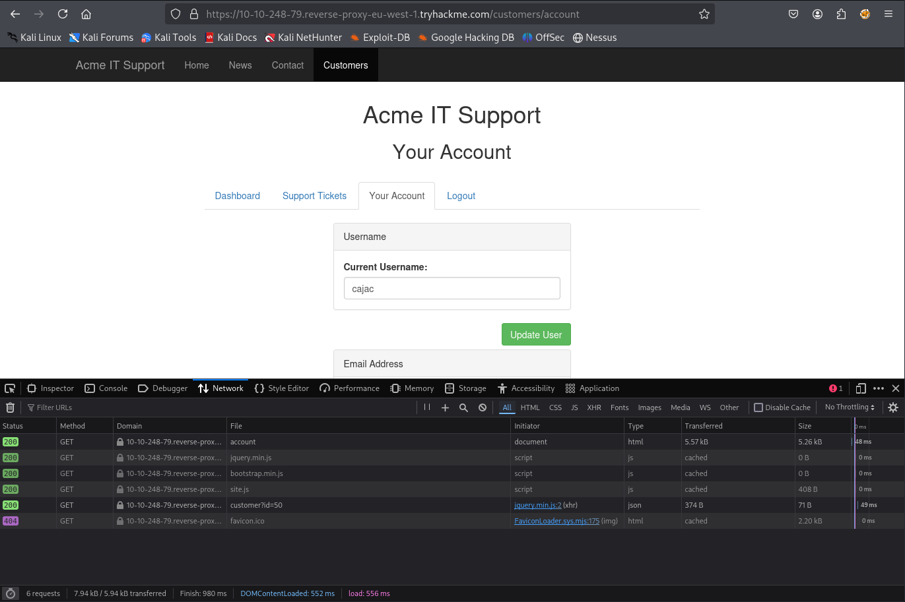
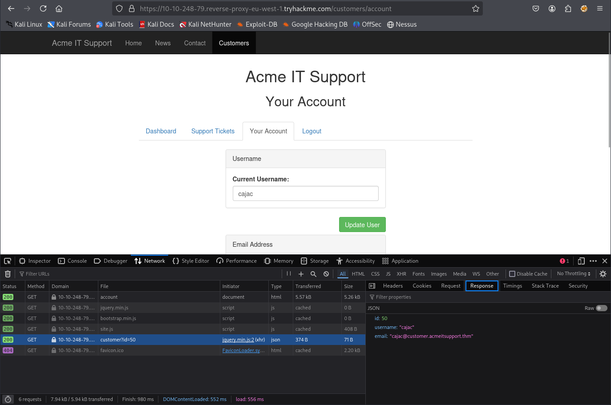
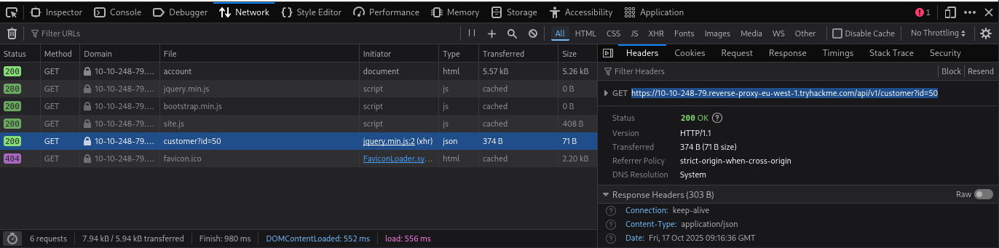

# IDOR

- [Room information](#room-information)
- [Solution](#solution)
- [References](#references)

## Room information

```text
Type: Walkthrough
Difficulty: Easy
OS: N/A
Subscription type: Premium
Description:
Learn how to find and exploit IDOR vulnerabilities in a web application giving you access to data 
that you shouldn't have.
```

Room link: [https://tryhackme.com/room/idor](https://tryhackme.com/room/idor)

## Solution

### Task 1: What is an IDOR?

In this room, you're going to learn what an IDOR vulnerability is, what they look like, how to find them and a practical task exploiting a real case scenario.

#### What is an IDOR?

IDOR stands for Insecure Direct Object Reference and is a type of access control vulnerability.

This type of vulnerability can occur when a web server receives user-supplied input to retrieve objects (files, data, documents), too much trust has been placed on the input data, and it is not validated on the server-side to confirm the requested object belongs to the user requesting it.

---------------------------------------------------------------------------------------

#### What does IDOR stand for?

Answer: `Insecure Direct Object Reference`

### Task 2: An IDOR Example

Imagine you've just signed up for an online service, and you want to change your profile information. The link you click on goes to `http://online-service.thm/profile?user_id=1305`, and you can see your information.

Curiosity gets the better of you, and you try changing the `user_id` value to `1000` instead (`http://online-service.thm/profile?user_id=1000`), and to your surprise, you can now see another user's information. You've now discovered an IDOR vulnerability! Ideally, there should be a check on the website to confirm that the user information belongs to the user logged requesting it.

Using what you've learnt above, click on the View Site button and try and receive a flag by discovering and exploiting an IDOR vulnerability.

---------------------------------------------------------------------------------------

#### What is the Flag from the IDOR example website?

Click on the `orders@onlinestore.thm` line.

And change the link `https://onlinestore.thm/order/1234/invoice` to `https://onlinestore.thm/order/1000/invoice`.  
Press Enter to load the web page.

Answer: `THM{<REDACTED>}`

### Task 3: Finding IDORs in Encoded IDs

#### Encoded IDs

When passing data from page to page either by post data, query strings, or cookies, web developers will often first take the raw data and encode it. Encoding ensures that the receiving web server will be able to understand the contents. Encoding changes binary data into an ASCII string commonly using the a-z, A-Z, 0-9 and = character for padding. The most common encoding technique on the web is **base64 encoding** and can usually be pretty easy to spot. You can use websites like `https://www.base64decode.org/` to decode the string, then edit the data and re-encode it again using `https://www.base64encode.org/` and then resubmit the web request to see if there is a change in the response.

See the image below as a graphical example of this process:


---------------------------------------------------------------------------------------

#### What is a common type of encoding used by websites?

Answer: `base64`

### Task 4: Finding IDORs in Hashed IDs

#### Hashed IDs

Hashed IDs are a little bit more complicated to deal with than encoded ones, but they may follow a predictable pattern, such as being the hashed version of the integer value. For example, the Id number 123 would become 202cb962ac59075b964b07152d234b70 if md5 hashing were in use.

It's worthwhile putting any discovered hashes through a web service such as [crackstation.net](https://crackstation.net/) (which has a database of billions of hash to value results) to see if we can find any matches.

---------------------------------------------------------------------------------------

#### What is a common algorithm used for hashing IDs?

Answer: `md5`

### Task 5: Finding IDORs in Unpredictable IDs

#### Unpredictable IDs

If the Id cannot be detected using the above methods, an excellent method of IDOR detection is to create two accounts and swap the Id numbers between them. If you can view the other users' content using their Id number while still being logged in with a different account (or not logged in at all), you've found a valid IDOR vulnerability.

---------------------------------------------------------------------------------------

#### What is the minimum number of accounts you need to create to check for IDORs between accounts?

Answer: `2`

### Task 6: Where are IDORs located

#### Where are they located?

The vulnerable endpoint you're targeting may not always be something you see in the address bar. It could be content your browser loads in via an AJAX request or something that you find referenced in a JavaScript file.

Sometimes endpoints could have an unreferenced parameter that may have been of some use during development and got pushed to production. For example, you may notice a call to **/user/details** displaying your user information (authenticated through your session). But through an attack known as parameter mining, you discover a parameter called **user_id** that you can use to display other users' information, for example, **/user/details?user_id=123**.

### Task 7: A Practical IDOR Example

Begin by pressing the **Start Machine** button; once started, click the below link and open it in a new browser tab:

`https://10-10-248-79.reverse-proxy-eu-west-1.tryhackme.com`

Firstly you'll need to log in. To do this, click on the customer's section and create an account. Once logged in, click on the Your Account tab.

The Your Account section gives you the ability to change your information such as username, email address and password. You'll notice the username and email fields pre-filled in with your information.  

We'll start by investigating how this information gets pre-filled. If you open your browser developer tools, select the network tab and then refresh the page, you'll see a call to an endpoint with the path **/api/v1/customer?id={user_id}**.

This page returns in JSON format your user id, username and email address. We can see from the path that the user information shown is taken from the query string's id parameter (see below image).


You can try testing this id parameter for an IDOR vulnerability by changing the id to another user's id. Try selecting users with IDs 1 and 3 and then answer the questions below.

---------------------------------------------------------------------------------------

#### What is the username for user id 1?

Signup for a new account at `https://10-10-248-79.reverse-proxy-eu-west-1.tryhackme.com/customers/signup`

Username: `cajac`
E-mail:   `cajac@customer.acmeitsupport.thm`
Password: `thm123auth`

Press `F12` to start DevTools and select the `Network` tab.  
Then click of the `Your Account` tab on the web page.



Note and select the `customer?id=XXX` request and see the response data.



Also note the URL on the `Headers` tab



The URL is `https://10-10-248-79.reverse-proxy-eu-west-1.tryhackme.com/api/v1/customer?id=50`

Change the id to 1 and access it in a new tab in the browser.

```text
id          1
username    "adam84"
email       "adam-84@fakemail.thm"
```

Answer: `adam84`

#### What is the email address for user id 3?

Access `https://10-10-248-79.reverse-proxy-eu-west-1.tryhackme.com/api/v1/customer?id=3`

```text
id          3
username    "john911"
email       "j@fakemail.thm"
```

Answer: `j@fakemail.thm`

For additional information, please see the references below.

## References

- [Base64 - Wikipedia](https://en.wikipedia.org/wiki/Base64)
- [Cryptographic hash function - Wikipedia](https://en.wikipedia.org/wiki/Cryptographic_hash_function)
- [DevTools - Chrome Docs](https://developer.chrome.com/docs/devtools/)
- [DevTools - Firefox User Docs](https://firefox-source-docs.mozilla.org/devtools-user/)
- [DevTools - MDN](https://developer.mozilla.org/en-US/docs/Learn_web_development/Howto/Tools_and_setup/What_are_browser_developer_tools)
- [Insecure direct object references (IDOR) - MDN](https://developer.mozilla.org/en-US/docs/Web/Security/Attacks/IDOR)
- [Insecure direct object references (IDOR) - PortSwigger](https://portswigger.net/web-security/access-control/idor)
- [MD5 - Wikipedia](https://en.wikipedia.org/wiki/MD5)
- [Testing for Insecure Direct Object References - OWASP](https://owasp.org/www-project-web-security-testing-guide/latest/4-Web_Application_Security_Testing/05-Authorization_Testing/04-Testing_for_Insecure_Direct_Object_References)
