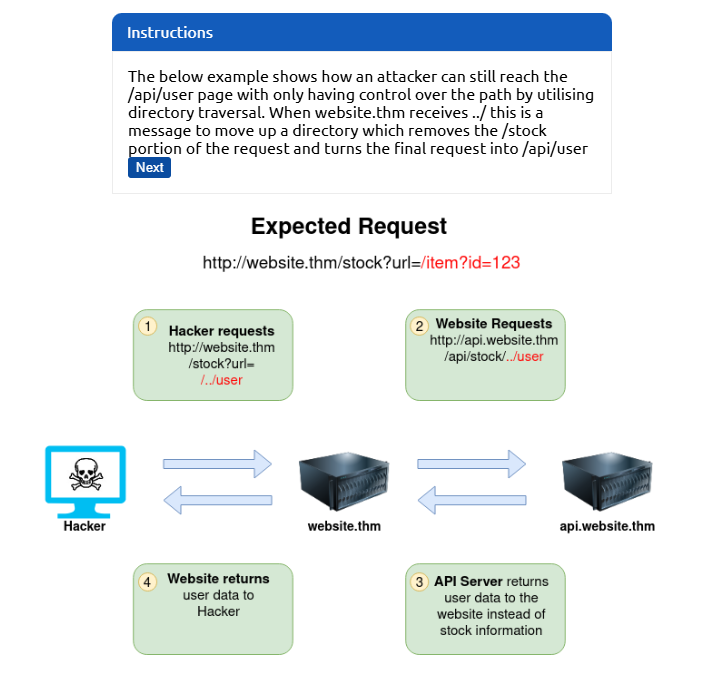
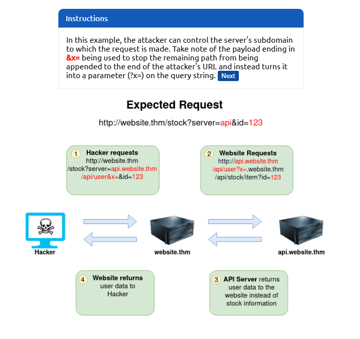
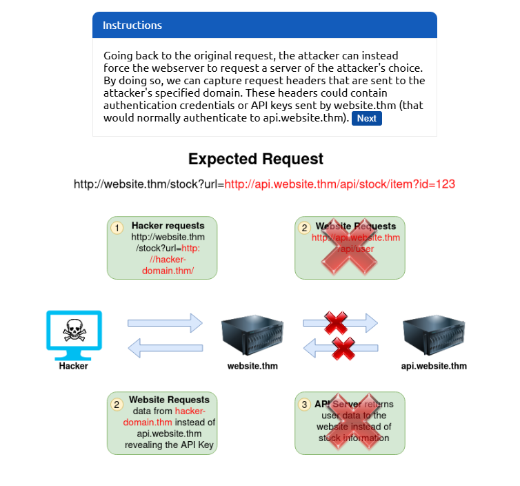
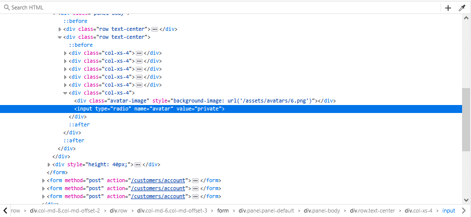

# Intro to SSRF

- [Room information](#room-information)
- [Solution](#solution)
- [References](#references)

## Room information

```text
Type: Walkthrough
Difficulty: Easy
Tags: Linux
Subscription type: Premium
Description:
Learn how to exploit Server-Side Request Forgery (SSRF) vulnerabilities, allowing you to access 
internal server resources.
```

Room link: [https://tryhackme.com/room/ssrfqi](https://tryhackme.com/room/ssrfqi)

## Solution

### Task 1: What is an SSRF?

#### Room Brief

In this room, you'll learn what an SSRF is, what kind of impact they can have, you'll view some example SSRF attacks, how you can discover SSRF vulnerabilities, how to circumvent input rules and then we have a practice for you against with to try your newfound skills.

#### What is an SSRF?

SSRF stands for Server-Side Request Forgery. It's a vulnerability that allows a malicious user to cause the webserver to make an additional or edited HTTP request to the resource of the attacker's choosing.

#### Types of SSRF

There are two types of SSRF vulnerability; the first is a regular SSRF where data is returned to the attacker's screen. The second is a Blind SSRF vulnerability where an SSRF occurs, but no information is returned to the attacker's screen.

#### What's the impact?

A successful SSRF attack can result in any of the following:

- Access to unauthorised areas.
- Access to customer/organisational data.
- Ability to Scale to internal networks.
- Reveal authentication tokens/credentials.

---------------------------------------------------------------------------------------

#### What does SSRF stand for?

Answer: `Server-Side Request Forgery`

#### As opposed to a regular SSRF, what is the other type?

Answer: `Blind`

### Task 2: SSRF Examples

Click the **View Site** button, which will take you through some common SSRF examples, how to exploit them and even a simulation to see if you can take advantage of an SSRF vulnerability using what you've learnt.

---------------------------------------------------------------------------------------

#### What is the flag from the SSRF Examples site?

Click `Next` and the following information is shown


Click `Next` again and the following information is presented



Then the following information is shown



Further, the following information is displayed



Using what you've learnt, try changing the address in the browser below to force the webserver to return data from `https://server.website.thm/flag?id=9`. To make things easier the Server Requesting bar at the bottom of the mock browser will show the URL that website.thm is requesting.

Accessing `https://website.thm/item/2?server=server.website.thm/flag?id=9&cajac=` or simply `https://website.thm/item/2?server=server.website.thm/flag?id=9&` gives us the flag.

Answer: `THM{<REDACTED>}`

### Task 3: Finding an SSRF

Potential SSRF vulnerabilities can be spotted in web applications in many different ways. Here is an example of four common places to look:


Some of these examples are easier to exploit than others, and this is where a lot of trial and error will be required to find a working payload.

If working with a blind SSRF where no output is reflected back to you, you'll need to use an external HTTP logging tool to monitor requests such as `requestbin.com`, your own HTTP server or Burp Suite's Collaborator client.

---------------------------------------------------------------------------------------

#### Based on simple observation, which of the following URLs is more likely to be vulnerable to SSRF?

1. `https://website.thm/index.php`
2. `https://website.thm/list-products.php?categoryId=5325`
3. `https://website.thm/fetch-file.php?fname=242533.pdf&srv=filestorage.cloud.thm&port=8001`
4. `https://website.thm/buy-item.php?itemId=213&price=100&q=2`

Answer: `3`

### Task 4: Defeating Common SSRF Defenses

More security-savvy developers aware of the risks of SSRF vulnerabilities may implement checks in their applications to make sure the requested resource meets specific rules. There are usually two approaches to this, either a deny list or an allow list.

#### Deny List

A Deny List is where all requests are accepted apart from resources specified in a list or matching a particular pattern. A Web Application may employ a deny list to protect sensitive endpoints, IP addresses or domains from being accessed by the public while still allowing access to other locations. A specific endpoint to restrict access is the localhost, which may contain server performance data or further sensitive information, so domain names such as localhost and 127.0.0.1 would appear on a deny list. Attackers can bypass a Deny List by using alternative localhost references such as 0, 0.0.0.0, 0000, 127.1, 127.*.*.*, 2130706433, 017700000001 or subdomains that have a DNS record which resolves to the IP Address 127.0.0.1 such as 127.0.0.1.nip.io.

Also, in a cloud environment, it would be beneficial to block access to the IP address 169.254.169.254, which contains metadata for the deployed cloud server, including possibly sensitive information. An attacker can bypass this by registering a subdomain on their own domain with a DNS record that points to the IP Address 169.254.169.254.

#### Allow List

An allow list is where all requests get denied unless they appear on a list or match a particular pattern, such as a rule that an URL used in a parameter must begin with `https://website.thm`. An attacker could quickly circumvent this rule by creating a subdomain on an attacker's domain name, such as `https://website.thm.attackers-domain.thm`. The application logic would now allow this input and let an attacker control the internal HTTP request.

#### Open Redirect

If the above bypasses do not work, there is one more trick up the attacker's sleeve, the open redirect. An open redirect is an endpoint on the server where the website visitor gets automatically redirected to another website address. Take, for example, the link `https://website.thm/link?url=https://tryhackme.com`. This endpoint was created to record the number of times visitors have clicked on this link for advertising/marketing purposes. But imagine there was a potential SSRF vulnerability with stringent rules which only allowed URLs beginning with `https://website.thm/`. An attacker could utilise the above feature to redirect the internal HTTP request to a domain of the attacker's choice.

---------------------------------------------------------------------------------------

#### What method can be used to bypass strict rules?

Answer: `Open Redirect`

#### What IP address may contain sensitive data in a cloud environment?

Answer: `169.254.169.254`

#### What type of list is used to permit only certain input?

Answer: `Allow List`

#### What type of list is used to stop certain input?

Answer: `Deny List`

### Task 5: SSRF Practical

Let's put what we've learnt about SSRF to the test in a fictional scenario.

We've come across two new endpoints during a content discovery exercise against the **Acme IT Support** website. The first one is `/private`, which gives us an error message explaining that the contents cannot be viewed from our IP address. The second is a new version of the customer account page at `/customers/new-account-page` with a new feature allowing customers to choose an avatar for their account.

Begin by clicking the **Start Machine** button to launch the **Acme IT Support** website. Once running, visit it at the URL `https://10-10-78-217.reverse-proxy-eu-west-1.tryhackme.com` and then follow the below instructions to get the flag.

First, create a customer account and sign in. Once you've signed in, visit `https://10-10-78-217.reverse-proxy-eu-west-1.tryhackme.com/customers/new-account-page` to view the new avatar selection feature. By viewing the page source of the avatar form, you'll see the avatar form field value contains the path to the image. The background-image style can confirm this in the above DIV element as per the screenshot below:


If you choose one of the avatars and then click the **Update Avatar** button, you'll see the form change and, above it, display your currently selected avatar.


Viewing the page source will show your current avatar is displayed using the data URI scheme, and the image content is base64 encoded as per the screenshot below.


Now let's try making the request again but changing the avatar value to **private** in hopes that the server will access the resource and get past the IP address block. To do this, firstly, right-click on one of the radio buttons on the avatar form and select **Inspect**:


And then edit the value of the radio button to private:


Be sure to select the avatar you edited and then click the **Update Avatar** button. Unfortunately, it looks like the web application has a deny list in place and has blocked access to the `/private` endpoint.


As you can see from the error message, the path cannot start with `/private` but don't worry, we've still got a trick up our sleeve to bypass this rule. We can use a directory traversal trick to reach our desired endpoint. Try setting the avatar value to `x/../private`


You'll see we have now bypassed the rule, and the user updated the avatar. This trick works because when the web server receives the request for `x/../private`, it knows that the `../` string means to move up a directory that now translates the request to just `/private`.

Viewing the page source of the avatar form, you'll see the currently set avatar now contains the contents from the `/private` directory in base64 encoding, decode this content and it will reveal a flag that you can enter below.

---------------------------------------------------------------------------------------

Go to `http://10.10.78.217/customers/signup` and create a new user:

Username: Cajac  
E-mail: `cajac@thm.com`  
Password: ssrf4fun

Then navigate to `http://10.10.78.217/customers/new-account-page` and note that the source contains paths to the images

```html
        <div class="row text-center">
            <div class="col-xs-4">
                <div class="avatar-image" style="background-image: url('/assets/avatars/1.png')"></div>
                <input type="radio" name="avatar" value="assets/avatars/1.png">
            </div>
            <div class="col-xs-4">
                <div class="avatar-image" style="background-image: url('/assets/avatars/2.png')"></div>
                <input type="radio" name="avatar" value="assets/avatars/2.png">
            </div>
```

Select any of the avatars and click the `Update Avatar` button.

Check the source again and note that your Avatar contains base64-encoded data:

```html
        <div class="row text-center">
            <div class="col-xs-6 col-xs-offset-3">
                <div><strong>Current Avatar</strong></div>
                <div class="avatar-image" style="background-image: url(data:image/png;base64,iVBORw0KGgoAAAANSUhEUgAAAHIAAACYCAYAAAA4Ar2ZAAA2iElEQVR4Xu19aXRVVbauY7w/989991XVfT+qs+qOeiVq1SgVBKTvQfq+UUDp+x7pBVRQUZqAYGhUQCgsFQSBoCCKKE0CaegTCCGBhAQSQHpIAmG+9c215jrr7HNOkgMJHCzXYLJPl73Xnt/6ZrfW3vsR+qX9LNoj3g9+aQ9n+wXIn0n7BcifSfsFyJ9J+wXIn0n7BcifSXt4gbzjt9Gv3TcltDt+Py7i/ehPiow8XO2hA9Knfp+y/cC0r4ro2qXztG/XDpb42B105fJPdPuW/EIDdufObf13DrD+ID8c7aECUtRr2eN+oEBJiNtJk/v3oJFd21DdJ/5I9R7/A9V9/PdU74nf69fqs6YV/
                <---snip--->
                JwPKC1wkMNDbIgZIt5UEqBdUEQHDBTiUBAMuGHhuAOMCGEkgokUkkNJcpQmwAq4LsAt0uBIMrEhmXqgW0UB6WzBQXWBDARxM3N97QSsN64r77kG0/w8HrqC5MZS6GgAAAABJRU5ErkJggg==)"></div>
            </div>
        </div>
```

Next, right-click on one of the radio buttons and select `Inspect`.

Change the path to `private`:



Select the avatar you edited and then click the **Update Avatar** button again.

Unfortunately, this path is blocked:


Change the path to `cajac/../private` and try to update the avatar again.

Check the source again and mind the base64-data:

```html
        <div class="row text-center">
            <div class="col-xs-6 col-xs-offset-3">
                <div><strong>Current Avatar</strong></div>
                <div class="avatar-image" style="background-image: url(data:image/png;base64,VEhNe1lPVV9XT1JLRURfT1VUX1RIRV9TU1JGfQ==)"></div>
            </div>
        </div>
```

Decode the data with `base64` like this to get the flag

```bash
┌──(kali㉿kali)-[~]
└─$ echo 'VEhNe1lPVV9XT1JLRURfT1VUX1RIRV9TU1JGfQ==' | base64 -d
THM{<REDACTED>}
```

Answer: `THM{<REDACTED>}`

For additional information, please see the references below.

## References

- [base64 - Linux manual page](https://man7.org/linux/man-pages/man1/base64.1.html)
- [Base64 - Wikipedia](https://en.wikipedia.org/wiki/Base64)
- [Directory traversal attack - Wikipedia](https://en.wikipedia.org/wiki/Directory_traversal_attack)
- [Path Traversal - OWASP](https://owasp.org/www-community/attacks/Path_Traversal)
- [Server Side Request Forgery - OWASP](https://owasp.org/www-community/attacks/Server_Side_Request_Forgery)
- [Server-side request forgery (SSRF) - PortSwigger](https://portswigger.net/web-security/ssrf)
- [Server-side request forgery - Wikipedia](https://en.wikipedia.org/wiki/Server-side_request_forgery)
