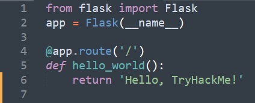
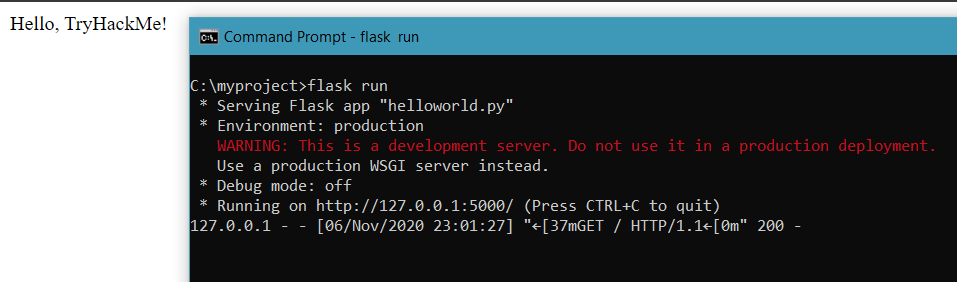
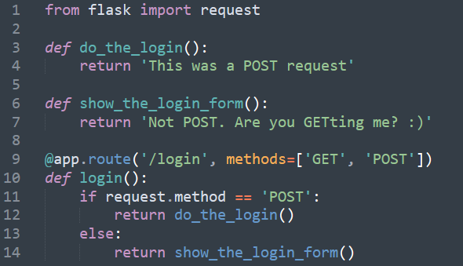
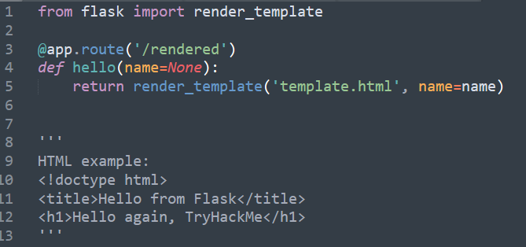
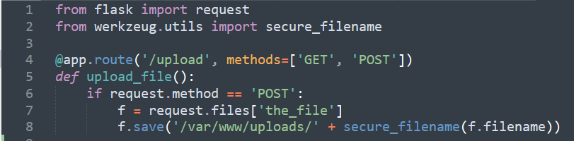
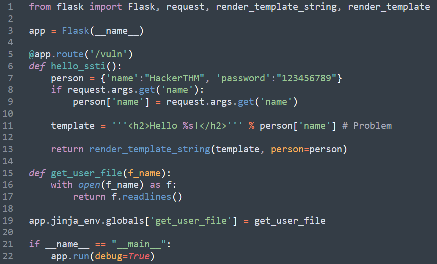
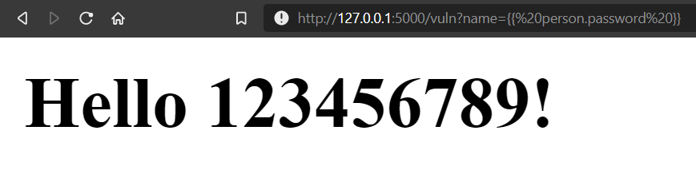

# Introduction to Flask

- [Room information](#room-information)
- [Solution](#solution)
- [References](#references)

## Room information

```text
Type: Walkthrough
Difficulty: Easy
Tags: Web
Subscription type: Free
Description: How it works and how can I exploit it?
```

Room link: [https://tryhackme.com/room/flask](https://tryhackme.com/room/flask)

## Solution

### Task 1: Introduction

This room continues my python-frameworks series. Learning Python can be extremely useful for penetration testers, and a simple understanding of its frameworks can be a key to success. In this room (lesson), we are going to learn about one of the easiest and fastest ones.

**Flask** is a micro web framework written in Python. It is classified as a microframework because it does not require particular tools or libraries. It has no database abstraction layer, form validation, or any other components where pre-existing third-party libraries provide common functions. However, Flask supports extensions that can add application features as if they were implemented in Flask itself. Extensions exist for object-relational mappers, form validation, upload handling, various open authentication technologies, and several common framework related tools.

[Source: Wikipedia]

To be short, Flask does not require much work from you and can be coded and deployed in a matter of a couple of minutes!

You'll find Flask especially easy if you find Django too complicated :)

Here's the collection of all scripts that are going to be used in this room:

- [https://github.com/Swafox/Flask-examples](https://github.com/Swafox/Flask-examples)

### Task 2: Installation and Deployment basics

Let's proceed with basic installation. For this room, we are going to use Python3. You can get it for both Windows and Linux [here](https://www.python.org/).

Now open up a terminal/cmd and install Flask by running:  
`pip3 install Flask`

After a couple of seconds, you'll get everything you need for using Flask.

Make a separate directory for your demo project and start a virtual environment there. Virtual environments are independent groups of Python libraries, one for each project. Packages installed for one project will not affect other projects or the operating system’s packages. Python 3 comes bundled with the venv module to create virtual environments. (tl;dr a virtual environment isolates your project from the system to prevent any conflicts).

Run `pip3 install virtualenv` if you get an error running venv later on.

On **Linux** run:

```bash
mkdir myproject 
cd myproject 
python3 -m venv venv
```

On **Windows**:

```bat
mkdir myproject 
cd myproject 
py -3 -m venv venv
```

Now you need to create and set a Flask file, aka a script that is going to contain the flask code. Create a file with a name of your choice and run the following command depending on your system:

Windows: `set FLASK_APP=hello.py`  
Linux: `export FLASK_APP=hello.py`

(Change **hello.py** to whatever name you came up with earlier)

And that's that! All you have to do now is run  
`flask run`  
or  
`flask run --host=0.0.0.0`  
to deploy a flask app locally or publically (on your network).

**Note**: You are going to get an error if you deploy the app at this point since we have no code written.

---------------------------------------------------------------------------------------

#### Which environment variable do you need to change in order to run Flask?

Answer: `FLASK_APP`

### Task 3: Basic syntax and routing

Let's start with the basic 'Hello World' app:



As you can see, we first imported the Flask library (line 1), then defined a variable **app** to be a flask project.

Then we assign a function **hello_world** to the `/` root address of the web page. So the application should display 'Hello,  TryHackMe!' on the deployed website. Check if that's the case!



You might have noticed that on line 4 we were using an `app.route` method. In Flask this allows us to create different pages and dynamic URLs. Simply make a few changes in the code and you can add a new page to our application.


Now you'll see two different messages if you browse to `http://127.0.0.1:5000/` or `http://127.0.0.1:5000/admin`.

---------------------------------------------------------------------------------------

#### What's the default deployment port used by Flask?

Answer: `5000`

#### Is it possible to change that port? (yay/nay)

Answer: `yay`

### Task 4: HTTP Methods and Template Rendering

As you might already know, web applications use different HTTP methods when accessing URLs. Those usually are GET and POST. By default, a **route** (see task 3) only answers to GET requests. BUT, you can easily use the **methods** argument in the **route()** to handle different HTTP methods.



Take a look at line 9. Here we are separating HTTP methods into GET and POST in order to instruct Flask on how to handle them. Inside the function, we can make python differently respond to an incoming GET or POST request. In this case, a POST request would invoke a function **do_the_login()** and everything else would call a **show_the_login_form()** one.

Now, the Flask team has made our lives easier by creating a template rendering function inside Flask. It makes Flask automatically render HTML files into a website, making it easier to handle. 



Look at the screenshot above and see how easy it is. Just add a **render_template** function and you'll get the desired result! I've also put a small HTML example for you to put inside the **template.html** file just to try it out.

---------------------------------------------------------------------------------------

#### Does Flask support POST requests? (yay/nay)

Answer: `yay`

#### What markdown language can you use to make templates for Flask?

Answer: `HTML`

### Task 5: File Upload

Flask also makes it easy for us to handle uploaded files.

You can access those files by looking at the **files** attribute on the request object. Each uploaded **file** is stored in that dictionary. It behaves just like a standard Python file object, but it also has a save() method that allows you to store that file on the filesystem of the server.

[Source: Flask documentation]

It is important to understand that you'll need a small HTML page with an upload form for this to work. ([Example](https://www.w3schools.com/howto/howto_html_file_upload_button.asp))



This is the way you can easily create an uploading page (`/upload`) using Flask. Flask is waiting for the POST request to be called and then uses a special **save** function to put those files somewhere on the system (you can change the location in any way you want).

**Note**: Make sure not to forget to set the **enctype="multipart/form-data"** attribute on your HTML form, otherwise the browser will not transmit your files at all.

### Task 6: Flask Injection

At this point, it looks like Flask is a great framework for young developers. It definitely is a great tool but a simple misconfiguration may lead to severe security consequences. A major vulnerability was found in Flask's template rendering. The template engine provided within the Flask framework may allow developers to introduce Server-Side Template Injection (SSTI) vulnerabilities.  An attacker can execute code within the context of the server. In some cases, it may lead to a full Remote Code Execution (RCE).

For the sake of this room let's take a look at a bad code configuration and see how it can be used to exploit a Local File Inclusion (LFI)!



The main reason for this vulnerability is that Jinja2 (template rendering engine) uses curly braces to surround variables used in the template. As you can see on the line with **# Problem**, our template is put in ''' ''' brackets which allow us to abuse the Jinja template mechanism. A variable after hello is parsing a **name** from a variable person. But because this is a vulnerable code we can make it output the **password**.

Go to the `10.64.169.198:5000/vuln?name=`

Simply put `{{ person.password }}` at the end of the link to see the password being displayed in cleartext.



Now let's take that vulnerability to another level and read files (LFI).  
`{{ get_user_file("/etc/passwd") }}`

The above string will allow you to read the `/etc/passwd` file or any other if you simply change the name.

This vulnerability can be easily mitigated by using a single quotation mark (' ') in the template variable (instead of ''' '''').  It may look ridiculous, but many python developers make these kinds of mistakes, and unintentionally make their websites vulnerable to SSTI.

---------------------------------------------------------------------------------------

#### What's inside /home/flask/flag.txt?

Manually browse to `http://10.64.169.198:5000/vuln?name={{get_user_file(%22/home/flask/flag.txt%22)}}` to get the flag.

Answer: `THM{<REDACTED>}`

### Task 7: References and Sources

Thank you for completing this room! Make sure to code something in Flask :)

Entire room:

- [Flask documentation](https://flask.palletsprojects.com/en/stable/)
- [TutorialSploit](https://www.tutorialspoint.com/flask/index.htm)

Task 5:

- [Flask Uploads](https://pythonhosted.org/Flask-Uploads/)

Task 6:

- [Injecting Flask by nVisium](https://blog.nvisium.com/injecting-flask)

Now, you are ready to complete the "Network Security and Traffic Analysis" module.

For additional information, please see the references below.

## References

- [Flask - Documentation](https://flask.palletsprojects.com/en/stable/)
- [Flask (web framework) - Wikipedia](https://en.wikipedia.org/wiki/Flask_(web_framework))
- [HTML - Wikipedia](https://en.wikipedia.org/wiki/HTML)
- [Python (programming language) - Wikipedia](https://en.wikipedia.org/wiki/Python_(programming_language))
- [Server-side template injection - PortSwigger](https://portswigger.net/web-security/server-side-template-injection)
- [Web framework - Wikipedia](https://en.wikipedia.org/wiki/Web_framework)
