# Linux Modules

- [Room information](#room-information)
- [Solution](#solution)
- [References](#references)

## Room information

```text
Type: Walkthrough
Difficulty: Easy
Tags: Linux
Meta Tags: Walkthrough, Walk-through, Write-up, Writeup
Subscription type: Free
Description:
Learn linux modules in a fun way
```

Room link: [https://tryhackme.com/room/linuxmodules](https://tryhackme.com/room/linuxmodules)

## Solution

### Task 1: Let's Introduce

This room is entirely based on, you can say revision, or may help you familiarize more with terminal.

**Note**: This room is purely for familiarizing more with command line (so no first bloods; Points Only) hence no need to rush, take your time in doing this room. The hints with the tasks may contain direct answers, so peek at your own risk.

Just a short intro on what's coming ahead:

- du
- grep, egrep, fgrep
- tr
- awk
- sed
- xargs
- curl
- wget
- xxd
- and some more...

I created this list so that I could read their documentation 1 by 1, and this room is to save you from reading all those long man pages where (while reading) you might not know the exact meanings of the flag used, as you might just started linux, or may be didn't use it till that extent to encounter that particular topic. Hope you get the idea...

#### Scope of this room

This room is based on understanding these tools so that they can reduce our effort while working with the command line. Also, this skill that you develop will help you manage your terminal sessions efficiently while working on a pentest or any project.

Just make sure that you're using a linux VM, so that you can get a hands on if you want to. Or simply start the attackbox (free users can deploy the attackbox for an hour, which I think is pretty much enough time to complete this room). I highly recommend to complete the "Linux Fundamentals" rooms before proceeding further with these topics.

Happy Learning ;)

---------------------------------------------------------------------------

### Task 2: du

#### About the Command

`du` is a command in linux (short for disk usage) which helps you identify what files/directories are consuming how much space. If you run a simple du command in terminal...

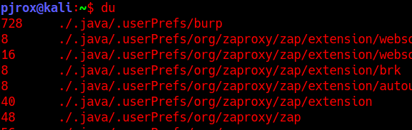

The folders in their respective folders are listed here with the size they occupy on the disk. The size here is shown in KB. Note: The files inside a folder are not shown, only the folders are listed by running `du /<directory>` command.

#### Important flags

|Flag|Description|
|----|----|
|`-a`|Will list files as well with the folder.|
|`-h`|Will list the file sizes in human readable format(B,MB,KB,GB)|
|`-c`|Using this flag will print the total size at the end. If you want to find the size of directory you were enumerating|
|`-d <number>`|Flag to specify the depth-ness of a directory you want to view the results for (eg. `-d 2`)|
|`--time`|To get the results with time stamp of last modified.|

#### Examples

`du -a /home/` will list every file in the `/home/` directory with their sizes in KB.

If there's a lot of output you can surely use grep...

`du -a /home/ | grep user` will list any file/directory whose name is containing the string "user" in it.

#### Final Words

`du` command can alternate `ls` with the following flags:

`du --time -d 1 .`

It won't specify you the user ownership though, so you can use `stat` command on the file you want to know who is the owner of that particular file.

Syntax: `stat`

---------------------------------------------------------------------------

### Task 3: Grep, Egrep, Fgrep

**IMPORTANT**: To proceed further with this task, make sure you have completed the "[Regular Expressions](https://tryhackme.com/room/catregex)" room by [concatenate](https://tryhackme.com/p/concatenate). This room will brief you about the regular expressions that can come handy while working with `egrep`.

There are a lot of rooms that you must have already done where you used `grep` a lot of times, so most of this task will sound familiar to you, or this is your first attempt on reading about `grep`, in any case, a 5 min read won't harm your busy day...

#### Introduction

It is a must known tool to everyone and that's why linux modules won't be complete without doing a mention of its amazing charisma. This tool, is what filters the good output we need from the residue. The official documentation says:

> The grep filter searches a file for a particular pattern of characters, and displays all lines that contain that pattern. The pattern that is searched in the file is referred to as the regular expression.

The pattern is what I am gonna brief you about.

**Syntax**: `grep "PATTERN" file.txt` will search the `file.txt` for the specified "PATTERN" string, if the string is found in the line, the `grep` will return the whole line containing the "PATTERN" string.

#### The Family Tree

`egrep` and `fgrep` are no different from `grep` (other than 2 flags that can be used with `grep` to function as both). In simple words, `egrep` matches the regular expressions in a string, and `fgrep` searches for a fixed string inside text. Now `grep` can do both their jobs by using `-E` and `-F` flag, respectively.

In other terms, `grep -E` functions same as `egrep` and `grep -F` functions same as `fgrep`.

#### Important Flags

|Flags|Description|
|----|----|
|`-R`|Does a recursive grep search for the files inside the folders (if found in the specified path for pattern search; else grep won't traverse diretory for searching the pattern you specify)|
|`-h`|If you're grepping recursively in a directory, this flag disables the prefixing of filenames in the results.|
|`-c`|This flag won't list you the pattern only list an integer value, that how many times the pattern was found in the file/folder.|
|`-i`|I prefer to use this flag most of the time, this is what specifies grep to search for the PATTERN while IGNORING the case|
|`-l`|will only list the filename instead of pattern found in it.|
|`-n`|It will list the lines with their line number in the file containing the pattern.|
|`-v`|This flag prints all the lines that are NOT containing the pattern|
|`-E`|This flag we already read above... will consider the PATTERN as a regular expression to find the matching strings.|
|`-e`|The official documentation says, it can be used to specify multiple patterns and if any string matches with the pattern(s) it will list it.|

You might be wondering the difference between `-E` and `-e` flag. I suggest to understand this as the following:

- `-e` flag can be used to specify multiple patterns, with multiple use of `-e` flag (`grep -e PATTERN1 -e PATTERN2 -e PATTERN3 file.txt`), whereas,
- `-E` can be used to specify one single pattern (You can't use `-E` multiple times within a single grep statement).

Other point that you can use to understand the difference is, `-e` works on the BREs (Basic Regular Expressions) and `-E` works on EREs (Extended Regular Expressions).

- BREs tend to match a single pattern in a file (Simplest examples can be direct words like "sun", "comic")
- EREs tend to match 2 or more patterns in a file (To select a no of words like (sun sunyon sandston) the pattern could be `^s.*n$`).

Hope, you get an idea how this works.

Here's a real short note, you might wanna read, on official GNU documentation: [Basic vs Extended (GNU Grep 3.5)](https://www.gnu.org/software/grep/manual/html_node/Basic-vs-Extended.html). If you didn't understand much from that paragraph, make sure, you've practiced your regex well.

---------------------------------------------------------------------------

#### Is there a difference between egrep and fgrep? (Yea/Nay)

Answer: `Yea`

#### Which flag do you use to list out all the lines NOT containing the 'PATTERN'?

Answer: `-v`

#### What user did you find in that file?

Hint: Case Insensitive maybe??

```bash
┌──(kali㉿kali)-[/mnt/…/TryHackMe/Walkthroughs/Easy/Linux_Modules]
└─$ grep -i user grep.txt                                                                                                     
uxx6x84XZw5VsQTHzVMN7F6fuxx6x84XZw5VsQTHzVMN7F6fuxx6x84XZw5VsQTHzVMN7F6fuxx6x84XZw5VsQTHzVMN7FuSeR:bobthebuilder6fuxx6x84XZw5VsQTHzVMN7F6fuxx6x84XZw5VsQTHzVMN7F6fuxx6x84XZw5VsQTHzVMN7F6f
```

Answer: `bobthebuilder`

#### What is the password of that user?

Hint: Uhm, did you checked the line properly?

```bash
┌──(kali㉿kali)-[/mnt/…/TryHackMe/Walkthroughs/Easy/Linux_Modules]
└─$ grep -i password grep.txt
qEqbDkrSFzmhRdDSQNWqaMTXqEqbDkrSFzmhRdDSQNWqaMTthispAsSwOrDistoosensitive:'LinuxIsGawd'XqEqbDkrSFzmhRdDSQNWqaMTXqEqbDkrSFzmhRdDSQNWqaMTXqEqbDkrSFzmhRdDSQNWqaMTXqEqbDkrSFzmhRdDSQNWqaMTXqEqbDkrSFzmhRdDSQNWqaMTX
```

Answer: `LinuxIsGawd`

#### Can you find the comment that user just left?

```bash
┌──(kali㉿kali)-[/mnt/…/TryHackMe/Walkthroughs/Easy/Linux_Modules]
└─$ grep -i comment grep.txt
8gmdNXTN4gn2u73SuX5cewcM8gmdNXTN4gn2comment:'fs0ciety'u73SuX5cewcM8gmdNXTN4gn2u73SuX5cewcM8gmdNXTN4gn2u73SuX5cewcM8gmdNXTN4gn2u73SuX5cewcM8gmdNXTN4gn2u73SuX5cewcM8gmdNXTN4gn2u73SuX5cewcM
```

Answer: `fs0ciety`

---------------------------------------------------------------------------

### Task 4: Did someone said STROPS?

I believe from here on, things are going to be a little different other than grepping the patterns. To keep things as simple as possible, we are going to start with a short note on what and where.

#### String Manipulations (STRing OPerationS)

Many people discard this topic in their tutorials/courses, which I believe is leaving behind the true power of linux and it's terminal interface. You ever see someone typing a very long command piping their outputs into some other commands? Well believe me when I say, you can select a single byte character from a GB long array of string bytes, if you could master that.

If you're from a programming background you might have used indexing in arrays, slicing in python, or even grepping in terminal... All are a means of string manipulations. Especially in bash, we have a TON of tools to perform a same kind of operation, with different flags or string patterns specified, but obviously we will be choosing the one, providing us the shortest and easiest syntax possible.

For strops, we have the following tools that I always keep in my arsenal and you should too:

- tr
- awk
- sed
- xargs

Other commands to be familiar with:

- sort
- uniq

I am gonna walk you through the commands I mentioned above in the following tasks.

---------------------------------------------------------------------------

### Task 5: tr

Translate command (`tr`) can help you in number of ways, ranging from changing character cases in a string to replacing characters in a string. It's awesome at it's usage. Plus, it's the easiest command and a must know module for quick operations on strings.

**Syntax**: `tr [flags] [source]/[find]/[select] [destination]/[replace]/[change]`

This I guess is an appropriate representation of how you can use this tool. Moreover, we have the following flags offered by this command:

|Flags|Description|
|----|----|
|`-d`|To delete a given set of characters|
|`-t`|To concat source set with destination set (destination set comes first; t stands for truncate)|
|`-s`|To replace the source set with the destination set(s stands for squeeze)|
|`-c`|This is the REVERSE card in this game, for eg. If you specify `-c` with `-d` to delete a set of characters then it will delete the rest of the characters leaving the source set which we specified (c stands for complement; as in doing reverse of something)|

You must have noticed the word "set" while reading the flags. Well that's true... tr command works in sets of character.

#### Examples

- If you want to convert every alphabetic character to upper case.

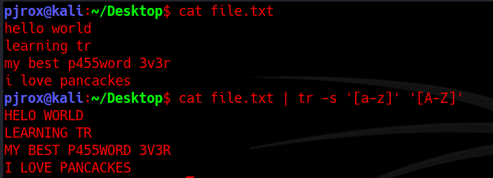

Or I am not sure, if you ever used emojis on discord, coz on desktop app you could use emojis using `:keyword:`. Similarly, `tr` allows us to select a set by these keywords. In that case the output would be same.

`cat file.txt | tr -s '[:lower:]' '[:upper:]'`

There are more of these (interpreted sequences) which you can view, by just `tr --help` command. I am not including them here, because they are just straight forward, and you've been using most of them, if you're familiar with (mostly) any programming language out there.

- If you want to view creds of a user which are in digits.

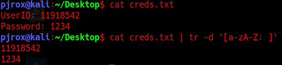

You can see that I used regex here, and deleted all lower/upper case characters, including the (:) symbol and a space.

**Note**: This is a short note on how you can use this tool. Now try out these features on your own and get use to this tool. You can also refer to the following sites for more on the tool:

- [tr command in Unix/Linux with examples - GeeksforGeeks](https://www.geeksforgeeks.org/tr-command-in-unix-linux-with-examples/)
- [Tr Command in Linux with Examples | Linuxize](https://linuxize.com/post/linux-tr-command/)

---------------------------------------------------------------------------

#### Run `tr --help` command and tell how will you select any digit character in the string?

```bash
┌──(kali㉿kali)-[/mnt/…/TryHackMe/Walkthroughs/Easy/Linux_Modules]
└─$ tr --help          
Usage: tr [OPTION]... STRING1 [STRING2]
Translate, squeeze, and/or delete characters from standard input,
writing to standard output.  STRING1 and STRING2 specify arrays of
characters ARRAY1 and ARRAY2 that control the action.

  -c, -C, --complement    use the complement of ARRAY1
  -d, --delete            delete characters in ARRAY1, do not translate
  -s, --squeeze-repeats   replace each sequence of a repeated character
                            that is listed in the last specified ARRAY,
                            with a single occurrence of that character
  -t, --truncate-set1     first truncate ARRAY1 to length of ARRAY2
      --help        display this help and exit
      --version     output version information and exit

ARRAYs are specified as strings of characters.  Most represent themselves.
Interpreted sequences are:

  \NNN            character with octal value NNN (1 to 3 octal digits)
  \\              backslash
  \a              audible BEL
  \b              backspace
  \f              form feed
  \n              new line
  \r              return
  \t              horizontal tab
  \v              vertical tab
  CHAR1-CHAR2     all characters from CHAR1 to CHAR2 in ascending order
  [CHAR*]         in ARRAY2, copies of CHAR until length of ARRAY1
  [CHAR*REPEAT]   REPEAT copies of CHAR, REPEAT octal if starting with 0
  [:alnum:]       all letters and digits
  [:alpha:]       all letters
  [:blank:]       all horizontal whitespace
  [:cntrl:]       all control characters
  [:digit:]       all digits
  [:graph:]       all printable characters, not including space
  [:lower:]       all lower case letters
  [:print:]       all printable characters, including space
  [:punct:]       all punctuation characters
  [:space:]       all horizontal or vertical whitespace
  [:upper:]       all upper case letters
  [:xdigit:]      all hexadecimal digits
  [=CHAR=]        all characters which are equivalent to CHAR

Translation occurs if -d is not given and both STRING1 and STRING2 appear.
-t is only significant when translating.  ARRAY2 is extended to length of
ARRAY1 by repeating its last character as necessary.  Excess characters
of ARRAY2 are ignored.  Character classes expand in unspecified order;
while translating, [:lower:] and [:upper:] may be used in pairs to
specify case conversion.  Squeezing occurs after translation or deletion.

GNU coreutils online help: <https://www.gnu.org/software/coreutils/>
Full documentation <https://www.gnu.org/software/coreutils/tr>
or available locally via: info '(coreutils) tr invocation'
```

Answer: `:digit:`

#### What sequence is equivalent to [a-zA-Z] set?

See listing above.

Answer: `:alpha:`

#### What sequence is equivalent to selecting hexadecimal characters?

See listing above.

Answer: `:xdigit:`

---------------------------------------------------------------------------

### Task 6: awk

#### The AWK Command

This is the most-est powerful tool in my arsenal, I can't think of any other command that can do something and not `awk`. It's like the all-in-one tool. If you ever played CSGO, you can totally relate AWK with AWP.

> "Awk is a scripting language used for manipulating data and generating reports. The awk command programming language requires no compiling, and allows the user to use variables, numeric functions, string functions, and logical operators."

Sidenote: Just because it's the super tool, that's not necessary that there is no need to learn about other tools. The `awk` commands can be fairly longer to solve an operation than that of sed or xargs. A GNU project of `awk` (namely, `gawk`) which is also the one installed on every linux distro, is compatible with both `awk` and `nawk` (New-awk; also project by AT&T).

**Syntax**: `awk [flags] [select pattern/find(sort)/commands] [input file]`

**Note**: `awk` does support getting output via piping.

If the commands you wrote are in a script you can execute the script commands by using the `-f` flag and specifying the name of the script file. (`awk -f script.awk input.txt`)

#### Using AWK

- To simply print a file with awk.

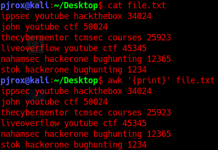

You can see it simply just printed out data from file.txt.

- To search for a pattern inside a file you enclose the pattern in forward slashes `/pattern/`. For instance, if I want to know who all plays CTF competitions the command should be like: `awk '/ctf/' file.txt`

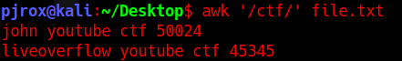

#### Built-In variables in AWK

Let's talk a little bit about some of the in-built variables. Built-in variables include field variables ($1, $2, $3 .. $n). These field variables are used to specify a piece of data (data separated by a delimeter defaulting to space). If I run `awk '{print $1 $3}' file.txt` it will list me the words that are at 1st and 3rd fields.

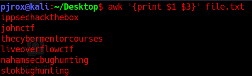

You can see, it joined the words together because we didn't specify the output delimeter. We will come to that later in this task. Right now, let's just use a "," (comma) to bring the space.

**Note**: You may notice the use of {} around the print statement, that's where we used a function. To use commands in `awk` scripts, you need to mention them inside a function.

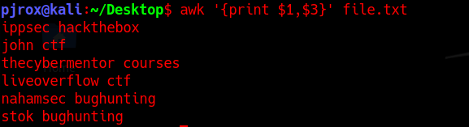

Great, this seems a little nice.

**Note**: The `$0` variable points to the whole line.  Also, make sure to use single quotes(`'`) to specify patterns, `awk` treats double quotes(`"`) as a raw string. To use double quotes make sure that you escape the (`$`) sign(s) with a backslash (`\`) each, to make it work properly.

#### More on variables

**NR**: (Number Record) is the variable that keeps count of the rows after each line's execution... You can use `NR` command to number the lines (`awk '{print NR,$0}' file.txt`). Note that `awk` considers rows as records.

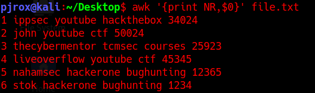

**FS**: (Field Separator) is the variable to set in case you want to define the field for input stream. The field separation (defaut to space) that we talked above and can be altered to whatever you want while specifying the pattern. `FS` can be defined to another character(s) (yea, can be plural) at the `BEGIN {command}`.

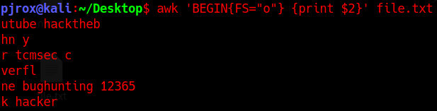

If you don't know the `BEGIN` yet, take it as a pattern that we specify and following is the action on that pattern. Similarly, there is `END` command, this is also a pattern that we specify, following the action to perform on that pattern, and simply, we use them to define actions like Field Separator, Record Separator etc. that are to be performed at the start and at the end of the script, respectively.

`awk "BEGIN {FS='o'} {print $1,$3} END{print 'Total Rows=',NR}"`

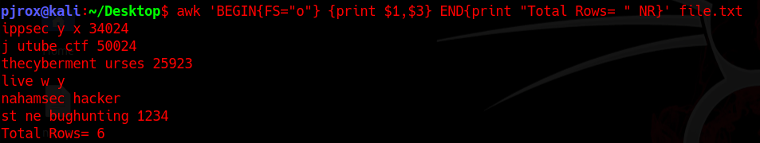

The output is weird because I separated the fields using a letter that was making sense with the words in text. In short, this is actually how a complete script is written in `awk`.

**RS**: (Record Separator): By default it separate rows with '\n', you can specify something else too.

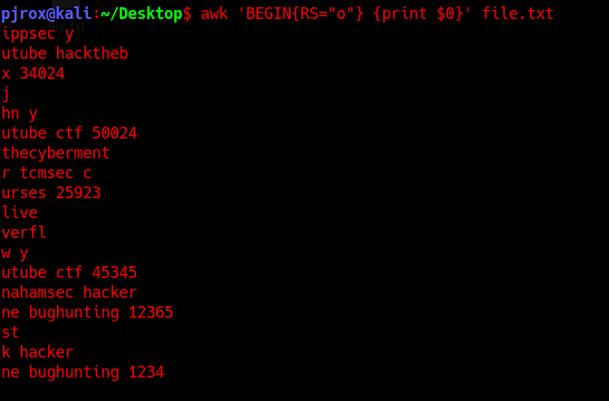

Notice that their has been a new line created wherever 'o' was used. It also interpreted '\n' used in the text file, so there are new lines after end of every number too.

**OFS**: (Output Field Separator) You must have gathered some idea by the full form, it is to specify a delimeter while outputing...

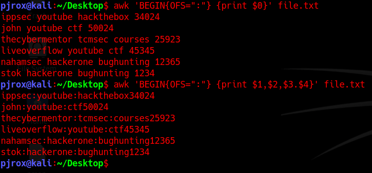

I used `OFS` in both the commands, you can see that only in 2nd one the delimiter was used. Note that the output field separator will separate fields using (:) only when the fields are defined with the print statement. With `$0` I didn't had anything else, if it were to be `$0,$0` then the lines would be joining their reflection (non-laterally) with a colon (:).

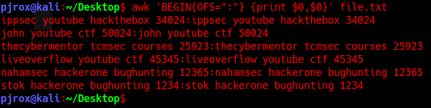

**ORS**: (Output Record Separator) I don't think I really need to specify it's usage...

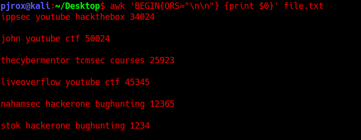

My delimiter was a double new-line character.

This is not it... There is a lot more on AWK, you can do operations, find string length, use conditions to sort, regex within awk and other fun stuff. But I guess the task is already went a lot longer. Let's quickly move on to some important flags that can come in handy while doing strops.  

JIC if you wanna read more on the tool, here are some great resources regarding awk scripting.

- [AWK - Workflow - Tutorialspoint](https://www.tutorialspoint.com/awk/awk_workflow.htm) (For learning awk scripting in brief and quick)
- [The printf statement in awk](http://osr5doc.xinuos.com/en/OSUserG/_The_printf_statement.html) (If you want to do more with formatting strings; you can use printf function also)
- [AWK command in Unix/Linux with examples - GeeksforGeeks](https://www.geeksforgeeks.org/awk-command-unixlinux-examples/)
- And if you really want to dive deep on this tool, do check out [man pages on gawk](https://man7.org/linux/man-pages/man1/gawk.1.html)

#### Important Flags

|Flags|Description|
|----|----|
|`-F`|With this flag you can specify FIELD SEPARATOR (FS), and thus don't need to use the BEGIN rule|
|`-v`|Can be used to specify variables (like we did in `BEGIN{OFS=":"}`|
|`-D`|You can debug your .awk scripts specifying this flag (`awk -D script.awk`)|
|`-o`|To specify the output file (if no name is given after the flag, the output is defaulted to `awkprof.out`)|

There are other flags as well, but they are of not much use. Especially if you're learning this as a beginner.

Just relax if you don't get much of this task, learning a scripting language inside a single task is not an easy job. Just make sure you understood the above told syntax well and followed the resources, rest is all practice :-).

Ending this task with a fun fact, AWK is abbreviated after it's creators (**A**ho, **W**einberger, and **K**ernighan).

---------------------------------------------------------------------------

#### Use the awk command to print the specified output

Hint: It starts as: awk 'BEGIN{OFS=...

Download the above given file `awk.txt`, and use the `awk` command to print the following output:

```text
ippsec:34024
john:50024
thecybermentor:25923
liveoverflow:45345
nahamsec:12365
stok:1234
```

```bash
┌──(kali㉿kali)-[/mnt/…/TryHackMe/Walkthroughs/Easy/Linux_Modules]
└─$ head awk.txt 
ippsec youtube hackthebox 34024
john youtube ctf 50024
thecybermentor tcmsec courses 25923
liveoverflow youtube ctf 45345
nahamsec hackerone bughunting 12365
stok hackerone bughunting 1234

┌──(kali㉿kali)-[/mnt/…/TryHackMe/Walkthroughs/Easy/Linux_Modules]
└─$ awk 'BEGIN{OFS=":"} {print $1, $4}' awk.txt
ippsec:34024
john:50024
thecybermentor:25923
liveoverflow:45345
nahamsec:12365
stok:1234
```

Answer: `awk 'BEGIN{OFS=":"} {print $1, $4}' awk.txt`

#### How will you make the output as following?

Hint: You can use ORS. Single quotes->Command, Double quotes->Values

How will you make the output as following (there can be multiple; answer it using the above specified variables in `BEGIN` pattern):

`ippsec, john, thecybermentor, liveoverflow, nahamsec, stok,`

```bash
┌──(kali㉿kali)-[/mnt/…/TryHackMe/Walkthroughs/Easy/Linux_Modules]
└─$ awk 'BEGIN{ORS=","} {print $1}' awk.txt
ippsec,john,thecybermentor,liveoverflow,nahamsec,stok, 
```

Answer: `awk 'BEGIN{ORS=","} {print $1}' awk.txt`

---------------------------------------------------------------------------

### Task 7: sed

Reminds me of the dialogue, "That's what she `sed`". But this has been on my mind since I started creating this room. Nvm, so `sed` is THE 2nd most powerful tool of all. I especially consider using `sed` most of the time, because that's what she `sed`... jk, it's because it offers good number of strops in short commands. Easy to use, once get a habit of it.

#### The sed life

`sed` (Stream EDitor) is a tool that can perform a number of string operations. Listing a few, could be: FIND AND REPLACE, searching, insertion, deletion. I think `sed` of a stream-oriented vi editor... Ok so a few questions popped up, like how? and what is stream-oriented? Let's not dive deep into streams, just keep in mind that I said it in contrast with "orientation with input stream". You can't call vi stream oriented, because it doesn't work with neither of input or output stream. So for vi users, feel free to use your previous experience with vim to connect the dots.

On the other hand, you can easily perform operations with `sed` command by either piping the input or redirecting (<) the input from a file. I prefer sublime over vim for note taking (No offence to vim fanboys/fangirls out there, I just use sublime to keep things like notes formatting in GUI :).

**Syntax**: `sed [flags] [pattern/script] [input file]`

#### Important Flags

|Flags|Description|
|----|----|
|`-e`|To add a script/command that needs to be executed with the pattern/script(on searching for pattern)|
|`-f`|Specify the file containing string pattern|
|`-E`|Use extended regular expressions|
|`-n`|Suppress the automatic printing or pattern spacing|

#### The sed command

There are endless ways of using `sed`. I am gonna walk you through a very detailed general syntax of (mostly all) `sed` patterns, with some general examples. Rest is your thinking and creativity, on how YOU utilize this tool.

`'[condition(s)(optional)] [command/mode(optional)]/[source/to-be-searched pattern(mandatory)]/[to-be-replaced pattern(depends on command/mode you use)]/[args/flags to operate on the pattern searched(optional)]'`

If you have any previous knowledge of `sed`, feel free to co-relate. Again, this is just the pattern inside `sed` command (excluding external flags). Also, note the single quotes at the start/end.

Hmm, but may be, it's still not clear. Alright let's take a simple example to relate this.

`sed -e '1,3 s/john/JOHN/g' file.txt`

Hope the syntax is now making a little sense... Great. Moving forward to modes and args.

#### Modes/Commands

|Commands|Description|
|----|----|
|`s`|(Most used) Substitute mode (find and replace mode)|
|`y`|Works same as substitution; the only difference is, it works on individual bytes in the string provided (this mode takes no arguments/conditions)|

**Update**: I used the word "mode" in the rest of the task just to avoid the confusion of using a command (s/y) within the command (`sed`). But just to be clear, official documentation list them as *commands* used in `sed`.

#### Args

|Flags/Args|Description|
|----|----|
|`/g`|globally (any pattern change will be affected globally, i.e. throughout the text; generally works with `s` mode)|
|`/i`|To make the pattern search case-insensitive (can be combined with other flags)|
|`/d`|To delete the pattern found (Deletes the whole line; takes no parameter like conditions/modes/to-be-replaced string)|
|`/p`|prints the matching pattern (a duplicate will occur in output if not suppressed with `-n` flag.)|
|`/1`,`/2`,`/3`..`/n`|To perform an operation on an nth occurrence in a line (works with `s` mode)|

Let's see these in action... Explaining the previously taken command, (`sed -e '1,3 s/john/JOHN/g' file.txt`)

- Starting with the `sed` keyword itself, initializes the `sed` command.
- With `-e` flag specifying that following is a script command. (you don't need to specify `-e` if it's a single command; as it will be automatically interpreted by `sed` as a positional argument)
- Then comes the pattern. Starting with the portion is the condition (or range selection to be specific), specifying to take range of lines 1,3 (line index starts from 1) and execute the following code on that range of lines. Following a space comes the *mode*, specifying that we need to use a substitution mode (as we are substituting a value) by using `s`. Then we specify `/` as a delimiter to differentiate between the parts of code. After the first slash came the *pattern* we want to operate the substitution on (you may choose to use regex in this region too). Following the 2nd slash comes the *string* we want to replace the pattern with. Finally, after the last slash was an arg/flag, `/g` specifying to operate this operation globally, wherever the pattern was found.
- Finally was the filename we want to take input from and apply operation/code that we specified beside it.

Hope there is no confusion as per `sed` is concerned. Hence, the output for the above command would be like:

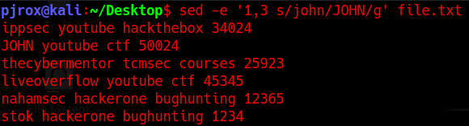

Let's view a few more examples to get the concept clear:

- Viewing a range of Lines

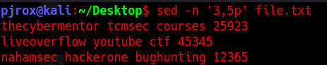

The `-n` flag suppressed the output and we got the duplicates created by `p` arg.

- Viewing the entire file except a given range

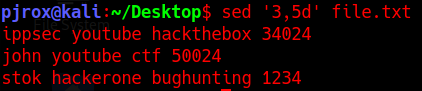

- Viewing multiple ranges of lines inside a file

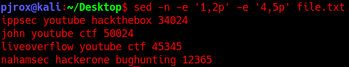

To start searching from nth pattern occurrence in a line you can use combination of `/g` with `/1`,`/2`,`/3`.

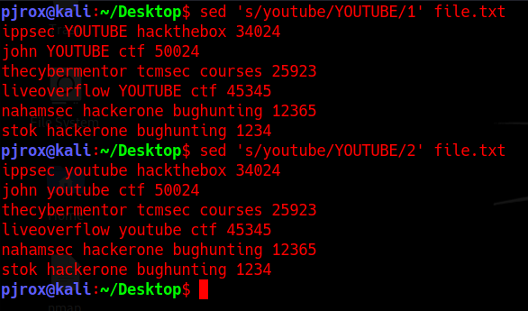

You can see when I specified `/1` it gave a change in the text, with `/2` it didn't. This is because there was only 1 occurrence of the string "youtube", and the 2nd occurrence couldn't be found. Also I didn't used `1g` or `2g` because there were no further occurrences of the pattern, so there is no need to use it. Still it would have worked the same, if used. Try it on your own.

- If you have log files to view which have trailing white spaces, and it is hard to read them, then you can fix that using regex.

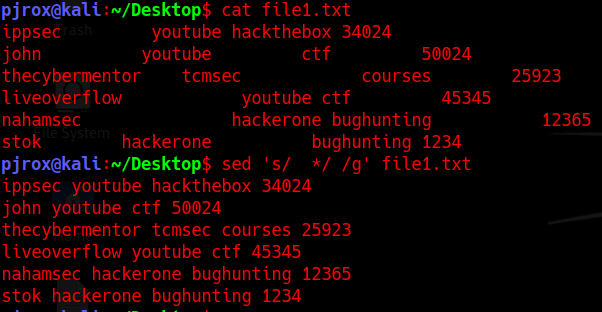

Let's take one last example on this `sed` command.

- More on regex can be: Making every line to start with a bullet point and enclose the digits in square brackets... Ok, but how? Let's first view it, and then we'll take a look at the explanation.

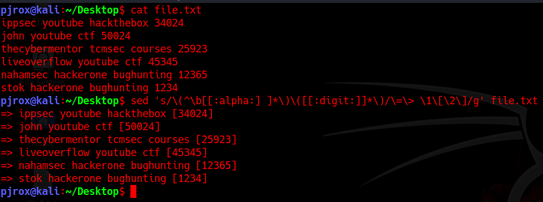

"What is this?! where's that `:alpha:` came from? I understand the `\b` is part of regex you used, following those, un-identifiable escape characters and some `\1` and `\2` referenced either wrong, as it's `/1`, `/2` to identify the nth occurrence. I mean, it's so confusing".

I agree, it's so noisy, and hard to read. But believe 70% of it is nothing to do with `sed`, it's all regex, so take your time. Try to understand what the regex is doing. Rest the "to-be-replaced" part is just a way `sed` is assigning the groups to it's default variables we created within regex.

#### Explanation

`sed 's/\(^\b[[:alpha:] ]*\)\([[:digit:]]*\)/\=\> \1\[\2\]/g' file.txt`

- Starting with the regex part. Opening a group with escape character, `^` to put the cursor at the starting of the line, and then `\b` represents to search for beginning of a word, and then defines a set of characters to include, following a `*` to specify 'n' number of characters. Then closes the group by escaping the closing brackets. Creating another regex group, using escape sequence, we then initialized another set and specified `*` at the end of the set to take n characters of that set, at last group is closed using escape sequence.
- At the replaced end, we are using escape sequences to make a bullet (it's just a good practice to use escape sequence with every symbolic character; even if the output is same), then we have escape characters for the square brackets enclosing a `sed` variable `/2` (after `/1` which is coming up).
- Now its turn for the `sed`'s keyword part. We used `[:alpha:]` in the set defined by regex, which is nothing but another representation of using `a-zA-Z` in regex, which means to capture any alphabetic characters. `sed` offers such keywords (calling them "bracket expressions"), which we can use to make the input code look cleaner. Similarly we used the bracket expression for specifying digit as well which we specified using `[:digit:]`.

**Note**: There's a space after the first bracket expression inside the regex set (`[[:alpha:]{space}]`). As you see, this space was to indicate the regex set so that `*` could take multiple words until the digits start occurring in the text (regex logic).

- Then there are some in-built variables as we saw in `awk`, that we used in the to-be-replace part of `sed`. `\1` depicted the first group which selected everything until the first character occurred. The second group comprised of a set consisting decimal characters, which were enclosed with `\2` with the use of escseq.

Here, we finished learning about `sed` variables, the number of groups you create with regex, can be later indexed as variable `\n` in `sed`.

Well this is pretty much it, on the `sed` command. If you want to learn more, check-out the resources on the `sed` command.

#### Sed Resources

- [Sed Command in Linux/Unix with examples - GeeksforGeeks](https://www.geeksforgeeks.org/sed-command-in-linux-unix-with-examples/)
- [sed, a stream editor (gnu.org)](https://www.gnu.org/software/sed/manual/sed.html) (Official Documentation)
- [15 Useful 'sed' Command Tips and Tricks for Daily Linux System Administration Tasks (tecmint.com)](https://www.tecmint.com/linux-sed-command-tips-tricks/)

Again, if there is not much you could learn about this command don't feel bad, just go through the resources and try practicing by making your own texts and play with this command.

---------------------------------------------------------------------------

#### How would you substitute every 3rd occurrence of the word 'hack' to 'back' on every line inside the file file.txt?

Answer: `sed 's/hack/back/3g' file.txt`

#### How will you do the same operation only on 3rd and 4th line in file.txt?

Answer: `sed '3,4 s/hack/back/3g' file.txt`

#### Download the given file, and try formatting the trailing spaces in sed1.txt with a colon(:)

```bash
┌──(kali㉿kali)-[/mnt/…/TryHackMe/Walkthroughs/Easy/Linux_Modules]
└─$ tar xvf sed.tar    
sed/
sed/sed2.txt
sed/sed1.txt

┌──(kali㉿kali)-[/mnt/…/TryHackMe/Walkthroughs/Easy/Linux_Modules]
└─$ cd sed          

┌──(kali㉿kali)-[/mnt/…/Walkthroughs/Easy/Linux_Modules/sed]
└─$ head sed1.txt    
user         password
haxor                    lsatsdf
nomandad xiftox123
nobita             shizuka<3
xadminx      needme?$
peterpan               TinkerBell69
satan           GOAT

┌──(kali㉿kali)-[/mnt/…/Walkthroughs/Easy/Linux_Modules/sed]
└─$ sed -E 's/ +/:/g' sed1.txt
user:password
haxor:lsatsdf
nomandad:xiftox123
nobita:shizuka<3
xadminx:needme?$
peterpan:TinkerBell69
satan:GOAT

┌──(kali㉿kali)-[/mnt/…/Walkthroughs/Easy/Linux_Modules/sed]
└─$ sed 's/ */:/g' sed1.txt  
:u:s:e:r:p:a:s:s:w:o:r:d:
:h:a:x:o:r:l:s:a:t:s:d:f:
:n:o:m:a:n:d:a:d:x:i:f:t:o:x:1:2:3:
:n:o:b:i:t:a:s:h:i:z:u:k:a:<:3:
:x:a:d:m:i:n:x:n:e:e:d:m:e:?:$:
:p:e:t:e:r:p:a:n:T:i:n:k:e:r:B:e:l:l:6:9:
:s:a:t:a:n:G:O:A:T:
```

From above we can see that the expected THM answer is unclear. But maybe there are different versions of sed that works differently...!?

Answer: `sed 's/ */:/g' sed1.txt`

#### View the sed2 file in the directory. Try putting all alphabetical values together, to get the answer for this question

Hint: I hope you will do this using sed.

```bash
┌──(kali㉿kali)-[/mnt/…/Walkthroughs/Easy/Linux_Modules/sed]
└─$ cat sed2.txt 
8C3453453O24N3452G345RA3T45345U3245L435A344T5I45ON3245S34
5Y334523455O375678748U8
7678778M68797998058746A7524534D6234534532545E45234534522
345345534I24354352435565T24356675463524435
23423466567T454564775367H3632452345R2345OU3G6H464456356453
T45H3452354235I45656565647S567567457
S4536235342654763M45633465457346246536A75673475683647L38765877943675626765L686978437566
34256457642635345L23654325341545637235I34263462435346563456T34526457832435424TL4546375683654657463E
C35234645365H4653634453647A42353657346334643426858678845735625L342142352455675L213412416757E213423152345658N2314314163776G211235E2

┌──(kali㉿kali)-[/mnt/…/Walkthroughs/Easy/Linux_Modules/sed]
└─$ sed 's/[[:digit:]]//g' sed2.txt           
CONGRATULATIONS
YOU
MADE
IT
THROUGH
THIS
SMALL
LITTLE
CHALLENGE

┌──(kali㉿kali)-[/mnt/…/Walkthroughs/Easy/Linux_Modules/sed]
└─$ sed 's/[[:digit:]]//g' sed2.txt | tr '\n' ' '
CONGRATULATIONS YOU MADE IT THROUGH THIS SMALL LITTLE CHALLENGE 
```

Answer: `CONGRATULATIONS YOU MADE IT THROUGH THIS SMALL LITTLE CHALLENGE`

#### What pattern did you use to reach that answer string?

Hint: Think of this the other way around, why try to put the alphabets together when you can remove all the digits, instead.

Answer: `'s/[[:digit:]]//g'`

Alternatively, you can use tr to remove all the digits, and then pipe the output in sed to remove trailing whitespaces.

`cat sed2.txt | tr '[:digit:]' ' ' | sed 's/  *//g'`

**Update**: Another good way suggested by a room do-er. You can simply use `tr -d` command to delete all the digits from the file.

`cat sed2.txt | tr -d '[:digit:]'`

#### What did she sed? (In double quotes)

Hint: "That's What"

Answer: `"That's What"`

---------------------------------------------------------------------------

### Task 8: xargs

`xargs`, a very simple command to use when it comes to make passed string a command's argument, technically, positional argument. The official documentation says:

> `xargs` is a command line tool used to build and execute command from the standard input.

#### Important flags

|Flags|Description|
|----|----|
|`-0`|Will terminate the arguments with null character (helps to handle spaces in the argument)|
|`-a file`|This option allows `xargs` to read item from a file|
|`-d delimiter`|To specify the delimiter to be used when differentiating arguments in stdin|
|`-L int`|Specifies max number non-blank inputs per command line|
|`-s int`|Consider this as a buffer size that you allocate while running `xargs`, it sets the max-chars for the command, which includes it's initial arguments and terminating nulls as well. (You won't be using this most of the times but it's good to know). Default size is around 128kB (if not specified).|
|`-x`|This flag will exit the command execution if the size specified is exceeded. (For security purposes.)|
|`-E str`|This is to specify the end-of-file string (You can use this in case you are reading arguments from a file)|
|`-I str`|(Capital i) Used to replace str occurrence in arguments with the one passed via stdin (More like creating a variable to use later)|
|`-p`|prompt the user before running any command as a token of confirmation.|
|`-r`|If the standard input is blank (i.e. no arguments passed) then it won't run the command.|
|`-n int`|This specifies the limit of max-args to be taken from command input at once. After the max-args limit is reached, it will pass the rest arguments into a new command line with the same flags issued to the previously ran command. (More like a looping)|
|`-t`|verbose; (Print the command before running it).Note: This won't ask for a prompt|

`xargs` packs with a very large option of flags, although, a very simple tool to work with. You don't have to stress too much on `xargs`, it is just a small tool like sort, uniq (Coming soon). Go through the following examples and then I have a useful note, on using flags as a positional arguments.

#### Examples

- What if we want to run multiple command with `xargs` in one line.

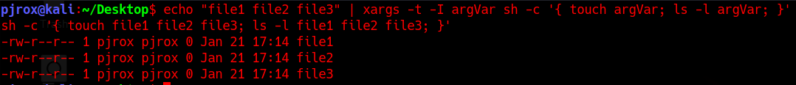

You can see I defined a variable *argVar* to use later in the 2 commands I ran with `bash -c`.

- You can use `xargs` with conjunction to find command to enhance the search results.

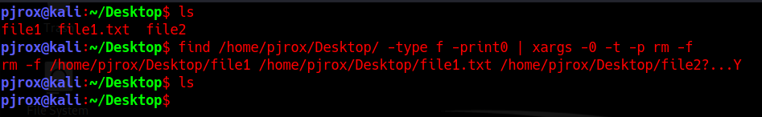

**Note**: The `find` command prints results to standard output by default, so the `-print` option is normally not needed, but `-print0` separates the filenames with a `\0` (NULL) byte so that names containing spaces or newlines can be interpreted correctly.

- You can use `xargs` command to grep a text from any file in any directory meeting a specific pattern/criteria.

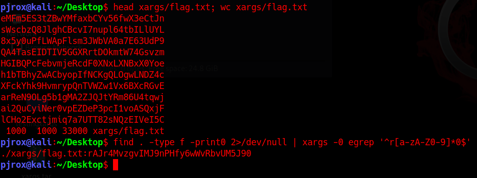

You can see that I used `xargs` to grep a pattern matching anything starting with `r` with any bunch of characters `[:alnum:]` and ending with `0`. Which returned me this string. If you want to practice on your own, you can find `flag.txt` file inside the downloaded zip archive. Pick a string find a unique pattern for it and then grep it. Peace.

**Note**: If the `xargs` is having same flags, that can also be interpreted by the following module, in that case you need not worry, because the flags used after the command are the one's that are interpreted. Just keep that in mind and you're good to go.

#### A note on XARGS (and almost every command line module in linux/unix system)

Let's take an example from one of the rooms I solved on privilege escalating through tar running as super user. Room: [Linux PrivEsc | Task 10](https://tryhackme.com/room/linuxprivesc)

Gtfobins said, `tar -cf /dev/null /dev/null --checkpoint=1 --checkpoint-action=exec=/bin/sh`

Great, but the catch in the challenge was, `sudo` was not given to `tar`, SUID permissions were given to a file, which was not allowed to be edited by any other user (owner: root). So if that script has to run it will run with the root privileges. What we could do is make the files in that directory in flag format, that `tar` could interpret as it's flag. So when in our case, `tar` would start scanning the directory to get the overview of the files to compress and combine them, it will interpret those flags and will give us root shell.

Awesome technique. Isn't it? Well that's not the point. The point here is, I found a little difficulty in creating those files (via command line) with `--` appended to them. I tried `xargs` but didn't work. I then found an article [here](https://www.hackingarticles.in/exploiting-wildcard-for-privilege-escalation/), which helped me and I solved the challenge. Then when I started with the 5th phase of hacking (Covering Tracks). I couldn't seem to delete those earlier created `--checkpoint` files with `rm`. I tried for an hour or so, but couldn't and left. Well, I didn't knew this, until I started reading documentations and man pages. Call it an instinct or just luck that I found a way to escape command line flags as a positional argument. Why all this theory, when I can simply get to this point? Well, I believe that it's just a better way of learning, when you can append your learnings with an event that had previously occurred. So later, I was able to remove the files using the following command.

`rm -- --checkpoint=1`

`rm -- --checkpoint-action=exec=sh`

Notice something different? I was able to escape the following flags using an empty flag notation. Infact. This padding technique works in ALMOST EVERY command line module available for linux, unix systems. Let's see this in action with `xargs`, and know that if this theory actually works.

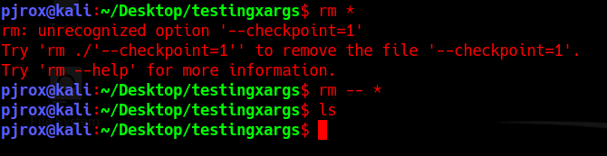

You can see the `rm` didn't interpreted the files inside directory as a flag when used `--` padding. Also before we move forward, I want to show one more thing...


Wutt? I gave the padding it still showed me an error. Hmm... Did you found what was the issue? Well even if you specify that padding to escape the flags there are '/'s inside this string, which are making `touch` to interpret them as create the file bash, inside `bin` directory that is inside, some `--checkpoint-action=exec=` directory. You may try using `\/bin\/bash` to escape the slashes, but that won't work either, because files can't contain slashes in their name.

We can easily bypass this by just using `bash` or `sh` instead of specifying the whole path, but make sure that your path is set to normal. Moving forward...

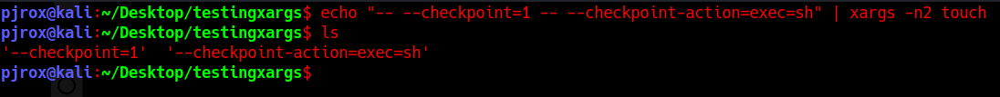

Focus on the `-n2` I used after `xargs`. 2 arguments at once, in first loop `touch -- --checkpoint=1`, then `touch -- --checkpoint-action=exec=sh`. Now let's try running `tar`.

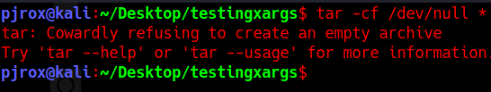

Ohh ok, I see where the problem occurred, those 2 flag files that we created were interpreted as flags and then `tar` had nothing to compress, that's not a problem, let's create a testfile...

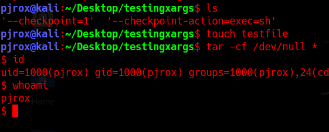

Bingo, we got a shell (not as root, because that was executed as my user. Could give us root, if ran as it).

Hope this last was a good example on `xargs` usage. Remember, `xargs` is a great command when it comes to handling command line arguments. It's not a very vast tool which you could dive in. Though it has max-ly covered all the areas in it's domain of passing and handling arguments to other modules/commands. Like a sidekick, this can help you ease your daily tasks. So keep a space for this tool in your arsenal.

---------------------------------------------------------------------------

#### File creation exercise

Hint: What did I told you about running multiple commands with xargs? Make sure you're using double quotes to answer the question (single quotes would work the same when using with the command; Though the answer format is in double quotes)

You're working in a team and your team leader sent you a list of files that needs to be created ASAP within current directory so that he can fake the synopsis report (that needs to be submitted within a minute or 2) to the invigilator and change the permissions to read-only to only you (Numberic representation). You can find the files list in the "one" folder.

Use the following flags in ASCII order:

- Verbose
- Take argument as "files"

```bash
┌──(kali㉿kali)-[/mnt/…/TryHackMe/Walkthroughs/Easy/Linux_Modules]
└─$ tar xvf xargs.tar 
xargs/
xargs/one/
xargs/one/file
xargs/flag.txt
xargs/two/
xargs/two/martinn
xargs/two/lewisn
xargs/two/maddien
<---snip--->

┌──(kali㉿kali)-[/mnt/…/TryHackMe/Walkthroughs/Easy/Linux_Modules]
└─$ cd xargs/one 

┌──(kali㉿kali)-[/mnt/…/Easy/Linux_Modules/xargs/one]
└─$ ls                         
file

┌──(kali㉿kali)-[/mnt/…/Easy/Linux_Modules/xargs/one]
└─$ head file    
2x2.jpg
2x2.png
AAAA.cpython-38.pyc
AAAA.py
_abnf.cpython-39.pyc
_abnf.py
__about__.cpython-38.pyc
__about__.cpython-39.pyc
__about__.py
acceptparse.cpython-38.pyc

┌──(kali㉿kali)-[/mnt/…/Easy/Linux_Modules/xargs/one]
└─$ wc -l file 
6225 file
```

Answer: `cat file | xargs -I files -t sh -c "touch files; chmod 400 files"`

#### Password dictionary exercise

Hint: Use single quotes; Just so you know, you can use 'echo word' to redirect it into a file.

Your friend trying to run multiple commands in one line, and wanting to create a short version of rockyou.txt, messed up by creating files instead of redirecting the output into "shortrockyou". Now he messed up his home directory by creating a ton of files. He deleted rockyou wordlist in that one liner and can't seem to download it and do all that long process again.

He now seeks help from you, to create the wordlist and remove those extra files in his directory. You being a pro in linux, show him how it's done in one liner way.

Use the following flags in ASCII order:

- Take argument as "word"
- Verbose
- Max number of arguments should be 1 in for each file

You can find the files for this task in two folder.

```bash
┌──(kali㉿kali)-[/mnt/…/Easy/Linux_Modules/xargs/one]
└─$ cd ../two  

┌──(kali㉿kali)-[/mnt/…/Easy/Linux_Modules/xargs/two]
└─$ ls -l | head
total 0
-rwxrwxrwx 1 root root 0 Jan 27  2021 0000000000n
-rwxrwxrwx 1 root root 0 Jan 27  2021 00000000n
-rwxrwxrwx 1 root root 0 Jan 27  2021 0000000n
-rwxrwxrwx 1 root root 0 Jan 27  2021 000000n
-rwxrwxrwx 1 root root 0 Jan 27  2021 000001n
-rwxrwxrwx 1 root root 0 Jan 27  2021 00000n
-rwxrwxrwx 1 root root 0 Jan 27  2021 007007n
-rwxrwxrwx 1 root root 0 Jan 27  2021 010101n
-rwxrwxrwx 1 root root 0 Jan 27  2021 010203n

┌──(kali㉿kali)-[/mnt/…/Easy/Linux_Modules/xargs/two]
└─$ ls -l | wc -l
4943
```

Answer: `ls | xargs -I word -n 1 -t sh -c 'echo word >> shortrockyou; rm word'`

#### Which flag to use to specify max number of arguments in one line

Answer: `-n`

#### How will you escape command line flags to positional arguments?

Answer: `--`

---------------------------------------------------------------------------

### Task 9: sort and uniq

This task is going to be a quick introduction to 2 very awesome commands: `uniq` and `sort`.

#### uniq command

- Unique command filters the output (from either a file or stdin) to remove any duplicates. Thus we get all unique lines and shorter output to focus on. This command greatly reduces stress on searching through file with repeated line outputs.
- There is one catch though, `uniq` command, ONLY, identifies the duplicate lines, if they are adjacent to each other. So you know why do we need a command to `sort` lines first.

#### sort command

`sort` command, as the name suggests sorts the lines alphabetically and numerically, automatically. All you got to do is pipe the stdin into `sort` command.

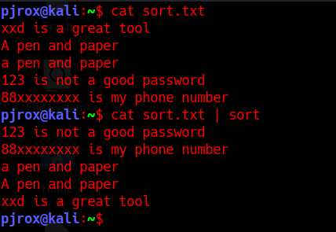

#### Important Flags for uniq

|Flags|Description|
|----|----|
|`-c`|To count the occurrences of every line in file or stdin|
|`-d`|Will only print the lines that are repeated, not the one which are unique|
|`-u`|Will only print lines that are already `uniq`|
|`-i`|Ignores case (Default is case-sensitive)|

#### Important Flags for sort

|Flags|Description|
|----|----|
|`-r`|Sorts in reverse order|
|`-c`|This flag is used to check whether the file is already sorted or not (If not, it will list, where the disorder started)|
|`-u`|To sort and removes duplicate lines (does work same as stdin redirected into `uniq`)|
|`-o save.txt`|To save into a output file|

And this is it for these 2 short commands. Now, if you want to remove any duplicate lines, a power combo would be sort the lines and then use `uniq` on the output.

`sort file.txt | uniq`

**IMPORTANT**: If you're not getting the correct answer for the following question, this could be because of this `$LANG` variable (that’s set during installation of your linux OS; when you choose the language to install and keyboard layout). The guided solution would be, change the value of `$LANG` variable to ‘en_US.UTF-8’. Your terminal will then output the results accurately.

`export LANG='en_US.UTF-8'`

---------------------------------------------------------------------------

#### Find the uniq items after sorting the file. What is the 2271st word in the output

Hint: Create a new file redirecting the sorted and unique words into it, then cat out with -n flag;

```bash
┌──(kali㉿kali)-[/mnt/…/TryHackMe/Walkthroughs/Easy/Linux_Modules]
└─$ export LANG='en_US.UTF-8'

┌──(kali㉿kali)-[/mnt/…/TryHackMe/Walkthroughs/Easy/Linux_Modules]
└─$ sort -u test.test | cat -n - | grep 2271
  2271  lollol
```

Answer: `lollol`

#### What was the index of term 'michele'

Hint: Grep the term

```bash
┌──(kali㉿kali)-[/mnt/…/TryHackMe/Walkthroughs/Easy/Linux_Modules]
└─$ sort -u test.test | cat -n - | grep michele
  2550  michele
```

Answer: `2550`

---------------------------------------------------------------------------

### Task 10: cURL

#### Intro

`cURL` (stands for crawl URL; It outputs the data of a URLs webpage in a raw format). Another amazing command to perform activities that you can do with your browser, in just a terminal way. You can't download cat pictures from a direct google search and right clicking > save the image. But with a little grepping and pattern matching iframes, that can be possible too. There are a lot of things that you can do with `curl`, ranging from getting an offline copy of a webpage (grepping the sensitive information later), to download V. large files or activating webshells (for a reverse connection) just by `curl`-ing the URL.

`curl` is a very easy command to use once you get hold of it's flags, rest is just self-explanatory.

**Syntax**: `curl https://google.com/`

#### Important Flags

|Flags|Description|
|----|----|
|`-#`|Will display a progress meter for you to know how much the download has progressed. (or use `--silent` flag for a silent crawl)|
|`-o`|Saves the file downloaded with the name given following the flag.|
|`-O`|Saves the file with the name it was saved on the server.|
|`-C -`|This flag can resume your broken download without specifying an offset.|
|`--limit-rate`|Limits the download/upload rate to somewhere near the specified range (Units in 100K,100M,100G)|
|`-u`|Provides user authentication (Format: `-u user:password`)|
|`-T`|Helps in uploading the file to some server (In our case php-reverse-shell)|
|`-x`|If you have to view the page through a PROXY. You can specify the proxy server with this flag. (`-x proxy.server.com -u user:password`(Authentication for proxy server))|
|`-I`|(Caps i) Queries the header and not the webpage.|
|`-A`|You can specify user agent to make request to the server|
|`-L`|Tells `curl` to follow redirects|
|`-b`|This flag allows you to specify cookies while making a `curl` request (Cookie should be in the format "NAME1=VALUE1;NAME2=VALUE2")|
|`-d`|This flag can be used to POST data to the server (generally used for posting form data).|
|`-X`|To specify the HTTP method on the URL. (GET,POST,TRACE,OPTIONS)|

#### Examples

- Continuing a download

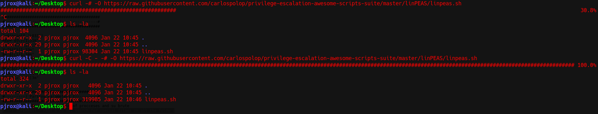

You can see that I continued the download by setting the `--continue-at <offset>` to a `-` (hyphen; which is to continue download by automatically identifying the offset)

- Saving the file with the name it was saved on the server.

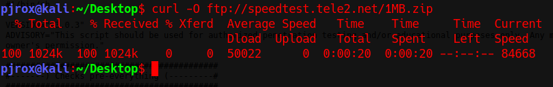

Yea my internet *****. That speed is in bytes.

#### Last notes

- Above shown table is just a list of v. few flags that can be used with `curl`. I encourage you to read the [man-page on curl](https://curl.se/docs/manpage.html) yourself.
- `curl` doesn't only work on HTTP/HTTPS/FTP protocol it works on Telnet, POP, IMAP and a lot more. You can find a complete list of protocols on it's man page or here(opens in new tab).
- Just a sidenote: You can use `curl` as an alternative to `wget`, while transferring privesc scripts from attack box to the host system.

#### Curl Resources

- [curl command in Linux with Examples - GeeksforGeeks](https://www.geeksforgeeks.org/curl-command-in-linux-with-examples/)
- [curl - How To Use](https://curl.se/docs/manpage.html)
- [15 Tips On How to Use 'Curl' Command in Linux (tecmint.com)](https://www.tecmint.com/linux-curl-command-examples/)

---------------------------------------------------------------------------

#### Which flag allows you to limit the download/upload rate of a file?

Answer: `--limit-rate`

#### How will you curl the webpage of `https://tryhackme.com/` specifying user-agent as 'juzztesting'

Answer: `curl -A 'juzztesting' https://tryhackme.com/`

#### Can curl perform upload operations?(Yea/Nah)

Answer: `Yea`

---------------------------------------------------------------------------

### Task 11: wget

You definitely have known the command line way of downloading stuff with `wget` (web-get) command, and thus this is gonna be a quick guide to that tool.

**Syntax**: `wget protocol://url.com/`

#### Important Flags

|Flags|Description|
|----|----|
|`-b`|To background the downloading process|
|`-c`|To continue to the partially downloaded file (It will look for the partially downloaded file in the directory and starts appending; takes no argument)|
|`-t int`|To specify retries to the URL|
|`-O download.txt`|To specify the output name of downloaded file|
|`-o file`|To overwrite the logs into another file|
|`-a file`|To append the logs into already existing file without deleting previous contents|
|`-i file`|Read the list of URLs from a file.|
|`--user=username`|To give a login username (Use `--ftp-user` and `--http-user` if doesn't work)|
|`--password=password`|To give a login password ( Use `--ftp-password` and `--http-password` if doesn't work)|
|`--ask-password`|Ask for a password prompt if a login is necessary. (I recommend using this flag instead of `--password` because there are chances that password might start with `$` or something else that can be interpreted as something else in your terminal)|
|`--limit-rate=10k`|Similarly to `curl` (supports k and m notation for kB and mB respectively)|
|`-w=<int>`|This is to specify the waiting time before the retrieval from a URL. (Takes time in seconds)|
|`-T=<int>`|Timeout the retrieval after a specified amount of time. (Takes time in seconds)|
|`-N`|Enables timestamping|
|`-U`|To specify the user-agent while downloading the file|

**Note**: `wget` supports ftp, http and https. There are a lot more flags than the current list, check out the [man page](https://www.gnu.org/software/wget/manual/wget.html) online to read more about it.

#### Examples

- Downloading a file with different name

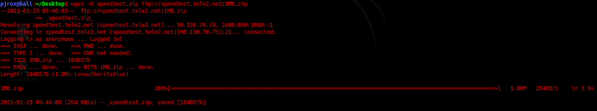

- Specifying logfile as `log.txt` with timestamping enabled

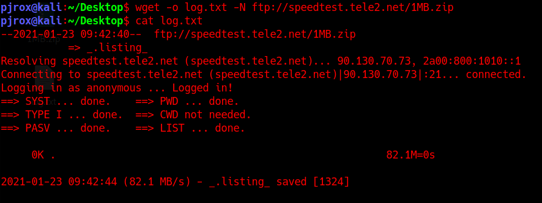

---------------------------------------------------------------------------

#### How will you enable time logging at every new activity that this tool initiates?

Answer: `N`

#### What command will you use to download `https://xyz.com/mypackage.zip` using `wget`, appending logs to an existing file named "package-logs.txt"

Answer: `wget -a package-logs.txt https://xyz.com/mypackage.zip`

#### Write the command to read URLs from "file.txt" and limit the download speed to 1mbps

Answer: `wget -i file.txt --limit-rate=1m`

---------------------------------------------------------------------------

### Task 12: xxd

`xxd`, which is well known for hexdumps or even the reverse. This command is not very vast to explore, but still knowing this command thoroughly will help you handling hex strings and hex digits. Whether you're playing ctfs, or bypassing JWT with automation, `xxd` can do it all. This command can take input from a file or the input can be passed through piping or redirection.

#### Important Flags

|Flags|Description|
|----|----|
|`-b`|will give binary representation instead of hexdump|
|`-E`|Change the character encoding in the right hand column from ASCII to EBCDIC (Feel free to leave this flag if you don't know about BCD notation)|
|`-c int`|Sets the number of bytes to be represented in one row. (i.e. setting the column size in bytes; Default to 16)|
|`-g`|This flag is to set how many bytes/octets should be in a group i.e. separated by a whitespace (default to 2 bytes; Set `-g0` if no space is needed).|
|`-i`|To output the hexdump in C include format ('0xff' integers)|
|`-l`|Specify the length of output (if the string is bigger than the length specified, hex of the rest of the string will not be printed)|
|`-p`|Second most used flag; Converts the string passed into plain hexdump style (continuous string of hex bytes)|
|`-r`|Most used flag, will revert the hexdump to binary (Interpreted as plain text).|
|`-u`|Use uppercase hex letters (default is lower case)|
|`-s`|seek at offset (will discuss this in a little brief in examples)|

Just in case if you been wondering `-g` flag sets the number of bytes in one column of a row and `-c` flags sets the number of bytes in one row. Now, if `-g` is set to 10 but `-c` is set to 9 (means bytes specified in one row is less than the size of a group), then there will only be one column and the group size will fall back to the limit specified by the column bytes. `-c` flag precedes over `-g`.

#### Examples

- Use of `-E` flag (For curious minds)

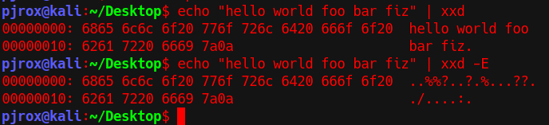

Also, just so you know EBCDIC is Extended Binary Coded Decimal Interchange.

- Output in binary and C include format

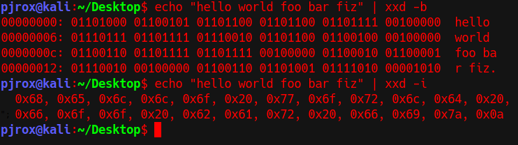

- Specifying a length

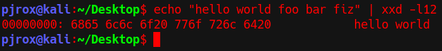

Note that, rest of the words got discarded as the length was only 12 bytes (which included space at the end #0x20)

- Seeking an offset

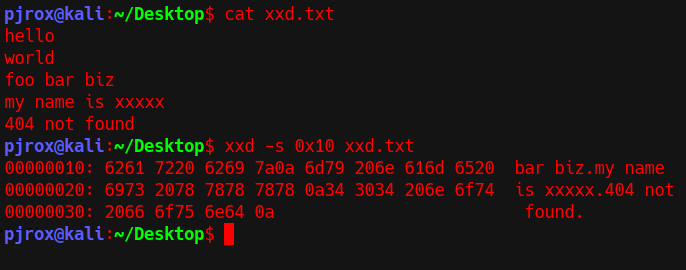

Notice that the output seeked at the 0x10th (16th) byte and started dumping the file.

- Seeking at offset from the end of the file.

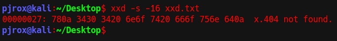

Just by appending the offset's value with a hyphen the command starts dumping from the **end of the file**.

**Sidenote**: There is a difference between `-s +offset` and `-s offset` while seeking through stdin. I am not gonna go in brief explaining the difference just keep in mind that if there is error while seeking offset through stdin, try redirecting stdin to a file and then perform hexdump with xxd that might solve your problem.

---------------------------------------------------------------------------

#### How will you seek at 10th byte(in hex) in file.txt and display only 50 bytes?

Unclear, the question doesn't say anything about binary output!

Answer: `xxd -s 0xa -l 50 -b file.txt`

#### How to display a n bytes of hexdump in 3 columns with a group of 3 octets per row from file.txt? (Use flags alphabetically)

The mention of `n bytes of hexdump` is confusing.

Answer: `xxd -c 9 -g 3 file.txt`

#### Which has more precedence over the other -c flag or -g flag?

Answer: `-c`

#### Download the file and find the value of flag

```bash
┌──(kali㉿kali)-[/mnt/…/TryHackMe/Walkthroughs/Easy/Linux_Modules]
└─$ xxd -r -p flag.txt 
flag{<REDACTED>}
```

Answer: `flag{<REDACTED>}`

---------------------------------------------------------------------------

### Task 13: Other modules

Let's start with the commands I found after doing a `| sort | uniq` search on the first word on every line in my `~/.bash_history` (31337 commands got listed. This task won't include nmap/gobuster commands, because that's not what this room is about).

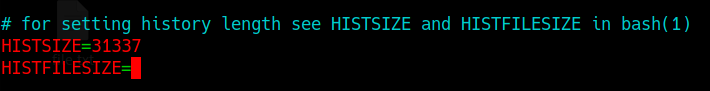

In case you're wondering, how I got custom `.bash_history` size, I edited my `.bashrc` file in home directory.

#### gpg command

**Sidenote**: GPG (Gnu Privacy Guard) and PGP (Pretty Good Privacy) are 2 different types of encryption. PGP is based on RSA encryption, whereas GPG (open-source) is a re-write of PGP and by default uses AES encryption.

You should be knowing about PGP and GPG keys when you find a file encrypted with GPG encryption. Thus below are some resources to easily know more about `gpg`: the command line tool.

#### Gpg Resources

- [gpg - Unix, Linux Command - Tutorialspoint](https://www.tutorialspoint.com/unix_commands/gpg.htm)
- [GPG Cheat Sheet (hawaii.edu)](http://irtfweb.ifa.hawaii.edu/~lockhart/gpg/)

#### tar command

Whether if it is a gzip archive or a bzip archive, encrypting and decrypting can be easily done by this tool. Do check out the man page for tar `man tar`.

#### Tar Resources

- [Linux Tar Commands Cheatsheet | Never Ending Security (wordpress.com)](https://neverendingsecurity.wordpress.com/2015/04/13/linux-tar-commands-cheatsheet/)
- [tar command in Linux with examples - GeeksforGeeks](https://www.geeksforgeeks.org/tar-command-linux-examples/)

#### id/pwd/uname commands

Let's not forget the legends that we deploy on the battlefield after getting init shell access on a machine.

#### ps/kill commands

List processes, and kill processes with PID. To know more about ps command you can find some help [here](https://man7.org/linux/man-pages/man1/ps.1.html).

#### netstat command

- This amazing command lists any network activity on the current system. Any ports that are open/listening/not-established, connection can be listed using this command.
- Make sure to check out this command's man page and read more about this.
- Also know this, that there is an alternate to `netstat` command which does the pretty much same as `netstat`, i.e. `ss` (socket statistics) command(lists port activity in real time).

#### Netstat/Ss Resources

- [Ultimate Netstat Cheat Sheet - Master Netstat in 20 Minutes (rekha.com)](https://www.rekha.com/netstat-cheat-sheet-for-newbies.html)
- [netstat(8) - Linux man page (die.net)](https://linux.die.net/man/8/netstat)
- [SS – Socket Statistics Commands Cheatsheet | Never Ending Security (wordpress.com)](https://neverendingsecurity.wordpress.com/2015/04/13/ss-socket-statistics-commands-cheatsheet/)

#### less/more commands

- These are another 2 awesome commands that offer an alternate to open and read the file. What's the difference? `more` is an old command and `less` was built to better the `more` command. `More` on one hand has limited backward scrolling, whereas as `less` has forward and backward navigation including better search options (`/`).
- Again, `more` is lovely in it's own way, I remember I got shell while doing a box from [vulnhub](https://vulnhub.com/) using `more` command (that ssh shell was keep exiting after a successful login, I piped the session in `more` command and got shell through `!/bin/sh`. That challenge was something like, reduce your term size to only one line and open the ssh session piping into `more` command and then run `!/bin/sh` in `more`'s command pallete, which I can't seem to re-create now). Sadly, I don't remember the box anymore. If you remember the box somehow, reach out to me please.
- There is one `more` command which was created to improve some of `less` features, `most` command; It is not installed by default on some linux distros, you can install it with `sudo apt install most`.

#### Less/More Resources

- [The Difference Between more, less And most Commands - OSTechNix](https://ostechnix.com/the-difference-between-more-less-and-most-commands/)
- [Less and More command (Explained)](https://www.tecmint.com/linux-more-command-and-less-command-examples/#:~:text=Learn%20Linux%20%27less%27%20Command,using%20page%20up%2Fdown%20keys.)

#### diff command

- At the very basic of it's use, this command compares the character byte-by-byte and tries to find what is the difference between 2 files. Though this can ONLY compare 2 files at a time. Wanna learn more about this command, checkout resources.
- There is also another command known as `comm`. This command compares 2 sorted files line by line. As `diff` tries to find any difference between the files, `comm` is more focused to find out what is common in between 2 files. Checkout resources to learn more.

#### Diff/Comm Resources

- [Comparing files and directories with the diff and comm Linux commands | Network World](https://www.networkworld.com/article/3279724/comparing-files-and-directories-with-diff-and-comm.html#:~:text=The%20diff%20command%20would%20make,both%20commands%20is%20the%20same.&text=The%20comm%20command%20can%20provide,it%20can%20compare%20two%20files.)
- [diff command in Linux with examples - GeeksforGeeks](https://www.geeksforgeeks.org/diff-command-linux-examples/)
- [comm command in Linux with examples - GeeksforGeeks](https://www.geeksforgeeks.org/comm-command-in-linux-with-examples/)

#### base64 command

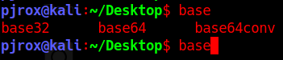

Why go to online sites when you can decode base32 and base64 at your own terminal.

#### tee command

- Ever wondered, that you want to view the output in real-time and save the output in a file at the same time? Well standard redirection doesn't allow that. No worries, `tee` command is to the rescue. It reads from stdin and writes to the stdout and files as well.
- A small handy tool that I use every time with linpeas to read my script results in real time and also saving the output at the machine's `/tmp` directory.

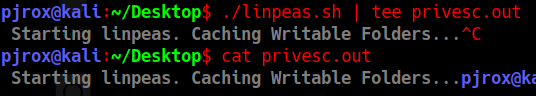

You can use it with `-a` flag to don't overwrite an existing file instead just append some more.

#### file/stat commands

`File` command reads the file headers and tells you what the file actually is (inspite of what extension is used). Similarly is `stat` command, which gives you a file's/file system's status.

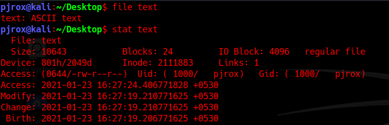

#### export command

This command is used to set the environment variables (The variables that got set whenever a shell/user session is opened). You can read more about this command through [here](https://www.geeksforgeeks.org/export-command-in-linux-with-examples/).

#### reset command

Say if your terminal is not working properly, any problem is occurring, but you can't afford to close the shell, you're just one `reset` command away to get your shell back to normal.

#### systemctl/service command

- `service` command is a normal command to initialize services present in `/etc/init.d`, without making an admin worrying too much about the permanent system changes, `systemctl` on the other hand is a heavy command (doing pretty much the same job, just on systemd's level; systemd is a service manager in linux systems) which can hinder with the default settings. For eg. services initialized by `systemctl` stays in systemd's directory (directory which holds what program to run when a linux system boots up). Thus the programs initialized by `systemctl` boots up with system.
- With `service` you can only use commands related to that particular service (reload, start, stop, status etc), and with a powerful tool like `systemctl`, you get to control the state of "systemd" system and service manager.

**Note**: If you don't know what you're doing, try using `service` instead, to avoid any unwanted service to stop/disable/masked, which might not fix even on a fresh boot up. Backing up your important files has always been a good habit.

#### Systemctl/Service References

- [Difference between Systemctl and service command - Stack Overflow](https://stackoverflow.com/questions/43537851/difference-between-systemctl-and-service-command#:~:text=service%20operates%20on%20the%20files,file%20in%20%2Fetc%2Finit.)
- [Systemctl Cheatsheet (github.com)](https://gist.github.com/adriacidre/307d2f9f5179fc748f22edac5af3d218) (A small cheatsheet you wanna read before working with systemctl).

---------------------------------------------------------------------------

#### It's safe to run systemctl command and experiment on your main linux system neither following a proper guide or having any prior knowledge? (Right/Wrong)

Answer: `Wrong`

#### How will you import a given PGP private key. (Suppose the name of the file is key.gpg)

Answer: `gpg --import key.gpg`

#### How will you list all port activity if netstat is not available on a machine? (Full Name)

Answer: `Socket Statistics`

#### What command can be used to fix a broken/irregular/weird acting terminal shell?

Answer: `reset`

---------------------------------------------------------------------------

### Task 14: Is it night yet?

First of all congratulations to make it this far. N hey, you actually did it. Getting to know so many modules isn't easy... (Take it from a person who spent about a month on getting these things done). Especially strops is a topic that you should practice big time. It's hard to get things completely at start, but once you have the foundation built with the tools discussed above, it's really nothing. So just keep going, it's all worth it.

Y0u. C4n. D0. 1t.

---------------------------------------------------------------------------

For additional information, please see the references below.

## References

- [15 Tips On How to Use 'Curl' Command in Linux - tecmint.com](https://www.tecmint.com/linux-curl-command-examples/)
- [15 Useful 'sed' Command Tips and Tricks for Daily Linux System Administration Tasks - tecmint.com](https://www.tecmint.com/linux-sed-command-tips-tricks/)
- [awk - Linux manual page](https://man7.org/linux/man-pages/man1/awk.1p.html)
- [AWK - Workflow - Tutorialspoint](https://www.tutorialspoint.com/awk/awk_workflow.htm)
- [AWK command in Unix/Linux with examples - GeeksforGeeks](https://www.geeksforgeeks.org/awk-command-unixlinux-examples/)
- [Basic vs Extended Regular Expressions - grep manual page](https://www.gnu.org/software/grep/manual/html_node/Basic-vs-Extended.html)
- [comm - Linux manual page](https://man7.org/linux/man-pages/man1/comm.1.html)
- [comm command in Linux with examples - GeeksforGeeks](https://www.geeksforgeeks.org/comm-command-in-linux-with-examples/)
- [Comparing files and directories with the diff and comm Linux commands | Network World](https://www.networkworld.com/article/3279724/comparing-files-and-directories-with-diff-and-comm.html#:~:text=The%20diff%20command%20would%20make,both%20commands%20is%20the%20same.&text=The%20comm%20command%20can%20provide,it%20can%20compare%20two%20files.)
- [curl - Homepage](https://curl.se/)
- [curl - Linux manual page](https://man7.org/linux/man-pages/man1/curl.1.html)
- [cURL - Wikipedia](https://en.wikipedia.org/wiki/CURL)
- [curl command in Linux with Examples - GeeksforGeeks](https://www.geeksforgeeks.org/curl-command-in-linux-with-examples/)
- [curl - How To Use](https://curl.se/docs/manpage.html)
- [diff - Linux manual page](https://man7.org/linux/man-pages/man1/diff.1.html)
- [diff command in Linux with examples - GeeksforGeeks](https://www.geeksforgeeks.org/diff-command-linux-examples/)
- [Difference between Systemctl and service command - Stack Overflow](https://stackoverflow.com/questions/43537851/difference-between-systemctl-and-service-command#:~:text=service%20operates%20on%20the%20files,file%20in%20%2Fetc%2Finit.)
- [du - Linux manual page](https://man7.org/linux/man-pages/man1/du.1.html)
- [gawk - Linux manual page](https://man7.org/linux/man-pages/man1/gawk.1.html)
- [GNU Privacy Guard - Wikipedia](https://en.wikipedia.org/wiki/GNU_Privacy_Guard)
- [GPG Cheat Sheet - hawaii.edu](http://irtfweb.ifa.hawaii.edu/~lockhart/gpg/)
- [gpg - Linux manual page](https://linux.die.net/man/1/gpg)
- [gpg - Unix, Linux Command - Tutorialspoint](https://www.tutorialspoint.com/unix_commands/gpg.htm)
- [grep - Linux manual page](https://man7.org/linux/man-pages/man1/grep.1.html)
- [less - Linux manual page](https://man7.org/linux/man-pages/man1/less.1.html)
- [Less and More command (Explained)](https://www.tecmint.com/linux-more-command-and-less-command-examples/#:~:text=Learn%20Linux%20%27less%27%20Command,using%20page%20up%2Fdown%20keys.)
- [more - Linux manual page](https://man7.org/linux/man-pages/man1/more.1.html)
- [netstat - Linux manual page](https://man7.org/linux/man-pages/man8/netstat.8.html)
- [Netstat Cheat Sheet - Master Netstat in 20 Minutes (rekha.com)](https://www.rekha.com/netstat-cheat-sheet-for-newbies.html)
- [sed - Linux manual page](https://man7.org/linux/man-pages/man1/sed.1.html)
- [sed, a stream editor - gnu.org](https://www.gnu.org/software/sed/manual/sed.html)
- [Sed Command in Linux/Unix with examples - GeeksforGeeks](https://www.geeksforgeeks.org/sed-command-in-linux-unix-with-examples/)
- [sort - Linux manual page](https://man7.org/linux/man-pages/man1/sort.1.html)
- [systemctl - Linux manual page](https://www.man7.org/linux/man-pages/man1/systemctl.1.html)
- [Systemctl Cheatsheet - github.com](https://gist.github.com/adriacidre/307d2f9f5179fc748f22edac5af3d218)
- [tar - Linux manual page](https://man7.org/linux/man-pages/man1/tar.1.html)
- [Tar Commands Cheatsheet - Never Ending Security](https://neverendingsecurity.wordpress.com/2015/04/13/linux-tar-commands-cheatsheet/)
- [tar command in Linux with examples - GeeksforGeeks](https://www.geeksforgeeks.org/tar-command-linux-examples/)
- [The Difference Between more, less And most Commands - OSTechNix](https://ostechnix.com/the-difference-between-more-less-and-most-commands/)
- [The printf statement in awk](http://osr5doc.xinuos.com/en/OSUserG/_The_printf_statement.html)
- [tr - Linux manual page](https://man7.org/linux/man-pages/man1/tr.1.html)
- [tr command in Unix/Linux with examples - GeeksforGeeks](https://www.geeksforgeeks.org/tr-command-in-unix-linux-with-examples/)
- [Tr Command in Linux with Examples - Linuxize](https://linuxize.com/post/linux-tr-command/)
- [uniq - Linux manual page](https://man7.org/linux/man-pages/man1/uniq.1.html)
- [wget - Linux manual page](https://man7.org/linux/man-pages/man1/wget.1.html)
- [xargs - Linux manual page](https://www.man7.org/linux/man-pages/man1/xargs.1.html)
