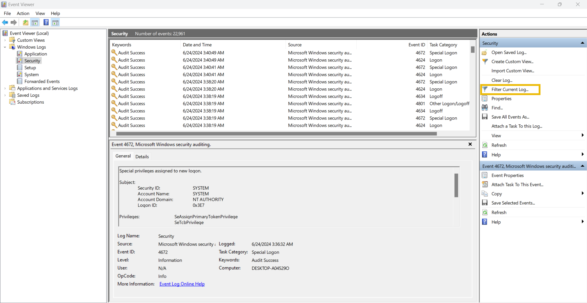
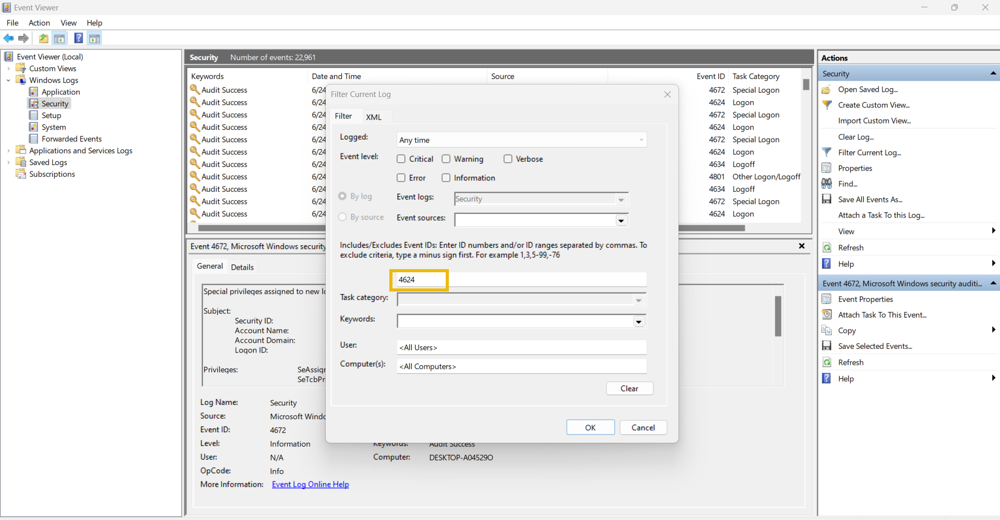

# Logs Fundamentals

- [Room information](#room-information)
- [Solution](#solution)
- [References](#references)

## Room information

```text
Type: Walkthrough
Difficulty: Easy
OS: N/A
Subscription type: Premium
Description: Learn what logs are and how to analyze them for effective investigation.
```

Room link: [https://tryhackme.com/room/logsfundamentals](https://tryhackme.com/room/logsfundamentals)

## Solution

### Task 1 - Introduction to Logs

Attackers are clever. They avoid leaving maximum traces on the victim’s side to avoid detection. Yet, the security team successfully determines how the attack was executed and is even sometimes successful in finding who was behind the attack.

Suppose a few policemen are investigating the disappearance of a precious locket in a snowy jungle cabin. They observed that the wooden door of the cabin was brutally damaged, and the ceiling collapsed. There were some footprints on the snowy path to that cabin. Lastly, they discovered some CCTV footage from a neighbouring residence. By placing together all these traces, the police successfully determined who was behind the attack. Various traces are found in several such cases; putting all these together takes you closer to the criminal.

It seems like these traces play a big role in the investigations.

What if something happened within a digital device? Where do we find all these traces to investigate further?

There are various places inside a system where the traces of an attack could be fetched. The logs contain most of these traces. Logs are the digital footprints left behind by any activity. The activity could be a normal one or the one with malicious intent. Tracing down the activity and the individual behind the execution of that activity becomes easier through logs.

#### Use Cases of Logs

The following are some key areas in which the logs play an integral role.

| Use Case | Description |
|----|----|
|Security Events Monitoring|Logs help us detect anomalous behavior when real-time monitoring is used.|
|Incident Investigation and Forensics|Logs are the traces of every kind of activity. It offers detailed information on what happened during the incident. The security team utilizes the logs to perform root cause analysis of incidents.|
|Troubleshooting|As the logs also record the errors in systems or applications, they can be used to diagnose issues and helpful in fixing them.|
|Performance Monitoring|Logs can also provide valuable insights into the performance of applications.|
|Auditing and Compliance|Logs play a major role in Auditing and Compliance, making it easier with its capability to establish a trail of different kinds of activities.|

This room will equip you with an understanding of various types of logs maintained in different systems. We will also be practically investigating logs as traces of different attacks.

#### Learning Objectives

After completing this room, you will learn about the following:

- The different types of logs
- How to analyze logs
- Analyzing Windows Event logs
- Analyzing Web Access logs

#### Where can we find the majority of attack traces in a digital system?

Answer: Logs

### Task 2 - Types of Logs

In the previous task, we saw various use cases of logs. But there is a challenge. Imagine you have to investigate an issue in a system through the logs; you open the log file of that system, and now you are lost after seeing numerous events of different categories.

Here is the solution: Logs are segregated into multiple categories according to the type of information they provide. So now you just need to look into the specific log file for which the issue relates.

For example, you need to investigate the successful logins from yesterday at a specific timeframe in Windows OS. Instead of looking into all the logs, you only need to see the system’s **Security Logs** to find the login information. We also have other types of logs that are useful in investigating different incidents. Let’s have a look at them.

| Log Type | Usage | Example |
|----|----|----|
|System Logs|The system logs can be helpful in troubleshooting running issues in the OS. These logs provide information on various operating system activities.|System Startup and shutdown events, Driver Loading events, System Error events, Hardware events|
|Security Logs|The security logs help detect and investigate incidents. These logs provide information on the security-related activities in the system.|Authentication events, Authorization events, Security Policy changes events, User Account changes events, Abnormal Activity events|
|Application Logs|The application logs contain specific events related to the application. Any interactive or non-interactive activity happening inside the application will be logged here.|User Interaction events, Application Changes events, Application Update events, Application Error events|
|Audit Logs|The Audit logs provide detailed information on the system changes and user events. These logs are helpful for compliance requirements and can play a vital role in security monitoring as well.|Data Access events, System Change events, User Activity events, Policy Enforcement events|
|Network Logs|Network logs provide information on the network’s outgoing and incoming traffic. They play crucial roles in troubleshooting network issues and can also be handy during incident investigations.|Incoming Network Traffic events, Outgoing Network Traffic events, Network Connection Logs, Network Firewall Logs|
|Access Logs|The Access logs provide detailed information about the access to different resources. These resources can be of different types, providing us with information on their access.|Webserver Access Logs, Database Access Logs, Application Access Logs, API Access Logs|

Note: There can be various other types of logs depending on the different applications and the services they provide.

Now that we understand what these logs are and how various types of logs can be helpful in different scenarios, let’s see how we analyze these logs and extract valuable information required from them. Log Analysis is a technique for extracting valuable data from logs. It involves looking for any signs of abnormal or unusual activities. Searching for a specific activity or abnormalities in the logs with the naked eye is impossible. For this reason, we have several manual and automated techniques for log analysis. We will manually carry out log analysis on Windows and Web Server Access Logs in the upcoming tasks.

#### Which type of logs contain information regarding the incoming and outgoing traffic in the network?

Answer: Network Logs

#### Which type of logs contain the authentication and authorization events?

Answer: Security Logs

### Task 3 - Windows Event Logs Analysis

Like other operating systems, Windows OS also logs many of the activities that take place. These are stored in segregated log files, each with a specific log category. Some of the crucial types of logs stored in a Windows Operating System are:

- **Application**: There are many applications running on the operating system. Any information related to those applications is logged into this file. This information includes errors, warnings, compatibility issues, etc.
- **System**: The operating system itself has different running operations. Any information related to these operations is logged in the System log file. This information includes driver issues, hardware issues, system startup and shutdown information, services information, etc.
- **Security**: This is the most important log file in Windows OS in terms of security. It logs all security-related activities, including user authentication, changes in user accounts, security policy changes, etc.
Besides these, several other log files in the Windows operating system are designed for logging activities related to specific actions and applications.

Unlike other log files studied in the previous tasks, which had no built-in application to view them, Windows OS has a utility known as Event Viewer, which gives a nice graphical user interface to view and search for anything in these logs.

To open Event Viewer, click on the Start button of Windows and type ‘Event Viewer’. It will open the Event Viewer for you, as shown below. The highlighted area in the screenshot below shows the different available logs.


You can click ‘Windows Logs’ from the highlighted section to see the different types of logs we discussed at the beginning of this task. 
The first highlighted portion shows the different log files. When we click one of these log files, we will see the different logs, as can be seen in the second highlighted portion. Lastly, in the third highlighted portion, we have different options for analyzing the logs.


Let’s double-click on one of these logs to see its contents.


This is how a Windows event log looks. It has different fields. The major fields are discussed below:

- **Description**: This field has a detailed information of the activity.
- **Log Name**: The Log Name indicates the log file name.
- **Logged**: This field indicates the time of the activity.
- **Event ID**: Event IDs are unique identifiers for a specific activity.

Numerous event IDs are available in Windows event logs. We can use these event IDs to search for any specific activity. For example, event ID 4624 uniquely identifies the activity of a successful login, so you only need to search for this event ID 4624 when investigating successful logins.

Here is a table of some important Event IDs in Windows Operating System.

| Event ID | Description |
|----|----|
|4624|A user account successfully logged in|
|4625|A user account failed to login|
|4634|A user account successfully logged off|
|4720|A user account was created|
|4724|An attempt was made to reset an account’s password|
|4722|A user account was enabled|
|4725|A user account was disabled|
|4726|A user account was deleted|

There are many more event IDs. It is not necessary to remember all of them, but it is good to remember the crucial event IDs.

Event Viewer allows us to search for the logs related to a specific event ID with its ‘Filter Current Log’ feature. We can click on this feature to apply any filter.



When we click on the ‘Filter Current Log’ option, we will be prompted to enter the event IDs we want to filter. In the screenshot below, I filtered the event ID 4624.



Once I hit the 'OK' button, I can see all the logs with the event ID: 4624. I can now view any of these logs by double-clicking them.

#### Exercise

On Friday, a critical organization reported being a victim of a cyber attack. Upon investigation, critical data was exfiltrated from a file server in the organization’s network. The security team was successful in determining the user name and IP address of the compromised system in the network, which had access to the file server at the time of the attack.

You are tasked to find out the activities of the attacker in this compromised system before he took access to the file server.

First, let’s start the Virtual Machine by pressing the **Start Machine** button given below. The machine will start in **Split-Screen** view.

You can also connect with the machine via VPN using the RDP credentials given below.

- Username: Administrator
- Password: logs@123
- IP: 10.10.7.154

#### What is the name of the last user account created on this system?

1. Run Event Viewer as Administrator.
2. Search for EID 4720 ()`A user account was created`) in the Security Log.
3. There are 3 events found in the log but the `SAM Account Name` is the same for all of them (`hacked`).

Answer: hacked

#### Which user account created the above account?

Hint: See the 'Subject' details inside the user account creation log.

1. Check `Account Name` under `Subject` which is `Administrator`.

Answer: Administrator

#### On what date was this user account enabled? Format: M/D/YYYY

Answer: 6/7/2024

#### Did this account undergo a password reset as well? Format: Yes/No

1. Check for EID 4724 (`An attempt was made to reset an account’s password`) events

Answer: Yes

### Task 4 - Web Server Access Logs Analysis

We interact with many websites daily. Sometimes, we just want to view the website, and sometimes, we want to log in or upload a file into any available input field. These are just different kinds of requests we make to a website. All these requests are logged by the website and stored in a log file on the web server running that website.

This log file contains all the requests made to the website along with the information on the timeframe, the IP requested, the request type, and the URL. Following are the fields taken from a sample log from an Apache web server access log file which can be found in the directory: `/var/log/apache2/access.log`

- **IP Address**: “172.16.0.1” - The IP address of the user who made the request.
- **Timestamp**: “[06/Jun/2024:13:58:44]” - The time when the request was made to the website.
- **Request**: The request details.
  - **HTTP Method**: “GET” - Tells the website what action to be performed on the request.
  - **URL**: “/” - The requested resource.
- **Status Code**: “200” - The response from the server. Different numbers indicate different response results.
- **User-Agent**: “Mozilla/5.0 (Macintosh; Intel Mac OS X 10_12_3) AppleWebKit/537.36 (KHTML, like Gecko) Chrome/58.0.3029.110 Safari/537.36” - Information about the user’s Operating System, browser, etc. when making the request.

We can perform manual log analysis by using some command line utilities in the Linux operating system. The following are some commands that can be useful during manual log analysis.

`cat` is a popular utility for displaying the contents of a text file. We can use the cat command to display the contents of a log file, as they are typically in the text format.

```bash
root@kali$ cat access.log
172.16.0.1 - - [06/Jun/2024:13:58:44] "GET /products HTTP/1.1" 404 "-" "Mozilla/5.0 (Windows NT 10.0; Win64; x64) AppleWebKit/537.36 (KHTML, like Gecko) Chrome/58.0.3029.110 Safari/537.36"
10.0.0.1 - - [06/Jun/2024:13:57:44] "GET / HTTP/1.1" 404 "-" "Mozilla/5.0 (Macintosh; Intel Mac OS X 10_12_3) AppleWebKit/537.36 (KHTML, like Gecko) Chrome/58.0.3029.110 Safari/537.36"
192.168.1.1 - - [06/Jun/2024:13:56:44] "GET /about HTTP/1.1" 500 "-" "Mozilla/5.0 (Windows NT 10.0; Win64; x64) AppleWebKit/537.36 (KHTML, like Gecko) Chrome/58.0.3029.110 Safari/537.36"
```

Most systems rotate the logs regularly. This rotation helps them create individual log files for specific timeframes and not carry them all in a single log file. But sometimes, we may need to combine two log files. The cat command-line utility can also be helpful in this case. We can combine the results of multiple files within one single file, as shown below.

```bash
root@kali$ cat access1.log access2.log > combined_access.log
```

`grep` is a very useful command line utility that allows you to search for strings and patterns inside a log file. For example, you may need to search if a specific IP address is present in your log file. You can do this by using the following command: The following command will search the access.log file for the string ‘192.168.1.1’ and display all the lines with this string.

```bash
root@kali$ grep "192.168.1.1" access.log
192.168.1.1 - - [06/Jun/2024:13:56:44] "GET /about HTTP/1.1" 500 "-" "Mozilla/5.0 (Windows NT 10.0; Win64; x64) AppleWebKit/537.36 (KHTML, like Gecko) Chrome/58.0.3029.110 Safari/537.36"
192.168.1.1 - - [06/Jun/2024:13:53:44] "GET /products HTTP/1.1" 404 "-" "Mozilla/5.0 (Windows NT 10.0; Win64; x64) AppleWebKit/537.36 (KHTML, like Gecko) Chrome/58.0.3029.110 Safari/537.36"
192.168.1.1 - - [06/Jun/2024:13:46:44] "GET /about HTTP/1.1" 200 "-" "Mozilla/5.0 (Windows NT 10.0; Win64; x64) AppleWebKit/537.36 (KHTML, like Gecko) Chrome/58.0.3029.110 Safari/537.36"
```

The `less` command is helpful for handling multiple log files. You may need to analyze specific chunks one by one. For this, you can use the less command-line utility, which helps you view one page at a time.

```bash
root@kali$ less access.log
172.16.0.1 - - [06/Jun/2024:13:52:44] "GET /products HTTP/1.1" 404 "-" "Mozilla/5.0 (Windows NT 6.1; Win64; x64) AppleWebKit/537.36 (KHTML, like Gecko) Chrome/58.0.3029.110 Safari/537.36"
10.0.0.1 - - [06/Jun/2024:13:48:44] "GET /about HTTP/1.1" 404 "-" "Mozilla/5.0 (Windows NT 6.1; Win64; x64) AppleWebKit/537.36 (KHTML, like Gecko) Chrome/58.0.3029.110 Safari/537.36"
192.168.1.1 - - [06/Jun/2024:13:46:44] "GET /about HTTP/1.1" 200 "-" "Mozilla/5.0 (Windows NT 10.0; Win64; x64) AppleWebKit/537.36 (KHTML, like Gecko) Chrome/58.0.3029.110 Safari/537.36"
:
```

Use `spacebar` to move to the next page and `b` to the previous page.

After running this command, the logs would be displayed in pages, one after one, making it easy for manual analysis. If you wish to search for something in the logs, you can type `/` followed by the pattern you are searching for and hit enter.

Use `n` to navigate to the next occurrence of your search and `N` to navigate to the previous occurrence of your search.

A sample web server access log file is given in this task. Download the file by clicking the button “Download Task Files” below.

However, we have also added the log file to the AttackBox for your convenience. To follow along, press the **Start AttackBox** button at the top of the page. The AttackBox will open in split view. If it is not showing up, you can press the Show Split View button at the top of the page. You can find the "`access.log`" file in the following directory: `/root/Rooms/logs`

Use the manual log analysis commands discussed above to answer the questions given below.

Note: If you are downloading the log file for the analysis, some browsers like Chrome would block downloading it because it contains IP addresses, URLs, and User agent strings that may be flagged as malicious by their security mechanisms. You can click “Keep file” or any other alternative option available in your browser after it blocks the download.

#### What is the IP which made the last GET request to URL: “/contact”?

```bash
┌──(kali㉿kali)-[/mnt/…/TryHackMe/Walkthroughs/Easy/Logs_Fundamentals]
└─$ grep '/contact' access.log | grep GET
10.0.0.1 - - [06/Jun/2024:13:54:44] "GET /contact HTTP/1.1" 500 "-" "Mozilla/5.0 (Macintosh; Intel Mac OS X 10_12_3) AppleWebKit/537.36 (KHTML, like Gecko) Chrome/58.0.3029.110 Safari/537.36"
172.16.0.1 - - [06/Jun/2024:13:53:44] "GET /contact HTTP/1.1" 500 "-" "Mozilla/5.0 (Macintosh; Intel Mac OS X 10_12_3) AppleWebKit/537.36 (KHTML, like Gecko) Chrome/58.0.3029.110 Safari/537.36"
192.168.1.1 - - [05/Jun/2024:16:51:44] "GET /contact HTTP/1.1" 200 "-" "Mozilla/5.0 (Windows NT 10.0; Win64; x64) AppleWebKit/537.36 (KHTML, like Gecko) Chrome/58.0.3029.110 Safari/537.36"
10.0.0.1 - - [05/Jun/2024:16:50:44] "GET /contact HTTP/1.1" 500 "-" "Mozilla/5.0 (Windows NT 10.0; Win64; x64) AppleWebKit/537.36 (KHTML, like Gecko) Chrome/58.0.3029.110 Safari/537.36"
10.0.0.1 - - [05/Jun/2024:15:33:44] "GET /contact HTTP/1.1" 200 "-" "Mozilla/5.0 (Windows NT 10.0; Win64; x64) AppleWebKit/537.36 (KHTML, like Gecko) Chrome/58.0.3029.110 Safari/537.36"
10.0.0.1 - - [04/Jun/2024:13:56:44] "GET /contact HTTP/1.1" 404 "-" "Mozilla/5.0 (Macintosh; Intel Mac OS X 10_12_3) AppleWebKit/537.36 (KHTML, like Gecko) Chrome/58.0.3029.110 Safari/537.36"
10.0.0.1 - - [04/Jun/2024:13:48:44] "GET /contact HTTP/1.1" 200 "-" "Mozilla/5.0 (Macintosh; Intel Mac OS X 10_12_3) AppleWebKit/537.36 (KHTML, like Gecko) Chrome/58.0.3029.110 Safari/537.36"
10.0.0.1 - - [04/Jun/2024:12:54:44] "GET /contact HTTP/1.1" 500 "-" "Mozilla/5.0 (Windows NT 6.1; Win64; x64) AppleWebKit/537.36 (KHTML, like Gecko) Chrome/58.0.3029.110 Safari/537.36"
192.168.1.1 - - [04/Jun/2024:11:53:44] "GET /contact HTTP/1.1" 500 "-" "Mozilla/5.0 (Windows NT 10.0; Win64; x64) AppleWebKit/537.36 (KHTML, like Gecko) Chrome/58.0.3029.110 Safari/537.36"

┌──(kali㉿kali)-[/mnt/…/TryHackMe/Walkthroughs/Easy/Logs_Fundamentals]
└─$ grep '/contact' access.log | grep GET | head -n 1 | cut -d ' ' -f 1   
10.0.0.1
```

Answer: 10.0.0.1

#### When was the last POST request made by IP: “172.16.0.1”?

```bash
┌──(kali㉿kali)-[/mnt/…/TryHackMe/Walkthroughs/Easy/Logs_Fundamentals]
└─$ grep '172.16.0.1' access.log | grep POST
172.16.0.1 - - [06/Jun/2024:13:55:44] "POST /contact HTTP/1.1" 500 "-" "Mozilla/5.0 (Macintosh; Intel Mac OS X 10_12_3) AppleWebKit/537.36 (KHTML, like Gecko) Chrome/58.0.3029.110 Safari/537.36"
172.16.0.1 - - [06/Jun/2024:13:44:44] "POST / HTTP/1.1" 404 "-" "Mozilla/5.0 (Windows NT 10.0; Win64; x64) AppleWebKit/537.36 (KHTML, like Gecko) Chrome/58.0.3029.110 Safari/537.36"
172.16.0.1 - - [06/Jun/2024:13:38:44] "POST /about HTTP/1.1" 200 "-" "Mozilla/5.0 (Macintosh; Intel Mac OS X 10_12_3) AppleWebKit/537.36 (KHTML, like Gecko) Chrome/58.0.3029.110 Safari/537.36"
172.16.0.1 - - [05/Jun/2024:18:55:44] "POST /contact HTTP/1.1" 200 "-" "Mozilla/5.0 (Windows NT 10.0; Win64; x64) AppleWebKit/537.36 (KHTML, like Gecko) Chrome/58.0.3029.110 Safari/537.36"
172.16.0.1 - - [05/Jun/2024:16:45:44] "POST /about HTTP/1.1" 500 "-" "Mozilla/5.0 (Windows NT 10.0; Win64; x64) AppleWebKit/537.36 (KHTML, like Gecko) Chrome/58.0.3029.110 Safari/537.36"
172.16.0.1 - - [05/Jun/2024:15:52:44] "POST /contact HTTP/1.1" 500 "-" "Mozilla/5.0 (Windows NT 6.1; Win64; x64) AppleWebKit/537.36 (KHTML, like Gecko) Chrome/58.0.3029.110 Safari/537.36"
172.16.0.1 - - [04/Jun/2024:11:55:44] "POST /contact HTTP/1.1" 404 "-" "Mozilla/5.0 (Windows NT 6.1; Win64; x64) AppleWebKit/537.36 (KHTML, like Gecko) Chrome/58.0.3029.110 Safari/537.36"
172.16.0.1 - - [04/Jun/2024:11:52:44] "POST /contact HTTP/1.1" 200 "-" "Mozilla/5.0 (Windows NT 10.0; Win64; x64) AppleWebKit/537.36 (KHTML, like Gecko) Chrome/58.0.3029.110 Safari/537.36"
172.16.0.1 - - [04/Jun/2024:10:56:44] "POST /products HTTP/1.1" 500 "-" "Mozilla/5.0 (Windows NT 6.1; Win64; x64) AppleWebKit/537.36 (KHTML, like Gecko) Chrome/58.0.3029.110 Safari/537.36"
172.16.0.1 - - [04/Jun/2024:10:51:44] "POST /about HTTP/1.1" 500 "-" "Mozilla/5.0 (Windows NT 10.0; Win64; x64) AppleWebKit/537.36 (KHTML, like Gecko) Chrome/58.0.3029.110 Safari/537.36"

┌──(kali㉿kali)-[/mnt/…/TryHackMe/Walkthroughs/Easy/Logs_Fundamentals]
└─$ grep '172.16.0.1' access.log | grep POST | head -n 1 | cut -d ' ' -f 4
[06/Jun/2024:13:55:44]
```

Answer: 06/Jun/2024:13:55:44

#### Based on the answer from question number 2, to which URL was the POST request made?

```bash
┌──(kali㉿kali)-[/mnt/…/TryHackMe/Walkthroughs/Easy/Logs_Fundamentals]
└─$ grep '172.16.0.1' access.log | grep POST | head -n 1 | cut -d ' ' -f 6
/contact
```

Answer: /contact

### Task 5 - Conclusion

In this room, we learned about how logs are an important source of information during an investigation. We studied the different types of logs and their use cases and learned how to analyze them manually and automatically.

The practical exercises of Windows Event Log Analysis and Web Server Access Log Analysis in the previous tasks gave you an opportunity to work on the log files from different incident scenarios.

For additional information, please see the references below.

## References

- [cat - Linux manual page](https://man7.org/linux/man-pages/man1/cat.1.html)
- [Event Viewer - Wikipedia](https://en.wikipedia.org/wiki/Event_Viewer)
- [grep - Linux manual page](https://man7.org/linux/man-pages/man1/grep.1.html)
- [less - Linux manual page](https://man7.org/linux/man-pages/man1/less.1.html)
