# Microservices Architectures

- [Room information](#room-information)
- [Solution](#solution)
- [References](#references)

## Room information

```text
Type: Walkthrough
Difficulty: Easy
Tags: Linux
Meta Tags: Walkthrough, Walk-through, Write-up, Writeup
Subscription type: Free
Description:
Explore the problems associated with building a Microservice Architecture and how to overcome 
these to build a secure environment.
```

Room link: [https://tryhackme.com/room/microservicearchitectures](https://tryhackme.com/room/microservicearchitectures)

## Solution

### Task 1: Introduction

When Kubernetes was first introduced in the [Intro to Kubernetes](https://tryhackme.com/r/room/introtok8s) room, it was done using the context of the increase in popularity of microservices architectures. That is, instead of having an application built as a single unit (a monolithic architecture), they were separated into containerised microservices. In this room, you will continue your DevSecOps journey by learning about security concerns when working with microservices architectures and how they can be addressed within a Kubernetes cluster. This room will teach you methods of securing a microservices architecture to help Kubernetes Laboratories address some concerns they have.

#### Learning Prerequisites

First, make sure the basics have been covered by completing [Intro to Kubernetes](https://tryhackme.com/r/room/introtok8s). Then, the two rooms that proceed this should be completed: [Cluster Hardening](https://tryhackme.com/r/room/clusterhardening) and [K8s Best Security Practices](https://tryhackme.com/r/room/k8sbestsecuritypractices). If you’re unfamiliar with containerisation entirely, then you should consider doing rooms like [Intro to Containerisation](https://tryhackme.com/r/room/introtocontainerisation), [Intro to Docker](https://tryhackme.com/r/room/introtodockerk8pdqk), and [Container Hardening](https://tryhackme.com/r/room/containerhardening).

#### Learning Objectives

- The user will understand Pod Security Standards and Pod Security Admission and the depreciation of Pod Security Policies
- The user will understand the problems faced when working with a microservices architecture
- The user will understand mTLS and how it can be used to secure communication between microservices
- The user will understand what a Service Mesh is and how it answers problems associated with a microservices architecture
- The user will understand Istio Service Mesh architecture and how it can be used with a Kubernetes microservices architecture

---------------------------------------------------------------------------

### Task 2: PSS and PSA

Let's kick off this room by clearing up a common point of confusion. One way you can secure a microservice architecture is by ensuring the pods running these microservices have to meet certain security configuration requirements before they are accepted into the system. In the past, this was done by defining **PSP** (Pod Security Policies). This term is a real buzzword in the world of Kubernetes security; if your curiosity for this topic has taken you to read articles or blog posts, then it's likely you will have seen PSP mentioned frequently. What currently is not mentioned frequently is that PSP has since been deprecated (as of Kubernetes version 1.21) and removed (as of Kubernetes version 1.25). This task aims to first address the deprecation of PSP to clear up any confusion about its absence in these rooms, then define Kubernetes’ replacement for them. That replacement would be **PSS** (Pod Security Standards) and **PSA** (Pod Security Admission).

#### Pod Security Standards

Pod Security Standards in Kubernetes essentially define three levels of security you want to be enforced. These levels of security are (rather confusingly) referred to as 3 policies in the official Kubernetes documentation. These levels/policies outline different restrictions for different use cases. Let’s take a look at what they are:

- **Privileged**: As the name suggests, this is the most relaxed policy and is unrestricted, with the widest level of permission being granted. Known privilege escalations are allowed using this policy but they are intentional. **Use Case**: for a policy like this would be a system or infrastructure-level workload, which is managed by a trusted cluster administrator.

- **Baseline**: The baseline policy is designed for ease of adoption. It is a minimally restrictive policy that prevents known privilege escalations. A default pod definition would be allowed using this policy. **Use Case**: This policy is for application operators and developers working on non-critical applications. Some applications will need Baseline permissions to run as ‘Restricted’ since the latter would be too, well, restrictive.

- **Restricted**: As it sounds, this policy is highly restrictive and follows current pod hardening best practices. However, this does come at a cost of compatibility. **Use Case**: This policy would be used in the development and running of security-critical applications.

These are the 3 levels/policies which can be enforced, ensuring pods created follow a pre-defined standard so you can rest easy knowing what is being deployed into your cluster. Only how are these standards enforced?

#### Pod Security Admission

In the [Kubernetes Best Security Practices](https://tryhackme.com/r/room/k8sbestsecuritypractices) room, we covered the 3 stages an API request goes through before being accepted/persisted. If you remember, the last of those 3 stages is “Admission Controllers”. Checks that are done against a request depending on which ones have been enabled. It was mentioned that Kubernetes has many built-in Admission Controllers, one of which is the PodSecurity Admission Controller. It is this admission controller that enforced the pod security standards outlined in the previous section and is what is being referred to when we discuss PSA (Pod Security Admission). If a PSS has been set, for example, against a namespace then the PodSecuirty Admission controller will be triggered upon any pod creation requests in this namespace. What the PodSecurity admission controller will do upon a violation of this standard will depend on the mode that has been selected. There are 3 modes:

- **Enforce**: If a pod creation request violates the policy, the request will be rejected.

- **Audit**: If a pod creation request violates the policy, the event will be recorded in the audit log. However, the request will be allowed, and the pod will be created.

- **Warn**: If a pod creation request violates the policy, a user-facing warning will be triggered. However, the request will be allowed, and the pod will be created.

#### PSA and PSS in a Kubernetes Cluster

Now we’ve established how they work, let’s take a look at how we would apply these to our Kubernetes cluster. Let’s consider a common use case; we have a non-critical application running in “example-namespace” and want to ensure all pods running in this namespace are protected against known privilege escalations, denying all pods that do not meet these standards. To enable these pod security standards at a namespace level, we can use labels. Kubernetes defines labels that you can set to determine which of the pre-defined Pod Security Standards you want to use in a namespace and what mode you want to use. Here is the syntax of the label:

```text
pod-security.kubernetes.io/<MODE>=<LEVEL>
```

For example, if you wanted to set a baseline level and have it be enforced:

```text
pod-security.kubernetes.io/enforce=baseline
```

An optional label can also be included if you want to pin the version of the policy being enforced (or audited/warned) to the one included in a Kubernetes minor release (or the latest release). This could be done with:

```text
pod-security.kubernetes.io/enforce-version: v1.30
```

That's the format of the label, but how would we apply this label to our “example-namespace”? We can do this using a Kubectl command.

**Note**: The dryrun option is not essential, but it is best practice, as it allows you to check if all running pods in the namespace you are labelling would be admitted with the security standard you are applying. Essentially you are trying to avoid an instance where an application pod in this namespace created before labelling restarts but gets denied as it does not meet the newly labelled security standards. If the dryrun command returns `<namespace> labelled` without any warnings, this means all pods running in this namespace would be admitted using the security standards you are about to apply. The command would then be run without the dryrun flag to label the namespace.

```bash
kubectl label –dry-run=server –overwrite ns example-namespace \ pod-security.kubernetes.io/enforce=baseline
```

One final note on Pod Security Admission. We have just gone through how to ensure a pod security standard is applied and enforced at a namespace level using labels. However, there are some configuration changes that can be made at a cluster level. As mentioned, Kubernetes provides us with the PodSecurity Admission Controller, which enforces the Pod Security Standards. You can configure this Admission controller (on the master node) to make custom changes. This includes defaults when a mode level is not set and exemptions, for example, authenticated users or namespaces, which should be exempt from the PodSecurity Admission Controller. More on this is available in the [Kubernetes documentation](https://kubernetes.io/docs/tasks/configure-pod-container/enforce-standards-admission-controller/#configure-the-admission-controller).

---------------------------------------------------------------------------

#### Which Pod Security Standard level would you use to ensure cluster hardening best practices are followed?

Answer: `Restricted`

#### Which Pod Security Standard level allows known privilege escalations?

Answer: `Privileged`

#### Which Pod Security Admission mode rejects a request upon policy violation?

Answer: `Enforce`

#### What would the syntax of a label enforcing a restricted policy look like?

Answer: `pod-security.kubernetes.io/enforce=restricted`

---------------------------------------------------------------------------

### Task 3: A Very Microservice Problem

#### Visualising a Microservices Architecture

Before we dive into some of the problems that can arise when building out a microservices architecture, let's visualise what we mean by it. As covered, a microservices architecture involves separating parts of an application into microservices (which run as containerised workloads) instead of having a single piece of code (known as a monolithic architecture). Let’s consider a few examples. A streaming company like Netflix (an early adopter of this style of architecture) may choose to split their application into microservices like: Streaming, Recommendations, Profiles, and Catalogue Query. An online storefront, such as Amazon, may have microservices like WebApp, Basket, Orders, and Product Query. Here is how the microservices architecture is set up here at Kubernetes Laboratories:

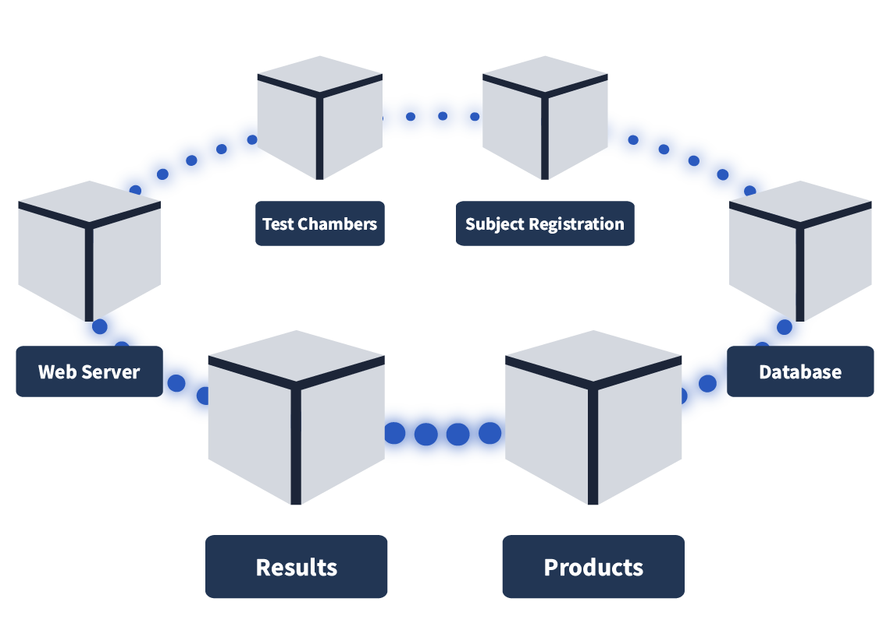

#### The Problems With Microservices Architecture

Securing Pod-to-Pod Communication

You may remember in the [Cluster Hardening](https://tryhackme.com/r/room/clusterhardening) room, we discussed how to restrict pod-to-pod communication using network policies. Now we will discuss how to secure communication between pods. A typical microservices architecture will be set up as follows: a client will connect to the Kubernetes cluster using HTTPS, will hit the load balancer, which will then forward the request to the ingress controller also using HTTPS. Likely there will be a firewall protecting the cluster as well. However, from this point onwards, once we are inside the cluster, pod-to-pod communication is done using HTTP or some other insecure protocol. In other words, the cluster itself is protected, but once inside, there is insecure, unencrypted traffic.

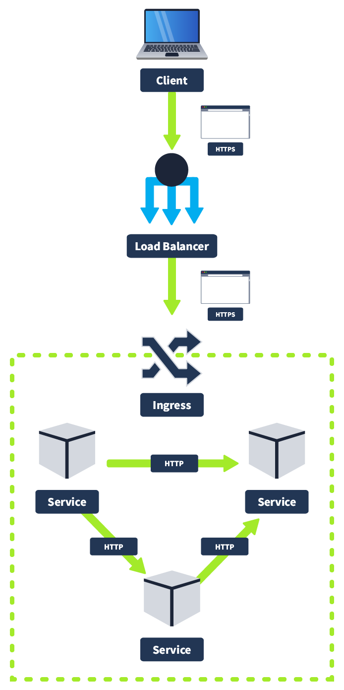

This has certain implications for an on-premises network; it would not be following best practices, but the implications are worse when you consider a cloud deployment, which microservice architectures frequently are. Cloud Service Providers provide multiple **AZ** (Availability Zones) to ensure the uptime of your application; if one AZ goes down, another one remains up. Because of this, some services in your cluster may be running on different AZ, meaning unencrypted communication between services could be intercepted by an eavesdropper. It’s for this reason traffic between services should be encrypted using mTLS.

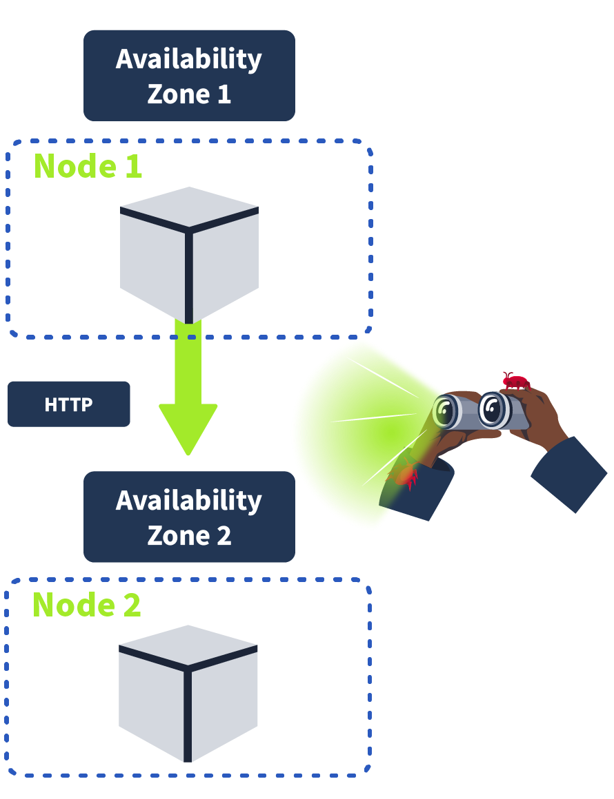

**mTLS** (Mutual Transport Layer Security) provides mutual authentication, ensuring that both sides of a connection are authenticated using certificates. As you know, when using TLS (transport layer security), a server has a TLS certificate and a public/private key pair. However, the client does not. In mTLS, on the other hand, both client and server have a certificate and authentication using a public/private key pair. Another noteworthy difference is that with mTLS, the organisation that is implementing it acts as its own CA (certificate authority) instead of having an external organisation validate its identity. Here is a visualisation of how mTLS works and the connection steps that happen between a client and a server. The steps highlighted with a star are additional steps in mTLS (versus TLS).

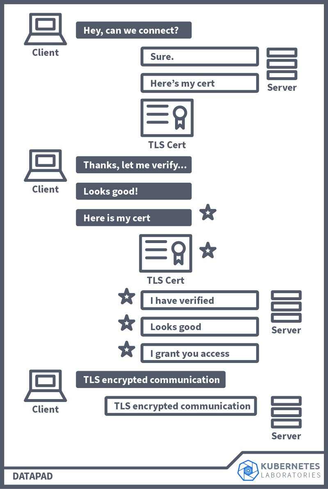

A Lot To Consider

Let's consider this example of microservices architecture. Each of our microservices is running inside of a pod. Each one will have its own **business logic**, aka functionality, which is its purpose in our application. Then, our microservices will talk to each other; for example, one of our employees may connect to the WebApp service, which will talk to the Results service, which, when logged, will communicate with the DB. For this, each microservice will need to know the endpoint of all the microservices it talks to; this is known as **communication configuration**. Above, we discussed the importance of having pod-to-pod communication secured using mTLS; for this, the microservice will need to have the **security logic** included as well. For a microservice to be robust, it will need to include some kind of **retry logic**, which retries a connection if the microservice it communicates with is down, for example. As well as all this, **service monitoring** is frequently needed to gain business insights into microservice usage and performance as well as **tracing** data, which can be useful in troubleshooting contexts. Put all of this together, and suddenly, your microservice isn’t looking so micro.

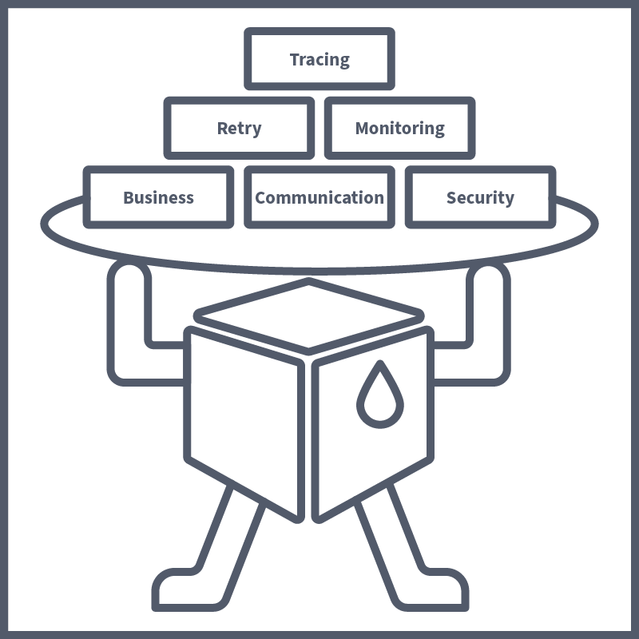

All of this non-business logic needs to be added to each microservice/application, which can lead to the developers spending all of their time on these configurations instead of the actual application development itself. On top of this, the manual configuration of this non-business logic, sometimes across different teams (with different dev teams assigned to certain microservices), can lead to misconfigurations, which is especially concerning in a security context. This is where Service Meshes come in.

---------------------------------------------------------------------------

#### A Microservice architecture is an alternative to what style of architecture?

Answer: `Monolithic`

#### A problem with microservice architectures is that service-to-service communication is usually?

Answer: `Unencrypted`

#### The solution to the above problem would be to have both sides of a connection authenticated using?

Answer: `mTLS`

---------------------------------------------------------------------------

### Task 4: Service Meshes

#### The Answer to Our Microservice Problems

All of the issues outlined in the previous task can be solved with one convenient and efficient solution: a **service mesh**. A service mesh is a dedicated infrastructure layer that can be used to control and manage service-to-service communication. This task will explain how this is done and how it solves the problems outlined in the previous task. Truly, a DevSecOps engineer's best friend. Given the issue that was established, having all of this additional logic and configurations to develop on top of the business logic on a service-to-service basis can be a lot of work. Would it not then make sense to separate the business logic of the microservice from all of the other logic and configurations and have this be handled separately and repeatedly across all microservices? This is exactly what can be achieved using a service mesh.

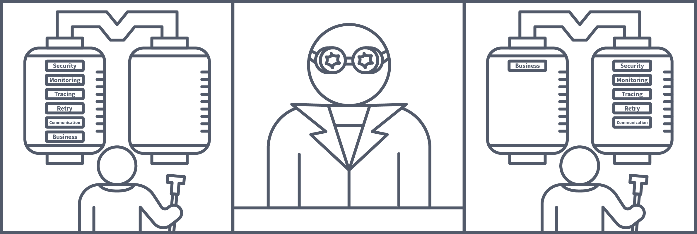

How Is This Achieved

A service mesh achieves this by extracting all of the non-business logic and configurations and having them run in its own proxy in parallel to the microservice, called a **sidecar**. A sidecar conjures up images of those motorbikes with a little comportment attached to its side; this, in essence, is how we define a sidecar in tech. The motorbike is the primary application, and the sidecar is a service or process deployed in parallel, which supports the primary application. In this case, the sidecar is being used as a proxy.  Proxies are commonly used in security, with a regularly used example being an employee accessing a webpage via their workstation. This request would first be received by their company's web proxy; it would have to pass the proxy's security checks before being forwarded to the web server. The server would then return the page to the web proxy, where it would again need to pass security checks before finally being forwarded to the employee.

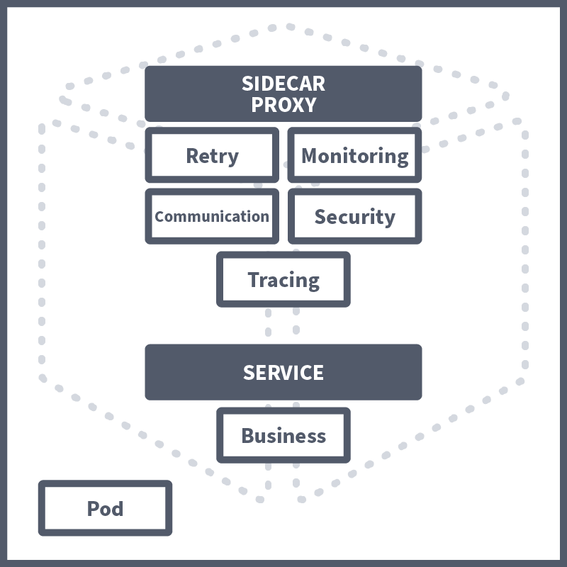

In a service mesh, these sidecar proxies are used, forming their own infrastructure layer where requests between microservices can be routed. In other words, all security logic, communication configuration, retry logic, service monitoring, and tracing are taken care of by this sidecar proxy. They are called sidecars because they run alongside the microservice, which contains the actual business logic. These interconnected sidecar proxies form a mesh network.

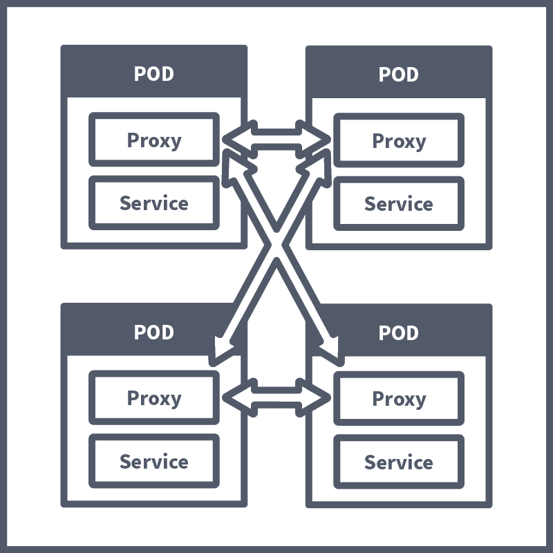

How DevSecOps Engineers Benefit

The example microservice architectures discussed in earlier tasks are very primitive examples. In reality, large organisations can have very complex architectures with numerous microservices. Adding another microservice or another instance of an existing microservice can complicate the architecture even further with additional communication channels and security configurations, and as the architecture grows, finding the root cause of issues can become harder and harder. A service mesh becomes a DevSecOps engineer’s best friend by extracting this all, not only ensuring consistency and security in service-to-service communication but capturing metrics on performance can help ensure a robust architecture (e.g. the average time it takes for a service to restart can be factored into when a retry is attempted).  Taking away the need to configure all non-business logic on a per-application basis and having it all run in a sidecar proxy also makes applications more scalable.

Service meshes are a win for everyone; from a developer perspective, they can focus on developing the application business logic without worrying about the need to build things like communication configuration and security logic into the app. From a security perspective you can rest assured that the service mesh is managing the secure mTLS connection between services. For this reason, when managing a microservices architecture in Kubernetes, a service mesh should always be considered.

---------------------------------------------------------------------------

#### A Service Mesh separates which logic from the rest?

Answer: `Business`

#### The rest are separated into a separate proxy, which runs alongside the application pod, known as?

Answer: `Sidecar`

---------------------------------------------------------------------------

### Task 5: Service Mesh Architecture

#### Istio to the Rescue

We have covered what a Service Mesh is and how exactly it can help a DevSecOps engineer to secure a microservices architecture; now we will take a look at a popular implementation of Service Mesh, [Istio](https://istio.io/latest/about/service-mesh/). Essentially, Service Mesh is a concept, and Istio is one of the technologies we can use to achieve this (other implementations include [Linkerd](https://linkerd.io/) and [Hashicorp Consul](https://www.consul.io/)). A popular choice for implementing a Service Mesh in a Kubernetes microservices architecture, it has a security-by-default security model, making it ideal for DevSecOps engineers looking to deploy security-conscious applications. In this task, we will break down Istio architecture to give you a better understanding of how a Service Mesh works within a Kubernetes cluster.  Istio architecture is logically split into two sections: the Data Plane and the Control Plane. We will now define each of these sections and how they work, but at a high level, the Data Plane is a collection of intelligent proxies deployed as sidecars, and the Control Plane is responsible for the management and configuration of these proxies.

#### Envoy Proxies (Data Plane)

In the previous task, it was mentioned that, in a service mesh, all of the non-business logic is extracted and run as a side care proxy in parallel to the service. In Istio (and many other service mesh implementations), this is achieved using Envoy. Envoy is an open source, high-performance edge and service proxy that is used in this instance to manage inbound and outbound traffic between services. These envoy proxies interact with network traffic and allow features such as mTLS encryption between services, as has been configured. The communication between these envoy proxies form the data plane, one of two architecture planes in Istio.

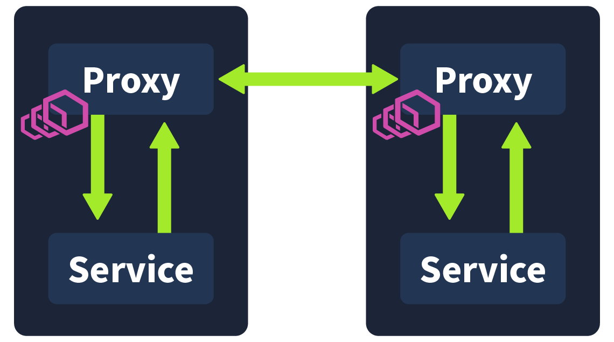

#### Istiod (Control Plane)

Istiod is the name of the component that makes up the Control Plane. Istiod allows for service discovery, configuration and certificate management. This component is responsible for taking the high-level routing rules that have been defined and turning them into envoy-specific configurations. These configurations are then injected into the sidecar proxies at runtime. This component is also able to abstract platform-specific (for example, Kubernetes) service discovery mechanisms and turn them into a standard format that can be consumed by the Envoy API. So when a new Service is spun up in your Kubernetes cluster, the control plane will detect and inject an envoy sidecar proxy to run alongside it.

It’s worth noting that prior to v1.5, the Istio control plane was made up of multiple components (Pilot, Citadel, Mixer, and Gallery). However, now all of these components were combined into a single Istiod component. This made it easier for users to configure/operate. I am pointing this out because some other resources are outdated and refer to the control plane being made up of these components.

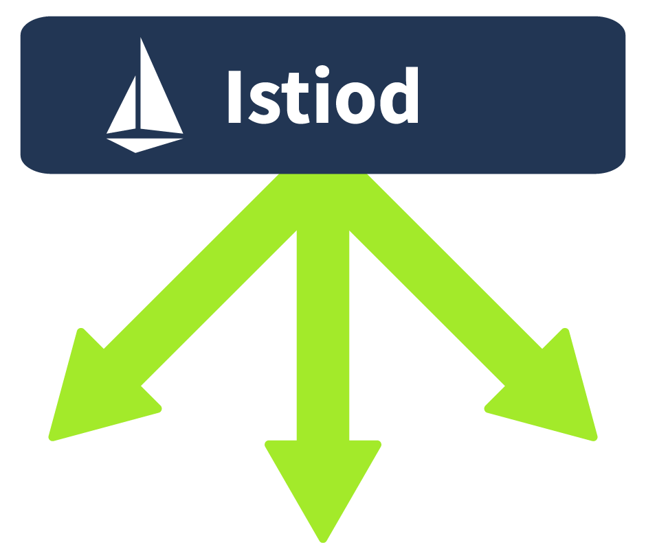

#### Putting It Together

Combining the Data Plane and the Control Plane, we get a complete Istio architecture. The control plane is responsible for configuration, discovery, and certificates and propagates all running services with an envoy sidecar proxy, a network that communicates with mesh traffic forming the data plane.

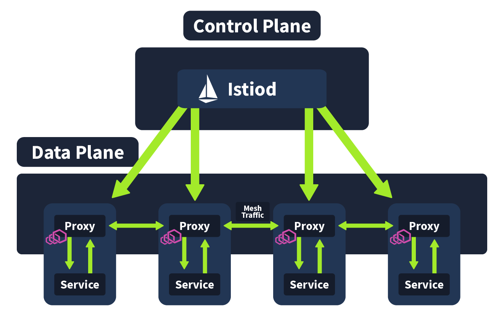

---------------------------------------------------------------------------

#### In this task, we looked at an implementation of a Service Mesh named what?

Answer: `Istio`

#### In this Service Mesh implementation, what is used to achieve the proxies?

Answer: `Envoy`

#### What is the name given to this area of the architecture where the proxies communicate with services (and other proxies)?

Answer: `Data Plane`

#### What is the name of the component that makes up the Control Plane?

Answer: `Istiod`

---------------------------------------------------------------------------

### Task 6: Service Mesh Implementation

#### Getting Started

Before starting with the intro, it's a good idea to get the VM and minikube cluster booted up. Click the green "**Start Lab Machine**" button, and allow 2 minutes for this to boot up. The machine will start in Split-Screen view. In case the VM is not visible, use the blue **Show Split View** button at the top of the page. Once booted up, run the following command to start the minikube cluster:

```bash
thm@k8s$ minikube start
```

```bash
ubuntu@tryhackme:~$ minikube start
😄  minikube v1.32.0 on Ubuntu 20.04
✨  Using the docker driver based on existing profile
👍  Starting control plane node minikube in cluster minikube
🚜  Pulling base image ...
🔄  Restarting existing docker container for "minikube" ...
❗  This container is having trouble accessing https://registry.k8s.io
💡  To pull new external images, you may need to configure a proxy: https://minikube.sigs.k8s.io/docs/reference/networking/proxy/
🐳  Preparing Kubernetes v1.28.3 on Docker 24.0.7 ...
❗  kubeadm certificates have expired. Generating new ones...
🤦  Unable to restart cluster, will reset it: apiserver healthz: apiserver process never appeared
    ▪ Generating certificates and keys ...
    ▪ Booting up control plane ...
    ▪ Configuring RBAC rules ...
🔗  Configuring bridge CNI (Container Networking Interface) ...
    ▪ Using image gcr.io/k8s-minikube/storage-provisioner:v5
🔎  Verifying Kubernetes components...
🌟  Enabled addons: storage-provisioner, default-storageclass
🏄  Done! kubectl is now configured to use "minikube" cluster and "default" namespace by default
ubuntu@tryhackme:~$ 
```

Now onto the lesson.

It is now your third week here at Kubernetes Laboratories; slowly but surely, your DevSecOps skills are growing, and the team is trusting you with more and more work. During this morning's stand-up meeting, it was mentioned that there is an outstanding ticket for the security surrounding Kubernetes Laboratories Microservice architecture. This ticket explains that a review needs to be done by a member of the DevSecOps team, changing some configurations and advising the development team on how to configure their microservices going forward.

#### Configuration Check

With the minikube cluster booted up, let's start investigating. First off, let's check if Istio has been installed in this Kubernetes cluster. We can do this by checking if the istio-system namespace exists. We can verify this using the following command:

```bash
thm@k8s$ kubectl get namespaces
```

Here, we can see the "istio-system" namespace is present, which means Istio has been installed in the cluster. In this namespace, a pod will run the Istiod component (aka the control plane).

Now we know Istio has been installed in the cluster the next thing we want to ensure as a DevSecOps engineer is that it is being used correctly. The ticket assigned to us asks us to review the microservices running in the default namespace. Let's continue the investigation by running the following command to check the status of the pods running in the default namespace:

```bash
thm@k8s$ kubectl get pods
```

Running this command should return something like the following output:

```bash
NAME                                    READY   STATUS    RESTARTS      AGE
database-5c6bcbb7d8-ht8pg               1/1     Running   1 (15m ago)   2d1h
products-7f5984db48-z9rst               1/1     Running   2 (15m ago)   2d3h
results-674478647d-s8ppb                1/1     Running   2 (15m ago)   2d3h
subject-registration-666cd768cb-rgprq   1/1     Running   2 (15m ago)   2d3h
test-chambers-6bff7bc878-zp7wm          1/1     Running   2 (15m ago)   2d3h
web-server-8569bb59bd-48gcr             1/1     Running   2 (15m ago)   2d3h
```

**Note**: If the status says “Error” please allow 1-2 more minutes for the pods to show as "Running".

#### Enabling Proxy Injection

Here we see each of the pods running in the default namespace. In the "READY" column, we see 1/1 next to all of the running pods. This is in reference to how many containers are running inside the pod. If you remember from our lesson, when a service mesh has been configured correctly, two containers should be running inside the pod (one running the application and the other a sidecar proxy). From this, we can determine that Istio proxy injection hasn't been enabled. That is the automatic injection of a sidecar proxy into running application pods. We can enable this using a Kubernetes label (provided, as we have confirmed, that Istio is installed in the Kubernetes cluster). Here is the command we would use to label the default namespace so that all pods started in this namespace are automatically injected with a sidecar proxy container:

```bash
thm@k8s$ kubectl label namespace default istio-injection=enabled
```

With this namespace labelled for automatic proxy injection, we now want to restart all of the pods running in the default namespace. To make this easier, there is a manifest yaml (in the `/home/ubuntu` directory) containing the configuration for the running pods in this namespace. We can restart everything running in this namespace by simply deleting and applying this manifest using the following two commands (when in the `/home/ubuntu` directory):

```bash
thm@k8s$ kubectl delete -f microservice-manifest.yaml 

thm@k8s$ kubectl apply -f microservice-manifest.yaml
```

Allowing for some time for the pods to come back up, with a `kubectl get pods`, we should now see the pods running status as follows:

```bash
thm@k8s$ kubectl get pods
NAME                                    READY   STATUS    RESTARTS   AGE
database-5c6bcbb7d8-vzgct               2/2     Running   0          7m12s
products-7f5984db48-hzndf               2/2     Running   0          7m12s
results-674478647d-9qjvs                2/2     Running   0          7m12s
subject-registration-666cd768cb-tgwsl   2/2     Running   0          7m12s
test-chambers-6bff7bc878-k65lq          2/2     Running   0          7m12s
web-server-8569bb59bd-r52pn             2/2     Running   0          7m12s
```

With that, we now have a sidecar proxy container running in each of our pods in the namespace. If curious, you can use the `kubectl describe pod <pod-name>` command to get more details about the Istio proxy container.

#### Enforcing mTLS Traffic

Now that we have enabled proxies to be automatically injected, the next thing we want to consider as a DevSecOps engineer is the mTLS configuration. That is ensuring all of our internal traffic is secure. Now, Istio automatically configures workload sidecars to use mTLS when calling other workloads. However, by default Istio configures mTLS in Permissive mode. Permissive mode allows for a service to receive both mTLS traffic AND plaintext (unencrypted) traffic. This is the default as this fits a lot of use cases, with large organisations not being able to upgrade all of their environment at once, so services need to be able to receive both plaintext and mTLS traffic. However, in our case, we have upgraded this entire environment, so we don't want permissive mode to be used. We want Strict mode which only allows mTLS traffic. Istio handles this using "Authentication Policies", where we define what level of authentication we want.

These policies allow us to define authentication policies for certain resources as well. Say, for example, we had an application that handled particularly sensitive traffic. We could make an authentication policy like so to ensure only mTLS traffic is allowed:

```bash
apiVersion: security.istio.io/v1beta1
kind: PeerAuthentication
metadata:
  name: "sensitive-peer-policy"
  namespace: "example-namespace"
spec:
  selector:
    matchLabels:
      app: sensitive-app
  mtls:
    mode: STRICT
```

Given we want to apply our authentication policy to all of the pods in the namespace, we can structure ours like so:

```bash
apiVersion: security.istio.io/v1beta1
kind: PeerAuthentication
metadata:
  name: default
  namespace: default
spec:
  mtls:
    mode: STRICT
```

Copy the above file contents and make a file named "auth.yaml" with its contents. You can then apply this authentication policy using kubectl:

```bash
thm@k8s$ kubectl apply -f auth.yaml
```

With that applied, our service mesh is configured, and internal traffic is secured. We can mark our ticket as complete and advise the dev team of the changes that have been made. With a third week complete at Kubernetes Laboratories you are almost past your probation here and ready to don the title of DevSecOps engineer. Run the following command to describe the auth policy you've just made and submit the value contained in the API version field to complete this task:

```bash
thm@k8s$ kubectl describe peerauthentication default
```

---------------------------------------------------------------------------

#### What value is contained within the API version field when you describe the authentication policy?

Answer: `security.istio.io/v1`

---------------------------------------------------------------------------

### Task 7: Conclusion

By going through this room, you have increased your DevSecOps knowledge base by gaining a greater understanding of microservices architectures, a foundational term in Kubernetes, and what methods can be used to secure them. Your Kubernetes arsenal is now getting pretty stacked. Let’s recap what we’ve covered in this room to keep the knowledge sealed up tight. In this room, you have learned:

- **Pod Security Standards** define three levels of pod security: Privileged, baseline and restricted.
- The above mentioned standards are enforced by **Pod Security Admisson** which has three modes: enforce, audit and warn.
- Building a microservices architecture comes with problems, such as **securing pod-to-pod communication** and **configuration/logic-filled application pods**.
- A solution to the above mentioned problems can be found in **Service Meshes**, which separate the business logic of the application and runs everything else in a sidecar proxy concurrently.
- **Istio** is a Service Mesh implementation which is made up of two parts, the **Control Plane** and the **Data Plane**.
- Istio can be installed into a Kubernetes cluster, **automatic proxy injection** can be enabled and **authentication policies** made to ensure secure internal communication.

And with that, you’ve completed another Kubernetes room and are one step closer to Kubernetes mastery. Log off after another hard day at Kubernetes Laboratories.

---------------------------------------------------------------------------

For additional information, please see the references below.

## References

- [Containerization (computing) - Wikipedia](https://en.wikipedia.org/wiki/Containerization_(computing))
- [Istio service mesh](https://istio.io/latest/about/service-mesh/)
- [kubectl - Manual page](https://manpages.org/kubectl)
- [Kubernetes - Docs](https://kubernetes.io/docs/home/)
- [Kubernetes - Homepage](https://kubernetes.io/)
- [Kubernetes - Wikipedia](https://en.wikipedia.org/wiki/Kubernetes)
- [Pod Security Admission - Kubernetes](https://kubernetes.io/docs/concepts/security/pod-security-admission/)
- [Pod Security Standards - Kubernetes](https://kubernetes.io/docs/concepts/security/pod-security-standards/)
