# NetworkMiner

- [Room information](#room-information)
- [Solution](#solution)
- [References](#references)

## Room information

```text
Type: Walkthrough
Difficulty: Easy
OS: N/A
Subscription type: Premium
Description: Learn how to use NetworkMiner to analyse recorded traffic files and practice network forensics activities.
```

Room link: [https://tryhackme.com/room/networkminer](https://tryhackme.com/room/networkminer)

## Solution

### Task 1: Room Introduction


NetworkMiner is an open-source traffic sniffer, PCAP handler and protocol analyser. Developed and still maintained by Netresec.

The official [description](https://www.netresec.com/?page=NetworkMiner):

"*NetworkMiner is an open source Network Forensic Analysis Tool (NFAT) for Windows (but also works in Linux / Mac OS X / FreeBSD). NetworkMiner can be used as a passive network sniffer/packet capturing tool to detect operating systems, sessions, hostnames, open ports etc. without putting any traffic on the network. NetworkMiner can also parse PCAP files for off-line analysis and to regenerate/reassemble transmitted files and certificates from PCAP files.*

*NetworkMiner has, since the first release in 2007, become a popular tool among incident response teams as well as law enforcement. NetworkMiner is today used by companies and organizations all over the world.*"

For this room, you will be expected to have basic Linux familiarity and Network fundamentals (ports, protocols and traffic data).  We suggest completing the "[Network Fundamentals](https://tryhackme.com/module/network-fundamentals)" path before starting working in this room. The room aims to provide a general network forensics overview and work with NetworkMiner to investigate captured traffic.

Notes:

- VMs are attached to this challenge. You don't need SSH or RDP; the room provides a "**Split View**" feature.  Exercise files are located in the folder on the VM's desktop
- There are two different NetworkMiner versions are available in the attached VM. Use the required version according to the tasks. Open the tool folder and double click on the **.exe** file


### Task 2: NetworkMiner in Forensics

#### Network Miner in Forensics

The ultimate goal of network forensics is to provide sufficient information to detect malicious activities, security breaches, and network anomalies based on the network traffic. And NetworkMiner is a great tool to help, as it provides quick and useful hints on where to start from, specifically:

- Context of captured hosts like their IP and MAC, hostnames, or OS information
- List of potential attack indicators or anomalies like traffic spikes or port scans
- Tools or toolkits used to perform the potential attacks like Nmap

#### Supported Data Types

There are three main data types investigated in Network Forensics

- Live Traffic
- Traffic Captures
- Log Files

NetworkMiner is capable of processing and handling both packet pictures (PCAP) and live traffic. Therefore, we will focus on live and captured traffic in this room.

### Task 3: What is NetworkMiner?

#### NetworkMiner in a Nutshell

| Capability | Description |
|----|----|
|**Traffic sniffing**|It can intercept the traffic, sniff it, and collect and log packets that pass through the network.|
|**Parsing PCAP files**|It can parse pcap files and show the content of the packets in detail.|
|**Protocol analysis**|It can identify the used protocols from the parsed pcap file.|
|**OS fingerprinting**|It can identify the used OS by reading the pcap file. This feature strongly relies on Satori and p0f.|
|**File Extraction**|It can extract images, HTML files and emails from the parsed pcap file.|
|**Credential grabbing**|It can extract credentials from the parsed pcap file.|
|**Clear text keyword parsing**|It can extract cleartext keywords and strings from the parsed pcap file.|

We are using NetworkMiner **free edition** in this room, but a Professional edition has much more features.  
You can see the differences between free and professional versions [here](https://www.netresec.com/?page=NetworkMiner).

#### Operating Modes

There are two main operating modes;

- **Sniffer Mode**: Although it has a sniffing feature, it is not intended to use as a sniffer. The sniffier feature is available only on Windows. However, the rest of the features are available in Windows and Linux OS. Based on experience, the sniffing feature is not as reliable as other features. Therefore we suggest not using this tool as a primary sniffer. Even the official description of the tool mentions that this tool is a "Network Forensics Analysis Tool", but it can be used as a "sniffer". In other words, it is a Network Forensic Analysis Tool with but has a sniffer feature, but it is not a dedicated sniffer like Wireshark and tcpdump.

- **Packet Parsing/Processing**: NetworkMiner can parse traffic captures to have a quick overview and information on the investigated capture. This operation mode is mainly suggested to grab the "low hanging fruit" before diving into a deeper investigation.

#### Pros and Cons

As mentioned in the previous task, NetworkMiner is mainly used to gain an overview of the network. Before starting to investigate traffic data, let's look at the pros and cons of the NetworkMiner.

Pros

- OS fingerprinting
- Easy file extraction
- Credential grabbing
- Clear text keyword parsing
- Overall overview

Cons

- Not useful in active sniffing
- Not useful for large pcap investigation
- Limited filtering
- Not built for manual traffic investigation

#### Differences Between Wireshark and NetworkMiner

NetworkMiner and Wireshark have similar base features, but they separate in use purpose. Although main functions are identical, some of the features are much stronger for specific use cases.

The best practice is to record the traffic for offline analysis, quickly overview the pcap with NetworkMiner and go deep with Wireshark for further investigation.

| Feature | NetworkMiner | Wireshark |
|----|----|----|
|Purpose|Quick overview, traffic mapping, and data extraction|In-Depth analysis|
|GUI|✅|✅|
|Sniffing|✅|✅|
|Handling PCAPS|✅|✅|
|OS Fingerprinting|✅|❌|
|Parameter/Keyword Discovery|✅|Manual|
|Credential Discovery|✅|✅|
|File Extraction|✅|✅|
|Filtering Options|Limited|✅|
|Packet Decoding|Limited|✅|
|Protocol Analysis|❌|✅|
|Payload Analysis|❌|✅|
|Statistical Analysis|❌|✅|
|Cross-Platform Support|✅|✅|
|Host Categorisation|✅|❌|
|Ease of Management|✅|✅|

### Task 4: Tool Overview 1

#### Landing Page

This is the landing page of the NetworkMiner. Once you open the application, this screen loads up.


#### File Menu

The file menu helps you load a Pcap file or receive Pcap over IP. You can also drag and drop pcap files as well.

NetworkMiner also can receive Pcaps over IP. This room suggests using NetworkMiner as an initial investigation tool for low hanging fruit grabbing and traffic overview. Therefore, we will skip receiving Pcaps over IP in this room. You can read on receiving Pcap over IP from [here](https://www.netresec.com/?page=Blog&month=2011-09&post=Pcap-over-IP-in-NetworkMiner) and [here](http://www.gavinhollinger.com/2016/10/pcap-over-ip-to-networkminer.html).

#### Tools Menu

The tools menu helps you clear the dashboard and remove the captured data.

#### Help Menu

The help menu provides information on updates and the current version.

#### Case Panel

The case panel shows the list of the investigated pcap files. You can reload/refresh, view metadata details and remove loaded files from this panel.

Viewing metadata of loaded files;


#### Hosts Tab

The "hosts" tab shows the identified hosts in the pcap file. This section provides information on;

- IP address
- MAC address
- OS type
- Open ports
- Sent/Received packets
- Incoming/Outgoing sessions
- Host details

OS fingerprinting uses the Satori GitHub repo and p0f, and the MAC address database uses the mac-ages GitHub repo.

You can sort the identified hosts by using the sort menu. You can change the colour of the hosts as well. Some of the features (OSINT lookup) are available only in premium mode. The right-click menu also helps you to copy the selected value.


#### Sessions Tab

The session tab shows detected sessions in the pcap file. This section provides information on;

- Frame number
- Client and server address
- Source and destination port
- Protocol
- Start time


You can search for keywords inside frames with the help of the filtering bar. It is possible to filter specific columns of the session menu as well. This menu accepts four types of inputs;

- "ExactPhrase"
- "AllWords"
- "AnyWord"
- "RegEx"

#### DNS Tab

The DNS tab shows DNS queries with details. This section provides information on;

- Frame number
- Timestamp
- Client and server
- Source and destination port
- IP TTL
- DNS time
- Transaction ID and type
- DNS query and answer
- Alexa Top 1M

Some of the features (Alexa Top 1M) are available only in premium mode. The search bar is available here as well.


#### Credentials Tab

The credentials tab shows extracted credentials and password [hashes](https://tryhackme.com/room/hashingcrypto101) from investigated pcaps. You can use Hashcat ([GitHub](https://github.com/hashcat/hashcat)) and John the Ripper ([GitHub](https://github.com/openwall/john)) to decrypt extracted credentials. NetworkMiner can extract credentials including;

- Kerberos hashes
- NTLM hashes
- RDP cookies
- HTTP cookies
- HTTP requests
- IMAP
- FTP
- SMTP
- MS SQL

The right-click menu is helpful in this part as well. You can easily copy the username and password values.


**Use mx-3.pcap**

#### What is the total number of frames?

Check the metadata of the PCAP-file

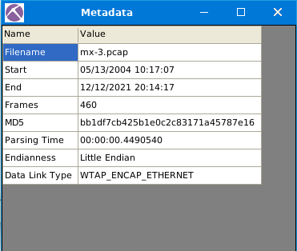

Answer: 460

#### How many IP addresses use the same MAC address with host 145.253.2.203?

Check the IP under the `Hosts` tab

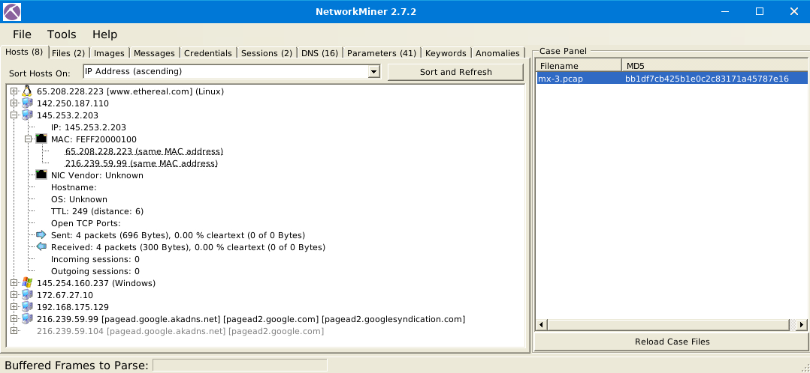

Answer: 2

#### How many packets were sent from host 65.208.228.223?

Check the IP under the `Hosts` tab

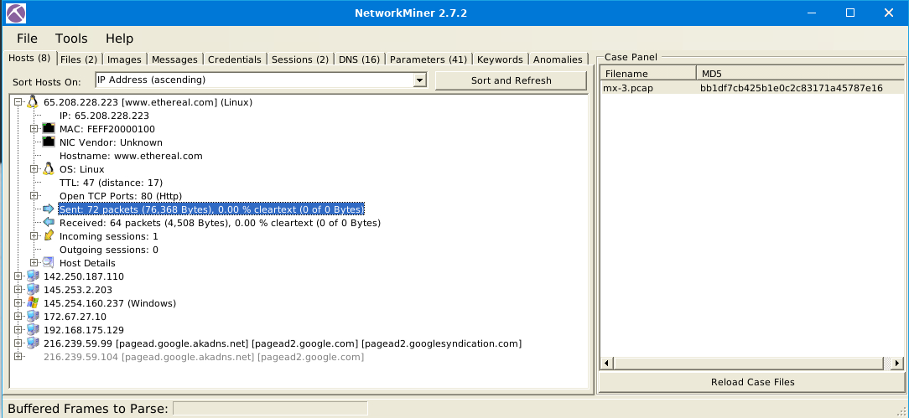

Answer: 72

#### What is the name of the webserver banner under host 65.208.228.223?

Check the IP under the `Hosts` tab

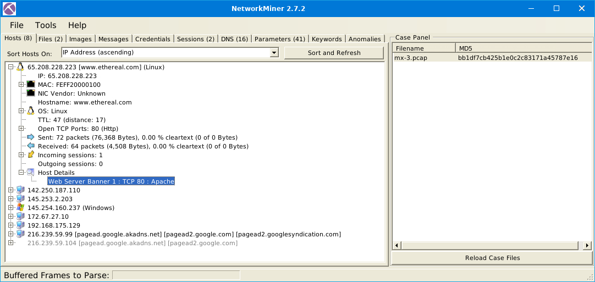

Answer: Apache

**Use mx-4.pcap**

#### What is the extracted username?

Check the `Credentials` tab

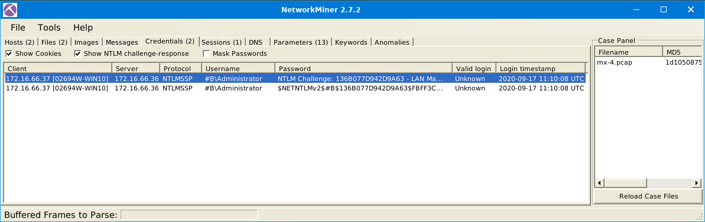

Answer: `#B\Administrator`

#### What is the extracted password?

Check the `Credentials` tab again and the second entry. I wouldn't call it a "password" but it was accepted...

Answer:

```text
$NETNTLMv2$#B$136B077D942D9A63$FBFF3C253926907AAAAD670A9037F2A5$01010000000000000094D71AE38CD60170A8D571127AE49E00000000020004003300420001001E003000310035003600360053002D00570049004E00310036002D004900520004001E0074006800720065006500620065006500730063006F002E0063006F006D0003003E003000310035003600360073002D00770069006E00310036002D00690072002E0074006800720065006500620065006500730063006F002E0063006F006D0005001E0074006800720065006500620065006500730063006F002E0063006F006D00070008000094D71AE38CD601060004000200000008003000300000000000000000000000003000009050B30CECBEBD73F501D6A2B88286851A6E84DDFAE1211D512A6A5A72594D340A001000000000000000000000000000000000000900220063006900660073002F003100370032002E00310036002E00360036002E0033003600000000000000000000000000
```

### Task 5: Tool Overview 2

#### Files Tab

The file tab shows extracted files from investigated pcaps. This section provides information on;

- Frame number
- Filename
- Extension
- Size
- Source and destination address
- Source and destination port
- Protocol
- Timestamp
- Reconstructed path
- Details

Some features (OSINT hash lookup and sample submission) are available only in premium mode. The search bar is available here as well. The right-click menu is helpful in this part as well. You can easily open files and folders and view the file details in-depth.


#### Images Tab

The file tab shows extracted images from investigated pcaps. The right-click menu is helpful in this part as well. You can open files and zoom in & out easily.


Once you hover over the image, it shows the file's detailed information (source & destination address and file path).

#### Parameters Tab

The file tab shows extracted parameters from investigated pcaps. This section provides information on;

- Parameter name
- Parameter value
- Frame number
- Source and destination host
- Source and destination port
- Timestamp
- Details

The right-click menu is helpful in this part as well. You can copy the parameters and values easily.


#### Keywords Tab

The file tab shows extracted keywords from investigated pcaps. This section provides information on;

- Frame number
- Timestamp
- Keyword
- Context
- Source and destination host
- source and destination port

How to filter keywords;

- Add keywords
- Reload case files!

Note: You can filter multiple keywords in this section; however, you must reload the case files after updating the search keywords. Keyword search investigates all possible data in the processed pcaps.


#### Messages Tab

The messages tab shows extracted emails, chats and messages from investigated pcaps. This section provides information on;

- Frame number
- Source and destination host
- Protocol
- Sender (From)
- Receiver (To)
- Timestamp
- Size

Once you filter the traffic and get a hit, you will discover additional details like attachments and attributes on the selected message. Note that the search bar is available here as well. The right-click menu is available here. You can use the built-in viewer to investigate overall information and the "open file" option to explore attachments.


#### Anomalies Tab

The anomalies tab shows detected anomalies in the processed pcap. Note that NetworkMiner isn't designated as an IDS. However, developers added some detections for EternalBlue exploit and spoofing attempts.


**Use mx-7.pcap**

#### What is the name of the Linux distro mentioned in the file associated with frame 63075?

Hint: NetworkMiner 2.7 can help.

Check the `Parameters` tab and search for or scroll down to the frame number

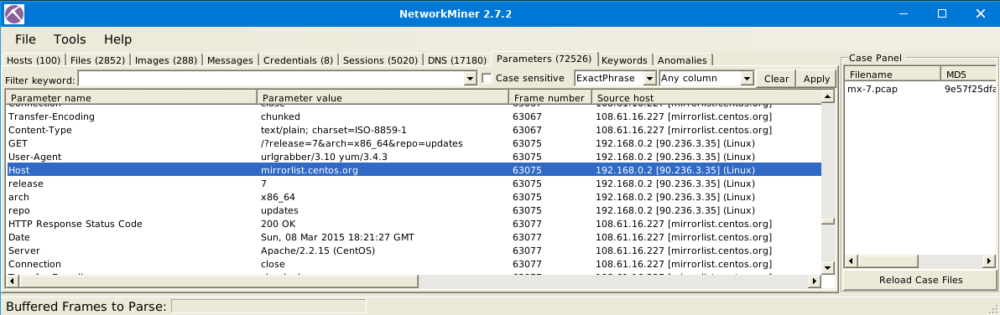

Answer: CentOS

#### What is the header of the page associated with frame 75942?

Hint: NetworkMiner 2.7 can help.

Go to the `Files` tab and search for or scroll down to the frame number

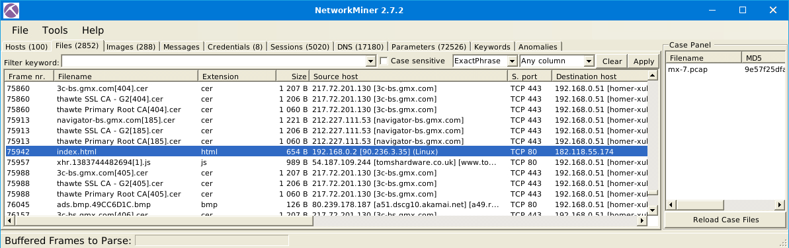

Right click and choose `Open File` and the HTML-file is opened in a browser

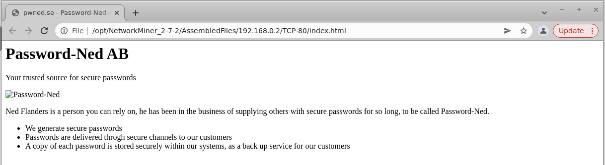

Answer: Password-Ned AB

#### What is the source address of the image "ads.bmp.2E5F0FD9.bmp"?

Hint: NetworkMiner 2.7 can help.

Go to the `Files` tab and enter thr image name (`ads.bmp.2E5F0FD9.bmp`) as filter to search for.  
Make sure the search type is `ExactPhrase` and where you search is either `Any column` or `Filename`.  
Finally, press `Apply` to search

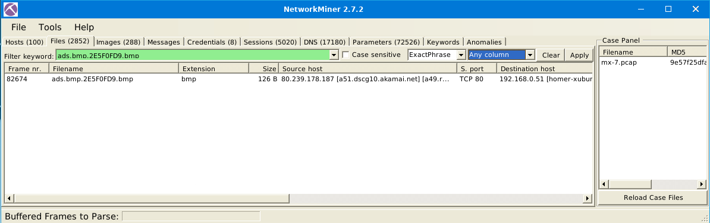

Check the `Source host` column for the source IP.

Answer: 80.239.178.187

#### What is the frame number of the possible TLS anomaly?

Hint: NetworkMiner 2.7 can help.

Check the `Anomalies` tab were we find two TLS anomalies!?


The first frame number was accepted.

Answer: 36255

**Use mx-9.pcap**

#### Look at the messages. Which platform sent a password reset email?

Go to the `Messages` tab and check the `Subject` column.  
No password reset e-mails can be found and the closest is message #2 about importing contacts to Facebook.

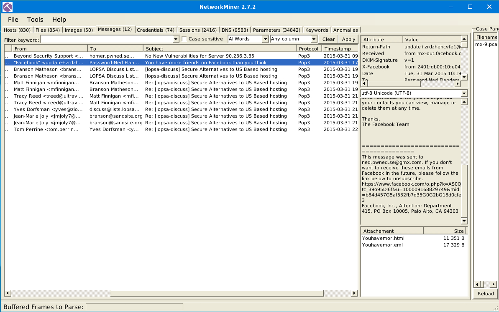

Answer: Facebook

#### What is the email address of Branson Matheson?

Check the `Messages` tab again and go through the `From` and `To` columns, or search for the name.

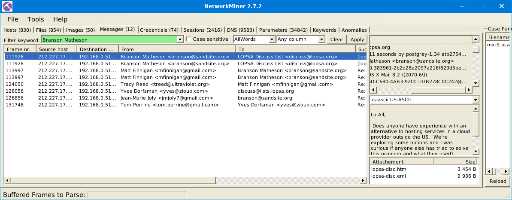

Answer: `branson@sandsite.org`

### Task 6: Version Differences

#### Version Differences

As always, it wouldn't be surprising to see a feature improvement as the version goes up. Unsurprisingly version upgrades provide stability, security fixes and features. Here the feature part is quite tricky. Feature upgrades can represent implementing new features and updating the existing feature (optimisation, alteration or operation mode modification). You can always check the changelog here .

Since there are some significant differences between the versions, the given VM has both of the major versions (v1.6 and v2.7). Of course, as the program version increases, it is expected to increase feature increase and scope. Here are the significant differences between versions 1.6 and 2.7. Here are the differences;

#### Mac Address Processing

NetworkMiner versions after version 2 can process MAC address specific correlation as shown in the picture below. This option will help you identify if there is a MAC Address conflict. This feature is not available before version 2.

NetworkMiner versions up to version 1.6. can handle packets in much detail. These options will help you investigate the sent/received packets in a more detailed format. This feature is not available after version 1.6.

#### Frame Processing

NetworkMiner versions up to version 1.6. can handle frames. This option provides the number of frames and essential details about the frames. This feature is not available after version 1.6.

#### Parameter Processing

NetworkMiner versions after version 2 can handle parameters in a much more extensive form. Therefore version 1.6.xx catches fewer parameters than version 2.

#### Cleartext Processing

NetworkMiner versions up to version 1.6. can handle cleartext data. This option provides all extracted cleartext data in a single tab; it is beneficial to investigate cleartext data about the traffic data. However, it is impossible to match the cleartext data and packets. This feature is not available after version 1.6.

#### Which version can detect duplicate MAC addresses?

Answer: 2.7

#### Which version can handle frames?

Answer: 1.6

#### Which version can provide more details on packet details?

Answer: 1.6

### Task 7: Exercises

You've learned what NetworkMiner is and how to use it. Let's put this into practice!

**Use case1.pcap**

#### What is the OS name of the host 131.151.37.122?

Check the OS fingerprinting details of the IP in the `Hosts` tab and select the answer that maps the answer format

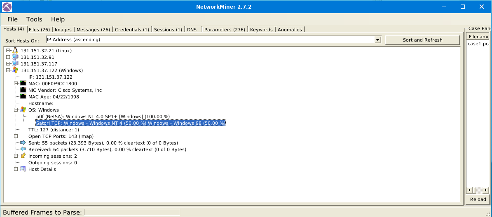

Answer: Windows - Windows NT 4

Investigate the hosts 131.151.37.122 and 131.151.32.91.

#### How many data bytes were received from host 131.151.32.91 to host 131.151.37.122 through port 1065?

Hint: You can review transferred bytes by investigating the sessions section under the host tab.

Check the Incoming sessions of the IP and double check destination IP and direction

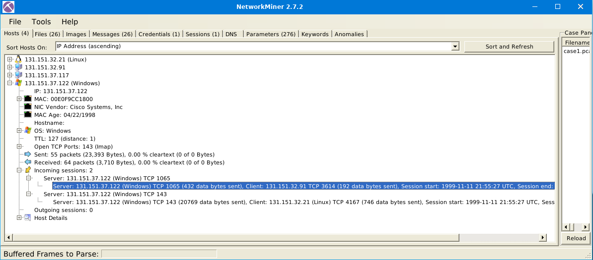

Answer: 192

Investigate the hosts 131.151.37.122 and 131.151.32.21.

#### How many data bytes were received from host 131.151.37.122 to host 131.151.32.21 through port 143?

Hint: You can review transferred bytes by investigating the sessions section under the host tab.

More or less exactly the same as the question above.

However, there is likely a cut-and-paste error in the question and it outght to be:  
How many data bytes were **sent** from host 131.151.37.122 to host 131.151.32.21 through port 143?

Answer: 20769

#### What is the sequence number of frame 9?

Hint: Using different versions of NM can help you. The attached VM has two NM instances.

Switch to version 1.6 for this question and check the `Frames` Tab.

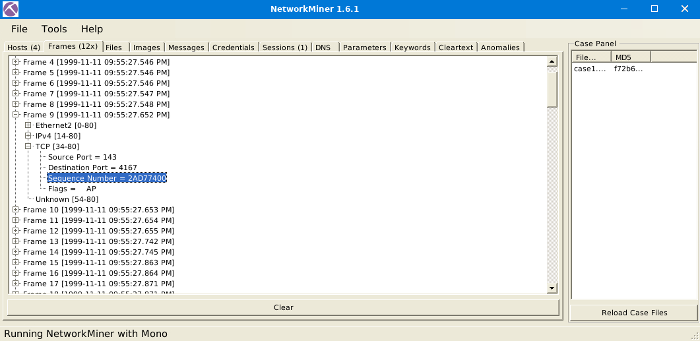

Answer: 2AD77400

#### What is the number of the detected "content types"?

Hint: Parameters can help you.

Check the `Parameters` tab (in version 2.7) and use the search feature

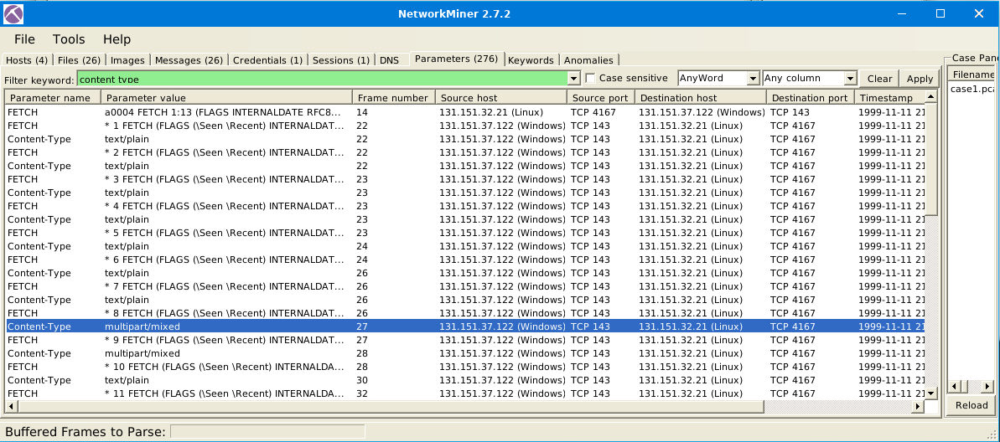

We can see two content types:

- text/plain
- multipart/mixed

The question was a bit unclear and perhaps a better phrased question would have been:  
`How many "content types" are there?` or `How many "content types" were identified?`

Answer: 2

Use **case2.pcap** and investigate the files.

#### What is the USB product's brand name?

Hint: Investigate the files. No need for external research.

Check the `Files` tab and search for filenames including `USB`

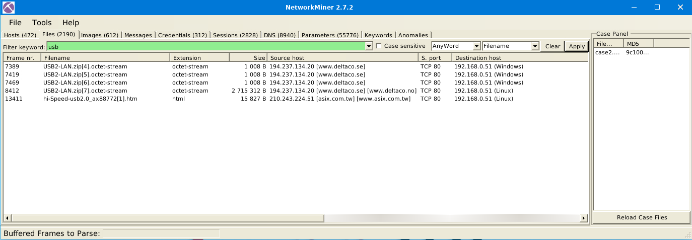

Right-click on the HTML-file and select `File Details`


And check the HTML-page's `<title>`.

Answer: ASIX

#### What is the name of the phone model?

Hint: Investigate the files and images. No need for external research.

Check the `Images` tab for phone images we find a lot of tech-related images about three quarters down

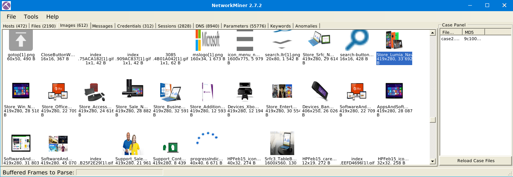

One of the image names include `Lumia`.

Switch to the `Files` tab and search for `Lumia` and we get two hits

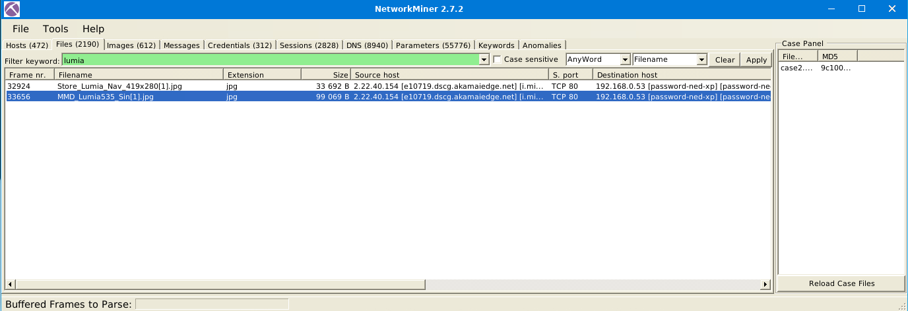

Answer: Lumia 535

#### What is the source IP of the fish image?

Go to the `Files` tab and search for `fish`. Then check the `Source host` column for the source IP

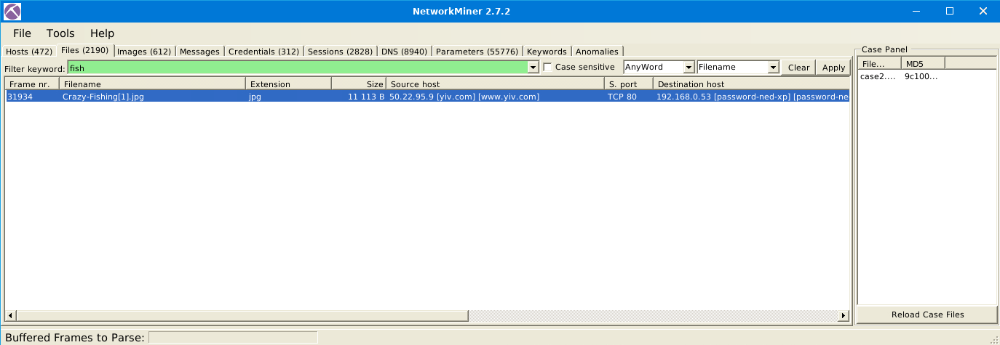

Answer: 50.22.95.9

#### What is the password of the "homer.pwned.se@gmx.com"?

Check the `Credentials` tab and sort by the `Password` column by clicking on it.  
Scroll all the way down to find the entries with passwords.

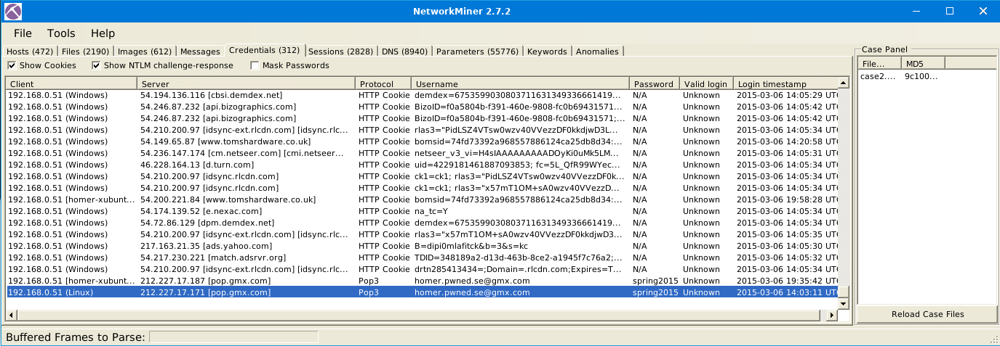

Answer: spring2015

#### What is the DNS Query of frame 62001?

Go to the `DNS` tab, search for the frame number and check the `DNS Query` column

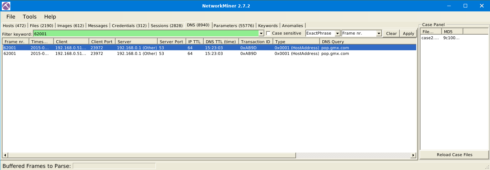

Answer: pop.gmx.com

### Task 8: Conclusion

Congratulations! You just finished the NetworkMiner room.

In this room, we covered NetworkMiner, what it is, how it operates, and how to investigate pcap files. As I mentioned in the tasks before, there are a few things to remember about the NetworkMiner;

- Don't use this tool as a primary sniffer.
- Use this tool to overview the traffic, then move forward with Wireshark and tcpdump for a more in-depth investigation.

If you like this content, make sure you visit the following rooms later on THM;

- [Wireshark](https://tryhackme.com/room/wireshark)
- [Snort](https://tryhackme.com/room/snort)
- [Brim](https://tryhackme.com/room/brim)

For additional information, please see the references below.

## References

- [NetworkMiner - Homepage](https://www.netresec.com/?page=NetworkMiner)
