# OWASP Juice Shop

- [Room information](#room-information)
- [Solution](#solution)
- [References](#references)

## Room information

```text
Type: Walkthrough
Difficulty: Easy
OS: N/A
Subscription type: Free
Description: This room uses the Juice Shop vulnerable web application to learn how to identify 
and exploit common web application vulnerabilities.
```

Room link: [https://tryhackme.com/room/owaspjuiceshop](https://tryhackme.com/room/owaspjuiceshop)

## Solution

### Task 1 - Open for business

Within this room, we will look at [OWASP's TOP 10 vulnerabilities](https://owasp.org/www-project-top-ten/) in web applications. You will find these in all types of web applications. But for today we will be looking at OWASP's own creation, Juice Shop!

The FREE Burpsuite rooms '[Burpsuite Basics](https://tryhackme.com/room/burpsuitebasics)'  and '[Burpsuite Repeater](https://tryhackme.com/room/burpsuiterepeater)'  are recommended before completing this room!

Juice Shop is a large application so we will not be covering every topic from the top 10.

We will, however, cover the following topics which we recommend you take a look at as you progress through this room.

- [Injection](https://owasp.org/www-project-top-ten/OWASP_Top_Ten_2017/Top_10-2017_A1-Injection)
- [Broken Authentication](https://owasp.org/www-project-top-ten/OWASP_Top_Ten_2017/Top_10-2017_A2-Broken_Authentication)
- [Sensitive Data Exposure](https://owasp.org/www-project-top-ten/OWASP_Top_Ten_2017/Top_10-2017_A3-Sensitive_Data_Exposure)
- [Broken Access Control](https://owasp.org/www-project-top-ten/OWASP_Top_Ten_2017/Top_10-2017_A5-Broken_Access_Control)
- [Cross-Site Scripting XSS](https://owasp.org/www-project-top-ten/OWASP_Top_Ten_2017/Top_10-2017_A7-Cross-Site_Scripting_(XSS))

**PLEASE NOTE**: [Task 3] and onwards will require a flag, which will be displayed on completion of the task.

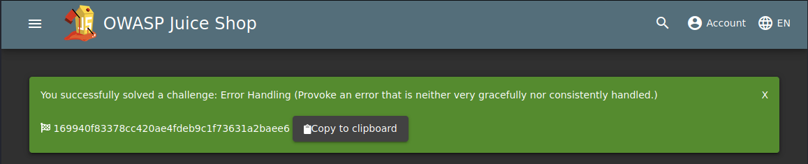

#### Troubleshooting

- The web app takes about 2-5 minutes to load, so please be patient!
- Temporarily disable burp in your proxy settings for the current browser. Refresh the page and the flag will be shown.  
(This is not an issue with the application but an issue with burp stopping the flag from being shown. )
- If you are doing the XSS Tasks and they are not working. Clear your cookies and site data, as this can sometimes be an issue.
- If you are sure that you have completed the task but it's still not working. Go to [Task 8], as this will allow you to check its completion.

Credits to [OWASP](https://www.owasp.org/index.php/Main_Page) and [Bjorn Kimminich](https://twitter.com/bkimminich)

Deploy the VM attached to this task to get started! You can access this machine by using your browser-based machine, or if you're connected through OpenVPN.

Once the machine has loaded, access it by copying and pasting its IP into your browser; if you're using the browser-based machine, paste the machines IP into a browser on that machine.

### Task 2 - Let's go on an adventure

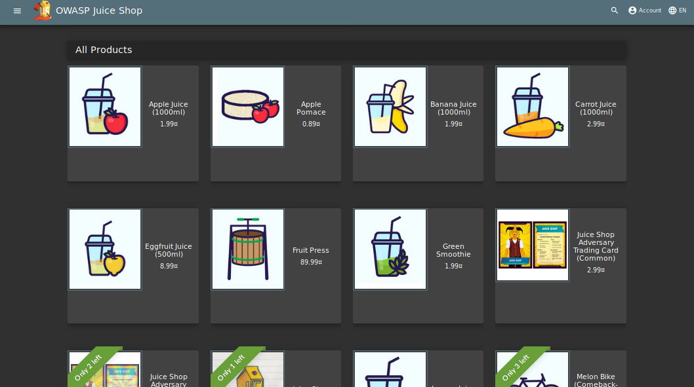

Before we get into the actual hacking part, it's good to have a look around. In Burp, set the Intercept mode to off and then browse around the site. This allows Burp to log different requests from the server that may be helpful later.

This is called **walking through** the application, which is also a form of **reconnaissance**!

#### Q1. What's the Administrator's email address?

The reviews show each user's email address. Which, by clicking on the Apple Juice product, shows us the Admin email!

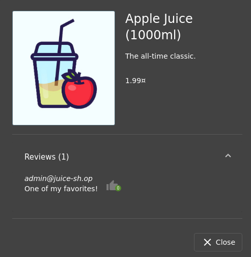

Answer: `admin@juice-sh.op`

#### Q2. What parameter is used for searching?


Click on the magnifying glass in the top right of the application will pop out a search bar.


We can then input some text and by pressing **Enter** will search for the text which was just inputted.

Now pay attention to the URL which will now update with the text we just entered.

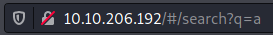

We can now see the search parameter after the `/#/search?` the letter **q**

Answer: q

#### Q3. What show does Jim reference in his review?

Jim did a review on the Green Smoothie product. We can see that he mentions a replicator.

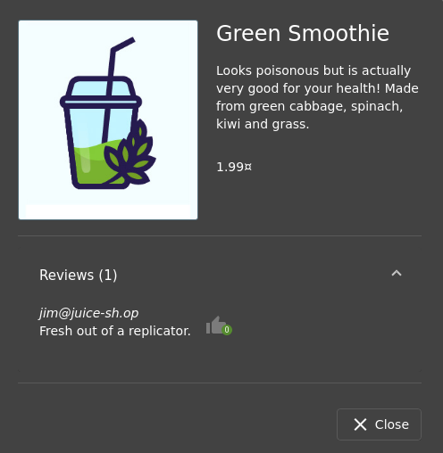

If we google "replicator" we will get the results indicating that it is from a TV show called Star Trek.

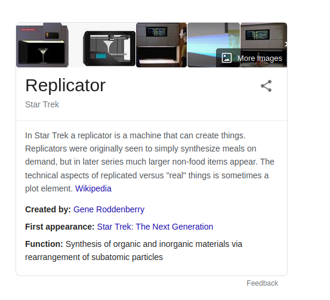

Answer: Star Trek

### Task 3 - Inject the juice


This task will be focusing on injection vulnerabilities. Injection vulnerabilities are quite dangerous to a company as they can potentially cause downtime and/or loss of data. Identifying injection points within a web application is usually quite simple, as most of them will return an error. There are many types of injection attacks, some of them are:

| Injection Type | Description |
|----|----|
|SQL Injection|SQL Injection is when an attacker enters a malicious or malformed query to either retrieve or tamper data from a database. And in some cases, log into accounts.|
|Command Injection|Command Injection is when web applications take input or user-controlled data and run them as system commands. An attacker may tamper with this data to execute their own system commands. This can be seen in applications that perform misconfigured ping tests.|
|Email Injection|Email injection is a security vulnerability that allows malicious users to send email messages without prior authorization by the email server. These occur when the attacker adds extra data to fields, which are not interpreted by the server correctly.|

But in our case, we will be using **SQL Injection**.

For more information: [Injection](https://owasp.org/www-project-top-ten/OWASP_Top_Ten_2017/Top_10-2017_A1-Injection)

#### Q1. Log into the administrator account

After we navigate to the login page (`Account`-> `Login`), enter some data into the email and password fields.

Before clicking submit, make sure **Intercept** mode is **on** in Burp.

This will allow us to see the data been sent to the server!

Click `Login` and Burp will catch the request:


We will now change the `a` next to the email to: `' or 1=1--` and forward it to the server.


Why does this work?

1. The character `'` will close the brackets in the SQL query
2. '**OR**' in a SQL statement will return true if either side of it is true. As `1=1` is **always true**, the whole statement is true. Thus it will tell the server that the email is valid, and log us into **user id 0**, which happens to be the administrator account.
3. The `--` character is used in SQL to **comment out** data, any restrictions on the login will no longer work as they are interpreted as a comment. This is like the `#` and `//` comment in python and javascript respectively.

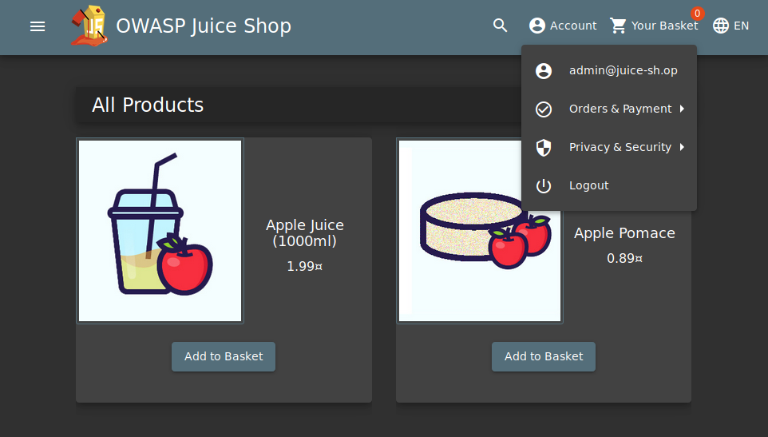

Flag: 32a5e0f21372bcc1000a6088b93b458e41f0e02a

Answer: filetype:pdf cyber warfare report

#### Q2. Log into the Bender account

Similar to what we did in Question #1, we will now log into Bender's account! Capture the login request again, but this time we will put: `bender@juice-sh.op'--` as the email.


Now, forward that to the server!

But why don't we put the **1=1**?

Well, as the email address is valid (which will return **true**), we do not need to force it to be **true**. Thus we are able to use `'--` to bypass the login system. Note the **1=1** can be used when the email or username is not known or invalid.


Flag: fb364762a3c102b2db932069c0e6b78e738d4066

### Task 4 - Who broke my lock?


In this task, we will look at exploiting authentication through different flaws. When talking about flaws within authentication, we include mechanisms that are vulnerable to manipulation. These mechanisms, listed below, are what we will be exploiting.

- Weak passwords in high privileged accounts
- Forgotten password pages

More information: [Broken Authentication](https://owasp.org/www-project-top-ten/OWASP_Top_Ten_2017/Top_10-2017_A2-Broken_Authentication)

#### Q1. Bruteforce the Administrator account's password

We have used SQL Injection to log into the Administrator account but we still don't know the password. Let's try a brute-force attack! We will once again capture a login request (`POST /rest/user/login`), but instead of sending it through the proxy, we will send it to `Intruder`.

Go to Positions and then select the **Clear §** button. In the password field place two § inside the quotes. To clarify, the § § is not two sperate inputs but rather Burp's implementation of quotations e.g. "". The request should look like the image below.

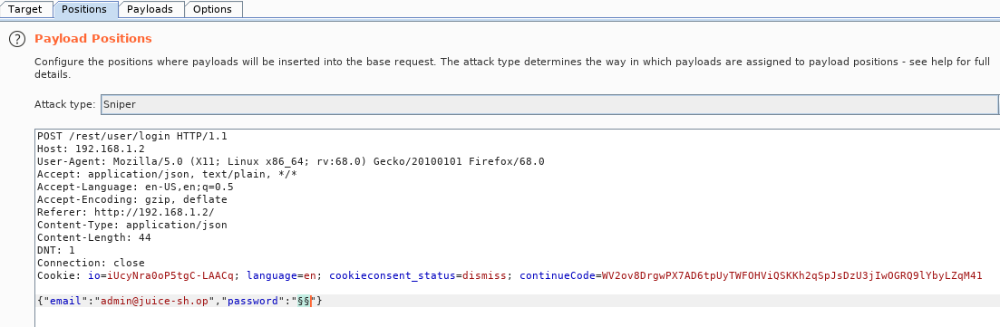

For the payload, we will be using the **best1050.txt** from Seclists. (Which can be installed via: `sudo apt-get install seclists`)

You can load the list from: `/usr/share/wordlists/SecLists/Passwords/Common-Credentials/best1050.txt`

Once the file is loaded into Burp, **start the attack**. You will want to filter for the request by status.

- A failed request will receive a **401 Unauthorized**.
- Whereas a successful request will return a **200 OK**.

The password is: `admin123`

Once completed, login to the account with the password.

Flag: c2110d06dc6f81c67cd8099ff0ba601241f1ac0e

#### Q2. Reset Jim's password

Believe it or not, the reset password mechanism can also be exploited! When inputted into the email field in the Forgot Password page, Jim's security question is set to "Your eldest siblings middle name?".

In Task 2, we found that Jim might have something to do with **Star Trek**. Googling "Jim Star Trek" gives us a wiki page for **Jame T. Kirk** from Star Trek.

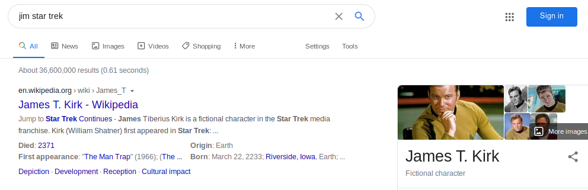

Looking through the wiki page we find that he has a brother.

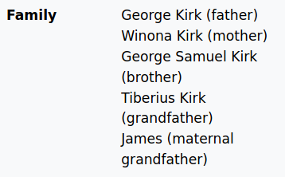

Looks like his brother's middle name is Samuel.

Inputting that into the Forgot Password page allows you to successfully change his password.

You can change it to anything you want!

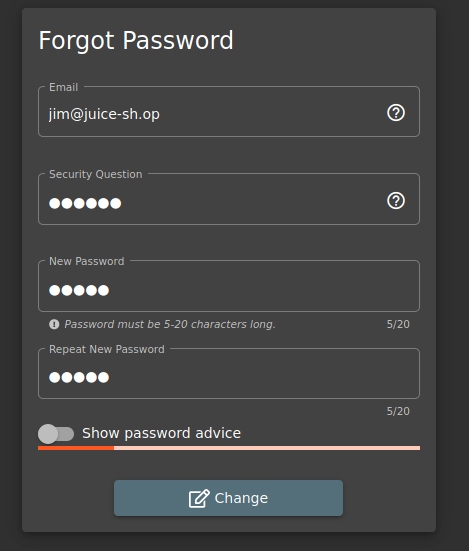

Flag: 094fbc9b48e525150ba97d05b942bbf114987257

### Task 5 - AH! Don't look


A web application should store and transmit sensitive data safely and securely. But in some cases, the developer may not correctly protect their sensitive data, making it vulnerable.

Most of the time, data protection is not applied consistently across the web application making certain pages accessible to the public. Other times information is leaked to the public without the knowledge of the developer, making the web application vulnerable to an attack.

More information: [Sensitive Data Exposure](https://owasp.org/www-project-top-ten/OWASP_Top_Ten_2017/Top_10-2017_A3-Sensitive_Data_Exposure)

#### Q1. Access the Confidential Document

Navigate to the `About Us` page

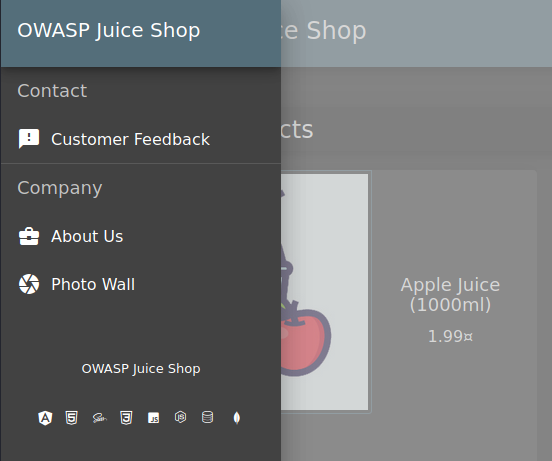

And hover over the "Check out our terms of use".


You will see that it links to `http://10.10.237.57/ftp/legal.md`. Navigating to that `/ftp/` directory reveals that it is exposed to the public!

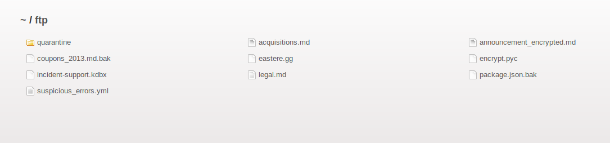

We will download the **acquisitions.md** and save it. It looks like there are other files of interest here as well.

After downloading it, navigate to the home page to receive the flag!

Flag: edf9281222395a1c5fee9b89e32175f1ccf50c5b

#### Q2. Log into MC SafeSearch's account

After watching [the YouTube video](https://www.youtube.com/watch?v=v59CX2DiX0Y) there are certain parts of the song that stand out.

He notes that his password is "**Mr. Noodles**" but he has replaced some "**vowels into zeros**", meaning that he just replaced the o's into 0's.

We now know the password to the `mc.safesearch@juice-sh.op` account is "**Mr. N00dles**"

Flag: 66bdcffad9e698fd534003fbb3cc7e2b7b55d7f0

#### Q3. Download the Backup file

We will now go back to the `http://10.10.237.57/ftp/` folder and try to download `package.json.bak`. But it seems we are met with a **403** which says that only `.md` and `.pdf` files can be downloaded.


To get around this, we will use a character bypass called "**Poison Null Byte**". A Poison Null Byte looks like this: `%00`.

Note: as we can download it using the url, we will need to encode this into a url encoded format.

The Poison Null Byte will now look like this: `%2500`. Adding this and then a `.md` to the end will bypass the 403 error!

`10.10.206.192/ftp/package.json.bak%2500.md`

Why does this work?

A Poison Null Byte is actually a **NULL terminator**. By placing a NULL character in the string at a certain byte, the string will tell the server to terminate at that point, nulling the rest of the string.

Flag: bfc1e6b4a16579e85e06fee4c36ff8c02fb13795

### Task 6 - Who's flying this thing?


Modern-day systems will allow for multiple users to have access to different pages. Administrators most commonly use an administration page to edit, add and remove different elements of a website. You might use these when you are building a website with programs such as Weebly or Wix.  

When Broken Access Control exploits or bugs are found, it will be categorised into one of **two types**:

| Type of Privilege Escalation | Description |
|----|----|
|**Horizontal** Privilege Escalation|Occurs when a user can perform an action or access data of another user with the **same** level of permissions.|
|**Vertical** Privilege Escalation|Occurs when a user can perform an action or access data of another user with a **higher** level of permissions.|


More information: [Broken Access Control](https://owasp.org/www-project-top-ten/OWASP_Top_Ten_2017/Top_10-2017_A5-Broken_Access_Control)

#### Q1. Access the administration page

First, we are going to open the **Debugger** on **Firefox**. (Or **Sources** on **Chrome**.)

This can be done by navigating to it in the Web Developer menu.

We are then going to refresh the page and look for a javascript file for `main-es2015.js`

We will then go to that page at: `http://10.10.237.57/main-es2015.js`

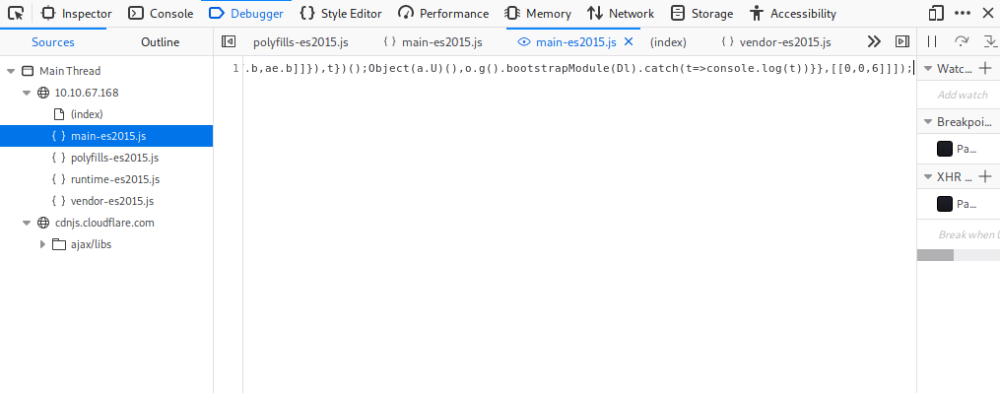

To get this into a format we can read, click the `{ }` button at the bottom.

Now search for the term "**admin**"

You will come across a couple of different words containing "admin" but the one we are looking for is `path: 'administration',`

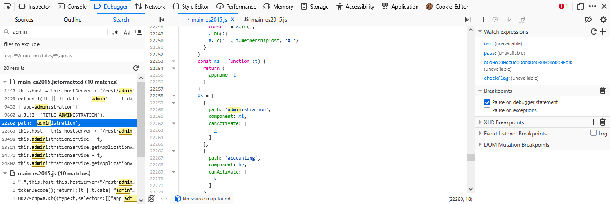

This hints towards a page called "**/#/administration**" as can be seen by the about path a couple lines below, but going there while not logged in doesn't work.

As this is an Administrator page, it makes sense that we need to be in the **Admin account** in order to view it.

A good way to stop users from accessing this is to only load parts of the application that need to be used by them. This stops sensitive information such as an admin page from been leaked or viewed.

Flag: 946a799363226a24822008503f5d1324536629a0

#### Q2. View another user's shopping basket

Login to the Admin account and click on 'Your Basket'. Make sure Burp is running so you can capture the request!

Forward each request until you see: `GET /rest/basket/1 HTTP/1.1`

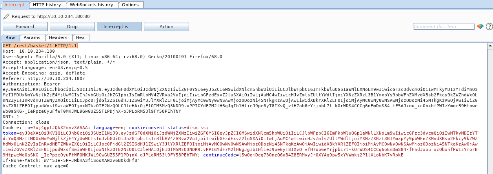

Now, we are going to change the number **1** after /basket/ to **2**.

`GET /rest/basket/2 HTTP/1.1`

It will now show you the basket of UserID 2. You can do this for other UserIDs as well, provided that they have one!

Flag: 41b997a36cc33fbe4f0ba018474e19ae5ce52121

#### Q3. Remove all 5-star reviews

Navigate to the `http://10.10.237.57/#/administration` page again and click the bin icon next to the review with 5 stars!

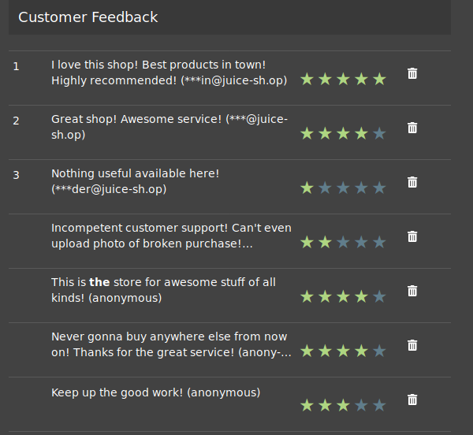

Flag: 50c97bcce0b895e446d61c83a21df371ac2266ef

### Task 7 - Where did that come from?


**XSS** or **Cross-site scripting** is a vulnerability that allows attackers to run javascript in web applications. These are one of the most found bugs in web applications. Their complexity ranges from easy to extremely hard, as each web application parses the queries in a different way.

There are three major types of XSS attacks:

| Type of XSS | Description |
|----|----|
|DOM (Special)|**DOM XSS** (Document Object Model-based Cross-site Scripting) uses the HTML environment to execute malicious javascript. This type of attack commonly uses the `<script></script>` HTML tag.|
|Persistent (Server-side)|**Persistent XSS** is javascript that is run when the server loads the page containing it. These can occur when the server does not sanitise the user data when it is **uploaded** to a page. These are commonly found on blog posts.|
|Reflected (Client-side)|**Reflected XSS** is javascript that is run on the client-side end of the web application. These are most commonly found when the server doesn't sanitise **search** data.|

More information: [Cross-Site Scripting XSS](https://owasp.org/www-project-top-ten/OWASP_Top_Ten_2017/Top_10-2017_A7-Cross-Site_Scripting_(XSS))

#### Q1. Perform a DOM XSS


We will be using the iframe element with a javascript alert tag:

`<iframe src="javascript:alert(`xss`)">`

Inputting this into the **search bar** will trigger the alert.

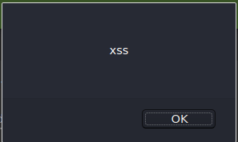

Note that we are using **iframe** which is a common HTML element found in many web applications, there are others which also produce the same result.

This type of XSS is also called XFS (Cross-Frame Scripting), is one of the most common forms of detecting XSS within web applications.

Websites that allow the user to modify the iframe or other DOM elements will most likely be vulnerable to XSS.

Why does this work?

It is common practice that the search bar will send a request to the server in which it will then send back the related information, but this is where the flaw lies. Without correct input sanitation, we are able to perform an XSS attack against the search bar.

Flag: 9aaf4bbea5c30d00a1f5bbcfce4db6d4b0efe0bf

#### Q2. Perform a persistent XSS

First, login to the **admin** account.

We are going to navigate to the "**Last Login IP**" page under `Account` -> `Privacy & Security` for this attack.


It should say the last IP Address is 0.0.0.0 or 10.x.x.x

As it logs the 'last' login IP we will now logout so that it logs the 'new' IP.

Make sure that Burp **intercept is on**, so it will catch the logout request.

We will then head over to the Headers tab where we will add a new header:

True-Client-IP     `<iframe src="javascript:alert(`xss`)">`

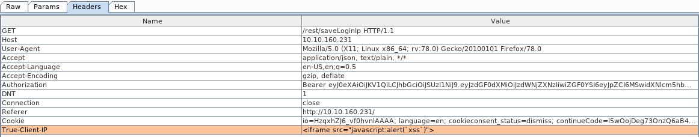

Then forward the request to the server!

When signing back into the admin account and navigating to the Last Login IP page again, we will see the XSS alert!

Why do we have to send this Header?

The **True-Client-IP** header is similar to the **X-Forwarded-For** header, both tell the server or proxy what the IP of the client is. Due to there being no sanitation in the header we are able to perform an XSS attack.

Flag: 149aa8ce13d7a4a8a931472308e269c94dc5f156

#### Q3. Perform a reflected XSS

First, we are going to need to be on the right page to perform the reflected XSS!

**Login** into the **admin** account and navigate to the '**Order History**' page.

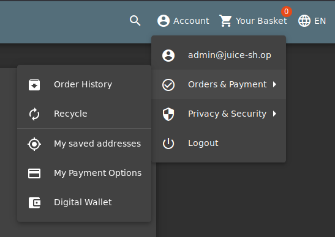

From there you will see a "**Truck**" icon, clicking on that will bring you to the track result page. You will also see that there is an id paired with the order:

`http://10.10.237.57/#/track-result?id=5267-0870addbad438a9a`

We will use the iframe XSS, `<iframe src="javascript:alert(`xss`)">`, in the place of the `5267-f73dcd000abcc353`

After submitting the URL, **refresh the page** and you will then get an alert saying XSS!

Why does this work?

The server will have a lookup table or database (depending on the type of server) for each tracking ID. As the 'id' parameter is not sanitised before it is sent to the server, we are able to perform an XSS attack.

Flag: 23cefee1527bde039295b2616eeb29e1edc660a0

### Task 8 - Exploration

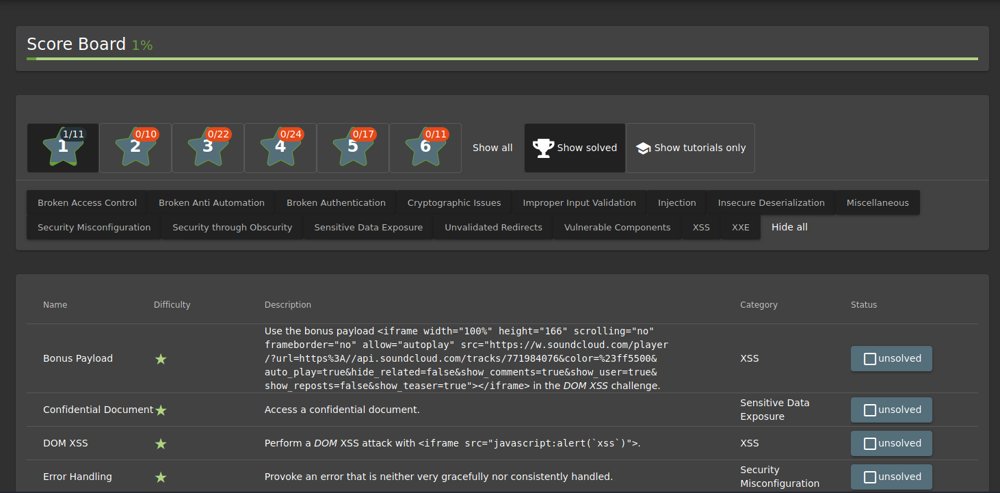

If you wish to tackle some of the **harder** challenges that were not covered within this room, check out the `/#/score-board/` section on Juice-shop. Here you can see your completed tasks as well as other tasks in varying difficulty.

#### Access the /#/score-board/ page

Flag: 7efd3174f9dd5baa03a7882027f2824d2f72d86e

For additional information, please see the references below.

## References

- [Burp suite - Documentation](https://portswigger.net/burp/documentation)
- [Burp suite - Homepage](https://portswigger.net/burp)
- [OWASP Juice Shop- GitHub](https://github.com/juice-shop/juice-shop)
- [OWASP Juice Shop- OWASP](https://owasp.org/www-project-juice-shop/)
- [OWASP Top 10 - 2021 - OWASP](https://owasp.org/Top10/)
- [OWASP Top Ten - OWASP](https://owasp.org/www-project-top-ten/)
