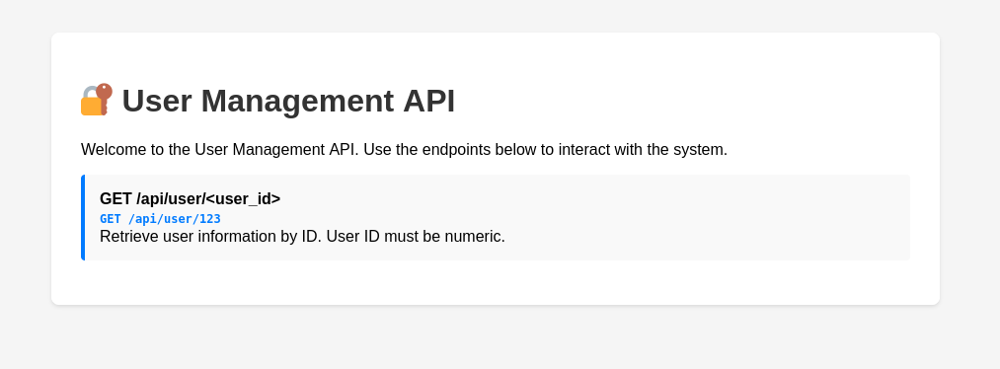
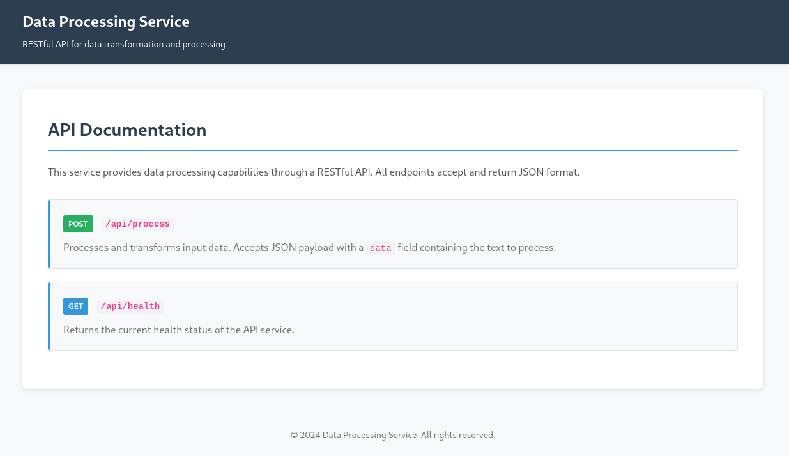
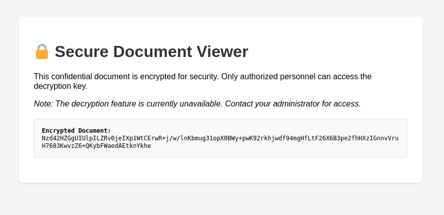
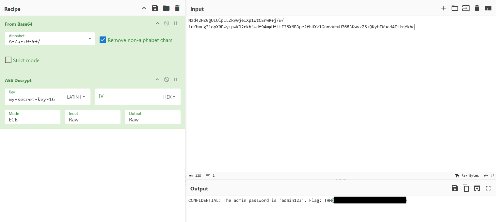

# OWASP Top 10 2025: Application Design Flaws

- [Room information](#room-information)
- [Solution](#solution)
- [References](#references)

## Room information

```text
Type: Walkthrough
Difficulty: Easy
Tags: -
Subscription type: Free
Description:
Learn about A02, A03, A04, and A06 and how they related to design flaws in the application.
```

Room link: [https://tryhackme.com/room/owasptopten2025two](https://tryhackme.com/room/owasptopten2025two)

## Solution

### Task 1: Introduction


This room breaks each 4 of the OWASP Top 10 2025 categories. In this room, you will learn about the categories that are related to failures in architecture and system design. You will put the theory into practice by completing supporting challenges. The following categories are covered in this room:

- AS02: Security Misconfigurations
- AS03: Software Supply Chain Failures
- AS04: Cryptographic Failures
- AS06: Insecure Design

#### Deploy Practical

Before we begin, please deploy the practical VM by clicking the green "**Start Machine**" button at the start of this task. Please note that you will need to use either the TryHackMe AttackBox or your own hacking machine connected to the TryHackMe VPN to access each practical.

### Task 2: AS02: Security Misconfigurations

#### Security Misconfigurations

**What It Is**

Security misconfigurations happen when systems, servers, or applications are deployed with unsafe defaults, incomplete settings, or exposed services. These are not code bugs but mistakes in how the environment, software, or network is set up. They create easy entry points for attackers.

**Why It Matters**

Even small misconfigurations can expose sensitive data, enable privilege escalation, or give attackers a foothold into the system. Modern applications rely on complex stacks, cloud services, and third-party APIs. A single exposed admin panel, an open storage bucket, or misconfigured permissions can compromise the entire system.

**Example**

In 2017, [Uber](https://www.huntress.com/threat-library/data-breach/uber-data-breach) exposed a backup AWS S3 bucket with sensitive user data, including driver and rider information, because the bucket was publicly accessible. Attackers could download data directly without needing credentials. This shows how a deployment mistake can lead to a significant breach.

**Common Patterns**

- Default credentials or weak passwords left unchanged
- Unnecessary services or endpoints exposed to the internet
- Misconfigured cloud storage or permissions (S3, Azure Blob, GCP buckets)
- Unrestricted API access or missing authentication/authorisation
- Verbose error messages exposing stack traces or system details
- Outdated software, frameworks, or containers with known vulnerabilities
- Exposed AI/ML endpoints without proper access controls

**How To Prevent It**

- Harden default configurations and remove unused features or services
- Enforce strong authentication and least privilege across all systems
- Limit network exposure and segment sensitive resources
- Keep software, frameworks, and containers up to date with patches
- Hide stack traces and system information from error messages
- Audit cloud configurations and permissions regularly
- Secure AI endpoints and automation services with proper access controls and monitoring
- Integrate configuration reviews and automated security checks into your deployment pipeline

#### Challenge

Navigate to `10.67.129.255:5002`. It appears that the developers left too many traces in their User Management APIs.

---------------------------------------------------------------------------------------

#### What's the flag?

Browsing to `http://10.67.129.255:5002/` we find some general instructions about the API



We do a simple test request for the UID 1 with curl and get back some JSON data:

```bash
┌──(kali㉿kali)-[/mnt/hgfs/Wargames/TryHackMe/Walkthroughs]
└─$ curl http://10.67.129.255:5002/api/user/1
{
  "email": "john@example.com",
  "id": "1",
  "name": "John Doe"
}
```

Drawing our attention to the remark `User ID must be numeric` we can try something non-numeric to get the flag.

```bash
┌──(kali㉿kali)-[/mnt/hgfs/Wargames/TryHackMe/Walkthroughs]
└─$ curl http://10.67.129.255:5002/api/user/bad
{
  "debug_info": {
    "flag": "THM{<REDACTED>}"
  },
  "error": "Invalid user ID format: bad. Flag: THM{<REDACTED>}",
  "traceback": "Traceback (most recent call last):\n  File \"/app/app.py\", line 21, in get_user\n    raise ValueError(f\"Invalid user ID format: {user_id}. Flag: {FLAG}\")\nValueError: Invalid user ID format: bad. Flag: THM{<REDACTED>}\n"
}
```

Answer: `THM{<REDACTED>}`

### Task 3: AS03: Software Supply Chain Failures

#### Software Supply Chain Failures

**What It Is**

Software supply chain failures happen when applications rely on components, libraries, services, or models that are compromised, outdated, or improperly verified. These weaknesses are not inherent in your code, but rather in the software and tools you depend on. Attackers exploit these weak links to inject malicious code, bypass security, or steal sensitive data.

**Why It Matters**

Modern applications are built from many third-party packages, APIs, and AI models. One compromised dependency can compromise your entire system, allowing attackers to gain access without ever touching your own code. Supply chain attacks can be automated and distributed, making them hard to detect and very damaging.

**Example**

In 2021, the [SolarWinds](https://www.fortinet.com/uk/resources/cyberglossary/solarwinds-cyber-attack) Orion compromise showed the danger of supply chain attacks. Attackers inserted malicious code into a trusted update, affecting thousands of organisations that automatically installed it. This wasn’t a bug in SolarWinds’ core logic. It was a flaw in the software update building, verification, and distribution process.

With AI, we can observe this when using unverified third-party models or fine-tuned datasets that can embed hidden behaviours, backdoors, or biased outputs, compromising systems or leaking data.

**Common Patterns**

- Using unverified or unmaintained libraries and dependencies
- Automatically installing updates without verification
- Over-reliance on third-party AI models without monitoring or auditing
- Insecure build pipelines or CI/CD processes that allow tampering
- Poor license or provenance tracking for components
- Lack of monitoring for vulnerabilities in dependencies after deployment

**How To Protect The Supply Chain**

- Verify all third-party components, libraries, and AI models before use
- Monitor and patch dependencies regularly
- Sign, verify, and audit software updates and packages
- Lock down CI/CD pipelines and build processes to prevent tampering
- Track provenance and licensing for all dependencies
- Implement runtime monitoring for unusual behaviour from dependencies or AI components
- Integrate supply chain threat modelling into the SDLC, including testing, deployment, and update workflows

#### Challenge

Navigate to `10.67.129.255:5003`. The code is outdated and imports an old `lib/vulnerable_utils.py` component. Can you **debug** it?

---------------------------------------------------------------------------------------

#### What's the flag?

Manually browsing to `http://10.67.129.255:5003/` gives us general API information as before



Checking the Python/Flask source code

```python
┌──(kali㉿kali)-[/mnt/…/TryHackMe/Walkthroughs/Easy/OWASP_Top_10_2025-Application_Design_Flaws]
└─$ cat app.py                                        
from flask import Flask, render_template, request, jsonify
import sys
import os

# Import from local unverified library
sys.path.insert(0, os.path.join(os.path.dirname(__file__), 'lib'))
from vulnerable_utils import process_data, format_output, debug_info

app = Flask(__name__)

@app.route('/')
def index():
    return render_template('index.html')

@app.route('/api/process', methods=['POST'])
def process():
    """Process user input using third-party library"""
    try:
        data = request.json.get('data', '')
        if not data:
            return jsonify({'error': 'Missing data parameter'}), 400
        
        # Check for debug mode 
        if data == 'debug':
            return jsonify(debug_info())
        
        processed = process_data(data)
        formatted = format_output(processed)
        
        return jsonify({
            'result': formatted,
            'status': 'success'
        })
    except Exception as e:
        return jsonify({'error': str(e)}), 500

@app.route('/api/health')
def health():
    """Health check endpoint"""
    return jsonify({
        'status': 'healthy',
        'version': '1.0.0'
    })

if __name__ == '__main__':
    app.run(host='0.0.0.0', port=5000, debug=True)
```

We can see that we can get **debug** information

```python
        # Check for debug mode 
        if data == 'debug':
            return jsonify(debug_info())
```

if we supply the correct JSON-data.

Let's try it:

```bash
┌──(kali㉿kali)-[/mnt/…/TryHackMe/Walkthroughs/Easy/OWASP_Top_10_2025-Application_Design_Flaws]
└─$ curl -X POST --data '{"data":"debug"}' -H 'Content-Type: application/json' http://10.67.129.255:5003/api/process
{
  "admin_token": "admin_token_12345",
  "flag": "THM{<REDACTED>}",
  "internal_secret": "internal_secret_key_2024",
  "version": "1.2.3"
}
```

Answer: `THM{<REDACTED>}`

### Task 4: AS04: Cryptographic Failures

#### Cryptographic Failures

**What It Is**

Cryptographic failures happen when encryption is used incorrectly or not at all. This includes weak algorithms, hard-coded keys, poor key handling, or unencrypted sensitive data. These flaws let attackers access information that should be private.

**Why It Matters**

Web applications rely on cryptography everywhere: protecting network traffic, securing stored data, verifying identities, and safeguarding secrets. When these controls fail, sensitive data such as passwords, tokens, or personal information can be exposed, leading to account takeovers or full-scale breaches.

Attackers can exploit these flaws through man-in-the-middle attacks, brute-force attacks on weak keys, or by simply discovering secrets that were never properly protected.

**Common Patterns**

- Using deprecated or weak algorithms like MD5, SHA-1, or ECB mode
- Hard-coded secrets in code or configuration
- Poor key rotation or management practices
- Lack of encryption for sensitive data at rest or in transit
- Self-signed or invalid TLS certificates
- Using AI/ML systems without proper secret handling for model parameters or sensitive inputs

**How To Prevent It**

- Use strong, modern algorithms such as AES-GCM, ChaCha20-Poly1305, or enforce TLS 1.3 with valid certificates
- Use secure key management services like Azure Key Vault, AWS KMS, or HashiCorp Vault
- Rotate secrets and keys regularly, following defined crypto periods
- Document and enforce policies and standard operating procedures for key lifecycle management
- Maintain a complete inventory of certificates, keys, and their owners
- Ensure AI models and automation agents never expose unencrypted secrets or sensitive data
- The web application in this room contains a weakness of this type for you to explore.

#### Challenge

Navigate to `10.67.129.255:5004`. Can you find the key to decrypt the file?

---------------------------------------------------------------------------------------

#### What's the flag?

Manually browsing to `http://10.67.129.255:5004/` shows us a `Secure Document Viewer`



We can see the document in encrypted form on the page

```text
Nzd42HZGgUIUlpILZRv0jeIXp1WtCErwR+j/w/lnKbmug31opX0BWy+pwK92rkhjwdf94mgHfLtF26X6B3pe2fhHXzIGnnvVruH7683KwvzZ6+QKybFWaedAEtknYkhe
```

Checking the HTML source code we find a reference to a `decrypt.js` function

```html
<!DOCTYPE html>
<html lang="en">
<head>
    <meta charset="UTF-8">
    <meta name="viewport" content="width=device-width, initial-scale=1.0">
    <title>Secure Document Viewer</title>
    <style>
        body {
            font-family: Arial, sans-serif;
            max-width: 800px;
            margin: 50px auto;
            padding: 20px;
            background: #f5f5f5;
        }
        .container {
            background: white;
            padding: 30px;
            border-radius: 8px;
            box-shadow: 0 2px 4px rgba(0,0,0,0.1);
        }
        h1 {
            color: #333;
        }
        .encrypted-box {
            background: #f9f9f9;
            border: 1px solid #ddd;
            padding: 15px;
            border-radius: 4px;
            font-family: monospace;
            word-break: break-all;
            margin: 20px 0;
        }
    </style>
</head>
<body>
    <div class="container">
        <h1>🔒 Secure Document Viewer</h1>
        <p>This confidential document is encrypted for security. Only authorized personnel can access the decryption key.</p>
        <p><em>Note: The decryption feature is currently unavailable. Contact your administrator for access.</em></p>
        
        <div class="encrypted-box" id="encrypted">
            <strong>Encrypted Document:</strong><br>
            Nzd42HZGgUIUlpILZRv0jeIXp1WtCErwR+j/w/lnKbmug31opX0BWy+pwK92rkhjwdf94mgHfLtF26X6B3pe2fhHXzIGnnvVruH7683KwvzZ6+QKybFWaedAEtknYkhe
        </div>
    </div>
    
    <script src="/static/js/decrypt.js"></script>
</body>
</html>
```

The JavaScript file looks like this

```javascript
// Document encryption utilities
// Last updated: 2024-03-15

(function() {
    'use strict';
    
    // Configuration
    const SECRET_KEY = "my-secret-key-16";
    const ENCRYPTION_MODE = "ECB";
    const KEY_SIZE = 128;
    
    // Utility functions
    function formatTimestamp(date) {
        return date.toISOString().replace('T', ' ').substring(0, 19);
    }
    
    function validateDocumentId(id) {
        return /^[a-zA-Z0-9-_]+$/.test(id);
    }
    
    function getDocumentMetadata() {
        return {
            version: "1.2.3",
            encryptionEnabled: false,
            lastModified: formatTimestamp(new Date())
        };
    }
    
    // Logging utility
    function logEvent(eventType, details) {
        if (typeof console !== 'undefined' && console.log) {
            console.log(`[${formatTimestamp(new Date())}] ${eventType}:`, details);
        }
    }
    
    // Document validation
    function isValidDocumentFormat(data) {
        try {
            const decoded = atob(data);
            return decoded.length > 0 && decoded.length % 16 === 0;
        } catch (e) {
            return false;
        }
    }
    
    // Export to global scope if needed
    if (typeof window !== 'undefined') {
        window.documentUtils = {
            getMetadata: getDocumentMetadata,
            validateFormat: isValidDocumentFormat,
            validateId: validateDocumentId
        };
    }
    
    logEvent('INIT', 'Document utilities loaded');
})();
```

In the code, we especially note the following AES-configuration

```javascript
    // Configuration
    const SECRET_KEY = "my-secret-key-16";
    const ENCRYPTION_MODE = "ECB";
    const KEY_SIZE = 128;
```

and the use of the atob()-function which tells us that Base64-encoding is used

```javascript
    const decoded = atob(data);
```

Finally, we can decrypt the document in [CyberChef](https://gchq.github.io/CyberChef/)



Answer: `THM{<REDACTED>}`

### Task 5: AS06: Insecure Design

#### Insecure Design

**What It Is**

Insecure design happens when flawed logic or architecture is built into a system from the start. These flaws stem from skipped threat modelling, no design requirements or reviews, or accidental errors.

Moreover, with the introduction of AI assistants, AI systems exacerbate insecure design. Developers often assume that models are safe, correct, or predictable, or that the code they produce is flaw-free. When an AI system can generate queries, write code, or classify users without limits, the risk is built into the design, leading to poor architectural patterns.

**Example**

A good example is [Clubhouse](https://www.networkintelligence.ai/blogs/vulnerabilities-and-privacy-issues-with-clubhouse-app/). Its early design assumed users would only interact through the mobile app, but the backend API had no proper authentication. Anyone could query user data, room info, and even private conversations directly. When researchers tested it, "he entire "private c "nversation" premise fell apart.

**Why It Matters**

You can't patch an insecure design. It's built into the workflow, logic, and trust boundaries. Fixing it means rethinking how systems, and now AI, make decisions.

**Common Insecure Designs In 2025**

- Weak business logic controls, like recovery or approval flows
- Flawed assumptions about user or model behaviour
- AI components with unchecked authority or access
- Missing guardrails for LLMs and automation agents
- Test or debug bypasses left in production
- No consistent abuse-case review or AI threat modelling

**Insecure Design In The AI Era**

AI introduces new kinds of design failures. For example, prompt injection occurs when user input is blended with system prompts, allowing attackers to hijack the context or extract hidden data. Blind trust in model output creates fragile systems that act on AI decisions without validation or oversight, which is why human review remains necessary. When it comes to poisoned models, pulled from unverified sources or fine-tuned on unsafe data, they can embed hidden behaviours or backdoors that compromise the system from within.

**How To Design Securely**

- Treat every model as untrusted until proven otherwise.
- Validate and filter all model inputs and outputs to ensure accuracy and integrity.
- Separate system prompts from user content.
- Keep sensitive data out of prompts unless absolutely needed and protect it with strict controls.
- Require human review for high-risk AI actions.
- Log model provenance, monitor behaviour, and apply differential privacy for sensitive data.
- Include AI-specific threat modelling for prompt attacks, inference risks, agent misuse, and supply chain compromise throughout the design process.
- Build threat modelling into every stage of development, not just at the start.
- Define clear security requirements for each feature before implementation.
- Apply the principle of least privilege across users, APIs, and services.
- Ensure proper authentication, authorisation, and session management across the system.
- Keep dependencies, third-party components, and supply chain sources verified and up to date.
- Continuously monitor and test the system for logic flaws, abuse paths, and emergent risks as new features or AI components are added.

#### Challenge

Navigate to `10.67.129.255:5005`. Have they assumed that only mobile devices can access it?

---------------------------------------------------------------------------------------

#### What's the flag?

Manually browsing to `http://10.67.129.255:5005/` shows us information about the `SecureChat`


Checking the HTML source gives us no further information to go on.

As a next step, why not check for the API endpoints used previously in this room:

- `/api/user`
- `/api/user/1`
- `/api/process`
- `/api/health`

But no joy!

Next, we try to bruteforce for endpoints with `ffuf`

```bash
┌──(kali㉿kali)-[/mnt/…/TryHackMe/Walkthroughs/Easy/OWASP_Top_10_2025-Application_Design_Flaws]
└─$ ffuf -w /usr/share/seclists/Discovery/Web-Content/api/api-endpoints.txt -u http://10.67.129.255:5005/FUZZ -ac -X POST 

        /'___\  /'___\           /'___\       
       /\ \__/ /\ \__/  __  __  /\ \__/       
       \ \ ,__\\ \ ,__\/\ \/\ \ \ \ ,__\      
        \ \ \_/ \ \ \_/\ \ \_\ \ \ \ \_/      
         \ \_\   \ \_\  \ \____/  \ \_\       
          \/_/    \/_/   \/___/    \/_/       

       v2.1.0-dev
________________________________________________

 :: Method           : POST
 :: URL              : http://10.67.129.255:5005/FUZZ
 :: Wordlist         : FUZZ: /usr/share/seclists/Discovery/Web-Content/api/api-endpoints.txt
 :: Follow redirects : false
 :: Calibration      : true
 :: Timeout          : 10
 :: Threads          : 40
 :: Matcher          : Response status: 200-299,301,302,307,401,403,405,500
________________________________________________

api/users/current       [Status: 405, Size: 153, Words: 16, Lines: 6, Duration: 118ms]
api/users/login         [Status: 405, Size: 153, Words: 16, Lines: 6, Duration: 111ms]
:: Progress: [269/269] :: Job [1/1] :: 162 req/sec :: Duration: [0:00:03] :: Errors: 0 ::
```

Let's switch to some manual enumeration with `curl`.

After some trial and error, a list of users were found:

```bash
┌──(kali㉿kali)-[/mnt/…/TryHackMe/Walkthroughs/Easy/OWASP_Top_10_2025-Application_Design_Flaws]
└─$ curl http://10.67.129.255:5005/api/users        
{
  "admin": {
    "email": "admin@example.com",
    "name": "Admin",
    "role": "admin"
  },
  "user1": {
    "email": "alice@example.com",
    "name": "Alice",
    "role": "user"
  },
  "user2": {
    "email": "bob@example.com",
    "name": "Bob",
    "role": "user"
  }
}
```

We are likely interested in the `Admin` user's messages.

After some additional enumeration they were found here:

```bash
┌──(kali㉿kali)-[/mnt/…/TryHackMe/Walkthroughs/Easy/OWASP_Top_10_2025-Application_Design_Flaws]
└─$ curl http://10.67.129.255:5005/api/messages/admin
{
  "messages": [
    {
      "content": "Admin panel access key: THM{<REDACTED>}",
      "from": "system"
    }
  ],
  "user": "admin"
}
```

Answer: `THM{<REDACTED>}`

### Task 6: Conclusion

#### Conclusion

Security design failures across AS02 Security Misconfigurations, AS03 Software Supply Chain Failures, AS04 Cryptographic Failures, and AS06 Insecure Design all come from the same root cause: weak foundations. You cannot add security at the end and expect it to work. Strong systems start with clear security requirements, realistic threat assumptions, controlled configurations, vetted dependencies, and sound cryptographic choices.

Treat defaults with suspicion, treat every dependency as a potential risk, and keep design simple enough to reason about. Get the design right early, and you avoid a long future of preventable incidents.

Continue the journey with **Room 3** in this module: **Application Design Flaws**: [https://tryhackme.com/jr/owasptop102025insecuredatahandling](https://tryhackme.com/jr/owasptop102025insecuredatahandling)

For additional information, please see the references below.

## References

- [A02:2025 - Security Misconfiguration - OWASP Top 10](https://owasp.org/Top10/2025/A02_2025-Security_Misconfiguration/)
- [A03:2025 - Software Supply Chain Failures - OWASP Top 10](https://owasp.org/Top10/2025/A03_2025-Software_Supply_Chain_Failures/)
- [A04:2025 - Cryptographic Failures - OWASP Top 10](https://owasp.org/Top10/2025/A04_2025-Cryptographic_Failures/)
- [A06:2025 - Insecure Design - OWASP Top 10](https://owasp.org/Top10/2025/A06_2025-Insecure_Design/)
- [Advanced Encryption Standard - Wikipedia](https://en.wikipedia.org/wiki/Advanced_Encryption_Standard)
- [curl - Homepage](https://curl.se/)
- [curl - Linux manual page](https://man7.org/linux/man-pages/man1/curl.1.html)
- [cURL - Wikipedia](https://en.wikipedia.org/wiki/CURL)
- [ffuf - GitHub](https://github.com/ffuf/ffuf)
- [ffuf - Kali Tools](https://www.kali.org/tools/ffuf/)
- [Flask (web framework) - Wikipedia](https://en.wikipedia.org/wiki/Flask_(web_framework))
- [HTML - Wikipedia](https://en.wikipedia.org/wiki/HTML)
- [JavaScript - Wikipedia](https://en.wikipedia.org/wiki/JavaScript)
- [JSON - Wikipedia](https://en.wikipedia.org/wiki/JSON)
- [OWASP Top 10:2025 - OWASP](https://owasp.org/Top10/2025/)
- [Python (programming language) - Wikipedia](https://en.wikipedia.org/wiki/Python_(programming_language))
