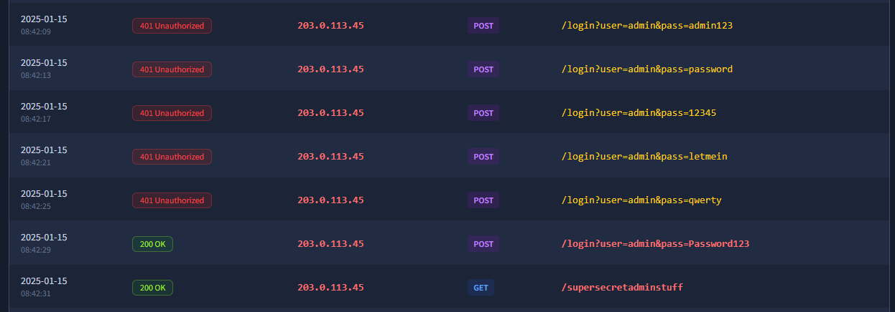
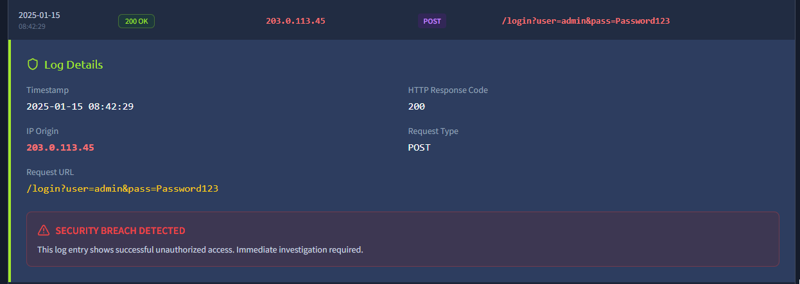

# OWASP Top 10 2025: IAAA Failures

- [Room information](#room-information)
- [Solution](#solution)
- [References](#references)

## Room information

```text
Type: Walkthrough
Difficulty: Easy
Tags: -
Subscription type: Free
Description:
Learn about A01, A07, and A09 in how they related to failures in the applied IAAA model.
```

Room link: [https://tryhackme.com/room/owasptopten2025one](https://tryhackme.com/room/owasptopten2025one)

## Solution

### Task 1: Introduction


This room breaks down 3 of the OWASP Top 10 2025 categories. In this room, you will learn about the categories that are related to failures in how Identity, Authentication, Authorisation, and Accountability (IAAA) is implemented in the application. You will put the theory into practice by completing supporting challenges. The following categories are covered in this room:

1. A01: Broken Access Control
2. A07: Authentication Failures
3. A09: Logging & Alerting Failures

The room has been designed for beginners and assumes no previous security knowledge.

### Task 2: What is IAAA?

IAAA is a simple way to think about how users and their actions are verified on applications. Each item plays a crucial role and it isn't possible to skip a level. That means, if a previous item isn't being performed, you cannot perform the later times. The four items are:

- **Identity** - the unique account (e.g., user ID/email) that represents a person or service.
- **Authentication** - proving that identity (passwords, OTP, passkeys).
- **Authorisation** - what that identity is allowed to do.
- **Accountability** - recording and alerting on who did what, when, and from where.

The three categories of OWASP Top 10:2025 discussed in this room relates to failures in how IAAA was implemented. Weaknesses here can be incredibly detrimental, as it can allow threat actors to either access the data of other users or gain more privileges than they are suppose to have.

If you want a deeper dive on IAAA first, work through [this room](https://tryhackme.com/room/iaaaidm).

---------------------------------------------------------------------------------------

#### What does IAAA stand for?

Answer: `Identity, Authentication, Authorisation, Accountability`

### Task 3: A01: Broken Access Control

Broken Access Control happens when the server doesn’t properly enforce **who can access what** on every request. A common occurence of this is **IDOR** (Insecure Direct Object Reference): if changing an ID (like `?id=7` → `?id=6`) lets you see or edit someone else’s data, access control is broken.

In practice this shows up as horizontal privilege escalation (same role, other user’s stuff) or vertical privilege escalation (jumping to admin-only actions) because the application trusts the client too much.

Start the static site attached to this task and play with the `accountID` value in the URL. So if you can identify which user has more than $ 1 million in their account!

If you want a deeper dive or more variations on the theme (encoded IDs, hashed IDs, etc.), work through these rooms afterwards:

- [Broken Access Control](https://tryhackme.com/room/owaspbrokenaccesscontrol)
- [Insecure Direct Object References](https://tryhackme.com/room/idor)

---------------------------------------------------------------------------------------

#### If you don't get access to more roles but can view the data of another users, what type of privilege escalation is this?

Answer: `horizontal`

#### What is the note you found when viewing the user's account who had more than $ 1 million?

Answer: `THM{<REDACTED>}`

### Task 4: A07: Authentication Failures

Authentication Failures happen when an application can’t reliably verify or bind a user’s identity. Common issues include:

- username enumeration
- weak/guessable passwords (no lockout/rate limits)
- logic flaws in the login/registration flow
- insecure session or cookie handling

If any of these are present, an attacker can often log in as someone else or bind a session to the wrong account.

Let's try to break into the `admin` user's account. We know that their username is `admin`, so let's try to fool the application by registering a user with the name of `aDmiN`. Start the static site attached to this task. register your account and log into the `admin` user's account to get your next flag!

If you want more depth or broader techniques (e.g., brute force, session handling, cookies/JWT/OAuth, and MFA specifics), work through these after this room:

- [Authentication Bypass Room](https://tryhackme.com/room/authenticationbypass)
- [Multi-Factor Authentication](https://tryhackme.com/room/multifactorauthentications)
- [Authentication Module](https://tryhackme.com/module/authentication)

---------------------------------------------------------------------------------------

#### What is the flag on the admin user's dashboard?

1. Register a new user `ADmiN` and the password `Password`.
2. Login with `admin` and the password `Password`
3. See the flag in the Account Description

Answer: `THM{<REDACTED>}`

### Task 5: A09: Logging & Alerting Failures

When applications don’t record or alert on security-relevant events, defenders can’t detect or investigate attacks. Good logging underpins **accountability** (being able to prove who did what, when, and from where). In practice, failures look like missing authentication events, vague error logs, no alerting on brute-force or privilege changes, short retention, or logs stored where attackers can tamper with them.

Let's take a look at what is required to perform an investigation of a application under attack. Start the static site attached to this task, perform your investigation, and answer the questions below. Then, think about how hard it would be to understand what happened during this attack if key pieces of this log information as missing.

If you want a deeper dive into logging for accountability, take a look at [this room](https://tryhackme.com/room/loggingforaccountability).

---------------------------------------------------------------------------------------

#### It looks like an attacker tried to perform a brute-force attack, what is the IP of the attacker?

Checking the 7 suspicious activities we can see that they are all from the same IP-adress:



Answer: `203.0.113.45`

#### Looks like they were able to gain access to an account! What is the username associated with that account?

One POST-request returns a status code of 200 which indicates the login was successful:



Answer: `admin`

#### What action did the attacker try to do with the account? List the endpoint the accessed

Answer: `/supersecretadminstuff`

### Task 6: Conclusion

You’ve just worked through the essentials of **Identity**, **Authentication**, **Authorisation**, and **Accountability** in web applications and how it can cause several of the categories of vulnerabilities discussed in OWASP Top 10:2025. The big ideas to keep:

- **A01 Broken Access Control**: Enforce server-side checks on **every** request
- **A07 Authentication Failures**: Enforce unique indexes on the canonical form, rate-limit/lock out brute force, and rotate sessions on password/privilege changes.
- **A09 Logging & Alerting Failures**: Log the full auth lifecycle (fail/success, password/2FA/role changes, admin actions), centralise logs off-host with retention, and alert on anomalies (e.g., brute-force bursts, privilege elevation).

Continue the journey with **Room 2** in this module: [Application Design Flaws](https://tryhackme.com/jr/owasptopten2025two).

For additional information, please see the references below.

## References

- [A01:2025 - Broken Access Control - OWASP Top 10](https://owasp.org/Top10/2025/A01_2025-Broken_Access_Control/)
- [A07:2025 - Authentication Failures - OWASP Top 10](https://owasp.org/Top10/2025/A07_2025-Authentication_Failures/)
- [A09:2025 - Security Logging and Alerting Failures - OWASP Top 10](https://owasp.org/Top10/2025/A09_2025-Security_Logging_and_Alerting_Failures/)
- [OWASP Top 10:2025 - OWASP](https://owasp.org/Top10/2025/)
