# Splunk: The Basics

- [Room information](#room-information)
- [Solution](#solution)
- [References](#references)

## Room information

```text
Type: Walkthrough
Difficulty: Easy
Tags: Windows
Meta Tags: Walkthrough, Walk-through, Write-up, Writeup
Subscription type: Premium
Description:
Understand how SOC analysts use Splunk for log investigations.
```

Room link: [https://tryhackme.com/room/splunk101](https://tryhackme.com/room/splunk101)

## Solution

### Task 1 - Introduction

Splunk is one of the leading SIEM solutions in the market. It allows users to collect, analyze, and correlate network and machine logs in real time. In this room, we will explore the basics of Splunk and its functionalities, and how it provides better visibility of network activities and helps speed up detection.

#### Learning Objectives

This room covers the following learning objectives:

- Understanding the components of Splunk
- Exploring some available options in Splunk
- Understanding log ingestion in Splunk
- Practically ingesting some Logs in Splunk and analyzing them

#### Room Prerequisites

If you are new to SIEM, please complete the [Introduction to SIEM](https://tryhackme.com/jr/introtosiem) room.

---------------------------------------------------------------------------------------

### Task 2 - Connect with the Lab

#### Set up your virtual environment

To successfully complete this room, you'll need to set up your virtual environment. This involves starting both your AttackBox (if you're not using your VPN) and Lab Machines, ensuring you're equipped with the necessary tools and access to tackle the challenges ahead.

Before proceeding with the following tasks, start the attached lab machine by clicking the **Start Lab Machine** button.

The machine may take up to 3-5 minutes to start. After the machine starts, the Splunk Instance can be accessed at `http://10.112.189.194` either directly on the AttackBox or via the TryHackMe VPN.

Use the URL exactly as shown after the machine starts. Do not add `:8000`; this lab serves Splunk on the default HTTP port.

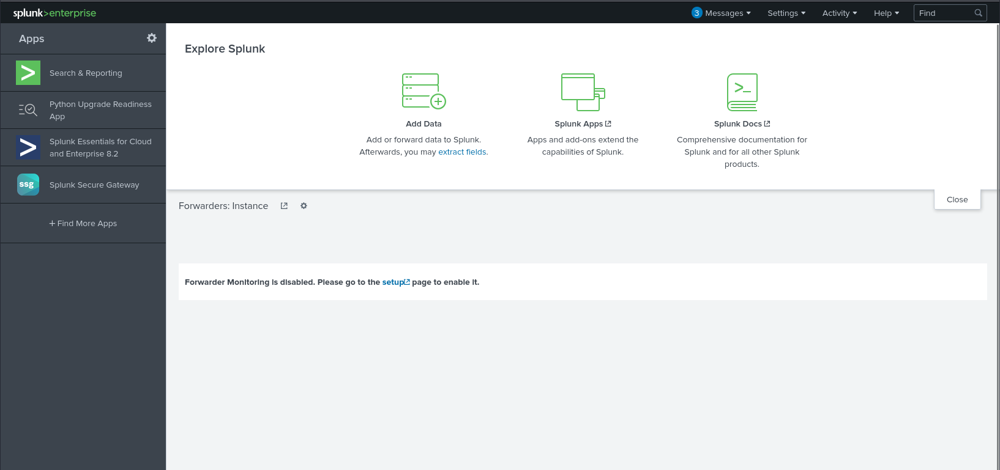

---------------------------------------------------------------------------------------

### Task 3 - Splunk Components

Splunk has three main components: Forwarder, Indexer, and Search Head. These components work together to help us search and analyze the data. These components are explained below:


#### Splunk Forwarder

Splunk Forwarder is a lightweight agent installed on the endpoint intended to be monitored, and its main task is to collect the data and send it to the Splunk instance. It does not affect the endpoint's performance as it takes a few resources to process. Some of the key data sources are:

- Web server generating web traffic.
- Windows machine generating Windows Event Logs, PowerShell, and Sysmon data.
- Linux host generating host-centric logs.
- Database generating DB connection requests, responses, and errors.

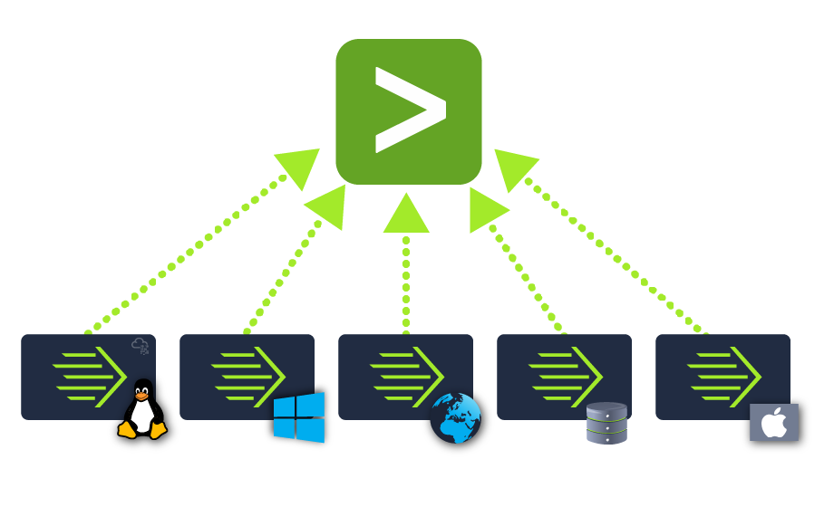

The forwarder collects the data from the log sources and sends it to the Splunk Indexer.

#### Splunk Indexer

Splunk Indexer plays the main role in processing the data it receives from forwarders. It parses and normalizes the data into field-value pairs, categorizes it, and stores the results as events, making the processed data easy to search and analyze.

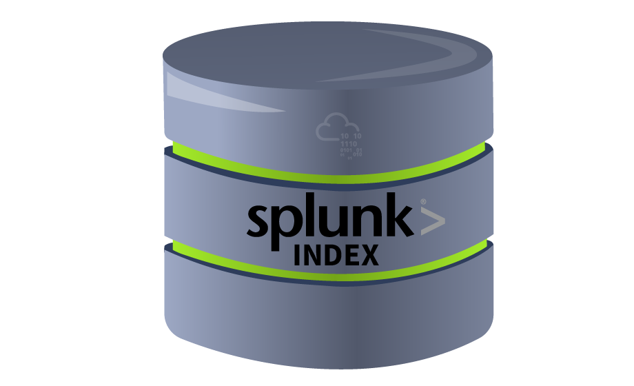

Now, the data, which is normalized and stored by the indexer, can be searched by the Search Head, as explained below.

#### Search Head

Splunk Search Head is the place within the **Search & Reporting App** where users can search the indexed logs, as shown below. The searches are done using the **SPL** (Search Processing Language), a powerful query language for searching indexed data. When the user performs a search, the request is sent to the indexer, and the relevant events are returned as field-value pairs.

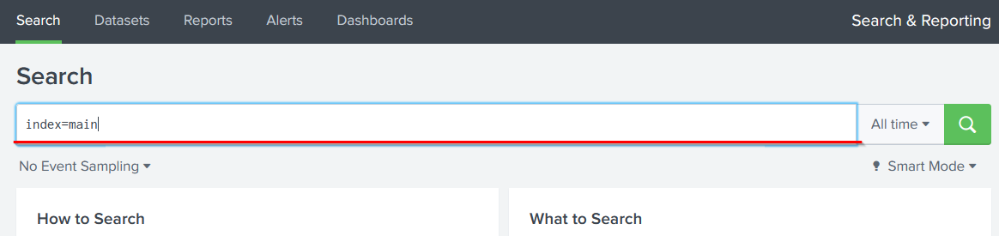

The Search Head also allows you to transform results into presentable tables and visualizations such as pie, bar, and column charts, as shown below:

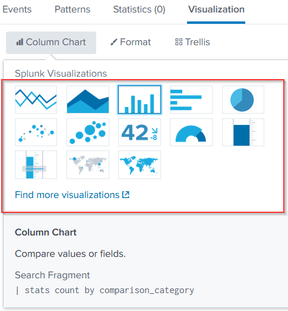

---------------------------------------------------------------------------------------

#### Which component is used to collect and send data over the Splunk instance?

Answer: `Forwarder`

---------------------------------------------------------------------------------------

### Task 4 - Navigating Splunk

When you access Splunk, you will see the default **home screen** as shown below:

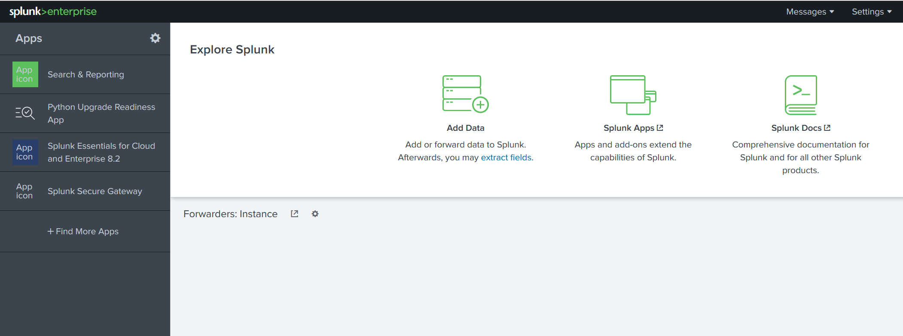

Let's look at each section of this home screen.

#### Splunk Bar

The top panel is the Splunk Bar as shown below:


In the Splunk Bar, we have the following options available:

- **Messages**: View system-level notifications and messages.
- **Settings**: Configure Splunk instance settings.
- **Activity**: Review the progress of search jobs and processes.
- **Help**: View tutorials and documentation.
- **Find**: Search across the App.

The Splunk Bar, allows users to switch between installed Splunk apps instead of using the Apps panel.

#### Apps Panel  

Next is the Apps Panel. This panel shows the apps installed for the Splunk instance. The default app for every Splunk installation is **Search & Reporting**.

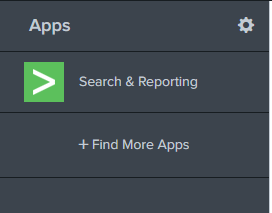

You can also switch between the Splunk Apps directly from the Splunk Bar, as shown below, without using the Apps Panel.

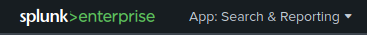

#### Explore Splunk

The next section is **Explore Splunk**. This panel contains quick links to add data to the Splunk instance, add new Splunk apps, and access the Splunk documentation.

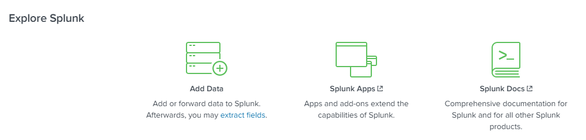

#### Splunk Dashboard

The last section is the **Home Dashboard**. By default, no dashboards are displayed. You can choose from a range of dashboards readily available within your Splunk instance. You can select a dashboard from the dropdown menu or by visiting the **dashboards listing page**.

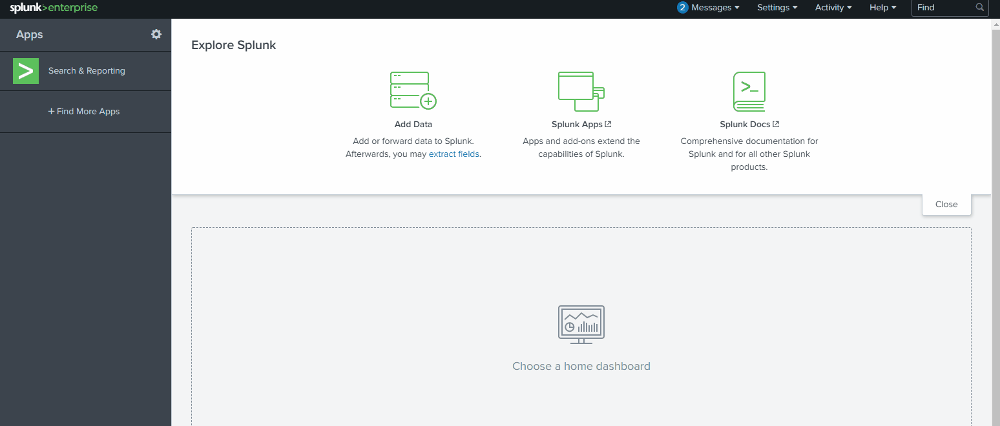

You can also create dashboards and add them to the Home Dashboard. The dashboards you create can be viewed separately from the other dashboards by clicking on the **Yours** tab.

Please review the Splunk documentation on Navigating Splunk [here](https://docs.splunk.com/Documentation/Splunk/8.1.2/SearchTutorial/NavigatingSplunk).

---------------------------------------------------------------------------------------

#### In the Add Data tab, which option is used to collect data from files and ports?

Browse to the Add Data tab (`http://10.112.189.194/en-US/manager/search/adddata`) and check the web page.

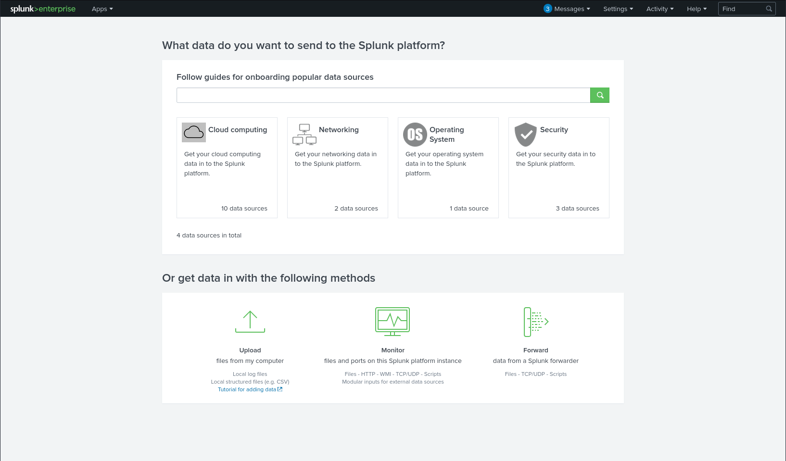

Answer: `Monitor`

---------------------------------------------------------------------------------------

### Task 5 - Adding Data

Splunk can ingest any data. According to the Splunk documentation, when data is added to Splunk, the data is processed and transformed into a series of individual events. The data sources can be event logs, website logs, firewall logs, etc. The data sources are grouped into categories.

Below is a chart listing from the Splunk documentation detailing each data source category.

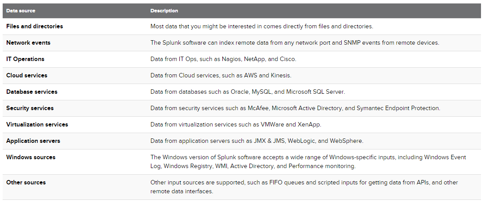

In this task, we're going to focus on **VPN logs**. We're presented with the following screen when we click on the `Add Data` link on the Splunk home screen.

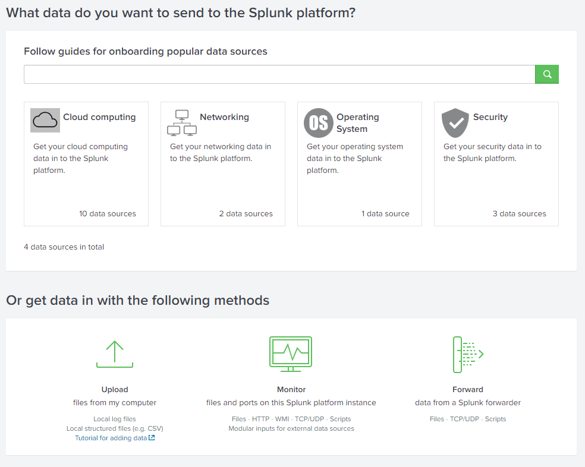

We will use the `Upload` Option to upload the data from our local machine.

#### Practical

Download the log file `VPN_logs` from the **Download Task Files** button below and upload it to the Splunk instance we started in Task #2. If you are using the AttackBox, the log file is available in the `/root/Rooms/SplunkBasic/` directory.

To upload the data successfully, you must follow five steps, which are explained below:

- **Select Source**: Choose the Log file and the data source.
- **Select Source Type**: Select what type of logs are being ingested, e.g, JSON, syslog.
- **Input Settings**: Select the index where these logs will be dumped and the HOSTNAME to be associated with the logs.
- **Review**: Review all the configurations.
- **Done**: Complete the upload. Your data will be uploaded successfully and ready to be analyzed.

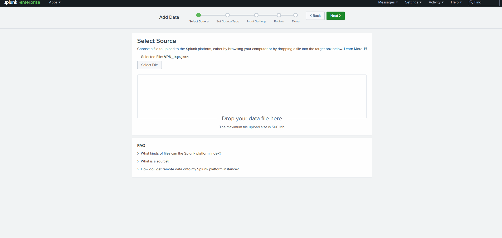

#### Import settings

The downloaded `VPN_logs` file is newline-delimited JSON. Use the Splunk upload wizard so Splunk treats each line as one event.

1. Open **Add Data** and choose **Upload**.
2. Select the downloaded `VPN_logs` file.
3. Keep the JSON source type detected by Splunk.
4. On **Input Settings**, create or select the index `VPN_Logs`.
5. After the upload completes, open **Search & Reporting** and set the time picker to **All time**.

If the field names do not appear in search results, add `| spath` after the base search. That tells Splunk to parse the JSON fields from each event.

#### Useful checks

Use these searches to check your import before answering the questions:

```text
index=VPN_Logs
| stats count
```

```text
index=VPN_Logs
| spath
| search UserName="Maleena"
| stats count
```

```text
index=VPN_Logs
| spath
| search Source_ip="107.14.182.38"
| stats values(UserName) as UserName count
```

```text
index=VPN_Logs
| spath
| search Source_Country!="France"
| stats count
```

```text
index=VPN_Logs
| spath
| search Source_ip="107.3.206.58"
| stats count
```

---------------------------------------------------------------------------------------

#### Upload the data attached to this task and create an index "VPN_Logs". How many events are present in the log file?

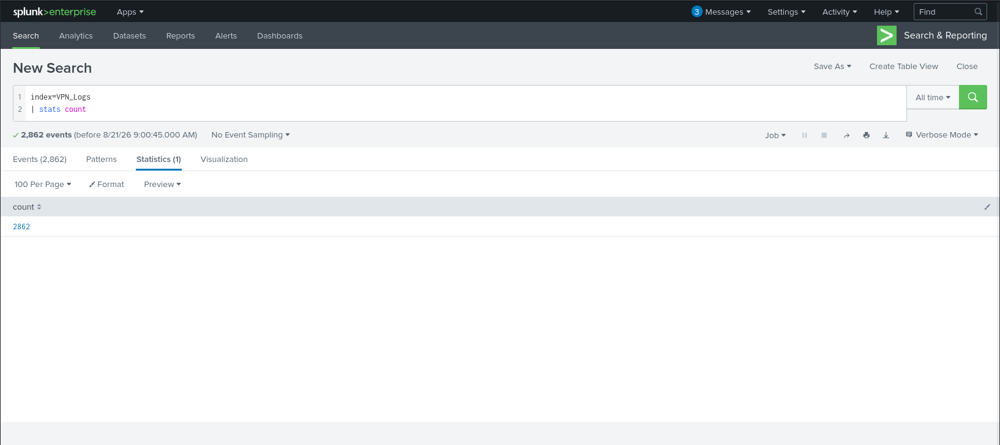

Answer: `2862`

#### How many log events are captured by the user Maleena?

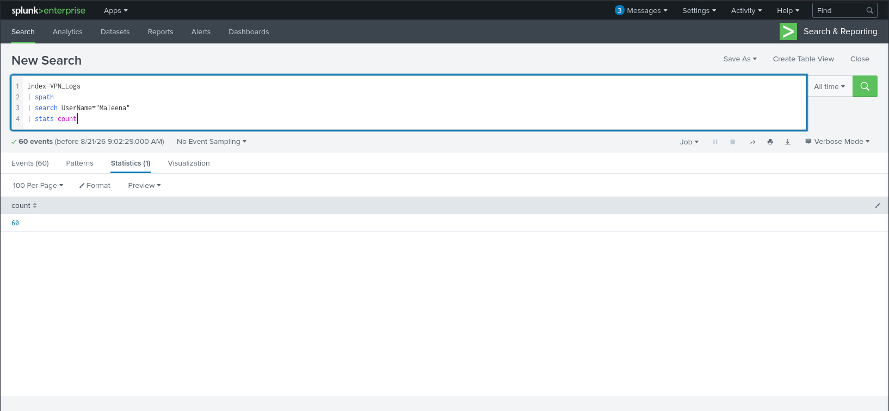

Answer: `60`

#### What is the username associated with IP 107.14.182.38?

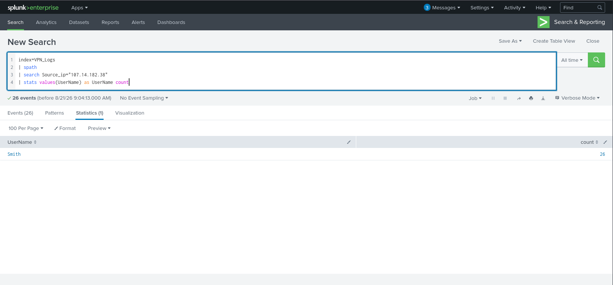

Answer: `Smith`

#### What is the number of events that originated from all countries except France?

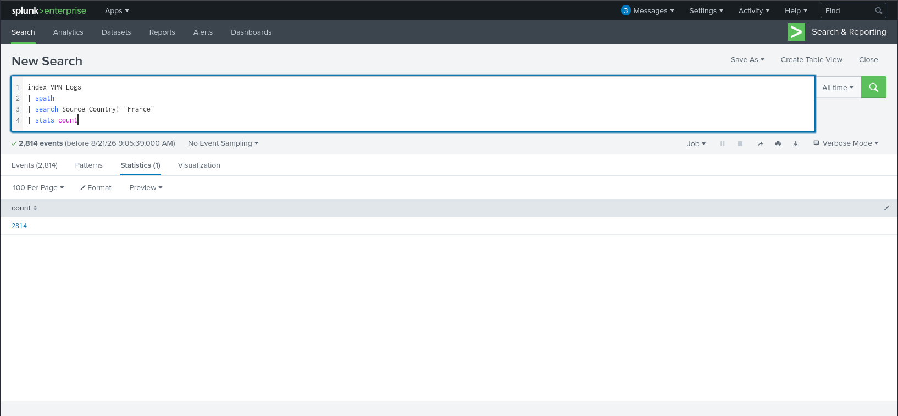

Answer: `2814`

#### How many VPN events were associated with the IP 107.3.206.58?

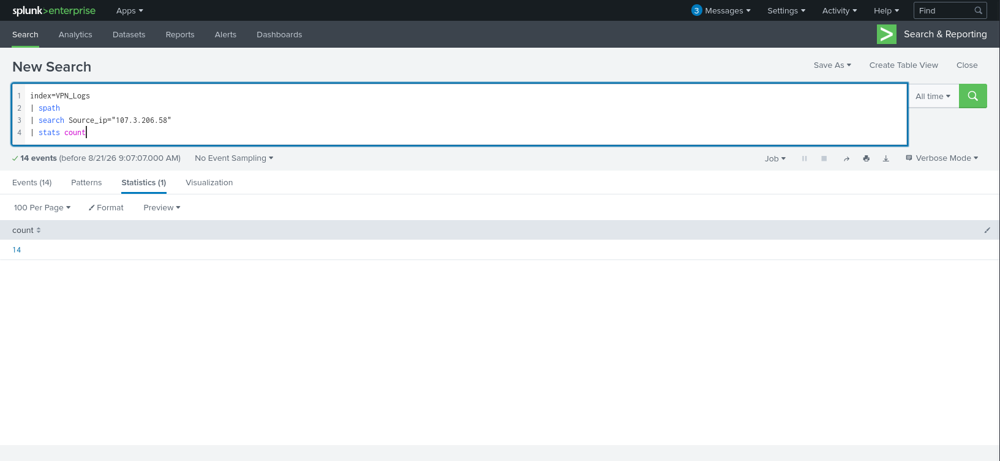

Answer: `14`

---------------------------------------------------------------------------------------

### Task 6 - Conclusion

Well done! In this room, you learned about Splunk's core components, explored the Splunk interface, and practiced uploading data to Splunk. You have gained the foundational knowledge of Splunk SIEM.

If you'd like to dig deeper, you can explore the following Splunk walkthrough and challenge rooms to understand how Splunk is effectively used in investigating incidents.

- [Splunk: Exploring SPL](https://tryhackme.com/room/splunkexploringspl)
- [Incident Handling with Splunk](https://tryhackme.com/room/splunk201)
- [Investigating With Splunk](http://tryhackme.com/jr/investigatingwithsplunk)
- [Benign - Challenge](http://tryhackme.com/jr/benign)
- [PoshEclipse - Challenge](http://tryhackme.com/jr/posheclipse)

---------------------------------------------------------------------------------------

For additional information, please see the references below.

## References

- [Command quick reference - Splunk](https://help.splunk.com/en/splunk-enterprise/search/spl-search-reference/9.4/quick-reference/command-quick-reference#dea1673fb46084c8180b8cf3556870a68--en__Command_quick_reference)
- [Data Sources - Splunk](https://research.splunk.com/sources/)
- [Navigating Splunk Web - Splunk](https://docs.splunk.com/Documentation/Splunk/8.1.2/SearchTutorial/NavigatingSplunk)
- [Security information and event management - Wikipedia](https://en.wikipedia.org/wiki/Security_information_and_event_management)
- [SPL - Splexicon - Splunk](https://docs.splunk.com/Splexicon:SPL)
- [Splunk - Wikipedia](https://en.wikipedia.org/wiki/Splunk)
