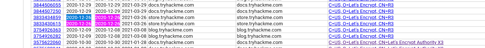

# Subdomain Enumeration

- [Room information](#room-information)
- [Solution](#solution)
- [References](#references)

## Room information

```text
Type: Walkthrough
Difficulty: Easy
OS: N/A
Subscription type: Premium
Description:
Learn the various ways of discovering subdomains to expand your attack surface of a target.
```

Room link: [https://tryhackme.com/room/subdomainenumeration](https://tryhackme.com/room/subdomainenumeration)

## Solution

### Task 1: Brief

Subdomain enumeration is the process of finding valid subdomains for a domain, but why do we do this? We do this to expand our attack surface to try and discover more potential points of vulnerability.

We will explore three different subdomain enumeration methods: Brute Force, OSINT (Open-Source Intelligence) and Virtual Host.

Start the machine and then move onto the next task.

---------------------------------------------------------------------------------------

#### What is a subdomain enumeration method beginning with B?

Answer: `Brute Force`

#### What is a subdomain enumeration method beginning with O?

Answer: `OSINT`

#### What is a subdomain enumeration method beginning with V?

Answer: `Virtual Host`

### Task 2: OSINT - SSL/TLS Certificates

When an SSL/TLS (Secure Sockets Layer/Transport Layer Security) certificate is created for a domain by a CA (Certificate Authority), CA's take part in what's called "Certificate Transparency (CT) logs". These are publicly accessible logs of every SSL/TLS certificate created for a domain name. The purpose of Certificate Transparency logs is to stop malicious and accidentally made certificates from being used. We can use this service to our advantage to discover subdomains belonging to a domain, sites like `https://crt.sh` offer a searchable database of certificates that shows current and historical results.

Go to crt.sh and search for the domain name tryhackme.com, find the entry that was logged at 2020-12-26 and enter the domain below to answer the question.

---------------------------------------------------------------------------------------

#### What domain was logged on crt.sh at 2020-12-26?

Search for the `tryhackme.com` domain on [crt.sh](https://crt.sh) and then search for `2020-12-26` on the resulting page



Answer: `store.tryhackme.com`

### Task 3: OSINT - Search Engines

Search engines contain trillions of links to more than a billion websites, which can be an excellent resource for finding new subdomains. Using advanced search methods on websites like Google, such as the `site: filter`, can narrow the search results. For example, `site:*.domain.com -site:www.domain.com` would only contain results leading to the domain name `domain.com` but exclude any links to `www.domain.com`; therefore, it shows us only subdomain names belonging to `domain.com`.

Go to [Google](https://tryhackme.com/room/google.com) and use the search term `site:*.tryhackme.com -site:www.tryhackme.com`, which should reveal a subdomain for tryhackme.com; use that subdomain to answer the question below.

---------------------------------------------------------------------------------------

#### What is the TryHackMe subdomain beginning with S discovered using the above Google search?


Answer: `store.tryhackme.com`

### Task 4: DNS Bruteforce

Bruteforce DNS (Domain Name System) enumeration is the method of trying tens, hundreds, thousands or even millions of different possible subdomains from a pre-defined list of commonly used subdomains. Because this method requires many requests, we automate it with tools to make the process quicker. In this instance, we are using a tool called dnsrecon to perform this. Click the "View Site" button to open the static site, press the "Run DNSrecon Request" button to start the simulation, and then answer the question below.

---------------------------------------------------------------------------------------

#### What is the first subdomain found with the dnsrecon tool?

```bash
user@thm:~$ dnsrecon -t brt -d acmeitsupport.thm
[*] No file was specified with domains to check.
[*] Using file provided with tool: /usr/share/dnsrecon/namelist.txt
[*]     A api.acmeitsupport.thm 10.10.10.10
[*]     A www.acmeitsupport.thm 10.10.10.10
[+] 2 Record Found
user@thm:~$
```

Answer: `api.acmeitsupport.thm`

### Task 5: OSINT - Sublist3r

To speed up the process of OSINT subdomain discovery, we can automate the above methods with the help of tools like [Sublist3r](https://www.kali.org/tools/sublist3r/), click the "View Site" button to open up the static site and run the sublist3r simulation to discover a new subdomain that will help answer the question below.

---------------------------------------------------------------------------------------

#### What is the first subdomain discovered by sublist3r?

```bash
user@thm:~$ ./sublist3r.py -d acmeitsupport.thm

          ____        _     _ _     _   _____
         / ___| _   _| |__ | (_)___| |_|___ / _ __
         \___ \| | | | '_ \| | / __| __| |_ \| '__|
          ___) | |_| | |_) | | \__ \ |_ ___) | |
         |____/ \__,_|_.__/|_|_|___/\__|____/|_|

         # Coded By Ahmed Aboul-Ela - @aboul3la

[-] Enumerating subdomains now for acmeitsupport.thm
[-] Searching now in Baidu..
[-] Searching now in Yahoo..
[-] Searching now in Google..
[-] Searching now in Bing..
[-] Searching now in Ask..
[-] Searching now in Netcraft..
[-] Searching now in Virustotal..
[-] Searching now in ThreatCrowd..
[-] Searching now in SSL Certificates..
[-] Searching now in PassiveDNS..
[-] Searching now in Virustotal..
[-] Total Unique Subdomains Found: 2
web55.acmeitsupport.thm
www.acmeitsupport.thm
user@thm:~$
```

Answer: `web55.acmeitsupport.thm`

### Task 6: Virtual Hosts

Some subdomains aren't always hosted in publically accessible DNS results, such as development versions of a web application or administration portals. Instead, the DNS record could be kept on a private DNS server or recorded on the developer's machines in their **/etc/hosts** file (or **c:\windows\system32\drivers\etc\hosts** file for Windows users), which maps domain names to IP addresses.

Because web servers can host multiple websites from one server when a website is requested from a client, the server knows which website the client wants from the Host header. We can utilize this host header by making changes to it and monitoring the response to see if we've discovered a new website.

Like with DNS Bruteforce, we can automate this process by using a wordlist of commonly used subdomains.

Start the AttackBox and then try the following command against the Acme IT Support machine to discover a new subdomain.

```bash
user@machine$ ffuf -w /usr/share/wordlists/SecLists/Discovery/DNS/namelist.txt -H "Host: FUZZ.acmeitsupport.thm" -u http://10.10.44.56
```

The above command uses the `-w` switch to specify the wordlist we are going to use. The `-H` switch adds/edits a header (in this instance, the Host header), we have the **FUZZ** keyword in the space where a subdomain would normally go, and this is where we will try all the options from the wordlist.

Because the above command will always produce a valid result, we need to filter the output. We can do this by using the page size result with the -fs switch. Edit the below command replacing {size} with the most occurring size value from the previous result and try it on the AttackBox.

```bash
user@machine$ ffuf -w /usr/share/wordlists/SecLists/Discovery/DNS/namelist.txt -H "Host: FUZZ.acmeitsupport.thm" -u http://10.10.44.56 -fs {size}
```

This command has a similar syntax to the first apart from the `-fs` switch, which tells **ffuf** to ignore any results that are of the specified size.

The above command should have revealed two positive results that we haven't come across before.

---------------------------------------------------------------------------------------

#### What is the first subdomain discovered?

Find out the size to filter

```bash
┌──(kali㉿kali)-[/mnt/…/TryHackMe/Walkthroughs/Easy/Subdomain_Enumeration]
└─$ ffuf -w /usr/share/seclists/Discovery/DNS/namelist.txt -H "Host: FUZZ.acmeitsupport.thm" -u http://10.10.44.56 | head -n 15

        /'___\  /'___\           /'___\       
       /\ \__/ /\ \__/  __  __  /\ \__/       
       \ \ ,__\\ \ ,__\/\ \/\ \ \ \ ,__\      
        \ \ \_/ \ \ \_/\ \ \_\ \ \ \ \_/      
         \ \_\   \ \_\  \ \____/  \ \_\       
          \/_/    \/_/   \/___/    \/_/       

       v2.1.0-dev
________________________________________________

 :: Method           : GET
 :: URL              : http://10.10.44.56
 :: Wordlist         : FUZZ: /usr/share/seclists/Discovery/DNS/namelist.txt
 :: Header           : Host: FUZZ.acmeitsupport.thm
 :: Follow redirects : false
 :: Calibration      : false
 :: Timeout          : 10
 :: Threads          : 40
 :: Matcher          : Response status: 200-299,301,302,307,401,403,405,500
________________________________________________

0                       [Status: 200, Size: 2395, Words: 503, Lines: 52, Duration: 44ms]
11                      [Status: 200, Size: 2395, Words: 503, Lines: 52, Duration: 44ms]
3                       [Status: 200, Size: 2395, Words: 503, Lines: 52, Duration: 46ms]
03                      [Status: 200, Size: 2395, Words: 503, Lines: 52, Duration: 46ms]
02                      [Status: 200, Size: 2395, Words: 503, Lines: 52, Duration: 46ms]
01                      [Status: 200, Size: 2395, Words: 503, Lines: 52, Duration: 45ms]
1                       [Status: 200, Size: 2395, Words: 503, Lines: 52, Duration: 45ms]
aacelearning            [Status: 200, Size: 2395, Words: 503, Lines: 52, Duration: 48ms]
10                      [Status: 200, Size: 2395, Words: 503, Lines: 52, Duration: 48ms]
3com                    [Status: 200, Size: 2395, Words: 503, Lines: 52, Duration: 48ms]
a02                     [Status: 200, Size: 2395, Words: 503, Lines: 52, Duration: 48ms]
4                       [Status: 200, Size: 2395, Words: 503, Lines: 52, Duration: 48ms]
aaaowa                  [Status: 200, Size: 2395, Words: 503, Lines: 52, Duration: 50ms]
aaapi                   [Status: 200, Size: 2395, Words: 503, Lines: 52, Duration: 49ms]
16                      [Status: 200, Size: 2395, Words: 503, Lines: 52, Duration: 50ms]
```

A size of `2395` should be filtered. Then we scan for virtual hosts

```bash
┌──(kali㉿kali)-[/mnt/…/TryHackMe/Walkthroughs/Easy/Subdomain_Enumeration]
└─$ ffuf -w /usr/share/seclists/Discovery/DNS/namelist.txt -H "Host: FUZZ.acmeitsupport.thm" -u http://10.10.44.56 -fs 2395

        /'___\  /'___\           /'___\       
       /\ \__/ /\ \__/  __  __  /\ \__/       
       \ \ ,__\\ \ ,__\/\ \/\ \ \ \ ,__\      
        \ \ \_/ \ \ \_/\ \ \_\ \ \ \ \_/      
         \ \_\   \ \_\  \ \____/  \ \_\       
          \/_/    \/_/   \/___/    \/_/       

       v2.1.0-dev
________________________________________________

 :: Method           : GET
 :: URL              : http://10.10.44.56
 :: Wordlist         : FUZZ: /usr/share/seclists/Discovery/DNS/namelist.txt
 :: Header           : Host: FUZZ.acmeitsupport.thm
 :: Follow redirects : false
 :: Calibration      : false
 :: Timeout          : 10
 :: Threads          : 40
 :: Matcher          : Response status: 200-299,301,302,307,401,403,405,500
 :: Filter           : Response size: 2395
________________________________________________

api                     [Status: 200, Size: 31, Words: 4, Lines: 1, Duration: 49ms]
delta                   [Status: 200, Size: 51, Words: 7, Lines: 1, Duration: 46ms]
yellow                  [Status: 200, Size: 56, Words: 8, Lines: 1, Duration: 59ms]
:: Progress: [151265/151265] :: Job [1/1] :: 796 req/sec :: Duration: [0:03:31] :: Errors: 0 ::
```

Things have changed on the machine since the room was released because the correct answer is `delta`

Answer: `delta`

#### What is the second subdomain discovered?

Answer: `yellow`

For additional information, please see the references below.

## References

- [Brute-force attack - Wikipedia](https://en.wikipedia.org/wiki/Brute-force_attack)
- [Certificate Transparency - Wikipedia](https://en.wikipedia.org/wiki/Certificate_Transparency)
- [DNSRecon - GitHub](https://github.com/darkoperator/dnsrecon)
- [DNSRecon - Kali Tools](https://www.kali.org/tools/dnsrecon/)
- [Domain name - Wikipedia](https://en.wikipedia.org/wiki/Domain_name)
- [ffuf - GitHub](https://github.com/ffuf/ffuf)
- [ffuf - Kali Tools](https://www.kali.org/tools/ffuf/)
- [Open-source intelligence - Wikipedia](https://en.wikipedia.org/wiki/Open-source_intelligence)
- [Public key certificate - Wikipedia](https://en.wikipedia.org/wiki/Public_key_certificate)
- [sublist3r - GitHub](https://github.com/aboul3la/Sublist3r)
- [sublist3r - Kali Tools](https://www.kali.org/tools/sublist3r/)
- [Transport Layer Security - Wikipedia](https://en.wikipedia.org/wiki/Transport_Layer_Security)
- [Virtual hosting - Wikipedia](https://en.wikipedia.org/wiki/Virtual_hosting)
